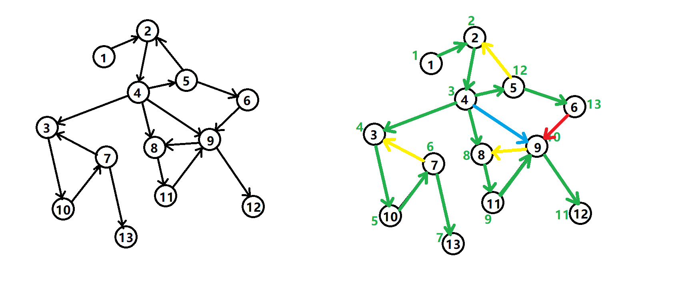

## 简介

在阅读下列内容之前，请务必了解[图论基础](/graph/basic)部分。

强连通的定义是：有向图 G 强连通是指，G 中任意两个结点连通。

强连通分量（Strongly Connected Components，SCC）的定义是：极大的强连通子图。

这里想要介绍的是如何来求强连通分量。

## Tarjan 算法

Robert E. Tarjan (1948~) 美国人。

Tarjan 发明了很多算法结构。光 Tarjan 算法就有很多，比如求各种联通分量的 Tarjan 算法，求 LCA（Lowest Common Ancestor，最近公共祖先）的 Tarjan 算法。并查集、Splay、Toptree 也是 Tarjan 发明的。

我们这里要介绍的是在有向图中求强连通分量的 Tarjan 算法。

另外，Tarjan 的名字 `j` 不发音，中文译为塔扬。

### DFS 生成树

在介绍该算法之前，先来了解 **DFS 生成树** ，我们以下面的有向图为例：



有向图的 DFS 生成树主要有 4 种边（不一定全部出现）：

1.  树边（tree edge）：绿色边，每次搜索找到一个还没有访问过的结点的时候就形成了一条树边。
2.  反祖边（back edge）：黄色边，也被叫做回边，即指向祖先结点的边。
3.  横叉边（cross edge）：红色边，它主要是在搜索的时候遇到了一个已经访问过的结点，但是这个结点 **并不是** 当前结点的祖先时形成的。
4.  前向边（forward edge）：蓝色边，它是在搜索的时候遇到子树中的结点的时候形成的。

我们考虑 DFS 生成树与强连通分量之间的关系。

如果结点 $u$ 是某个强连通分量在搜索树中遇到的第一个结点，那么这个强连通分量的其余结点肯定是在搜索树中以 $u$ 为根的子树中。 $u$ 被称为这个强连通分量的根。

反证法：假设有个结点 $v$ 在该强连通分量中但是不在以 $u$ 为根的子树中，那么 $u$ 到 $v$ 的路径中肯定有一条离开子树的边。但是这样的边只可能是横叉边或者反祖边，然而这两条边都要求指向的结点已经被访问过了，这就和 $u$ 是第一个访问的结点矛盾了。得证。

### Tarjan 算法求强连通分量

在 Tarjan 算法中为每个结点 $u$ 维护了以下几个变量：

1.   $DFN[u]$ ：深度优先搜索遍历时结点 $u$ 被搜索的次序。
2.   $LOW[u]$ ：设以 $u$ 为根的子树为 $Subtree(u)$ 。 $LOW[u]$ 定义为以下结点的 $DFN$ 的最小值： $Subtree(u)$ 中的结点；从 $Subtree(u)$ 通过一条不在搜索树上的边能到达的结点。

一个结点的子树内结点的 DFN 都大于该结点的 DFN。

从根开始的一条路径上的 DFN 严格递增，LOW 严格非降。

按照深度优先搜索算法搜索的次序对图中所有的结点进行搜索。在搜索过程中，对于结点 $u$ 和与其相邻的结点 $v$ （v 不是 u 的父节点）考虑 3 种情况：

1.   $v$ 未被访问：继续对 $v$ 进行深度搜索。在回溯过程中，用 $LOW[v]$ 更新 $LOW[u]$ 。因为存在从 $u$ 到 $v$ 的直接路径，所以 $v$ 能够回溯到的已经在栈中的结点， $u$ 也一定能够回溯到。
2.   $v$ 被访问过，已经在栈中：即已经被访问过，根据 $LOW$ 值的定义（能够回溯到的最早的已经在栈中的结点），则用 $DFN[v]$ 更新 $LOW[u]$ 。
3.   $v$ 被访问过，已不在在栈中：说明 $v$ 已搜索完毕，其所在连通分量已被处理，所以不用对其做操作。

将上述算法写成伪代码：

    TARJAN_SEARCH(int u)
        vis[u]=true
        low[u]=dfn[u]=++dfncnt
        push u to the stack
        for each (u,v) then do
            if v hasn't been search then
                TARJAN_SEARCH(v) // 搜索
                low[u]=min(low[u],low[v])// 回溯
            else if v has been in the stack then
                low[u]=min(low[u],dfn[v])

对于一个连通分量图，我们很容易想到，在该连通图中有且仅有一个 $DFN[u]=LOW[u]$ 。该结点一定是在深度遍历的过程中，该连通分量中第一个被访问过的结点，因为它的 DFN 值和 LOW 值最小，不会被该连通分量中的其他结点所影响。

因此，在回溯的过程中，判定 $DFN[u]=LOW[u]$ 的条件是否成立，如果成立，则栈中从 $u$ 后面的结点构成一个 SCC。

### 实现

```cpp
int dfn[N], low[N], dfncnt, s[N], tp;
int scc[N], sc;  // 结点 i 所在 scc 的编号
int sz[N];       // 强连通 i 的大小
void tarjan(int u) {
  low[u] = dfn[u] = ++dfncnt, s[++tp] = u;
  for (int i = h[u]; i; i = e[i].nex) {
    const int &v = e[i].t;
    if (!dfn[v])
      tarjan(v), low[u] = min(low[u], low[v]);
    else if (!scc[v])
      low[u] = min(low[u], dfn[v]);
  }
  if (dfn[u] == low[u]) {
    ++sc;
    while (s[tp] != u) scc[s[tp]] = sc, sz[sc]++, --tp;
    scc[s[tp]] = sc, sz[sc]++, --tp;
  }
}
```

时间复杂度 $O(n + m)$ 。

## Kosaraju 算法

Kosaraju 算法依靠两次简单的 DFS 实现。

第一次 DFS，选取任意顶点作为起点，遍历所有为访问过的顶点，并在回溯之前给顶点编号，也就是后序遍历。

第二次 DFS，对于反向后的图，以标号最大的顶点作为起点开始 DFS。这样遍历到的顶点集合就是一个强连通分量。对于所有未访问过的结点，选取标号最大的，重复上述过程。

两次 DFS 结束后，强连通分量就找出来了，Kosaraju 算法的时间复杂度为 $O(n+m)$ 。

### 实现

```cpp
// g 是原图，g2 是反图

void dfs1(int u) {
  vis[u] = true;
  for (int v : g[u])
    if (!vis[v]) dfs1(v);
  s.push_back(v);
}

void dfs2(int u) {
  color[u] = sccCnt;
  for (int v : g2[u])
    if (!color[v]) dfs2(v);
}

void kosaraju() {
  sccCnt = 0;
  for (int i = 1; i <= n; ++i)
    if (!vis[i]) dfs1(i);
  for (int i = n; i >= 1; --i)
    if (!color[s[i]]) {
      ++sccCnt;
      dfs2(s[i])
    }
}
```

## Garbow 算法

## 应用

我们可以将一张图的每个强连通分量都缩成一个点。

然后这张图会变成一个 DAG（为什么？）。

DAG 好啊，能拓扑排序了就能做很多事情了。

举个简单的例子，求一条路径，可以经过重复结点，要求经过的不同结点数量最多。

## 推荐题目

[USACO Fall/HAOI 2006 受欢迎的牛](https://www.lydsy.com/JudgeOnline/problem.php?id=1051)

[POJ1236 Network of Schools](http://poj.org/problem?id=1236)
