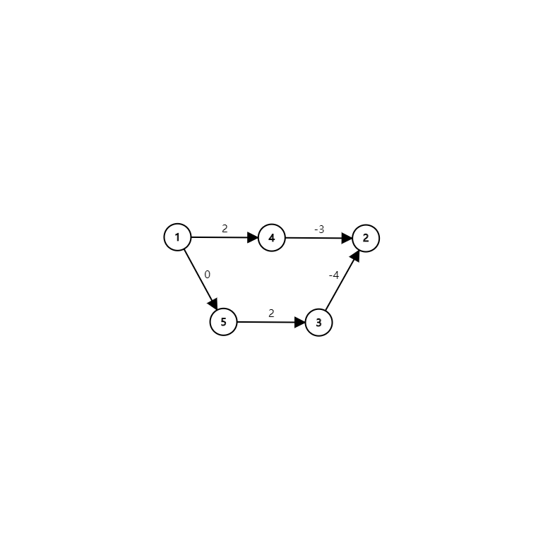
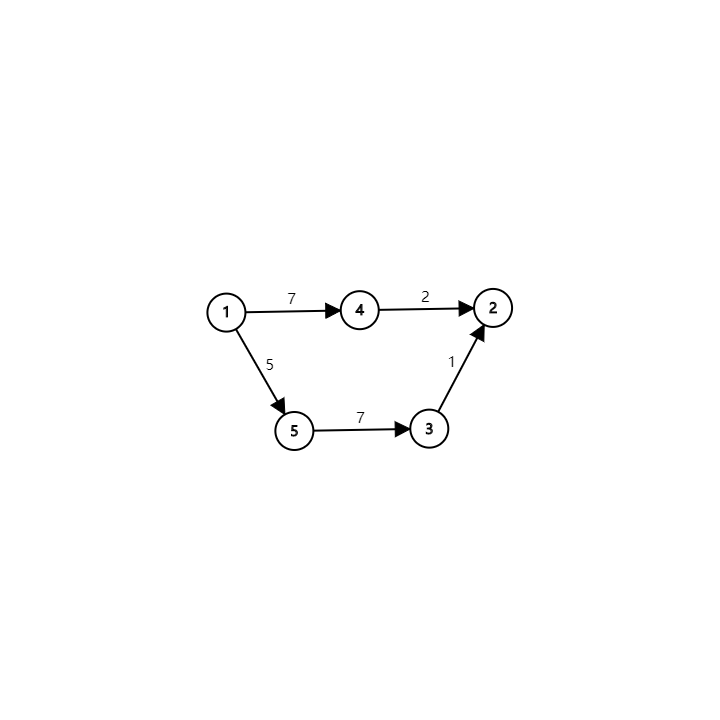

## 定义

（还记得这些定义吗？在阅读下列内容之前，请务必了解 [图论相关概念](./concept.md) 中的基础部分。）

- 路径
- 最短路
- 有向图中的最短路、无向图中的最短路
- 单源最短路、每对结点之间的最短路

## 性质

对于边权为正的图，任意两个结点之间的最短路，不会经过重复的结点。

对于边权为正的图，任意两个结点之间的最短路，不会经过重复的边。

对于边权为正的图，任意两个结点之间的最短路，任意一条的结点数不会超过 $n$，边数不会超过 $n-1$。

## Floyd 算法

是用来求任意两个结点之间的最短路的。

复杂度比较高，但是常数小，容易实现。（我会说只有三个 `for` 吗？）

适用于任何图，不管有向无向，边权正负，但是最短路必须存在。（不能有个负环）

### 实现

我们定义一个数组 `f[k][x][y]`，表示只允许经过结点 $1$ 到 $k$（也就是说，在子图 $V'={1, 2, \ldots, k}$ 中的路径，注意，$x$ 与 $y$ 不一定在这个子图中），结点 $x$ 到结点 $y$ 的最短路长度。

很显然，`f[n][x][y]` 就是结点 $x$ 到结点 $y$ 的最短路长度（因为 $V'={1, 2, \ldots, n}$ 即为 $V$ 本身，其表示的最短路径就是所求路径）。

我们来考虑怎么求这个数组

`f[0][x][y]`：$x$ 与 $y$ 的边权，或者 $0$，或者 $+\infty$（`f[0][x][y]` 什么时候应该是 $+\infty$？当 $x$ 与 $y$ 间有直接相连的边的时候，为它们的边权；当 $x = y$ 的时候为零，因为到本身的距离为零；当 $x$ 与 $y$ 没有直接相连的边的时候，为 $+\infty$）。

`f[k][x][y] = min(f[k-1][x][y], f[k-1][x][k]+f[k-1][k][y])`（`f[k-1][x][y]`，为不经过 $k$ 点的最短路径，而 `f[k-1][x][k]+f[k-1][k][y]`，为经过了 $k$ 点的最短路）。

上面两行都显然是对的，所以说这个做法空间是 $O(N^3)$，我们需要依次增加问题规模（$k$ 从 $1$ 到 $n$），判断任意两点在当前问题规模下的最短路。

```cpp
for (k = 1; k <= n; k++) {
  for (i = 1; i <= n; i++) {
    for (j = 1; j <= n; j++) {
      f[k][i][j] = min(f[k - 1][i][j], f[k - 1][i][k] + f[k - 1][k][j]);
    }
  }
}
```

因为第一维对结果无影响，我们可以发现数组的第一维是可以省略的，于是可以直接改成 `f[x][y] = min(f[x][y], f[x][k]+f[k][y])`。

???+ note "证明第一维对结果无影响"
    我们注意到如果放在一个给定第一维 `k` 二维数组中，`f[i][k]` 与 `f[k][j]` 在某一行和某一列。而 `f[i][j]` 则是该行和该列的交叉点上的元素。
    
    现在我们需要证明将 `f[k][i][j]` 直接在原地更改也不会更改它的结果：我们注意到 `f[k][i][j]` 的涵义是第一维为 `k-1` 这一行和这一列的所有元素的最小值，包含了 `f[k-1][i][j]`，那么我在原地进行更改也不会改变最小值的值，因为如果将该三维矩阵压缩为二维，则所求结果 `f[i][j]` 一开始即为原 `f[k-1][i][j]` 的值，最后依然会成为该行和该列的最小值。
    
    故可以压缩。

```cpp
for (k = 1; k <= n; k++) {
  for (i = 1; i <= n; i++) {
    for (j = 1; j <= n; j++) {
      f[i][j] = min(f[i][j], f[i][k] + f[k][j]);
    }
  }
}
```

综上时间复杂度是 $O(N^3)$，空间复杂度是 $O(N^2)$。

### 应用

???+ question "给一个正权无向图，找一个最小权值和的环。"
    首先这一定是一个简单环。
    
    想一想这个环是怎么构成的。
    
    考虑环上编号最大的结点 u。
    
    `f[u-1][x][y]` 和 (u,x), (u,y）共同构成了环。
    
    在 Floyd 的过程中枚举 u，计算这个和的最小值即可。
    
    $O(n^3)$。

???+question "已知一个有向图中任意两点之间是否有连边，要求判断任意两点是否连通。"
    该问题即是求 **图的传递闭包**。
    
    我们只需要按照 Floyd 的过程，逐个加入点判断一下。
    
    只是此时的边的边权变为 $1/0$，而取 $\min$ 变成了 **或** 运算。
    
    再进一步用 bitset 优化，复杂度可以到 $O(\frac{n^3}{w})$。
    
    ```cpp
    // std::bitset<SIZE> f[SIZE];
    for (k = 1; k <= n; k++)
      for (i = 1; i <= n; i++)
        if (f[i][k]) f[i] = f[i] | f[k];
    ```

* * *

## Bellman-Ford 算法

一种基于松弛（relax）操作的最短路算法。

支持负权。

能找到某个结点出发到所有结点的最短路，或者报告某些最短路不存在。

在国内 OI 界，你可能听说过的“SPFA”，就是 Bellman-Ford 算法的一种实现。（优化）

### 实现

假设结点为 $S$。

先定义 $dist(u)$ 为 $S$ 到 $u$（当前）的最短路径长度。

$relax(u,v)$ 操作指：$dist(v) = min(dist(v), dist(u) + edge\_len(u, v))$.

$relax$ 是从哪里来的呢？

三角形不等式：$dist(v) \leq dist(u) + edge\_len(u, v)$。

证明：反证法，如果不满足，那么可以用松弛操作来更新 $dist(v)$ 的值。

Bellman-Ford 算法如下：

```text
while (1) for each edge(u, v) relax(u, v);
```

当一次循环中没有松弛操作成功时停止。

每次循环是 $O(m)$ 的，那么最多会循环多少次呢？

答案是 $\infty$！（如果有一个 $S$ 能走到的负环就会这样）

但是此时某些结点的最短路不存在。

我们考虑最短路存在的时候。

由于一次松弛操作会使最短路的边数至少 $+1$，而最短路的边数最多为 $n-1$。

所以最多执行 $n-1$ 次松弛操作，即最多循环 $n-1$ 次。

总时间复杂度 $O(NM)$。**（对于最短路存在的图）**

```text
relax(u, v) {
  dist[v] = min(dist[v], dist[u] + edge_len(u, v));
}
for (i = 1; i <= n; i++) {
  dist[i] = edge_len(S, i);
}
for (i = 1; i < n; i++) {
  for each edge(u, v) {
    relax(u, v);
  }
}
```

注：这里的 $edge\_len(u, v)$ 表示边的权值，如果该边不存在则为 $+\infty$，$u=v$ 则为 $0$。

### 应用

给一张有向图，问是否存在负权环。

做法很简单，跑 Bellman-Ford 算法，如果有个点被松弛成功了 $n$ 次，那么就一定存在。

如果 $n-1$ 次之内算法结束了，就一定不存在。

### 队列优化：SPFA

即 Shortest Path Faster Algorithm。

很多时候我们并不需要那么多无用的松弛操作。

很显然，只有上一次被松弛的结点，所连接的边，才有可能引起下一次的松弛操作。

那么我们用队列来维护“哪些结点可能会引起松弛操作”，就能只访问必要的边了。

```text
q = new queue();
q.push(S);
in_queue[S] = true;
while (!q.empty()) {
  u = q.pop();
  in_queue[u] = false;
  for each edge(u, v) {
    if (relax(u, v) && !in_queue[v]) {
      q.push(v);
      in_queue[v] = true;
    }
  }
}
```

虽然在大多数情况下 SPFA 跑得很快，但其最坏情况下的时间复杂度为 $O(NM)$，将其卡到这个复杂度也是不难的，所以考试时要谨慎使用（在没有负权边时最好使用 Dijkstra 算法，在有负权边且题目中的图没有特殊性质时，若 SPFA 是标算的一部分，题目不应当给出 Bellman-Ford 算法无法通过的数据范围）。

???+note "Bellman-Ford 的其他优化"
    除了队列优化（SPFA）之外，Bellman-Ford 还有其他形式的优化，这些优化在部分图上效果明显，但在某些特殊图上，最坏复杂度可能达到指数级。
    
    - 堆优化：将队列换成堆，与 Dijkstra 的区别是允许一个点多次入队。在有负权边的图可能被卡成指数级复杂度。
    - 栈优化：将队列换成栈（即将原来的 BFS 过程变成 DFS），在寻找负环时可能具有更高效率，但最坏时间复杂度仍然为指数级。
    - LLL 优化：将普通队列换成双端队列，每次将入队结点距离和队内距离平均值比较，如果更大则插入至队尾，否则插入队首。
    - SLF 优化：将普通队列换成双端队列，每次将入队结点距离和队首比较，如果更大则插入至队尾，否则插入队首。
    - D´Esopo-Pape 算法：将普通队列换成双端队列，如果一个节点之前没有入队，则将其插入队尾，否则插入队首。
    
    更多优化以及针对这些优化的 Hack 方法，可以看 [fstqwq 在知乎上的回答](https://www.zhihu.com/question/292283275/answer/484871888)。

## Dijkstra 算法

Dijkstra 是个人名（荷兰姓氏）。

IPA:/ˈdikstrɑ/或/ˈdɛikstrɑ/。

这种算法只适用于非负权图，但是时间复杂度非常优秀。

也是用来求单源最短路径的算法。

### 实现

主要思想是，将结点分成两个集合：已确定最短路长度的，未确定的。

一开始第一个集合里只有 $S$。

然后重复这些操作：

1. 对那些刚刚被加入第一个集合的结点的所有出边执行松弛操作。
2. 从第二个集合中，选取一个最短路长度最小的结点，移到第一个集合中。

直到第二个集合为空，算法结束。

时间复杂度：只用分析集合操作，$n$ 次 `delete-min`，$m$ 次 `decrease-key`。

如果用暴力：$O(n^2 + m) = O(n^2)$。

如果用堆 $O(m \log n)$。

如果用 priority_queue：$O(m \log m)$。

（注：如果使用 priority_queue，无法删除某一个旧的结点，只能插入一个权值更小的编号相同结点，这样操作导致堆中元素是 $O(m)$ 的）

如果用线段树（ZKW 线段树）：$O(m \log n + n) = O(m \log n)$

如果用 Fibonacci 堆：$O(n \log n + m)$（这就是为啥优秀了）。

等等，还没说正确性呢！

分两步证明：先证明任何时候第一个集合中的元素的 $dist$ 一定不大于第二个集合中的。

再证明第一个集合中的元素的最短路已经确定。

第一步，一开始时成立（基础），在每一步中，加入集合的元素一定是最大值，且是另一边最小值，每次松弛操作又是加上非负数，所以仍然成立。（归纳）（利用非负权值的性质）

第二步，考虑每次加进来的结点，到他的最短路，上一步必然是第一个集合中的元素（否则他不会是第二个集合中的最小值，而且有第一步的性质），又因为第一个集合内的点已经全部松弛过了，所以最短路显然确定了。

```text
H = new heap();
H.insert(S, 0);
dist[S] = 0;
for (i = 1; i <= n; i++) {
  u = H.delete_min();
  for each edge(u, v) {
    if (relax(u, v)) {
      H.decrease_key(v, dist[v]);
    }
  }
}
```

以下是该算法的 C++ 实现

```C++
vector<vector<LL>> Ps;  // 图的邻接矩阵
vector<LL> dist;        // min_len 的运行结果存储位置

// i: 源点在点集中的下标
void min_len(size_t i) {
  using Pair = pair<LL, size_t>;  // pair 的排序是先第一分量后第二分量，
                                  // 通过这个可以调整它在堆中的位置

  // 初始化 dist
  for (auto &k : dist) k = LLONG_MAX;
  dist[i] = 0;

  // 初始化小根堆
  priority_queue<Pair, vector<Pair>, greater<Pair>> Q;  // 小根堆
  Q.push(Pair(0, i));

  while (!Q.empty()) {
    auto k = Q.top().second;
    Q.pop();
    for (size_t i = 0; i < Ps[k].size(); i++) {
      // 如果 k 和 i 有边连（这里设置 Ps[k][i] == 0 时无边连接）
      if (Ps[k][i] && dist[k] + Ps[k][i] < dist[i]) {
        // 松弛操作
        dist[i] = dist[k] + Ps[k][i];
        Q.push(Pair(dist[i], i));
      }
    }
  }
}
```

## Johnson 全源最短路径算法

Johnson 和 Floyd 一样，是一种能求出无负环图上任意两点间最短路径的算法。该算法在 1977 年由 Donald B. Johnson 提出。

任意两点间的最短路可以通过枚举起点，跑 $n$ 次 Bellman-Ford 算法解决，时间复杂度是 $O(n^2m)$ 的，也可以直接用 Floyd 算法解决，时间复杂度为 $O(n^3)$。

注意到堆优化的 Dijkstra 算法求单源最短路径的时间复杂度比 Bellman-Ford 更优，如果枚举起点，跑 $n$ 次 Dijkstra 算法，就可以在 $O(nm\log m)$（取决于 Dijkstra 算法的实现）的时间复杂度内解决本问题，比上述跑 $n$ 次 Bellman-Ford 算法的时间复杂度更优秀，在稀疏图上也比 Floyd 算法的时间复杂度更加优秀。

但 Dijkstra 算法不能正确求解带负权边的最短路，因此我们需要对原图上的边进行预处理，确保所有边的边权均非负。

一种容易想到的方法是给所有边的边权同时加上一个正数 $x$，从而让所有边的边权均非负。如果新图上起点到终点的最短路经过了 $k$ 条边，则将最短路减去 $kx$ 即可得到实际最短路。

但这样的方法是错误的。考虑下图：



$1 \to 2$ 的最短路为 $1 \to 5 \to 3 \to 2$，长度为 $−2$。

但假如我们把每条边的边权加上 $5$ 呢？



新图上 $1 \to 2$ 的最短路为 $1 \to 4 \to 2$，已经不是实际的最短路了。

Johnson 算法则通过另外一种方法来给每条边重新标注边权。

我们新建一个虚拟节点（在这里我们就设它的编号为 $0$）。从这个点向其他所有点连一条边权为 $0$ 的边。

接下来用 Bellman-Ford 算法求出从 $0$ 号点到其他所有点的最短路，记为 $h_i$。

假如存在一条从 $u$ 点到 $v$ 点，边权为 $w$ 的边，则我们将该边的边权重新设置为 $w+h_u-h_v$。

接下来以每个点为起点，跑 $n$ 轮 Dijkstra 算法即可求出任意两点间的最短路了。

一开始的 Bellman-Ford 算法并不是时间上的瓶颈，若使用 `priority_queue` 实现 Dijkstra 算法，该算法的时间复杂度是 $O(nm\log m)$。

### 正确性证明

为什么这样重新标注边权的方式是正确的呢？

在讨论这个问题之前，我们先讨论一个物理概念——势能。

诸如重力势能，电势能这样的势能都有一个特点，势能的变化量只和起点和终点的相对位置有关，而与起点到终点所走的路径无关。

势能还有一个特点，势能的绝对值往往取决于设置的零势能点，但无论将零势能点设置在哪里，两点间势能的差值是一定的。

接下来回到正题。

在重新标记后的图上，从 $s$ 点到 $t$ 点的一条路径 $s \to p_1 \to p_2 \to \dots \to p_k \to t$ 的长度表达式如下：

$(w(s,p_1)+h_s-h_{p_1})+(w(p_1,p_2)+h_{p_1}-h_{p_2})+ \dots +(w(p_k,t)+h_{p_k}-h_t)$

化简后得到：

$w(s,p_1)+w(p_1,p_2)+ \dots +w(p_k,t)+h_s-h_t$

无论我们从 $s$ 到 $t$ 走的是哪一条路径，$h_s-h_t$ 的值是不变的，这正与势能的性质相吻合！

为了方便，下面我们就把 $h_i$ 称为 $i$ 点的势能。

上面的新图中 $s \to t$ 的最短路的长度表达式由两部分组成，前面的边权和为原图中 $s \to t$ 的最短路，后面则是两点间的势能差。因为两点间势能的差为定值，因此原图上 $s \to t$ 的最短路与新图上 $s \to t$ 的最短路相对应。

到这里我们的正确性证明已经解决了一半——我们证明了重新标注边权后图上的最短路径仍然是原来的最短路径。接下来我们需要证明新图中所有边的边权非负，因为在非负权图上，Dijkstra 算法能够保证得出正确的结果。

根据三角形不等式，图上任意一边 $(u,v)$ 上两点满足：$h_v \leq h_u + w(u,v)$。这条边重新标记后的边权为 $w'(u,v)=w(u,v)+h_u-h_v \geq 0$。这样我们证明了新图上的边权均非负。

这样，我们就证明了 Johnson 算法的正确性。

* * *

## 不同方法的比较

| 最短路算法    | Floyd      | Bellman-Ford | Dijkstra     | Johnson       |
| -------- | ---------- | ------------ | ------------ | ------------- |
| 最短路类型    | 每对结点之间的最短路 | 单源最短路        | 单源最短路        | 每对结点之间的最短路    |
| 作用于      | 没有负环的图     | 任意图          | 非负权图         | 没有负环的图        |
| 能否检测负环？  | 能          | 能            | 不能           | 不能            |
| 推荐作用图的大小 | 小          | 中/小          | 大/中          | 大/中           |
| 时间复杂度    | $O(N^3)$   | $O(NM)$      | $O(M\log M)$ | $O(NM\log M)$ |

注：表中的 Dijkstra 算法在计算复杂度时均用 `priority_queue` 实现。

## 输出方案

开一个 `pre` 数组，在更新距离的时候记录下来后面的点是如何转移过去的，算法结束前再递归地输出路径即可。

比如 Floyd 就要记录 `pre[i][j] = k;`，Bellman-Ford 和 Dijkstra 一般记录 `pre[v] = u`。

**本页面部分内容译自博文 [Тернарный поиск](http://e-maxx.ru/algo/levit_algorithm) 与其英文翻译版 [D´Esopo-Pape algorithm](https://cp-algorithms.com/graph/desopo_pape.html)。其中俄文版版权协议为 Public Domain + Leave a Link；英文版版权协议为 CC-BY-SA 4.0。**
