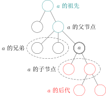
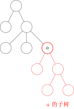

图论中的树和现实生活中的树长得一样，只不过我们习惯于处理问题的时候把树根放到上方来考虑。这种数据结构看起来像是一个倒挂的树，因此得名。

一个没有固定根结点的树称为 **无根树**（unrooted tree）。无根树有几种等价的形式化定义：

- 有 $n$ 个结点，$n-1$ 条边的连通无向图

- 无向无环的连通图

- 任意两个结点之间有且仅有一条简单路径的无向图

- 任何边均为桥的连通图

- 没有圈，且在任意不同两点间添加一条边之后所得图含唯一的一个圈的图

在无根树的基础上，指定一个结点称为 **根**，则形成一棵 **有根树**（rooted tree）。有根树在很多时候仍以无向图表示，只是规定了结点之间的上下级关系，详见下文。

## 有关树的定义

### 适用于无根树和有根树

- **森林（forest）**：每个连通分量（连通块）都是树的图。按照定义，一棵树也是森林。

- **生成树（spanning tree）**：一个连通无向图的生成子图，同时要求是树。也即在图的边集中选择 $n - 1$ 条，将所有顶点连通。

- **结点的深度（depth）**：到根结点的路径上的边数。

- **树的高度（height）**：所有结点的深度的最大值。

- **无根树的叶结点（leaf node）**：度数不超过 $1$ 的结点。

???+question " 为什么不是度数恰为 $1$ ？"
    考虑 $n = 1$。

- **有根树的叶结点（leaf node）**：没有子结点的结点。

### 只适用于有根树

-   **父亲（parent node）**：对于除根以外的每个结点，定义为从该结点到根路径上的第二个结点。
    根结点没有父结点。

-   **祖先（ancestor）**：一个结点到根结点的路径上，除了它本身外的结点。
    根结点的祖先集合为空。

-   **子结点（child node）**：如果 $u$ 是 $v$ 的父亲，那么 $v$ 是 $u$ 的子结点。  
    子结点的顺序一般不加以区分，二叉树是一个例外。

- **兄弟（sibling）**：同一个父亲的多个子结点互为兄弟。

-   **后代（descendant）**：子结点和子结点的后代。  
    或者理解成：如果 $u$ 是 $v$ 的祖先，那么 $v$ 是 $u$ 的后代。



- **子树（subtree）**：删掉与父亲相连的边后，该结点所在的子图。



## 特殊的树

- **链（chain/path graph）**：满足与任一结点相连的边不超过 $2$ 条的树称为链。

- **菊花/星星（star）**：满足存在 $u$ 使得所有除 $u$ 以外结点均与 $u$ 相连的树称为菊花。

-   **有根二叉树（rooted binary tree）**：每个结点最多只有两个儿子（子结点）的有根树称为二叉树。常常对两个子结点的顺序加以区分，分别称之为左子结点和右子结点。  
    大多数情况下，**二叉树** 一词均指有根二叉树。

- **完整二叉树（full/proper binary tree）**：每个结点的子结点数量均为 0 或者 2 的二叉树。换言之，每个结点或者是树叶，或者左右子树均非空。


- **完全二叉树（complete binary tree）**：只有最下面两层结点的度数可以小于 2，且最下面一层的结点都集中在该层最左边的连续位置上。


- **完美二叉树（perfect binary tree）**：所有叶结点的深度均相同的二叉树称为完美二叉树。


???+warning
    Proper binary tree 的汉译名称不固定，且完全二叉树和满二叉树的定义在不同教材中定义不同，遇到的时候需根据上下文加以判断。

OIers 所说的“满二叉树”多指完美二叉树。

## 存储

### 只记录父结点

用一个数组 `parent[N]` 记录每个结点的父亲结点。

这种方式可以获得的信息较少，不便于进行自顶向下的遍历。常用于自底向上的递推问题中。

### 邻接表

-   对于无根树：为每个结点开辟一个线性列表，记录所有与之相连的结点。
    ```cpp
    std::vector<int> adj[N];
    ```
-   对于有根树：
    - 方法一：若给定的是无向图，则仍可以上述形式存储。下文将介绍如何区分结点的上下关系。
    -   方法二：若输入数据能够确保结点的上下关系，则可以利用这个信息。为每个结点开辟一个线性列表，记录其所有子结点；若有需要，还可在另一个数组中记录其父结点。
        ```cpp
        std::vector<int> children[N];
        int parent[N];
        ```
        当然也可以用其他方式（如链表）替代 `std::vector`。

### 左孩子右兄弟表示法

对于有根树，存在一种简单的表示方法。

首先，给每个结点的所有子结点任意确定一个顺序。

此后为每个结点记录两个值：其 **第一个子结点**  `child[u]` 和其 **下一个兄弟结点**  `sib[u]`。若没有子结点，则 `child[u]` 为空；若该结点是其父结点的最后一个子结点，则 `sib[u]` 为空。

遍历一个结点的所有子结点可由如下方式实现。

```cpp
int v = child[u];  // 从第一个子结点开始
while (v != EMPTY_NODE) {
  // ...
  // 处理子结点 v
  // ...
  v = sib[v];  // 转至下一个子结点，即 v 的一个兄弟
}
```

也可简写为以下形式。

```cpp
for (int v = child[u]; v != EMPTY_NODE; v = sib[v]) {
  // ...
  // 处理子结点 v
  // ...
}
```

### 二叉树

需要记录每个结点的左右子结点。

```cpp
int parent[N];
int lch[N], rch[N];
// -- or --
int child[N][2];
```

## 树的遍历

### 树上 DFS

在树上 DFS 是这样的一个过程：先访问根节点，然后分别访问根节点每个儿子的子树。

可以用来求出每个节点的深度、父亲等信息。

### 二叉树上 DFS

（图待补）

#### 先序遍历

先访问根，再访问子节点。

#### 中序遍历

先访问左子树，再访问根，再访问右子树。

#### 后序遍历

先访问子节点，再访问根。

已知中序遍历和另外一个可以求第三个。

### 树上 BFS

从树根开始，严格按照层次来访问节点。

BFS 过程中也可以顺便求出各个节点的深度和父亲节点。

### 无根树

树的遍历一般为深度优先遍历，这个过程中最需要注意的是避免重复访问结点。

由于树是无环图，因此只需记录当前结点是由哪个结点访问而来，此后进入除该结点外的所有相邻结点，即可避免重复访问。

```cpp
void dfs(int u, int from) {
  // 递归进入除了 from 之外的所有子结点
  // 对于出发结点，from 为空，故会访问所有相邻结点，这与期望一致
  for (int v : adj[u])
    if (v != from) {
      dfs(v, u);
    }
}

// 开始遍历时
int EMPTY_NODE = -1;  // 一个不存在的编号
int root = 0;         // 任取一个结点作为出发点
dfs(root, EMPTY_NODE);
```

### 有根树

对于有根树，需要区分结点的上下关系。

考察上面的遍历过程，若从根开始遍历，则访问到一个结点时 `from` 的值，就是其父结点的编号。

通过这个方式，可以对于无向的输入求出所有结点的父结点，以及子结点列表。
