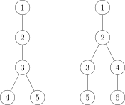

我们有时需要判断一些树是否同构。这时，选择恰当的哈希方式来将树映射成一个便于储存的哈希值（一般是 32 位或 64 位整数）是一个优秀的方案。

树哈希有很多种哈希方式，下面将选出几种较为常用的方式来加以介绍。

## 方法一

### 公式

$$
f_{now}=size_{now} \times \sum f_{son(now,i)}\times seed^{i-1}
$$

#### 注

其中 $f_x$ 为以节点 $x$ 为根的子树对应的哈希值。特殊地，我们令叶子节点的哈希值为 $1$。

$size_{x}$ 表示以节点 $x$ 为根的子树大小。

$son_{x,i}$ 表示 $x$ 所有子节点以 $f$ 作为关键字排序后排名第 $i$ 的儿子。

$seed$ 为选定的一个合适的种子（最好是质数，对字符串 hash 有了解的人一定不陌生）

上述哈希过程中，可以适当取模避免溢出或加快运行速度。

#### Hack



上图中，可以计算出两棵树的哈希值均为 $60(1+seed)$。

## 方法二

### 公式

$$
f_{now}=\bigoplus f_{son(now,i)}\times seed+size_{son(now,i)}
$$

#### 注

其中 $f_x$ 为以节点 $x$ 为根的子树对应的哈希值。特殊地，我们令叶子节点的哈希值为 $1$。

$size_{x}$ 表示以节点 $x$ 为根的子树大小。

$son_{x,i}$ 表示 $x$ 所有子节点之一（不用排序）。

$seed$ 为选定的一个合适的质数。

$\bigoplus$ 表示异或和。

#### Hack

由于异或的性质，如果一个节点下有多棵本质相同的子树，这种哈希值将无法分辨该种子树出现 $1,3,5,\dots$ 次的情况。

## 方法三

### 公式

$$
f_{now}=1+\sum f_{son(now,i)} \times prime(size_{son(now,i)})
$$

### 注

其中 $f_x$ 为以节点 $x$ 为根的子树对应的哈希值。

$size_{x}$ 表示以节点 $x$ 为根的子树大小。

$son_{x,i}$ 表示 $x$ 所有子节点之一（不用排序）。

$prime(i)$ 表示第 $i$ 个质数。

## 例题

### 例题一 [「BJOI2015」树的同构](https://www.luogu.com.cn/problem/P5043)

我们用上述方式任选其一进行哈希，注意到我们求得的是子树的 hash 值，也就是说只有当根一样时同构的两棵子树 hash 值才相同。由于数据范围较小，我们可以暴力求出以每个点为根时的哈希值，也可以通过 up and down 树形 dp 的方式，遍历树两遍求出以每个点为根时的哈希值，排序后比较。

如果数据范围较大，我们可以通过找重心的方式来优化复杂度。（一棵树的重心最多只有两个，分别比较即可）

#### 做法一

??? "例题参考代码"
    ```cpp
    #include <algorithm>
    #include <cstdio>
    
    using i64 = long long;
    using u64 = unsigned long long;
    
    constexpr int maxT = 50;
    constexpr int maxn = 50;
    constexpr int SEED = 98243;
    constexpr int inf = 2147483647;
    
    inline int io() {
      static int _;
      return scanf("%d", &_), _;
    }
    
    template <class _Tp>
    inline _Tp Max(const _Tp x, const _Tp y) {
      return x > y ? x : y;
    }
    template <class _Tp>
    inline void chkMax(_Tp &x, const _Tp y) {
      (x < y) && (x = y);
    }
    template <class _Tp>
    inline void chkMin(_Tp &x, const _Tp y) {
      (x > y) && (x = y);
    }
    template <class _Tp>
    inline void swap(_Tp &x, _Tp &y) {
      _Tp z = x;
      x = y;
      y = z;
    }
    
    struct Edge {
      int v;
      Edge *las;
      inline Edge *init(const int to, Edge *const ls) {
        return v = to, las = ls, this;
      }
    } * las[maxn + 1], pool[maxn << 1], *alc = pool - 1;
    
    inline void lnk(const int u, const int v) {
      if (u == 0) return;
      las[u] = (++alc)->init(v, las[u]);
      las[v] = (++alc)->init(u, las[v]);
    }
    
    u64 hval[maxn + 1];
    void calc(const int u, const int fa) {
      static u64 lis[maxn + 1];
      static int sz[maxn + 1];
    
      /* DFS 时计算 size */
      sz[u] = 1;
      for (Edge *o = las[u]; o; o = o->las)
        if (o->v != fa) calc(o->v, u), sz[u] += sz[o->v];
    
      /* 将 u 各个儿子的哈希值排序 */
      int cnt = 0;
      for (Edge *o = las[u]; o; o = o->las)
        if (o->v != fa) lis[++cnt] = hval[o->v];
      std::sort(lis + 1, lis + cnt + 1);
    
      /* 计算 u 的哈希值 */
      u64 val = 0;
      for (int i = 1; i <= cnt; ++i) val = val * SEED + lis[i];
      hval[u] = val ? val * sz[u] : 1;
    }
    
    int sz[maxn + 1], mxsz[maxn + 1];
    void precalc(const int u, const int fa) {
      /* 找树的重心 */
      sz[u] = 1;
      mxsz[u] = 0;
      for (Edge *o = las[u]; o; o = o->las)
        if (o->v != fa) {
          precalc(o->v, u);
          sz[u] += sz[o->v];
          chkMax(mxsz[u], sz[o->v]);
        }
    }
    
    int main() {
      static int n[maxT + 1];
      static u64 val[maxT + 1][2];
    
      const int T = io();
      for (int i = 1; i <= T; ++i) {
        n[i] = io();
        for (int u = 1; u <= n[i]; ++u) lnk(io(), u);
    
        precalc(1, 0);
        int rtsz = inf, cnt = 0;
        for (int u = 1; u <= n[i]; ++u) chkMin(rtsz, Max(mxsz[u], n[i] - sz[u]));
        for (int u = 1; u <= n[i]; ++u)
          if (rtsz == Max(mxsz[u], n[i] - sz[u]))
            calc(u, 0), val[i][cnt++] = hval[u];
        /* 如果这个点是重心就计算其哈希值 */
    
        if (cnt == 2 && val[i][0] > val[i][1]) swap(val[i][0], val[i][1]);
    
        /* 清空数组 */
        for (int u = 1; u <= n[i]; ++u) las[u] = nullptr;
        alc = pool - 1;
      }
    
      for (int i = 1; i <= T; ++i) {
        bool flag = true;
        for (int j = 1; j != i; ++j)
          if (n[i] == n[j] && val[i][0] == val[j][0] && val[i][1] == val[j][1]) {
            /* 若树 j 与树 i 点数相同且重心哈希值相同，则其同构 */
            flag = false;
            printf("%d\n", j);
            break;
          }
        if (flag) printf("%d\n", i);
      }
    
      return 0;
    }
    ```

#### 做法二

??? "例题参考代码"
    ```cpp
    #include <algorithm>
    #include <cstdio>
    #include <tr1/unordered_map>
    #include <vector>
    
    class Solution {
     private:
      typedef unsigned long long ull;
      typedef std::vector<int>::iterator it;
      static const ull seed = 2333233233;
      static const int maxn = 107;
    
      int n, m, size[maxn], lastRoot, root, lastMax, Max, ans;
      ull hashval[maxn], res;
      std::vector<int> e[maxn];
      std::tr1::unordered_map<ull, int> id;
    
      ull getHash(int now, int fa) {
        size[now] = 1;
        hashval[now] = 1;
        for (register it i = e[now].begin(); i != e[now].end(); ++i) {
          int v = *i;
          if (v == fa) {
            continue;
          }
          hashval[now] ^= getHash(v, now) * seed + size[v];
          size[now] += size[v];
        }
        return hashval[now];
      }
    
      void getRoot(int now, int fa) {
        int max = 0;
        size[now] = 1;
        for (register it i = e[now].begin(); i != e[now].end(); ++i) {
          int v = *i;
          if (v == fa) {
            continue;
          }
          getRoot(v, now);
          size[now] += size[v];
          max = std::max(max, size[v]);
        }
        max = std::max(max, n - size[now]);
        if (max < Max && now != lastRoot) {
          root = now;
          Max = max;
        }
      }
    
     public:
      Solution() {
        get();
        solve();
      }
    
      void get() {
        scanf("%d", &m);
        for (register int i = 1; i <= m; i++) {
          scanf("%d", &n);
          for (register int j = 1; j <= n; j++) {
            std::vector<int>().swap(e[j]);
          }
          for (register int j = 1, fa; j <= n; j++) {
            scanf("%d", &fa);
            if (!fa) {
              root = j;
            } else {
              e[fa].push_back(j);
              e[j].push_back(fa);
            }
          }
          lastRoot = root = 0;
          Max = n;
          getRoot(1, 0);
          lastRoot = root, lastMax = Max;
          res = getHash(root, 0);
          if (!id.count(res)) {
            id[res] = i;
          }
          ans = id[res];
    
          Max = n;
          getRoot(1, 0);
          if (lastMax == Max) {
            res = getHash(root, 0);
            if (!id.count(res)) {
              id[res] = i;
            }
            ans = std::min(ans, id[res]);
          }
          printf("%d\n", ans);
        }
      }
    
      void solve() {}
    };
    Solution sol;
    
    int main() {}
    ```

### 例题二 [HDU 6647](http://acm.hdu.edu.cn/showproblem.php?pid=6647)

题目要求的是遍历一棵无根树产生的本质不同括号序列方案数。

首先，注意到一个结论，对于两棵有根树，如果他们不同构，一定不会生成相同的括号序列。我们先考虑遍历有根树能够产生的本质不同括号序列方案数，假设我们当前考虑的子树根节点为 $u$，记 $f(u)$ 表示这棵子树的方案数，$son(u)$ 表示 $u$ 的儿子节点集合，从 $u$ 开始往下遍历，顺序可以随意选择，产生 $|son(u)|!$ 种排列，遍历每个儿子节点 $v$，$v$ 的子树内有 $f(v)$ 种方案，因此有 $f(u)=|son(u)|! \cdot \prod_{v\in son(u)} f(v)$。但是，同构的子树之间会产生重复，$f(u)$ 需要除掉每种本质不同子树出现次数阶乘的乘积，类似于多重集合的排列。

通过上述树形 dp，可以求出根节点的方案数，再通过 up and down 树形 dp，将父亲节点的哈希值和方案信息转移给儿子，可以求出以每个节点为根时的哈希值和方案数，每种不同的子树只需要计数一次即可。

注意，本题数据较强，树哈希很容易发生冲突。这里提供一个比较简单的解决方法，求出一个节点子树的哈希值后，可以将其前后分别插入一个值再计算一遍哈希值。

#### 做法

??? "例题参考代码"
    ```cpp
    #include <algorithm>
    #include <cmath>
    #include <cstdio>
    #include <cstring>
    #include <iostream>
    #include <map>
    #include <set>
    #include <utility>
    #include <vector>
    using namespace std;
    typedef long long ll;
    typedef unsigned long long ull;
    typedef pair<int, int> PII;
    const int mod = 998244353;
    const int inf = 1 << 30;
    const int maxn = 100000 + 5;
    namespace sieve {
    const int maxp = 2000000 + 5;
    int vis[maxp], prime[maxp], tot;
    void init() {
      ms(vis, 0);
      for (int i = 2; i < maxp; i++) {
        if (!vis[i]) prime[++tot] = i;
        for (int j = 1; j <= tot && prime[j] * i < maxp; j++) {
          vis[i * prime[j]] = 1;
          if (i % prime[j] == 0) break;
        }
      }
    }
    }  // namespace sieve
    namespace MyIO {
    struct fastIO {
      char s[100000];
      int it, len;
      fastIO() { it = len = 0; }
      inline char get() {
        if (it < len) return s[it++];
        it = 0;
        len = fread(s, 1, 100000, stdin);
        if (len == 0)
          return EOF;
        else
          return s[it++];
      }
      bool notend() {
        char c = get();
        while (c == ' ' || c == '\n') c = get();
        if (it > 0) it--;
        return c != EOF;
      }
    } buff;
    inline int gi() {
      int r = 0;
      bool ng = 0;
      char c = buff.get();
      while (c != '-' && (c < '0' || c > '9')) c = buff.get();
      if (c == '-') ng = 1, c = buff.get();
      while (c >= '0' && c <= '9') r = r * 10 + c - '0', c = buff.get();
      return ng ? -r : r;
    }
    }  // namespace MyIO
    namespace {
    inline int add(int x, int y) {
      x += y;
      return x >= mod ? x -= mod : x;
    }
    inline int sub(int x, int y) {
      x -= y;
      return x < 0 ? x += mod : x;
    }
    inline int mul(int x, int y) { return 1ll * x * y % mod; }
    inline int qpow(int x, ll n) {
      int r = 1;
      while (n > 0) {
        if (n & 1) r = 1ll * r * x % mod;
        n >>= 1;
        x = 1ll * x * x % mod;
      }
      return r;
    }
    inline int inv(int x) { return qpow(x, mod - 2); }
    }  // namespace
    using MyIO::gi;
    using sieve::prime;
    int ping[maxn], pingv[maxn];
    int n, ans, siz[maxn];
    vector<int> edge[maxn];
    map<ull, int> uqc[maxn];
    map<ull, int>::iterator it;
    ull hashval[maxn], hashrt[maxn];
    ull srchashval[maxn], srchashrt[maxn];
    int dp[maxn], rdp[maxn];
    ull pack(ull val, int sz) { return 2ull + 3ull * val + 7ull * prime[sz + 1]; }
    void predfs(int u, int ff) {
      siz[u] = dp[u] = 1;
      hashval[u] = 1;
      int sz = 0;
      for (int v : edge[u]) {
        if (v == ff) continue;
        predfs(v, u);
        sz++;
        siz[u] += siz[v];
        dp[u] = mul(dp[u], dp[v]);
        uqc[u][hashval[v]]++;
        hashval[u] += hashval[v] * prime[siz[v]];
      }
      srchashval[u] = hashval[u];
      hashval[u] = pack(hashval[u], siz[u]);
      dp[u] = mul(dp[u], ping[sz]);
      for (it = uqc[u].begin(); it != uqc[u].end(); it++) {
        dp[u] = mul(dp[u], pingv[it->second]);
      }
    }
    set<ull> qc;
    void dfs(int u, int ff) {
      if (!qc.count(hashrt[u])) {
        qc.insert(hashrt[u]);
        ans = add(ans, rdp[u]);
      }
      for (int v : edge[u]) {
        if (v == ff) continue;
        ull tmp = srchashrt[u] - hashval[v] * prime[siz[v]];
        tmp = pack(tmp, n - siz[v]);
        uqc[v][tmp]++;
        srchashrt[v] = srchashval[v] + tmp * prime[n - siz[v]];
        hashrt[v] = pack(srchashrt[v], n);
        int tdp = mul(rdp[u], inv(dp[v]));
        tdp = mul(tdp, inv((int)edge[u].size()));
        tdp = mul(tdp, uqc[u][hashval[v]]);
        rdp[v] = mul(dp[v], tdp);
        rdp[v] = mul(rdp[v], (int)edge[v].size());
        rdp[v] = mul(rdp[v], inv(uqc[v][tmp]));
        dfs(v, u);
      }
    }
    int main() {
      sieve::init();
      ping[0] = pingv[0] = 1;
      for (int i = 1; i < maxn; i++) {
        ping[i] = mul(ping[i - 1], i);
        pingv[i] = mul(pingv[i - 1], inv(i));
      }
      int T = gi();
      while (T--) {
        n = gi();
        for (int i = 2, u, v; i <= n; i++) {
          u = gi();
          v = gi();
          edge[u].push_back(v);
          edge[v].push_back(u);
        }
        predfs(1, 0);
        ans = 0;
        qc.clear();
        rdp[1] = dp[1];
        hashrt[1] = hashval[1];
        srchashrt[1] = srchashval[1];
        dfs(1, 0);
        printf("%d\n", ans);
        for (int i = 1; i <= n; i++) {
          edge[i].clear();
          uqc[i].clear();
        }
      }
      return 0;
    }
    ```

## 写在最后

事实上，树哈希是可以很灵活的，可以有各种各样奇怪的姿势来进行 hash，只需保证充分性与必要性，选手完全可以设计出与上述方式不同的 hash 方式。

## 参考资料

方法三参考自博客 [树 hash](https://www.cnblogs.com/huyufeifei/p/10817673.html)。
