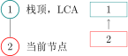

author: HeRaNO, Ir1d, konnyakuxzy, ksyx, Xeonacid, konnyakuxzy, greyqz, sshwy

## 引子

???+ note "[「SDOI2011」消耗战](https://www.luogu.com.cn/problem/P2495)"
    ### 题目描述
    
    在一场战争中，战场由 $n$ 个岛屿和 $n-1$ 个桥梁组成，保证每两个岛屿间有且仅有一条路径可达。现在，我军已经侦查到敌军的总部在编号为 $1$ 的岛屿，而且他们已经没有足够多的能源维系战斗，我军胜利在望。已知在其他 $k$ 个岛屿上有丰富能源，为了防止敌军获取能源，我军的任务是炸毁一些桥梁，使得敌军不能到达任何能源丰富的岛屿。由于不同桥梁的材质和结构不同，所以炸毁不同的桥梁有不同的代价，我军希望在满足目标的同时使得总代价最小。
    
    侦查部门还发现，敌军有一台神秘机器。即使我军切断所有能源之后，他们也可以用那台机器。机器产生的效果不仅仅会修复所有我军炸毁的桥梁，而且会重新随机资源分布（但可以保证的是，资源不会分布到 $1$ 号岛屿上）。不过侦查部门还发现了这台机器只能够使用 $m$ 次，所以我们只需要把每次任务完成即可。
    
    ### 输入格式
    
    第一行一个整数 $n$，代表岛屿数量。
    
    接下来 n-1 行，每行三个整数 $u,v,w$，代表 $u$ 号岛屿和 $v$ 号岛屿由一条代价为 $c$ 的桥梁直接相连，保证 $1\le u,v\le n$ 且 $1\le c\le 10^5$。
    
    第 $n+1$ 行，一个整数 $m$，代表敌方机器能使用的次数。
    
    接下来 $m$ 行，每行一个整数 $k_i$，代表第 $i$ 次后，有 $k_i$ 个岛屿资源丰富，接下来 $k$ 个整数 $h_1,h_2,\cdots ,h_k$，表示资源丰富岛屿的编号。
    
    ### 输出格式
    
    输出有 $m$ 行，分别代表每次任务的最小代价。
    
    ### 数据范围
    
    对于 $100\%$ 的数据，$2\le n\le 2.5\times 10^5,m\ge 1,\sum k_i\le 5\times 10^5,1\le k_i\le n-1$。

## 虚树 Virtual Tree

对于上面那题，我们不难发现——如果树的点数很少，那么我们可以直接跑 DP。

首先我们称某次询问中被选中的点为——**「关键点」**。

设 $Dp(i)$ 表示——使 $i$ 不与其子树中任意一个关键点连通的 **最小代价**。

设 $w(a,b)$ 表示 $a$ 与 $b$ 之间的边的权值。

则枚举 $i$ 的儿子 $v$：

- 若 $v$ 不是关键点：$Dp(i)=Dp(i) + \min \{Dp(v),w(i,v)\}$；
- 若 $v$ 是关键点：$Dp(i)=Dp(i) + w(i,v)$。

很好，这样我们得到了一份 $O(nq)$ 的代码。

听起来很有意思。

我们不难发现——其实很多点是没有用的。以下图为例：


如果我们选取的关键点是：


图中只有两个红色的点是 **关键点**，而别的点全都是「非关键点」。

对于这题来说，我们只需要保证红色的点无法到达 $1$ 号节点就行了。

通过肉眼观察可以得出结论——$1$ 号节点的右子树（虽然实际上可能有多个子树，但这里只有两个子树，所以暂时这么称呼了）一个红色节点都没有，**所以没必要去 DP 它**。

观察题目给出的条件，红色点（关键点）的总数是与 $n$ 同阶的，也就是说实际上一次询问中红色的点对于整棵树来说是很稀疏的，所以如果我们能让复杂度由红色点的总数来决定就好了。

因此我们需要 **浓缩信息，把一整颗大树浓缩成一颗小树**。

由此我们引出了 **「虚树」** 这个概念。

我们先直观地来看看虚树的样子。

下图中，红色结点是我们选择的关键点。红色和黑色结点都是虚树中的点。黑色的边是虚树中的边。


因为任意两个关键点的 LCA 也是需要保存重要信息的，所以我们需要保存它们的 LCA，因此虚树中不一定只有关键点。

不难发现虚树中祖先后代的关系并不会改变。（就是不会出现原本 $a$ 是 $b$ 的祖先结果后面 $a$ 变成 $b$ 的后代了之类的鬼事）

但我们不可能 $O(k^2)$ 暴力枚举 LCA，所以我们不难想到——首先将关键点按 DFS 序排序，然后排完序以后相邻的两个关键点（相邻指的是在排序后的序列中下标差值的绝对值等于 1）求一下 LCA，并把它加入虚树。

因为可能多个节点的 LCA 可能是同一个，所以我们不能多次将它加入虚树。

非常直观的一个方法是：

- 将关键点按 DFS 序排序；
- 遍历一遍，任意两个相邻的关键点求一下 LCA，并且哈希表判重；
- 然后根据原树中的祖先后代关系建树。

朴素算法的复杂度较高。因此我们提出一种单调栈做法。

在提出方案之前，我们先确认一个事实——在虚树里，只要保证祖先后代的关系没有改变，就可以随意添加节点。

也就是，如果我们乐意，我们可以把原树中所有的点都加入虚树中，也不会导致 WA（虽然会导致 TLE）。

因此，我们为了方便，可以首先将 $1$ 号节点加入虚树中，并且并不会影响答案。

好，开始讲怎么用单调栈来建立一棵虚树吧。

首先我们要明确一个目的——我们要用单调栈来维护一条虚树上的链。

也就是一个栈里相邻的两个节点在虚树上也是相邻的，而且栈是从底部到栈首单调递增的（指的是栈中节点 DFS 序单调递增），说白了就是某个节点的父亲就是栈中它下面的那个节点。

首先我们在栈中添加节点 $1$。

然后接下来按照 DFS 序从小到大添加关键节点。

假如当前的节点与栈顶节点的 LCA 就是栈顶节点的话，则说明它们是在一条链上的。所以直接把当前节点入栈就行了。



假如当前节点与栈顶节点的 LCA 不是栈顶节点的话：


这时，当前单调栈维护的链是：


而我们需要把链变成：


那么我们就把用虚线标出的结点弹栈即可，在弹栈前别忘了向它在虚树中的父亲连边。


假如弹出以后发现栈首不是 LCA 的话要让 LCA 入栈。

再把当前节点入栈就行了。

下面给出一个具体的例子。假设我们要对下面这棵树的 4，6 和 7 号结点建立虚树：


那么步骤是这样的：

- 将 3 个关键点 $6,4,7$ 按照 DFS 序排序，得到序列 $[4,6,7]$。
- 将 $1$ 入栈。


我们用红色的点代表在栈内的点，青色的点代表从栈中弹出的点。

- 取序列中第一个作为当前节点，也就是 $4$。再取栈顶元素，为 $1$。求 $1$ 和 $4$ 的 $LCA$：$LCA(1,4)=1$。
- 发现 $LCA(1,4)=$ 栈顶元素，说明它们在虚树的一条链上，所以直接把当前节点 $4$ 入栈，当前栈为 $4,1$。


- 取序列第二个作为当前节点，为 $6$。再取栈顶元素，为 $4$。求 $6$ 和 $4$ 的 $LCA$：$LCA(6,4)=1$。
- 发现 $LCA(6,4)\neq$ 栈顶元素，进入判断阶段。
- 判断阶段：发现栈顶节点 $4$ 的 DFS 序是大于 $LCA(6,4)$ 的，但是次大节点（栈顶节点下面的那个节点）$1$ 的 DFS 序是等于 $LCA$ 的（其实 DFS 序相等说明节点也相等），说明 $LCA$ 已经入栈了，所以直接连接 $1\to4$ 的边，也就是 $LCA$ 到栈顶元素的边。并把 $4$ 从栈中弹出。


- 结束了判断阶段，将 $6$ 入栈，当前栈为 $6,1$。


- 取序列第三个作为当前节点，为 $7$。再取栈顶元素，为 $6$。求 $7$ 和 $6$ 的 $LCA$：$LCA(7,6)=3$。
- 发现 $LCA(7,6)\neq$ 栈顶元素，进入判断阶段。
- 判断阶段：发现栈顶节点 $6$ 的 DFS 序是大于 $LCA(7,6)$ 的，但是次大节点（栈顶节点下面的那个节点）$1$ 的 DFS 序是小于 $LCA$ 的，说明 $LCA$ 还没有入过栈，所以直接连接 $3\to6$ 的边，也就是 $LCA$ 到栈顶元素的边。把 $6$ 从栈中弹出，并且把 $LCA(6,7)$ 入栈。
- 结束了判断阶段，将 $7$ 入栈，当前栈为 $1,3,7$。


- 发现序列里的 3 个节点已经全部加入过栈了，退出循环。
- 此时栈中还有 3 个节点：$1,3,7$，很明显它们是一条链上的，所以直接链接：$1\to3$ 和 $3\to7$ 的边。
- 虚树就建完啦！


我们接下来将那些没入过栈的点（非青色的点）删掉，对应的虚树长这个样子：


其中有很多细节，比如我是用邻接表存图的方式存虚树的，所以需要清空邻接表。但是直接清空整个邻接表是很慢的，所以我们在 **有一个从未入栈的元素入栈的时候清空该元素对应的邻接表** 即可。

建立虚树的 C++ 代码大概长这样：

???+note "代码实现"
    ```cpp
    inline bool cmp(const int x, const int y) { return id[x] < id[y]; }
    
    void build() {
      sort(h + 1, h + k + 1, cmp);
      sta[top = 1] = 1, g.sz = 0, g.head[1] = -1;
      // 1 号节点入栈，清空 1 号节点对应的邻接表，设置邻接表边数为 1
      for (int i = 1, l; i <= k; ++i)
        if (h[i] != 1) {
          //如果 1 号节点是关键节点就不要重复添加
          l = lca(h[i], sta[top]);
          //计算当前节点与栈顶节点的 LCA
          if (l != sta[top]) {
            //如果 LCA 和栈顶元素不同，则说明当前节点不再当前栈所存的链上
            while (id[l] < id[sta[top - 1]])
              //当次大节点的 Dfs 序大于 LCA 的 Dfs 序
              g.push(sta[top - 1], sta[top]), top--;
            //把与当前节点所在的链不重合的链连接掉并且弹出
            if (id[l] > id[sta[top - 1]])
              //如果 LCA 不等于次大节点（这里的大于其实和不等于没有区别）
              g.head[l] = -1, g.push(l, sta[top]), sta[top] = l;
            //说明 LCA 是第一次入栈，清空其邻接表，连边后弹出栈顶元素，并将 LCA 入栈
            else
              g.push(l, sta[top--]);
            //说明 LCA 就是次大节点，直接弹出栈顶元素
          }
          g.head[h[i]] = -1, sta[++top] = h[i];
          //当前节点必然是第一次入栈，清空邻接表并入栈
        }
      for (int i = 1; i < top; ++i)
        g.push(sta[i], sta[i + 1]);  //剩余的最后一条链连接一下
      return;
    }
    ```

于是我们就学会了虚树的建立了！

对于消耗战这题，直接在虚树上跑最开始讲的那个 DP 就行了，我们等于利用了虚树排除了那些没用的非关键节点！仍然考虑 $i$ 的所有儿子 $v$：

- 若 $v$ 不是关键点：$Dp(i)=Dp(i) + \min \{Dp(v),w(i,v)\}$
- 若 $v$ 是关键点：$Dp(i)=Dp(i) + w(i,v)$

于是这题很简单就过了。

## 推荐习题

- [「SDOI2011」消耗战](https://darkbzoj.tk/problem/2286)
- [「HEOI2014」大工程](https://darkbzoj.tk/problem/3611)
- [CF613D Kingdom and its Cities](http://codeforces.com/contest/613/problem/D/)
- [「HNOI2014」世界树](https://darkbzoj.tk/problem/3572)
