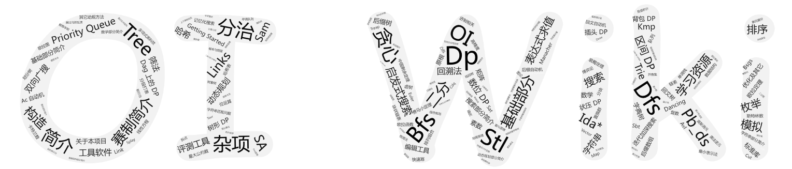

disqus:
pagetime:
title: OI Wiki

# 欢迎来到 **OI Wiki**。 

**OI** （Olympiad in Informatics，信息学奥林匹克竞赛）在中国起源于 1984 年，是五大高中学科竞赛之一。自 1989 年起，每年还会选拔出国家集训队选手准备 IOI (International Olympiad in Informatics，国际信息学奥林匹克竞赛)。

**ICPC** （International Collegiate Programming Contest, 国际大学生程序设计竞赛）由 ICPC 基金会（ICPC Foundation）举办，是最具影响力的大学生计算机竞赛。ICPC 主要分为区域赛（Regionals）和总决赛（World Finals）两部分。

**OI Wiki** 致力于成为一个免费开放且持续更新的知识整合站点，大家可以在这里获取关于 **编程竞赛 (competitive programming)** 有趣又实用的知识，我们为大家准备了竞赛中的基础知识、常见题型、解题思路以及常用工具等内容，帮助大家更快速深入地学习编程竞赛。

本项目受 [CTF Wiki](https://ctf-wiki.github.io/ctf-wiki/) 的启发，在编写过程中参考了诸多资料，在此一并致谢。

本项目文档内容托管在 [GitHub](https://github.com/24OI/OI-wiki)，主要使用 [Issues](https://github.com/24OI/OI-wiki/issues) / [QQ](https://jq.qq.com/?_wv=1027&k=5EfkM6K) / [Telegram](https://t.me/OIwiki) / [Discord](https://discord.gg/xXdYSMq) 进行交流沟通，期待你的加入。

Telegram 群组链接为 [@OIwiki](https://t.me/OIwiki) ， QQ 群号码为 [`588793226`](https://jq.qq.com/?_wv=1027&k=5EfkM6K)，欢迎加入。

## Material color palette 颜色主题

### Primary colors 主色

> 默认 `white`

点击色块可更换主题的主色

<button data-md-color-primary="red">Red</button>
<button data-md-color-primary="pink">Pink</button>
<button data-md-color-primary="purple">Purple</button>
<button data-md-color-primary="deep-purple">Deep Purple</button>
<button data-md-color-primary="indigo">Indigo</button>
<button data-md-color-primary="blue">Blue</button>
<button data-md-color-primary="light-blue">Light Blue</button>
<button data-md-color-primary="cyan">Cyan</button>
<button data-md-color-primary="teal">Teal</button>
<button data-md-color-primary="green">Green</button>
<button data-md-color-primary="light-green">Light Green</button>
<button data-md-color-primary="lime">Lime</button>
<button data-md-color-primary="yellow">Yellow</button>
<button data-md-color-primary="amber">Amber</button>
<button data-md-color-primary="orange">Orange</button>
<button data-md-color-primary="deep-orange">Deep Orange</button>
<button data-md-color-primary="brown">Brown</button>
<button data-md-color-primary="grey">Grey</button>
<button data-md-color-primary="blue-grey">Blue Grey</button>
<button data-md-color-primary="white">White</button>

### Accent colors 辅助色

> 默认 `red`

点击色块更换主题的辅助色

<button data-md-color-accent="red">Red</button>
<button data-md-color-accent="pink">Pink</button>
<button data-md-color-accent="purple">Purple</button>
<button data-md-color-accent="deep-purple">Deep Purple</button>
<button data-md-color-accent="indigo">Indigo</button>
<button data-md-color-accent="blue">Blue</button>
<button data-md-color-accent="light-blue">Light Blue</button>
<button data-md-color-accent="cyan">Cyan</button>
<button data-md-color-accent="teal">Teal</button>
<button data-md-color-accent="green">Green</button>
<button data-md-color-accent="light-green">Light Green</button>
<button data-md-color-accent="lime">Lime</button>
<button data-md-color-accent="yellow">Yellow</button>
<button data-md-color-accent="amber">Amber</button>
<button data-md-color-accent="orange">Orange</button>
<button data-md-color-accent="deep-orange">Deep Orange</button>

