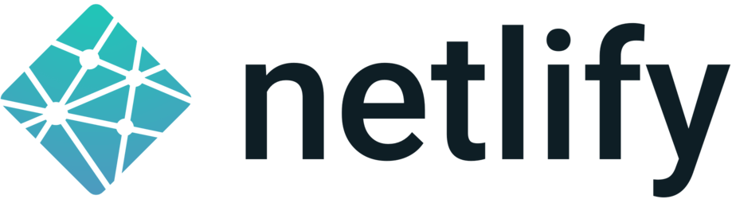

disqus:
pagetime:
title: OI Wiki

## 欢迎来到 **OI Wiki**！  

**OI**（Olympiad in Informatics，信息学奥林匹克竞赛）在中国起源于 1984 年，是五大高中学科竞赛之一。

**ICPC**（International Collegiate Programming Contest，国际大学生程序设计竞赛）由 ICPC 基金会（ICPC Foundation）举办，是最具影响力的大学生计算机竞赛。由于以前 ACM 赞助这个竞赛，也有很多人习惯叫它 ACM 竞赛。

**OI Wiki** 致力于成为一个免费开放且持续更新的 **编程竞赛（competitive programming）** 知识整合站点，大家可以在这里获取与竞赛相关的、有趣又实用的知识。我们为大家准备了竞赛中的基础知识、常见题型、解题思路以及常用工具等内容，帮助大家更快速深入地学习编程竞赛中涉及到的知识。

本项目受 [CTF Wiki](https://ctf-wiki.org/) 的启发，在编写过程中参考了诸多资料，在此一并致谢。

