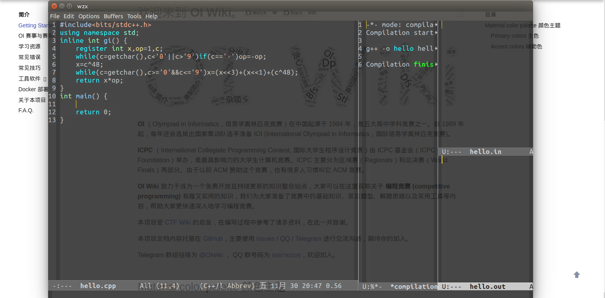

## Emacs——神的编辑器

15 分钟入门 Emacs（因为是入门教程，所以比较简短）

### 简介

Emacs 是一款非常容易上手的编辑器，重要的快捷键不多，随便输几行配置就能较方便地使用

### 入门

#### 命令

按下右侧 Ctrl 左边的可以输入命令，按三下 Esc 可以取消，常用的有 "es" 或 "eshell"（打开 eshell）

#### 缓冲

缓冲即打开的文件和进程，没什么好讲的，只要知道在缓冲区的底部点击缓冲的名字可以切换缓冲就可以了

#### 编译、调试和运行

在顶部的菜单栏中有一个 Tools 点开就有编译和调试

运行可以使用终端或 Eshell（其实也是终端），输入文件位置就可以运行

具体的调试参见 GDB 调试

#### 分屏

这个稍微重要一点

分屏功能可以同时显示多个窗口，一般分为

几个快捷键：

-   删除分屏 "C-x 0"：将这个分屏删去
-   横向分屏 "C-x 3"：将这个分屏横向分成两半
-   纵向分屏 "C-x 2"：将这个分屏纵向分成两半

一般窗口分为四块：先横向分，调整一块的宽度约为 3/4 屏，作为编辑窗口，再将另一块横向分，一块作为调试和编译信息显示的窗口，另一块再纵向分，一块打开输入文件，一块打开输出文件

### 个性化

打开最初的 Emacs，非常丑，并且不好用，我们需要个性化设置

以下是推荐在考场使用的

#### 初级

-   点击 Options，勾选第二项（高亮匹配括号）
-   点击 Options，点击 Show/Hide，第一行 Tool Bar 选 None
-   点击 Options，勾选第六行可以使用 Ctrl + C,Ctrl + V 等快捷键
-   点击 Options，最后一行点开再点第一行可以设置主题，勾选后要保存
-   点击 Options，点倒数第三行保存

#### 配置

[获取上文图片中的配置](https://www.cnblogs.com/akakw1/p/10088191.html)

再 home 目录下显示隐藏文件，".emacs" 就是配置文件（如果没有说明之前没保存）

几个重要的

    (global-set-key [f9] 'compile);;;f9编译
    ;(global-set-key [f9] 'compile-file);;;设置了快捷编译的用这条
    (global-set-key [f10] 'gud-gdb);;;f10调试
    (global-set-key (kbd "C-s") 'save-buffer);;;ctrl+s保存
    (global-set-key (kbd "C-z") 'undo);;;ctrl+z撤销
    (global-set-key (kbd "RET") 'newline-and-indent);;;自动缩进
    (define-key key-translation-map (kbd "C-a") (kbd "C-x h"));;;全选
    (global-set-key (kbd "C-y") 'kill-whole-line);;;删除一行
    (setq c-default-style "awk");;;设置C语言风格

考场把上面的需要的输进去就行了

    ;;;一键编译（C++）
    (defun compile-file ()
      (interactive)
      (compile (format "g++ -o %s %s -g -lm -Wall"  (file-name-sans-extension (buffer-name))(buffer-name))))
    ;;;;;允许emacs和外部其他程序的粘贴
    (setq x-select-enable-clipboard t)
    ;; 显示列号
    (setq column-number-mode t)
    ;;;;;修改透明度
    (set-frame-parameter (selected-frame) 'alpha (list 85 50))
    (add-to-list 'default-frame-alist (cons 'alpha (list 85 50)))
    (setq-default cursor-type 'bar)
    ;;高亮
    (set-cursor-color "wheat")
    (set-mouse-color "wheat")
    (global-font-lock-mode t)
    ;;;;;滚动页面时比较舒服，不要整页的滚动
    (setq scroll-step 1
            scroll-margin 3
            scroll-conservatively 10000)

无脑配置请百度
