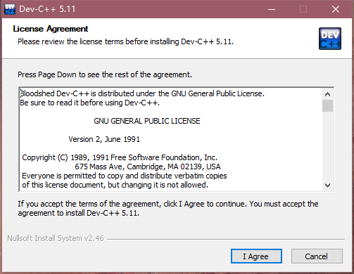
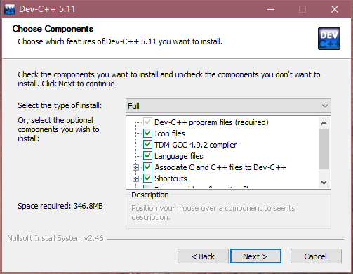
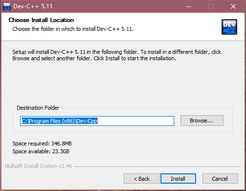
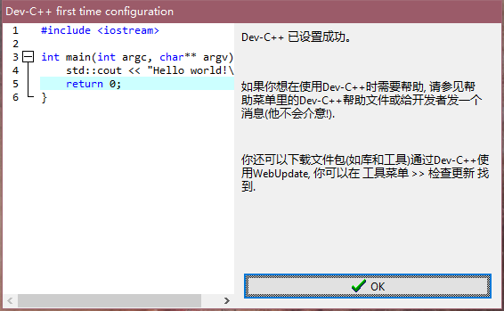
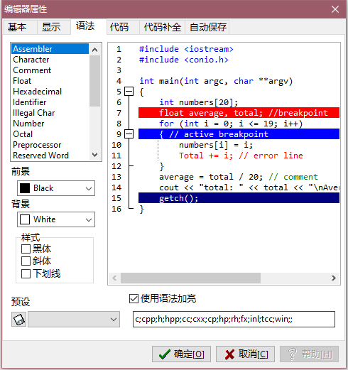

## Dev C++ 食用指北

### 介绍
Dev-C++是一套用于开发C/C++（C++11）的自由的集成开发环境（IDE），并以GPL作为散布许可。使用MinGW及GDB作为编译系统与调试系统。Dev-C++的IDE是利用Delphi开发的。

Dev-C++是一个SourceForge的项目，是由Colin Laplace这位程序员及其公司Bloodshed Software所开始的。当前Dev-C++一般用于撰写运行于Microsoft Windows的程序。Dev-C++一度有移植到Linux的项目但当前被暂停了。

Bloodshed Dev-C++是一款全功能的C和C++编程语言的集成开发环境（IDE）。它使用的GCC MinGW或TDM-GCC的64位版本作为它的编译器。DEV-C++也可以使用Cygwin或任何其他基于GCC编译器组合使用。

此外，Dev-C++较旧的版本无法在win8环境下编译。

不过该项目已不再明显活跃，从2005年2月22日开始至2011年6月，Dev-C++的官方网站一直没有再发出新消息或是释放新版本，说明Dev-C++的开发已经进入了迟滞状态。2006年，Dev-C++主要开发者Colin Laplace曾经对此作出了解释：“因忙于现实生活的事务，没有时间继续Dev-C++的开发。”[\[1\]](http://sourceforge.net/projects/dev-cpp/forums/forum/33286/topic/1334635)

以上摘自Wikipedia[\[2\]](https://zh.wikipedia.org/wiki/Dev-C%2B%2B)。

不过,你知道你在使用的版本是不是现在我在说的这个版本呢？

没错,Dev-C++其实还有一个船新版本：

Orwell Dev-C++是Dev-C++的一个衍生版本。Orwell鉴于Dev-C++的长时间（从2005年2月22日起）不再更新，对Dev-C++源代码进行错误修正，并更新编译器后发布的版本。

以上摘自Wikipedia[\[3\]](https://zh.wikipedia.org/wiki/Orwell_Dev-C%2B%2B)。

自2011年的Dev-C++ 4.9.9.3版本之后，你使用的版本均为Orewell Dev-C++。

目前最新版本为2015年4月27日的Dev-C++ 5.11版本。

该应用界面简洁友好，安装便捷，适合初学者使用。
### 部署教程
Dev-C++各版本的安装步骤大同小异，下面以最新版本5.11演示。

[下载链接](https://sourceforge.net/projects/orwelldevcpp/files/latest/download)

1.首先选择安装语言，这里选择英语，然后点击OK。

2.同意使用协议，即点击I Agree。

3.选择安装方式，此处直接点击Next>。

4.选择安装路径，按需要选择，然后点击Install。

5.安装完毕后，点击Finish来开始初始化Dev-C++。

6.选择语言为简体中文，然后点击>Next。

7.选择你的主题和风格，这些以后可以在编辑器选项里调整，然后点击>Next。

8.点击OK以完成安装。

### 使用教程
	 
	1、常用快捷键
	
	Ctrl+N : 创建源代码
	Ctrl+O : 打开文件
	Ctrl+W : 关闭文件
	Ctrl+P : 打印文件
	
	Ctrl+/ : 注释和取消注释
	
	Tab : 缩进
	Shift + Tab : 取消缩进
	
	Ctrl+E : 复制行
	Ctrl+D : 删除行
	
	Ctrl+Shift+Up : 向上移动
	Ctrl+Shift+Down : 向下移动 
	
	Ctrl+F : 搜索
	Ctrl+R : 替换 
	
	F3 : 搜索下一个
	Shift+F3 : 搜索上一个 
	
	Ctrl+G : 到指定行号
	Shift+Ctrl+G : 到指定函数 
	
	Ctrl+1~9 : 设置书签
	Alt+1~9 : 跳转书签 
	
	Ctrl+滚轮 ： 字号放大或缩小
	Ctrl+F11 : 全屏或恢复
	
	F9 : 只编译
	F10 : 只运行
	F11 : 编译并运行
	F12 : 全部重新编译
	
	F2 : 转到断点
	F4 : 设置断点或取消
	F5 : 调试运行
	F6 : 停止
	F7 : 逐步调试
	
	2、调试流程
	
	(1) 将编译器配置设定为 "TDM-GCC 4.8.1 64-bit Debug"
	(2) 按 F4 设置或取消调试断点
	(3) 将光标放置在变量上，按 Alt+A 向调试窗口添加监控变量
	(4) 按 F5 启动调试
	(5) 按 F7 或 Alt+N 逐步调试
	(6) 按 Alt+S 跳至下一个调试断点 
	(7) 按 F6 停止调试
	  
引用自Dev-C++ 使用指南 by juxq[\[4\]](https://blog.csdn.net/juxq/article/details/83515469)。

### 美化
#### 字体
点击工具->编辑器选项，然后选择”显示“选项卡。

#### 主题
点击工具->编辑器选项，然后选择”语法“选项卡，可以使用预设主题，也可以自行调整。

### 引用链接

[1] : [SourceForge论坛的帖子](http://sourceforge.net/projects/dev-cpp/forums/forum/33286/topic/1334635)

[2] : [Dev-C++-维基百科](https://zh.wikipedia.org/wiki/Dev-C%2B%2B)

[3] : [Orwell Dev-C++-维基百科](https://zh.wikipedia.org/wiki/Orwell_Dev-C%2B%2B)

[4] : [Dev-C++ 使用指南](https://blog.csdn.net/juxq/article/details/83515469)
