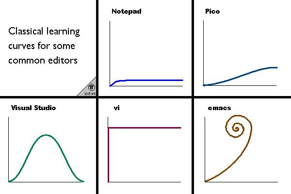
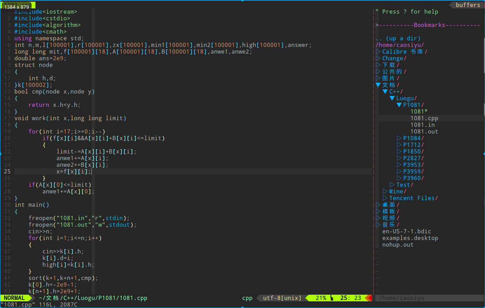

## Vim -- 编辑器之神

### 历史与争端

Vim 的前身是 vi，一个简洁但是略有不足的编辑器，但是从 vi 开始，编辑器的模式区分和唯快不破的思想就已经体现的很到位了。Vim 即是 vi improved，是在 vi 原本所有的方式上进行的进一步提升，但是并不会改变 vi 的其他本质，只是增加了更多适应如今需要的一些功能。

vi 于 1976 年诞生，与 Emacs 不分先后，两者因其快捷的编辑被奉为主流的神器，甚至使用者们还有爆发过 “圣战”，即是 `神的编辑器 Emacs` VS `编辑器之神 Vim`，但是当然分不出结果，因为各有优劣。但它们共有的特点就是高度的扩展性与高度的可定制性以及快捷方便的使用。

即使很多人说它们老了，太过古老的东西应该淘汰掉。但既然能够留存至今，它们的弥坚性当然也是很可观的，也会有着某些现代编辑器无法填补的优势。

Vim 的模式区分是一个很有意思的设定，普通模式与插入模式是最主要常用的模式，普通模式下的每个键都是命令，这便是 Vim 不同于 Emacs 的地方，若是习惯了 Vim 的模式之间的切换，大部分都是单个键的命令必然比 Emacs 的无限 Ctrl 会更高效，虽然 Vim 的小容量注定比不了 Emacs “操作系统” 这个东西那么万能，但是论快而言，Vim 是毫不逊色的。

Vim 有丰富的插件扩展，这点显然是比配置更迷人的存在。有这些扩展性存在，Vim 成为一个 IDE 也不会是不可能的事情。

但是，Vim 的初始学习注定是艰难的，因为其与多数主流操作不同的方式令稍懒的新手望而却步，这需要时间来适应但当度过最开始的不适应期之后，Vim 就再无难度，你会慢慢上瘾，不断优化你的配置，寻找新的更好用的插件。开始的过程就像是铸剑，之后的过程就像是与剑的更好的磨合，然后在剑中逐渐注入你的灵魂，这样它就成为了你最好的利器，令你无法割舍。乃至你会自己写适合自己的插件，就像是自创剑法，而不像是从别人那里借来剑法，杂七杂八融为一炉。

有人说了这样一句话：

Vim 是一款非常优秀的文本编辑器，但由于其陡峭的学习曲线，很多人还没开始学就放弃了，所以他们无法领悟 Vim 唯快不破的设计思想和精巧的使用体验。

附一张图，论各大编辑器的学习曲线，纵坐标代表掌握知识量及难度，横坐标代表使用的熟练程度与完成任务的效率。我们可以看到，Vim 的曲线岂止陡峭，都垂直了…… 但是开始过去后，是平稳的提升，只要度过开始的阶段，Vim 的学习将再无阻碍，一路直上有没有。



### 安装

一般的话，Linux 系统都是会自带 Vim 的，打开终端输入 `vim` 即可启用。

Vim 依附于终端，所以调整终端设置也可以达到美化效果。比如背景透明这种极具美感的东西。而 Gvim 则可以通过图形界面的菜单栏来调节。

Vim 确实是很方便的，而且各大系统基本上都有 Vim 版本，甚至对于许多 Linux 系统，Vim 本身就是自带的。但是自带的 Vim 很容易有功能残缺，比如不能与系统剪切板交互 (将会在进阶篇讲解，当然主要是因为没安装其他东西啦)，各种未开启支持。那么这时候我们就需要手动安装。第一步先是卸载系统自带的 Vim，毕竟旧的不去新的不来嘛。命令如下：

```shell
sudo apt-get remove vim
```

然后安装有两种做法。

做法一，使用命令安装，但软件源的版本肯定有问题 = =。这个时候应使用第三方软件源安装，命令如下：


```shell
sudo add-apt-repository ppa:jonathonf/vim
sudo apt-get update
sudo apt-get install vim
```
静待安装完成即可

做法二，先到 [Releases - vim/vim](https://github.com/vim/vim/releases) 下载源码包，然后解压，并进入解压后的文件夹，并打开终端，cd 至文件夹路径，并依次输入如下命令：

```shell
sudo apt-get install python-dev
sudo apt-get install python3-dev
sudo apt-get install libncurses5-dev
./configure
make
sudo make install
```

make 的过程可能稍久，淡定点等。

最后在终端输入

```shell
vim
```

就跳出了那个帮帮乌干达的可怜儿童啥的，按 `a` 或 `i` 键开始编辑新文件吧。

或者要打开某个文件的话就可以在终端中

```shell
vim 文件路径
```

可以直接编辑文件。

### 编译

编译的话，先要安装 g++，命令如下：

```shell
sudo apt-get install g++
```

然后 cd 至 cpp 文件指定路径执行如下命令

```shell
g++ filename.cpp -o filename
./filename
```

第一个命令是编译，第二个则是运行。

一键编译运行的配置在配置篇给出。


### 基础篇

分模式来吧。

#### 插入模式 (insert)

插入模式的知识点其实没有太多，输入才是主职是伐。

首先，从普通模式如何进入插入模式呢？有数个命令：`i` 与 `a` 与 `A` 与 `o`。前两个差别不大，`i` 是在光标当前位置进行写代码，`a` 是往后挪一个字符写代码。`A` 是移动到当前行尾进行插入，`o` 是在行尾添加换行符并在下一行插入。

而如何返回普通模式？当然是 <kbd>Esc</kbd> 啦。但是，Vim 的插入与普通模式切换异常频繁，而 <kbd>Esc</kbd> 又太远了，有什么办法呢？Vim 还提供了 <kbd>Ctrl</kbd> + <kbd>\[</kbd> 的快捷键来返回普通模式，是否近多了呢？

虽说能够熟练了后，切换模式不再是问题，但是其实有的时候我们只是需要进入普通模式下按一次小命令，来回切换又显得浪费了一点点时间。而 Vim 又提供了插入 - 普通模式来避免这一尴尬的问题。在插入模式下，只需要按 <kbd>Ctrl</kbd> + <kbd>o</kbd> 即可进入此模式，当进行完一次操作后又会自动回到插入模式。这样岂不是更省时间？

#### 普通模式 (normal)

Vim 的命令大部分都是在普通模式下完成的，普通模式下可不能乱按，可以说每个键都是命令。

```vim
首先是 hjkl 四个方向键。                         
                                              k ^
                                           h <     > l
                                                v j
```

其实大多数编辑器都是用方向键做出移动命令，Vim 也不例外，但 `hjkl` 给了我们更好的选择，只需要一段时间的适应，你便能快速地操作它们进行移动，而且它们可没有方向键那么远，节省时间是一流的。

普通模式下最重要的命令，没有之一，那就是 `u`。撤销命令，作用是撤销上一次对文本的更改，普通模式下的 `x`，`d`，`p` 命令都会被撤销，同时进入一次插入模式所编辑的文本也算一次更改，`u` 命令会删去从进入到退出插入模式所输入的所有东西。与之对应的是 <kbd>Ctrl</kbd> + <kbd>r</kbd> 命令，他的作用是撤销上次的撤销命令，相当于大部分 windows 下程序中的 <kbd>Ctrl</kbd> + <kbd>y</kbd>。

然后的话, 就是普通模式下常用的命令。由于对行命令的使用很频繁，所以大部分的单键命令都可以通过按两次来实现对行操作。常用命令是 `x` ，用于删除光标后的一个字符。然后是 `d` 命令，也是删除，但是种类更多，这里不做赘述。同时 `d` 命令像之前说的，按两次即可删除整行，即 `dd`。

然后是`y`命令，可以复制被选中的区域，这涉及到可视模式，即按 `v` 进入可视模式，多用于选中区域。进入可视模式后移动光标来确定选取范围是可以的，此时按 `o` 键即可切换活动端，省去了如果跑反方向的麻烦。当然，我相信很多人还是习惯用鼠标操作这一过程的，包括移动光标。Vim 很温馨的提供了这一配置：`set mouse=a`。你可以将它写入你的配置文件中去。有了它之后，你将能够用鼠标选中区域并进行复制操作。当然，选中后按 `x` 或 `d` 亦可删除。同时，`y` 也符合 `d` 的性质，`yy` 将可以复制当前行。

然后就是更快的跳跃了。如果说只是使用 `hjkl` 的话，光标的移动显然不够快，而鼠标却又要伸手去拿。Vim 提供了普通模式下更快的跳跃方法，`w` 可以跳到下个单词的开头，而 `e` 可以跳到当前单词结尾，`0` 可以跳至行首，`$` 可以跳至行尾，岂不是快多了？而且 `w`，`e`，`0`，`$` 还可以用于许多命令中 `de`，`dw`，`d0`，`d&` 分别对应删至单词尾，删至下个单词头，删至行首，删至行尾。以及`y`命令亦可同理。

然后是 Vim 的可重复。在输入某个命令前，输入一个数字的话，就会重复那么多次。如在普通模式下：

```vim
asdasdasdasdasd
asdadasdddd
asdasdasd
```

光标正位于第一行，该如何删除这三行呢？普通模式下按  `3 dd`  即可。其实还有`.`命令也是可以做到一些重复的，这会在效率篇中提到。

然后是全文的跳跃，按 `gg` 可跳至代码的开头，按 `G` 可跳至代码最后一行，先按数字再按 `G` 可跳至指定行。

那么在文中还有极为方便的查找功能，普通模式下只需按 `/` 下方即会出现查找框框，输入需要查找的字符按回车就好啦，如果有多个查找结果，只需按 `n` 即可跳至下一个查找处，按 `N` 即可跳至上一个。

常用命令大概就这些了……

#### 命令行模式

其实这并不能称作是一个模式 = =。

普通模式下只需要按 : 下方就会蹦出命令框框，输入相关命令即可。如 Vim 在线帮助文档，输入 `:help` 即可，如果看不懂英文…… 请下载 Vim 用户手册中文，或者移步插件篇。

此模式下有一些很有用的命令

`:q` 退出，`:w` 保存，`:wq` 保存并退出，`:q!` 不保存并退出，`:e filename` 打开当前目录下指定文件，这些是比较基础的。

然后是很强大的命令 `:x1,x2 s/A 串 / B 串 /` 作用是把第 `x1` 行至 `x2` 行中的所有 A 串替换成 B 串。想象一下题写完了，但是发现没开 `long long` 的时候，完全不绝望有没有，一个小命令，妙不可言。瞬间所有 `int` 变 `long long`。

以上都是 Vim 内部的命令，但是实际上如果命令形式是 `:! 命令` 那么就将在外部执行命令，即是以 bash 终端执行命令。既然都是外部 bash 了我就不多做介绍了，那块地不归我管……

#### 可视模式

可视模式的作用总结起来大概就是选中高亮，但是块状的可视模式可以干更多的事情，不过太麻烦了，对于新人来说大概会脑阔疼。

普通模式下按 `v` 即可进入可视模式，`hjkl` 可以移动高亮选区某一头，如果发现反了或者你进入可视模式的时候是在想要选中区域的中间位置，不用急着退出重进，更不用花时间又移回去，只需要按`o`即可切换活动端，操作高亮选区的另一头。或者用鼠标也不是不行啦……

用鼠标选中高亮选区当然也可以说是进入可视模式的办法之一。

然后就是`y`或者`d`操作，没了 QwQ。

emm 基础应该就用到这些了吧，往后的插件，配置，更多操作在对应篇幅里。

最后其实 Vim 还有一些基础操作，它们在 Vim 自带的教程里将会讲述。打开终端输入：

```shell
vimtutor
```

即可进入教程，二三十分钟你就能掌握基础了，但应当加以练习才能彻底掌握。


### 进阶篇

这里讲的新东西不多，反而更多的是技巧与经验，Vim 虽然是一个编辑器，但要用好它学问可不小。

#### 从缩小控制区域开始
为什么 Emacs 和 Vim 这些编辑器效率高？  
很重要的一点在于这些编辑器可以让你切掉你的右半部分的键盘而让你的双手始终处于主键盘区域, 并且让你的双手保持合作, 而不会出现一只手不停的按而另一只手摊在键盘上。  
所以, 如果你想用好 Vim , 不要去按方向键，不要去碰鼠标，建议使用这几行丧心病狂的配置：  

```vim
" 使方向键失效
imap <UP> <Nop>
imap <DOWN> <Nop>
imap <LEFT> <Nop>
imap <RIGHT> <Nop>
```
只需要最多一周的时间，你将完全适应 hjkl 的移动并感慨其效率之高。

但也许这还不够, 你还可以进一步缩小你双手需要控制的区域。  

-   <kbd>Backspace</kbd> (删除键) 使用十分频繁, 但它处在主键盘的角落, 你不得不挪开手或是伸长小拇指。但在 Vim (甚至终端) 里, 你可以用 ctrl+h 来彻底代替 <kbd>Backspace</kbd>。  
-   回车键使用同样频繁，但同样不挪一挪手就得伸长小拇指。幸运的是在 Vim 和终端中, ctrl+m 完全等效与回车。  
- 	在绝大多数的情况下，不要去按右边的 ctrl, shift, 用左边的代替。

#### 违背常理的改变
Vim 本便是一个与寻常 IDE 不同的编辑器。那么同样你可以为它做出不寻常的改变。

如果长久使用可以发现，Esc 键太远了，小拇指都按得不顺手。那么我们该怎么处理呢？诶，我又不小心碰到大小写锁定切换键了！你会发现，<kbd>CapsLock</kbd>按键实在太没用了 O.O ，不仅难用到，而且这么顺手这么近，还容易错按到，我要它何用？我为什么不吧它和 <kbd>Esc</kbd> 换一下呢？皆大欢喜呀。对吗？

置换方案如下：

终端运行
```shell
sudo vim /usr/share/X11/xkb/symbols/pc
```

找到`key <ESC>` 与 `key <CAPS>` 这两行，并调换两行的中括号 `[]` 中内容并注销重新进入系统，你就会发现它们换过来了！！开始可能会极度极度懵逼，不大回得过神来，但是习惯了几天后，你就会~~真香~~接受了，这个时候你就会进一步享受 Vim 的模式，高速切换模式不是梦。

当你能做到高速切换模式与熟练使用 hjkl 移动时，仅在想敲东西的时候进入插入模式并且敲完之后即刻退出就成了一种本能。其实你会发现 <kbd>o</kbd> 超级好用。现在很多时候我的换行并不是插入模式下的回车键，而是`<ESC> o`。而这也有另一个好处。这将会在 **分块撤销** 中得到体现。
#### 重复！效率！重复！


### 插件篇

基础篇里说过，Vim 与 Emacs 之所以能成为两大巅峰的神器是因为其高度的扩展与可定制性，而最能体现这一特性的就是插件了。它们是最有魅力的一部分，是最令你无法抗拒的组成。

虽然考场上基本上不能用插件，但是日常的学习中，插件将对你的效率有很大的提高，而且一些插件的部分功能可以通过 Vim 自带实现以及配置实现。

首先，其实从前插件的安装必须下载之后丢到 .vim 文件夹中，删了又要下云云，十分麻烦。于是在使用者们的捣鼓下，一枚强大的插件管理器由此诞生——Vundle。

当然你的配置里必须有如下两行：

```vim
set nocompatible
filetype plugin on
```

以确保你的 Vim 可以加载插件，哪怕是 Vim 原生内置的插件也需要的。

至于具体过程如下：

首先是在 home 目录下建立文件夹 .vim。然后打开终端输入以下命令：

```shell
sudo apt-get install git
git clone https://github.com/VundleVim/Vundle.vim.git ~/.vim/bundle/Vundle.vim
```

就安装好了。

然后在 .vim 文件夹下创建文件夹 plugin 。这个文件夹用于存放那种不能用 Vundle 插件下载，而在别的地方有得下载的脚本插件，名字是 xxx.vim，直接扔进这个文件夹就可以使用了。

Vundle 可以很轻松的管理插件，只需要在配置中写一下，并在 Vim 中执行`:PluginInstall`命令，就可以自动从 github 上拉取插件，当然也拉取不了 github 上没有的 = =。而如果不想用了什么插件也无须删去，在配置中注释掉那个插件的相关就行了。具体配置请移步配置篇，此处将会详细介绍我的各个插件。

#### 文件管理

使用 Vim 的时候打开文件显然毫不方便，不论是在目标文件夹下利用

```shell
vim filename
```

打开文件还是在 Vim 内使用 `:e filename` 来打开文件显然都过于麻烦。那么有没有什么更好的法子？

答案是显然的，Vim 的用户们开发了 nerdtree 这一插件。这个插件达到了一种类似于 VScode 中的效果——工程目录树，之需在左侧目录栏选中相应文件即可打开相应文件。这在配置篇中将会有介绍。nerdtree 的开启方式是在 Vim 中输入 `:NERDTreeToggle` ，它会在左侧打开一个侧边栏窗口。我知道这显然太过麻烦，所以在配置中我给它赋予了 <kbd>F10</kbd> 这个快捷键。至于具体还有什么快捷键，详请参照 [此文章]([http://yang3wei.github.io/blog/2013/01/29/nerdtree-kuai-jie-jian-ji-lu/)。

也许有人要说考场上该如何呢？没关系，Vim 自带了一个稍逊一筹的文件管理器 netrw 。如果你的命令是这样的

```shell
vim 文件夹(或者说目录)路径
```

或者是在 Vim 中 `e 文件夹路径`即可打开目录插件，你可以亲手试一试，我觉得这个还是不难琢磨的。同时在上述两个命令中可以用`.`来表示当前工作目录，意思是可以用

```shell
vim .
```

或者在 Vim 中使用 `e .` 来开启插件

当然，如果仅是如此还不够，使用文件管理器打开文件的话，容易使工作目录出现差错，从而导致编译的程序不存在于原文件夹中，所以你的配置文件中还需以下语句：

```vim
set autochdir
```

它的作用是会自动把工作目录移动到当前编辑文件所在目录。

#### 美化界面

首先就是那行白乎乎的状态栏，显示的信息还不够多，也不好看对吧。显示的信息是可以在配置中写的，请移步配置篇。但是不好看的问题怎么解决呢？这个时候就轮到了 airline 插件出马了，不多说，放两张图自然明白。


那么然后呢？字体是可以在终端中设置的，Gvim 中更是有一个图形化的菜单。再就是主题了，它掌管着语法高亮的色彩，背景颜色等等。我个人推荐一个主题，那就是 onedark 。附图一张。



使用主题的方法呢，就是在 `.vim` 文件夹下建立 `colors` 文件夹，再将主题文件放入。其后缀名为 `.vim` ，如：`onedark.vim`。具体配置中怎么写，请移步配置篇。


#### 启动界面

这个其实可有可无，是一个能快捷键打开历史记录的一个插件 vimplus-startify ，具体可以自己尝试。(至少没有乌干达儿童了，小声)

#### 小方便性插件

commentary ：快捷键 `gc` 注释选中行，`gcu` 撤销上次注释。

ale ：`:w` 保存时提示语法错误，并且可以开启与 `airline` 的携同，状态栏上也会显示 `Error` 和 `Warning`。

easymotion ：快速跳转，我自己其实都不会用 233，需要可以查阅资料。

rainbow ： 彩虹括号，使具有包含关系的括号显现出不同的颜色，增强多括号代码的可读性。具体还需要一些东西，Please 上作者的 github 项目观看。

delimitMate ： 括号补全功能。同时考试中可用配置实现部分功能，配置篇中会讲述。

vimcdoc ：汉化 Vim 在线文档。

gundo ：这个插件将能够显示你的文件修改树，就像 github 上一般能够回到历史版本，时光机啊 QwQ 。Vim 中`:GundoToggle`即可在左侧打开时光机。但是需要 Vim 开启 python 支持，请自行百度。

vimim ：这个的安装不在配置中(`*那是之前 emm，现在 kuai 到了我自己的 github 上，可以直接拉了*`)，相当于 Vim 自带中文输入法，需在 `.vim` 中创建文件夹 plugin 并把 [从这里](https://www.vim.org/scripts/download_script.php?src_id=23122) 下得的文件扔入此文件夹中即可。打开 Vim 并进入插入模式，按下 <kbd>Ctrl</kbd> + <kbd>/</kbd> 即可启用。但是使用的是云词库，若没网就会卡死。所以建议下载[本地超大词库](https://github.com/vimim/vimim/raw/master/plugin/vimim.gbk.bsddb)，也放入 plugin 文件夹中，与插件脚本同目录即可启用。

vim-instant-markdown ：这个插件可就厉害了。Vim 用习惯了之后什么都想用 Vim 来做，比如想用 Vim 来写 Markdown 并实时预览怎么办？于是这个强大的插件就诞生了，当打开 Markdown 文件时会自动在浏览器中打开一个标签页，将能够实时预览你的 Vim 中的 markdown 内容。还有额外的需要，请至 github 首页了解详情。

一切插件的安装写法及快捷键及配置皆在配置篇中，请移步。


### 配置篇

[我的配置](https://github.com/LuoshuiTianyi/Vim-for-OIWiki) Ps: 我的 .vimrc 时刻在改，所以这只是个副本……

结合我的配置讲一讲一些 Vim 中的小细节和快捷键以及一些…… 七里八里的东西？

Vim 的配置语法没那么麻烦，基本上就是 set 开启选项，call xxx() 调用函数，func 与 endfunc 定义函数，exec 执行命令，if 和 endif 描述以下条件表达式，" 表示注释，source 表示应用啥的，语法和 Vim 命令行下一模一样，只是当你把配置文件写入，Vim 开启时会自动执行配置中的每一行语句。

#### 基础设置

我必须说我的配置里其实没有背景方面的设置，因为我黑背景加个透明化很舒服了…… 接下来我会挑重要的配置来讲，剩下的可以结合我的配置内的注释来看

首先使用各种插件容易与 vi 的模式产生冲突，所以我们要关闭 vi 的功能，那么就有了如下配置：

```vim
set nocompatible
```

通过这个设置将关闭原有 vi 的功能以防冲突

随后，当你打开你的 cpp 文件时，你会发现及其之丑，因为没有了语法高亮，一切都是一个颜色了。那么配置中需加入如下两行

```vim
syntax enable
syntax on
```

分别是开启高亮支持与开启语法高亮

然后是我们可爱的状态栏，`set laststatus=2` 这行配置将会使得状态栏总是显示，而状态栏所显示的信息在配置中是可以设置的。设置如下：

```vim
set statusline=\ %<%F[%1*%M%*%n%R%H]%=\ %y\ %0(%{&fileformat}\ [%{(&fenc==\"\"?&enc:&fenc).(&bomb?\",BOM\":\"\")}]\ %c:%l/%L%)
```

这一行会使状态栏显示包括文件路径，模式，文件类型，文件编码，所在行数与列数，以及光标所在处是文件的百分之多少。加上 airline 插件，既美观又实用。

再然后，默认情况下换行符是不可被删除的，除非使用 `dd` 命令或者 `J` 命令才可做到。那么我们需要 `set backspace=indent,eol,start` 这行配置来解除这种限制。

显然还有一件事，那就是行号的问题。不管是评测文件写了多少行还是想要使用 `数字 + G` 的命令跳至指定行，没有行号的显示肯定是崩溃的。那么可以使用 `set number` 开启行号显示的功能。然后是 Vim 的自动折行功能，那就是当某一行超过了 Vim 窗口的边界，Vim 会怎么做呢？多出的部分会自动显示在下一行，而这种多出来的行前面是没有行号的，比较好辨认，这些行被称为屏幕行，而根据行号一一对应的便称作实际行。但是仅仅凭着看前面的行号来辨认某个折下来的行属于那个实际行的话，还是不够快。我们可以使用`set cursorline`来开启高亮显示当前行，而这个高亮也是可以设置的，我的配置里也有。

用 Vim 的一个烦恼事就是临时文件 `swap` 啥的 ...... 太烦了。以下两行配置能够禁止其生成
```
set nobackup            " 设置不备份
set noswapfile          " 禁止生成临时文件
```

至于主题...... 只需要如下一行
```vim
colorscheme xxx
```
xxx就是你的主题名称 (去掉 .vim 后缀名)

然后是我们在基础篇中提到过的，开启鼠标支持`set mouse=a`，以及插件篇中提及的`set autochdir`与进阶篇中有的`set fillchars=vert:\ ,stl:\ ,stlnc:\` 这三个配置，作用各有提及。

其他的往我配置里看啦 wwww。

那个 `zsh` 是一个 shell 的相关程序，有兴趣的可以查查，特点是补全强大。`Tab` 补全近乎完美，因为它对于文件名的补全远强于 shell 终端。

还有一件事，就是文件编码，设置如下：

```vim
set langmenu=zh_CN.UTF-8
set helplang=cn
set termencoding=utf-8
set encoding=utf8
set fileencodings=utf8,ucs-bom,gbk,cp936,gb2312,gb18030
```

#### 快捷键设置

其实 Vim 普通模式下没有多少按键是 "自由身"，那么用户该如何定制自己的快捷键呢？Vim 为此提供了 <kbd>leader</kbd> 键来服务。<kbd>leader</kbd> 键在配置中由自己定制，只需要短短一行

```vim
let mapleader ＝ ""
```

双引号之间就是你自己定义的 <kbd>leader</kbd> 键啦。

设置快捷键怎么写呢？

```vim
nnoremap 快捷键 指令
inoremap 快捷键 指令
```

两行分别代表了在普通模式下和插入模式下的快捷键执行指令。当然指令不用想多了，没有什么语法，就是相当于在键盘上按你指令中写下的键而已……

首先我的个人快捷键需求其实不是很多，我的 <kbd>leader</kbd> 键是 <kbd>\`</kbd>，但是处于一种坐冷板凳的状态，就更新插件的时候用一用，不过还是很方便的，我的设置是：

```vim
nnoremap <leader><leader>i :PluginInstall<CR>
```

`<CR>`代表回车。设置之后只需要连续按 <kbd>``i</kbd> 即可更新插件，很方便。

那么你有没有猜到如何利用配置写出括号补全的部分功能呢？没错，就是利用快捷键。将插入模式下的左扩号当做快捷键即可，指令就是`()`。如果补全后要使光标在括号里怎么办呢？如果仔细观察你就会发现每当退出插入模式，光标总是会向前跳一个字符，我们可以利用这一点，组合 `Esc + i` 不就变成了向前一个字符进行插入吗？总结下来配置如下：

```vim
inoremap (  ()<esc>i
inoremap [  []<esc>i
inoremap "  ""<esc>i
inoremap '  ''<esc>i
```

当然我的配置里没有，而且我也不用括号补全插件，其实原因是因为我希望我的撤销树会更合理与好看。你会发现，括号补全为了使光标回到括号内，已经退出了一次插入模式，那么撤销命令的效果就不完整了。而且其实插入模式下使用方向键，也相当与推出插入模式移动又重新回到插入模式，也会使撤销树不完整 = =。所以你会发现进阶篇提到的，我的配置里那个丧心病狂的东西……

还记得进阶篇里的分屏吗？显然使用鼠标点击来选择活动窗口太慢，而移动命令前加个<kbd>Ctrl</kbd>+<kbd>w</kbd>也不习惯对不对，所以我的做法是用<kbd>Ctrl</kbd>+ 移动命令来映射前面的按键组合。

```vim
nnoremap <c-h> <c-w>h  
nnoremap <c-l> <c-w>l  
nnoremap <c-j> <c-w>j  
nnoremap <c-k> <c-w>k
```

应该比原来的按法好记也好按…… 吧……

还记得自动折行吧，我们的`hjkl`命令其实都是在实际行之间移动，而折下来的屏幕行实在是没法子，只能用 `l` 键不断移过去。但实际上，`g + 移动命令` 便能够使你在屏幕行间移动，因为考虑到这种移动的常用，我选择将`g + 移动命令`与移动命令反过来映射。

```vim
noremap j gj
noremap gj j
noremap gk k
noremap k gk
```

刚才也都说了，自由身的快捷键不多，`F1~F12` 就是方便而自由的快捷键。那用它们来干嘛呢？

<kbd>F9</kbd>一键编译

我想有了之前的编译命令，基础篇命令行模式中的介绍，你应该大概能有个思路了吧。作出的操作肯定如下：

```vim
:w   保存
:!g++ xxx.cpp -o xxx 编译  (! 使得命令在外部执行)
:!./xxx 运行
```

那么如何实现呢？我倾向于写个函数：

```vim
nnoremap <F9> :call CompileRunGcc()<CR>
func! CompileRunGcc()
    exec "w" 
    exec '!g++ % -o %<'
    exec '!time ./%<'
    endfunc  
```

第一行代表运行 `CompileRunGcc` 函数，第二行代表定义函数，三至五行代表函数运行内容，第六行代表函数结束。`exec` 表示执行命令，`%` 表示当前文件名，`%<` 表示当前文件名去掉后缀的名字。我想你应该是看得懂函数内容的。
`time` 选项则是回显程序运行时间。

不过如果你使用得多了，就会发现当按下 <kbd>F9</kbd> 的时候转到另一个屏即终端进行运行，但是每运行一次都会多一些信息。如此累积的话多来几次整个终端就满了，这时可以使用 shell 下的命令

```shell
clear
```

来清屏，不过我倾向于也把它封装在一个快捷键内，按 <kbd>F12</kbd> 就会自动清屏了，个人觉得用着挺爽……

```vim
nnoremap <F12> :call Clss()<CR>
func! Clss()
    exec '!clear'
    endfunc   
```

还有，在 Vim 中执行外部命令纵使有 `:!` 的方法，其实还是不方便，要是能直接在 Vim 中再打开一个终端就好了，对吧。Vim 从 8.0 之后就增添了在内部分个屏来打开一个终端的功能，命令是 `:terminal`。我个人也将它设置成了快捷键，作为强迫症还是装在了函数中 = =。我想有了命令你应该自己会写了。

```vim
nnoremap <F8> :call Term()<CR>
func! Term()
    exec 'terminal'
    endfunc
```

按<kbd>F8</kbd>就能在上面分出一个窗口打开终端了。

介于更各种 Vim 版本的压迫，Vim 作者也是奋发图强，Vim 8.1 又更新了调试程序，先用`packadd termdebug`开启此设置，然后在 Vim 中输入`:Termdebug + 编译出的程序名称`即可开始 GDB 的过程，具体详细操作可以参考[这篇文章](https://fzheng.me/2018/05/28/termdebug/)。这个自然也被我封装函数了 >\_&lt;。

```vim
packadd termdebug
nnoremap <F11> :call GDB()<CR>
func! GDB()
    exec 'Termdebug %<'
    endfunc
```

#### 写代码好用的

首先是 <kbd>Tab</kbd> 键，我们可以用 `set tabstop=` 来定义 <kbd>Tab</kbd> 的长度，一般当然是 4 个空格，在等于号后面填的数字是多少那么长度就是多少空格。

然后是写代码的时候，当多个括号嵌套时用肉眼显然不好看出对应的括号，那么我们可以用 `set showmatch` 开启高亮显示匹配括号。

有的时候打开 Vim 是不是经常会提示有什么 swap 文件是否确认啥的，那个是临时缓存文件，挺烦的，我们可以使用 `set nobackup` 与 `set noswapfilei` 来禁止其生成，这样就方便舒爽多了（还是开着吧）。

最后嘛，大多数时候调试代码都会用 `freopen` 来输入输出，再利用分屏操作来打开 `.in` `.out` 文件，就可以实时看到结果。不过每次运行程序之后你都会发现因为 `.out` 文件的修改而会弹出一个确认选项是否重新加载文件，这个也是很不爽的，我们可以开启 `set autoread` 选项以自动加载改动的文件。

#### 关于插件

插件篇中说到了强大的插件管理器 Vundle，那么在配置中该如何写呢？框架如下：

```vim
set rtp+=~/.vim/bundle/Vundle.vim
call vundle#begin('~/.vim/自己创建的用来放插件文件的文件夹')

call vundle#end()
```

在两块之间来写需要安装的插件，格式如下：

```vim
Plugin '作者 Github 上的名字/Github 上的插件仓库名'
```

写完保存后进入 Vim，使用 `:PluginInstall` 即可自动开始安装。

我的插件列表：

```vim
set rtp+=~/.vim/bundle/Vundle.vim
call vundle#begin('~/.vim/plugged')

Plugin 'VundleVim/Vundle.vim'                    " 使用Vundle的必须配置
Plugin 'chxuan/vimplus-startify'                 " 启动界面
Plugin 'scrooloose/nerdtree'                     " 目录树
Plugin 'tiagofumo/vim-nerdtree-syntax-highlight' " 目录树美化
Plugin 'vim-airline/vim-airline'                 " 状态栏美化
Plugin 'vim-airline/vim-airline-themes'          " 状态栏美化主题
Plugin 'tpope/vim-commentary'                    " 快速注释
Plugin 'scrooloose/syntastic'                    " 语法错误提示
Plugin 'Lokaltog/vim-easymotion'                 " 快速跳转
Plugin 'luochen1990/rainbow'                     " 彩虹括号
"Plugin 'Raimondi/delimitMate'                   " 括号补全
Plugin 'yianwillis/vimcdoc'                      " HELP文档中文
Plugin 'sjl/gundo.vim'                           " 撤销树
Plugin 'suan/vim-instant-markdown'               " markdown 实时预览

call vundle#end()
```

关于插件其实也有相关配置，但是都写在一起将会使得 `.vimrc` 十分臃肿，我们可以额外写在别的文件里，一般文件应该保存在 `home` 下，然后在配置中写下 `source $HOME / 文件路径` 即可。我的 nerdtree, syntastic 和 airline 都额外写了别的文件。

同时我的配置里关于插件的快捷键如下：

```vim
F10 ：启动 nerdtree 侧边工程目录树
F7  ：启动 Gundo 时光机
```
