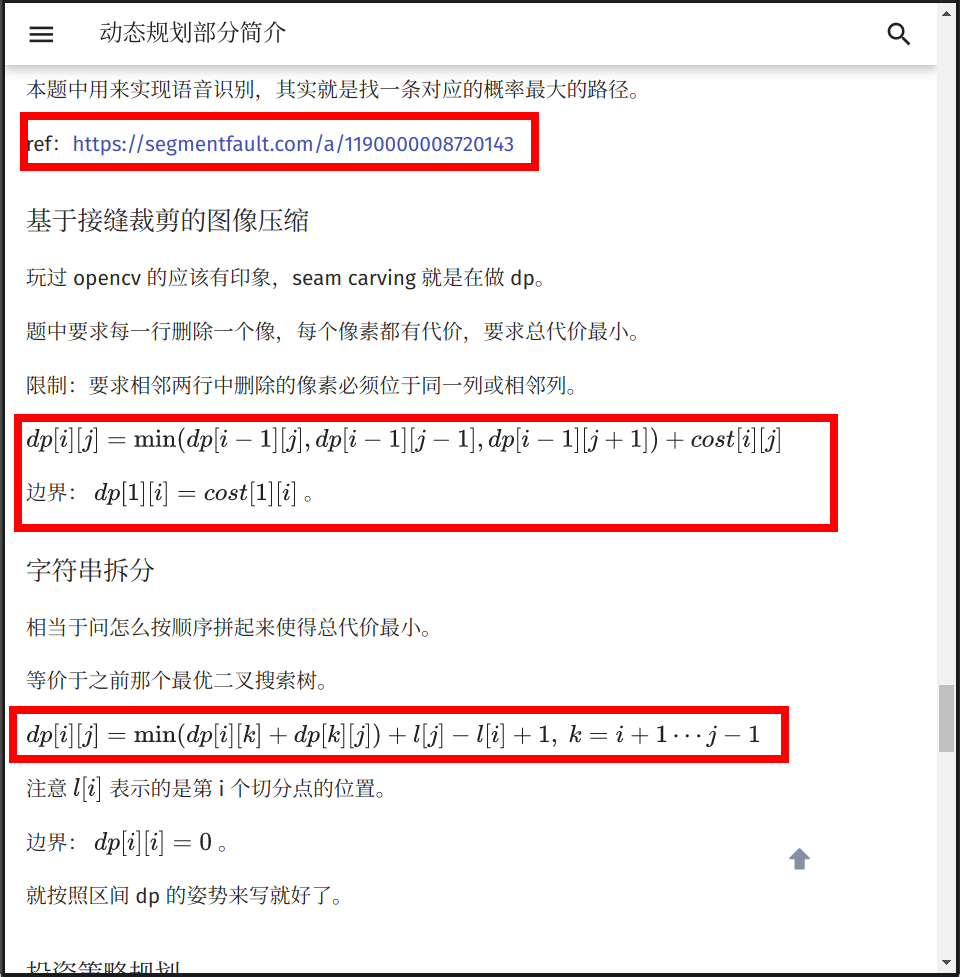
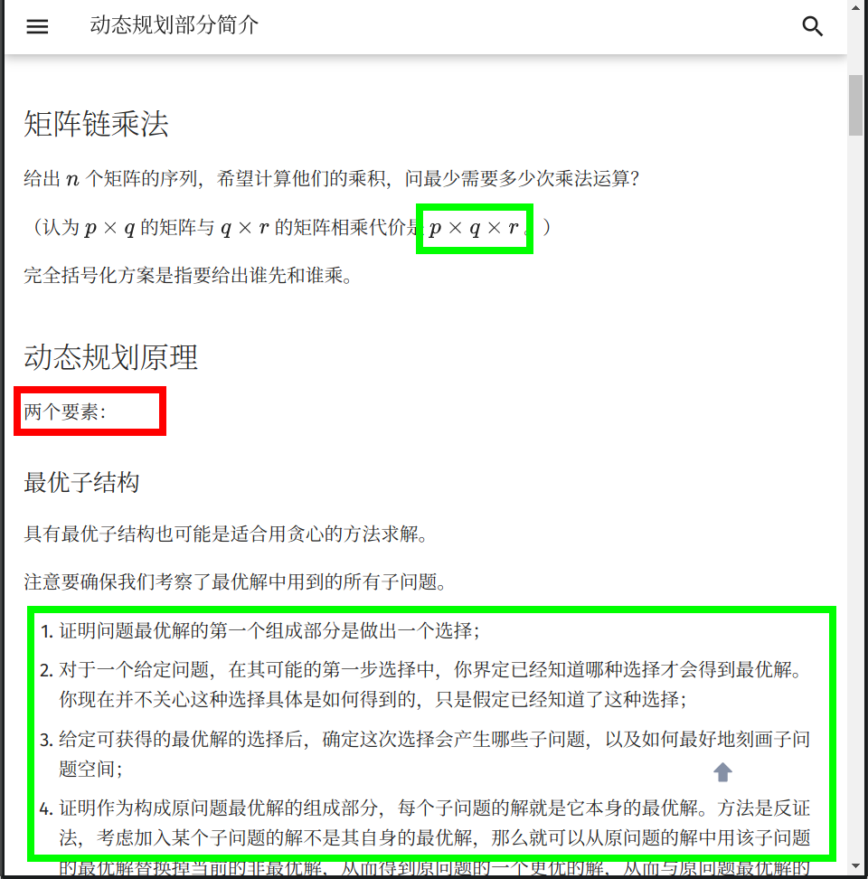
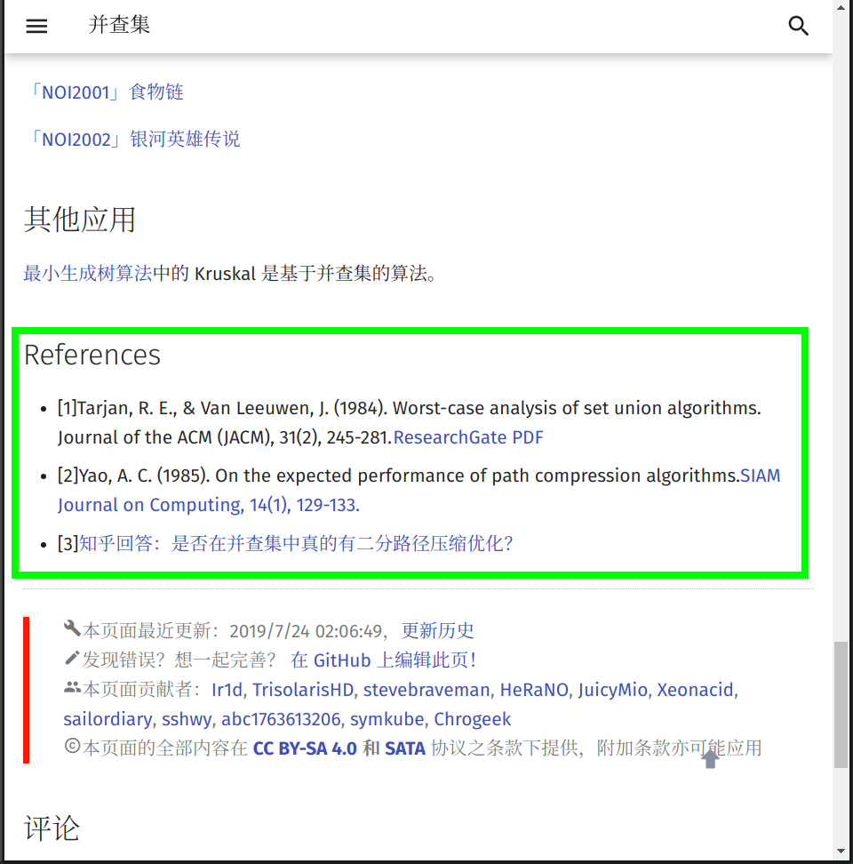

在文章开始之前，**OI Wiki** 项目组全体成员十分欢迎您为本项目贡献页面。正因为有了上百位像您一样的人，才有了 **OI Wiki** 的今天！

本页面将列出在 **OI Wiki** 编写过程时推荐使用的格式规范与编辑方针。请您在撰稿或者修正 Wiki 页面以前，仔细阅读以下内容，以帮助您完成更高质量的内容。

如果您已迫不及待，想要快速上手，建议先阅读图片举例的章节。

## 贡献文档要求

当你打算贡献某部分的内容时，你应该尽量熟悉以下三部分：

- 文档存储的格式
- 文档的合理性
- remark-lint 和 $\rm{\LaTeX}$ 公式的格式要求

### 文档引用与存储的格式

- **文件名请务必都小写，以 `-` 分割。** 例如：`file-name.md`。

- 请务必确保文档中引用的 **外链** 图片已经全部转存到了 **本库内** 对应的 `images` 文件夹中（防止触发某些网站的防盗链），建议处理成 `MD 文档名称 + 编号` 的形式（可参考已有文档中图片的处理方式）。例如：本篇文档的文件名称为 format，则文档中引用的第一张图片的名字为 `format1.png`。

- 推荐使用 SVG 格式的图片[^ref4]，以获取较好的清晰度和缩放效果。

- 同时具有源文件和导出图像的图片（例如 JPG 文件与 PSD 文件或者 SVG 图像与 TikZ TeX 源代码），建议将源文件以与图片相同的文件名保存于同一目录下。

- 请确保您的文档中的引用链接的稳定性。**不推荐** 引用 **自建** 服务中的资源（如自建 OJ 里的题目）。建议在添加时同时将该外链存于互联网档案馆[^webarchive]，以防无法替代的链接失效。

- 站内链接请去掉网站域名，并且使用相对路径链接对应 `.md` 文件。例如，在本页面（`intro/format`）中链接杂项简介（`misc`），应使用 `[杂项简介](../misc/index.md)`。

### 文档的合理性

**合理性**，指所编写的 **内容** 必须具有如下的特性：

- 由浅入深，内容的难度应该具有渐进性。
-   逻辑性。

    -   对于算法或数学概念类内容的撰写应该尽量包含以下的内容：

        1. 原理：说明该内容对应的原理；
        2. 例子：给出 1 ~ 2 个典型的例子；
        3. 题目：在该标题下，**只需要给出题目名字和题目链接**。对于算法类题目，题目链接 OJ 的优先级为：原 OJ（国外 OJ 要求国内可流畅访问）> UOJ > LOJ > 洛谷。

        示例页面：[IDA\*](../search/idastar.md)

    -   对于工具类内容的撰写应该尽量包含以下的内容：

        1. 简介：阐明该工具的背景与用途。
        2. 配置方式：详细给出下载、安装、配置环境与使用的过程。

        示例页面：[WSL (Windows 10)](../tools/wsl.md)

除现有内容质量较低的情况外，建议尽量从 **补充** 的角度来做贡献，而非采取直接覆盖的方式。如果拿不准主意，可以参考 [关于本项目的交流方式](about.md#交流方式) 一节，与 **OI Wiki** 项目组联系。

### 文档的基本格式要求

#### Remark-lint 的格式要求

[remark-lint](https://github.com/remarkjs/remark-lint) 可以自动给项目内文件统一风格。**OI Wiki** 现在启用的配置文件托管在 [.remarkrc](https://github.com/OI-wiki/OI-wiki/blob/master/.remarkrc)。

在配置过程中 **OI Wiki** 项目组也遇到了一些 remark-lint 不能很好处理的问题，所以请严格按照下列要求编辑文档：

- 不要使用如 `<h1>` 或者 `# 标题` 的一级标题。

- 标题要空一个英文半角空格，例如：`## 简介`。

- 由于 remark-lint 不能很好地处理删除线，因此请不要使用删除线语法（不使用删除线语法的另外一个原因是，删除线划去的内容大多为「抖机灵」性质，对读者理解帮助不大，不符合下面的「文本内容的格式要求」中对内容表述的要求）。

-   列表：
    - 列表前要有空行，新开一段。
    - 使用有序列表（如 `1. 例子`）时，点号后要有空格。

- 行间公式前后各要有一行空行，否则会被当做是行内公式。

-   涉及到目录的更改的时候：
    - 需要改动 `mkdocs.yml`。
    - 如果影响到作者信息统计，需要更新 [author 字段](faq.md#_11)（不改动目录的时候不需要维护 author 字段）。
    - 需要在项目内搜索一下是否有内链需要更新。
    - 如果造成了死链，麻烦更新 [重定向文件](https://github.com/OI-wiki/OI-wiki/blob/master/docs/_redirects)。详见 [重定向文件](faq.md#_11)。

-   使用 `???` 或 `!!!` 开头的 Details 语法时，每一行要包括在 Details 语法的文本框的文本，开头必须至少有 4 个空格。

    **即使是空行，也必须保持与其他行一致的缩进。请不要使用编辑器的自动裁剪行末空格功能。**

    示例：

    ```text
    ???+ warning
        请记得在文本前面添加 4 个空格。其他的语法还是与 Markdown 语法一致。
        
        不添加 4 个空格的话，文本就不会出现在 Details 文本框里了。
        
        这个`???`是什么的问题会在下文解答。
    ```

    ???+ warning
        请记得在文本前面添加 4 个空格。其他的语法还是与 Markdown 语法一致。
        
        不添加 4 个空格的话，文本就不会出现在 Details 文本框里了。
        
        这个 `???` 是什么的问题会在下文解答。

- 代码样式的纯文本块请使用 ```` ```text````。直接使用 ```` ``` ```` 而不指定纯文本块里的语言，可能会导致内容被错误地缩进。

#### 标点符号的使用

- 请在每句话的末尾添加 **句号**。
- 请正确使用 **全角** 标点符号与 **半角** 标点符号。汉语请使用全角符号，英语请使用半角符号。
- 注意区分 **顿号** 与 **逗号** 的使用。
- 注意 **括号** 的位置。句内括号与句外括号的位置不同。
- 通常使用 **分号** 来表示列表环境中各复句之间的关系。
- 请特别注意，我们通常习惯使用 `「` 与 `」` 来提高 **中文引号** 的辨识度。
- 对于有序列表，推荐在每一项的后面添加 **分号**，在列表最后一项的后面添加 **句号**；对于无序列表，推荐在每一项的后面添加 **句号**。

示例：

> - 中学生学科竞赛主要包括信息学奥林匹克竞赛、信息学奥林匹克竞赛、信息学奥林匹克竞赛、信息学奥林匹克竞赛和信息学奥林匹克竞赛（谁写的这个示例，建议抬走）。
> - “你吃了吗？”，李四问张三。
> - 我想对你说：“我真是太喜欢你了。”
> - 「苟利国家生死以，岂因祸福避趋之！」
> - 张华考上了大学；李萍进了技校；我当了工人：我们都有美好的前途。[^note1]
> -   以下是这个算法的基本流程：
>     1. 初始化到各点的距离为无穷大，将所有点设置为未被访问过，初始化一个队列；
>     2. 将起点放入队列，将起点设置为已被访问过，更新到起点的距离为 $0$；
>     3. 取出队首元素，将该元素设置为未被访问过；
>     4. 遍历所有与此元素相连的边，若到这个点存在更短的距离，则进行松弛操作；
>     5. 若这个点未被访问过，则将这个点放入队列，且设置这个点为已经访问过；
>     6. 回到第三步，直到队列为空。

#### Markdown 格式与主题扩展格式要求

- 表示强调时请使用 `**SOMETHING**` 和 `「」`，而非某级标题，因为使用标题会导致文章结构层次混乱和（或）目录出现问题。

-   请正确使用 Markdown 的区块功能。插入行内代码请使用一对反引号包围代码区块；行间代码请使用一对 ```` ``` ```` 包围代码区块，其中反引号就是键盘左上角波浪线下面那个符号，行间代码请在第一个 ```` ``` ```` 的后面加上语言名称（如：```` ```cpp````）。

    示例：

    ````text
    ```cpp
    // #include<stdio.h>    //不好的写法
    #include <cstdio>  //好的写法
    ```
    ````

    ```cpp
    // #include<stdio.h>    //不好的写法
    #include <cstdio>  //好的写法
    ```

-   「参考资料与注释」使用 Markdown 的脚注功能进行编写。格式为：

    ```markdown
    文本内容。[^脚注名]
    [^脚注名]: 参考资料内容。注意：冒号是英文冒号，冒号后面跟着一个空格。
    ```

    脚注名既可以使用数字也可以使用文本。脚注名摆放的位置与括号的用法一致。为美观起见，建议同一个页面内的脚注名遵循统一的命名规律，如：ref1、ref2、note1……

    脚注的内容统一放在 `## 参考资料与注释` 二级标题下。

    示例：

    ```markdown
    当 `#include <cxxxx>` 可以替代 `#include <xxxx.h>` 时，应使用前者。[^ref1]

    2020年1月21日，CCF宣布恢复NOIP。[^ref2]

    ## 参考资料与注释

    [^ref1]: [cstdio stdio.h namespace](https://stackoverflow.com/questions/10460250/cstdio-stdio-h-namespace)

    [^ref2]: [CCF关于恢复NOIP竞赛的公告-中国计算机学会](https://www.ccf.org.cn/c/2020-01-21/694716.shtml)
    ```

    当 `#include <cxxxx>` 可以替代 `#include <xxxx.h>` 时，应使用前者。[^ref1]

    2020 年 1 月 21 日，CCF 宣布恢复 NOIP。[^ref2]

-   建议使用主题扩展的 `???+note` 格式来描述题面和参考代码。具体格式如下：

    ```text
    ??? note "标题"
        这个文本框会被默认折叠。

        推荐将**解题代码**放在折叠文本框内。

    ???+note " [标题](http://acm.hdu.edu.cn/showproblem.php?pid=1000)"
        标题也可以使用 Markdown 的超链接。这里的超链接是 HDOJ 的“A + B Problem”。

        而且推荐以这种方式**标注原题链接**。

        注意双引号的位置。
    ```

    ??? note "标题"
        这个文本框会被默认折叠。
        
        推荐将 **解题代码** 放在折叠文本框内。

    ???+note " [标题](http://acm.hdu.edu.cn/showproblem.php?pid=1000)"
        标题也可以使用 Markdown 的超链接。这里的超链接是 HDOJ 的“A + B Problem”。
        
        而且推荐以这种方式 **标注原题链接**。
        
        注意双引号的位置。

    两种格式的区别是，带 `+` 的会默认保持展开，而不带 `+` 的会默认保持折叠。

    如果需要嵌套折叠框，推荐使用 [MDUI 的阴影样式](https://www.mdui.org/docs/shadow#use)，提高内层折叠框的海拔。

    **OI Wiki** 支持 `.mdui-shadow-[0-24]`，一般情况下最多用到两层折叠框，外层用 `note` 即可（其实就是 `mdui-shadow-2`），内层推荐使用 `mdui-shadow-6`。

    示例：

    ````text
    ???+note "题目"
        内容
        
        ??? mdui-shadow-6 "参考代码"
            ```cpp
            代码
            ```
    ````

    ???+note "题目"
        内容
        
        ??? mdui-shadow-6 "参考代码"
            ```cpp
            代码
            ```

如果对 mkdocs-material（我们使用的这个主题）还有什么问题，还可以查阅 [MkDocs 使用说明](https://github.com/ctf-wiki/ctf-wiki/wiki/Mkdocs-%E4%BD%BF%E7%94%A8%E8%AF%B4%E6%98%8E) 和 [cyent 的笔记](https://cyent.github.io/markdown-with-mkdocs-material/)。前者介绍了 mkdocs-material 主题的插件使用方式，而后者介绍了 Markdown 传统语法和 mkdocs-material 支持的扩展语法。

#### 文本内容的格式要求

- 所有的 **OI Wiki** 文本都应使用粗体标记。

-   在页面的开头应有一段简短的文字（如「本页面将介绍……」），用于概述页面内容。

    例：

    > 本页面将列出在 **OI Wiki** 编写过程时推荐使用的格式规范与编辑方针。

-   涉及到“前置知识”的页面，请在开头添加一行 **前置知识：……**，放在页面概述前。格式如下：

    `前置知识：[站内页面1](url1)、[站内页面2](url2)和[站内页面3](url3)`

    例：

    > 前置知识：[时间复杂度](../basic/complexity.md)
    >
    > 本页面将介绍基础的计算理论的知识。

- 请注意文档结构。文档结构应当十分条理，层次清晰。请不要让诸如「五级标题」这种事情再次发生了，一篇正常的文章是用不到如此复杂的结构层次的。

- 请注意内容的表述。作为一个百科网站，**OI Wiki** 使用的语言应该是书面的，客观的。诸如「抖机灵」性质的，对读者理解帮助不大的内容，不应该出现在 **OI Wiki** 当中。

-   请尽量为链接提供完整的标题、或者可被识别的提示，避免使用裸地址和“这”、“此”之类的模糊不清的描述。每一个超链接都应尽量对其加以清楚明确的描述，方便读者明白该超链接将指向何处。

    建议使用源文章或者标签页的标题。

    ```markdown
    <!-- 不推荐的写法 -->
    请参考[这个页面](https://docs.github.com/en/github/collaborating-with-issues-and-pull-requests/syncing-a-fork)
    <!-- 不推荐的写法 -->
    请参考 <https://docs.github.com/en/github/collaborating-with-issues-and-pull-requests/syncing-a-fork>
    <!-- 推荐的写法 -->
    请参考 GitHub 官方的帮助页面 [Syncing a fork - GitHub Docs](https://docs.github.com/en/github/collaborating-with-issues-and-pull-requests/syncing-a-fork)
    ```

    > 请参考 GitHub 官方的帮助页面 [Syncing a fork - GitHub Docs](https://docs.github.com/en/github/collaborating-with-issues-and-pull-requests/syncing-a-fork)

- 受 Markdown 格式限制，`## 参考资料与注释` 二级标题必须放在文末。

-   所有用作序号的数字建议使用中文。示例：
    - 数列的第一项。
    - 输入文件的第一行。

- 请尽量避免在标题中使用 MathJax 公式，无论是几级标题。在标题中使用公式有可能会导致目录显示错误。[^ref3]

-   请注意代码的可读性。
    - 代码应拥有清晰的逻辑。
    - 建议在参考代码中添加适当注释以方便读者理解。
    - 尽量避免出现影响阅读的预编译指令和宏定义。

#### LaTeX 公式的格式要求

LaTeX 作为公式排版的首选，我们应当正确地使用它。因此对于 LaTeX 的使用我们有严格的要求。如果您想要快速上手，可以阅读本章节末给出的表格。

-   使用 Roman 体表示常量和函数。使用 Italic 体表示变量。LaTeX 已经预先定义好了一些常见的常量、函数、运算符等，我们可以直接调用，包括但不限于：

    ```latex
    \log, \ln, \lg, \sin, \cos, \tan, \sec, \csc, \cot, \gcd, \min, \max, \exp, \inf, \mod, \bmod, \pmod
    ```

    所以在输入常量、函数名、运算符等时，请先检查一下是否应该使用 Roman 体或其它字体。LaTeX 符号的书写可参考 [KaTeX 的 Supported Functions 页面](https://katex.org/docs/supported.html)（不是全部），也可以搜索求解。

    如果遇到没有预先定义好的需要使用 Roman 体的 **函数名**，我们可以使用 `$\operatorname{something}$` 来产生，如我们可以使用 `$\operatorname{lcm}$` 产生正体的最小公倍数（函数）符号。同理，产生 Roman 体的 **常量** 应用 `$\mathrm{}$`；产生 Roman 体粗体符号应用 `$\mathbf{}$`；产生 Italic 体粗体符号应用 `$\boldsymbol{}$`（如向量 $\boldsymbol{a}$）。对于多字母的变量，应当使用 `$\textit{}$`。其他非数学内容，包括英文、特殊符号等，一律使用 `$\text{}$`。中文我们则建议不放在 LaTeX 公式中。

- 在行内使用分数的时候，请使用 `$\dfrac{}{}$`。比如 `$\dfrac{1}{2}$`，效果 $\dfrac{1}{2}$，而不是 `$\frac{1}{2}$`，效果 $\frac{1}{2}$。

- 组合数请使用 `\dbinom{n}{m}`，效果 $\dbinom{n}{m}$，而不是 `{n \choose m}`（在 LaTeX 中这种写法已不推荐）；与上一条关于分数的约定相似，请不要使用 `\binom{n}{m}`，效果 $\binom{n}{m}$。

- 尽可能避免在行内使用巨运算符（如 $\sum$，$\prod$，$\int$ 等）。

- 在不会引起歧义的情况下，请用 `$\times$` 代替星号，叉乘请使用 `$\times$`，点乘请使用 `$\cdot$`。如 $a\times b$，$a\cdot b$，而不是 $a\ast b$。

- 请用 `$\cdots$`（居于排版基线与顶线中间），`$\ldots$`（居于排版基线的位置），`$\vdots$`（竖着的省略号）代替 `$...$`。如 $a_1,a_2,\cdots a_n$，而不是 $a_1,a_2,... a_n$。

- 请注意，不要在非代码区域使用任何程序设计语言的表示方式，而是使用 LaTeX 公式。例如，使用 `$=$` 而不是 `$==$`（如 $a=b$，而不是 $a==b$）、使用 `` `a<<1` `` 或者 `$a\times 2$` 而不是 `$a<<1$`、使用 `$a\bmod b$` 代替 `$a\%b$`（如 $a\bmod b$，而不是 $a\%b$）等。

- 公式中不要使用中括号连缀（即 C++ 高维数组的表示方式）而多使用下标。即 $a_{i,j,k}$ 而不是 $a[i][j][k]$。在公式中下标较复杂的情况下建议改用多元函数（$f(i,j,k)$）或内联代码格式。对于一元简单函数使用 `$f_i$`、`$f(i)$` 或 `$f[i]$` 均可。

- 为了统一且书写方便，复杂度分析时大 $O$ 记号请直接使用 `$O()$` 而不是 `$\mathcal O()$`。

- 分段函数环境 `cases`  **只能有两列**（即一个 `&` 分隔符）。

-   请不要滥用 LaTeX 公式。这不仅会造成页面加载缓慢（因为 MathJax 的效率低是出了名的），同时也会导致页面的排版混乱。我们通常使用 LaTeX 公式字体表示变量名称。我们的建议是，如非必要，尽量减少公式与普通正文字体的 **大量** 混合使用，如非必要，尽量不要使用公式，如：

    ```LaTeX
    我们将要学习 $Network-flow$ 中的 $SPFA$ 最小费用流，需要使用 $Edmonds-Karp$ 算法进行增广。
    ```

    就是一个典型的 **滥用公式字体** 的例子。（在页面中使用斜体请用 `*文本*` 表示。）

-   请正确使用对应的 LaTeX 符号，尤其是公式中的希腊字母等特殊符号。如欧拉函数请使用 `$\varphi$`，圆的直径请使用 `$\Phi$`，黄金分割请使用 `$\phi$`。这些符号虽然同样表示希腊字母 Phi，但是在不同的环境下有不同的含义。切记 **不要使用输入法的插入特殊符号** 来插入这种符号。

    另外，由于 LaTeX 历史原因，空集的符号应为 `$\varnothing$` 而不是 `$\emptyset$`；由于近百年来数学符号演变，定义集合符号应使用 **人民教育出版社普通高中数学教材 A 版** 书写的版本，即 实数集 `$\mathbf{R}$`，正整数集 `$\mathbf{N}^*$` 等。同理，其他的符号应按照中国国内最常使用的版本来书写，重点参照数学和信息技术课本。

我们可以使用一个表格来总结一下上述内容。注意本表格没有举出所有符号的用法，只给出常见的错误。类似的情况类比即可。

| 不符合规定的用法          | 渲染效果            | 符合规定的用法                                  | 渲染效果                                |
| ----------------- | --------------- | ---------------------------------------- | ----------------------------------- |
| `$log, ln, lg$`   | $log, ln, lg$   | `$\log$, $\ln$, $\lg$`                   | $\log$，$\ln$，$\lg$                  |
| `$sin, cos, tan$` | $sin, cos, tan$ | `$\sin$, $\cos$, $\tan$`                 | $\sin$，$\cos$，$\tan$                |
| `$gcd, lcm$`      | $gcd, lcm$      | `$\gcd$, $\operatorname{lcm}$`           | $\gcd$，$\operatorname{lcm}$         |
| `$ 小于 a 的质数 $`    | $小于 a 的质数$      | `小于 $a$ 的质数`                             | 小于 $a$ 的质数                          |
| `$...$`           | $...$           | `$\cdots$, $\ldots$, $\vdots$, $\ddots$` | $\cdots$，$\ldots$，$\vdots$，$\ddots$ |
| `$a*b$`（两个数相乘）    | $a*b$           | `$a\times b$, $a\cdot b$`                | $a\times b$，$a\cdot b$              |
| `$SPFA$`（英文名称）    | $SPFA$          | `SPFA`                                   | SPFA                                |
| `$a==b$`          | $a==b$          | `$a=b$`                                  | $a=b$                               |
| `$f[i][j][k]$`    | $f[i][j][k]$    | `$f_{i,j,k}$, $f(i,j,k)$`                | $f_{i,j,k}$，$f(i,j,k)$              |
| `$R,N^*$`（集合）     | $R,N^*$         | `$\mathbf{R}$, $\mathbf{N}^*$`           | $\mathbf{R}$，$\mathbf{N}^*$         |
| `$\emptyset$`     | $\emptyset$     | `$\varnothing$`                          | $\varnothing$                       |
| `$different$`     | $different$     | `$\textit{different}$`                   | $\textit{different}$                |

#### 对数学公式的附加格式要求

请注意，尽管上述输入公式的语法和真正的 LaTeX 排版系统非常相似，但 **MathJax 和 LaTeX 是两个完全没有关系的东西**，MathJax 仅仅使用了一部分与 LaTeX 非常相似的语法而已。实际上，二者之间有不少细节差别，而这些差别经常导致写出来的公式在二者之间不通用。

由于 **OI Wiki** 使用 LaTeX 排版引擎开发了 PDF 导出工具，因此有必要强调公式在 MathJax 和 LaTeX 之间的兼容性。**请各位在 Wiki 中书写数学公式时注意以下几点。**

这些规则已经向 MathJax 做了尽可能多的妥协。导出工具兼容了一部分原本仅能在 MathJax 中正常输出的写法。

- 请使用 `\begin{aligned} ... \end{aligned}` 表示多行对齐的公式；

- 如果这些多行对齐的公式需要 **编号**，请用 `align` 或 `equation` 环境；

- 不要使用 `split`、`eqnarray` 环境；

- 不要使用 `\lt`,`\gt` 来表示大于号和小于号，请直接使用 `<`，`>`；

- 不要直接用 `\\` 换行（需要换行的公式，请套在 `aligned` 或其他多行环境下）；

- 若要输出 LaTeX 符号 $\rm{\LaTeX}$，请用 `$\rm{\LaTeX}$`，而不是 `mathrm`；（`\LaTeX` 在 TeX 排版系统中是一个不能用于数学模式下的命令，而 `\mathrm` 又不能在普通模式下使用；另外，`\text` 命令虽然在 TeX 上正常输出，但是在 MathJax 中 `\text` 命令的参数会被原样输出，而不是按命令转义）；

- 数学公式中的中文文字 **必须置于 `\text{}` 命令之中**，而变量、数字、运算符、函数名称则必须置于 `\text{}` 命令之外。**请不要在 `\text{}` 命令中嵌套数学公式**；

-   使用 `array` 环境时请注意 **实际列数与对齐符号的数量保持一致**。例如下面的公式中，数据实际有 3 列（`&` 是列分隔符），因此需要 3 个对齐符号（`l`/`r`/`c` 分别表示左、右、居中对齐）。

    ```latex
    $$
    \begin{array}{lll}
    F_1=\{\frac{0}{1},&&\frac{1}{1}\}\\
    F_2=\{\frac{0}{1},&\frac{1}{2},&\frac{1}{1}\}\\
    \end{array}
    $$
    ```

#### 伪代码格式

伪码具体格式没有严格要求，请参考算法导论或学术论文。注意不要写成 Python。

Wiki 内使用 LaTeX 书写伪码，整体处于 array 环境中，缩进使用 `$\qquad$`，文字描述使用 `$\text$`，关键字使用 `$\textbf$`，赋值使用 `$\gets$`。

参考示例：

$$
\begin{array}{ll}
1 &  \textbf{Input. } \text{The edges of the graph } e , \text{ where each element in } e \text{ is } (u, v, w) \\
  &  \text{ denoting that there is an edge between } u \text{ and } v \text{ weighted } w . \\
2 &  \textbf{Output. } \text{The edges of the MST of the input graph}.\\
3 &  \textbf{Method. } \\ 
4 &  result \gets \varnothing \\
5 &  \text{sort } e \text{ into nondecreasing order by weight } w \\ 
6 &  \textbf{for} \text{ each } (u, v, w) \text{ in the sorted } e \\ 
7 &  \qquad \textbf{if } u \text{ and } v \text{ are not connected in the union-find set } \\
8 &  \qquad\qquad \text{connect } u \text{ and } v \text{ in the union-find set} \\
9 &  \qquad\qquad  result \gets result\;\bigcup\ \{(u, v, w)\} \\
10 &  \textbf{return }  result
\end{array}
$$

```latex
$$
\begin{array}{ll}
1 &  \textbf{Input. } \text{The edges of the graph } e , \text{ where each element in } e \text{ is } (u, v, w) \\
  &  \text{ denoting that there is an edge between } u \text{ and } v \text{ weighted } w . \\
2 &  \textbf{Output. } \text{The edges of the MST of the input graph}.\\
3 &  \textbf{Method. } \\
4 &  result \gets \varnothing \\
5 &  \text{sort } e \text{ into nondecreasing order by weight } w \\
6 &  \textbf{for} \text{ each } (u, v, w) \text{ in the sorted } e \\
7 &  \qquad \textbf{if } u \text{ and } v \text{ are not connected in the union-find set } \\
8 &  \qquad\qquad \text{connect } u \text{ and } v \text{ in the union-find set} \\
9 &  \qquad\qquad  result \gets result\;\bigcup\ \{(u, v, w)\} \\
10 &  \textbf{return }  result
\end{array}
$$
```

## 图解

可能上述要求把握起来有些困难，接下来我们给出一些图片来具体分析哪种格式应该使用，哪种不该使用：

### 例 1


将复杂的 LaTeX 公式使用行间格式，可以使得页面错落有致。但 **OI Wiki** 作为一个以中文为主体的站点，我们希望大部分纲领性的信息（如标题）尽量使用中文（除英文专有名词）。

### 例 2


较复杂度的 LaTeX 公式请注意等号的对齐，同时可以适当引用 Wiki 的页面 **链接** 来完善内容。

### 例 3



一般情况下，我们建议将引用的资料列在文末的 `##参考资料与注释` 一节，并在原句后面加上脚注，而不是直接给出链接。同时一定要避免使用 LaTeX 公式表达代码，上图中两个中括号就是不规范的写法。我们建议使用 `dp(i,j)` 或者 `dp_{i,j}`。

### 例 4



注意我们描述 **乘法** 的时侯一般使用 `\times` 或者 `\cdot`，特殊情况（如卷积）下会使用 `*`（也可以写成 `\ast`）。标题是简洁的词组，但我们不希望正文部分由词组拼凑而成。上图中“两个要素”，建议更改为“动态规划的原理具有以下两个要素”，上下文保持连贯。可取的地方是，适当使用 **有序** 列表可以更有条理地表述内容。再次提醒，在使用列表的时侯，每一项如果是一句话，需要在末位添加 **标点符号**。有序列表通常添加分号，在最后一项末位添加句号；无序列表统一添加句号。

### 例 5


适当引用 **图片** 可以增强文章易读性。使用 **伪代码** 的方式表达算法过程可以方便又简洁地描述算法过程，相比于直接贴模板代码更加好懂。

### 例 6


同样的问题，标题使用英文。并且在使用完括号后没有句号。另外，上图中的行间公式虽然没有使用艾弗森括号，但是由于下标嵌套过多，使得最底层的下标字体很小，整个公式也并不美观。建议将 `son_{now,i}` 更换为 `son(now,i)`，或者把 `f_{now}` 替换为 `f(now)`。我们希望尽量控制下标嵌套在两层以内（上标的运用主要是数学表达式，因此可以允许多次嵌套，如 $2^{2^{2^{2^{\cdots}}}}$，《上帝造题的七分钟》）。

### 例 7


使用 MkDocs 扩展语法，让例题题面与算法描述区分开。将代码折叠，可以让文章更紧凑。（毕竟看 Wiki 的大多数是了解思路，除了模板代码需要阅读外，习题的代码大多可以折叠。）在描述函数操作时，使用行内代码和 LaTeX 公式都是不错的选择。

### 例 8



在文末罗列出参考文献，可以使页面的内容更严谨，真实可信。

## 外部链接

- [标点符号用法（GB/T 15834—2011）](http://www.moe.gov.cn/s78/A19/yxs_left/moe_810/s230/201001/W020190128580990138234.pdf)
- [维基百科：格式手册/标点符号](https://zh.wikipedia.org/wiki/Wikipedia:%E6%A0%BC%E5%BC%8F%E6%89%8B%E5%86%8C/%E6%A0%87%E7%82%B9%E7%AC%A6%E5%8F%B7)
- [中文文案排版指北（简体中文版）](https://mazhuang.org/wiki/chinese-copywriting-guidelines/)
- [中文文案风格指南 - PDFE GUIDELINE](https://pdfe.github.io/GUIDELINE/#/others/copywriter)
- [一份（不太）简短的 LATEX2ε 介绍或 106 分钟了解 LATEX2ε](https://github.com/CTeX-org/lshort-zh-cn/releases)

## 参考资料与注释

[^note1]: （冒号）表示总结上文。

[^ref1]: [cstdio stdio.h namespace](https://stackoverflow.com/questions/10460250/cstdio-stdio-h-namespace)

[^ref2]: [CCF 关于恢复 NOIP 竞赛的公告 - 中国计算机学会](https://www.ccf.org.cn/c/2020-01-21/694716.shtml)

[^ref3]: [我的公式为什么在目录里没有正常显示？好像双倍了](faq.md)

[^ref4]: [SVG|MDN](https://developer.mozilla.org/zh-CN/docs/Web/SVG)

[^webarchive]: [Save Page in Internet Archive](https://web.archive.org/save/)
