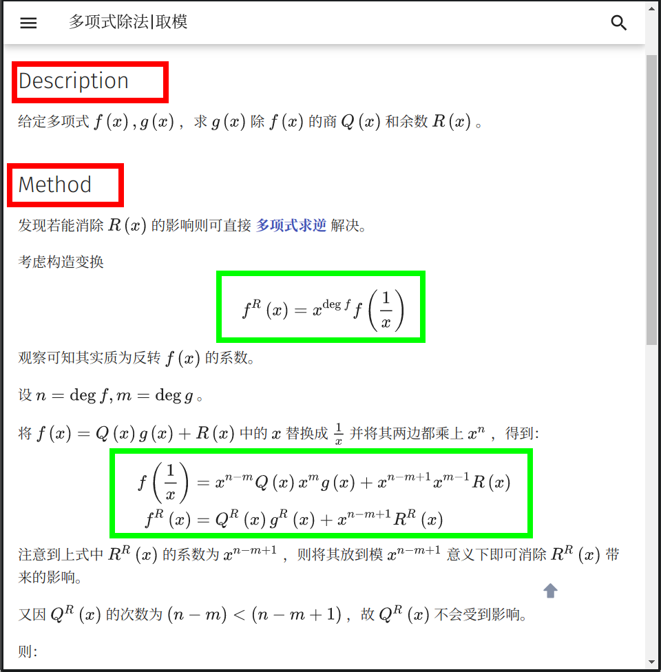
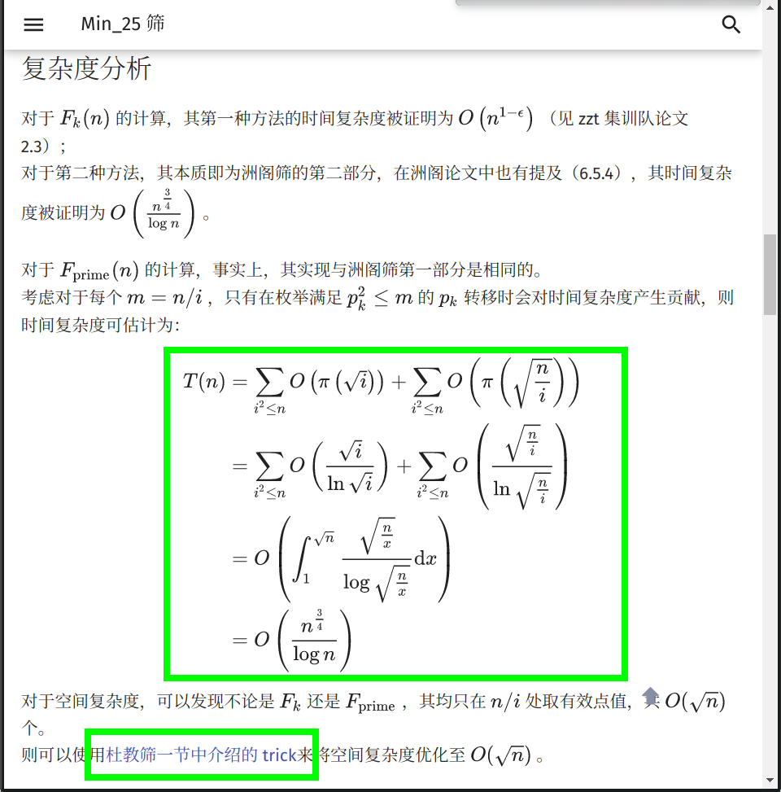
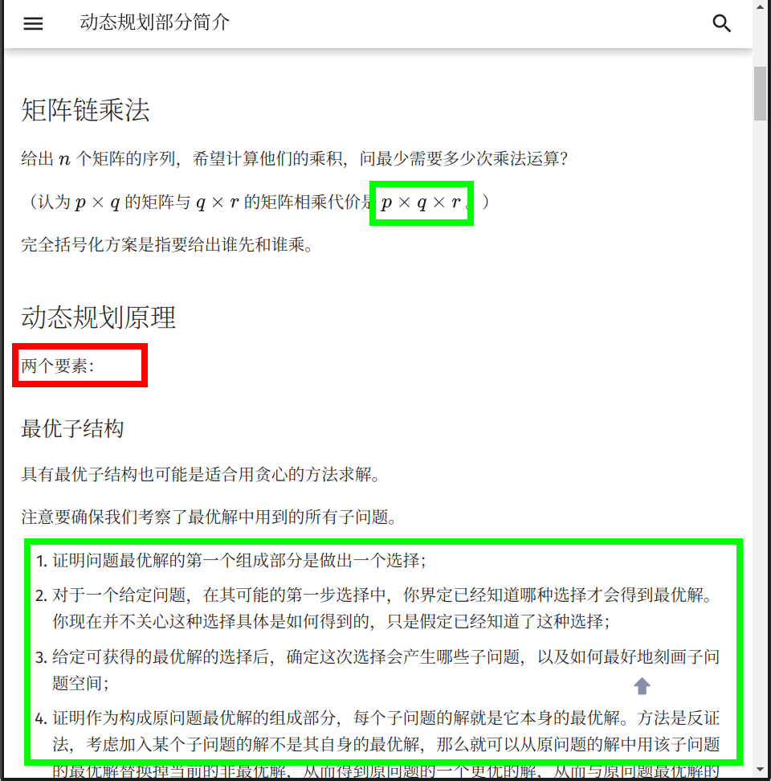
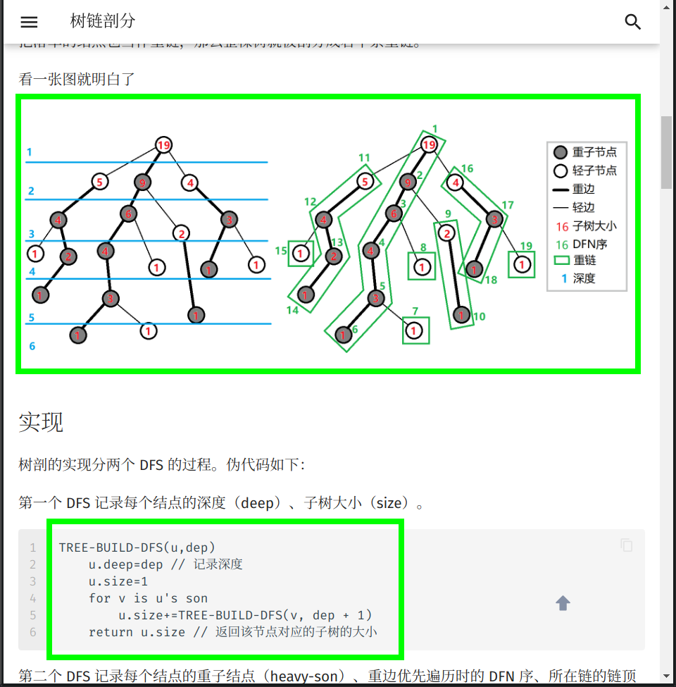
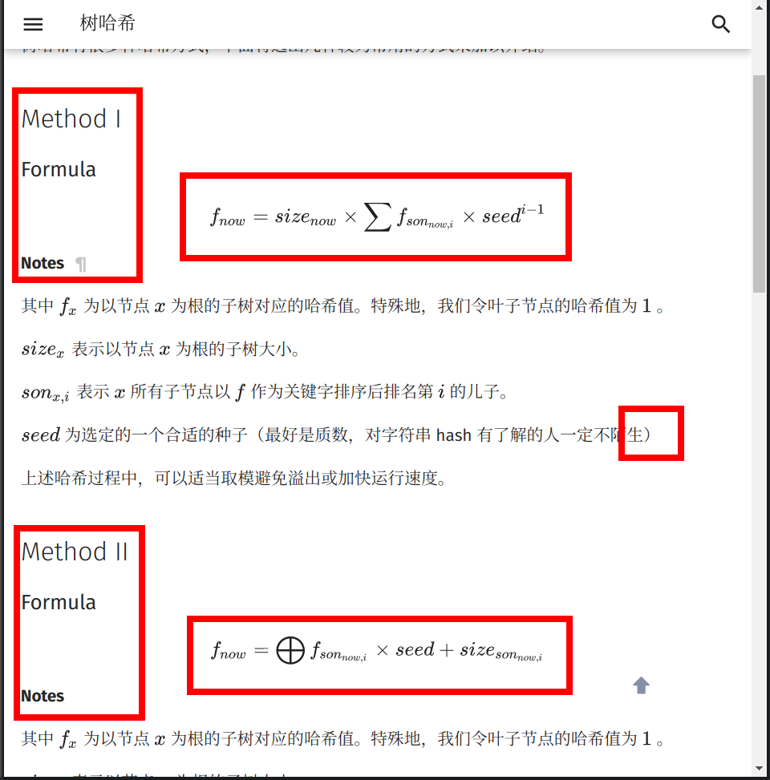
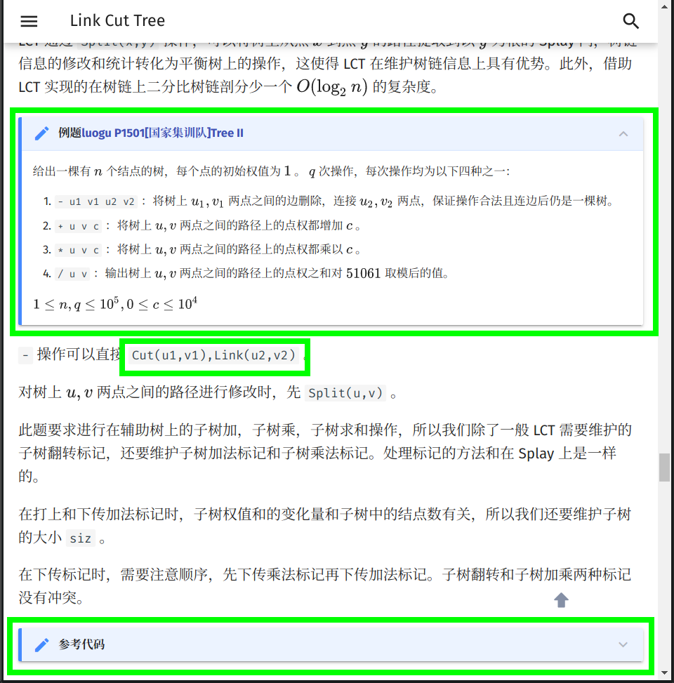
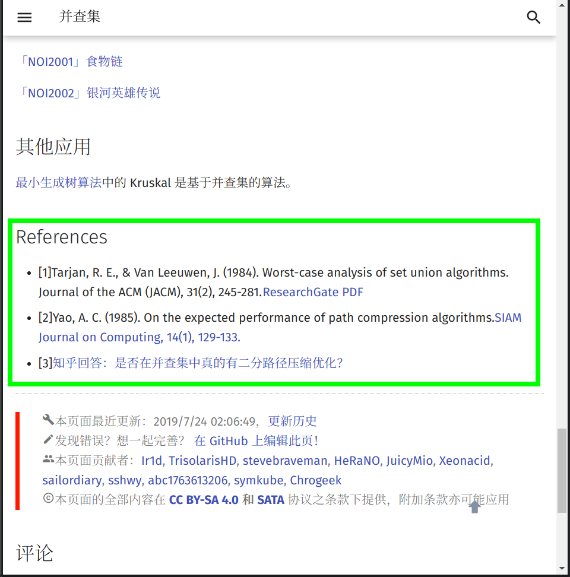

在文章开始之前， **OI Wiki** 项目组全体成员十分欢迎您为本项目贡献页面。
正因为有了上百位像您一样的人，才有了 **OI Wiki** 的今天！
这篇文章将主要叙述一些在页面编辑过程中常见的问题，并给出相应的解决方案。
请您在撰稿或者修正 Wiki 页面以前，仔细阅读以下内容，以帮助您完成更高质量的内容。

如果您迫不及待想要快速上手，建议先阅读图片举例的章节。

## 贡献文档要求

当你打算贡献某部分的内容时，你应该尽量确保：

-   文档内容满足基本格式要求；
-   文档的合理性；
-   文档存储的格式。

## 基本格式要求

### Remark-lint 要求怎样的格式

我们现在启用的配置文件在[.remarkrc](https://github.com/24OI/OI-wiki/blob/master/.remarkrc)，它可以自动给项目内文件统一风格。

在配置过程中我们也遇到了一些 remark-lint 不能很好处理的问题：

1.  不要在页面中添加 `<h1>` 或者 `# 标题` 。
2.   `## 简介` 标题要空一格（英文半角空格），也不要写成 `## 简介 ##` 。
3.  列表：
    1.  列表前要有空行，新开一段。
    2.   `1. 例子` 点号后要有空格。
4.  行间公式前后各要有一行空行，否则会被当做是行内公式。
5.  伪代码请使用 ```` ```text```` ，直接使用 ```` ``` ```` 可能导致内容被错误地缩进。
6.  涉及到目录的更改，需要改动 mkdocs.yml，另外也请注意如果影响到作者信息统计，麻烦更新[author 字段](https://oi-wiki.org/intro/faq/#_15)。
7.  所有比赛请使用官方正式中文/英文名称。特别注意 NOI 系列赛官方英文名称均为全大写，如 NOIP。

### 标点符号的使用

1.  请在每句话的末尾添加 **句号** 。
2.  请正确使用标点符号，注意区分 **全角** 符号与 **半角** 符号的使用（汉语请使用全角符号，英语请使用半角符号）。
3.  注意 **逗号** 的使用（应当使用顿号却使用了逗号等等）。
4.  注意 **括号** 的位置。
5.  请特别注意，我们通常习惯使用“ `「` ”与“ `」` ”来提高 **中文引号** 的辨识度，同时也常用 **分号** 来表示列表环境中各复句之间的关系。

请参考下面的例子更好地使用标点符号：

> -   中学生学科竞赛主要包括信息学奥林匹克竞赛、信息学奥林匹克竞赛、信息学奥林匹克竞赛、信息学奥林匹克竞赛和信息学奥林匹克竞赛（我就是这个样，你来打我啊）。
> -   “你吃了吗？”，李四问张三。
> -   我想对你说：“我真是太喜欢你了。”
> -   「苟利国家生死以，岂因祸福避趋之！」
> -   推荐题目：「LOJ #104 普通平衡树」
> -   以下是这个算法的基本流程：
>     -   第一步，初始化到各点的距离为无穷大，将所有点设置为未被访问过，初始化一个队列；
>     -   第二步，将起点放入队列，将起点设置为已被访问过，更新到起点的距离为 $0$ ；
>     -   第三步，取出队首元素，将该元素设置为未被访问过；
>     -   第四步，遍历所有与此元素相连的边，若到这个点存在更短的距离，则进行松弛操作；
>     -   第五步，若这个点未被访问过，则将这个点放入队列，且设置这个点为已经访问过；
>     -   第六步，回到第三步，直到队列为空。

### LaTeX 公式的格式

1.  请不要滥用 LaTeX 公式字体（比如对一些英文单词使用公式字体），我们通常使用 LaTeX 公式字体表示变量名称。

2.  对于 LaTeX 公式，请注意常见的问题， **一定要使用**  `$\log$` 、 `$\min$` 、 `$\max$` 、 `$\gcd$` 等，而非 `$log$` 、 `$min$` 、 `$max$` 、 `$gcd$` 。对于最小公倍数，请使用 `$\operatorname{lcm}$` 而非 `$lcm$` ，省略号请使用 `$\cdots$` ，叉乘请使用 `$\times$` ，点乘请使用 `$\cdot$` 。其他非数学内容，包括中文、英文、特殊符号等，一律使用 `\text{}` 。

3.  所有公式中的希腊字母等特殊符号，请不要使用输入法的插入特殊符号功能，而应该使用对应的 LaTeX 公式符号。如 phi 大多数情况下应该使用 `$\varphi$` 而不是 `$\phi$` 。

4.  在不会引起歧义的情况下，请用 `\times` 代替星号。如 $a\times b$ ，而不是 $a\ast b$ 。

5.  请用 `\cdots` ， `\ldots` ， `\vdots` 代替 `...` 。如 $a_1,a_2,\cdots a_n$ ，而不是 $a_1,a_2,... a_n$ 。

6.  请注意，不要将任何代码的表示方法使用 LaTeX 公式。例如，使用 `=` 而不是 `==` （如 $a=b$ ，而不是 $a==b$ ）、使用 `a<<1` 或者 $a\times 2$ 而不是 $a<<1$ 、使用 `a\bmod b` 代替 `a%b` （如 $a\bmod b$ ，而不是 $a%b$ ）等。

7.  为了统一，复杂度分析时大 $O$ 记号请直接使用 `$O()$` 而不要 `$\mathcal O()$` 。

8.  公式中尽量避免中括号而多使用下标。即 $a_{i,j,k}$ 而不是 $a[i][j][k]$ 。在公式中下标较复杂的情况下建议改用多元函数（ $f(i,j,k)$ ）或内联代码格式。

9.  LaTeX 作为公式排版的首选，我们应当正确地使用它。首先从使用 Roman 体表示常量和函数做起。LaTeX 已经预先定义好了一些常见的常量、函数、运算符等，我们可以直接调用，包括但不限于：

    ```tex
    \log, \ln, \lg, \sin, \cos, \tan, \sec, \csc, \cot, \gcd, \min, \max, \exp, \inf, \mod, \bmod, \pmod
    ```

    所以在输入常量、函数名、运算符等时，请先检查一下是否应该使用 Roman 体或其它字体，LaTeX 符号的书写可参考[此页](https://katex.org/docs/supported.html)内容（不是全部），也可以百度求解。

10. 如果遇到没有预先定义好的需要使用 Roman 体的 **函数名** ，我们可以使用 `\operatorname{something}` 来产生，如我们可以使用 `\operatorname{lcm}` 产生正体的最小公倍数（函数）符号。同理，产生 Roman 体的 **常量** 应用 `\mathrm{}` ；其他非数学内容，包括中文、英文、特殊符号等，一律使用 `\text{}` 。

11. 请不要滥用 LaTeX 公式。这不仅会造成页面加载缓慢（因为 MathJax 的效率低是出了名的），同时也会导致页面的排版混乱。我们的建议是，如非必要，尽量减少公式与普通正文字体的 **大量** 混合使用，如非必要，尽量不要使用公式，如：

           我们将要学习 $Network-flow$ 中的 $SPFA$ 最小费用流，需要使用 $Edmonds-Karp$ 算法进行增广。

    就是一个典型的 **滥用公式字体** 的例子。

12. 请正确使用对应的 LaTeX 符号。如欧拉函数请使用 `\varphi` ，圆的直径请使用 `\Phi` ，黄金分割请使用 `\phi` 。这些符号虽然同样表示希腊字母 Phi，但是在不同的环境下有不同的含义。切记 **不要使用输入法的插入特殊符号** 来插入这种符号。

    LaTeX 的省略号请使用 `\cdots` （居于排版基线与顶线中间）或 `\ldots` （居于排版基线的位置），点乘请使用 `\cdot` ，叉乘请使用 `\times` 。目前，表示 Dirichlet 卷积的符号采用 `*` （参照 Wikipedia）。

    另外，由于 LaTeX 历史原因，空集的符号应为 `\varnothing` 而不是 `\emptyset` ；由于近百年来数学符号演变，定义集合符号应使用 **人民教育出版社 A 版** 书写的版本，即 实数集 `\mathbf{R}` ，正整数集 `\mathbf{N}^*` 等。同理，其他的符号按照中国国内最常使用的版本来书写，重点参照数学和信息技术课本。

13. 请注意您的文档结构。文档结构应当是十分条理的，具有清晰的层次的。请不要让诸如「五级标题」这种事情再次发生了，一篇正常的文章是用不到如此复杂的结构层次的。

14. 表示强调时请使用 `**SOMETHING**` 而非某级标题，因为使用标题会导致文章结构层次混乱和（或）目录出现问题。

15. 请正确使用 Markdown 的区块功能，插入行间代码请使用一个反引号包围代码区块，行间代码请使用三个反引号包围代码区块，其中反引号就是键盘左上角波浪线下面那个符号。

#### 文档存储的格式

1.   **文件名请务必都小写，以 `-` 分割，如 `file-name` 。** 
2.  请务必确保您的文档中引用的 **外链** 图片已经全部转存到了 **本库内** 对应的 `images` 文件夹中（防止触发某些网站的防盗链），建议处理成 `MD 文档名称 + 编号` 的形式（可参考已有文档中图片的处理方式）。（即格式为 `` ）。
3.  请确保您的文档中的引用链接的稳定性， **不推荐** 引用 **自建** 服务（如 OJ）中的资源（如题目）

### 文档的合理性

所谓合理性，指所编写的 **内容** 必须具有如下的特性：

-   由浅入深，内容的难度应该具有渐进性。
-   逻辑性，对于每类内容的撰写应该尽量包含以下的内容：
    -   原理，说明该内容对应的原理。
    -   例子，给出 1 ~ 2 个典型的例子。
    -   题目，在该标题下， **只需要给出题目名字、题目链接** 。

### 主题扩展格式

如果对 mkdocs-material（我们使用的这个主题）还有什么问题，还可以查阅[MkDocs 使用说明](https://github.com/ctf-wiki/ctf-wiki/wiki/Mkdocs-%E4%BD%BF%E7%94%A8%E8%AF%B4%E6%98%8E)和[cyent 的笔记](https://cyent.github.io/markdown-with-mkdocs-material/)，前者介绍了 mkdocs-material 主题的插件使用方式，而后者介绍了 markdown 传统语法和 mkdocs-material 支持的扩展语法。

## 图解

可能上述要求把握起来有些困难，接下来我们给出一些图片来具体分析哪种格式应该使用，哪种不该使用。

### 例 1



将复杂的 LaTeX 公式使用行间格式，可以使得页面错落有致。但 OI Wiki 作为一个以中文为主体的站点，我们希望大部分纲领性的信息（如标题）尽量使用中文（除英文专有名词）。

### 例 2



较复杂度的 LaTeX 公式请注意等号的对齐，同时可以适当引用 Wiki 的页面 **链接** 来完善内容。

### 例 3


一般情况下，我们建议将引用的资料在页面末位罗列。同时一定要避免使用 LaTeX 公式表达代码，上图中两个中括号就是不规范的写法。我们建议使用 `dp(i,j)` 或者 `dp_{i,j}` 。 `l[j]` 同理。

### 例 4



注意我们描述 **乘法** 的时侯一般使用 `\times` 或者 `\cdot` ，特殊情况（如卷积）下会使用 `*` （也可以写成 `\ast` ）。标题是简洁的词组，但我们不希望正文部分由词组拼凑而成。上图中“两个要素”，建议更改为“动态规划的原理具有以下两个要素”，上下文保持连贯。可取的地方是，适当使用 **有序** 列表可以更有条理地表述内容，同时注意，在列表的时侯，每一项如果是一个长句，需要在末位添加 **标点符号** （句号或者分号）。

### 例 5



适当引用 **图片** 可以增强文章易读性，使用 **伪代码** 的方式表达算法过程可以方便又简洁地描述算法过程，相比于直接贴模板代码更加好懂。

### 例 6



同样的问题，标题使用英文。并且在使用完括号后没有句号。另外，上图中的行间公式虽然没有使用艾弗森括号，但是由于下标嵌套过多，使得最底层的下标字体很小，整个公式也并不美观。建议将 `son_{now,i}` 更换为 `son(now,i)` ，或者把 `f_{now}` 替换为 `f(now)` 。我们希望尽量控制下标嵌套在 2 层以内（上标的运用主要是数学表达式，因此可以允许多次嵌套，如 $2^{2^{2^{2^{\cdots}}}}$ ，《上帝造题的七分钟》）。

### 例 7



使用 mkdocs 扩展语法，让例题题面与算法描述区分开。将代码折叠，可以让文章更紧凑（毕竟看 Wiki 的大多数是了解思路，除了模板代码需要阅读外，习题的代码大多可以折叠）。在描述函数操作时，使用行内代码和 LaTeX 公式都是不错的选择。

### 例 8



在文末罗列出参考文献，可以使页面的内容更严谨，真实可信。
