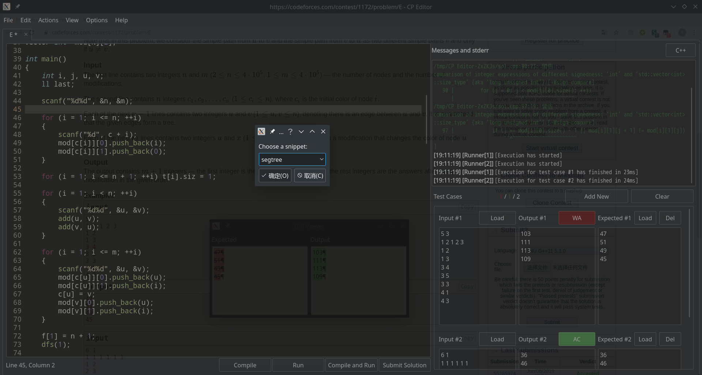

## cf-tool

GitHub 地址： [xalanq/cf-tool](https://github.com/xalanq/cf-tool/) 

cf-tool 是 Codeforces 的命令行界面的跨平台（支持 Windows、Linux、OS X）工具，其支持很多常用操作。

### 特点

-   支持 Codeforces 中的所有编程语言。
-   支持 contests 和 gym。
-   提交代码。
-   动态刷新提交后的情况。
-   拉取问题的样例。
-   本地编译和测试样例。
-   拉取某人的所有代码。
-   从指定模板生成代码（包括时间戳，作者等信息）。
-   列出某场比赛的所有题目的整体信息。
-   用默认的网页浏览器打开题目页面、榜单、提交页面等。
-   丰富多彩的命令行。

### 下载

前往 [cf-tool/releases](https://github.com/xalanq/cf-tool/releases) 下载最新版。

之后的更新可以直接使用 `upgrade` 命令获取。

### 使用

将下载好的可执行文件 `cf` （或者 `cf.exe` ）放置到合适的位置后（见常见问题的第二条），然后打开命令行，用 `cf config` 命令来配置一下用户名、密码和代码模板。

### 例子

以下简单模拟一场比赛的流程。

 `cf race 1136` 

要开始打 1136 这场比赛了！其中 1136 可以从比赛的链接获取，比方说这个例子的比赛链接就为 <https://codeforces.com/contest/1136> 。

如果比赛还未开始，则该命令会进行倒计时。比赛已开始或倒计时完后，工具会自动用默认浏览器打开比赛的所有题目页面，并拉取样例到本地。

 `cd 1136/a` 

进入 A 题的目录，此时该目录下会包含该题的样例。

 `cf gen` 

用默认模板生成一份代码，在这里不妨设为 `a.cpp` 。

 `vim a.cpp` 

用 Vim 写代码（或者用其他的编辑器或 IDE 进行）。

 `cf test` 

编译并测试样例。

 `cf submit` 

提交代码。

 `cf list` 

查看当前比赛各个题目的信息。

 `cf stand` 

用浏览器打开榜单，查看排名。

### 常见问题

1.  我双击了这个程序但是没啥效果

    cf-tool 是命令行界面的工具，你应该在终端里运行这个工具。

2.  我无法使用 `cf` 这个命令

    你应该将 `cf` 这个程序放到一个已经加入到系统变量 PATH 的路径里（比如说 Linux 里的 `/usr/bin/` )。

    或者你直接去搜 "怎样添加路径到系统变量 PATH"。

3.  如何加一个新的测试数据

    新建两个额外的测试数据文件 `inK.txt` 和 `ansK.txt` （K 是包含 0~9 的字符串）。

4.  在终端里启用 tab 补全命令

    使用这个工具 [Infinidat/infi.docopt_completion](https://github.com/Infinidat/infi.docopt_completion) 即可。

    注意：如果有一个新版本发布（尤其是添加了新命令），你应该重新运行 `docopt-completion cf` 。

## Codeforces Visualizer

网站： <https://cfviz.netlify.com/> 。

您可以在 [GitHub](https://github.com/sjsakib/cfviz/) 上查阅到它的源代码。

这个网站有三个功能：

-   用炫酷的图表来可视化某个用户名的各种信息（比如通过题目的难度分布）。
-   对比两个用户。
-   计算一场比赛的 Rating 预测。

大家可以自行尝试一下。

## Competitive companion

网站： <https://github.com/jmerle/competitive-companion> 

功能介绍：

-   这个工具是一个浏览器插件 用来解析网页里面的测例数据
-   支持解析几乎所有的主流 oj 平台（比如 codeforces atcoder）

推荐理由：使用这个插件后 再也不用手动复制任何的测例数据

使用方法：

1.  在谷歌或者火狐浏览器上安装插件 该工具会将解析到的测例数据以 JSON 格式的形式发到指定的端口
2.  在本地安装任何可以从端口监听读取数据的工具即可 可参考 <https://github.com/jmerle/competitive-companion-example> 

图片演示：

## CP Editor

### 简介

CP Editor 是一款专门为算法竞赛（Competitive Programming）设计的 IDE，其核心特性有：

-   一键编译 + 测试所有测试点。这里的测试点可以是从 Competitive Companion 获取的，也可以是手动输入的，还可以是从文件中读取的，还能和代码一起保存，下次打开时不需要重新输入。
-   如果没有通过某个测试点，可以通过 Diff Viewer 快速找到错误的地方。
-   可以在 IDE 内提交至 CF 并查看评测结果。
-   自定义代码模板，既可以定义新建文件时使用的模板（如各种 define 还有快读之类的），也可以定义一键插入的模板（如快速幂、树状数组、NTT 之类的）。
-   一键代码格式化，可以全文格式化也可以只格式化选中部分，支持自定义风格。
-   支持退出时保存窗口状态，下次打开时自动加载。
-   可以设置主窗口的透明度。
-   多种可选的编辑器主题（Light, Drakula, Monkai, Solarised, Solarised Dark）。
-   支持 Window，Linux 和 Mac OS。

功能展示图：

（注：该图是在 Manjaro KDE 的暗色微风主题下的截图，在其它系统/主题下可能有所不同。）

### 安装

下载地址： <https://github.com/coder3101/cp-editor/releases> 。

国内用户还可以在 [这里](https://pan.wzf2000.top/s/md70l8h0) 下载，应该会比 Github 上下载快一些，但不保证这个链接始终保持更新。

由于这个项目还处于开发初期，很多时候有了一些修改却没有发布。如果想体验最新的 feature，还可以自己从源码编译，这部分可以参考 [README](https://github.com/coder3101/cp-editor#build-from-source) 。

安装完成后，你可能还要安装 [Competitive Companion](https://github.com/jmerle/competitive-companion) 以从 OJ 获取样例，安装 [CF Tool](https://github.com/xalanq/cf-tool/releases) 以在 IDE 内提交代码至 CF，安装 [Clang Format](https://releases.llvm.org/download.html) 以格式化代码。CP Editor 并没有自带编译器，所以你还需要安装 `g++` （如果安装过其它带编译器的 IDE 可以直接使用它的 `g++` ）。

### 优点

1.  有很多为算法竞赛设计的 feature，写题并进行测试非常方便。
2.  安装、配置简单，体积小，运行时占用空间小。
3.  正如 OI Wiki 专为 OI 创办从而会逐渐变得比 Wikipedia 更适合 OI，专为算法竞赛设计的 CP Editor 也会逐渐变得比其它 IDE 更适合 OI。

### 缺点

1.  目前仍处于开发初期，功能不是很完善，也有少量的 bug。由于用户和维护者的人数都较少，所以开发进度较慢，功能的完善和程序的稳定都需要一定的时间。
2.  虽然有很多为算法竞赛而设计的 feature，但缺少一些代码编辑器的基本 feature，如自动补全、函数参数提示等。
3.  目前还未汉化，界面上只有英文。但由于配置简单，这并不会给国内用户带来太大的障碍。

### 如何变得更好？

#### 使用它！

CP Editor 现在一个很大的问题是用户数量少，如果用户数量增加了，bug 就更容易被发现，稳定性就会增加。

同时，用户数量的增加也是开发者的动力，越来越多的开发者投入更多的时间，它就会变得越来越好。

如果你在使用时发现了 bug，或者有什么想要的 feature，可以在 Github 上 [提 issue](https://github.com/coder3101/cp-editor/issues) 。

如果你觉得它不错，别忘了在 [Github](https://github.com/coder3101/cp-editor) 上给它一个 star，并且向周围人推荐。

#### 参与贡献

正如 OI Wiki 一样，CP Editor 也是 Github 上的一个开源项目，人人都能参与其中。

参与的方式多种多样，你可以阅读 [README.md](https://github.com/coder3101/cp-editor/blob/master/README.md) ， [CONTRIBUTING.md](https://github.com/coder3101/cp-editor/blob/master/CONTRIBUTING.md) ，完善它们的内容，修改其中的 typo。

如果你对工程开发感兴趣，你可以参与到代码编写中。具体可以参考 [贡献指南](https://github.com/coder3101/cp-editor/blob/master/CONTRIBUTING.md) ，其中，Qt 可以在 [清华镜像](https://mirrors.tuna.tsinghua.edu.cn/qt/official_releases/qt/5.14/5.14.1/) 下载，Windows 下推荐安装 [Visual Studio](https://visualstudio.microsoft.com/) 及其 CMake 组件。

如果你是初次参与开发，可以试着先去解决那些 [good first issues](https://github.com/coder3101/cp-editor/issues?q=is%3Aissue+is%3Aopen+label%3A%22good+first+issue%22) ，它们被认为是对新手友好的。

#### 交流

欢迎加入 Telegram 群组参与交流： <https://t.me/cpeditor> 

无法上 tg？不要紧，大多数的对话都是发生在 [Github](https://github.com/coder3101/cp-editor) 上的，你可以在那里报告 bug，请求 feature，参与贡献，就像在 OI Wiki 一样。
