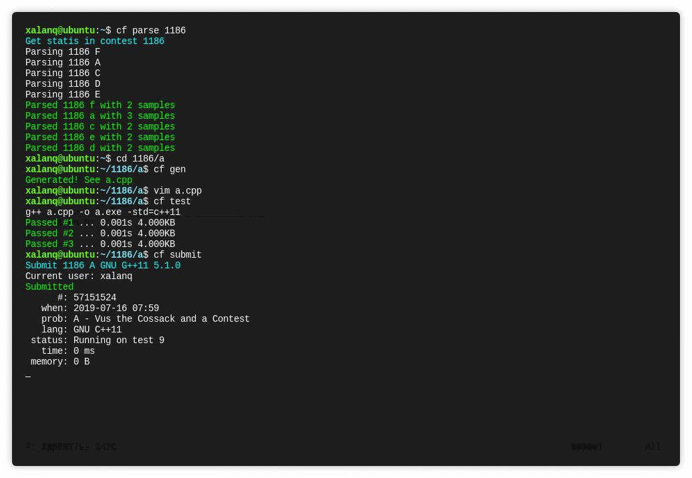
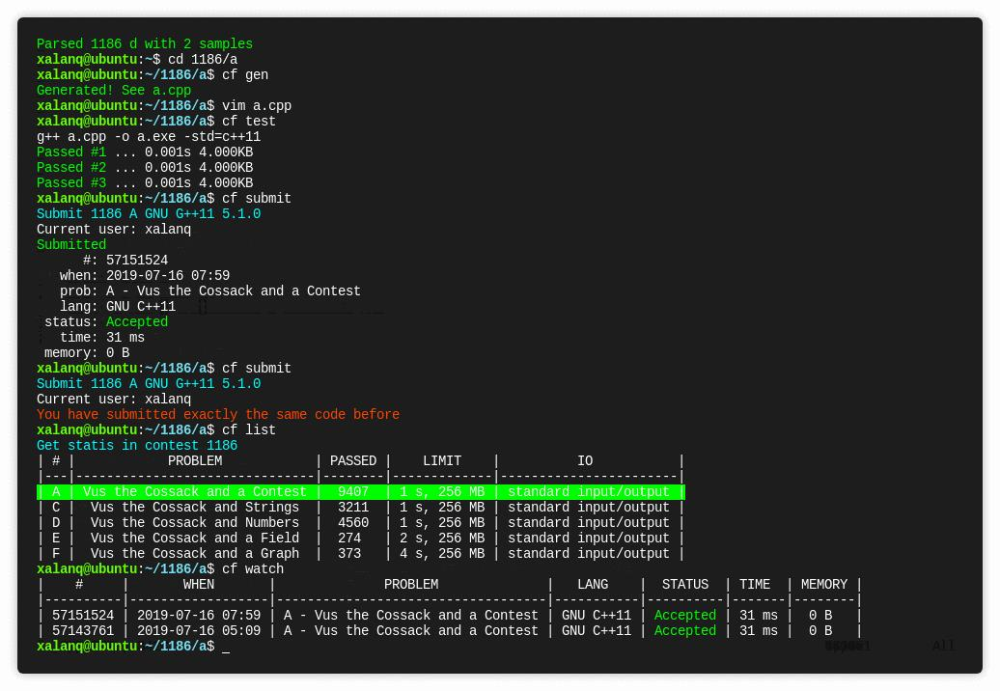

## cf-tool

GitHub 地址： [xalanq/cf-tool](https://github.com/xalanq/cf-tool/) 

cf-tool 是 Codeforces 的命令行界面的跨平台（支持 Windows、Linux、OS X）工具，其支持很多常用操作。

### 特点

-   支持 Codeforces 中的所有编程语言。
-   支持 contests 和 gym。
-   提交代码。
-   动态刷新提交后的情况。
-   拉取问题的样例。
-   本地编译和测试样例。
-   拉取某人的所有代码。
-   从指定模板生成代码（包括时间戳，作者等信息）。
-   列出某场比赛的所有题目的整体信息。
-   用默认的网页浏览器打开题目页面、榜单、提交页面等。
-   丰富多彩的命令行。

### 下载

前往 [cf-tool/releases](https://github.com/xalanq/cf-tool/releases) 下载最新版。

之后的更新可以直接使用 `upgrade` 命令获取。

### 使用

将下载好的可执行文件 `cf` （或者 `cf.exe` ）放置到合适的位置后（见常见问题的第二条），然后打开命令行，用 `cf config login` 、 `cf config add` 命令来配置一下自己的用户信息和模板。

### 例子

以下简单模拟一场比赛的流程。

 `cf race 1136` 

要开始打 1136 这场比赛了！其中 1136 可以从比赛的链接获取，比方说这个例子的比赛链接就为 <https://codeforces.com/contest/1136> 。

如果比赛还未开始，则该命令会进行倒计时。比赛已开始或倒计时完后，工具会自动用默认浏览器打开比赛的所有题目页面，并拉取样例到本地。

 `cd 1136/a` 

进入 A 题的目录，此时该目录下会包含该题的样例。

 `cf gen` 

用默认模板生成一份代码，在这里不妨设为 `a.cpp` 。

 `vim a.cpp` 

用 Vim 写代码（或者用其他的编辑器或 IDE 进行）。

 `cf test` 

编译并测试样例。

 `cf submit` 

提交代码。

 `cf list` 

查看当前比赛各个题目的信息。

 `cf stand` 

用浏览器打开榜单，查看排名。

### 常见问题

1.  我双击了这个程序但是没啥效果

    cf-tool 是命令行界面的工具，你应该在终端里运行这个工具。

2.  我无法使用 `cf` 这个命令

    你应该将 `cf` 这个程序放到一个已经加入到系统变量 PATH 的路径里（比如说 Linux 里的 `/usr/bin/` )。

    或者你直接去搜 "怎样添加路径到系统变量 PATH"。

3.  如何加一个新的测试数据

    新建两个额外的测试数据文件 `inK.txt` 和 `ansK.txt` （K 是包含 0~9 的字符串）。

4.  在终端里启用 tab 补全命令

    使用这个工具 [Infinidat/infi.docopt_completion](https://github.com/Infinidat/infi.docopt_completion) 即可。

    注意：如果有一个新版本发布（尤其是添加了新命令），你应该重新运行 `docopt-completion cf` 。

## Codeforces Visualizer

网站： <https://cfviz.netlify.com/> 。

您可以在 [GitHub](https://github.com/sjsakib/cfviz/) 上查阅到它的源代码。

这个网站有三个功能：

-   用炫酷的图表来可视化某个用户名的各种信息（比如通过题目的难度分布）。
-   对比两个用户。
-   计算一场比赛的 Rating 预测。

大家可以自行尝试一下。
