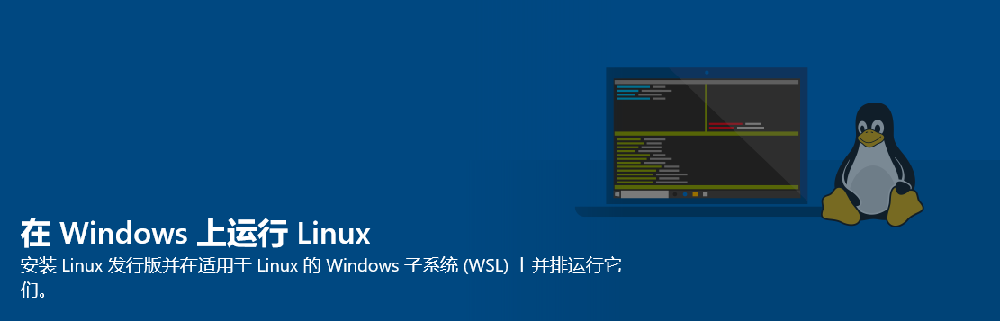

* * *

## 0x01 引言

众所周知，尽管现在大部分学校的竞赛练习环境都是构建 XP 等 Windows 系操作系统，但是在 CCF 组织的一系列竞赛（如 NOI）中，早已用上了 NOI Linux 这个**Ubuntu**操作系统的阉割版。  
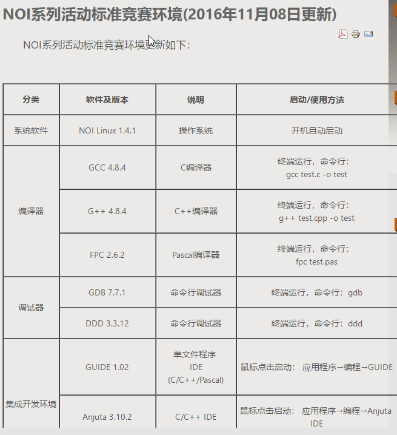           

<div align='center'> NOI竞赛的环境要求 </div>

或许大家对自己 Windows 环境下的 Dev-C++、VSCode 等都已熟识，但是当场景突然切换到 Linux 的时候，你会不会不知所措？

> “想用 <kbd>Ctrl</kbd>+<kbd>C</kbd> 复制，结果退出了程序”  
> “平时 AC 的程序模板到了 Linux 上就 WA”......

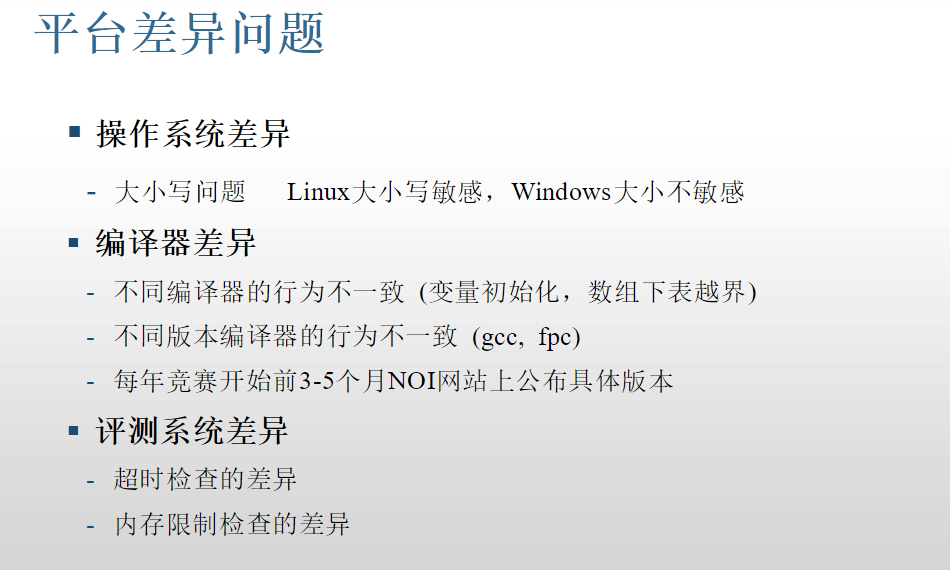

<div align='center'> 平台差异（转自百度文库”NOIP标准评测系统及相关问题“） </div>
    
为了防止考场上出现此类尴尬情况，我们必须要提前熟悉下Linux系统的操作方法。

虽然在 NOI 的官网已经放出了 NOI Linux 的 ISO 镜像，但是如果跑虚拟机的话，配置也相当麻烦，包括激活 Vmware，用 Vmware 装系统开虚拟机等步骤，且 NOI Linux 默认自带图形界面，两个系统一起运行是低配党的噩梦。

Windows 10 作为微软的新一代操作系统，紧跟时代潮流，在一周年更新时推出了 Linux 子系统（WSL），可以供装不起 Vmware 等虚拟机的同学食用。  
缺点是没有 NOI 评测用的**Arbiter**，但是在各大 OJ 背书的情况下谁在乎呢......

> #### 补充资料：何为 Linux 子系统（WSL）？(via 百度百科)
>
> Windows Subsystem for Linux（简称 WSL）是一个为在 Windows 10 上能够原生运行 Linux 二进制可执行文件（ELF 格式）的兼容层。它是由微软与 Canonical 公司合作开发，目标是使纯正的 Ubuntu 14.04/18.04, OpenSUSE, Kali Linux 和 Debian 映像能下载和解压到用户的本地计算机，并且映像内的工具和实用工具能在此子系统上原生运行。
>
> WSL 提供了一个微软开发的 Linux 兼容内核接口（不包含 Linux 代码），来自 Ubuntu 的用户模式二进制文件在其上运行。  
> 此子系统起源于命运多舛的 Astoria 项目，其目的是允许 Android 应用运行在 Windows 10 Mobile 上。此功能组件从 Windows 10 Insider Preview build 14316 开始可用。

* * *

## 0x02 准备

首先，你需要一个最新的 Windows10 操作系统，这点不必多说。

#### 其次，你需要配置一下开发人员模式环境。

1. 设置 -> 更新与安全 -> 开发人员模式框选 -> 是

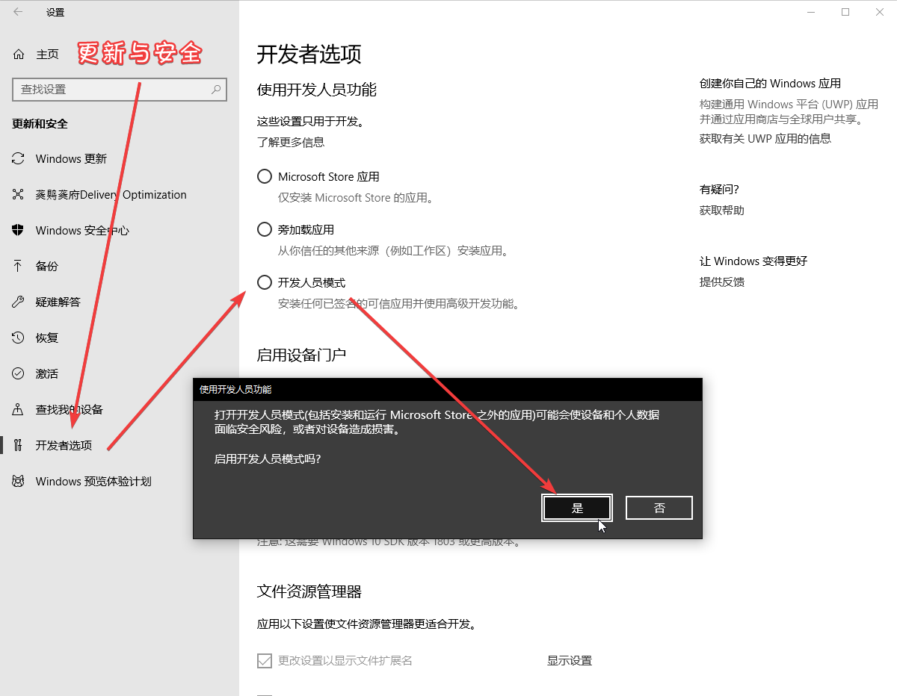     

<div align='center'> 来，跟着箭头走 </div>
 
2.控制面板->程序->启用和关闭Windows功能->框选“适用于Linux的Windows子系统”->确定->重启
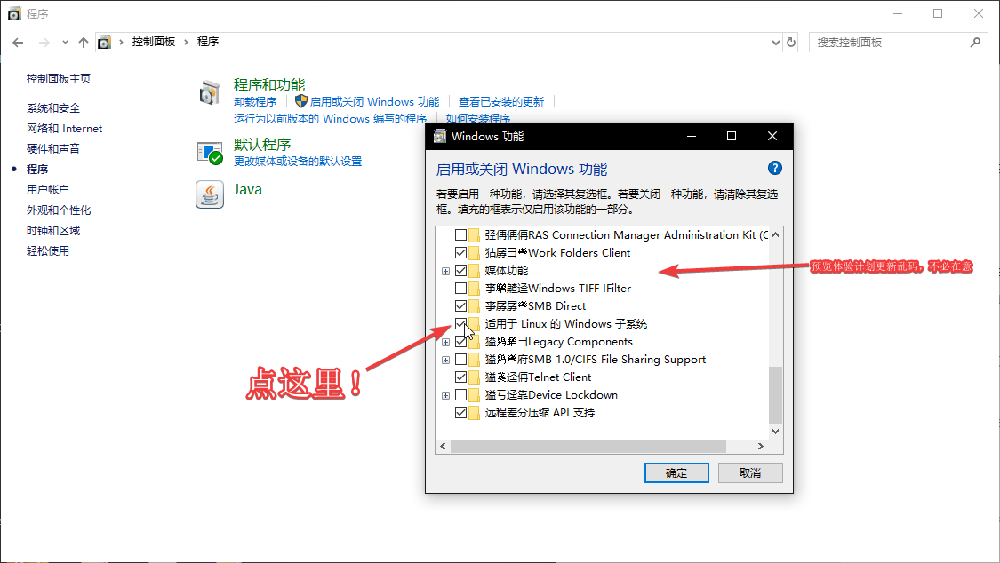

给系统盘留下足够的空间，毕竟装好的 Linux 没法迁移。

这次演示我们会安装 Ubuntu，因为 NOI Linux 正是 Ubuntu 的修改版。

只要学会了方法，你也可照葫芦画瓢，安装 Windows 应用商店中的其他子系统。

## 0x03 开搞

去 Windows 自带的应用商店，搜索 “Ubuntu”，然后选第一个安装。  （build of Ubuntu 18.04 LTS）  
亦可打开<https://www.microsoft.com/zh-cn/p/ubuntu/9nblggh4msv6>  

安装完后，打开 Ubuntu，等待一段时间，让其自己配置，不久就会提示你设置用户名和密码。（这里看你喜好，推荐设置短点，毕竟本地环境不怕攻击）
**Linux 区分大小写！**

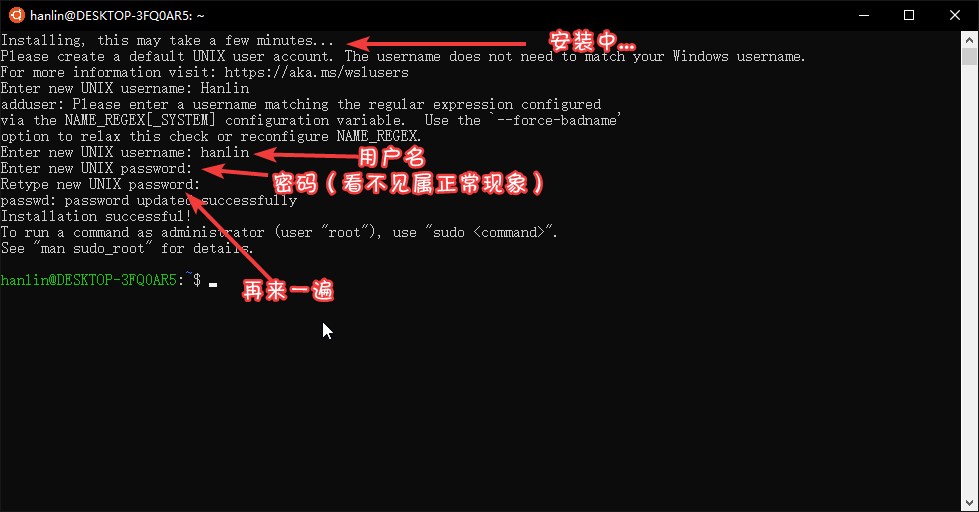

这样之后，一个纯净的 Ubuntu 系统安装完成了！

## 0x04 基础配置

**以下命令均可直接右键复制粘贴进窗口哦！**

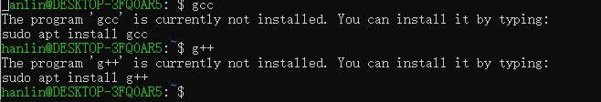

正如图片所示，这个系统纯净到连个编译器都没有，所以这一节来看看基础的环境配置。

### 解锁 root 账户（非必需）

Ubuntu 默认是把 root 账户锁住的，给刚刚的账户开放 sudo 权限。

**在 Linux 的权限系统中，“sudo” 正如 “以管理员身份运行”，不声明就没法使用管理员权限。而 “root” 则是 "Administrator“，直接解锁全部权限。**

命令三连：

```bash
sudo passwd root
sudo passwd --unlock root
sudo su
```

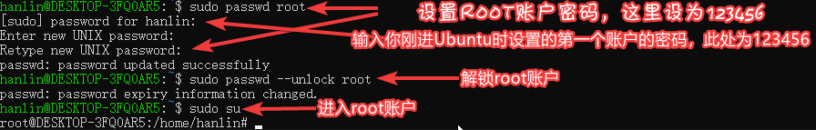

**Warning：如果跳过这一节，请在接下来每个命令前带上 sudo！**

### 更换为国内软件源

Ubuntu 默认的软件源在国外，我们可以换为国内的加快速度，如[清华 TUNA 的软件源](https://mirrors.tuna.tsinghua.edu.cn/help/ubuntu/)。

TUNA 的源（这个 Ubuntu 是 16.04LTS 长期支持版的）

```text
# 默认注释了源码镜像以提高 apt update 速度，如有需要可自行取消注释
deb https://mirrors.tuna.tsinghua.edu.cn/ubuntu/ xenial main restricted universe multiverse
# deb-src https://mirrors.tuna.tsinghua.edu.cn/ubuntu/ xenial main restricted universe multiverse
deb https://mirrors.tuna.tsinghua.edu.cn/ubuntu/ xenial-updates main restricted universe multiverse
# deb-src https://mirrors.tuna.tsinghua.edu.cn/ubuntu/ xenial-updates main restricted universe multiverse
deb https://mirrors.tuna.tsinghua.edu.cn/ubuntu/ xenial-backports main restricted universe multiverse
# deb-src https://mirrors.tuna.tsinghua.edu.cn/ubuntu/ xenial-backports main restricted universe multiverse
deb https://mirrors.tuna.tsinghua.edu.cn/ubuntu/ xenial-security main restricted universe multiverse
# deb-src https://mirrors.tuna.tsinghua.edu.cn/ubuntu/ xenial-security main restricted universe multiverse

# 预发布软件源，不建议启用
# deb https://mirrors.tuna.tsinghua.edu.cn/ubuntu/ xenial-proposed main restricted universe multiverse
# deb-src https://mirrors.tuna.tsinghua.edu.cn/ubuntu/ xenial-proposed main restricted universe multiverse
```

使用的命令**（需按上节指示进入 root 环境，否则请在每个命令前带上 sudo）**：

```bash
cp /etc/apt/sources.list /etc/apt/sources.list.bak
echo '' > /etc/apt/sources.list
nano /etc/apt/sources.list
# （将上文的源右键粘贴进去，编辑完后按 Ctrl + X，再按 Y 和回车）
apt update && apt upgrade -y
```

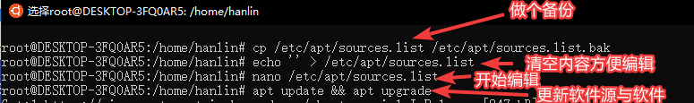

### 安装中文环境

```bash
apt install  language-pack-zh-han* -y
locale-gen zh_CN.GB18030 && locale-gen zh_CN.GB2312 && locale-gen zh_CN.UTF8
# 中文字体，别忘了同意 eula
apt install fontconfig -y
sudo apt install ttf-mscorefonts-installer -y
# 下面的再执行一遍以防万一
sudo apt install -y --force-yes --no-install-recommends fonts-wqy-microhei
sudo apt install -y --force-yes --no-install-recommends ttf-wqy-zenhei
sudo dpkg-reconfigure locales
```

使用 `sudo dpkg-reconfigure locales` 进入菜单，选择 `zh_CN.UTF8` 回车，下一个菜单中也是选它打回车。

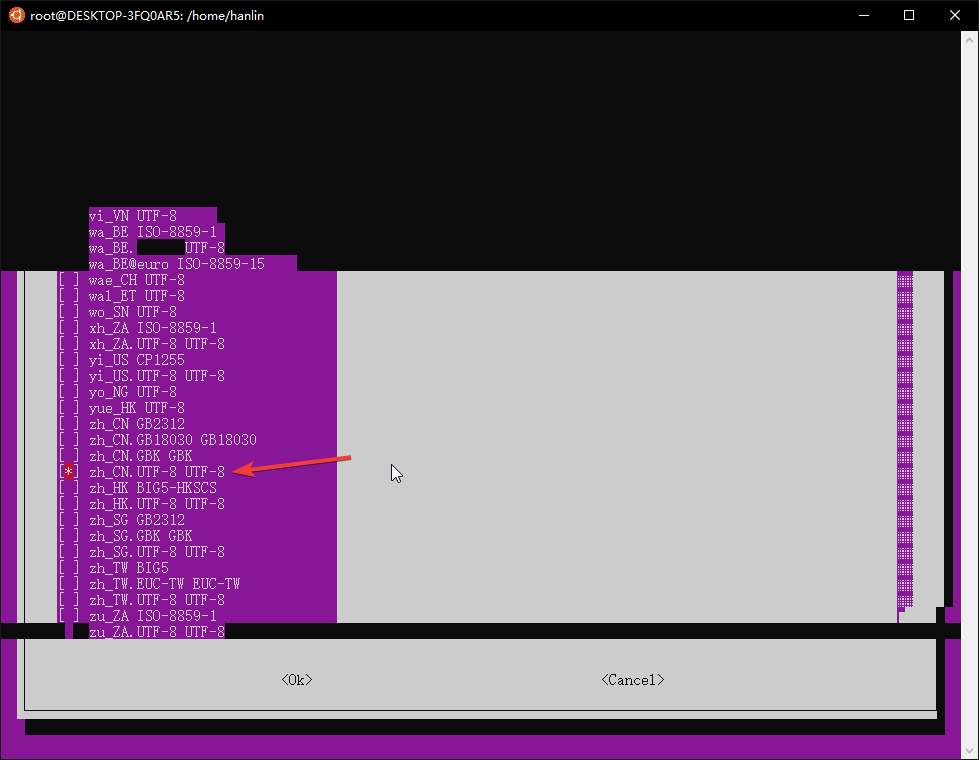

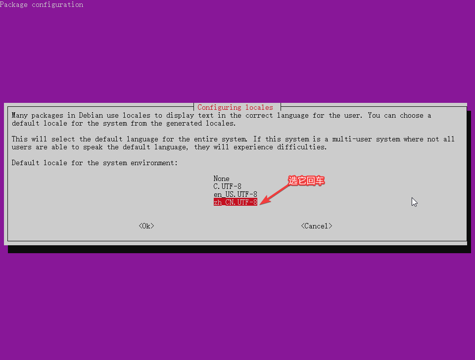

之后关上 Ubuntu 重开一遍登录，是不是变中文了？

再用下列命令，把 man 帮助页替换为中文：[via](https://blog.csdn.net/qq_14989227/article/details/72954523)

```bash
apt install manpages-zh
vi /etc/manpath.config
:1,$s#/usr/share/man#/usr/share/man/zh_CN#g
:wq
```

可以用 `man help` 测试下。

### 安装编译环境

```bash
apt install build-essential vim ddd gdb fpc emacs gedit anjuta lazarus -y
wget http://download.noi.cn/T/noi/GUIDE-1.0.2-ubuntu.tar
tar -xvf GUIDE-1.0.2-ubuntu.tar
cd GUIDE-1.0.2-ubuntu
./install.sh
```

这是基础的 + NOI 官方要求环境，如有需要可以用 `apt install 程序名` 来安装别的。
若想安装其他版本可以参考下[这个](https://www.cnblogs.com/EasonJim/p/7144017.html)

来个程序玩玩：

```bash
root@DESKTOP-3FQ0AR5:/home/hanlin# nano cpuid.cpp
root@DESKTOP-3FQ0AR5:/home/hanlin# g++ -Wall cpuid.cpp -o cpuid
root@DESKTOP-3FQ0AR5:/home/hanlin# ./cpuid
AMD Ryzen 5 1400 Quad-Core Processor
```

**Tips：Linux 环境下可执行文件可不带扩展名，实现方式看上方命令行**

## 0x05 进阶操作

### 安装图形环境，并使用远程桌面连接

推荐图形环境用 xfce4，不臃肿。

```bash
apt install xfce4 -y
# 或使用 apt install xubuntu-desktop -y
# xubuntu安装的软件多，基础环境可用第一种
```

图形环境是个大头，因此要多等会，静静等待下载解包。

下面配置 xrdp：

```bash
apt install xrdp -y
echo "xfce4-session" >~/.xsession
service xrdp restart
```

为了防止和你计算机本来带的远程桌面冲突，最好换一下端口。

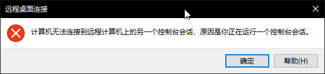

<div align='center'> 不换端口的结果 </div>

运行命令 `nano /etc/xrdp/xrdp.ini`，把 `port=3389` 改为别的（如 `port=3390`），然后保存即可。

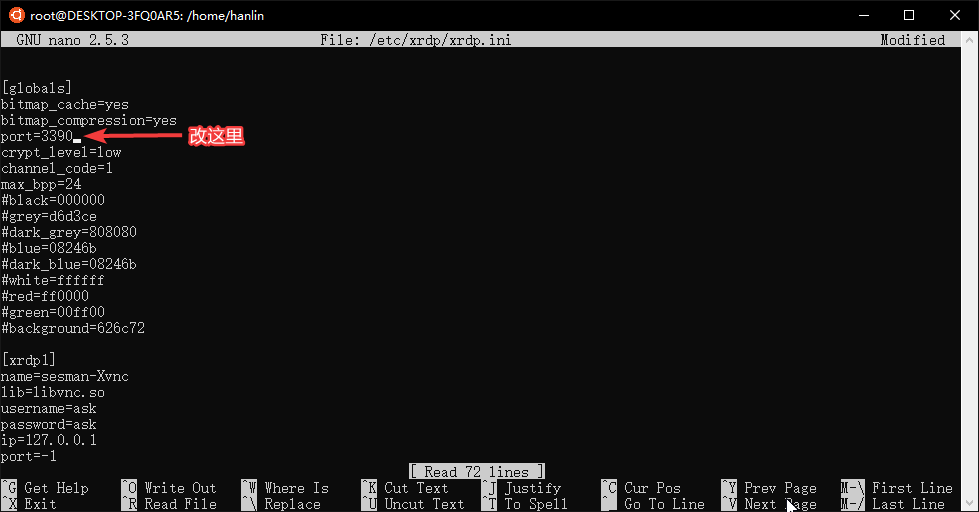

运行 `service xrdp restart`，然后去开始菜单，用 `localhost: 你配置的端口` 来访问。

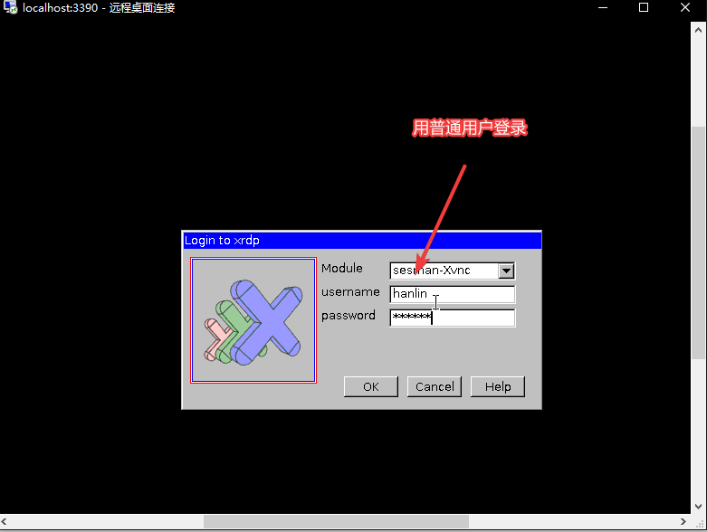


#### 补充：使用 Xming 连接

有网友说，这个可以用 Xming 连接，那我们就来研究一下。

##### 客户端：安装 Xterm

我们进入 Ubuntu 环境，安装 xterm：

```bash
apt-get install xterm -y
```

##### 服务端：下载 Xming Server

去<https://sourceforge.net/projects/xming/>下载最新的 Xming Server，然后一路安装：

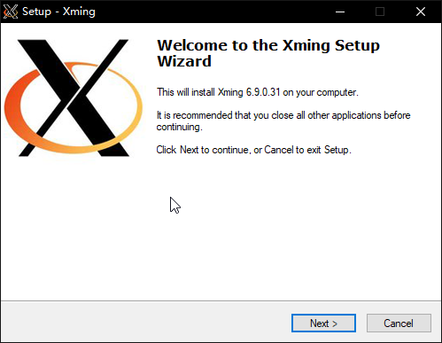

如果你把 Launch Xming 框点掉了，记得去开始菜单再打开：

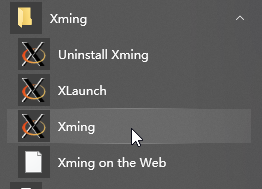

之后再回到 Ubuntu，键入如下指令：

```bash
DISPLAY=:0 xterm
```

**Duang！**

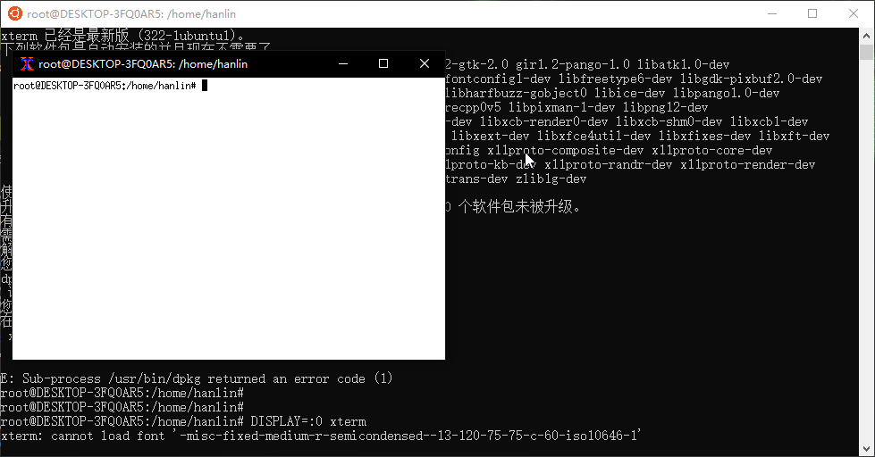

~~不过貌似只支持命令行...... 这时上一种方法的优势就显而易见了~~

如果你和我一样使用了 xfce4，在弹出的窗口中使用如下命令激活 xfce4：

```bash
xfce4-session
```

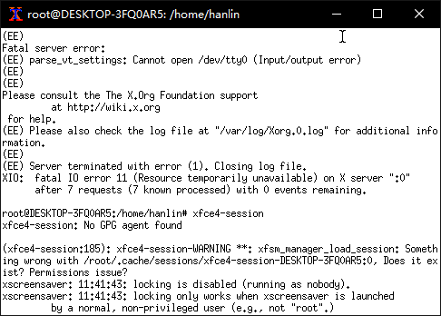

不过这是什么效果......**（在 Xming 中使用** <kbd>Ctrl</kbd> + <kbd>C</kbd> ** 就可以退出这个鬼畜界面）**

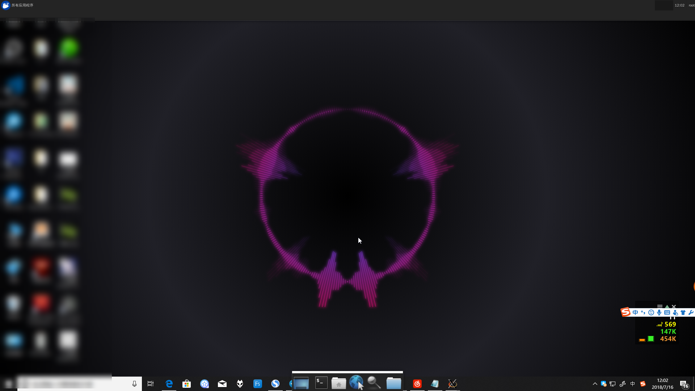

<div align='center'> 达成成就：Windows+Linux二合一 </div>

感受一下两个版本融合的感觉：

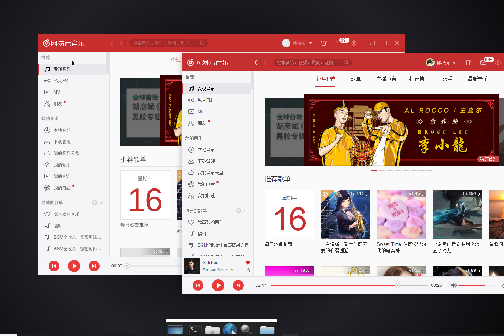

#### 与 Windows 内原硬盘分区交互

硬盘分区作为文件夹在 `/mnt/` 里放着，因此可以直接交互，比如说直接编译个二进制文件，或者往 Ubuntu 里传文件什么的......

具体演示：
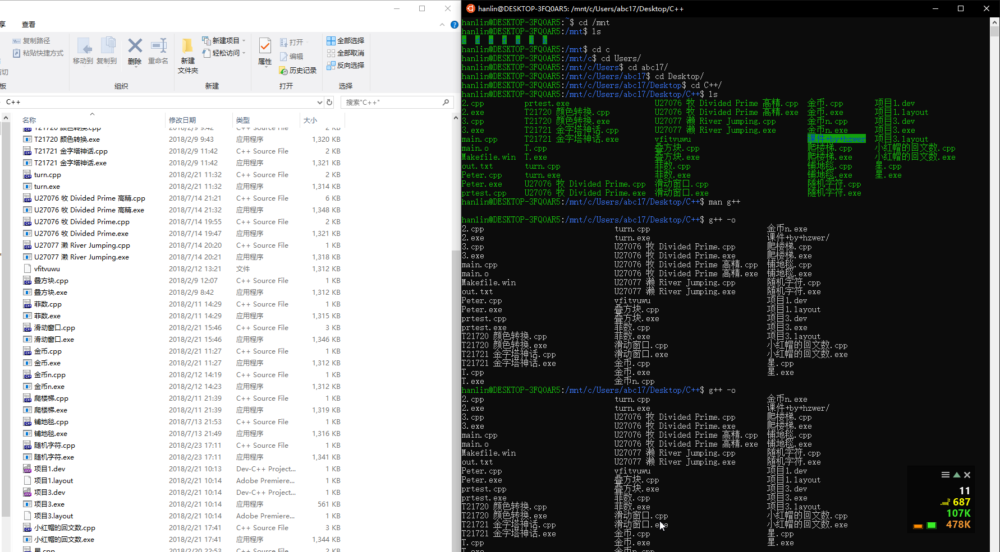      

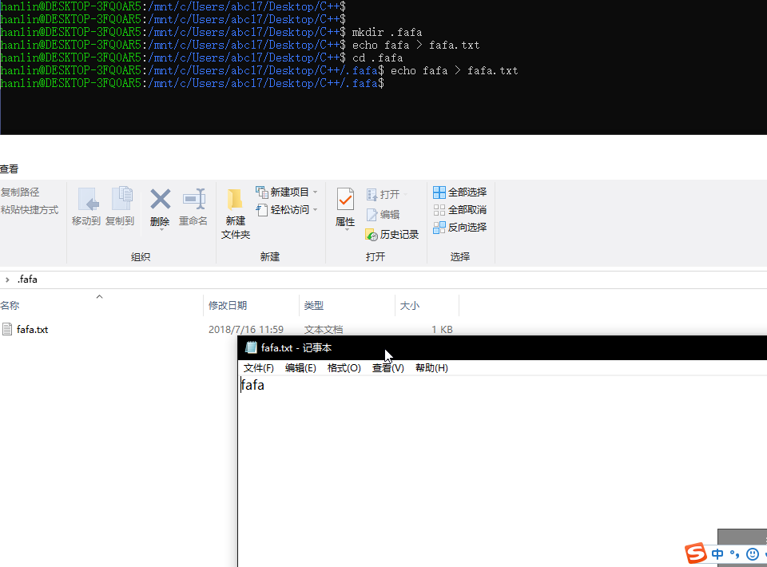

<div align='center'> 这里也可以建立一些Windows（一般情况下）建不了的文件，例如带点文件夹</div>

**乱码是因为我用的预览体验系统...... 不过用正式版也可以了！**

## 0x07 FAQ

-   如何在子系统下进行......？

    该怎么用怎么用，可以用自带命令行，实在不行参考教程唤醒图形界面。
    比如说 vim，在命令行中键入 `man vim`，会给出一份详尽的使用方法。
    亦可使用 `vim --help`。

-   占用量大？
    Sorry，这个系统和 Windows10 共用 Host，所以理论上是比虚拟机占用小的。
    而且只要别装太多应用，应该还是可以带动的。

-   汉语化时提示不存在？

    玄学问题，可以忽略。修了个疏忽导致的错误，可以重上一下试试。

## 0x08 参考资料

这里列举了所有文中提到的链接，以便查阅。

1. [NOIP 标准评测系统及相关问题 ,smart0326,2014-05-19, 百度文库](https://wenku.baidu.com/view/8246d96cdd36a32d72758143.html)

2. [WSL, 百度百科](https://baike.baidu.com/item/wsl/20359185)

3. [Run Bash on Ubuntu on Windows,Mike Harsh,2016-05-30,Windows Blog](https://blogs.windows.com/buildingapps/2016/03/30/run-bash-on-ubuntu-on-windows/#cie8WdR3uSjgR5Ru.97)

4. [Windows Subsystem for Linux Documentation,MSDN](https://docs.microsoft.com/zh-cn/windows/wsl/about)

5. [NOI 系列活动标准竞赛环境, 2016-11-08,NOI 官网](http://www.noi.cn/2016-11-08-03-42-01)

6. [购买 Ubuntu,Microsoft Store](https://www.microsoft.com/zh-cn/p/ubuntu/9nblggh4msv6)

7. [Ubuntu 镜像使用帮助, 清华 TUNA](https://mirrors.tuna.tsinghua.edu.cn/help/ubuntu/)

8. [Ubuntu 的 man 命令帮助如何设置中文版, Frank 看庐山, 2017-06-09](https://blog.csdn.net/qq_14989227/article/details/72954523)

9. [Xming X Server for Windows,SourceForge](https://sourceforge.net/projects/xming/)

### 后记

本文最初发布于[洛谷日报 #6](https://www.luogu.org/discuss/show/48491)，现由原作者搬运至此，有删改。
