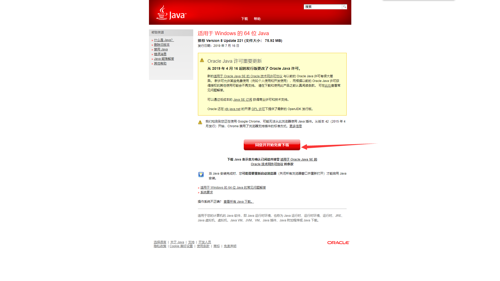
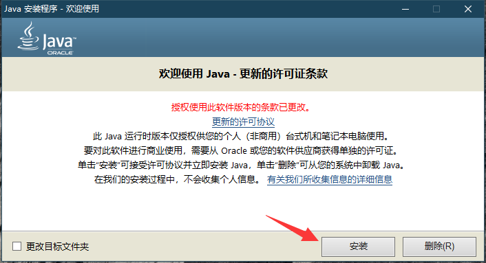
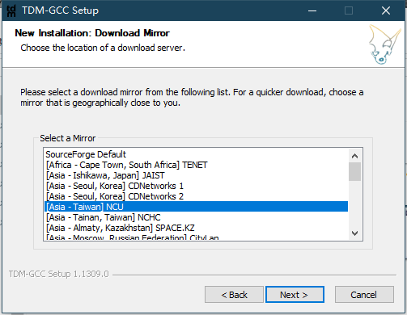
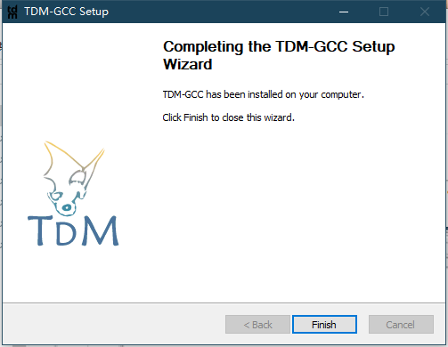
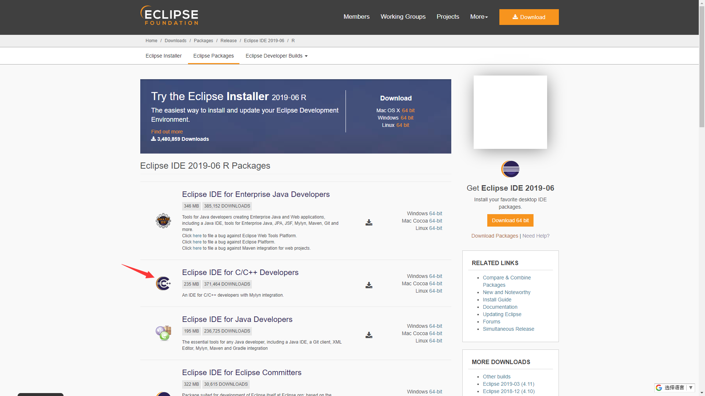
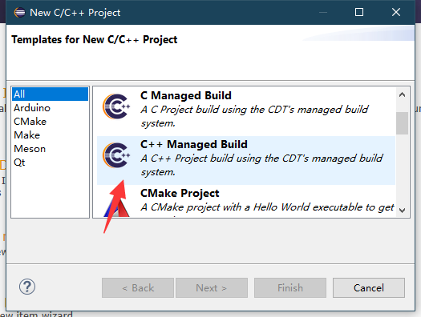
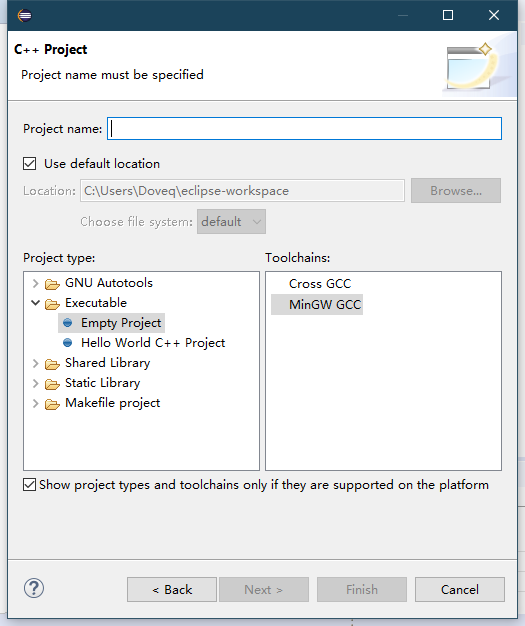

author: Doveqise, partychicken, Xeonacid

## Eclipse 编辑器指北

### 介绍

Eclipse 是著名的跨平台开源集成开发环境（IDE）。最初主要用来 Java 语言开发，当前亦有人通过插件使其作为 C++、Python、PHP 等其他语言的开发工具。

Eclipse 的本身只是一个框架平台，但是众多插件的支持，使得 Eclipse 拥有较佳的灵活性，所以许多软件开发商以 Eclipse 为框架开发自己的 IDE。

Eclipse 最初是由 IBM 公司开发的替代商业软件 Visual Age for Java 的下一代 IDE 开发环境，2001 年 11 月贡献给开源社区，现在它由非营利软件供应商联盟 Eclipse 基金会（Eclipse Foundation）管理。

（以上摘自 wikipedia [\[1\]](https://zh.wikipedia.org/wiki/Eclipse) ）

缺点：实测这个 IDE 打开速度比 Visual Studio 慢，而且这个 IDE 更新速度玄学，插件更新速度跟不上 IDE 的更新速度，所以对于经常更新的同学很不友好。

优点：使用体验较好，而且许多知名公司都在使用，能够快速上手，所以比较推荐 OIer 用这个 IDE。

### 安装 & 配置指南

#### 前置

您需要安装 Java 和 MinGW。

##### 下载并安装 Java

##### 下载并安装 MinGW

开始安装。

选择版本。

选择安装目录。

选择镜像下载加速源，此处可以直接用 SourceForge Default。

完成安装。

#### 安装主体

##### 下载 Eclipse

进入 Eclipse 官网，

点击右面相对应系统的下载链接以下载 C++ 版本，

安装，然后如图填写目录信息以建造项目。

### 拓展

这个软件的帮助手册很详细，建议刚接触的同学多看帮助手册，多百度，并且这个 IDE 的使用手感与 Visual Studio 相近。

如果想添加插件的话，这里推荐看一篇 CSDN 博客 [\[2\]](https://blog.csdn.net/csdnnews/article/details/78495979) 。

### 引用链接

[1]&#x3A; [Eclipse - 维基百科](https://zh.wikipedia.org/wiki/Eclipse) 

[2]&#x3A; [曾经的 Java IDE 王者 Eclipse 真的没落了？21 款插件让它强大起来！](https://blog.csdn.net/csdnnews/article/details/78495979) 
