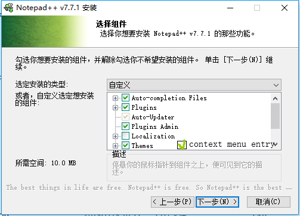
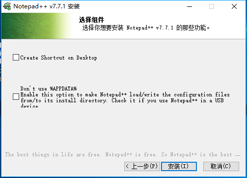

author: CBW2007, partychicken, StudyingFather, Xeonacid

## 软件简介

Notepad++ 是 Windows 操作系统下的文本编辑器，支持多国语言、多种编码、多种编程语言的高亮和补全。它的 logo 也十分可爱，是一只变色龙（）

其功能比其他许多编辑软件强大许多，打开大文件时更加稳定，不断撤销不会出问题。关闭时也不需要保存，它会自动为你保存在缓冲区中。（可能需要配置）而且，它十分小巧，只有 10MB+，甚至可以放在 U 盘中随身携带。

## 下载与安装

 **注意：该文章统一使用 7.7.1 版本做演示，但是最新版本与演示版本不会有太大差别，为了获得更好的使用体验，请尽量使用最新版。** 

打开 [软件官网](https://notepad-plus-plus.org/) 或 [可靠的第三方网站](https://notepad-plus.en.softonic.com/) ，去到 [Download](https://notepad-plus-plus.org/downloads) 页面并选择版本（推荐最新版），然后进入软件下载页面。 **注意选择处理器架构** （32 位或 64 位）。如果电脑是 64 位，强烈建议下载 64 位，因为大多数插件只支持 64 位；如果渴望兼容性，请下载 32 位。如果网络不好，可以选择各种软件园（有风险）。

有 3 种安装方法：

1.  installer——安装包模式，当你没有任何其他想法时的推荐模式。
2.  zip/7z package——压缩包模式，当你不想用安装包时可以直接下载 -> 解压 -> 使用。
3.  minimalist package——迷你模式，没有主题、插件和升级包，下载、安装更快捷。

这里用安装包模式做演示：


双击安装包，进入安装界面，选择语言，接受协议，选择安装位置不在赘述，接下来选择安装内容：



有一项是后期补的，不要在意（捂脸）。

介绍一下（按顺序）

1.  自动编译功能（？）
2.  自带插件功能
3.  自动升级插件
4.  自定义插件功能
5.  安装多国语言
6.  软件主题商店
7.  添加到右键菜单



最后一步，两个选项。第一个是创建桌面快捷方式，第二个是“不要用 %APPDATA%”，当你想要装在 U 盘里使用时务必勾选。

最后点击“安装”开始安装。

## 更改界面语言


语言改完了，就可以随心所欲地魔改编辑器啦！

## 初级玩法

这里主要讲一些基础和特色功能。

### 查找与替换

依次单击“（菜单栏）搜索”->“查找”（快捷键 `CTRL` + `F` ）即可打开“查找”页面（如下图）。


依次单击“（菜单栏）搜索”->“替换”（快捷键 `CTRL` + `H` ）即可打开“替换”页面（如下图）。


查找、替换之间其实是一个窗口，单击上面的标签页就可以完成切换。

其功能与普通编辑器大同小异，但是支持更多，如：

1.  严格匹配或大小写匹配等
2.  跨文档匹配
3.  转义字符，如'\\r'，'\\n'。
4.  正则表达式
5.  计数

### 定期备份


有了这个功能，就可以不用费心地担心意外情况代码丢失啦！

但是，这个功能只是为你的文件拍了一个快照，并没有真正保存，所以还是建议要有良好的保存习惯。或者说可以去自带插件商店安装 "Auto Save" 插件（详见 [高级玩法 -> 插件](./#_14) ，下同）

### 书签功能

在你需要的行按 `Ctrl` + `F2` 即可设放置/取消书签，放置过书签的行前段有一个蓝色圆点。

按 `F2` 可以定位到下一个书签。

如果你抱怨不方便，可以去自带插件商店安装 "Bookmarks" 插件

### 代码高亮

右击左下角的 "XXX file"，可以选择许多种语言高亮，C、C++、PASCAL、Markdown 等任你挑选。你甚至可以自己定义高亮！

如果你认为每一次打开文件都要更改高亮很麻烦，可以在“设置 -> 首选项 -> 新建 -> 默认语言”中修改默认高亮。

需要渲染 Markdown 的，可以去插件商店安装 "Markdown Viewer"，还有更多类似插件等着你！

### 显示所有字符


点击红框所圈的按钮，就可以非（za）常（luan）清（wu）晰（zhang）地显示出“空格”、“TAB”、“换行”等原来不可见字符。

### 自动识别文件编码与换行符

Notepad++ 可以自动识别当前文件编码是 `UTF-8` 还是 `GB2312` 甚至其他。再也不用担心被 `锟斤拷` 抡死或被 `烫烫烫` 烫死了。

如果要使用不同的编码浏览文章，请依次单击“（菜单顶栏）编码”->“使用 XXX 编码”。如果想给文件换一个字符编码，请依次单击“（菜单顶栏）编码”->“转为 XXX 编码”。

它还可以自动识别换行符是 `CR` 、 `LF` 或 `CRLF` 。不用担心下载下来的数据被吞换行。

在底部信息栏，你可以看到 "Windows(CR LF)" 等字样，这就是当前文件的换行符。右击它，可以改变当前文件换行符。此操作配合“显示所有字符”更直观哟！

## 高级玩法

这个就适用于需求较高的用户。

### 宏

宏可以帮助你完成许多重复的工作，例如，我要将奇数行的“abcde”改为“afce”，需要两步。

#### 录制宏


#### 使用宏


#### 大量处理，重复使用

如果是更多行呢？操作就需要一点改变。

首先是录制，一定要先按键盘上的 `HOME` 或 `END` 键将光标移动到行首或行尾，然后用方向键调整横向位置，再进行更改。最后一定要用方向键将光标移动到下一个要处理的行。

比如刚刚的例子，可以先按 `END` 键，然后依次按 `←` ， `Backspace` , `←` , `Backspace` , `F` ，最后按两下 `↓` ，最后停止录制。

然后是重播，先定位到第一个要处理的行（第 3 行），然后点击“宏”->“重复运行宏”。在弹出窗口设置要运行的宏（刚录制的一般是第一个），设置运行次数（或者直接运行到文件尾），点确定即可。

#### 保存宏

点击“宏”->“保存录制宏”，并设置名称和快捷键，即可保存，方便后续使用。

### 插件

#### 插件管理

打开功能栏的“插件”按钮，列表中会显示所有你安装过的插件。

再选择“插件管理”选项，即可管理你的插件。

#### 安装插件（商店）

1.  打开“可用”选项卡，在列表中勾选你所要的插件
2.  点击右上角的“安装”按钮，按照提示重启软件即可。

#### 安装插件（手动）

1.  下载插件（由第三方托管的官方地址： <https://sourceforge.net/projects/npp-plugins/> ）注意一定要选择 **与安装 Notepad++ 时处理器架构相同** 的插件。
2.  找到一个名为 "XXX.dll" 的文件（通常以插件名命名）。
3.  在 Notepad++ 中的功能栏点插件，并在列表中点“打开插件文件夹”。
4.  将刚才找到的 DLL 文件放入文件夹中，重启 Notepad++。
5.  【可选】删除刚才拷贝的文件， **但不要删除生成的文件夹！** 

Tips: 如果多次不成功，可以尝试新建一个与插件名相同的文件夹在将 ".dll" 文件放入创建的文件夹中

#### 更新插件

在插件管理中，选择“更新”选项卡，并勾选要更新的插件，然后点右上角的“更新”按钮。

#### 移除插件

同样在插件管理中，选择“已安装”选项卡，并勾选要移除的插件，然后点右上角的“移除”按钮。

### 搭建开发环境

不只是编辑器！"Notepad++" 可谓神一样的存在，它可以通过傻瓜式地编译代码，甚至代替 IDE！这里以 C++ 为例

1.  安装编译器并将其必要的文件目录添加到 PATH 环境变量中。（C++ 需要添加 %APPPATH%\\bin）当你在 cmd 中输入 g++ 时不再提示'g++'不是内部或外部命令……即可（中间可能需要重启电脑）。推荐 [下载 ConsolePauser](https://sourceforge.net/projects/orwelldevcpp/files/Tools/ConsolePauser.exe/download) 然后随便放并将其目录添加到环境变量（此为 Dev-C++ 的插件，在 Dev-C++ 软件根目录也有）。

2.  在菜单栏中选择“运行”->“运行……”，打开“运行”窗口。

3.  分别输入以下命令

    ```shell
    #编译命令：
    cmd /c g++.exe -o $(CURRENT_DIRECTORY)\$(NAME_PART).exe $(FULL_CURRENT_PATH)
    #运行命令：
    cmd /c $(CURRENT_DIRECTORY)\$(NAME_PART).exe $(FULL_CURRENT_PATH) & pause
    #调试命令：
    cmd /c gdb $(CURRENT_DIRECTORY)\$(NAME_PART).exe

    #如果下载了ConsolePauser可以使用下列代码获得更好的程序运行体验！（注意添加环境变量！）

    #编译命令：
    cmd /c (start ConsolePauser "g++.exe -o $(CURRENT_DIRECTORY)\$(NAME_PART).exe $(FULL_CURRENT_PATH)")
    #运行命令：
    cmd /c (start ConsolePauser "$(CURRENT_DIRECTORY)\$(NAME_PART).exe")
    #调试命令：
    cmd /c (start ConsolePauser "gdb $(CURRENT_DIRECTORY)\$(NAME_PART).exe")
    ```


4.  单击“保存”，名字可以自己取，如 "Compile","Run" 等，然后设定好你想要的快捷键（捡好记的来，如 Dev-C++ 就分别是 `F9` 和 `F10` ）。

5.  Enjoy it!

## 小彩蛋

1.  在运行安装程序时你会在下方看到这样一句话：

    > "The best things in life are free. Notepad++ is free. So Notepad++ is the best(.)"
    >
    > （生活中最好的事情都是免费的。Notepad++ 是免费的。所以 Notepad++ 是最好的。）

    这牛吹的，不得不说，很有底气。

2.  在一个新开的页面中输入 "random" 并选中，再按 `F1` 就会得到一句很有意思的话。
