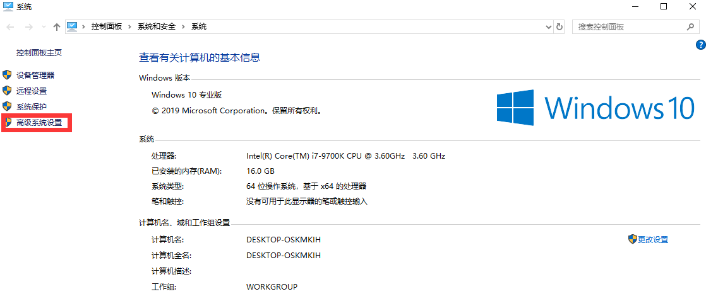
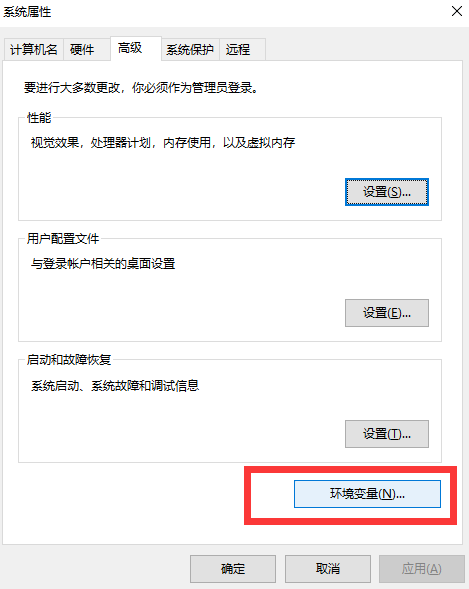
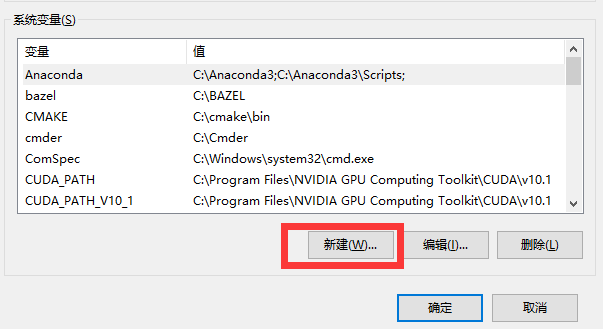
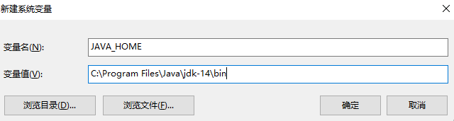
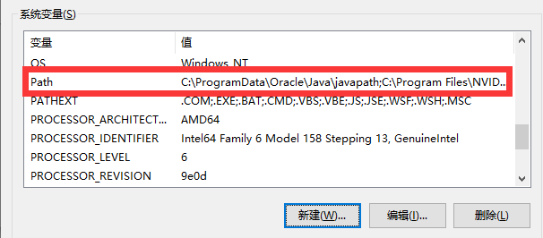
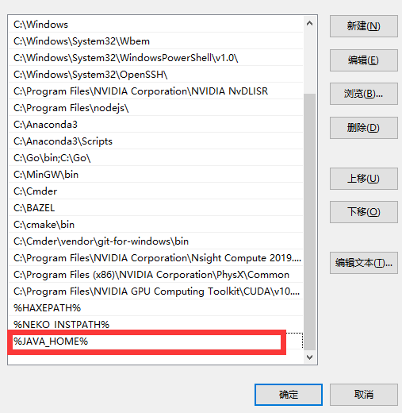

## 关于 Java

Java 是一种广泛使用的计算机编程语言，拥有 **跨平台** 、 **面向对象** 、 **泛型编程** 的特性，广泛应用于企业级 Web 应用开发和移动应用开发。

## 环境安装

使用 [OpenJDK](https://jdk.java.net/) 作为实例，下载下来的都是压缩包，解压缩此处略过

### Windows

将解压缩后的文件夹放到你想放的位置，假设你解压后放到了 `C:\Program Files\Java\jdk-14` ,













### Linux

#### 使用包管理器安装

可以使用包管理器提供的 JDK。具体指令如下

```bash
sudo apt install default-jre
sudo apt install default-jdk
```

如果 `CentOS` 则使用的是 `yum` 安装，命令如下：

```bash
sudo yum install java-1.8.0-openjdk
```

在稍后询问是否安装时按下 `y` 继续安装
或是你已经下好了 `rpm` 文件，可以使用以下命令安装

```bash
sudo yum localinstall jre-9.0.4_linux_x64_bin.rpm #安装jre-9.0
sudo yum localinstall jdk-9.0.4_linux-x64_bin.rpm #安装jdk-9.0
```

#### 手动安装

```bash
sudo mv jdk-14 /opt
```

并在 `.bashrc` 文件末尾添加

```bash
export JAVA_HOME="/opt/jdk-14/bin"
export PATH=${JAVA_HOME}:$PATH
```

在控制台中输入命令 `source ~/.bashrc` 即可重载。如果是使用的 zsh 或其他命令行，在 `~/.zshrc` 或对应的文件中添加上面的内容

### MacOS

如果是 MacOS，你可以使用以下命令安装包

```bash
cd ~/Downloads
curl -v -j -k -L -H "Cookie: oraclelicense=accept-securebackup-cookie" http://download.oracle.com/otn-pub/java/jdk/8u121-b13/e9e7ea248e2c4826b92b3f075a80e441/jdk-8u121-macosx-x64.dmg > jdk-8u121-macosx-x64.dmg
hdiutil attach jdk-8u121-macosx-x64.dmg
sudo installer -pkg /Volumes/JDK\ 8\ Update\ 121/JDK\ 8\ Update\ 121.pkg -target /
diskutil umount /Volumes/JDK\ 8\ Update\ 121
rm jdk-8u121-macosx-x64.dmg
```

或者直接在官方网站下载 `pkg` 包或 `dmg` 包安装

## 基本语法

 **_注意_**  `Java` 类似 `C/C++` 语言，有一个函数作为程序执行的起始点，所有的程序只有一个主函数，每次执行的时候都会从主类开始，主函数是整个程序的入口，一切从此处开始。

### 注释

和 `C/C++` 一样， `Java` 使用 `//` 和 `/* */` 分别注释单行和多行

### 基本数据类型

|   类型名   |   意义  |
| :-----: | :---: |
| boolean |  布尔类型 |
|   byte  |  字节类型 |
|   char  |  字符型  |
|  double | 双精度浮点 |
|  float  | 单精度浮点 |
|   int   |   整型  |
|   long  |  长整型  |
|  short  |  短整型  |
|   null  |   空   |

### 申明变量

```java
int a = 12;//设置a为整数类型,并给a赋值12
String str = "Hello, OI-wiki"; //申明字符串变量str
char ch = "W";
double PI = 3.1415926;
```

### final 关键字

 `final` 含义是这是最终的、不可更改的结果，被 final 修饰的变量只能被赋值一次，赋值后不再改变。

```java
final double PI = 3.1415926;
```

### 数组

```java
int[] ary = new int[10];
//有十个元素的整数类型数组
//其语法格式为 数据类型[] 变量名 = new 数据类型[数组大小]
```

### 字符串

-   字符串是 `Java` 一个内置的类。

```java
//最为简单的构造一个字符串变量的方法如下
String a = "Hello";
//还可以使用字符数组构造一个字符串变量
char[] stringArray = {'H','e','l','l','o'};
String s = new String(stringArray);
```

### 输出

可以对变量进行格式化输出

|   符号   |   意义  |
| :----: | :---: |
|  `%f`  |  浮点类型 |
|  `%s`  | 字符串类型 |
|  `%d`  |  整数类型 |
|  `%c`  |  字符类型 |

```java
class test{
    public static void main(String[] args) {
        int a = 12;
        char b = 'A';
        double s = 3.14;
        String str = "Hello world";
        System.out.println("%f",s);
        System.out.println("%d",a);
        system.out.println("%c",b);
        system.out.println("%s",str);
    }
}
```

### 控制语句

#### 选择

-   if

```java
class test{
    public static void main(String[] args) {
        if(/*判断条件*/){
              //条件成立时执行这里面的代码
          }
      }
}
```

-   if...else

```java
class test{
    public static void main(String[] args) {
        if(/*判断条件*/){
            //条件成立时执行这里面的代码
        }else{
            //条件不成立时执行这里面的代码
        }
    }
}
```

-   if...else if...else

```java
class test{
    public static void main(String[] args) {
        if(/*判断条件*/){
            //判断条件成立执行这里面的代码
        }else if(/*判断条件2*/){
            //判断条件2成立执行这里面的代码
        }else{
          //上述条件都不成立执行这里面的代码
        }
    }
}
```

#### 循环

-   for

```java
class test{
    public static void main(String[] args) {
            for(/*初始化*/;/*循环的判断条件*/;/*每次循环后执行的步骤*/){
                //当循环的条件成立执行循环体内代码
            }
    }
}
```

-   while

```java
class test{
    public static void main(String[] args) {
        while(/*判定条件*/){
            //条件成立时执行循环体内代码
        }
    }
}
```

-   do...while

```java
class test{
    public static void main(String[] args) {
        do{
          //需要执行的代码
        }while(/*循环判断条件*/);
    }
}
```

-   switch...case

```java
class test{
      public static void main(String[] args) {
        switch(/*表达式*/){
          case /*值-1*/:
              //当表达式取得的值符合值-1执行此段代码
          break; //如果不加上break语句,会让程序按顺序往下执行,执行所有的case语句
          case /*值-2*/:
              //当表达式取得的值符合值-2执行此段代码
          break;
          default:
              //当表达式不符合上面列举的值的时候执行这里面的代码
        }
      }
}
```

## 注意事项

### 类名与文件名一致

创建 Java 源程序需要类名和文件名一致才能编译通过，否则编译器会提示找不到 `类` 。通常该文件名会在具体 OJ 中指定。

例：

Add.java

```java
class Add{
    public static void main(String[] args) {
        // ...
    }
}
```

在该文件中需使用 Add 为类名方可编译通过。
