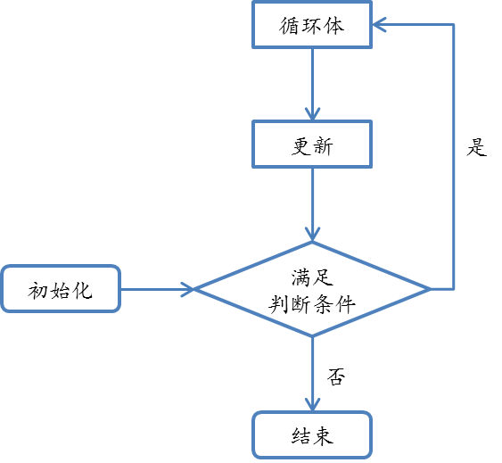
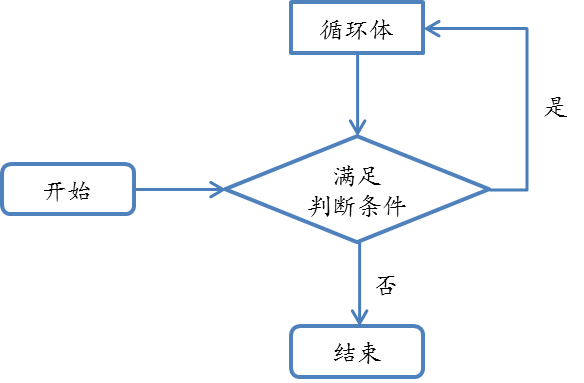

有时，我们需要做一件事很多遍，为了不写过多重复的代码，我们需要循环。

有时，循环的次数不是一个常量，那么我们无法将代码重复多遍，必须使用循环。

## for 语句

以下是 for 语句的结构：

```cpp
for (初始化; 判断条件; 更新) {
  循环体;
}
```

执行顺序：



e.g. 读入 n 个数：

```cpp
for (int i = 1; i <= n; ++i) {
  cin >> a[i];
}
```

for 语句的三个部分中，任何一个部分都可以省略。其中，若省略了判断条件，相当于判断条件永远为真。

## while 语句

以下是 while 语句的结构：

```cpp
while (判断条件) {
  循环体;
}
```

执行顺序：



e.g. 验证 3x+1 猜想：

```cpp
while (x > 1) {
  if (x % 2 == 1) {
    x = 3 * x + 1;
  } else {
    x = x / 2;
  }
}
```

## do...while 语句

以下是 do...while 语句的结构：

```cpp
do {
  循环体;
} while (判断条件);
```

执行顺序：


与 while 语句的区别在于，do...while 语句是先执行循环体再进行判断的。

e.g. 枚举排列：

```cpp
do {
  // do someting...
} while (next_permutation(a + 1, a + n + 1));
```

## 三种语句的联系

```cpp
// for 语句

for (statement1; statement2; statement3) {
  statement4;
}

// while 语句

statement1;
while (statement2) {
  statement4;
  statement3;
}
```

在 statement4 中没有 `continue` 语句（见下文）的时候是等价的，但是下面一种方法很少用到。

```cpp
// while 语句

statement1;
while (statement2) {
  statement1;
}

// do...while 语句

do {
  statement1;
} while (statement2);
```

在 statement1 中没有 `continue` 语句的时候这两种方式也也是等价的。

```cpp
while (1) {
  // do something...
}

for (;;) {
  // do something...
}
```

这两种方式都是永远循环下去。（可以使用 `break` （见下文）退出。）

可以看出，三种语句可以彼此代替，但一般来说，语句的选用遵守以下原则：

1.  循环过程中有个固定的增加步骤（最常见的是枚举）时，使用 for 语句；
2.  只确定循环的终止条件时，使用 while 语句；
3.  使用 while 语句时，若要先执行循环体再进行判断，使用 do...while 语句。一般很少用到，常用场景是用户输入。

## break 与 continue 语句

break 语句的作用是退出循环。

continue 语句的作用是跳过循环体的余下部分，回到循环的开头（for 语句的更新，while 语句的判断条件）。

```cpp
for (int i = 1; i <= 10; ++i) {
  std::cout << i << std::endl;
  if (i > 3) break;
  if (i > 2) continue;
  std::cout << i << std::endl;
}

/*
输出如下：
1
1
2
2
3
4
*/
```

break 与 continue 语句均可在三种循环语句的循环体中使用。

一般来说，break 与 continue 语句用于让代码的逻辑更加清晰，例如：

```cpp
// 逻辑较为不清晰，大括号层次复杂

for (int i = 1; i <= n; ++i) {
  if (i != x) {
    for (int j = 1; j <= n; ++j) {
      if (j != x) {
        // do something...
      }
    }
  }
}

// 逻辑更加清晰，大括号层次简单明了

for (int i = 1; i <= n; ++i) {
  if (i == x) continue;
  for (int j = 1; j <= n; ++j) {
    if (j == x) continue;
    // do something...
  }
}
```

```cpp
// for 语句判断条件复杂，没有体现“枚举”的本质

for (int i = l; i <= r && i % 10 != 0; ++i) {
  // do something...
}

// for 语句用于枚举，break 用于“到何时为止”

for (int i = l; i <= r; ++i) {
  if (i % 10 == 0) break;
  // do something...
}
```

```cpp
// 语句重复，顺序不自然

statement1;
while (statement3) {
  statement2;
  statement1;
}

// 没有重复语句，顺序自然

while (1) {
  statement1;
  if (!statement3) break;
  statement2;
}
```
