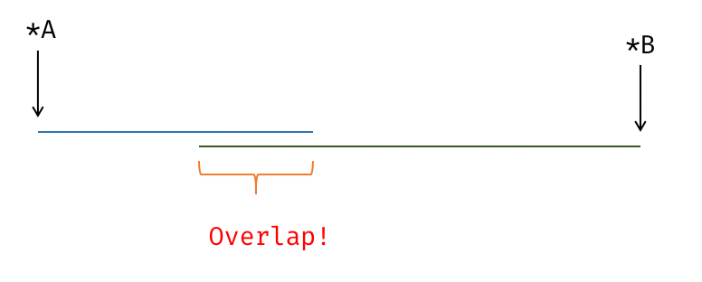

author: inclyc

OI 界的常用编程语言是 C++。既然使用了这门语言，就注定要和编译器、语言标准打交道了。众所周知，C++ 非常混乱邪恶，本文旨在给出实用的编译器相关知识，足够竞赛使用。

## 编译器优化简介

### 什么是优化 (Optimization)

保持语义不变的情况下，对程序运行速度、程序可执行文件大小作出改进。

<!-- ### 开优化的比赛有哪些？ -->

<!-- TODO: 开 O2 的比赛 -->

## 常见的编译器优化

### 常量折叠 (Constant Folding)

常量折叠，又称常量传播 (Constant Propagation)，如果一个表达式可以确定为常量，在他的下一个定义 (Definition) 前，可以进行常量传播。

```cpp
int x = 1;
int y = x;  // x = 1, => y = 1
x = 3;
int z = 2 * y;   // z => 2 * y = 2 * 1 = 2
int y2 = x * 2;  // x = 3, => y2 = 6
```

这段代码在编译期间即可被转换为：

```cpp
int x = 1;
int y = 1;
x = 3;
int z = 2;
int y2 = 6;
```

实例：<https://godbolt.org/z/oEfY35TTd>

### 死代码消除 (Deadcode Elimination)

故名思义，就是一段代码没用上就会被删去。

```cpp
int test() {
  int a = 233;
  int b = a * 2;
  int c = 234;
  return c;
}
```

将被转换为

```cpp
int test() { return 234; }
```

注意，这个代码首先进行了常量折叠，使得返回值可以确定为 234，a, b 为不活跃变量，因此删除。

### 循环旋转 (Loop Rotate)

将循环从 "for" 形式，转换为 "do-while" 形式，前面再多加一个条件判断。这个变换主要为其他变换做准备。

```cpp
for (int i = 0; i < n; ++i) {
  auto v = *p;
  use(v);
}
```

变换为

```cpp
if (0 < n) {
  do {
    auto v = *p;
    use(v);
    ++i;
  } while (i < n);
}
```

### 循环不变量外提 (Loop Invariant Code Motion)

基于别名分析 (Alias Analysis)，将循环中被证明是不变量（可能包含内存访问，load/store，因此依赖别名分析）的代码外提出循环体，这样可以让循环体内部少一些代码。

```cpp
for (int i = 0; i < n; ++i) {
  auto v = *p;
  use(v);
}
```

这个代码直观来看可以外提为：

```cpp
auto v = *p;
for (int i = 0; i < n; ++i) {
  use(v);
}
```

但实际上，如果 `n <= 0`，这个循环永远不会被进入，但我们又执行了一条多的指令（可能有副作用！）。因此，循环通常被 Rotate 为 do-while 形式，这样可以方便插入一个 "loop guard"。之后再进行循环不变量外提。

```cpp
if (0 < n) {  // loop guard
  auto v = *p;
  do {
    use(v);
    ++i;
  } while (i < n);
}
```

### 循环展开 (Loop Unroll)

循环包含循环体和各类分支语句，需要现代 CPU 进行一定的分支预测。直接把循环展开，用一定的代码大小来换取运行时间。

```cpp
for (int i = 0; i < 3; i++) {
  a[i] = i;
}
```

变换为：

```cpp
a[0] = 0;
a[1] = 1;
a[2] = 2;
```

### 循环判断外提 (Loop Unswitching)

循环判断外提将循环中的条件式移到循环之外，然后在外部的两个条件各放置两个循环，这样可以增加循环向量化、并行化的可能性（通常简单循环更容易被向量化）。

```cpp
// clang-format off
void before(int x) {
  for(;/* i in some range */;) {
    /* A */;
    if (/* condition */ x % 2) {
      /* B */;
    }
    /* C */;
  }
}

void after(int x) {
  if (/* condition */ x % 2) {
    for(;/* i in some range */;) {
      /* A */;
      /* B */; // 直接执行 B ，不进行循环判断
      /* C */;
    }
  } else {
     for(;/* i in some range */;) {
      /* A */; 
               // 不执行 B
      /* C */;
    }
  }
}
```

### 代码布局优化 (Code Layout Optimizations)

程序在执行时，可以将执行的路径分为冷热路径 (cold/hot path)。CPU 跳转执行，绝大多数情况下没有直接顺序执行快，后者通常被编译器作者称为 "fallthrough"。与之对应的，经常被执行到的代码成为热代码，与之相对的成为冷代码。OI 代码中，如果有一段是循环中的特判边界条件，或者异常处理，类似的逻辑，则此部分代码为冷代码。

基本块 (Basic Block)，是控制流的基本结构，一个过程 (Procedure) 由若干个基本块组成，形成一个有向图。生成可执行文件的过程中，编译器需要安排一个放置基本块的布局 (Layout)，而如何编排布局，是此优化的重点。

原则上，应该更偏好与将热代码放在一起，而将冷代码隔开。原因是这样能够更好地利用指令缓存，热代码的局部性会更好。

```cpp
// clang-format off
int hotpath; // <-- 热！
if (/* 边界条件 */ false) {
    // <-- 冷！
}
int hotpath_again;  // <-- 热！
```

#### 基本块放置 (Basic Block Placement)

我们用 label 来表达一种「伪机器码」，这个 C++ 程序有两种翻译方法：

???+ note "布局 1"
    ```c++
    // clang-format off
    hotblock1:
        Stmts; // <-- 热！
        if (/* 边界条件不成立 */ true)
            goto hotblock2; // 经常发生！ ------+
    coldblock:                           /*   |   */
        Stmt; // <- 冷                        |
        Stmt; // <- 冷                        |
        Stmt; // <- 冷                        |  跨越了大量指令，代价高昂！
        Stmt; // <- 冷                        |
        Stmt; // <- 冷                        |
        Stmt; // <- 冷                        |
        Stmt; // <- 冷                        |
    hotblock2:                          /*    |   */
        Stmts; // <- 热！           <----------+
    ```

另一种布局为：

???+ note "布局 2"
    ```c++
    // clang-format off
    hotblock1:
        Stmts; // <-- 热！
        if (/* 边界条件 */ false)
            goto coldblock; // 很少发生
    hotblock2:                         /*   |  低代价！  */
        Stmts; // <- 热！  <-----------------+
    coldblock:
        Stmt; // <- 冷
        Stmt; // <- 冷
        Stmt; // <- 冷
        Stmt; // <- 冷
        Stmt; // <- 冷
    ```

我们看到后一种布局中，两个热代码块被放到了一起，执行效率更优秀。

为了告诉编译器分支是否容易被执行，可以使用 C++20 `[[likely]]` 和 `[[unlikely]]`:<https://en.cppreference.com/w/cpp/language/attributes/likely>

如果比赛没有采用 C++20 以上标准，则可以利用 `__builtin_expect`(GNU Extension)。

```cpp
#define likely(x) __builtin_expect(!!(x), 1)
#define unlikely(x) __builtin_expect(!!(x), 0)

if (unlikely(/* 一些边界条件检查 */ false)) {
  // 冷代码
}
```

#### 冷热代码分离 (Hot Cold Splitting)

一个过程 (Procedure) 包含同时包含冷热路径，而冷代码较长，更好的做法是让冷代码作为函数调用，而不是阻断热路径。这同时也提示我们不要自作聪明的让所有函数 `inline`。冷代码对执行速度的阻碍比函数调用要多得多。

???+ note "不好的代码布局"
    ```c++
    // clang-format off
    void foo() {
          // clang-format off
    hotblock1:
        Stmts; // <-- 热！
        if (/* 边界条件不成立 */ true)
            goto hotblock2; // 经常发生！ ------+
    coldblock:                           /*   |   */
        Stmt; // <- 冷                        |
        Stmt; // <- 冷                        |
        Stmt; // <- 冷                        |  跨越了大量指令，代价高昂！
        Stmt; // <- 冷                        |
        Stmt; // <- 冷                        |
        Stmt; // <- 冷                        |
        Stmt; // <- 冷                        |
    hotblock2:                          /*    |   */
        Stmts; // <- 热！           <----------+
    }
    ```

???+ note "好的代码布局"
    ```c++
    // clang-format off
    void foo() {
    hotblock1:
      Stmts;  // <-- 热！
      if (/* 边界条件 */ false)
        codeBlock();  // 将冷代码分离出，使得热路径对 cache 更友好
    hotblock2:
      Stmts;  // <- 热！
    }
    
    void coldBlock() {
      Stmt;  // <- 冷
      Stmt;  // <- 冷
      Stmt;  // <- 冷
      Stmt;  // <- 冷
      Stmt;  // <- 冷
      Stmt;  // <- 冷
      Stmt;  // <- 冷
    }
    ```

冷热代码分离，其实就是函数内联 (Function Inlining) 的反向操作，这一优化的存在启示我们，函数内联不一定会让程序跑的更快。甚至如果内联代码是冷代码，反而会让程序跑的更慢！一些编译器存在强制内联的编译选项，但不推荐使用。编译器内部有一个静态分析过程，计算每个基本块、分支的概率，以及一个函数调用相关的代价模型，以此决定是否内联，自己决定是否内联不一定比编译器的决策好。

事实上，在没有额外信息的情况下，编译器通常会假设分支跳转与不跳转的概率一致，以此为依据传播各个控制流路径的冷热程度。PGO (Profile Guided Optimization) 的一部分便是通过若干次性能测试与实验得出真正环境下的程序分支概率，这些信息可以让代码布局更加优秀。

### 函数内联 (Function Inlining)

函数调用通常需要寄存器和栈传递参数，调用者 (caller) 和被调用者 (callee) 都需要保存一定的寄存器状态，这个过程通常被叫做调用约定 (calling convention)。一个函数调用因此会引起一些时间损耗，而内联函数就是指将函数直接写在调用方过程中，不进行真正的函数调用。

```cpp
int add(int x) { return x + 1; }

int foo() {
  int a = 1;
  a = add(a);
}
```

`add()` 可以被内联到 `foo()` 当中：

```cpp
int foo() {
  int a = 1;
  a = a + 1;  // <-- add() 的函数体，未经过传参
}
```

#### `always_inline`,`__force_inline`

<https://clang.llvm.org/docs/AttributeReference.html#always-inline-force-inline>

一些编译器提供了手动内联函数调用的方法，在函数前加 `__attribute__((always_inline))`。这样使用不一定会比函数调用快，编译器在这个时候相信程序员有足够好的判断能力。

### 尾调用优化 (Tail Call Optimization)

当一个函数调用位于函数体尾部的位置时，这种函数调用被成为尾调用 (Tail Call)。对于这种特殊形式的调用，可以进行一些特别的优化。绝大多数体系结构拥有 Frame Pointer (a.k.a FP) 和 Stack Pointer (a.k.a SP)，维护者函数的调用帧 (Frame)，而如果调用位于函数尾部，则我们可以不保留外层函数的调用记录，直接用内层函数取代。

#### 用跳转指令代替函数调用

函数调用在绝大多数体系结构下，需要保存当前程序计数器 `$pc` 的位置，保存若干 caller saved register，以便回到现场。而尾调用不需要此过程，将被直接翻译为跳转指令，因为尾递归永远不会返回到函数运行的位置。

一个简单的例子：<https://godbolt.org/z/e7b1safaW>

```cpp
int test(int a);

int tailCall(int x) { return test(x); }
```

```x86asm
tailCall(int):                           ; @tailCall(int)
        jmp     test(int)@PLT                    ; TAILCALL
```

#### 自动尾递归改写

如果一个函数的尾调用是自身，则此函数是尾递归的。广义来讲，间接递归（由两个函数 以上共同形成递归）形成递归，且都是尾调用的，也属于尾递归的范畴。尾递归可以被编译器优化为非递归的形式，减小额外的栈开销和函数调用代价。许多算法竞赛选手热衷于写非递归的代码，在不开优化下这样可以极大优化代码的常数，然而如果开优化，递归代码生成的二进制质量和手写的代码没有什么区别。

```c++
int fac(int n) {
  if (n < 2) return 1;
  return /* 使用 */ n * fac(n - 1); /* 使用了变量 n ，无法直接做尾递归优化！*/
}
```

注意到这个函数并不是尾递归的，但可以改写为：

```c++
int fac(int acc, int n) {
  if (n < 2) return acc;
  return fac(acc * n, n - 1);
}
```

新的代码即是尾递归的。

现代编译器可以自动帮你完成这个过程，如果你的代码有机会被改写为尾递归，则编译器可以识别出这种形式，然后完成改写。

#### 尾递归消除 -Rpass=tailcallelim

既然函数已经尾递归，那就可以直接删除递归语句，通过一定的静态分析，将函数直接转换为非递归的形式。我们此处并不去深究编译器作者如何做到这一点，从实际体验来看，绝大多数 OI 代码，如果存在递归版本和非递归版本，则此代码一般可自动优化为非递归版本。这里给读者一些具体的例子：

???+ note "[GCD](https://godbolt.org/z/8Wb6WEnzv)"
    ```cpp
    int gcd(int a, int b) { return b ? gcd(b, a % b) : a; }
    ```

???+ note "[斐波那契数列](https://godbolt.org/z/4enof6Wcb)"
    ```cpp
    // 展开 fib(n - 2) 这一项
    // fib(n - 1) 不能变换为非递归，优化后的代码依然是指数级别的
    int fib(int n) {
      if (n < 2) return 1;
      return fib(n - 1) + fib(n - 2);
    }
    ```

???+ note "[阶乘](https://godbolt.org/z/n64e75xrf)"
    ```cpp
    // 展开成标量循环，然后执行自动向量化，生成的代码是 SIMD 的
    unsigned fac(unsigned n) {
      if (n < 2) return 1;
      return n * fac(n - 1);
    }
    ```

这些函数被优化后的汇编和非递归版完全相同，递归将被直接消除。对于 OI 选手而言，可以在开 O2 的情况下放心写递归版本的各种算法，和非递归版不会有什么区别。如果你写的函数本身无法被改写成非递归的形式，那么编译器也无能为力。

### 强度削减 (Strength Reduction)

常见的编译优化。最简单的例子是 `x * 2` 变为 `x << 1`，第二种写法在 OI 中相当常见。编译器会自动做类似的优化，在打开优化开关的情况下，`x * 2` 和 `x << 1` 是完全等价的。强度削减 (Strength Reduction) 将高开销的指令转换为低开销的指令。

#### 标量运算符变换

##### 位运算代替乘法

```cpp
int a;
a = x * 2;   // bad!
a = x << 1;  // good!
```

需要注意的是有符号数和无符号数在移位 (shifting) 和类型提升 (promotion) 层面有明显的差异。符号位在移位时有着特别的处理，包括算术移位和逻辑移位两种类型。这在编写二分查找/线段树等含有大量除二操作的时候表现突出，有符号整数除法不能直接优化为一步右移位运算。

```c++
int l, r;
/* codes */
int mid = (l + r) / 2; /* 如果编译器不能假定 l, r 非负，则会生成较差的代码 */
                       // 不能优化为
                       // mid = (l + r) >> 1
                       // 反例：
                       // mid = -127
                       // mid / 2 = -63
                       // mid >> 1 = -64
```

```c++
int mid = (l + r);
int sign = mid >> 31; /* 逻辑右移, 得到符号位 */
mid += sign;
mid >>= 1; /* 算术右移 */
```

可行的解决方案：

-   用 `unsigned l, r;`，下标本来就应该是无符号的
-   在源代码中使用移位

##### 乘法代替除法

```cpp
int x = a / 3;
```

此过程可以被变换为 `x = a * 0x55555556 >> 32`，具体可以看 [这篇知乎回答](https://zhuanlan.zhihu.com/p/151038723) 或者 [原始论文](https://dl.acm.org/doi/10.1145/773473.178249)。

#### 索引变量强度削减 (IndVars)

编译器自动识别出循环中的索引变量，并将相关的高开销过程转换为低开销

```cpp
int a = 0;
for (int i = 1; i < 10; i++) {
  int a;
  a = 2 * i;  // bad!
  a = a + 2;  // good!
}
```

此处如果直接使用 `a = 2 * i` 在 OI 中很常见，而编译器可以自动分析出，等价的变换为 `a = a + 2`，用代价更低的加法代替乘法。分析循环变量的迭代过程，被称为 SCEV (Scalar Evolution)。

SCEV 还可以做到优化一些循环：

```cpp
int test() {
  int ans = 1;
  for (int i = 0; i < n; i++) {
    ans += i * (i + 1);
  }
  return ans
}
```

此函数会被优化为 $O(1)$ 公式求和，参考 <https://godbolt.org/z/ET8d89vvK>。这个行为目前仅有基于 LLVM 的编译器会出现，GCC 编译器更加保守。

```x86asm
test(int):                               # @test(int)
        test    edi, edi
        jle     .LBB0_1
        lea     eax, [rdi - 1]
        lea     ecx, [rdi - 2]
        imul    rcx, rax
        lea     eax, [rdi - 3]
        imul    rax, rcx
        shr     rax
        imul    eax, eax, 1431655766
        and     ecx, -2
        lea     eax, [rax + 2*rcx]
        lea     eax, [rax + 2*rdi]
        dec     eax
        ret
.LBB0_1:
        mov     eax, 1
        ret
```

### 自动向量化 (Auto-Vectorization)

单指令流多数据流是很好的提供单核并行的方法。使用这种指令，可以利用 CPU 的 SIMD 寄存器，比通用寄存器更宽，例如一次放 4 个整数然后计算。OI 选手不需要了解自动向量化的细节，通常而言，Clang 编译器会做比 GCC 更激进的自动向量化：

```cpp
// https://godbolt.org/z/h1hx5sWoE
void test(int *a, int *b, int n) {
  for (int i = 0; i < n; i++) {
    a[i] += b[i];
  }
}
```

#### `__restrict` type specifier (GNU, MSVC)

两个任意指针对应的区域可能出现重叠 (overlap)，此时需要特判是否可以使用向量代码。下图展示了一个指针重叠的例子：



`__restrict` 作为一种约定使编译器假定两个指针所指向的内存区域永远不会重叠。

```cpp
void test(int* __restrict a, int* __restrict b, int n) {
  for (int i = 0; i < n; i++) {
    a[i] += b[i];
  }
}
```

`__restrict` 并非 C++ 标准的一部分，但各大编译器都可以使用。此关键字影响自动向量化的代码生成质量，极端卡常的情况下可以使用。

## 和编译优化相关的常见语言误用

### inline - 内联

函数内联在开 O2 的情况下通常由编译器自动完成。结构体定义中的 `inline` 完全是多余的，如果准备的比赛开 O2 优化，则完全不必声明为内联。如果不开 O2 则使用 `inline` 也不会让编译器真正内联。

`inline` 关键字在现代 C++ 被当作是一种链接、与导出符号的语义行为，而不是做函数内联。

### register - 虚假的寄存器建议

现代编译器会直接忽略你的 `register` 关键字，你自己认为的寄存器分配一般没有编译器直接跑寄存器分配算法来的聪明。此关键字于 C++11 被弃用，于 C++17 被删除[^p0001r1]。

<https://en.cppreference.com/w/cpp/keyword/register>

## Sanitizer

理智保证器。在运行时检查你的程序是否有未定义行为、数组越界、空指针，等等功能。
在本地调试模式下，建议开启一些 sanitizer，可以极大缩短你的 Debug 时间。这些 sanitizer 由 Google 开发，绝大多数可以在 GCC 和 Clang 中使用。sanitizer 在 LLVM 中更加成熟，因此推荐选手本地使用 Clang 编译器进行相关除错。

### Address Sanitizer -fsanitize=address

<https://clang.llvm.org/docs/AddressSanitizer.html>

GCC 和 Clang 都支持这个 Sanitizer。包括如下检查项：

-   越界
-   释放后使用 (use-after-free)
-   返回后使用 (use-after-return)
-   重复释放 (double-free)
-   内存泄漏 (memory-leaks)
-   离开作用域后使用  (use-after-scope)

应用这项检查会让你的程序慢 2x 左右。

### Undefined Behavior Sanitizer -fsanitize=undefined

<https://clang.llvm.org/docs/UndefinedBehaviorSanitizer.html>

Undefined Behavior Sanitizer (a.k.a UBSan) 用于检查代码中的未定义行为。GCC 和 Clang 都支持这个 Sanitizer。自动检查你的程序有无未定义行为。UBSan 的检查项目包括：

-   位运算溢出，例如 32 位整数左移 72 位
-   有符号整数溢出
-   浮点数转换到整数数据溢出

UBSan 的检查项可选，对程序的影响参考提供的网页地址。

## 杂项

### Compiler Explorer

在这里观察各个编译器的行为和汇编代码：<https://godbolt.org>

## 参考资料与注释

[^p0001r1]: [Remove Deprecated Use of the register Keyword (open-std.org)](https://www.open-std.org/jtc1/sc22/wg21/docs/papers/2015/p0001r1.html)
