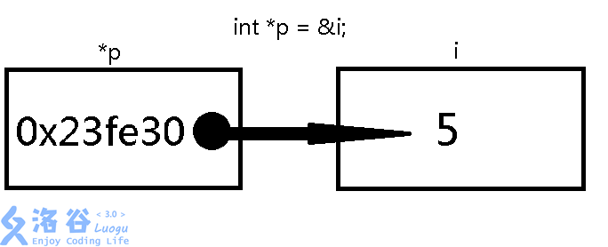
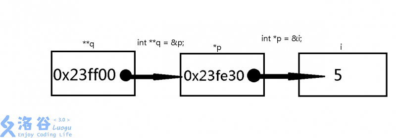
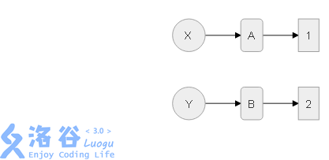
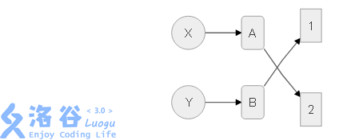
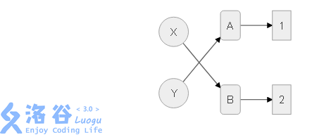

## 指针的定义

### 基本概念

指针里面存储的值是一个内存空间的地址（如果将内存比作一个大数组，内存空间的地址就类似于数组的下标），该地址对应的变量“被这个指针指向”。



当然，一个指针也可以指向指针。



### 代码示例

```cpp
int i = 3;
int *p = &i;   // 现在p是一个指针，指向i
int **q = &p;  // q是一个指针，指向指针p
cout << p << " " << *p << endl;
cout << q << " " << *q << " " << **q;
```

本程序的输出结果可能是：

```text
0x22fec8 3
0x22fec4 0x22fec8 3
```

提示：
0x22fec8 就是变量 i 的地址
0x22fec4 就是指针\*p 的地址

大家可以举一反三，还可以定义很多其他类型的指针（比如 char,double,long long······），都是同一个原理。

## 交换两个数的值

### 代码 1

```cpp
void change(int x, int y) {
  int t = x;
  x = y;
  y = t;
}

// main
int a = 1, b = 2;
change(a, b);
cout << a << b;
```

输出

```text
1 2
```

为什么 `a` 和 `b` 没有交换呢，这是因为当我们把 `a` 和 `b` 传到函数 `change` 的时候，参数 `x` 和 `y` 相当于只是把参数复制了一遍，并没有改变 `a` 和 `b` 的值。
所以这里我们就需要用到指针。我们可以把参数 x 和 y 改成 a 和 b 的指针。这样的话，当我们在函数 `change` 里面改变 `*x` 和 `*y` 的值后，相当于我们就已经把 a 和 b 的值改变了。
代码如下：

### 代码 2

```cpp
void change(int *x, int *y) {
  int t;
  t = *x;
  *x = *y;
  *y = t;
}

// main
int a = 1, b = 2;
change(&a, &b);
cout << a << b;
```

这样我们就可以将 a 和 b 的值交换了。

### 代码 3

```cpp
void change(int *x, int *y) {
  int *t;
  t = x;
  x = y;
  y = t;
}

// main
int a = 1, b = 2;
change(&a, &b);
cout << a << b;
```

这一段代码也是做不到交换的，其主要原因就是由于我们知道函数的参数传进来的时候，编译器会把它的参数复制一份，这里复制的是这个指针，但是交换的也是指针，所以还是只在函数内有效。
也就是说还是只交换了形参没有交换实参。

还没有听明白吗？看图。

最开始：



代码 2 执行后



代码 3 执行后



通过以上的图，我们就能很直观地了解到代码三是如何错的了。

### 拓展代码 4

不知道大家刚才有没有注意到，我们在将 `a` 和 `b` 传递到函数 change 的时候，在前面加了一个 `&` 符号，这个符号的作用是取出变量的地址，所以它叫取址符。

```cpp
void change(int &x, int &y) {
  int t = x;
  x = y;
  y = t;
}

// main
int a = 1, b = 2;
change(a, b);
cout << a << b;
```

但是在上面代码中，参数 `x` 和 `y` 变量前面的符号也是 `&` ，可是它的作用就不是取址了。这个符号叫引用符，引用符相当于给变量取了个“别名”，实际上他们两个是同一个变量。所以我们在改变参数 `x` 和 `y` 的时候，变量 `a` 和 `b` 也会相应的改变。

## 数组中的指针

指针不仅可以应用在变量中，它还可以应用在数组中，请看如下代码。

## 用指针访问数组

```cpp
int a[5] = {1, 2, 3, 4, 5};
int *p;
for (p = a; p < a + 5; p++) {
  cout << *p << " ";
}
```

输出

```cpp
1 2 3 4 5
```

在这个代码中，我们首先定义了指针 `*p` ，用来指向数组 a 的第一个元素 `a[0]` , 随后我们每次输出指针 `*p` ，然后将 `p++` （注意这里的 `p++` 是将 `p` 原来指向的地址向前挪动一个 `sizeof(int)` ，而一个 `sizeof(int)` 的刚好是 4 个字节，是一个 `int` 所占用的内存空间。所以在我们当 `p++` 之后， `p` 的指针恰好就跳到了数组的下一位）。最后我们要判断，让 `p` 不要超过数组 `a` 所占的内存空间。

## 数组与指针的关系

数组其实就是一种特殊的指针，所以说访问数组也可以这么写：

```cpp
a[3] = 5;
```

等价于：

```cpp
*(a + 3) = 5;
```

数组由于是在内存中连续存储的，所以，而数组这个 `a` 本身他其实也就是一个指针，当我们访问 `a[3]` 时。其实就是在访问诶这个指针后移三位的位置。那么它其实也就等价于 `a+3` 在访问里面的内容啦。
综上所述，访问数组也可以这么写：

```cpp
3 [a] = 5;
```

## 结构体指针

### 定义

结构体指针就是指向结构体的指针：

```cpp
struct node {
  int a;
  double b;
  long long c;
};

// main
node x;
node *p = &x;
```

这时候 `p` 就是一个结构体指针，其类型是 `node` 

### 使用

怎么读取/写入结构体指针？

#### 读取

用 `->` 运算符

```cpp
// read
int a = p->a;
double b = p->b printf("%lld\n", p->c);
```

或，如果你愿意写的复杂一点，可以：

```cpp
// read2
int a = (*p).a;
double b = (*p).b;
printf("%lld\n", (*p).c);
```

#### 写入

与读取类似。

```cpp
p->a = 123;
p->b = 1.023;
scanf("%lld", &(p->a));
```

复杂的方法就不说了，大家可以举一反三。

## 申请/释放内存

指针申明后是没有内存空间的，必须申请后才有。

申请的内存需要释放，否则会造成内存泄露，引起 RE 或 MLE。

### 申请

使用 `new` 关键字。

单个变量：

```cpp
int *w = new int;
node *a = new node;
```

数组：

```cpp
int *w = new int[500];
// 现在w是一个int数组了，长度为500
a[2] = 3;
```

二维数组：

```cpp
int *w[100] = new int[100][100];
// 现在w是一个二维int数组了，长度为100x100
```

### 释放

使用 `delete` 关键字。

单个变量：

```cpp
delete w;
delete a;
```

数组：

```cpp
delete[] w;
```

二维数组：

```cpp
delete[] w;
```

### RE 错误

离奇的 RE 错误可能由指针引起，其中申请/释放部分是最容易出错。

如果出现报错：

```text
double free or operation(core dumped)
```

说明一个指针被释放了两次或释放后又进行了解引用操作。
