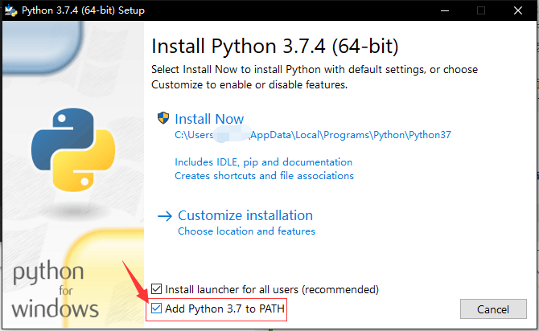
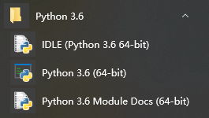

## 关于 Python

Python 是一种目前已在世界上广泛使用的解释型面向对象语言，非常适合用来测试算法片段和原型，也可以用来刷一些 OJ。

### 为什么要学习 Python

- Python 是一种 **解释型** 语言：类似于 PHP 与 Perl，它在开发过程中无需编译，即开即用，跨平台兼容性好。
- Python 是一种 **交互式** 语言：我们可以在命令行的提示符 `>>>` 后直接输入代码，这将使代码更易于调试。
- Python 易读性强，且在世界广泛使用，从简单的输入输出到科学计算甚至于大型 Web 应用，都能够在使用过程中比其他语言 **更快获得支持**，**更快解决问题**，学习 Python 能为以后的学习和工作增加一项实用能力。
- 哦，还有一个最重要的：它在各平台下的环境易于配置，并且目前市面上大部分流行的 Linux 发行版（甚至于 `NOI Linux`）中也大都 **内置** 了个版本比较旧的 Python，这意味着尽管我们无法用 Python 提交，但能真正在考场上使用它，让它成为我们的好帮手。

### 学习 Python 时需要注意的事项

- 目前的 Python 分为 Python 2 和 Python 3 两个版本，其中 Python 2 虽然 [几近废弃](https://pythonclock.org/)，但是仍被一些老旧系统和代码所使用。我们通常不能确定在考场上可以使用的版本。此处 **介绍较新版本的 Python**。但还是建议读者确认考场环境，了解一下 Python 2 的相关语法，并比较两者之间的差异。如果遇到 Python 2 的代码，可以尝试自带的 [`2to3`](https://docs.python.org/zh-cn/3/library/2to3.html) 工具将其转换为 Python 3 的代码。
- Python 的设计理念和语法结构与 C++ 的差异还是比较大的，它隐藏了许多底层的细节，呈现出实用且优雅的风格，刚开始可能让 C++ 用户十分不适应，接触一段时间后用户可能又会喜欢上它的简洁，但再深入探究可能又会感到厌倦，这因人而异。

## 环境搭建

### Windows

访问 <https://www.python.org/downloads/>，下载自己需要的版本并安装。
另外为了方便，请务必勾选 `Add Python 3.x to PATH` 以确保将 Python 加入环境变量！
如在如下的 Python 3.7.4 安装界面中，应该如图勾选最下一项复选框。



安装完成后，你可以在开始菜单找到安装好的 Python。



此外，你还可以在命令提示符中运行 Python。

正常启动后，它会先显示欢迎信息与版本信息以及版权声明，之后就会出现提示符 `>>>`，一般情况下如下所示：

```console
$ python3
Python 3.6.4 (v3.6.4:d48eceb, Dec 19 2017, 06:54:40) [MSC v.1900 64 bit (AMD64)] on win32
Type "help", "copyright", "credits" or "license" for more information.
>>>
```

这就是 Python 的 **IDLE**。

???+ note "何谓 [**IDLE**](https://docs.python.org/zh-cn/3/glossary.html#term-idle)？"
    Python 的 IDE，「集成开发与学习环境」的英文缩写。是 Python 标准发行版附带的基本编程器和解释器环境。在其他 Python 发行版（如 Anaconda）中还包含 [IPython](https://ipython.org/)，[Spyder](https://www.spyder-ide.org/) 等更加先进的 IDE。

此外，也可以在 Microsoft 商店 [免费获取 Python](https://www.microsoft.com/store/productId/9P7QFQMJRFP7)。

### macOS/Linux

通常情况下，正如上文所说，大部分的 Linux 发行版中已经自带了 Python，如果只打算学学语法并无特别需求，一般情况下不用再另外安装。通常而言，在 Linux 终端中运行 `python2` 进入的是 Python 2，而运行 `python3` 进入的是 Python 3。

如果发行版自带 Python 版本过于老旧，可以自行下载编译最新版本 Python 源码，不过我们更推荐使用 venv、conda、Nix 等工具来管理 Python 工具链和 Python 软件包，创建隔离的虚拟环境，避免出现依赖问题。

???+ note "运行 `python` 还是 `python3` ？"
    根据 [Python 3 官方文档](https://docs.python.org/zh-cn/3/tutorial/interpreter.html) 的说法，在 Unix 系统中，`Python 3.X` 解释器 **默认安装**（指使用软件包管理器安装）后的执行文件并不一定叫作 `python`，以免与可能同时安装的 `Python 2.X` 冲突。同样的，默认安装的 pip 软件也是类似的情况，Python 3 包管理器的文件名为 `pip3`。`python` 这个名字指向 `python2` 还是 `python3` 则视系统和系统版本确定。所以，当使用 Python 3 有关的时，请使用 `python3` 和 `pip3` 以确保准确，同理，Python 2 最好使用 `python2` 和 `pip2`。

### 运行程序

作为一种解释型语言，Python 的执行方式和 C++ 有所不同，这种差异在使用 IDE 编程时往往得不到体现，因此这里需要强调一下运行程序的不同方式。

当在命令行中键入 `python3`  或刚刚打开 `IDLE` 时，你实际进入了一种交互式的编程环境，也称 `REPL` （「读取-求值-输出」循环），初学者可以在这里输入语句并立即看到结果，这让验证一些语法变得极为容易，我们也将在后文中大量使用这种形式。

但若要编写完整的程序，你最好还是新建一个文本文件（通常后缀为 `.py`），然后在命令行中执行 `python3 filename.py`，就能够运行代码看到结果了。

### 关于镜像和 pip

目前国内关于 **源码** 的镜像缓存主要是 [北京交通大学](https://mirror.bjtu.edu.cn/python/)、[华为开源镜像站](https://mirrors.huaweicloud.com/python/) 和 [淘宝开源镜像站](https://npm.taobao.org/mirrors/python/) 在做，如果有下载问题的话可以到那里尝试一下。

如果还有使用 pip 安装其他模块的需求，请参照 [TUNA 的镜像更换帮助](https://mirrors.tuna.tsinghua.edu.cn/help/pypi/)。

???+ note "[**pip**](https://pypi.org/project/pip/) 是什么？"
    Python 的生命力很大程度上来自于丰富的第三方库，编写一些实用程序时「调库」是常规操作，而 pip 就是 Python 用来安装第三方 Python 库的默认包管理器。它的功能很强大，能够处理版本依赖关系，还能通过 wheel 文件支持二进制安装。pip 的库现在托管在 [PyPI](https://pypi.org)（即「Python 包索引」）平台上，用户也可以指定第三方的包托管平台。

关于 PyPI 的镜像，可以使用如下大镜像站的资源：

- [清华大学 TUNA 镜像站](https://mirrors.tuna.tsinghua.edu.cn/help/pypi/)
- [中国科学技术大学镜像站](http://mirrors.ustc.edu.cn/help/pypi.html)
- [豆瓣的 PyPI 源](https://pypi.douban.com/simple)
- [华为开源镜像站](https://mirrors.huaweicloud.com/)

## 基本语法

Python 以其简洁易懂的语法而出名，它的文档也是非常友好，这里仅介绍一些对 OIer 比较实用的语言特性，如果你看完本教程后仍有疑惑，我们强烈建议通读一遍其官网的 [Python 教程](https://docs.python.org/zh-cn/3/tutorial/index.html)。

### 关于注释

鉴于后文中会高频用到注释，我们先来了解一下注释的语法。

```python3
# 用 # 字符开头的是单行注释

""" 跨多行字符串会用三个引号
    包裹，但也常被用来做多
    行注释. (NOTE: 在字符串中
    不会考虑缩进问题)
"""
```

加入注释代码并不会对代码产生影响。我们鼓励加入注释来使代码更加易懂易用。

### 基本数据类型

#### 一切皆对象

在 Python 中，你无需事先声明变量名及其类型，直接赋值即可创建各种类型的变量：

```python3
>>> x = -3  # 语句结尾不用加分号
>>> x
-3
>>> f = 3.1415926535897932384626; f  # 实在想加分号也可以，这里节省了一行
3.141592653589793
>>> s1 = "O"
>>> s1  # 怎么显示成单引号了？有区别吗？
'O'
>>> b = 'A' == 65  # 明明在 C/C++ 中是成立的
>>> b  # 与众不同的是 True, False 首字母均大写，可能与内置常量的命名约定有关
False
>>> True + 1 == 2 and not False != 0  # Python 可能喜欢单词胜过符号
True
```

但这不代表 Python 没有类型的概念，实际上解释器会根据赋值或运算自动推断变量类型，你可以使用内置函数 `type()` 查看这些变量的类型：

```python3
>>> type(x)
<class 'int'>
>>> type(f)
<class 'float'>
>>> type(s1)  # 请注意，不要给字符串起名为 str，不信试试看是否真的可以这么做
<class 'str'>
>>> type(b)
<class 'bool'>
```

???+ note "[**内置函数**](https://docs.python.org/zh-cn/3/library/functions.html) 是什么？"
    在 C/C++ 中，很多常用函数都分散在不同的头文件中，但 Python 的解释器内置了许多实用且通用的函数，你可以直接使用而无需注意它们的存在，但这也带来了小问题，这些内置函数的名称多为常见单词，你需要注意避免给自己的变量起相同的名字，否则可能会产生奇怪的结果。

正如我们所看到的，Python 内置有整数、浮点数、字符串和布尔类型，可以类比为 C++ 中的 `int`，`float`，`string` 和 `bool`。但有一些明显的不同之处，比如没有 `char` 字符类型，也没有 `double` 双精度类型，如果需要更精确的浮点运算，可以使用标准库中的 [decimal](https://docs.python.org/zh-cn/3/library/decimal.html) 模块，如果需要用到复数，Python 还内置了 `complex` 类型（而这也意味着最好不要给变量起名为 `complex`）。
可以看到这些类型都以 `class` 开头，而这正是 Python 不同于 C++ 的关键之处，Python 程序中的所有数据都是由对象或对象间关系来表示的，函数是对象，类型本身也是对象：

```python3
>>> type(int)
<class 'type'>
>>> type(pow)  # 求幂次的内置函数，后文会介绍
<class 'builtin_function_or_method'>
>>> type(type)  # type() 也是内置函数，但有些特殊，感兴趣可自行查阅
<class 'type'>
```

你或许会觉得这些概念一时难以理解且没有用处，所以我们暂时不再深入，在后文的示例中你或许能慢慢体会到，Python 的对象提供了强大的方法，我们在编程时应当优先考虑围绕对象而不是过程进行操作，这会让我们的代码显得更加紧凑明晰。

#### 数字运算

有人说，你可以把你系统里装的 Python 当作一个多用计算器，这是事实。  
在交互模式下，你可以在提示符 `>>>` 后面输入一个表达式，就像其他大部分语言（如 C++）一样使用运算符 `+`、`-`、`*`、`/` 、`%`来对数字进行运算，也可以使用 `()` 来进行符合结合律的分组，读者可以自行试验，在这里我们仅展示与 C++ 差异较大的部分：

```python3
>>> 5.0 * 6  # 浮点数的运算结果是浮点数
30.0
>>> 15 / 3  # 与 C/C++ 不同，除法永远返回浮点 float 类型
5.0
>>> 5 / 100000  # 位数太多，结果显示成科学计数法形式
5e-05
>>> 5 // 3 # 使用整数除法（地板除）则会向下取整，输出整数类型
1
>>> -5 // 3 # 符合向下取整原则，注意这与 C/C++ 不同
-2
>>> 5 % 3 # 取模
2
>>> -5 % 3 # 负数取模结果一定是非负数，这点也与 C/C++ 不同，不过都满足 (a//b)*b+(a%b)==a 
1
>>> x = abs(-1e4)  # 求绝对值的内置函数
>>> x += 1  # 没有自增/自减运算符
>>> x  # 科学计数法默认为 float
10001.0
```

在上面的实践中可以发现，除法运算（`/`）永远返回浮点类型（在 Python 2 中返回整数）。如果你想要整数或向下取整的结果的话，可以使用整数除法（`//`)。同样的，你也可以像 C++ 中一样，使用模（`%`）来计算余数，科学计数法的形式也相同。

特别地，Python 用 `**` 即可进行幂运算，还通过内置的 `pow(a, b, mod)` 提供了 [快速幂](../math/quick-pow.md) 的高效实现。

同时 Python 还提供大整数支持，但是浮点数与 C/C++ 一样存在误差。

```python3
>>> 3 ** 4 # 幂运算
81
>>> 2 ** 512
13407807929942597099574024998205846127479365820592393377723561443721764030073546976801874298166903427690031858186486050853753882811946569946433649006084096
>>> pow(2, 512, int(1e4)) # 即 2**512 % 10000 的快速实现, 1e4 是 float 所以要转 int
4096
>>> 2048 ** 2048 # 在IDLE里试试大整数？
>>> 0.1 + 0.1 + 0.1 - 0.3 == 0.  # 和 C/C++ 一样需要注意浮点数不能直接判相等
False
```

#### 字符串

Python 3 提供了强大的基于 [Unicode](https://docs.python.org/zh-cn/3/howto/unicode.html#unicode-howto) 的字符串类型，使用起来和 C++ 中的 string 类似，一些概念如转义字符也都相通，除了加号拼接和索引访问，还额外支持数乘 `*` 重复字符串，和 `in` 操作符。

```python3
>>> s1 = "O"  # 单引号和双引号都能包起字符串，有时可节省转义字符
>>> s1 += 'I-Wiki'  # 为和 C++ 同步建议使用双引号 
>>> 'OI' in s1  # 检测子串很方便
True
>>> len(s1)  # 类似 C++ 的 s.length()，但更通用
7
>>> s2 = """ 感谢你的阅读
... 欢迎参与贡献!
"""   # 使用三重引号抱起的字符串可以跨越多行
>>> s1 + s2 
'OI-Wiki 感谢你的阅读\n欢迎参与贡献!'
>>> print(s1 + s2)  # 这里使用了 print() 函数打印字符串
OI-Wiki 感谢你的阅读
欢迎参与贡献!
>>> s2[2] * 2 + s2[3] + s2[-1]  # 负数索引从右开始计数，加上len(s)，相当于模n的剩余类环
'谢谢你!'
>>> s1[0] = 'o'  # str 是不可变类型，不能原地修改，其实 += 也是创建新的对象
Traceback (most recent call last):
  File "<stdin>", line 1, in <module>
TypeError: 'str' object does not support item assignment
```

除了索引，字符串还支持 *切片*，它的设计非常精妙又符合直觉，格式为 `s[左闭索引:右开索引:步长]`：

```python3
>>> s = 'OI-Wiki 感谢你的阅读\n欢迎参与贡献!'
>>> s[:8]  # 省略左闭索引则从头开始
'OI-Wiki '
>>> s[8:14]  # 左闭右开设计的妙处，长度恰好为14-8=6，还和上一个字符串无缝衔接
'感谢你的阅读'
>>> s[-4:]  # 省略右开索引则直到结尾
'与贡献!'
>>> s[8:14:2]  # 步长为2
'感你阅'
>>> s[::-1]  # 步长为 -1 时，获得了反转的字符串
'!献贡与参迎欢\n读阅的你谢感 ikiW-IO'
>>> s  # 但原来的字符串并未改变
'OI-Wiki 感谢你的阅读\n欢迎参与贡献!'
```

C/C++ 中 `char` 类型可以和 对应的 ASCII 码互转，而在 Python 中你可以对一个 Unicode 字符使用内置函数 `ord()` 将其转换为对应的 Unicode 编码，逆向的转换使用内置函数 `chr()`。

如果想把数字转换成对应的字符串，可以使用内置函数 `str()`，反之可以使用 `int()` 和 `float()`，你可以类比为 C/C++ 中的强制类型转换，但括号不是加在类型上而是作为函数的一部分括住参数。

Python 的字符串类型提供了许多强大的方法，包括计算某字符的索引与出现次数，转换大小写等等，这里就不一一列举，强烈建议查看[官方文档](https://docs.python.org/zh-cn/3/library/stdtypes.html#text-sequence-type-str)熟悉常用方法，遇到字符串操作应当首先考虑使用这些方法而非自力更生。

### 开数组

从 C++ 转过来的同学可能很迷惑怎么在 Python 中开数组，这里就介绍在 Python 开「数组」的语法，需要强调我们介绍的其实是几种[序列类型](https://docs.python.org/zh-cn/3/library/stdtypes.html#iterator-types)，和 C 的数组有着本质区别，而更接近 C++ 中的 `vector`。

#### 使用 `list`

列表（`list`）大概是 Python 中最常用也最强大的序列类型，列表中可以存放任意类型的元素，包括嵌套的列表，这符合数据结构中「广义表」的定义，另外请注意不要将其与 C++ STL 中的双向链表 `list` 混淆，故本文将使用列表一词而非 `list` 以免造成误解。

```python3
>>> []  # 创建空列表，注意列表使用方括号
[]
>>> nums = [0, 1, 2, 3, 5, 8, 13]; nums  # 初始化列表，注意整个列表可以直接打印
[0, 1, 2, 3, 5, 8, 13]
>>> nums[0] = 1; nums  # 支持索引访问，还支持修改元素
[1, 1, 2, 3, 5, 8, 13]
>>> nums.append(nums[-2]+nums[-1]); nums  # append() 同 vector 的 push_back()
[1, 1, 2, 3, 5, 8, 13, 21]
>>> nums.pop()  # 弹出并返回末尾元素，可以当栈使用；其实还可指定位置，默认是末尾
21
>>> nums.insert(0, 1); nums  # 同 vector 的 insert(position, val)
[1, 1, 1, 2, 3, 5, 8, 13]
>>> nums.remove(1); nums  # 按值移除元素（只删第一个出现的），若不存在则抛出错误
[1, 1, 2, 3, 5, 8, 13]
>>> len(nums)  # 求列表长度，类似 vector 的 size()，但 len() 是内置函数
7
>>> nums.reverse(); nums  # 原地逆置
[13, 8, 5, 3, 2, 1, 1]
>>> sorted(nums)  # 获得排序后的列表
[1, 1, 2, 3, 5, 8, 13]
>>> nums  # 但原来的列表并未排序
[13, 8, 5, 3, 2, 1, 1]
>>> nums.sort(); nums  # 原地排序，可以指定参数 key 作为排序标准
[1, 1, 2, 3, 5, 8, 13]
>>> nums.count(1)  # 类似 std::count()
2
>>> nums.index(1)  # 返回值首次出现项的索引号，若不存在则抛出错误
0
>>> nums.clear(); nums  # 同 vector 的 clear()
```

以上示例展现了列表与 `vector` 的相似之处，`vector` 中常用的操作一般也都能在列表中找到对应方法，不过某些方法如 `len()`, `sorted()` 会以内置函数的面目出现，而 STL 算法中的函数如 `find()`, `count()`, `max_element()`, `sort()`, `reverse()` 在 Python 中又成了对象的方法，使用时需要注意区分，更多方法请参见官方文档的[列表详解](https://docs.python.org/zh-cn/3/tutorial/datastructures.html#more-on-lists)。下面将展示列表作为 Python 的基本序列类型的一些强大功能：

```python3
>>> lst = [1, '1'] + ["2", 3.0]  # 列表直接相加生成一个新列表
>>> lst  # 这里存放不同的类型只是想说明可以这么做，但这不是好的做法
[1, '1', '2', 3.0]
>>> 3 in lst  # 实用的成员检测操作，字符串也有该操作且还支持子串检测
True
>>> [1, '1'] in lst  # 仅支持单个成员检测，不会发现「子序列」
False
>>> lst[1:3] = [1, 2]; lst  # 切片并赋值，原列表被修改
[1, 2, 3, 3.0]
>>> lst[::-1]  # 获得反转后的新列表
[3.0, 3, 2, 1]
>>> lst *= 2; lst  # 数乘拼接
[1, 2, 3, 3.0, 1, 2, 3, 3.0]
>>> del lst[4:]; lst  # 也可写 lst[4:] = []，del 语句不止可以用于删除序列中元素
[1, 2, 3, 3.0]
```

以上示例展现了列表作为序列的一些常用操作，可以看出许多操作是与字符串相通的，区别在于字符串是「不可变序列」而列表是「可变序列」,在 C/C++ 中我们往往会通过循环处理字符数组，下面将展示如何使用[「列表推导式」](https://docs.python.org/3/tutorial/datastructures.html#list-comprehensions)在字符串和列表之间转换：

```python3
>>> # 建立一个 [65, 70) 区间上的整数数组，range 也是一种类型，可看作左闭右开区间，第三个参数为步长可省略
>>> nums = list(range(65,70))  
[65, 66, 67, 68, 69]
>>> lst = [chr(x) for x in nums]  # 列表推导式的典型结构，不是循环胜似循环
>>> lst  # 上两句可以合并成 [str(x) for x in range(65,70)]
['A', 'B', 'C', 'D', 'E']
>>> s = ''.join(lst); s # 用空字符串 '' 拼接列表中的元素生成新字符串
'ABCDE'
>> list(s)  # 字符串生成字符列表
['A', 'B', 'C', 'D', 'E']
>>> # 如果你不知道有 s.lower() 方法就可能写出下面这样新瓶装旧酒的表达式
>>> ''.join([chr(ord(ch) - 65 + 97) for ch in s if ch >= 'A' and ch <= 'Z'])  
'abcde'
```

下面演示一些在 OI 中更常见的场景，比如二维「数组」:

```python3
>>> vis = [[0] * 3] * 3  # 开一个3*3的全0数组
>>> vis 
[[0, 0, 0], [0, 0, 0], [0, 0, 0]]
>>> vis[0][0] = 1; vis  # 怎么会把其他行也修改了？
[[1, 0, 0], [1, 0, 0], [1, 0, 0]]
>>> # 先来看下一维列表的赋值
>>> a1 = [0, 0, 0]; a2 = a1; a3 = a1[:]  # 列表也可以直接被赋给新的变量
>>> a1[0] = 1; a1  # 修改列表 a1，似乎正常
[1, 0, 0]
>>> a2  # 怎么 a2 也被改变了
[1, 0, 0]
>>> a3  # a3 没有变化
[0, 0, 0]
>>> id(a1) == id(a2) and id(a1) != id(a3)  # 内置函数 id() 给出对象的「标识值」，可类比为地址，地址相同说明是一个对象
True
>>> vis2 = vis[:];  # 拷贝一份二维列表看看
>>> vis[0][1] = 2; vis  # vis 肯定还是被批量修改
>>> [[1, 2, 0], [1, 2, 0], [1, 2, 0]]
>>> vis2  # 但 vis2 是切片拷贝的怎么还是被改了
>>> [[1, 2, 0], [1, 2, 0], [1, 2, 0]]
>>> id(vis) != id(vis2)  # vis 和 vis2 确实不是一个对象啊
True
>>> # 谜底揭晓，vis2 虽然不是 vis 的引用，但其中对应行都指向相同的对象
>>> [[id(vis[i]) == id(vis2[i]) for i in range(3)]
[True, True, True]
>>> # 回看二维列表自身
>>> [id(x) for x in vis]  # 具体数字和这里不一样但三个值一定相同，说明是三个相同对象
[139760373248192, 139760373248192, 139760373248192]
```

其实我们一直隐瞒了一个重要事实，Python 中赋值只传递了引用而非创建新值，你可以创建不同类型的变量并赋给新变量，验证发现二者的标识值是相同的，只不过直到现在我们才介绍了列表这一种可变类型，而给数字、字符串这样的不可变类型赋新值时实际上创建了新的对象，故而前后两个变量互不干扰。但列表是可变类型，所以我们修改一个列表的元素时，另一个列表由于指向同一个对象所以也被修改了。创建二维数组也是类似的情况，示例中用乘法创建二维列表相当于把 `[0]*3` 这个一维列表重复了 3遍，所以涉及其中一个列表的操作会同时影响其他两个列表。更不幸的是，在将二维列表赋给其他变量的时候，就算用切片来拷贝，也只是「浅拷贝」，其中的元素仍然指向相同的对象，解决这个问题需要使用标准库中的 [`deepcopy`](https://docs.python.org/3/library/copy.html)，或者尽量避免赋值二维列表。不过还好，创建二维列表时避免创建重复的列表还是比较简单，只需使用「列表推导式」：

```python3
>>> vis1 = [[0] * 3 for _ in range(3)]  # 把用不到的循环计数变量设为下划线 _ 是一种惯例（但在 REPL 中 _ 其实默认指代上一行的结果）
>> vis1
[[0, 0, 0], [0, 0, 0], [0, 0, 0]]
>>> [id(x) for x in vis1]  # 具体数字和这里不一样但三个值一定不同，说明是三个不同对象
[139685508981248, 139685508981568, 139685508981184]
>>> vis1[0][0] = 1
[[1, 0, 0], [0, 0, 0], [0, 0, 0]]
>>> a2[0][0] = 10 # 访问和赋值二维数组
```

我们未讲循环的用法就先介绍了列表推导式，这是由于 Python 是高度动态的解释型语言，因此其程序运行有大量的额外开销。尤其是 **for 循环在 Python 中运行的奇慢无比**。因此在使用 Python 时若想获得高性能，尽量使用使用列表推导式 ，或者 `filter`,`map` 等内置函数直接操作整个序列来避免循环，当然这还是要根据具体问题而定。

#### 使用 NumPy

??? note "什么是 NumPy"
    [NumPy](https://numpy.org/) 是著名的 Python 科学计算库，提供高性能的数值及矩阵运算。在测试算法原型时可以利用 NumPy 避免手写排序、求最值等算法。NumPy 的核心数据结构是 `ndarray`，即 n 维数组，它在内存中连续存储，是定长的。此外 NumPy 核心是用 C 编写的，运算效率很高。不过需要注意，它不是标准库的一部分，可以使用 `pip install numpy` 安装，但不保证 OI 考场环境中可用。

下面的代码将介绍如何利用 NumPy 建立多维数组并进行访问。

```python3
>>> import numpy as np  # 这是本教程第一次引入

>>> np.empty(3) # 开容量为3的空数组
array([0.00000000e+000, 0.00000000e+000, 2.01191014e+180])

>>> np.empty((3, 3)) # 开3*3的空数组
array([[6.90159178e-310, 6.90159178e-310, 0.00000000e+000],
       [0.00000000e+000, 3.99906161e+252, 1.09944918e+155],
       [6.01334434e-154, 9.87762528e+247, 4.46811730e-091]])

>>> np.zeros((3, 3)) # 开3*3的数组，并初始化为0
array([[0., 0., 0.],
       [0., 0., 0.],
       [0., 0., 0.]])

>>> a1 = np.zeros((3, 3), dtype=int) # 开3×3的整数数组
>>> a1[0][0] = 1 # 访问和赋值
>>> a1[0, 0] = 1 # 更友好的语法
>>> a1.shape # 数组的形状
(3, 3)
>>> a1[:2, :2] # 取前两行、前两列构成的子阵，无拷贝
array([[1, 0],
       [0, 0]])
>>> a1[0, 2] # 获取第1和3列，无拷贝
array([[1, 0],
       [0, 0],
       [0, 0]])

>>> np.max(a1) # 获取数组最大值
1
>>> a1.flatten() # 将数组展平
array([1, 0, 0, 0, 0, 0, 0, 0, 0])
>>> np.sort(a1, axis=1) # 沿行方向对数组进行排序，返回排序结果
array([[0, 0, 1],
       [0, 0, 0],
       [0, 0, 0]])
>>> a1.sort(axis=1) # 沿行方向对数组进行原地排序
```

### 输入输出

Python 中的输入输出主要通过内置函数 `raw_input`(Python 2)/`input`(Python 3) 和 `print` 完成，这一部分内容可以参考 [Python 的官方文档](https://docs.python.org/3/tutorial/inputoutput.html)。`input` 函数用来从标准输入流中读取一行，`print` 则是向标准输出流中输出一行。在 Python 3 中对 `print` 增加了 `end` 参数指定结尾符，可以用来避免 `print` 自动换行。如果需要更灵活的输入输出操作，可以在引入 `sys` 包之后利用 `sys.stdin` 和 `sys.stdout` 操标准作输入输出流。

另外，如果要进行格式化的输出的话可以利用 Python 中字符串的语法。格式化有三种方法，第一种也是最老旧的方法是使用 `printf` 风格的 `%` 操作符，另一种是利用 [`format` 函数](https://docs.python.org/3/library/string.html#formatstrings)，写起来比较长，第三种是 Python 3.6 新增的 [f-string](https://docs.python.org/zh-cn/3/tutorial/inputoutput.html#formatted-string-literals)，最为简洁。

```python3
>>> print(12)
12
>>> print(12, 12) # 该方法在 Python 2 和 Python 3 中的表现不同
12 12
>>> print("%d" % 12) # 与C语法兼容
12
>>> print("%04d %.3f" % (12, 1.2))
0012 1.200
>>> print("{name} is {:b}".format(5, name="binary of 5"))
binary of 5 is 101
```

## 类型检查和提示

无论是打比赛还是做项目，使用类型提示可以让你更容易地推断代码、发现细微的错误并维护干净的体系结构。Python 最新的几个版本允许你指定明确的类型进行提示，有些工具可以使用这些提示来帮助你更有效地开发代码。Python 的类型检查主要是用类型标注和类型注释进行类型提示和检查。对于 OIer 来说，掌握 Python 类型检查系统的基本操作就足够了，项目实操中，如果你想写出风格更好的、易于类型检查的代码，你可以参考 [Mypy 的文档](https://mypy.readthedocs.io/)。

### 动态类型检查

Python 是一个动态类型检查的语言，以灵活但隐式的方式处理类型。Python 解释器仅仅在运行时检查类型是否正确，并且允许在运行时改变变量类型。

```python3
>>> if False:
...     1 + "two"  # This line never runs, so no TypeError is raised
... else:
...     1 + 2
...
3

>>> 1 + "two"  # Now this is type checked, and a TypeError is raised
TypeError: unsupported operand type(s) for +: 'int' and 'str'
```

### 类型提示简例

我们首先通过一个例子来简要说明。假如我们要向函数中添加关于类型的信息，首先需要按如下方式对它的参数和返回值设置类型标注：

```python3
# headlines.py

def headline(text: str, align: bool = True) -> str:
    if align:
        return f"{text.title()}\n{'-' * len(text)}"
    else:
        return f" {text.title()} ".center(50, "o")

print(headline("python type checking"))
print(headline("use mypy", centered=True))
```

但是这样添加类型提示没有运行时的效果——如果我们用错误类型的 `align` 参数，程序依然可以在不报错、不警告的情况下正常运行。

```console
$ python headlines.py
Python Type Checking
--------------------
oooooooooooooooooooo Use Mypy oooooooooooooooooooo
```

因此，我们需要静态检查工具来排除这类错误（例如 [PyCharm](https://www.jetbrains.com/pycharm/) 中就包含这种检查）。最常用的静态类型检查工具是 [Mypy](http://mypy-lang.org/)。

```console
$ pip install mypy
Successfully installed mypy.

$ mypy headlines.py
Success: no issues found in 1 source file
```

如果没有报错，说明类型检查通过；否则，会提示出问题的地方。*值得注意的是，类型检查可以向下（subtype  not subclass）兼容，比如整数就可以在 Mypy 中通过浮点数类型标注的检查（int 是 double 的 subtype，但不是其 subclass）。*

这种检查对于写出可读性较好的代码是十分有帮助的——Bernát Gábor 曾在他的 [The State of Type Hints in Python](https://www.bernat.tech/the-state-of-type-hints-in-python/) 中说过，“类型提示应当出现在任何值得单元测试的代码里”。

### 类型标注

类型标注是自 Python 3.0 引入的特征，是添加类型提示的重要方法。例如这段代码就引入了类型标注，你可以通过调用 `circumference.__annotations__` 来查看函数中所有的类型标注。

```python3
import math

def circumference(radius: float) -> float:
    return 2 * math.pi * radius
```

当然，除了函数函数，变量也是可以类型标注的，你可以通过调用 `__annotations__` 来查看函数中所有的类型标注。

```python3
pi: float = 3.142

def circumference(radius: float) -> float:
    return 2 * pi * radius
```

变量类型标注赋予了 Python 静态语言的性质，即声明与赋值分离：

```python3
>>> nothing: str
>>> nothing
NameError: name 'nothing' is not defined

>>> __annotations__
{'nothing': <class 'str'>}
```

### 类型注释

如上所述，Python 的类型标注是 3.0 之后才支持的，这说明如果你需要编写支持遗留 Python 的代码，就不能使用标注。为了应对这个问题，你可以尝试使用类型注释——一种特殊格式的代码注释——作为你代码的类型提示。

```python3
import math

pi = 3.142  # type: float

def circumference(radius):
    # type: (float) -> float
    return 2 * pi * radius
  
def headline(text, width=80, fill_char="-"):
    # type: (str, int, str) -> str
    return f" {text.title()} ".center(width, fill_char)

def headline(
    text,           # type: str
    width=80,       # type: int
    fill_char="-",  # type: str
):                  # type: (...) -> str
    return f" {text.title()} ".center(width, fill_char)

print(headline("type comments work", width=40))
```

这种注释不包含在类型标注中，你无法通过 `__annotations__` 找到它，同类型标注一样，你仍然可以通过 Mypy 运行得到类型检查结果。

## 常用内置库

在这里介绍一些写算法可能用得到的内置库，具体用法可以自行搜索或者阅读 [官方文档](https://docs.python.org/3/library/index.html)。

| 包名                                                                  | 用途               |
| ------------------------------------------------------------------- | ---------------- |
| [`array`](https://docs.python.org/3/library/array.html)             | 定长数组             |
| [`argparse`](https://docs.python.org/3/library/argparse.html)       | 命令行参数处理          |
| [`bisect`](https://docs.python.org/3/library/bisect.html)           | 二分查找             |
| [`collections`](https://docs.python.org/3/library/collections.html) | 提供有序字典、双端队列等数据结构 |
| [`fractions`](https://docs.python.org/3/library/fractions.html)     | 有理数              |
| [`heapq`](https://docs.python.org/3/library/heapq.html)             | 基于堆的优先级队列        |
| [`io`](https://docs.python.org/3/library/io.html)                   | 文件流、内存流          |
| [`itertools`](https://docs.python.org/3/library/itertools.html)     | 迭代器相关            |
| [`math`](https://docs.python.org/3/library/math.html)               | 常用数学函数           |
| [`os.path`](https://docs.python.org/3/library/os.html)              | 系统路径相关           |
| [`random`](https://docs.python.org/3/library/random.html)           | 随机数              |
| [`re`](https://docs.python.org/3/library/re.html)                   | 正则表达式            |
| [`struct`](https://docs.python.org/3/library/struct.html)           | 转换结构体和二进制数据      |
| [`sys`](https://docs.python.org/3/library/sys.html)                 | 系统信息             |

## 对比 C++ 与 Python

相信大部分算法竞赛选手已经熟练掌握了 C++98 的语法。接下来我们展示一下 Python 语法的一些应用。

接下来的例子是 [Luogu P4779「【模板】单源最短路径（标准版）」](https://www.luogu.com.cn/problem/P4779) 的代码。我们将 C++ 代码与 Python 代码做出对比：

从声明一些常量开始：

C++：

```cpp
#include <bits/stdc++.h>
using namespace std;
const int N = 1e5 + 5, M = 2e5 + 5;
```

Python：

```python3
try: # 引入优先队列模块
    import Queue as pq #python version < 3.0
except ImportError:
    import queue as pq #python3.*

N = int(1e5 + 5)
M = int(2e5 + 5)
INF = 0x3f3f3f3f
```

然后是声明前向星结构体和一些其他变量。

C++：

```cpp
struct qxx {
  int nex, t, v;
};
qxx e[M];
int h[N], cnt;
void add_path(int f, int t, int v) { e[++cnt] = (qxx){h[f], t, v}, h[f] = cnt; }

typedef pair<int, int> pii;
priority_queue<pii, vector<pii>, greater<pii>> q;
int dist[N];
```

Python：

```python3
class qxx:  # 前向星类（结构体）
    def __init__(self):
        self.nex = 0
        self.t = 0
        self.v = 0

e = [qxx() for i in range(M)]  # 链表
h = [0 for i in range(N)]
cnt = 0

dist = [INF for i in range(N)]
q = pq.PriorityQueue()  # 定义优先队列，默认第一元小根堆

def add_path(f, t, v):  # 在前向星中加边
    # 如果要修改全局变量，要使用global来声明
    global cnt, e, h
    # 调试时的输出语句，多个变量使用元组
    # print("add_path(%d,%d,%d)" % (f,t,v))
    cnt += 1
    e[cnt].nex = h[f]
    e[cnt].t = t
    e[cnt].v = v
    h[f] = cnt
```

然后是求解最短路的 Dijkstra 算法代码：

C++：

```cpp
void dijkstra(int s) {
  memset(dist, 0x3f, sizeof(dist));
  dist[s] = 0, q.push(make_pair(0, s));
  while (q.size()) {
    pii u = q.top();
    q.pop();
    if (dist[u.second] < u.first) continue;
    for (int i = h[u.second]; i; i = e[i].nex) {
      const int &v = e[i].t, &w = e[i].v;
      if (dist[v] <= dist[u.second] + w) continue;
      dist[v] = dist[u.second] + w;
      q.push(make_pair(dist[v], v));
    }
  }
}
```

Python：

```python3
def nextedgeid(u):  # 生成器，可以用在for循环里
    i = h[u]
    while i:
        yield i
        i = e[i].nex


def dijkstra(s):
    dist[s] = 0
    q.put((0, s))
    while not q.empty():
        u = q.get()  # get函数会顺便删除堆中对应的元素
        if dist[u[1]] < u[0]:
            continue
        for i in nextedgeid(u[1]):
            v = e[i].t
            w = e[i].v
            if dist[v] <= dist[u[1]]+w:
                continue
            dist[v] = dist[u[1]]+w
            q.put((dist[v], v))
```

最后是主函数部分

C++：

```cpp
int n, m, s;
int main() {
  scanf("%d%d%d", &n, &m, &s);
  for (int i = 1; i <= m; i++) {
    int u, v, w;
    scanf("%d%d%d", &u, &v, &w);
    add_path(u, v, w);
  }
  dijkstra(s);
  for (int i = 1; i <= n; i++) printf("%d ", dist[i]);
  return 0;
}
```

Python：

```python3
# 如果你直接运行这个python代码（不是模块调用什么的）就执行命令
if __name__ == '__main__':
    # 一行读入多个整数。注意它会把整行都读进来
    n, m, s = map(int, input().split())
    for i in range(m):
        u, v, w = map(int, input().split())
        add_path(u, v, w)

    dijkstra(s)

    for i in range(1, n+1):
        # 两种输出语法都是可以用的
        print("{}".format(dist[i]), end=' ')
        # print("%d" % dist[i],end=' ')

    print()  # 结尾换行
```

完整的代码如下：

??? note "C++"
    ```cpp
    #include <bits/stdc++.h>
    using namespace std;
    const int N = 1e5 + 5, M = 2e5 + 5;
    
    struct qxx {
      int nex, t, v;
    };
    qxx e[M];
    int h[N], cnt;
    void add_path(int f, int t, int v) { e[++cnt] = (qxx){h[f], t, v}, h[f] = cnt; }
    
    typedef pair<int, int> pii;
    priority_queue<pii, vector<pii>, greater<pii>> q;
    int dist[N];
    
    void dijkstra(int s) {
      memset(dist, 0x3f, sizeof(dist));
      dist[s] = 0, q.push(make_pair(0, s));
      while (q.size()) {
        pii u = q.top();
        q.pop();
        if (dist[u.second] < u.first) continue;
        for (int i = h[u.second]; i; i = e[i].nex) {
          const int &v = e[i].t, &w = e[i].v;
          if (dist[v] <= dist[u.second] + w) continue;
          dist[v] = dist[u.second] + w;
          q.push(make_pair(dist[v], v));
        }
      }
    }
    
    int n, m, s;
    int main() {
      scanf("%d%d%d", &n, &m, &s);
      for (int i = 1; i <= m; i++) {
        int u, v, w;
        scanf("%d%d%d", &u, &v, &w);
        add_path(u, v, w);
      }
      dijkstra(s);
      for (int i = 1; i <= n; i++) printf("%d ", dist[i]);
      return 0;
    }
    ```

??? note "Python"
    ```python3
    try:  # 引入优先队列模块
        import Queue as pq  # python version < 3.0
    except ImportError:
        import queue as pq  # python3.*
    
    N = int(1e5+5)
    M = int(2e5+5)
    INF = 0x3f3f3f3f
    
    class qxx:  # 前向星类（结构体）
        def __init__(self):
            self.nex = 0
            self.t = 0
            self.v = 0
    
    e = [qxx() for i in range(M)]  # 链表
    h = [0 for i in range(N)]
    cnt = 0
    
    dist = [INF for i in range(N)]
    q = pq.PriorityQueue()  # 定义优先队列，默认第一元小根堆
    
    def add_path(f, t, v):  # 在前向星中加边
        # 如果要修改全局变量，要使用global来声名
        global cnt, e, h
        # 调试时的输出语句，多个变量使用元组
        # print("add_path(%d,%d,%d)" % (f,t,v))
        cnt += 1
        e[cnt].nex = h[f]
        e[cnt].t = t
        e[cnt].v = v
        h[f] = cnt
    
    def nextedgeid(u):  # 生成器，可以用在for循环里
        i = h[u]
        while i:
            yield i
            i = e[i].nex
    
    def dijkstra(s):
        dist[s] = 0
        q.put((0, s))
        while not q.empty():
            u = q.get()
            if dist[u[1]] < u[0]:
                continue
            for i in nextedgeid(u[1]):
                v = e[i].t
                w = e[i].v
                if dist[v] <= dist[u[1]]+w:
                    continue
                dist[v] = dist[u[1]]+w
                q.put((dist[v], v))
    
    # 如果你直接运行这个python代码（不是模块调用什么的）就执行命令
    if __name__ == '__main__':
        # 一行读入多个整数。注意它会把整行都读进来
        n, m, s = map(int, input().split())
        for i in range(m):
            u, v, w = map(int, input().split())
            add_path(u, v, w)
    
        dijkstra(s)
    
        for i in range(1, n+1):
            # 两种输出语法都是可以用的
            print("{}".format(dist[i]), end=' ')
            # print("%d" % dist[i],end=' ')
    
        print()  # 结尾换行
    ```

## 参考文档

1. Python Documentation,<https://www.python.org/doc/>
2. Python 官方中文教程，<https://docs.python.org/zh-cn/3/tutorial/>
3. Learn Python3 In Y Minutes,<https://learnxinyminutes.com/docs/python3/>
4. Real Python Tutorials,<https://realpython.com/>
5. 廖雪峰的 Python 教程，<https://www.liaoxuefeng.com/wiki/1016959663602400/>
6. GeeksforGeeks: Python Tutorials,<https://www.geeksforgeeks.org/python-programming-language/>
