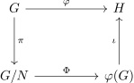

author: jifbt, billchenchina, Enter-tainer, Great-designer, iamtwz, ImpleLee, isdanni, Menci, ouuan, Tiphereth-A, warzone-oier, Xeonacid, c-forrest

前置知识：[抽象代数基本概念](./basic.md)、[置换与排列](../permutation.md)

## 引入

**群论**（group theory）主要研究群这个 [代数结构](https://en.wikipedia.org/wiki/Algebraic_structure)。

为了研究群的结构，需要掌握一些基本工具，这包括子群、群同态和群作用。算法竞赛中，主要涉及到的群是数论相关的群（比如整数模 $n$ 乘法群 $(\mathbf Z/n\mathbf Z)^\times$）以及置换群，本文将着重介绍相关的概念。本文未涉及的群论部分，比如有限群的结构理论和群的线性表示理论，有兴趣的读者应当参考专业书籍。

???+ info "记号"
    在不引起歧义时，本文可能会将 $g\cdot h$ 写作 $gh$，也可能会将群 $(G,\cdot)$ 写作群 $G$。

理解抽象代数不能够离开实例。作为理解下文概念的例子，这里讨论正三角形的空间对称群 $D_6$。

??? example+ " 例子：正三角形的空间对称群 $D_6$"
    如图所示，对于给定正三角形，共计有六种不同的操作可以使得它与自身重合。

    

    这里，使用 $r$ 表示顺时针旋转，使用 $s$ 表示沿顶点 $1$ 到三角形中心的连线翻转，操作自右向左复合，即 $sr$ 表示先旋转（$r$）再翻转（$s$）。两个操作不同，当且仅当某个三角形的顶点在两个操作之后所处位置不同。

    |   记号  |           操作              |  阶  |  置换表示 |
    | :----: | :--------------------------: | :-: | :------: |
    |   $e$  |     恒等变换，即什么也不做     |  1  | $(1)$    |
    |   $r$  |  顺时针旋转 $120^\circ$       |  3  | $(123)$  |
    |  $r^2$ |  顺时针旋转 $240^\circ$       |  3  | $(132)$  |
    |   $s$  |    沿 $1$ 到中心连线翻转      |  2  |  $(23)$  |
    |  $sr$  | 先旋转 $120^\circ$，再翻转    |  2  |  $(13)$  |
    | $sr^2$ | 先旋转 $240^\circ$，再翻转    |  2  |  $(12)$  |

    容易验证，这些操作确实构成了群。比如说，该群的单位元是 $e$，而 $sr$ 的逆元是它自身。而且，群 $D_6$ 并不是交换群，比如可以直接验证 $rs=sr^{-1}$。

    表中记录的操作并不是该记号对应的唯一的对称操作。比如，「沿 $2$ 到中心的连线翻转」也是三角形的对称操作，它不在表中，但它的结果和操作「先旋转 $120^\circ$，再翻转」相同。表中的「阶」和「置换表示」等概念下文会给予说明。

## 子群

要理解给定群的结构，可以首先分析其子结构。群的子结构就是那些在同一运算下仍然成为一个群的该群的子集。由此，有如下定义。

???+ abstract "子群"
    设 $(G,\cdot)$ 是群，如果 $(H,\cdot)$ 也是一个群，则称子集 $H\subseteq G$ 是 $G$ 的一个 **子群**（subgroup），记作 $H\le G$。

??? example+ " 例子：正三角形的空间对称群 $D_6$（续）"
    在 $D_6$ 中，容易验证它的子群有 $\{e\}$，$\{e,s\}$，$\{e,sr\}$，$\{e,sr^2\}$，$\{e,r,r^2\}$ 和 $D_6$ 本身，共计六个。除群 $D_6$ 外，这些子群的结构都是更为简单，而且蕴含了关于原来群的部分信息。

要判断给定子集 $H\subseteq G$ 是不是子群，并不需要逐一验证群的定义：结合律自然成立；子集成为子群，只要保证它对二元运算封闭、有单位元且对取逆封闭就好了。事实上，这些条件可以总结在一起。

???+ note "定理（子群判别法）"
    群 $G$ 的子集 $H$ 是子群，当且仅当，对于所有元素 $g,h \in H$ 都有 $g^{-1}h\in H$。

### 由子集生成的子群

一般地，给定群 $G$ 中的子集 $S$，从 $S$ 中的元素出发，重复进行乘法和取逆运算有限次，能够得到的所有结果的集合成为 $G$ 的一个子群。这称为由子集 $S$ 生成的子群。

???+ abstract "由子集生成的子群"
    对于群 $G$ 和它的非空子集 $S\subseteq G$，如果 $H$ 是包含 $S$ 的 $G$ 的子群中（依包含关系）最小的，则子群 $H$ 称为 **由子集 $S$ 生成的子群**（subgroup generated by a subset），并记作 $\langle S\rangle$。特别地，如果 $S=\{x\}$ 是单元素集合，则 $\langle S\rangle$ 也记作 $\langle x\rangle$，称为 $x$ 的幂的循环子群（cyclic subgroup of the powers of an element）。

可以证明，任给定这样的子集 $S$，总能找到这样的子群：$\langle S\rangle$ 可以构造为所有包含 $S$ 的 $G$ 的子群的交。

??? example+ " 例子：正三角形的空间对称群 $D_6$（续）"
    在群 $D_6$ 中选定旋转操作 $r$，重复应用它和它的逆操作，就得到子群 $\{e,r,r^2\}$。它可以记作 $\langle r\rangle$。群 $D_6$ 中的所有非平凡子群都可以通过选定某个操作来生成。

有些子集生成的子群是群本身。这样的子集尤为特殊，称为群的生成子集。

???+ abstract "群的生成子集"
    群 $(G,\cdot)$ 的子集 $S\subseteq G$ 如果满足 $\langle S\rangle=G$，则称 $S$ 是 $G$ 的 **生成子集**（generating set of a group）。生成子集 $S$ 中的元素称为 **生成元**（generator）。

群是自身平凡的生成子集。更为有趣的情形是，生成子集远小于群本身的规模。

??? example+ " 例子：正三角形的空间对称群 $D_6$（续）"
    可以验证，$D_6=\langle s,r\rangle$，这就是说，任何正三角形的对称操作都可以通过旋转和翻转的复合得到。

### 循环群

仅由一个元素生成的群的结构非常简单。这样的群称为循环群。

???+ abstract "循环群"
    对于群 $G$，如果存在 $x\in G$，成立 $G=\langle x\rangle$，则称 $G$ 是一个 **循环群**（cyclic group）。

??? example+ " 例子：正三角形的空间对称群 $D_6$（续）"
    所有 $D_6$ 的非平凡子群以及 $\{e\}$ 都是循环群。

可以证明，循环群的结构由其大小唯一确定。如果循环群无限，则它必然和整数的加法群 $(\mathbf Z,+)$ 具有相同的群结构，记作 $C_\infty$ 或 $\mathbf Z$；否则，记群的元素个数为 $n\in\mathbf N_+$，则它必然和整数模 $n$ 的同余类的加法群 $(\mathbf Z/n\mathbf Z,+)$ 具有相同的群结构，记作 $C_n$ 或 $\mathbf Z_n$。这一结论的严格叙述需要用到下文的 [群同构](#群同构) 的概念，它严格描述了两个群结构相同这一事实。

???+ note "循环群分类定理"
    有限循环群 $G$ 同构于 $C_n$，这里，$n=|G|$；无限循环群 $G$ 同构于 $C_\infty$。

??? note "证明"
    给定循环群 $G=\langle x\rangle$，它总可以写作 $G=\{x^n:n\in\mathbf Z\}$。如果群 $G$ 有限，那么必然存在自然数 $n<m$ 满足 $x^n=x^m$，依消去律，可以得到 $x^{m-n}=e$。此时，不妨取最小的正整数 $n\in\mathbf N_+$ 使得 $x^n=e$，那么列 $\{x^k\}$ 将会是长度为 $n$ 的循环，且循环节内元素各不相同（否则违反 $n$ 的最小性）。此时，映射 $x^k\mapsto\bar k$ 就提供了同构映射 $G\rightarrow\mathbf Z/n\mathbf Z$，亦即 $G\cong C_n$。反之，如果群 $G$ 无限，那么群 $G$ 内元素各不相同，映射 $x^k\mapsto k$ 就提供了同构映射 $G\rightarrow\mathbf Z$，亦即 $G\cong C_\infty$。

所有循环群都是 Abel 群。本文的例子 $D_6$ 说明，即使群的所有非平凡子群都是循环群，群本身也可能不是 Abel 群。

### 阶

群的阶就是群的元素的个数。群内给定元素的阶就是该元素生成的循环子群的阶。由此，有如下定义：

???+ abstract "群的阶"
    群 $G$ 的 **阶**（order）是它的元素个数，记作 $|G|$。无限群的阶也是无限。

???+ abstract "元素的阶"
    群 $G$ 中元素 $x\in G$ 的 **阶**（order）是最小的正整数 $n$ 使得 $x^n=e$ 成立，记作 $|x|$；如果这样的 $n$ 不存在，则称元素 $x$ 的阶是无限，记作 $|x|=\infty$。

元素的阶总是不大于群的阶，事实上，下文即证明，元素的阶总是整除群的阶。但是，群的阶并非总是元素的阶的最大值，比如 $D_6$ 是六阶群，但是元素的阶最大是 $3$。群的阶也并不是所有元素的阶的最小公倍数，比如 Klein 四元群[^klein] $V_4$ 的阶是 $4$，但是里面只有 $1$ 阶元和 $2$ 阶元。

???+ note "定理"
    有限循环群 $C_n=\langle x\rangle$ 中，元素 $x^k$ 的阶是
    
    $$
    \frac{n}{\gcd(k,n)}.
    $$
    
    特别地，$C_n$ 的生成元的数目是 $\varphi(n)$，这里，$\varphi(\cdot)$ 是 [欧拉函数](../number-theory/euler-totient.md)。

作为上述讨论的应用，注意到模 $n$ 整数乘法群的阶是 $\varphi(n)$，群中的任何元素 $a$ 的阶都整除它，故而必然有 $a^{\varphi(n)}=1$。这就是 [欧拉定理](../number-theory/fermat.md#欧拉定理)，因为该群中的元素就是所有与 $n$ 互质的元素。

### 陪集

子群以外的元素在群中的结构也并非杂乱无章。

??? example+ " 例子：正三角形的空间对称群 $D_6$（续）"
    观察 $D_6$ 中的子群 $\langle r\rangle$，剩余的元素 $\{s,sr,sr^2\}$ 结构和 $\langle r\rangle$ 十分相似：它当中的每个操作都可以通过 $s$ 和 $\langle r\rangle$ 中的操作复合得到。同理，考虑子群 $\langle s\rangle$，则群中的剩余元素可以分为两类，$\{r,sr\}$ 和 $\{r^2,sr^2\}$，它们可以通过 $\langle s\rangle$ 中的元素分别与 $r$ 和 $r^2$ 复合得到。这样的现象是普遍的。

给定子群，可以定义它的陪集。

???+ abstract "陪集"
    设 $G$ 是群，$H\le G$ 是它的子群，则子群 $H$ 的包含 $g$ 的 **左陪集**（left coset）和 **右陪集**（right coset）分别定义为集合

    $$
    \begin{aligned}
    gH &= \{gh:h\in H\},\\
    Hg &= \{hg:h\in H\}.
    \end{aligned}
    $$

    陪集中的元素称为陪集的代表元（representative element）。

子群本身也是其陪集。给定子群，全体陪集构成群的一个分划，即群是全体陪集的不交并。

??? example+ " 例子：正三角形的空间对称群 $D_6$（续）"
    按照陪集的语言，上面的例子中，$D_6$ 可以分别划分成 $\langle r\rangle\cup s\langle r\rangle$ 和 $\langle s\rangle\cup \langle s\rangle r \cup \langle s\rangle r^2$。这里，前者将群划分为若干左陪集，后者将群划分为若干右陪集。应该注意，代表元的选取并无特殊，比如可以验证 $s\langle r\rangle=sr\langle r\rangle$。陪集中的任何元素都是该陪集的代表元。

同一子群的不同陪集大小都相同，都等于对应子群的大小。由于给定子群的全体陪集构成群的一个分划，有限群的阶必然是子群的阶的整数倍。这叫做 Lagrange 定理。

???+ note "Lagrange 定理"
    对于有限群 $G$ 和它的子群 $H\le G$，成立 $|G|=[G:H]|H|$，这里，$[G:H]$ 表示 $G$ 中子群 $H$ 的左（右）陪集数，称为群 $G$ 中子群 $H$ 的 **指数**（index）。

??? note "证明"
    考察左乘以 $g$ 的映射 $h\mapsto gh$，则它和映射 $h\mapsto g^{-1}h$ 互为逆映射，因而它们都是双射。这说明，$|H|=|gH|$ 总是成立。

注意到，元素的阶就是元素生成的循环子群的阶，所以元素的阶也必然整除群的阶。

### 正规子群

一般情况下，给定子群的左右陪集并不相同。

??? example+ " 例子：正三角形的空间对称群 $D_6$（续）"
    群 $D_6$ 中，$\langle s\rangle r=\{r,sr\}$，但是 $r\langle s\rangle=\{r,sr^2\}$。但是如果考虑子群 $\langle r\rangle$，那么左右陪集又总是相同的，因为此时群只有两个陪集，而子群作为一个陪集又必然重合。

左右陪集是否相同，反映了相应的子群的性质。

???+ abstract "正规子群"
    对于群 $G$ 和它的子群 $N\le G$，如果对所有 $h\in N$ 和 $g\in G$，都成立 $ghg^{-1}\in N$，换言之，对所有 $g\in G$，都成立 $gNg^{-1}\subseteq N$，则称 $N$ 是 $G$ 的一个 **正规子群**（normal subgroup），记作 $N\trianglelefteq G$。

这个定义中的条件正等价于 $gN=Ng$ 永远成立。群 $G$ 总有平凡的正规子群，即 $\langle e\rangle$ 和 $G$ 自身。

??? example+ " 例子：正三角形的空间对称群 $D_6$（续）"
    在群 $D_6$ 中，$\langle s\rangle$ 不是正规子群，而 $\langle r\rangle$ 是正规子群。

### 商群

正规子群是非常重要的一类子群，原因之一就是基于正规子群可以定义商群。

对于群 $G$ 和它的正规子群 $N\trianglelefteq G$，考虑全体陪集的集合

$$
G/N = \{gN:g\in G\}.
$$

此时，左右陪集相同，不必区分。可以从群 $G$ 的运算出发，定义 $G/N$ 上的二元运算 $\circ$，它满足

$$
g_1N\circ g_2N=(g_1g_2)N.
$$

可以证明，运算的结果与代表元的选取无关[^quotient]。此时，$(G/N,\circ)$ 确实具有群的结构，它称为 $G$ 模 $N$ 的 **商群**（quotient group）。商群 $G/N$ 并不是群 $G$ 的子群，它的每个元素都是群 $G$ 的一个子集。

??? example+ " 例子：正三角形的空间对称群 $D_6$（续）"
    在群 $D_6$ 中，商群 $G/\langle r\rangle$ 的意义非常显然。它相当于在所有这些对称操作中，忽视操作中将三角形旋转的角度，而只关注它是否将三角形翻转。两个将三角形翻转的操作的复合相当于没有翻转原三角形；但是，如果两个操作一个翻转了三角形而另一个没有，那么复合也必然翻转了三角形。翻转与否也具有群的结构。从群 $D_6$ 中忽视旋转的细节而只考虑翻转的有无，在代数上就是将复杂的群 $D_6$ 模掉 $\langle r\rangle$ 而得到商群 $D_6/\langle r\rangle$。这些论述对子群 $\langle s\rangle$ 是无效的，因为如果忽视翻转的有无，那么旋转的度数没有办法明确判断的，这也是为什么 $G/\langle s\rangle$ 不具有商群的结构。

群的商群可以将复杂的群简化，允许观察群的部分结构来了解原来群的结构。这也是商群也称为 **因子群**（factor group）的原因。没有平凡正规子群的群称为 **单群**（simple group），这些群没有办法简化为更小的群。如同素数一样，它们是组成更复杂的群结构的基石。

## 群同态

理解给定群结构的第二种方法，是将两个群的结构相互比较。

对于两个群，要比较它们的结构，就是要构造两个群之间的映射。但是，这样的映射并不能是任意的，它们要保持群的结构，也就是要保持群的运算在映射前后一致。这样的映射称为群的同态。

???+ abstract "群同态"
    设映射 $\varphi:G\rightarrow H$ 是自群 $(G,\cdot_G)$ 到群 $(H,\cdot_H)$ 的映射，如果 $\varphi$ 保持群的运算，即对所有 $g_1,g_2\in G$ 都成立 $\varphi(g_1\cdot_G g_2)=\varphi(g_1)\cdot_H\varphi(g_2)$，则称映射 $\varphi$ 是一个自群 $G$ 到群 $H$ 的 **同态**（homomorphism）。

群同态必然将幺元映射到幺元，也必然将逆元映射到逆元。

???+ info "记号"
    在下文中，如果不引起歧义，不会区分群 $G$ 和 $H$ 中的运算的记号，并且为表述简便，将省略这些记号。

### 群同构

对于自群 $G$ 到群 $H$ 的同态 $\varphi:G\rightarrow H$，一个自然的问题是，这一同态在多大程度上反映了群 $G$ 和群 $H$ 的结构是一致的。为此，考察群 $G$ 在同态 $\varphi$ 下的像 $\varphi(G)$，它将群 $G$ 的结构映射到群 $H$ 中。一方面，$\varphi(G)$ 是群 $H$ 的一个子群；但若同态 $\varphi$ 不是满的，$\varphi(G)$ 与群 $H$ 并不相同。另一方面，同态 $\varphi$ 也未必是单的；如果 $\varphi$ 不是单的，那么 $\varphi(G)$ 只反映了群 $G$ 的部分结构。只有当同态 $\varphi$ 既单又满时，群 $G$ 和群 $H$ 的结构才是完全一致的。这种特殊的群同态叫做群同构。

???+ abstract "群同构"
    设 $\varphi:G\rightarrow H$ 是自群 $G$ 到群 $H$ 的同态，如果 $\varphi$ 是双射，则称 $\varphi$ 是群 $G$ 和群 $H$ 之间的 **同构**（isomorphism），记作 $G\cong H$。

同构的两个群结构完全一致。如果只关心群的结构，两个同构的群没有必要区分。前文关于循环群的分类定理就是在同构的意义下给出的。

??? example+ " 例子：正三角形的空间对称群 $D_6$（续）"
    回到前文的例子，正三角形的每个对称操作都唯一对应了顶点集合上的置换操作。顶点集合上的全体置换也构成群，即 $S_3$。容易验证，这样得到的映射 $\varphi:D_6\rightarrow S_3$ 是群同态；进一步地，它也是群同构。所以，$D_6\cong S_3$。事实上，六阶群要么同构于 $C_6$，要么同构于 $S_3$（证明见下文）。

对给定阶的有限群的结构进行分类，是群论的重要研究内容，但超出了本文的范畴。

### 同态的核

对于一般的同态，可以进一步讨论有多少关于群的结构的信息损失在了同态中。延续上文的记号。已知 $\varphi(G)$ 是群 $H$ 的子群，现在问题的关键在于 $\varphi(G)$ 和群 $G$ 之间的关系。

??? example+ " 例子：正三角形的空间对称群 $D_6$（续）"
    考虑如下定义的映射 $\varphi: D_6 \rightarrow C_2 = \langle x\rangle$：

    $$
    \varphi(e)=\varphi(r)=\varphi(r^2)=e,\ \varphi(s)=\varphi(sr)=\varphi(sr^2)=x.
    $$

    容易验证，$\varphi$ 是群同态；它是满的，但不是单的。它的意义很明显，就是在群的每一个对称操作映射到其翻转的有无。这样的同态压缩的群 $D_6$ 中的信息，就是有关它旋转角度的信息。比如说，如果没有翻转，任何角度的旋转都映射到了群 $C_2$ 中的单位元。

这个例子启发使用 $\{e\}$ 的原像衡量同态中损失的结构信息。为此，有如下定义。

???+ abstract "同态的核"
    设 $\varphi:G\rightarrow H$ 是自群 $G$ 到群 $H$ 的同态，则同态 $\varphi$ 的 **核**（kernel）是 $\ker\varphi=\{g\in G:\varphi(g)=e\}$，这里，$e$ 是 $H$ 的单位元。

### 同态基本定理

同态的核 $\ker\varphi$ 的确刻画了群同态中损失的结构信息。这一结论的精确表述就是 **同态基本定理**（亦称 **第一同构定理**）（fundamental theorem of group homomorphism, a.k.a., first isomorphism theorem）。

???+ note "同态基本定理（第一同构定理）"
    设 $\varphi:G\rightarrow H$ 是自群 $G$ 到群 $H$ 的同态，则 $\ker\varphi\trianglelefteq G$，且 $G/\ker\varphi\cong\varphi(G)\le H$。

??? note "证明"
    首先，$N=\ker\varphi$ 是正规子群，因为对于任意 $h\in N$ 都有 $\varphi(ghg^{-1})=\varphi(g)\varphi(h)\varphi(g)^{-1}=\varphi(g)\varphi(g)^{-1}=e$，亦即 $ghg^{-1}\in\ker\varphi$。然后，考察映射 $\Phi:G/N\rightarrow\varphi(G)$，它满足 $\Phi(gN)=\varphi(g)$。映射是良定义的，因为如果 $g_1N=g_2N$，那么 $g_1^{-1}g_2\in N$，则 $\varphi(g_1^{-1}g_2)=e$，即 $\varphi(g_1)=\varphi(g_2)$。映射 $\Phi$ 显然是满的；它也是单的，因为 $\ker\Phi=\{gN:\varphi(g)=e\}=\{N\}$。故而，$\Phi$ 是群同构。最后，$\varphi(g_1)\varphi(g_2)^{-1}=\varphi(g_1g_2^{-1})\in\varphi(G)$，根据子群判别法，$\varphi(G)$ 必然是子群。

???+ note "推论"
    同态 $\varphi:G\rightarrow H$ 是单的，当且仅当 $\ker\varphi=\{e\}$。此时，$G$ 同构于 $H$ 的一个子群，即 $G\cong\varphi(G)\le H$。

也就是说，同态 $\varphi$ 的核是群 $G$ 的正规子群，而模 $\ker\varphi$ 得到的商群 $G/\ker\varphi$ 同构于同态的像 $\varphi(G)$，而这一同态的像正是群 $H$ 的子群。

??? example+ " 例子：正三角形的空间对称群 $D_6$（续）"
    上文给出的群同态 $\varphi: D_6 \rightarrow C_2$ 的核是 $\langle r\rangle$，前文讨论正规子群时也已经说明 $D_6/\langle r\rangle$ 的确同构于 $C_2$。

### 自然同态

得到这样的结论并不为奇。这是因为在构造同态 $\varphi: D_6 \rightarrow C_2$ 时，利用的正是商群 $D_6/\langle r\rangle$ 的几何意义。这样的现象并不罕见。事实上，对每个商群，都可以构造出群同态，使得同态的像同构于给定的商群。

???+ abstract "自然同态"
    对于群 $G$ 和其正规子群 $N\trianglelefteq G$，由 $\pi(g)=gN$ 给出的映射 $\pi: G\rightarrow G/N$ 是自 $G$ 到 $G/N$ 的满同态，称为自群 $G$ 到商群 $G/N$ 的 **自然同态**（natural homomorphism）或 **自然映射**。

这一结论也说明，对于任何给定群的正规子群，都能够找到对应的群同态，使得这一同态的核就是给定的正规子群。前文同态基本定理则说明，任何同态的核都是正规子群。故而，正规子群和同态的核是一体两面。

利用自然映射的概念，群的同态基本定理其实是在说如下的 **交换图**（commutative diagram）成立。

这里，所有箭头都是群同态，且 $N=\ker\varphi$ 是同态 $\varphi$ 的核，$\varphi(G)$ 是同态 $\varphi$ 的像。这些映射依次是，$\pi:g\mapsto gN$ 为群 $G$ 到商群 $G/N$ 的自然映射（满同态），$\Phi:gH\mapsto\varphi(g)$ 是同构映射，$\iota$ 则是嵌入映射（单同态）。交换图意味着，图中从 $G$ 出发到 $H$ 结束的两条不同路径上的映射的复合得到的结果是一致的，即 $\varphi=\iota\circ\Phi\circ\pi$。交换图清晰地说明，同态 $\varphi$ 损失的信息就反映在 $\pi$ 和 $\iota$ 中。

### 群的同构定理

用于理解群的结构的有力工具，是群的同构定理。前文已经给出第一同构定理。为了内容完整，这里再给出其他常见的同构定理。

第二同构定理涉及到子群的乘积的概念。

???+ abstract "子集的乘积"
    对于群 $G$ 和它的子集 $A,B\subseteq G$，子集 $A$ 和 $B$ 的 **乘积**（product）是子集 $AB=\{ab:a\in A,b\in B\}$。

子群的乘积并不总是子群。比如，群 $D_6$ 的子群 $A=\langle s\rangle$ 和子群 $B=\langle sr\rangle$ 的乘积等于 $AB=\{e,s,r,sr\}$，这并不是 $G$ 的子群，因为 $(sr)s=r^2\notin AB$。其实，这种 $a\in A$，$b\in B$，但 $ba\notin AB$ 形式的反例正是乘积不是子群的根本原因。对此，有如下定理。

???+ note "定理"
    对于群 $G$ 和它的子群 $A,B\le G$，乘积 $AB$ 是子群，当且仅当 $AB=BA$。

??? note "证明"
    乘积 $AB$ 是子群，则必然有 $ba=(a^{-1}b^{-1})^{-1}\in AB$ 对任意 $a\in A$ 和 $b\in B$ 都成立，所以 $BA\subseteq AB$。反过来，如果 $AB=BA$，则对于任意 $a_1,a_2\in A$ 和 $b_1,b_2\in B$，都有 $(a_1b_1)(a_2b_2)^{-1}=a_1b_1b_2^{-1}a_2^{-1}\in a_1BA=a_1AB=AB$，则根据子群判别法，必然有 $AB$ 是子群。

**第二同构定理**（second isomorphism theorem, a.k.a., diamond isomorphism theorem）则给出了子群乘积仍是子群的更为简单的充分条件，并且进一步确定了其结构。

???+ note "第二同构定理"
    设群 $G$ 和子群 $A,B\le G$ 满足 $A\le N_G(B)$，那么，$AB\le G$，且 $B\trianglelefteq AB$，$A\cap B\trianglelefteq A$，$AB/B\cong A/(A\cap B)$。这里，$N_G(B)$ 是 $B$ 的 [正规化子](#正规化子和中心化子)。特别地，$A\le N_G(B)$ 的一个充分条件是 $B\trianglelefteq G$。

??? note "证明"
    因为 $A\le N_G(B)$，必然有 $aBa^{-1}=B$ 对于所有 $a\in A$ 都成立，此即 $aB=Ba$。因此，必然有 $AB=BA$，则由上述定理知 $AB$ 是子群。子群 $B$ 作为 $AB$ 的子群，左右陪集相同，因而 $B\trianglelefteq AB$。
    
    考察映射 $\varphi:A\rightarrow AB/B$ 满足 $\varphi(a)=aB$，则它是满的，且它的核 $\ker\varphi=\{a\in A:aB=B\}=A\cap B$。应用同态基本定理就可得证。

**第三同构定理**（third isomorphism theorem）则给出了商群的正规子群和商群与原来群的正规子群和商群之间的对应关系。它解释了将商群进一步分解这一想法的合理性。

???+ note "第三同构定理"
    设群 $G$ 有正规子群 $H,K\trianglelefteq G$，且 $H\le K$，则 $K/H\trianglelefteq G/H$，且 $(G/H)/(K/H)\cong G/K$。

??? note "证明"
    考察映射 $\varphi:G/H\rightarrow G/K$ 满足 $\varphi(gH)=gK$，则它是满的群同态，且 $\ker\varphi=\{gH:g\in K\}=K/H$。应用同态基本定理就可得证。

这一结论可以推广到第四同构定理，或称对应定理（correspondence theorem），它进一步给出了群的子群格和商群的子群格之间的对应关系。

## 群作用

理解给定群结构的第三种方法，是考察群在集合上的作用。

比如说，本文考察的正三角形的空间对称群就是通过群的元素（即对称操作）在三角形上的作用来定义的。再比如说，对称群 $S_M$ 的定义可以通过它的元素在集合 $M$ 上的作用给出。这里所谓的作用，指的是每个群的元素都对应一个集合上的置换。

???+ abstract "群在集合上的作用"
    对于群 $G$ 和集合 $X$ 以及映射 $G\times X\rightarrow X$，记 $(g,x)$ 在该映射下的像为 $g\cdot x$，如果该映射对所有 $g_1,g_2\in G$ 和 $x\in X$ 都满足条件 $g_1\cdot(g_2\cdot x)=(g_1g_2)\cdot x$ 和 $e\cdot x=x$，那么就称该映射为群 $G$ 在集合 $X$ 上的 **群作用**（group action）。

??? info "「左作用」和「右作用」"
    这里采取的群作用的定义在有些地方[^group-action]会称为左作用（left action），因为在记号 $g\cdot x$ 中，群的元素写在了集合的元素的左侧。相应地，此时群元素的复合 $g_1g_2$ 作用在集合上时，需要先进行 $g_2$ 的作用，再进行 $g_1$ 的作用。当然，也可以相应地定义右作用，记作 $x\cdot g$。此时，群元素的复合顺序与左作用相反，即 $x\cdot (g_1g_2)=(x\cdot g_1)\cdot g_2$。两者只有记号上的区别，而无本质区别，因而本文默认采用左作用的记号。

对于满足上述定义的群作用，自然有如下构造

$$
\begin{aligned}
\varphi:G\rightarrow S_X&\\
g\mapsto \varphi_g&: X\rightarrow X\\
&\quad x\mapsto g\cdot x.
\end{aligned}
$$

这一映射，将每个群 $G$ 中的元素 $g$ 都对应到集合 $X$ 上的一个置换 $\varphi_g$，且置换 $\varphi_g$ 将元素 $x$ 映射到 $g\cdot x$。

根据定义，群中的幺元 $e$ 对应的双射 $\varphi_e$ 是 $X$ 上的恒等映射，而群中元素 $g$ 对应的映射 $\varphi_g$ 和其逆元 $g^{-1}$ 对应的映射 $\varphi_{g^{-1}}$ 互为逆映射（这也说明为什么 $\varphi_g$ 总是双射）。可以验证，$\varphi_{g_1g_2}=\varphi_{g_1}\varphi_{g_2}$，即 $\varphi$ 是群 $G$ 到群 $S_X$ 的群同态。

这一群同态 $\varphi$ 称为该群作用的 **置换表示**（permutation representation），它将群 $G$ 映射到了某个置换群上。

???+ abstract "置换群"
    对于群 $G$，如果它是某个对称群的子群，则称群 $G$ 是一个 **置换群**（permutation group）。

该群同态的核也称为该群作用的核。如果这一群同态的核是平凡的，即这个同态是单的，则称该群作用是 **忠实的**（faithful），即该作用的置换表示忠实地反映了群结构的信息。此时，群 $G$ 与置换表示得到的的置换群同构。

???+ info "记号"
    下文中，为表述方便，将省略群作用中的 $\cdot$ 记号。

### 轨道

群作用是二元映射。固定群中的元素 $g$，则可以得到集合上的置换 $\varphi_g$。而如果固定集合上的元素 $x$，则可以得到群对该元素作用的所有可能的结果。

???+ abstract "轨道"
    对于群 $G$ 在集合 $X$ 上的作用和 $x\in X$，则称 $x$ 在群 $G$ 作用下的 **轨道**（orbit）是子集 $Gx=\{gx:g\in G\}$。

??? example+ " 例子：正三角形的空间对称群 $D_6$（续）"
    比如说，如果考虑群 $\langle s\rangle\le D_6$ 在正三角形顶点集合上的作用，则顶点 $1$ 的轨道是 $\{1\}$，而顶点 $2$ 和 $3$ 的轨道是 $\{2,3\}$。但是，群 $\langle r\rangle\le D_6$ 在顶点集合上的作用只有一个轨道，即全体顶点集。

容易证明，群 $G$ 的作用下，集合 $X$ 的全体轨道构成了该集合的一个分划，记作 $X/G$。但是和陪集不同，这些轨道并不一定是等长的。

### 稳定化子

群作用下，集合中的一个元素的轨道长度取决于有多少群里的元素对应的置换以它为不动点。

??? example+ " 例子：正三角形的空间对称群 $D_6$（续）"
    比如说，之所以在群 $\langle s\rangle\le D_6$ 的作用下，顶点 $1$ 的轨道长是一，是因为所有群里的元素都将顶点 $1$ 映到其自身；而顶点 $2$ 的轨道长是二，是因为只有单位元 $e$ 将顶点 $2$ 映射到其自身。

这启发了如下的定义。

???+ abstract "稳定化子"
    对于群 $G$ 在集合 $X$ 上的作用和 $x\in X$，则称群 $G$ 中 $x$ 的 **稳定化子**（stabilizer）是子群 $G_x=\{g\in G:gx=x\}$。

群作用的核就是集合中所有元素的稳定化子的交。

??? example+ " 例子：正三角形的空间对称群 $D_6$（续）"
    考虑群 $D_6$ 在顶点集合上的群作用，则顶点 $1$ 的稳定化子是 $\{e,s\}=\langle s\rangle$。这是 $D_6$ 的子群。因为 $D_6$ 可以划分成左陪集 $\langle s\rangle$，$r\langle s\rangle$ 和 $r^2\langle s\rangle$，容易发现，每个左陪集对顶点 $1$ 作用的结果是一样的。

这一例子说明，轨道上的元素，都和稳定化子的左陪集一一对应。这说明如下结果。

???+ note "定理"
    对于群 $G$ 在集合 $X$ 上的作用，则元素 $x\in X$ 的稳定化子 $G_x$ 是 $X$ 的子群，且子群 $G_x$ 的左陪集与轨道 $Gx$ 存在双射。

??? note "证明"
    验证映射 $gG_x\mapsto gx$ 是良定义的双射即可。

利用 Lagrange 定理，可以将轨道长和稳定化子的陪集数目联系起来。这就是 **轨道稳定子定理**（orbit-stabilizer theorem）。

???+ note "轨道稳定子定理"
    对于群 $G$ 在集合 $X$ 上的作用和 $x\in X$，若 $G$ 有限，则 $|Gx|=[G:G_x]=|G|/|G_x|$。

可以在上面的例子中验证这一结论。

### Burnside 引理

这一引理给出了群作用的轨道个数公式。

???+ note "Burnside 引理"
    对于群 $G$ 在集合 $X$ 上的作用，轨道的个数等于群中每个元素对应置换的不动点的平均个数，即

    $$
    |X/G| = \frac{1}{|G|}\sum_{g\in G}|X^g|.
    $$

    这里，$X^g=\{x\in X:gx=x\}$ 是元素 $g\in G$ 对应置换的不动点集合。

??? note "证明"
    这一定理的证明十分简明。注意到，轨道个数可以写作

    $$
    |X/G|=\sum_{o\in X/G}1=\sum_{x\in X}\frac{1}{|Gx|}=\frac1{|G|}\sum_{x\in X}|G_x|.
    $$

    最后一个等号就是上面的推论；而右式和所要求证的只差一个 Fubini 定理，因为它们中的求和式都是对集合 $\{(g,x)\in G\times X:gx=x\}$ 的计数，只不过右式先对 $g$ 求和，而所求证的式子先对 $x$ 求和。

这一定理在组合数学中有很多用处，可以用于统计「本质不同」的对象的数目。更多例子和讨论可以参考 [Pólya 计数](../combinatorics/polya.md)。

### Cayley 定理

利用群作用研究群的结构，需要选取合适的集合。事实上，群自身就是这样一个集合。因此，接下来考虑群对自身的两类常见的群作用，并借此分析群的结构。

第一个这样的群作用是群对自身的 **左乘作用**（left multiplication）。它的置换表示如下。

$$
\begin{aligned}
\varphi:G\rightarrow S_G&\\
g\mapsto \varphi_g&: G\rightarrow G\\
&\quad x\mapsto gx
\end{aligned}
$$

群的左乘作用必然是忠实的，因为群满足消去律。所以，由同态基本定理，$G$ 可以嵌入对称群 $S_G$ 中。这意味着，每个群都同构于某个置换群[^cayley]。

???+ note "Cayley 定理"
    群 $G$ 同构于对称群 $S_G$ 的子群。

这个群作用只有一个轨道，而且，每个元素的稳定化子都是 $\{e\}$。

### 共轭作用

第二个群到自身的作用叫做 **共轭作用**（conjugation）。它的置换表示如下。

$$
\begin{aligned}
\varphi:G\rightarrow S_G&\\
g\mapsto \varphi_g&: G\rightarrow G\\
&\quad x\mapsto gxg^{-1}
\end{aligned}
$$

在群的共轭作用下，轨道和稳定化子都有特别的名字。

???+ abstract "共轭类"
    对于群 $G$ 和 $g\in G$，元素 $g$ 在群 $G$ 中的 **共轭类**（conjugacy class）是共轭作用下 $g$ 的轨道。如果元素 $g$ 和 $h$ 处在同一共轭类中，则称 $g$ 和 $h$  **共轭**（conjugate）。

???+ abstract "中心化子"
    对于群 $G$ 和 $a\in G$，元素 $a$ 在群 $G$ 中的 **中心化子**（centralizer）是 $C_G(a)=\{g\in G:ga=ag\}$。

???+ abstract "中心"
    对于群 $G$，群 $a$ 的 **中心**（center）为 $Z(G)=\cap_{a\in G}C_G(a)=\{g\in G:\forall a\in G(ga=ag)\}$。

群的中心，是与群中所有元素都交换的元素的集合；因为它是群作用的核，它必然是正规子群。群的中心的大小，表明了它和交换群之间的差距。给定元素的中心化子，是与该元素交换的所有元素的集合；也是所有中心包括它的子群中最大的，这也就是它的名字来源；同时，因为它是共轭作用下某元素的稳定化子，所以它是子群。共轭类一般不是子群。

??? example+ " 例子：正三角形的空间对称群 $D_6$（续）"
    回到群 $D_6$，它的中心是 $\{e\}\neq G$，这说明它不是交换群。元素 $r$ 的中心化子 $C_G(r)$ 是 $\langle r\rangle$，元素 $s$ 的中心化子 $C_G(s)$ 为 $\langle s\rangle$。一般地，对所有 $g\in G$，总成立 $\langle g\rangle\le C_G(g)$。群 $D_6$ 的共轭类共三个，即 $\{e\},\{r,r^2\},\{s,sr,sr^2\}$。容易发现，共轭的元素都是同阶的[^conjugate]。

群在共轭作用下划分成若干个共轭类。所以，可以写出 **类方程**（class equation）。

???+ note "类方程"
    对于群 $G$，设 $\{\mathcal K_i\}_{i=1}^r$ 为全体长度大于一的共轭类，且 $g_i$ 是 $\mathcal K_i$ 的代表元，成立

    $$
    |G|=|Z(G)|+\sum_{i=1}^r[G:C_G(g_i)].
    $$

它可以用于分析群的结构，比如用于证明下文的 [Sylow 定理](#sylow-定理)。

### 正规化子和中心化子

事实上，群的幂集也可以是群作用的对象。这里着重讨论群在它的全体子集 $X=\mathcal P(G)$ 上的共轭作用。它的置换表示如下。

$$
\begin{aligned}
\varphi:G\rightarrow S_X&\\
g\mapsto \varphi_g&: X\rightarrow X\\
&\quad S\mapsto gSg^{-1} = \{gsg^{-1}:s\in S\}
\end{aligned}
$$

在这一共轭作用下，同样可以定义群的子集的共轭类。它的核依然是群的中心。它的稳定化子则称为正规化子。

???+ abstract "正规化子"
    对于群 $G$ 和它的子集 $S\subseteq G$，子集 $S$ 在群 $G$ 中的 **正规化子**（normalizer）是 $N_G(S)=\{g\in G:gSg^{-1}=S\}$。

正规化子是共轭作用下 $S$ 的稳定化子，必然是 $G$ 的子群；$S$ 的正规化子是能够使得 $S$ 包含在其正规子群中的子群中最大的，这也是正规化子的名字来源。特别地，对于单元素集合 $\{a\}$，$N_G(\{a\})=C_G(a)$。

中心化子也可以类似地推广到子集的情形。

???+ abstract "中心化子"
    对于群 $G$ 和它的子集 $S\subseteq G$，子集 $S$ 在群 $G$ 中的 **中心化子**（centralizer）是 $C_G(S)=\{g\in G:\forall s\in S(gsg^{-1}=s)\}$。

中心化子实际上是群 $N_G(S)$ 在 $S$ 的共轭作用的核。所以，必然有 $C_G(S)\trianglelefteq N_G(S)\le G$，所以由子群的传递性，中心化子也是子群。特别地，群的中心 $Z(G)=C_G(G)\trianglelefteq N_G(G)=G$ 必然是正规子群。

### Sylow 定理

进一步地，对有限群的共轭作用进行分析，可以得到 Sylow 定理。它是处理有限群的结构的有力工具，可以迅速地得到大量小阶群的结构。

???+ abstract "$p$‑群 "
    对于群 $G$，如果 $|G|=p^\alpha$，这里，$\alpha$ 是正整数，则称它为 **$p$‑群**（$p$-group）。

???+ abstract "$p$‑子群 "
    对于群 $G$ 和它的子群 $P\le G$，如果 $P$ 本身是一个 $p$‑群，则称 $P$ 为 **$p$‑子群**（$p$-subgroup）。

???+ abstract "Sylow $p$‑子群 "
    对于群 $G$ 和它的子群 $P\le G$，如果 $|G|=p^\alpha m$ 且 $p$ 不能整除 $m$，且 $|P|=p^\alpha$，则称 $P$ 为 **Sylow $p$‑子群**（Sylow $p$-subgroup）。

也就是说，Sylow $p$‑子群是极大的 $p$‑子群。Sylow 定理断言了 Sylow $p$‑子群的存在性，这提供了 Lagrange 定理的一定程度的逆命题。

???+ note "Sylow 定理"
    设有限群 $G$ 的阶 $|G|=p^\alpha m$，这里，$p$ 是质数且 $p$ 不能整除 $m$，那么有如下结论：
    
    1.  存在 Sylow $p$‑子群；
    2.  给定 Sylow $p$‑子群 $P$ 和群 $G$ 的 $p$‑子群 $Q$，那么存在 $g\in G$ 使得 $Q\le gPg^{-1}$ 成立，特别地，所有 Sylow $p$‑子群都共轭；
    3.  群 $G$ 中的 Sylow $p$‑子群的数目 $n_p$ 满足 $n_p\equiv 1\pmod p$，且 $n_p=[G:N_G(P)]$，这里 $P$ 是任意的 Sylow $p$‑子群，所以同时成立 $n_p\mid m$。

??? note "证明"
    为证明第一部分，对 $|G|$ 进行归纳。考虑类方程

    $$
    |G|=|Z(G)|+\sum_{i=1}^r[G:C_G(g_i)].
    $$

    如果 $p\mid|Z(G)|$，那么可以任取中心的 $p$ 阶子群 $N\le Z(G)$，则必然有 $N\trianglelefteq Z(G)\trianglelefteq G$，因而，$G/N$ 是更小的群。根据归纳假设，它有 Sylow $p$‑子群 $P/N$，则自然同态下相应的原像 $P$ 就是原来的群 $G$ 的 Sylow $p$‑子群。于是，只要考虑 $p$ 不能整除 $|Z(G)|$ 的情形。此时，可以取 $g_i\in G$，使得 $p$ 不能整除 $[G:C_G(g_i)]$，因而，$|G|$ 中 $p$ 的全部幂次都出现在 $|C_G(g_i)|$ 中。再次根据归纳假设，$|C_G(g_i)|$ 有 Sylow $p$‑子群 $P$，它正是原来的群 $G$ 的 Sylow $p$‑子群。

    为证明第二部分和第三部分，设群 $G$ 的 Sylow $p$‑子群 $P$ 的共轭类为 $\mathcal S=\{gPg^{-1}:g\in G\}$，并考察群 $G$ 在 $\mathcal S$ 上的共轭作用限制在某一 $p$‑子群 $Q$ 上的结果。集合 $\mathcal S$ 可以在该作用下可以划分成若干轨道。设总共有 $r$ 个轨道，每个轨道的代表元为 $P_i$，则有恒等式

    $$
    |\mathcal S|=\sum_{i=1}^r[Q:Q\cap N_G(P_i)].
    $$

    这里，$Q\cap N_G(P_i)$ 是 $P_i$ 在上述群作用下的稳定化子。设 $H=Q\cap N_G(P_i)$，则显然 $H\le N_G(P_i)$，故而根据群的第二同构定理，有 $P_iH/P_i\cong H/(P_i\cap H)$。所以，$|P_iH|=|P_i||H|/|P_i\cap H|$，而右侧是 $p$ 的幂，左侧必然也是 $p$ 的幂，而且需要成立 $|P_i|\le |P_iH|$。但是，$P_i$ 已经是 $G$ 的子群中 $p$ 的幂次最大的，所以 $P_i=P_iH$。代入前文的同构关系中，就有 $H=P_i\cap H=Q\cap P_i$。这里用到了显然的关系 $P_i\le N_G(P_i)$。这样，就知道稳定化子 $Q\cap N_G(P_i)$ 实际上就是 $Q\cap P_i$。所以，上式可以写作

    $$
    |\mathcal S|=\sum_{i=1}^r[Q:Q\cap P_i].
    $$

    这一等式对于所有 $p$‑子群 $Q$ 都成立。

    自然，Sylow $p$‑子群 $P$ 也是 $p$‑子群。将 $P$ 代入上式中的 $Q$，则右侧有且仅有一项的大小是 $1$，其余都是 $p$ 的倍数。因此，Sylow $p$‑子群 $P$ 的共轭类的大小 $|\mathcal S|$ 必然模 $p$ 余 $1$。同时，因为这一式子对于任何 $p$‑子群 $Q$ 都成立，就自然存在 $g\in G$，使得 $Q\le gPg^{-1}$；否则，对所有上述等式中的 $P_i$ 都有 $|Q\cap P_i|<|Q|$，就与 $|\mathcal S|\equiv 1\pmod p$ 矛盾。如果此时再考虑 $Q$ 是某个不同于 $P$ 的 Sylow $p$‑子群，则必然有 $Q=gPg^{-1}$ 对某个 $g\in G$ 成立，即所有 Sylow $p$‑子群都共轭。因而，Sylow $p$‑子群的数目 $n_p$ 就是 $|\mathcal S|$，它必然满足 $n_p\equiv 1\pmod p$。最后，注意到 $n_p=|\mathcal S|=[G:N_G(P)]$，且 $P\le N_G(P)$，就成立 $n_p\mid m$。这样就完整地证明了定理的第二部分和第三部分。

??? example " 应用：同构意义下，六阶群只有 $C_6$ 和 $S_3$"
    设 $G$ 的阶是 $6$。那么，根据 Sylow 定理，它有 Sylow $2$‑子群，且它的数目满足 $n_2\equiv 1\pmod 2$ 和 $n_2\mid 3$，所以，只有两个情形：$n_2=1$ 或 $n_2=3$。同理，可以证明群 $G$ 有且只有一个 Sylow $3$‑子群，即 $n_3=1$。

    对于 $n_2=1$ 的情形，可以发现群 $G$ 中有一个 Sylow $2$‑子群，故而有一个 $2$ 阶元；又有一个 Sylow $3$‑子群，故而有两个 $3$ 阶元。群 $G$ 还有一个单位元，而剩下的元素，根据 Lagrange 定理，它的阶数必须整除 $6$。又不能是新的 $2$ 阶或 $3$ 阶元，否则会出现与前文不同的新的 Sylow $p$‑子群；所以，剩下的元素只能是 $6$ 阶元。存在和群的阶数相同的元素，这意味着群 $G$ 是循环群，所以 $G\cong C_6$。

    对于 $n_2=3$ 的情形，群 $G$ 有三个共轭的 Sylow $3$‑子群。考虑群 $G$ 在这三个 Sylow $3$‑子群上的共轭作用。对于任何一个 Sylow $3$‑子群 $P$，根据 Sylow 定理，有 $|N_G(P)|=2$；但又有 $P\le N_G(P)$，所以 $P=N_G(P)$。因此，这三个 Sylow $3$‑子群的正规化子的交集，即这个共轭作用的核，是平凡的。所以，这个作用是忠实的，它将 $G$ 嵌入到了这三个 Sylow $3$‑子群上的置换群 $S_3$。但是，因为 $|G|=|S_3|$，必然有 $G\cong S_6$。

## 有限生成 Abel 群

在掌握分析群结构的基本工具后，现在重点讨论一类群的结构。

在概述中提到，Abel 群因为元素可以交换，结构相较于其它群更为简单。其中尤为简单的是那些可以通过有限多个元素生成的 Abel 群。

???+ abstract "有限生成"
    对于群 $G$，如果它的一个生成子集是有限的，则称它是 **有限生成的**（finitely generated）。

本节的分类定理说明，有限生成的 Abel 群可以看作是有限多个的循环群的简单组合。算法竞赛中涉及的群多为有限群。有限 Abel 群必然是有限生成的，因此总是适用这一结论。

### 直积

前文对群的分析主要集中在如何将群分解为更小的群；相反地，自然可以讨论如何将两个群组合成更大的群。在所有可能的组合方式中，群的直积是最为简单的一种。

群的直积的基本想法是，给定两个群 $G$ 和 $H$，考虑其笛卡尔积 $G\times H$，二元对 $(g,h)$ 的运算定义为对两分量分别运算，分量之间互不影响。这样得到的结果显然是更大的群，且原来的两个群可以平凡地嵌入新的群中。

???+ abstract "直积"
    对于群 $(G,\cdot_G)$ 和群 $(H,\cdot_H)$，它们的 **直积**（direct product）是群 $(G\times H,\cdot)$，其中，二元运算 $\cdot:(G\times H)\times(G\times H)\rightarrow G\times H$ 定义为 $(g_1,h_1)\cdot(g_2,h_2)=(g_1\cdot_G g_2,h_1\cdot_H h_2)$。群 $G$ 和群 $H$ 的直积记为 $G\times H$。

对于直积 $G\times H$，平凡地有嵌入映射 $g\mapsto(g,e_H)$ 和 $h\mapsto(e_G,h)$。反过来，映射 $(g,h)\mapsto g$ 和映射 $(g,h)\mapsto h$ 是群同态，同态的核分别是 $\{e_G\}\times H$ 和 $G\times\{e_H\}$。这两个核恰好是上述嵌入映射的像，且它们的交集是平凡的，即 $\{(e_G,e_H)\}$。所以，群的直积 $G\times H$ 中有两个子群，都是正规子群，交集是平凡的，且它们的乘积就是直积 $G\times H$ 本身。

这样的分析其实给出了一个群能够写成它的两个子群的直积的充分必要条件。

???+ note "定理"
    对于群 $G$ 和它的子群 $H_1,H_2\le G$，$G\cong H_1\times H_2$ 当且仅当 $H_1,H_2\trianglelefteq G$，$H_1\cap H_2=\{e\}$ 且 $G=H_1H_2$。

??? note "证明"
    这些条件的必要性在正文中已经讨论过，这里证明它们的充分性。考察映射 $\varphi:G\rightarrow H_1\times H_2$ 满足 $h_1h_2\mapsto(h_1,h_2)$。映射 $\varphi$ 是良定义的，因为对于任意 $h_1,k_1\in H_1$ 和 $h_2,k_2\in H_2$，满足 $h_1h_2=k_1k_2$ 就意味着 $h_1=k_1$ 和 $h_2=k_2$；这是因为 $k_1^{-1}h_1=k_2h_2^{-1}\in H_1\cap H_2=\{e\}$。要说明 $\varphi$ 是群同态，则就是要说明 $(h_1h_2)(k_1k_2)=h_1k_1h_2k_2$，这等价于 $k_1$ 和 $h_2$ 是可交换的，亦即 $k_1h_2k_1^{-1}h_2^{-1}=e$。要证明这一关系，只要注意到 $k_1h_2k_1^{-1}h_2^{-1}=(k_1h_2k_1^{-1})h_2^{-1}\in (k_1H_2k_1^{-1})H_2=H_2$，同理也有 $k_1(h_2k_1^{-1}h_2^{-1})\in H_1$，故而 $k_1h_2k_1^{-1}h_2^{-1}\in H_1\cap H_2=\{e\}$。这些就证明了 $\varphi$ 是群同态。它显然是双射，故而它是同构，即 $G\cong H_1\times H_2$。

在直积中，两个直积因子的元素必然是可以交换的，这是因为 $hg=(e_G,h)(g,e_H)=(g,h)=gh$。所以，如果两个直积因子都是 Abel 群，那么直积也必然是 Abel 群。

并不是所有的群都可以写成两个非平凡子群的直积。

??? example+ " 例子：正三角形的空间对称群 $D_6$（续）"
    例如，群 $D_6=\langle r,s\rangle$ 就不同构于 $\langle r\rangle\times\langle s\rangle$，因为作为两个循环群的直积，后者必然是 Abel 群。

下面的分类定理则说明，有限生成的 Abel 群都可以写作有限多个循环群的直积。

### 分类定理

对于有限生成的 Abel 群，有如下分类定理。它称为 **有限生成 Abel 群基本定理**（fundamental theorem of finitely generated Abelian groups）。

???+ note "有限生成 Abel 群基本定理"
    对于有限生成的 Abel 群 $G$，存在整数 $r\ge0$ 和 $n_1,\cdots,n_s\ge 2$，使得

    $$
    G\cong C_\infty^r\times C_{n_1}\times\cdots\times C_{n_s}.
    $$

    特别地，$r$ 是唯一确定的，称为群 $G$ 的 **阶**（rank），而且

    -   可以选取整数 $n_1,\cdots,n_s$ 使其满足 $n_1\ge2,\ n_1|n_2,\ \cdots,\ n_{s-1}|n_s$，此时，整数 $n_1,\cdots,n_s$ 唯一确定，因子 $C_{n_i}$ 称为群 $G$ 的 **不变因子**（invariant factor）；
    -   也可以选取整数 $n_1,\cdots,n_s$ 使其都是素数幂的形式，此时，这些素数幂也都唯一确定，因子 $C_{n_i}$ 称为群 $G$ 的 **初等因子**（elementary divisor）。

定理首先断言，有限生成的 Abel 群一定是有限多个循环群的直积。

??? note "证明"
    这里给出一个形式简单的证明[^proof-abelian]；更深刻的证明应当参考主理想整环上的有限生成模的结构定理[^module-pid]。在证明中，为书写简便，将使用加法记号代替一般的群中的乘法记号，此时 $0$ 代表单位元，而记号 $mx$ 代表 $x$ 的 $m$ 次幂。

    设 $G$ 最少可以由 $k$ 个元素生成。定理的证明需要对 $k$ 进行归纳。当 $k=1$ 时结论是平凡的。当 $k>1$ 时，取 $G$ 的全体生成元组 $\langle x_1,x_2,\cdots,x_k\rangle$ 中 $x_1$ 的阶最小的那个。下面要说明 $G=\langle x_1\rangle\times\langle x_2,\cdots,x_k\rangle$，后者则根据归纳假设已经可以分解成 $(k-1)$ 个循环群的直积，故归纳步骤得证。

    根据群的直积的刻画，如果直积分解不成立，必然存在关系 $m_1x_1+m_2x_2+\cdots+m_kx_k=0$，且 $m_1x_1\neq 0$。对于负的系数 $m_i$，可以用逆元 $-x_i$ 代替 $x_i$，则所有系数 $m_i$ 都可以取作非负整数。而且，此时可以取 $0< m_1 <|x_1|$。如果再取 $d=\gcd(m_1,m_2,\cdots,m_k)$ 和 $c_i=m_i/d$，则必然有 $y_1=c_1x_1+c_2x_2+\cdots+c_kx_k$ 满足 $dy_1=0$，因而 $|y_1|\le d\le m_1< |x_1|$，即 $y_1$ 是比 $x_1$ 阶更小的元素。 

    下面证明，$y_1$ 可以扩张成 $G$ 的一组生成元。也就是说，存在元素 $y_2,\cdots,y_k\in G$ 满足 $G=\langle y_1,y_2,\cdots,y_k\rangle$。这里唯一的已知条件是 $y_1$ 本身可以写作 $c_1x_1+c_2x_2+\cdots+c_kx_k$，其中，系数 $c_i$ 都是自然数且它们的最大公约数是一。不妨假设系数（非严格）递减排列，则 $y_1$ 也可以写作 $(c_1-c_2)x_1+c_2(x_1+x_2)+\cdots+c_kx_k$。此时，对比之前的条件，可以发现系数依然全部是自然数，且最大公约数是一，而且 $G=\langle x_1,x_1+x_2,x_3,\cdots,x_k\rangle$，但是全体系数的和减少了 $c_2$。如果 $c_2=0$，则必然有 $c_1=1$，结论是平凡的；否则，系数的和严格地减少了。这意味着，如果对系数的和进行归纳，就可以证明满足上述条件的 $y_1$ 总可以扩张成 $G$ 的一组生成元。

    进而，此时找到了比 $x_1$ 更小阶的生成元 $y_1$，这与 $x_1$ 的选取矛盾。所以，直积分解必然成立，根据归纳原理就知道所求证的结论成立。

当然，循环群可能是无限阶的或是有限阶的，它们分别是上述分解的 $C_\infty$ 部分和 $C_{n_i}$ 部分。然后，定理给出了有限阶循环群 $C_n$ 的结构。定理的初等因子分解的部分其实依赖于如下观察。

???+ note "引理"
    如果 $m$ 与 $n$ 互质，那么 $C_{mn}\cong C_m\times C_n$。

??? note "证明"
    设 $x$ 和 $y$ 分别是 $C_m$ 和 $C_n$ 的生成元，那么因为 $(m,n)=1$，就有 $|(x,y)|=mn=|C_m\times C_n|$。所以，$(x,y)$ 就是 $C_m\times C_n$ 的生成元，亦即 $C_m\times C_n=\langle(x,y)\rangle$。所以，它是 $mn$ 阶循环群，必然同构于 $C_{mn}$。

给定循环群 $C_{n}$，如果根据算术基本定理有 $n=p_1^{r_1}\cdots p_k^{r_k}$，那么重复利用引理，就可以证明 $C_n=C_{p_1^{r_1}}\times\cdots\times C_{p_k^{r_k}}$。在这两步分解之后，实际上就已经得到了定理中的初等因子分解。再根据引理，重组这些素数幂阶循环群，使得它们的阶数符合要求，就可以得到定理中的不变因子分解。定理中的唯一性可以归纳证明得出。

??? example "例子：24 阶 Abel 群的分类"
    作为示例，可以通过定理得知所有的 24 阶 Abel 群共三种，列举如下。

    |       不变因子分解        |     初等因子分解        |
    | :----------------------: | :--------------------: |
    |      $C_{24}$            |  $C_{3}\times C_{8}$   |
    | $C_{2}\times C_{12}$     | $C_2\times C_{3}\times C_4$   |
    | $C_2\times C_2\times C_6$ | $C_2\times C_2\times C_2\times C_3$ |

## 参考资料与注释

-   Dummitt, D.S. and Foote, R.M. (2004) Abstract Algebra. 3rd Edition, John Wiley & Sons, Inc.
-   Milne, J.S. (2021)[Group Theory](https://www.jmilne.org/math/CourseNotes/GT.pdf).
-   [Group (mathematics) - Wikipedia](https://en.wikipedia.org/wiki/Group_%28mathematics%29)
-   [Group theory - Wikipedia](https://en.wikipedia.org/wiki/Group_theory)
-   [Group - Wolfram MathWorld](https://mathworld.wolfram.com/Group.html)
-   [Visual Group Theory](https://www.youtube.com/playlist?list=PLwV-9DG53NDxU337smpTwm6sef4x-SCLv)

[^klein]: 这个群可以表示为置换群 $\{(1),(12)(34),(13)(24),(14)(23)\}$，也可以写作 $C_2\times C_2$。

[^quotient]: 对于一般的子群 $H\le G$，也可以在全体左（右）陪集上尝试定义类似的运算。但是，这样的运算是良定义的，当且仅当 $H$ 是 $G$ 的正规子群。

[^group-action]: 比如 [Group action - Wikipedia](https://en.wikipedia.org/wiki/Group_action)。

[^cayley]: Cayley 定理本身没有反映太多群本身结构的信息，因为 $S_G$ 这个群的规模通常很庞大，很难讲它的某个大小恰为 $|G|$ 的子群拥有哪些确定的性质。但是，早期群论的发展主要集中在置换群上。所以，Cayley 定理其实是在说，所有可能的群结构都是这些已经充分研究过的对象。尽管在实际研究时，需要更为精细的工具。

[^conjugate]: 更一般地，置换群中共轭的元素必然有着相同的 [型](../permutation.md#置换的型)。

[^proof-abelian]: 参见 Milne, J.S. (2021) Group Theory 第 25 页。

[^module-pid]: 参见 [Structure theorem for finitely generated modules over a principal ideal domain - Wikipedia](https://en.wikipedia.org/wiki/Structure_theorem_for_finitely_generated_modules_over_a_principal_ideal_domain)。
