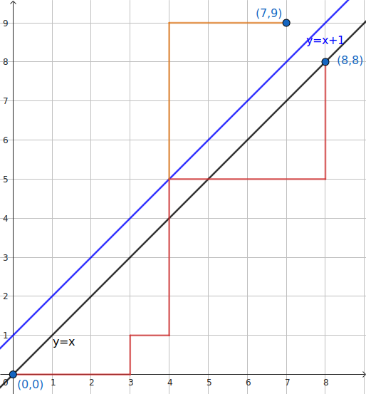

## 介绍

**卡特兰数**（Catalan number）是由数学家比利时数学家欧仁·查理·卡特兰（Eugène Charles Catalan）的于 1958 年提出的，因此命名为 **卡特兰数**，其递推式为：

$$
C_n = \begin{cases}
\sum_{i=1}^{n} C_{i-1} C_{n-i} & n \geq 2, n \in \mathbf{N_{+}}\\
1 & n = 0, 1
\end{cases}
$$

数列的前几项：

    1,1,2,5,13,42,132,429,1430,...

## 封闭形式

卡特兰数的递推式为：

$$
C_n=\sum_{i=0}^{n-1}C_{i}C_{n-i-1} \quad (n\ge 2)
$$

其中 $C_0=1,C_1=1$。设它的普通生成函数为 $C(x)$。

我们发现卡特兰数的递推式与卷积的形式很相似，因此我们用卷积来构造关于 $C(x)$ 的方程：

$$
\begin{aligned}
C(x)&=\sum_{n\ge 0}C_nx^n\\
&=1+\sum_{n\ge 1}\sum_{i=0}^{n-1}C_ix^iC_{n-i-1}x^{n-i-1}x\\
&=1+x\sum_{i\ge 0}C_{i}x^i\sum_{n\ge 0}C_{n}x^{n}\\
&=1+xC^2(x)
\end{aligned}
$$

解得：

$$
C(x)=\frac{1\pm \sqrt{1-4x}}{2x}
$$

那么这就产生了一个问题：我们应该取哪一个根呢？我们将其分子有理化：

$$
C(x)=\frac{2}{1\mp \sqrt{1-4x}}
$$

代入 $x=0$，我们得到的是 $C(x)$ 的常数项，也就是 $C_0$。当 $C(x)=\dfrac{2}{1+\sqrt{1-4x}}$ 的时候有 $C(0)=1$，满足要求。而另一个解会出现分母为 $0$ 的情况（不收敛），舍弃。

因此我们得到了卡特兰数生成函数的封闭形式：

$$
C(x)=\frac{1- \sqrt{1-4x}}{2x}
$$

接下来我们要将其展开。但注意到它的分母不是斐波那契数列那样的多项式形式，因此不方便套用等比数列的展开形式。在这里我们需要使用牛顿二项式定理。我们来先展开 $\sqrt{1-4x}$：

$$
\begin{aligned}
(1-4x)^{\frac{1}{2}}
&=\sum_{n\ge 0}\binom{\frac{1}{2}}{n}(-4x)^n\\
&=1+\sum_{n\ge 1}\frac{\left(\frac{1}{2}\right)^{\underline{n}}}{n!}(-4x)^n
\end{aligned} \tag{1}
$$

注意到：

$$
\begin{aligned}
\left(\frac{1}{2}\right)^{\underline{n}}
&=\frac{1}{2}\frac{-1}{2}\frac{-3}{2}\cdots\frac{-(2n-3)}{2}\\
&=\frac{(-1)^{n-1}(2n-3)!!}{2^n}\\
&=\frac{(-1)^{n-1}(2n-2)!}{2^n(2n-2)!!}\\
&=\frac{(-1)^{n-1}(2n-2)!}{2^{2n-1}(n-1)!}
\end{aligned}
$$

这里使用了双阶乘的化简技巧。那么带回 $(1)$ 得到：

$$
\begin{aligned}
(1-4x)^{\frac{1}{2}}
&=1+\sum_{n\ge 1}\frac{(-1)^{n-1}(2n-2)!}{2^{2n-1}(n-1)!n!}(-4x)^n\\
&=1-\sum_{n\ge 1}\frac{(2n-2)!}{(n-1)!n!}2x^n\\
&=1-\sum_{n\ge 1}\binom{2n-1}{n}\frac{1}{(2n-1)}2x^n
\end{aligned}
$$

带回原式得到：

$$
\begin{aligned}
C(x)&=\frac{1- \sqrt{1-4x}}{2x}\\
&=\frac{1}{2x}\sum_{n\ge 1}\binom{2n-1}{n}\frac{1}{(2n-1)}2x^n\\
&=\sum_{n\ge 1}\binom{2n-1}{n}\frac{1}{(2n-1)}x^{n-1}\\
&=\sum_{n\ge 0}\binom{2n+1}{n+1}\frac{1}{(2n+1)}x^{n}\\
&=\sum_{n\ge 0}\binom{2n}{n}\frac{1}{n+1}x^{n}\\
\end{aligned}
$$

这样我们就得到了卡特兰数的通项公式，即：

$$
C_n = \frac{1}{n+1}\binom{2n}{n}
$$

## 常见形式

$$
\begin{align}
C_n &= \frac{1}{n+1}\binom{2n}{n}(n \geq 2, n \in \mathbf{N_{+}}) \\
&= \binom{2n}{n} - \binom{2n}{n-1} \\
&= \frac{C_{n-1} (4n-2)}{n+1}
\end{align}
$$

接下来我们证明这三种形式是等价的：

??? note "证明形式 2"
    $$
    \begin{align*}
    C_n &= \binom{2n}{n} - \binom{2n}{n-1} \\
    &= \frac{(2n)!}{n!n!} - \frac{(2n)!}{(n-1)!(n+1)!} \\
    &= \frac{(2n)!}{n!n!}(1 - \frac{n!}{(n-1)!(n+1)}) \\
    &= \frac{(2n)!}{n!n!}(1- \frac{n}{n+1}) \\
    &= \frac{\binom{2n}{n}}{n+1}
    \end{align*}
    $$

??? note "证明形式 3"
    展开原式：
    
    $$
    \begin{align*}
    \frac{C_{n-1} (4n-2)}{n+1} &= \frac{1}{n+1} \cdot \frac{1}{n}\binom{2n-2}{n-1}(4n-2)\\
    &= \frac{2(2n-1)}{n(n+1)}\binom{2n-2}{n-1}
    \end{align*}
    $$
    
    因为：
    
    $$
    \binom{2n}{n} = \frac{2(2n-1)}{n}\binom{2n-2}{n-1}
    $$
    
    因此：
    
    $$
    \binom{2n-2}{n-1} = \frac{n}{2(2n-1)}\binom{2n}{n}
    $$
    
    带回原式：
    
    $$
    \begin{align*}
    \frac{2(2n-1)}{n(n+1)}\binom{2n-2}{n-1} &= \frac{2(2n-1)}{n(n+1)}\frac{n}{2(2n-1)}\binom{2n}{n} \\
    &=  \frac{1}{n+1}\binom{2n}{n}
    \end{align*}
    $$

## 应用

Catalan 数列 $C_n$ 可以应用于以下问题：

1.  有一个大小为 $n\times n$ 的方格图左下角为 $(0, 0)$ 右上角为 $(n, n)$，从左下角开始每次都只能向右或者向上走一单位，不走到对角线 $y=x$ 上方（但可以触碰）的情况下到达右上角有多少可能的路径？
2.  在圆上选择 $2n$ 个点，将这些点成对连接起来使得所得到的 $n$ 条线段不相交的方法数？
3.  $n$ 个结点可构造多少个不同的二叉树？
4.  对角线不相交的情况下，将一个凸多边形区域分成三角形区域的方法数？
5.  由 $n$ 对括号构成的合法括号序列数。
6.  一个栈（无穷大）的进栈序列为 $1,2,3, \cdots ,n$ 有多少个不同的出栈序列？
7.  由 $n$ 个 $+1$ 和 $n$ 个 $-1$ 组成的 $2n$ 个数 $a_1,a_2, \cdots ,a_{2n}$，其部分和满足 $a_1+a_2+ \cdots +a_k \geq 0~(k=1,2,3, \cdots ,2n)$，有多少个满足条件的数列？

接下来，我们将证明这些问题的答案都与 Catalan 数列有关。

### 问题一：路径计数问题

转换问题，我们用总路径数减去不合法的路径数。

总路径数一共要走 $2n$ 步，其中 $n$ 步向右，所以方案数为 $\binom{2n}{n}$。

一条路径不合法，当且仅当它碰到了直线 $y = x+1$。

对于任意一条非法路径，我们找到第一次碰到直线 $y = x+1$ 的位置，并将该位置之后的路径关于直线 $y=x+1$ 做对称。

这时我们发现，一条从 $(0,0)$ 到 $(n,n)$ 的非法路径，变成了一条从 $(0,0)$ 到 $(n-1,n+1)$ 的路径。



同总路径数的计算，不合法路径数为 $\binom{2n}{n-1}$。

因此答案为 $C_n = \binom{2n}{n} - \binom{2n}{n-1}$。

### 问题二：圆上两点连接问题

记 $2n$ 个点的方案数为 $T_n$。

我们将 $2n$ 个点按顺时针标号，分别为 $1,2,\cdots,2n$。

如果连接了 $1$ 和 $2k(k\in[1,n])$，那么左边有 $2k-2$ 个点，右边有 $2n-2k$ 个点。

乘法原理，方案数为 $C_{k-1} \cdot C_{n-k}$。

因此 $T_n = \sum_{k=1}^n T_{k-1} \cdot T_{n-k}$，即 Catalan 数列的递推式。

所以 $T_n = C_n$。

### 问题三：二叉树计数问题

记 $n$ 个结点的二叉树的方案数为 $T_n$。

令现在仅有一个根节点，接下来放入 $n-1$ 个节点。

设给左子树 $i$ 个点，则右子树要放入 $n-i-1$ 个点。

类似问题二，乘法原理，方案数为 $T_i \cdot T_{n-i-1}$。

因此 $T_n = \sum_{i=0}^{n-1} T_i \cdot T_{n-i-1} = C_n$。

### 问题四：三角剖分

先选定一条边 $(1,n)$ 作为基边，它一定属于一个三角形，记该三角形的第三个点为 $k(k\in[2,n-1])$。

这样，原凸多边形变成了三个部分：

-   三角形 $(1,k,n)$。
-   $k$ 边形，顶点 $1\sim k$。
-   $n-k+1$ 边形，顶点 $k\sim n$。

类似问题二，第二、三个部分都是子问题，记 $n$ 边形三角剖分的方案数为 $T_n$，则：

$$
T_3 = 1\\
T_n = \sum_{k=2}^{n-1} T_{k} \cdot T_{n-k+1}
$$

联系 Catalan 数列的递推式，得到 $T_n = C_{n-2}$。

### 问题五：括号计数问题

联系问题一。

将左括号视为向上走，右括号视为向右走。

合法括号序列即为，在任意位置，左括号的数量不少于右括号的数量。

相当于问题一，在任意时刻，向上走的次数不少于向右走的次数。

那么两个问题是 **双射** 的，答案即为 $C_n$。

### 问题六：栈问题

将 **入栈** 视为 **左括号**，**出栈** 视为 **右括号**。

任意时刻，入栈的次数不少于出栈的次数。

即与问题五是 **双射** 的，答案即为 $C_n$。

### 问题七：部分和问题

将 $+1$ 视为 **左括号**，$-1$ 视为 **右括号**。

任意时刻，$+1$ 的数量不少于 $-1$ 的数量。

即与问题五是 **双射** 的，答案即为 $C_n$。

## 例题

??? note " 例题 [洛谷 P1044 栈](https://www.luogu.com.cn/problem/P1044)"
    题目大意：入栈顺序为 $1,2,\ldots ,n$，求所有可能的出栈顺序的总数。

=== "C++"
    ```cpp
    #include <iostream>
    using namespace std;
    int n;
    long long f[25];
    
    int main() {
      f[0] = 1;
      cin >> n;
      for (int i = 1; i <= n; i++) f[i] = f[i - 1] * (4 * i - 2) / (i + 1);
      // 这里用的是常见形式2
      cout << f[n] << endl;
      return 0;
    }
    ```

=== "Python"
    ```python
    f = [0] * 25
    f[0] = 1
    n = int(input())
    for i in range(1, n + 1):
        f[i] = int(f[i - 1] * (4 * i - 2) // (i + 1))
        # 这里用的是常见形式3
    print(f[n])
    ```
