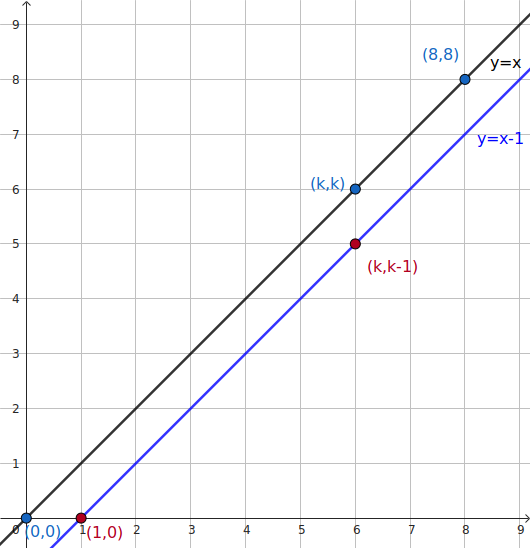

## 引入

**卡特兰数**（Catalan number）是由比利时数学家 Eugène Charles Catalan 于 1958 年提出的。它满足如下递推关系：

$$
\begin{align}
C_n = \begin{cases}
1, & n = 0, \\
\sum_{i=0}^{n-1} C_{i}C_{n-1-i}, & n > 0.
\end{cases}
\end{align}
$$

数列的前几项为：（下标从 $0$ 开始，OEIS:[A000108](https://oeis.org/A000108)）

$$
1,1,2,5,13,42,132,429,1430,\ldots
$$

## 应用

Catalan 数 $C_n$ 的递推关系有着天然的递归结构：规模为 $n$ 的计数问题 $C_n$，可以通过枚举分界点，分拆为两个规模分别为 $i$ 和 $(n-1-i)$ 的子问题。这一递推关系使得 Catalan 数广泛出现于各类具有类似递归结构的问题中：

1.  <a id="path-counting"></a>**路径计数问题**：有一个大小为 $n\times n$ 的方格图，左下角为 $(0, 0)$，右上角为 $(n, n)$。从左下角开始，每次都只能向右或者向上走一单位，不走到对角线 $y=x$ 上方（但可以触碰）的情况下到达右上角的路径总数为 $C_n$。

    ??? note "证明"
        设方案数为 $T_n$。考虑 $n \ge 2$ 的情况。设路径 **第一次** 走到对角线 $y=x$ 的点是 $(k,k)~(k \in [1,n])$。考察从 $(0,0)$ 到 $(k,k)$ 的除起点和终点外，中间的点 **不经过对角线（不能碰到）** 的路径。
        
        
        
        如图所示，这些路径的第一步一定向右，从 $(0,0)$ 到 $(1,0)$；最后一步一定向上，从 $(k,k-1)$ 到 $(k,k)$。因此，这些路径就是从 $(1,0)$ 到 $(k,k-1)$ 的不越过直线 $y=x-1$ 的路径，这样路径的数目就是 $T_{k-1}$。同时，从 $(k,k)$ 到 $(n,n)$ 的合法路径数就是 $T_{n-k}$。根据乘法原理，第一次在 $(k,k)$ 处触碰对角线的路径数目为 $T_{k-1} T_{n-k}$。枚举 $k$ 的所有可能性，所有合法路径的数目为
        
        $$
        T_n = \sum_{k=1}^n T_{k-1}T_{n-k}
        $$
        
        做代换 $k=i+1$ 就可以发现，这就是 Catalan 数的递推关系。由 $T_0=1$ 可知 $T_n = C_n$。
2.  **圆内不相交弦计数问题**：圆上有 $2n$ 个点，将这些点成对连接起来使得所得到的 $n$ 条线段两两不交的方案数是 $C_n$。

    ??? note "证明"
        记 $2n$ 个点的方案数为 $T_n$。将 $2n$ 个点按顺时针标号，分别为 $1,2,\ldots,2n$。由于弦两两不交，$1$ 号点只能连接偶数号点；否则，两点之间的奇数个点无法在不穿过两点连线的情况下两两配对。如果连接了 $1$ 和 $2k~(k\in[1,n])$，那么左边有 $2k-2$ 个点，右边有 $2n-2k$ 个点，由乘法原理，这样的方案数为 $T_{k-1}T_{n-k}$。因此，枚举 $k$，有 $T_n = \sum_{k=1}^n T_{k-1} T_{n-k}$。令 $k=i+1$，就得到 Catalan 数的递推关系。由 $T_0=1$ 可知 $T_n=C_n$。
3.  **三角剖分计数问题**：对角线不相交的情况下，将一个凸 $(n+2)$ 边形区域分成三角形区域的方法数为 $C_n$。

    ??? note "证明"
        设 $(n+2)$ 边形三角剖分的方案数为 $T_n$。先选定一条边 $(1,n+2)$ 作为基边，它一定属于一个三角形，记该三角形的第三个点为 $k~(k\in[2,n+1])$。这样，原凸多边形变成了三个部分：
        
        -   三角形 $(1,k,n+2)$。
        -   $k$ 边形，顶点 $1\sim k$。
        -   $(n+3-k)$ 边形，顶点 $k\sim (n+2)$。
        
        后面两个部分都是子问题，所以，有递推关系
        
        $$
        T_n = \sum_{k=2}^{n+1} T_{k-2}T_{n+1-k}.
        $$
        
        令 $k=i+2$，就得到 Catalan 数递归关系。由 $T_0=T_1=1$ 可知 $T_n=C_n$。
4.  **二叉树计数问题**：$n$ 个结点可构造的形态不同的二叉树数目为 $C_n$。

    ??? note "证明"
        记 $n$ 个结点的二叉树数目为 $T_n$。任取一个根结点，枚举左右子树大小。设左子树大小为 $i\in[0,n-1]$，则右子树大小为 $(n-1-i)$。左右子树均为子问题，所以，有递推关系
        
        $$
        T_n = \sum_{i=0}^{n-1}T_iT_{n-1-i}.
        $$
        
        这就是 Catalan 数递推关系。由 $T_0=T_1=1$ 可知 $T_n=C_n$。
5.  **括号序列计数问题**：由 $n$ 对括号构成的合法括号序列数为 $C_n$。

    ??? note "证明"
        联系路径计数问题。将左括号视为向上走，右括号视为向右走。合法括号序列即为，在任意位置，左括号的数量不少于右括号的数量。相当于路径计数问题中，在任意时刻，向上走的次数不少于向右走的次数。因此，合法括号序列与合法路径之间存在双射。合法括号序列的数目同样为 $C_n$。
6.  **出栈序列计数问题**：一个栈（无穷大）的进栈序列为 $1,2,3, \ldots ,n$，合法出栈序列的数目为 $C_n$。

    ??? note "证明"
        联系括号序列计数问题。将入栈视为左括号，出栈视为右括号。任意时刻，入栈的次数不少于出栈的次数。因此，合法出栈序列与合法括号序列之间存在双射。合法出栈序列的数目同样为 $C_n$。
7.  **数列计数问题**：由 $n$ 个 $+1$ 和 $n$ 个 $-1$ 组成的 $2n$ 个数 $a_1,a_2, \ldots ,a_{2n}$，其部分和满足 $a_1+a_2+ \ldots +a_k \geq 0~(k=1,2,3, \ldots ,2n)$，满足条件的数列数目为 $C_n$。

    ??? note "证明"
        联系括号序列计数问题。将 $+1$ 视为左括号，$-1$ 视为右括号。任意时刻，$+1$ 的数量不少于 $-1$ 的数量。因此，合法数列与合法括号序列之间存在双射。合法数列的数目同样为 $C_n$。

尽管这一递推关系应用广泛，但是直接计算复杂度较高，需要寻找更为简单的公式。

## 常见形式

Catalan 数有如下常见的表达式或递推关系式：

$$
\begin{align}
C_n &= \frac{1}{n+1}\binom{2n}{n} = \dfrac{(2n)!}{n!(n+1)!},~ n\ge 0. \\
C_n &= \binom{2n}{n} - \binom{2n}{n+1},~n \ge 0. \\
C_n &= \frac{(4n-2)}{n+1}C_{n-1},~ n > 0,~ C_0 = 1.
\end{align}
$$

Catalan 数的这些形式都可以高效计算：前两个形式将它转换为阶乘和组合数的计算问题，第三个形式则提供了顺次计算的递推公式。

对于这三种常见形式，本文提供两种证明方式。

### 代数推演

通过代数方法得出 Catalan 数的上述表达式分为两步。首先，验证三个形式相互等价。

??? note " 证明形式 $(2)\sim(4)$ 等价 "
    只需要证明形式 $(3)$ 可以转化为形式 $(2)$ 中阶乘形式：
    
    $$
    \begin{aligned}
    C_n &= \binom{2n}{n} - \binom{2n}{n-1} \\
    &= \frac{(2n)!}{n!n!} - \frac{(2n)!}{(n-1)!(n+1)!} \\
    &= \frac{(2n)!}{n!n!}\left(1 - \frac{n!}{(n-1)!(n+1)}\right) \\
    &= \frac{(2n)!}{n!n!}\left(1- \frac{n}{n+1}\right) \\
    &= \dfrac{(2n)!}{n!(n+1)!}.
    \end{aligned}
    $$
    
    以及，形式 $(4)$ 也可以转化为形式 $(2)$ 中阶乘形式：
    
    $$
    \begin{aligned}
    C_n &= \prod_{i=1}^n\frac{(4i-2)}{i+1} \\
    &= \prod_{i=1}^n\frac{2i(2i-1)}{i(i+1)} \\
    &= \dfrac{(2n)!}{n!(n+1)!}.
    \end{aligned}
    $$
    
    因此，三个形式互相等价。

紧接着，验证这些形式确实是 Catalan 数递推公式的解。为此，考虑使用生成函数方法直接求出递推公式 $(1)$ 的解。

??? note " 利用生成函数方法求解递推公式 $(1)$"
    考虑 Catalan 数的普通生成函数 $C(x)=\sum_{n=0}^{\infty}C_nx^n$。由于 Catalan 数的递推关系和卷积形式很相似，所以考虑用卷积构造 $C(x)$ 的方程：
    
    $$
    \begin{aligned}
    C(x)&=\sum_{n=0}^{\infty}C_nx^n\\
    &=1+\sum_{n=1}^{\infty}\left(\sum_{i=0}^{n-1}C_iC_{n-i-1}\right)x^{n}\\
    &=1+x\sum_{n=1}^{\infty}\sum_{i=0}^{n-1}C_ix^iC_{n-i-1}x^{n-i-1}\\
    &=1+x\sum_{i=0}^{\infty}C_ix^i\sum_{j=0}^{\infty}C_jx^j\\
    &=1+xC^2(x).
    \end{aligned}
    $$
    
    其中，倒数第二个等号交换了求和次序，并令 $j=n-1-i$。由此，解得：
    
    $$
    C(x)=\dfrac{1\pm \sqrt{1-4x}}{2x} = \frac{2}{1\mp \sqrt{1-4x}}.
    $$
    
    由初值条件 $C_0=1$ 可知，$C(0)=1$。代入检验可以发现唯一可行的解就是
    
    $$
    C(x) = \dfrac{1- \sqrt{1-4x}}{2x}.
    $$
    
    接下来，需要将它展开为幂级数的形式。利用 $(1+x)^a$ 的 [幂级数展开式](../poly/intro.md#常见的幂级数展开式) 可知：
    
    $$
    \sqrt{1-4x} = \sum_{n=0}^{\infty} \dfrac{\left(\frac{1}{2}\right)^{\underline{n}}}{n!}(-4x)^n,
    $$
    
    其中，$\left(\dfrac{1}{2}\right)^{\underline{n}}$ 是下降阶乘幂：
    
    $$
    \begin{aligned}
    \left(\frac{1}{2}\right)^{\underline{n}} &= \prod_{k=0}^{n-1}\left(\dfrac{1}{2}-k\right) = \dfrac{1}{2^n}\prod_{k=1}^{n-1}(1-2k) = \dfrac{(-1)^{n-1}}{2^n}\prod_{k=1}^{n-1}(2k-1)\\
    &= \dfrac{(-1)^{n-1}}{2^{2n-1}}\prod_{k=1}^{n-1}\dfrac{(2k-1)2k}{k} = \dfrac{(-1)^{n-1}}{2^{2n-1}}\dfrac{(2n-2)!}{(n-1)!}.
    \end{aligned}
    $$
    
    代入 $C(x)$ 的表达式，就有
    
    $$
    \begin{aligned}
    C(x) &= \dfrac{1}{2x}\left(1-\sum_{n=0}^{\infty} \dfrac{\left(\frac{1}{2}\right)^{\underline{n}}}{n!}(-4x)^n\right)\\
    &= -\dfrac{1}{2x}\sum_{n=1}^\infty \dfrac{(-4x)^n}{n!}\left(\dfrac{1}{2}\right)^{\underline{n}} \\
    &= -\dfrac{1}{2x}\sum_{n=1}^\infty \dfrac{(-4x)^n}{n!}\dfrac{(-1)^{n-1}}{2^{2n-1}}\dfrac{(2n-2)!}{(n-1)!} \\
    &= \sum_{n=1}^{\infty}\dfrac{(2n-2)!}{(n-1)!n!}x^{n-1}\\
    &= \sum_{n=0}^{\infty}\dfrac{(2n)!}{n!(n+1)!}x^n.
    \end{aligned}
    $$
    
    由此，就得到 $C_n$ 的形式 $(2)$。

### 组合意义

由于 Catalan 数具有明显的组合意义，所以只使用组合计数方法同样可以证明这些形式。本节为三个形式分别提供一个组合意义的证明。

??? note " 形式 $(2)$ 的证明 "
    待补。

??? note " 形式 $(3)$ 的证明 "
    考虑 [路径计数问题](#path-counting)。这是典型的格路计数问题，可以通过反射原理求解。具体到本问题，考虑用总路径数目减去不合法的路径数目。总路径数一共要走 $2n$ 步，其中 $n$ 步向右，所以方案数为 $\binom{2n}{n}$。一条路径不合法，当且仅当它碰到了直线 $y = x+1$。对于任意一条非法路径，我们找到第一次碰到直线 $y = x+1$ 的位置，并将该位置之后的路径关于直线 $y=x+1$ 做对称。此时，可以发现，一条从 $(0,0)$ 到 $(n,n)$ 的非法路径，变成了一条从 $(0,0)$ 到 $(n-1,n+1)$ 的路径。
    
    
    
    由于从 $(0,0)$ 到 $(n-1,n+1)$ 的路径必定要穿过直线 $y = x+1$，所以每条这样的路径都对应一条从 $(0,0)$ 到 $(n,n)$ 的非法路径。类似总路径数的计算，非法路径数目的总数就是 $\binom{2n}{n+1}$。因此，合法路径的总数为
    
    $$
    C_n = \binom{2n}{n} - \binom{2n}{n+1}.
    $$
    
    这就是形式 $(3)$。

??? note " 形式 $(4)$ 的证明 "
    待补。

## 例题

???+ example "[洛谷 P1044 栈](https://www.luogu.com.cn/problem/P1044)"
    入栈顺序为 $1,2,\ldots ,n$，求所有可能的出栈顺序的总数。

??? note "参考代码"
    === "C++"
        ```cpp
        --8<-- "docs/math/code/combinatorics/catalan/catalan_1.cpp"
        ```
    
    === "Python"
        ```python
        --8<-- "docs/math/code/combinatorics/catalan/catalan_1.py"
        ```

## 参考资料与注释

-   [Catalan number - Wikipedia](https://en.wikipedia.org/wiki/Catalan_number)
