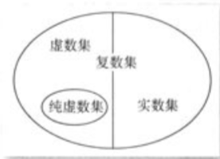

如果您已经学习过复数相关知识，请跳过本页面。

学习复数知识需要一部分向量基础，如果并未学习过向量知识请移步 [向量页面](../math/vector.md)。

## 复数的引入，定义和分类

### 复数的引入

注：下面的引入方法来自人教版高中数学 A 版必修二。

从方程的角度看，负实数能不能开平方，就是方程 $x^2+a=0 (a>0)$ 有没有解，进而可以归结为方程 $x^2+1=0$ 有没有解。

回顾已有的数集扩充过程，可以看到，每次扩充都与实际需求密切相关。例如，为了解决正方形对角线的度量，以及 $x^2-2=0$ 这样的方程在有理数集中无解的问题，人们把有理数集扩充到了实数集。数集扩充后，在实数集中规定的加法运算、乘法运算，与原来在有理数集中规定的加法运算、乘法运算协调一致，并且加法和乘法都满足交换律和结合律，乘法对加法满足分配律。

依照这种思想，为了解决 $x^2+1=0$ 这样的方程在实数系中无解的问题，我们设想引入一个新数 $\text{i}$，使得 $x=\text{i}$ 是方程 $x^2+1=0$ 的解，即使得 $\text{i}^2=-1$。

思考：把新引进的数 $\text{i}$ 添加到实数集中，我们希望数 $\text{i}$ 和实数之间仍然能像实数那样进行加法和乘法运算，并希望加法和乘法都满足交换律、结合律，以及乘法对加法满足分配律。那么，实数系经过扩充后，得到的新数系由哪些数组成呢？

依照以上设想，把实数 $b$ 与 $\text{i}$ 相乘，结果记作 $b\text{i}$；把实数 $a$ 与 $b\text{i}$ 相加，结果记作 $a+b\text{i}$。注意到所有实数以及 $\text{i}$ 都可以写成 $a+b\text{i}(a,b\in \mathbb{R})$ 的形式，从而这些数都在扩充后的新数集中。

### 复数的定义和分类

> 哇哦我们定义的数的性质这么好！

我们定义形如 $a+b\text{i}$，其中 $a,b\in \mathbb{R}$ 的数叫做 **复数**，其中 $\text{i}$ 被称为 **虚数单位**，全体复数的集合叫做 **复数集**。

复数通常用 $z$ 表示，即 $z=a+b\text{i}$。这种形式被称为 **复数的代数形式**。其中 $a$ 称为复数 $z$ 的 **实部**，$b$ 称为复数 $z$ 的 **虚部**。如无特殊说明，都有 $a,b\in \mathbb{R}$。

对于一个复数 $z$，当且仅当 $b=0$ 时，它是实数，当 $b\not = 0$ 时，它是虚数，当 $a=0$ 且 $b\not = 0$ 时，它是纯虚数。

纯虚数，虚数，实数，复数的关系如下图所示。

图片来自：人教版高中数学 A 
版选修 2-2 第 103 页

## 复数的性质与运算

### 复数的几何意义

我们知道了 $a+b\text{i}$ 这样类似的形式的数被称为复数，并且给出了定义和分类，我们还可以挖掘一下更深层的性质。

我们把所有实数都放在了数轴上，并且发现数轴上的点与实数一一对应。我们考虑对复数也这样处理。

首先我们定义 **复数相等**：两个复数 $z_1=a+b\text{i},z_2=c+d\text{i}$ 是相等的，当且仅当 $a=c$ 且 $b=d$。

这么定义是十分自然的，在此不做过多解释。

也就是说，我们可以用唯一的有序实数对 $(a,b)$ 表示一个复数 $z=a+b\text{i}$。这样，联想到平面直角坐标系，我们可以发现 **复数集与平面直角坐标系中的点集一一对应**。好了，我们找到了复数的一种几何意义。

那么这个平面直角坐标系就不再一般，因为平面直角坐标系中的点具有了特殊意义——表示一个复数，所以我们把这样的平面直角坐标系称为 **复平面**，$x$ 轴称为 **实轴**，$y$ 轴称为 **虚轴**。我们进一步地说：**复数集与复平面内所有的点所构成的集合是一一对应的**。

我们考虑到学过的平面向量的知识，发现向量的坐标表示也是一个有序实数对 $(a,b)$，显然，复数 $z=a+b\text{i}$ 对应复平面内的点 $Z(a,b)$，那么它还对应平面向量 $\overrightarrow{OZ}=(a,b)$，于是我们又找到了复数的另一种几何意义：**复数集与复平面内的向量所构成的集合是一一对应的（实数 $0$ 与零向量对应）**。

于是，我们由向量的知识迁移到复数上来，定义 **复数的模** 就是复数所对应的向量的模。复数 $z=a+b\text{i}$ 的模 $|z|=\sqrt{a^2+b^2}$。

于是为了方便，我们常把复数 $z=a+b\text{i}$ 称为点 $Z$ 或向量 $\overrightarrow {OZ}$，并规定相等的向量表示同一个复数。

并且由向量的知识我们发现，虚数不可以比较大小（但是实数是可以的）。

### 复数的运算

#### 复数的加法与减法

我们规定，复数的加法规则如下：

设 $z_1=a+b\text{i},z_2=c+d\text{i}$，那么

$$
z_1+z_2=(a+c)+(b+d)\text{i}
$$

很明显，两个复数的和仍为复数。

考虑到向量的加法运算，我们发现复数的加法运算符合向量的加法运算法则，这同样证明了复数的几何意义的正确性。

同样可以验证，**复数的加法满足交换律和结合律**。即：

$$
z_1+z_2=z_2+z_1\\
(z_1+z_2)+z_3=z_1+(z_2+z_3)
$$

减法作为加法的逆运算，我们可以通过加法法则与复数相等的定义来推导出减法法则：

$$
z_1-z_2=(a-c)+(b-d)\text{i}
$$

这同样符合向量的减法运算。

#### 复数的乘法与除法

我们规定，复数的乘法规则如下：

设 $z_1=a+b\text{i},z_2=c+d\text{i}$，那么

$$
\begin{aligned}
z_1z_2&=(a+b\text{i})(c+d\text{i})\\
&=ac+bc\text{i}+ad\text{i}+bd\text{i}^2\\
&=(ac-bd)+(bc+ad)\text{i}
\end{aligned}
$$

可以看出，两个复数相乘类似于两个多项式相乘，只需要把 $\text{i}^2$ 换成 $-1$，并将实部与虚部分别合并即可。

复数确实与多项式有关，因为复数域是实系数多项式环模掉 $x^2+1$ 生成的理想。（这句话不明白其实也没有关系）

复数的乘法与向量的向量积形式类似，是由于复数集是数环。

于是容易知道，**复数乘法满足交换律，结合律和对加法的分配律**，即：

$$
z_1z_2=z_2z_1\\
(z_1z_2)z_3=z_1(z_2z_3)\\
z_1(z_2+z_3)=z_1z_2+z_1z_3
$$

由于满足运算律，我们可以发现实数域中的 **乘法公式在复数域中同样适用**。

除法运算是乘法运算的逆运算，我们可以推导一下：

$$
\begin{aligned}
\frac{a+b\text{i}}{c+d\text{i}}&=\frac{(a+b\text{i})(c-d\text{i})}{(c+d\text{i})(c-d\text{i})}\\
&=\frac{ac+bd}{c^2+d^2}+\frac{bc-ad}{c^2+d^2}\text{i} &(c+d\text{i}\not =0)
\end{aligned}
$$

为了分母实数化，我们乘了一个 $c-d\text{i}$，这个式子很有意义。

我们定义，当两个虚数实部相等，虚部互为相反数时，这两个复数互为 **共轭复数**。通常记 $z=a+b\text{i}$ 的共轭复数为 $\bar z=a-b\text{i}$。我们可以发现，两个复数互为共轭复数，那么它们 **关于实轴对称**。

由于向量没有除法，这里不讨论与向量的关系。
