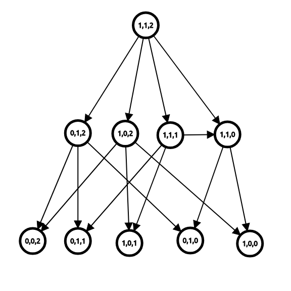

author: cutekibry, zj713300, tinjyu

**博弈论**，是经济学的一个分支，主要研究具有竞争或对抗性质的对象，在一定规则下产生的各种行为。博弈论考虑游戏中的个体的预测行为和实际行为，并研究它们的优化策略。

通俗地讲，博弈论主要研究的是：在一个游戏中，进行游戏的多位玩家的策略。

## 公平组合游戏

公平组合游戏的定义如下：

- 游戏有两个人参与，二者轮流做出决策，双方均知道游戏的完整信息；

- 任意一个游戏者在某一确定状态可以作出的决策集合只与当前的状态有关，而与游戏者无关；

- 游戏中的同一个状态不可能多次抵达，游戏以玩家无法行动为结束，且游戏一定会在有限步后以非平局结束。

大部分的棋类游戏都 **不是** 公平组合游戏，如国际象棋、中国象棋、围棋、五子棋等（因为双方都不能使用对方的棋子）。

## Nim 游戏

$n$ 堆物品，每堆有 $a_i$ 个，两个玩家轮流取走任意一堆的任意个物品，但不能不取。

取走最后一个物品的人获胜。

例如，如果现在有 $n=3$ 堆物品，而每堆分别有 $2, 5, 4$ 个，那么可以取走第 $1$ 堆中的 $2$ 个物品，局面就变成了 $0, 5, 4$；或者也可以取走第 $2$ 堆的 $4$ 个物品，局面就变成了 $2, 1, 4$。

如果现在的局面为 $0, 0, 5$，甲取走了第 $3$ 堆的 $5$ 个物品，也就是取走了最后一个物品，此时甲获胜。

## 博弈图和状态

如果将每个状态视为一个节点，再从每个状态向它的后继状态连边，我们就可以得到一个博弈状态图。

例如，如果节点 $(i, j, k)$ 表示局面为 $i, j, k$ 时的状态，则我们可以画出下面的博弈图（由于篇幅有限，故仅显示部分状态节点和部分边）：

定义 **必胜状态** 为 **先手必胜的状态**，**必败状态** 为 **先手必败的状态**。

通过推理，我们可以得出下面三条定理：

- 定理 1：没有后继状态的状态是必败状态。
- 定理 2：一个状态是必胜状态当且仅当存在至少一个必败状态为它的后继状态。
- 定理 3：一个状态是必败状态当且仅当它的所有后继状态均为必胜状态。

对于定理 1，如果游戏进行不下去了，那么这个玩家就输掉了游戏。

对于定理 2，如果该状态至少有一个后继状态为必败状态，那么玩家可以通过操作到该必败状态；此时对手的状态为必败状态——对手必定是失败的，而相反地，自己就获得了胜利。

对于定理 3，如果不存在一个后继状态为必败状态，那么无论如何，玩家只能操作到必胜状态；此时对手的状态为必胜状态——对手必定是胜利的，自己就输掉了游戏。

如果博弈图是一个有向无环图，则通过这三个定理，我们可以在绘出博弈图的情况下用 $O(N+M)$ 的时间（其中 $N$ 为状态种数，$M$ 为边数）得出每个状态是必胜状态还是必败状态。

## Nim 和

让我们再次回顾 Nim 游戏。

通过绘画博弈图，我们可以在 $O(\prod_{i=1}^n a_i)$ 的时间里求出该局面是否先手必赢。

但是，这样的时间复杂度实在太高。有没有什么巧妙而快速的方法呢？

定义 Nim 和 $=a_1 \oplus a_2 \oplus \ldots \oplus a_n$。

当且仅当 Nim 和为 $0$ 时，该状态为必败状态；否则该状态为必胜状态。

### 证明

为什么异或值会和状态的胜负有关？下面给出了这个定理的证明过程。

为了证明该定理，只需要证明下面三个定理：

- 定理 1：没有后继状态的状态是必败状态。
- 定理 2：对于 $a_1 \oplus a_2 \oplus \ldots \oplus a_n \neq 0$ 的局面，一定存在某种移动使得 $a_1 \oplus a_2 \oplus \ldots \oplus a_n = 0$。
- 定理 3：对于 $a_1 \oplus a_2 \oplus \ldots \oplus a_n = 0$ 的局面，一定不存在某种移动使得 $a_1 \oplus a_2 \oplus \ldots \oplus a_n = 0$。

对于定理 1，没有后继状态的状态只有一个，即全 $0$ 局面。此时 $a_1 \oplus a_2 \oplus \ldots \oplus a_n = 0$。

对于定理 2，不妨假设 $a_1 \oplus a_2 \oplus \ldots a_n = k \neq 0$。如果我们要将 $a_i$ 改为 $a_i'$，则 $a_i'=a_i \oplus k$。

根据异或定义，一定有奇数个 $a_i$ 在 $k$ 在二进制下的最高位为 $1$。满足这个条件的 $a_i$ 一定也满足 $a_i > a_i \oplus k$，因而这也是个合法的移动。

对于定理 3，如果我们要将 $a_i$ 改为 $a_i'$，则根据异或运算律可以得出 $a_i=a_i'$，因而这不是个合法的移动。

## 有向图游戏与 SG 函数

有向图游戏是一个经典的博弈游戏——实际上，大部分的公平组合游戏都可以转换为有向图游戏。

在一个有向无环图中，只有一个起点，上面有一个棋子，两个玩家轮流沿着有向边推动棋子，不能走的玩家判负。

定义 $\operatorname{mex}$ 函数的值为不属于集合 $S$ 中的最小非负整数，即：

$$
\operatorname{mex}(S)=\min\{x\} \quad (x \notin S, x \in N)
$$

例如 $\operatorname{mex}(\{0, 2, 4\})=1$，$\operatorname{mex}(\{1, 2\})=0$。

对于状态 $x$ 和它的所有 $k$ 个后继状态 $y_1, y_2, \ldots, y_k$，定义 $\operatorname{SG}$ 函数：

$$
\operatorname{SG}(x)=\operatorname{mex}\{\operatorname{SG}(y_1), \operatorname{SG}(y_2), \ldots, \operatorname{SG}(y_k)\}
$$

而对于由 $n$ 个有向图游戏组成的组合游戏，设它们的起点分别为 $s_1, s_2, \ldots, s_n$，则有定理：**当且仅当 $\operatorname{SG}(s_1) \oplus \operatorname{SG}(s_2) \oplus \ldots \oplus \operatorname{SG}(s_n) \neq 0$ 时，这个游戏是先手必胜的。同时，这是这一个组合游戏的游戏状态 $x$ 的 SG 值。**

这一定理被称作 SG 定理。

### SG 定理证明

可以使用数学归纳法来证明。

我们假设对于游戏状态 $x'$，其当前节点 $s_1', s_2', \ldots, s_n'$（对于任意 $i$ 有 $s_i' < s_i$），皆满足 SG 定理。

显然当 $operatorname{SG}(s_1)'=operatorname{SG}(s_2)'=\ldots \operatorname{SG}(s_n)'=0$ 时，该状态能满足 SG 定理。

那么只需要证明对于游戏状态 $x$，其当前节点 $s_1', s_2', \ldots, s_n'$ 符合 SG 定理，SG 定理便成立。

事实上这一个状态可以看作一个 Nim 游戏，对于某个节点 $s_i$，它可以移动到任意一个 $\operatorname{SG}$ 值比它小或比它大的节点。

在有向图游戏中，当一方将某一节点 $s_i$ 移动到 $\operatorname{SG}$ 值比它大的节点时，另一方可以移动回和 $\operatorname{SG}$ 值和 $\operatorname{SG}(s_i)$ 一样的节点，所以向 SG 值较大节点移动是无效操作。

当移动到 SG 值较小的节点时，情况则会和 Nim 游戏一样，能够到达任何一个游戏状态 $x'$ 使得 $\operatorname{SG}(x')= \operatorname{SG}(s_1') \oplus \operatorname{SG}(s_2') \oplus \ldots \oplus \operatorname{SG}(s_n') < \operatorname{SG}(X)$（注意到前文已经假设 $x'$ 满足 SG 定理），但到达不了 SG 值为 $\operatorname{SG}(s_1) \oplus \operatorname{SG}(s_2) \oplus \ldots \oplus \operatorname{SG}(s_n)$ 的节点。

所以状态 $x$ 符合 SG 定理。

## 将 Nim 游戏转换为有向图游戏

我们可以将一个有 $x$ 个物品的堆视为节点 $x$，则当且仅当 $y<x$ 时，节点 $x$ 可以到达 $y$。

那么，由 $n$ 个堆组成的 Nim 游戏，就可以视为 $n$ 个有向图游戏了。

根据上面的推论，可以得出 $\operatorname{SG}(x)=x$。再根据 SG 定理，就可以得出 Nim 和的结论了。

## 参考文献

[（转载）Nim 游戏博弈（收集完全版）- exponent - 博客园](http://www.cnblogs.com/exponent/articles/2141477.html)

[\[组合游戏与博弈论\]【学习笔记】- Candy? - 博客园](https://www.cnblogs.com/candy99/p/6548836.html)
