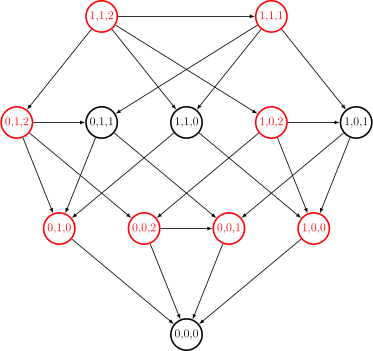

author: cutekibry, woruo27, tinjyu, 2008verser, Backl1ght, billchenchina, Enter-tainer, FFjet, Ir1d, Molmin, orzAtalod, ouuan, SaMiiKaaaa, SamZhangQingChuan, Tiphereth-A, chu-yuehan

前置知识：[博弈论简介](./intro.md)

本文讨论公平组合游戏。

公平组合游戏中，最基础也最重要的是正常 Nim 游戏。Sprague–Grundy 定理指出，所有正常规则的公平组合游戏都等价于一个单堆 Nim 游戏。由此，可以发展出 Sprague–Grundy 函数和 Nim 数的概念，它们完全地刻画了一个正常规则的公平组合游戏。因此，本文首先建立了正常 Nim 游戏的结论和 Sprague–Grundy 理论。随后，本文讨论了算法竞赛中常见的一些公平组合游戏。

最后，本文简单地讨论了反常 Nim 游戏。反常游戏相对于正常游戏来说要复杂得多，也很少在算法竞赛中出现。本文提到的游戏，如果没有特别说明，均默认为正常的公平组合游戏。

## Nim 游戏

Nim 游戏的规则很简单：

???+ abstract "Nim 游戏"
    共有 $n$ 堆石子，第 $i$ 堆有 $a_i$ 枚石子。两名玩家轮流取走任意一堆中的任意多枚石子，但不能不取。取走最后一枚石子的玩家获胜。

容易验证，Nim 游戏是正常规则的公平组合游戏。

???+ example "例子"
    举个例子。当前，有 $3$ 堆石子，石子的数量分别为 $2,5,4$。那么，可以取走第 $1$ 堆中的 $2$ 个物品，局面就变成了 $0, 5, 4$；也可以取走第 $2$ 堆的 $4$ 个物品，局面就变成了 $2, 1, 4$。如果某一时刻的局面变为了 $0, 0, 5$，甲取走了第 $3$ 堆的 $5$ 个物品，也就是取走了最后一个物品，此时甲获胜。

### 博弈图和状态

Nim 游戏中，局面可能的变化可以用博弈图来描述。

将每一个可能的状态都看作是图中的一个结点，并将状态向它的后继状态（即通过一次操作可以达到的状态）连边，就得到一个有向无环图，这就是博弈图。图是无环的，因为 Nim 游戏中，每次操作，石子的总数量都是严格减少的。

???+ example "例子"
    例如，对于初始局面有 $3$ 堆石子，且每堆石子的数量分别为 $1,1,2$ 的 Nim 游戏，可以绘制如下的博弈图：
    
    

    马上就会提到，图中的红色结点表示必胜状态，黑色结点表示必败状态。

由于 Nim 游戏是公平组合游戏，每个玩家是否有必胜策略，只取决当前游戏所处的状态，而与玩家的身份无关。因此，所有状态可以分为（先手）**必胜状态** 和（先手）**必败状态**，分别记为 $\mathcal N$ 态和 $\mathcal P$ 态。这个定义适用于所有公平组合游戏。

通过下述引理，可以归纳地将所有状态标记为必胜状态和必败状态：

???+ note "引理"
    正常规则的公平组合游戏中，

    1.  没有后继状态的状态是必败状态 $\mathcal P$，
    2.  一个状态是必胜状态 $\mathcal N$ 当且仅当存在至少一个它的后继状态为必败状态 $\mathcal P$，
    3.  一个状态是必败状态 $\mathcal P$ 当且仅当它的所有后继状态均为必胜状态 $\mathcal N$。

??? note "证明"
    对于第一条，如果玩家当前已经没有可选的行动，那么玩家已经输掉了游戏。
    
    对于第二条，如果该状态至少有一个后继状态为必败状态，那么玩家可以操作到该必败状态；此时，对手面临了先手必败状态，玩家自己就获得了胜利。
    
    对于第三条，如果不存在一个后继状态为必败状态，那么无论如何，玩家只能操作到必胜状态；此时，对手面临了先手必胜状态，玩家自己就输掉了游戏。

由于所有公平组合游戏中，博弈图都是有向无环图。所以，通过这三个定理，可以在绘制出博弈论后，在 $O(|V|+|E|)$ 的时间内，计算出每个状态是必胜状态还是必败状态。其中，$|V|$ 为博弈图的状态数目，$|E|$ 为边数，即所有状态可以采取的行动的数量的总和。

### Nim 和

继续考察 Nim 游戏。

通过绘制博弈图，可以在 $\Omega(\prod_{i=1}^na_i)$ 的时间内求出某一局面是否是先手必胜。但是，这样做的复杂度过高，无法实际应用。实际上，可以发现 Nim 游戏的状态是否先手必胜，只与当前局面的石子数目的 Nim 和有关。

???+ abstract "Nim 和"
    自然数 $a_1,a_2,\cdots,a_n$ 的 **Nim 和**（Nim sum）定义为 $a_1\oplus a_2\oplus\cdots\oplus a_n$。

所谓 Nim 和，就是异或运算。

???+ note "定理"
    Nim 游戏中，状态 $(a_1,a_2,\cdots,a_n)$ 是必败状态 $\mathcal P$，当且仅当 Nim 和
    
    $$
    a_1\oplus a_2\oplus\cdots\oplus a_n = 0.
    $$

??? note "证明"
    对所有可能的状态应用归纳法：
    
    1.  如果 $a_i=0$ 对所有 $i=1,\cdots,n$ 都成立，该状态没有后继状态，且 Nim 和等于 $0$，定理成立。
    2.  如果 $k = a_1\oplus a_2\oplus\cdots\oplus a_n\neq 0$，那么，需要证明该状态是必胜状态。也就是说，需要构造一个合法移动，使得后继状态为必败状态；由归纳假设，只需要证明后继状态满足 $a'_1\oplus a'_2\oplus\cdots\oplus a'_n=0$。利用 Nim 和（即异或）的性质，这等价于说，存在一堆石子，将 $a_i$ 拿走若干颗石子，可以得到 $a_i\oplus k$，亦即 $a_i>a_i\oplus k$。
    
        实际上，设 $k$ 的二进制表示中，最高位的 $1$ 是第 $d$ 位。那么，一定存在某个 $a_i$，使得它的二进制第 $d$ 位是 $1$。对于相应的石子堆，就一定有 $a_i>a_i\oplus k$，因为 $a_i\oplus k$ 中第 $d$ 位为 $0$，更高位和 $a_i$ 一样。
    3.  如果 $a_1\oplus a_2\oplus\cdots\oplus a_n= 0$，那么，需要证明该状态是必败状态。由归纳假设可知，只需要证明该状态的所有后继状态的 Nim 和都不是 $0$。这是必然的，任何合法移动将 $a_i$ 变为 $a'_i\neq a_i$，就必然会使得 Nim 和变为 $a'_i\oplus a_i\neq 0$。

由此，可以在 $O(n)$ 时间内判断 Nim 游戏的一个状态是否为先手必胜状态。

## Sprague–Grundy 理论

Sprague–Grundy 理论指出，所有公平组合游戏都等价于单堆 Nim 游戏。这一结论主要应用的场景，就是游戏由多个相互独立的子游戏组成的情形。此时，游戏的状态判定可以通过计算子游戏的 SG 函数值的 Nim 和来完成。如果游戏本身没有这样的结构，那么，判定必胜状态和必败状态只需要应用前文 [博弈图](#博弈图和状态) 一节的引理。

### 游戏的记法

前文已经说明，所有公平组合游戏都可以通过绘制博弈图来描述。由于博弈图中，每个状态的性质只由它的后继状态决定，所以，可以将博弈图中的一个状态 $S$ 用它的后继状态的集合来表示。

???+ example "例子（续）"
    以上文的博弈图为例，可以得到如下状态表示：
    
    $$
    \begin{aligned}
    S_{0,0,0} &= \{\},\\
    S_{0,1,0} &= \{S_{0,0,0}\} = \{\{\}\},\\
    S_{0,0,1} &= \{S_{0,0,0}\} = \{\{\}\},\\
    S_{0,0,2} &= \{S_{0,0,0},S_{0,0,1}\} = \{\{\},\{\{\}\}\},\\
    S_{0,1,1} &= \{S_{0,0,0},S_{0,1,0},S_{0,0,1}\} = \{\{\},\{\{\}\}\},\\
    S_{0,1,2} &= \{S_{0,0,2},S_{0,1,0},S_{0,1,1}\} = \{\{\{\}\},\{\{\},\{\{\}\}\}\}.
    \end{aligned}
    $$
    
    其中，$S_{0,1,0}=S_{0,0,1}$，$S_{0,0,2}=S_{0,1,1}$。

一个游戏可以用它的初始状态表示。

尽管公平游戏的表示可能相当复杂，单堆 Nim 游戏相对来说简单很多。只有一堆石子，石子数量为 $n$ 时，它可以表示为

$$
*0 = \{\},~*n = \{*m : m<n,~m\in\mathbf N\} = \{*0,*1,\cdots,*(n-1)\}.
$$

其中，记号 $*n$ 表示石子数量为 $n$ 时的单堆 Nim 游戏（的初始状态）。

???+ example "例子（续）"
    利用这一记号，上面的例子中的状态可以简单地表示为
    
    $$
    S_{0,0,0} = *0,~
    S_{0,1,0} = S_{0,0,1} = *1,~
    S_{0,0,2} = S_{0,1,1} = *2,~
    S_{0,1,2} = \{*1, *2\}.
    $$

在随后的讨论中，记号 $T\in S$ 应当理解为状态 $T$ 是状态 $S$ 的后继状态。

### 游戏的和与等价

游戏的等价关系，依赖于游戏的和的概念。

???+ note "游戏的和"
    游戏 $G$ 和 $H$ 的 **和**（sum），或称 **游戏组合**（combined game），记作 $G+H$，是指游戏
    
    $$
    G + H = \{g + H : g \in G\} \cup \{G + h : h \in H\}.
    $$

游戏的和，可以理解为由两个同时进行且互不干扰的子游戏组成的游戏，玩家在每一步能且只能选择其中一个子游戏移动一步，且游戏在两个子游戏都无法移动时结束。游戏的和的概念，可以推广到任意多个游戏的情形，且满足结合律和交换律——也就是说，多个游戏组合的结果，和组合进行的次序以及游戏的顺序都无关。Nim 游戏就是多个单堆 Nim 游戏的和。

一个观察是，尽管单堆 Nim 游戏中，除了没有石子的情形，都是先手必胜状态，但是这些不同的单堆 Nim 游戏在和其他的单堆 Nim 游戏组合起来时，得到的游戏并不相同。比如，游戏 $*n$ 只有在和另一个 $*n$ 组合时，才能得到一个必败游戏；和所有其他的游戏 $*n'\neq *n$ 组合，得到的游戏都是必胜游戏。

这个观察带来的启示是，可以通过考察与其他游戏的和来研究某个游戏的性质。这就引出了游戏的等价的概念。

???+ abstract "游戏的等价关系"
    如果对于所有游戏 $H$，都有游戏 $G_1+H$ 和 $G_2+H$ 同处于必败状态或必胜状态，那么，称游戏 $G_1$ 和 $G_2$  **等价**（equivalent），记作 $G_1\approx G_2$。

容易验证，这样定义的 $\approx$ 确实是全体公平游戏上的 [等价关系](../order-theory.md#二元关系)。

### Sprague–Grundy 函数

对 Nim 游戏的分析说明，不同的单堆 Nim 游戏互不等价。但是，所有的公平游戏都等价于某个单堆 Nim 游戏。

???+ note "定理（Sprague–Grundy）"
    对于任何一个公平游戏 $G$，都存在 $n\in\mathbf N$，使得 $G\approx *n$ 成立。

??? note "证明"
    首先建立两个引理。第一，将必败游戏和任何游戏组合到一起，都和原来的游戏等价。
    
    ???+ note "引理 1"
        对于游戏 $G$ 和任何必败游戏 $A\in\mathcal P$，都有 $G\approx G + A$。
    
    ??? note "证明"
        按照定义，只需要证明对于任何游戏 $H$ 都有 $G+H\approx G+A+H$ 成立。
        
        如果游戏 $G+H$ 有必胜策略，那么，游戏 $G+A+H$ 也有必胜策略。如果对手在子游戏 $A$ 中进行了移动，就进行移动，将它恢复至必败状态；否则，按照游戏 $G+H$ 中的必胜策略移动。这样一定能保证最终的胜利。
        
        如果游戏 $G+H$ 是必败游戏，那么，游戏 $G+A+H$ 也同样是必败游戏。因为无论这一回合进行的是子游戏 $G+H$ 和子游戏 $A$ 中的移动，对手都可以在下一回合将相应子游戏恢复至必败状态。最终，先手玩家一定无法获胜。
    
    第二，两个游戏等价，当且仅当它们的和是必败游戏。
    
    ???+ note "引理 2"
        游戏 $G$ 和 $G'$ 等价，当且仅当 $G+G'\in\mathcal P$ 是必败游戏。
    
    ??? note "证明"
        如果游戏 $G$ 和 $G'$ 等价，那么，$G+G'\approx G+G$，而游戏 $G+G$ 是必败游戏。这是因为，对于先手玩家的任何操作，后手玩家都可以在另一个子游戏中采取相同的行动，最后一定是先手玩家无法移动。
        
        反过来，如果 $G+G'$ 是必败游戏，那么，由引理 1 可知，$G\approx G+(G+G') = (G+G)+G' \approx G'$。
    
    要证明定理的结论，可以应用数学归纳法。设游戏 $G = \{G_1,G_2,\cdots,G_k\}$。根据归纳假设可知，存在 $n_1,n_2,\cdots,n_k$ 使得 $G_i\approx *n_i$，那么，可以考察游戏
    
    $$
    G' = \{*n_1,*n_2,\cdots,*n_k\}.
    $$
    
    将要证明的是，$G'\approx *m$，其中，$m=\operatorname{mex}\{n_1,n_2,\cdots,n_k\}$ 是没有出现在集合中的最小自然数。
    
    第一步，需要说明 $G\approx G'$。根据引理 2，只需要证明游戏 $G+G'$ 是必败游戏。不妨假设 $G\neq *0$。如果先手玩家选择 $G_i$，那么后手玩家就可以选择 $*n_i$；反过来，如果先手玩家选择了 $*n_i$，后手玩家就可以选择 $G_i$。总之，在这两步操作后，游戏变为 $G_i+*n_i$，根据引理 2 和 $G_i\approx *n_i$，这是必败游戏。这就证明了 $G\approx G'$。
    
    第二步，需要说明 $G'\approx*m$。根据引理 2，只需要证明 $G'+*m$ 是必败游戏。不妨假设 $G'\neq *0$。如果先手玩家选择了 $*n_i\in *m$，那么根据 $m$ 的定义，后手玩家就可以选择 $*n_i\in G'$，将游戏局面变为 $*n_i + *n_i\in\mathcal P$，先手必败。如果先手玩家选择了 $*n_i\in G$ 且 $n_i<m$，那么，后手玩家可以选择 $*n_i\in *m$，游戏局面同样变为 $*n_i+*n_i\in\mathcal P$，先手必败。最后，如果先手玩家选择了 $*n_i\in G$ 且 $n_i>m$，那么，后手玩家可以选择 $*m\in *n_i$，游戏局面变为 $*m+*m\in\mathcal P$，先手必败。这就证明了 $G'\approx *m$。
    
    由等价关系的传递性可知，$G\approx *m$。这就完成了归纳，证明所有游戏 $G$ 都等价于一个单堆 Nim 游戏。

这一结论实际上说明，可以为每一个公平游戏 $G$ 都分配一个自然数 $n$，使得 $G\approx *n$。

???+ abstract "Nim 数"
    一个公平游戏 $G$ 对应的 **Nim 数**（nimber）就是唯一的自然数 $n$ 使得 $G\approx *n$ 成立。

这个将公平游戏映射到 Nim 数的函数称为 **Sprague–Grundy 函数**（Sprague–Grundy function），简称 **SG 函数**，记作 $\operatorname{SG}(\cdot)$。由于每个公平游戏的状态都是另一个公平游戏，所以，对于公平游戏的每一个状态都可以计算相应的 Nim 数，也称为相应的 SG 函数值。

根据本节定理的证明过程可知，Sprague–Grundy 函数可以递归地计算如下：

???+ note "推论"
    公平游戏 $G$ 中的一个状态 $x$ 对应的 Sprague–Grundy 函数值 $\operatorname{SG}(x)$ 满足
    
    $$
    \operatorname{SG}(x) = \operatorname{mex}\{\operatorname{SG}(x'): x'\in x\}.
    $$
    
    其中，$\operatorname{mex}(A):=\min\{n\in\mathbf N:n\notin A\}$ 是没有出现在集合 $A$ 中的最小自然数。

也就是说，一个状态的 SG 函数值，等于它的所有后继状态的 SG 函数值的 $\operatorname{mex}$ 值。

利用 SG 函数值（即 Nim 数），可以判断一个状态是否为先手必胜状态。

???+ note "推论"
    公平游戏 $G$ 中的一个状态 $x$ 是先手必胜状态，当且仅当 $\operatorname{SG}(x)\neq 0$。

最后，游戏的和的 SG 函数值，就是子游戏的 SG 函数值的 Nim 和（即异或）。

???+ note "定理（Sprague–Grundy）"
    对于公平游戏 $G_1,G_2,\cdots,G_n$，有
    
    $$
    \operatorname{SG}(G_1+ G_2+\cdots + G_n) = \operatorname{SG}(G_1)\oplus \operatorname{SG}(G_2)\oplus\cdots\oplus\operatorname{SG}(G_n).
    $$

??? note "证明"
    因为 $*a_1+ *a_2 + \cdots + *a_n$ 就是石子数量为 $(a_1,a_2,\cdots,a_n)$ 的 Nim 游戏，所以，根据 Nim 游戏的结论可知，游戏
    
    $$
    *a_1+ *a_2 + \cdots + *a_n + *(a_1\oplus a_2\oplus\cdots\oplus a_n)
    $$
    
    是先手必败的。根据上述定理证明中的引理 2，有
    
    $$
    *a_1+ *a_2 + \cdots + *a_n \approx *(a_1\oplus a_2\oplus\cdots\oplus a_n).
    $$
    
    所以，有
    
    $$
    \operatorname{SG}(*a_1 + *a_2 + \cdots + *a_n) = a_1\oplus a_2\oplus\cdots\oplus a_n.
    $$
    
    设 $a_i=\operatorname{SG}(G_i)$，就有 $G_i\approx *a_i$，那么，利用 $\approx$ 的代数性质，有
    
    $$
    (G_1+ G_2+\cdots + G_n) + (*a_1 + *a_2 + \cdots + *a_n) = \sum_{i=1}^n(G_i+*a_i) \in\mathcal P.
    $$
    
    所以，就有
    
    $$
    \begin{aligned}
    \operatorname{SG}(G_1+ G_2+\cdots + G_n) &= \operatorname{SG}(*a_1 + *a_2 + \cdots + *a_n) \\
    &= a_1\oplus a_2\oplus \cdots \oplus a_n \\
    &= \operatorname{SG}(G_1)\oplus \operatorname{SG}(G_2)\oplus\cdots\oplus\operatorname{SG}(G_n).
    \end{aligned}
    $$

利用这一定理，在计算游戏的和的 SG 函数值时，可以大幅简化计算。

由此，可以总结出 SG 函数值的计算方法：

-   对于多个独立的游戏，可以分别计算它们的 SG 函数值，再求 Nim 和；
-   对于单个游戏，每个状态的 SG 函数值都是它的所有后继状态的 SG 函数值的 $\operatorname{mex}$ 值；
-   特别地，没有后继状态的状态的 SG 函数值为 $\operatorname{mex}\varnothing = 0$。

### Nim 数

所有的公平游戏都唯一对应一个 Nim 数。（有限）Nim 数的集合就是自然数集 $\mathbf N$。但是，它的代数性质和自然数集不同。具体来说，Nim 数上可以定义 Nim 和 $\oplus$、Nim 乘积 $\otimes$ 两种运算：

???+ abstract "Nim 数的运算"
    对于 Nim 数 $a,b$，可以定义：
    
    -   Nim 和 $a\oplus b=\operatorname{mex}(\{a'\oplus b:a'<a,~a'\in\mathbf N\}\cup\{a\oplus b':b'<b,~b'\in\mathbf N\})$，
    -   Nim 积 $a\otimes b=\operatorname{mex}(\{(a'\otimes b)\oplus(a\otimes b')\oplus(a'\otimes b'):a'<a,~b'<b,~a',b'\in\mathbf N\})$。

全体 Nim 数在运算 $\oplus$ 和 $\otimes$ 下构成一个特征为 $2$ 的 [域](../algebra/basic.md#域)。而且，这些运算以及它们的逆运算，对于前 $2^{2^n}$ 个 Nim 数是封闭的；这就得到一系列大小为 $2^{2^n}$ 的 [有限域](../algebra/field-theory.md#有限域) $\mathbf F_{2^{2^n}}$。

## 常见的公平游戏

尽管 Sprague–Grundy 理论完全解决了公平游戏的问题，但是，处理实际的公平游戏时，直接应用 Sprague–Grundy 定理计算效率仍然不高。比如，Nim 游戏中，暴力计算 Sprague–Grundy 值的复杂度是指数级的。因此，往往需要通过打表的方式猜测具体的公平游戏的结论。

本节列举了一些常见的公平游戏及其结论。叙述结论时，本节只给出了必胜和必败状态的判断法则。至于必胜策略，就是进行恰当的操作，使得留给对手的局面恰好为必败状态。由于算法竞赛中经常出现这些游戏的变体，所以，掌握每个游戏的结论的证明过程也很重要。

### Bachet 游戏

相较于单堆 Nim 游戏，Bachet 游戏限制了每次可以取走的石子的数量。

???+ abstract "Bachet 游戏"
    有一堆石子，共计 $n$ 枚。两名玩家轮流取走至少 $1$ 枚、至多 $k$ 枚石子。取走最后一枚石子的玩家获胜。

对此，有如下结论：

???+ note "定理"
    游戏先手必败，当且仅当 $n\equiv 0\pmod {k+1}$。

??? note "证明一"
    当 $n\not\equiv 0\pmod {k+1}$ 时，只要取走 $n\bmod{(k+1)}\in[1,k]$ 枚石子，就能保证对手处于必败状态。因此，此时是先手必胜状态。
    
    反过来，当 $n\equiv 0\pmod {k+1}$ 时，那么，要么已经没有选择，要么自己取走 $k'$ 枚石子后，对手紧接着可以取走 $k+1-k'$ 枚石子，让自己回到必败状态。

??? note "证明二"
    作为 Sprague–Grundy 定理的应用，可以计算 $f(n)$ 为只剩下 $n$ 枚石子时，对应局面的 SG 函数值。
    
    对于 $n\le k$，可以归纳地证明 $f(n)=n$。这与单堆 Nim 游戏，因为取走石子数目的限制没有发挥作用。对于 $n>k$ 时，可以证明 $f(n)=n\bmod{(k+1)}$，所以，有
    
    $$
    f(n) = \operatorname{mex}\{f(n-k),f(n-k+1),\cdots,f(n-1)\}.
    $$
    
    这遍历了模 $k+1$ 的全体余数，除了 $n\bmod{(k+1)}$。因此，就有 $f(n) = n\bmod{(k+1)}$。

### Moore's Nim-k 游戏

相较于 Nim 游戏，Moore's Nim-$k$ 游戏允许一次性从 $k$ 个石子堆中取石子。

???+ abstract "Moore's Nim-$k$ 游戏 "
    共有 $n$ 堆石子，第 $i$ 堆有 $a_i$ 枚石子。两名玩家轮流取走至少 $1$ 堆、至多 $k$ 堆中的任意多枚石子，但不能不取。取走最后一枚石子的玩家获胜。

对此，有如下结论：

???+ note "定理"
    将每一堆石子的数目都表示为二进制数，并对每个数位 $d$，都统计有几堆石子的数目的第 $d$ 位是 $1$，并计算这个数目对于 $(k+1)$ 的余数。如果对于每个数位，这个余数都等于 $0$，那么先手必败；否则，先手必胜。

??? note "证明"
    仿照 Nim 游戏的结论的证明，很容易证明本结论。设 $d$ 为余数不为 $0$ 的最高二进制位，且对应的余数为 $k'\le k$。那么，必胜策略为，在石子数目二进制第 $d$ 位为 $1$ 的石子堆中，选择 $k$ 堆，并选择移走的石子数目恰好使得对手局面中，每个数位的余数都是 $0$。唯一需要说明的是，最后取走石子数量的选择总是可行的。
    
    实际上，只要选定 $k'$ 堆石子，每堆都取走 $2^d$ 枚石子，就能使得结果中，第 $d$ 位余数变为 $0$。对于更低的数位的余数，将这些余数随意摊派给某一个堆即可。

### 阶梯 Nim 游戏

阶梯 Nim 游戏稍微复杂一些，它允许石子在相邻的堆之间移动。

???+ abstract "阶梯 Nim 游戏"
    共有 $n$ 堆石子，第 $i$ 堆有 $a_i$ 枚石子。两名玩家轮流操作，每次操作中，要么取走第 $1$ 堆石子中的任意多枚，要么将第 $i>1$ 堆石子中的任意多枚移动到第 $i-1$ 堆，但不能不做任何操作。取走最后一枚石子的玩家取胜。

对此，有如下结论：

???+ note "定理"
    游戏先手必败，当且仅当奇数堆石子数量的 Nim 和 $a_1\oplus a_3\oplus\cdots\oplus a_{n-1+(n\bmod 2)}=0$。

??? note "证明"
    任何玩家将偶数堆的石子移动到奇数堆时，对手都可以将这些石子继续移动到下一个偶数堆（或移走），因此，这样的移动不会影响奇数堆的局面。此时，每一个奇数堆向下移动到相邻的偶数堆（或移走）都可以看作独立的单堆 Nim 游戏。根据 Sprague–Grundy 定理关于游戏的和的结论，阶梯 Nim 游戏的 SG 函数值，是这些子游戏的 SG 函数值的 Nim 和。这就得到上述结论。

### Fibonacci Nim 游戏

Fibonacci Nim 游戏类似 Bachet 游戏，只有一堆石子，且限制了每次取走的数量。与 Bachet 游戏不同，Fibonacci Nim 游戏中，每次取走的数量的限制是动态的。

???+ abstract "Fibonacci Nim 游戏"
    有一堆石子，共计 $n$ 枚。两名玩家轮流取石子。第一个行动的玩家不限制取走的石子数目，但是不能取完石子；随后，每次取走的石子数目不得超过上次（指对手回合）取走的石子数目的二倍。每次取走的石子的数目不得为 $0$。取走最后一枚石子的玩家获胜。

对此，有如下结论：

???+ note "定理"
    游戏开始时，先手必败，当且仅当石子数目 $n$ 是 [Fibonacci 数](../combinatorics/fibonacci.md)。

??? note "证明"
    设 $q$ 为当前局面可移走石子数量的限额（quota）。那么，第一回合中，$q=n-1$；而之后的回合中，$q$ 是上次（对手）移走的石子数目的二倍。考察剩余石子数目 $n$ 的 [Fibonacci 编码](../combinatorics/fibonacci.md#斐波那契编码)，也就是将 $n$ 唯一地分解为一系列不相邻的、正的 Fibonacci 数的和。那么，当前状态是必胜状态，当且仅当 $q$ 大于等于 $n$ 的分解中的最小 Fibonacci 数。
    
    必胜策略是：如果可以，移走所有剩余石子；否则，移走分解中最小的 Fibonacci 数。由于分解中，次小的 Fibonacci 数一定严格大于最小的 Fibonacci 数的两倍，所以，只要处于必胜状态的当前回合取不走所有石子，对手在下一回合也取不走次小的 Fibonacci 数（也就是下一回合最小的 Fibonacci 数），对手一定处于必败状态。
    
    反过来，如果当前处于必败状态，那么，设当前取走的数目为 $k$，它一定严格小于当前分解中的最小 Fibonacci 数 $F$。假设下一回合最小的 Fibonacci 数是 $F'$，它一定也是 $F - k$ 对应的分解中最小的 Fibonacci 数。设 $F'=F''+F'''$ 且 $F''>F'''$。如果 $k<F''$，那么，利用 Fibonacci 编码计算 $k + (F-k)$ 时，不需要进位，自然得不到 $F$。所以，一定有 $k\ge F''$。这就说明，下一回合的限额 $2k>F''+F'''=F'$，是必胜状态。

### Wythoff 游戏

Wythoff 游戏允许同时从多堆石子中移除，但是要求每堆移除的石子数量是一定的。

???+ abstract "Wythoff 游戏"
    有两堆石子，分别有 $a_1$ 和 $a_2$ 枚石子。两名玩家轮流从其中一堆或两堆中取石子，不能不取，但要求从两堆都取石子时，取走的石子数量必须相同。取走最后一枚石子的玩家获胜。

对此，有如下结论：

???+ note "定理"
    不妨设 $a_1\le a_2$，那么，先手必败，当且仅当 $a_1 = \lfloor(a_2-a_1)\phi\rfloor$，其中，$\phi=(\sqrt{5}+1)/2$ 是黄金分割比。

### 翻硬币游戏

### 二分图博弈

## 反常 Nim 游戏

本文的最后，讨论反常 Nim 游戏的求解。

???+ abstract "Nim 游戏"
    共有 $n$ 堆石子，第 $i$ 堆有 $a_i$ 枚石子。两名玩家轮流取走任意一堆中的任意多枚石子，但不能不取。取走最后一枚石子的玩家失败。

对此，有如下结论：

???+ note "定理"
    反常 Nim 游戏中，状态 $(a_1,a_2,\cdots,a_n)$ 是必败状态 $\mathcal P$，当且仅当
    
    1.  存在 $i$ 使得 $a_i>1$，且 Nim 和 $a_1\oplus a_2\oplus\cdots\oplus a_n=0$，或者
    2.  对于所有 $i$ 都有 $a_i\le 1$，且剩余的非空石子堆数是奇数。

??? note "证明"
    由于无法操作是先手必胜态 $\mathcal N$，所以，可以归纳地证明，如果每堆石子都只有一枚，那么石子堆数是奇数就对应着先手必败态 $\mathcal N$，石子堆数是偶数就对应着先手必胜态 $\mathcal N$。
    
    接下来，考察有些堆石子的数量严格大于 $1$ 的情况。
    
    情形 A：如果只有一堆石子的数量严格大于 $1$，那么，此时 Nim 和一定不为 $0$。而且，由于先手玩家可以选择转移到全部堆的石子数量均不超过 $1$ 的局面，而且可以控制剩余的非空石子堆的奇偶性。因此，此时为先手必胜态 $\mathcal N$。
    
    情形 B：现在，有不止一堆石子的数量严格大于 $1$，那么，无论怎么操作，下一个局面中，都至少有一堆石子的数量严格大于 $1$。根据归纳假设，下一局面中，先手必败对应着 Nim 和为零，先手必胜对应着 Nim 和不为零。这与正常 Nim 游戏的归纳假设完全相同。因此，重复 Nim 游戏的论证，就能知道，当前局面同样符合 Nim 和为零对应先手必败状态的结论。

## 有向图游戏

本文讨论的公平组合游戏，要求同一局面不能出现两次，也不存在平局的可能性。因此，对应的博弈图总是有向无环图。本节放宽了这一限制，讨论如何在一般的有向图上判定各个状态是先手必胜、先手必败或平局。

有向图游戏的规则和其他的公平组合游戏大体一致：从起始状态出发，轮流沿着有向图的边移动一步，直到无路可走。根据游戏是正常规则还是反常规则，最后一个不能移动的玩家分别是败者和胜者。在这样的游戏里，每个状态的胜负情况共有三种可能性：先手必胜、先手必败、平局。尽管稍微复杂一些，但是关于必败状态和必胜状态的引理依然成立：

-   一个状态有后继状态先手必胜，当且仅当后继状态之一是必败状态；
-   如果一个状态有后继状态，那么它先手必败，当且仅当所有后继状态都是必胜状态。

如果一个状态无法分类为必胜状态和必败状态，那么它就是平局状态。

## 习题

模板题：

-   [Luogu P2197【模板】Nim 游戏](https://www.luogu.com.cn/problem/P2197) Nim
-   [Luogu P4279 \[SHOI2008\] 小约翰的游戏](https://www.luogu.com.cn/problem/P4279) Misere Nim
-   [Luogu P6487 \[COCI 2010/2011 #4\] HRPA](https://www.luogu.com.cn/problem/P6487) Fibonacci
-   [Luogu P2252 \[SHOI2002\] 取石子游戏](https://www.luogu.com.cn/problem/P2252) Wythoff
-   [Luogu P7589 黑白棋（2021 CoE-II B）](https://www.luogu.com.cn/problem/P7589) Nim
-   [Luogu P2575 高手过招](https://www.luogu.com.cn/problem/P2575) 打表 or 阶梯 Nim + SG
-   [Luogu P4101 \[HEOI2014\] 人人尽说江南好](https://www.luogu.com.cn/problem/P4101) Bachet or 打表
-   [Luogu P3480 \[POI 2009\] KAM-Pebbles](https://www.luogu.com.cn/problem/P3480) 阶梯 Nim
-   [Luogu P2148 \[SDOI2009\] E&D](https://www.luogu.com.cn/problem/P2148) 打表 + SG
-   [Luogu P6560 \[SBCOI2020\] 时光的流逝](https://www.luogu.com.cn/problem/P6560) 有向图游戏
-   [Luogu P3185 \[HNOI2007\] 分裂游戏](https://www.luogu.com.cn/problem/P3185) 翻硬币 or 打表 or SG
-   [Luogu P2594 \[ZJOI2009\] 染色游戏](https://www.luogu.com.cn/problem/P2594) 二维翻硬币 + 打表
-   [AtCoder Regular Contest 168 B - Arbitrary Nim](https://atcoder.jp/contests/arc168/tasks/arc168_b) Bachet + Nim 和

综合题：

-   [Luogu P7864「EVOI-RD1」摘叶子](https://www.luogu.com.cn/problem/P7864) 思维题
-   [Luogu P8347「Wdoi-6」另一侧的月](https://www.luogu.com.cn/problem/P8347) 思维题
-   [AtCoder Grand Contest 010 F - Tree Game](https://atcoder.jp/contests/agc010/tasks/agc010_f) 思维题
-   [AtCoder Beginner Contest 278 G - Generalized Subtraction Game](https://atcoder.jp/contests/abc278/tasks/abc278_g) SG + 交互
-   [AtCoder Grand Contest 017 D - Game on Tree](https://atcoder.jp/contests/agc017/tasks/agc017_d) 树上 Nim + SG
-   [Codeforces 1704 F. Colouring Game](https://codeforces.com/problemset/problem/1704/F) Nim + SG + 打表找规律
-   [Luogu P5970 \[POI 2016\] Nim z utrudnieniem](https://www.luogu.com.cn/problem/P5970) Nim + 计数 DP
-   [Luogu P5675 \[GZOI2017\] 取石子游戏](https://www.luogu.com.cn/problem/P5675) Nim + 计数 DP
-   [Luogu P2599 \[ZJOI2009\] 取石子游戏](https://www.luogu.com.cn/problem/P2599) 引理 + 区间 DP
-   [Luogu P6791 \[SNOI2020\] 取石子](https://www.luogu.com.cn/problem/P6791) 反常 Fibonacci + 数位 DP
-   [Luogu P2490 \[SDOI2011\] 黑白棋](https://www.luogu.com.cn/problem/P2490) Moore Nim-k + 计数 DP
-   [Luogu P5363 \[SDOI2019\] 移动金币](https://www.luogu.com.cn/problem/P5363) 阶梯 Nim + 计数 DP
-   [Luogu P3179 \[HAOI2015\] 数组游戏](https://www.luogu.com.cn/problem/P3179) 翻硬币 + 数论分块
-   [Luogu P5387 \[Cnoi2019\] 人形演舞](https://www.luogu.com.cn/problem/P5387) 打表 + FWT + 计数
-   [AtCoder Grand Contest 002 E - Candy Piles](https://atcoder.jp/contests/agc002/tasks/agc002_e) 引理 + DP + 找规律
-   [SPOJ COT3 - Combat on a tree](https://www.spoj.com/problems/COT3/) SG + 01 trie + 启发式合并
-   [Codeforces 494 E. Sharti](https://codeforces.com/problemset/problem/494/E) 二维翻硬币 + 打表 + 扫描线
-   [Codeforces 1149 E. Election Promises](https://www.luogu.com.cn/problem/CF1149E) SG + 无穷 Nimber
-   [Codeforces 1451 F. Nullify The Matrix](https://codeforces.com/problemset/problem/1451/F) 无穷 Nimber 板子

二分图博弈：

-   [Luogu P4136 谁能赢呢？](https://www.luogu.com.cn/problem/P4136)
-   [Luogu P4617 \[COCI 2017/2018 #5\] Planinarenje](https://www.luogu.com.cn/problem/P4617) 模板题
-   [Luogu P4055 \[JSOI2009\] 游戏](https://www.luogu.com.cn/problem/P4055) 模板题
-   [Luogu P1971 \[NOI2011\] 兔兔与蛋蛋游戏](https://www.luogu.com.cn/problem/P1971) 简单转化
-   [Codeforces 1147 F. Zigzag Game](https://codeforces.com/problemset/problem/1147/F) 交互题 + 稳定匹配

非公平组合游戏：

-   [Codeforces 1033 G. Chip Game](https://codeforces.com/problemset/problem/1033/G) 打表找规律 + 非公平
-   [Luogu P9169 \[省选联考 2023\] 过河卒](https://www.luogu.com.cn/problem/P9169) 有向图 + 非公平 + BFS

零和博弈：（并不计划在本页面讨论）

-   [Codeforces 388 C. Fox and Card Game](https://codeforces.com/problemset/problem/388/C) 非对称序贯零和 + 思维题
-   [Luogu P2734 \[USACO3.3\] 游戏 A Game](https://www.luogu.com.cn/problem/P2734) 序贯零和 + 区间 DP
-   [Luogu P4576 \[CQOI2013\] 棋盘游戏](https://www.luogu.com.cn/problem/P4576) 非对称序贯零和 + 暴力搜索（alpha-beta 剪枝）
-   [Luogu P7097 \[yLOI2020\] 牵丝戏](https://www.luogu.com.cn/problem/P7097) 非对称序贯零和 + 背包 DP
-   [Codeforces 1628 D2. Game on Sum (Hard Version)](https://codeforces.com/problemset/problem/1628/D2) 非对称序贯零和 + 组合数学
-   [Codeforces 794 E. Choosing Carrot](https://codeforces.com/problemset/problem/794/E) 序贯零和 + 区间 DP

## 参考文献

-   [（转载）Nim 游戏博弈（收集完全版）- exponent - 博客园](http://www.cnblogs.com/exponent/articles/2141477.html)
-   [\[组合游戏与博弈论\]【学习笔记】- Candy? - 博客园](https://www.cnblogs.com/candy99/p/6548836.html)
-   [Nim - Wikipedia](https://en.wikipedia.org/wiki/Nim)
-   [Sprague–Grundy theorem - Wikipedia](https://en.wikipedia.org/wiki/Sprague%E2%80%93Grundy_theorem)
-   [Nimber - Wikipedia](https://en.wikipedia.org/wiki/Nimber)
-   [Games on arbitrary graphs - CP Algorithms](https://cp-algorithms.com/game_theory/games_on_graphs.html)
