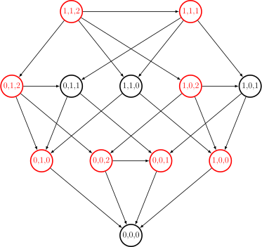

author: cutekibry, woruo27, tinjyu, 2008verser, Backl1ght, billchenchina, Enter-tainer, FFjet, Ir1d, Molmin, orzAtalod, ouuan, SaMiiKaaaa, SamZhangQingChuan, Tiphereth-A, chu-yuehan

经典的公平组合游戏有很多，包括取数游戏，31 点，以及 Nim 游戏等。

## Nim 游戏

$n$ 堆物品，每堆有 $a_i$ 个，两个玩家轮流取走任意一堆的任意个物品，但不能不取。

取走最后一个物品的人获胜。

例如，如果现在有 $n=3$ 堆物品，而每堆分别有 $2, 5, 4$ 个，那么可以取走第 $1$ 堆中的 $2$ 个物品，局面就变成了 $0, 5, 4$；或者也可以取走第 $2$ 堆的 $4$ 个物品，局面就变成了 $2, 1, 4$。

如果现在的局面为 $0, 0, 5$，甲取走了第 $3$ 堆的 $5$ 个物品，也就是取走了最后一个物品，此时甲获胜。

## 博弈图和状态

如果将每个状态视为一个节点，再从每个状态向它的后继状态连边，我们就可以得到一个博弈状态图。

例如，如果节点 $(i, j, k)$ 表示局面为 $i, j, k$ 时的状态，则我们可以画出下面的博弈图：

定义 **必胜状态** 为 **先手必胜的状态**，**必败状态** 为 **先手必败的状态**。

通过推理，我们可以得出下面三条定理：

-   定理 1：没有后继状态的状态是必败状态。
-   定理 2：一个状态是必胜状态当且仅当存在至少一个必败状态为它的后继状态。
-   定理 3：一个状态是必败状态当且仅当它的所有后继状态均为必胜状态。

对于定理 1，如果游戏进行不下去了，那么这个玩家就输掉了游戏。

对于定理 2，如果该状态至少有一个后继状态为必败状态，那么玩家可以通过操作到该必败状态；此时对手的状态为必败状态——对手必定是失败的，而相反地，自己就获得了胜利。

对于定理 3，如果不存在一个后继状态为必败状态，那么无论如何，玩家只能操作到必胜状态；此时对手的状态为必胜状态——对手必定是胜利的，自己就输掉了游戏。

如果博弈图是一个有向无环图，则通过这三个定理，我们可以在绘出博弈图的情况下用 $O(N+M)$ 的时间（其中 $N$ 为状态种数，$M$ 为边数）得出每个状态是必胜状态还是必败状态。

## Nim 和

让我们再次回顾 Nim 游戏。

通过绘画博弈图，我们可以在 $O(\prod_{i=1}^n a_i)$ 的时间里求出该局面是否先手必赢。

但是，这样的时间复杂度实在太高。有没有什么巧妙而快速的方法呢？

定义 Nim 和 $=a_1 \oplus a_2 \oplus \ldots \oplus a_n$。

当且仅当 Nim 和为 $0$ 时，该状态为必败状态；否则该状态为必胜状态。

### 证明

为什么异或值会和状态的胜负有关？下面给出了这个定理的证明过程。

为了证明该定理，只需要证明下面三个定理：

-   定理 1：没有后继状态的状态是必败状态。
-   定理 2：对于 $a_1 \oplus a_2 \oplus \ldots \oplus a_n \neq 0$ 的局面，一定存在某种移动使得 $a_1 \oplus a_2 \oplus \ldots \oplus a_n = 0$。
-   定理 3：对于 $a_1 \oplus a_2 \oplus \ldots \oplus a_n = 0$ 的局面，一定不存在某种移动使得 $a_1 \oplus a_2 \oplus \ldots \oplus a_n = 0$。

对于定理 1，没有后继状态的状态只有一个，即全 $0$ 局面。此时 $a_1 \oplus a_2 \oplus \ldots \oplus a_n = 0$。

对于定理 2，不妨假设 $a_1 \oplus a_2 \oplus \ldots a_n = k \neq 0$。如果我们要将 $a_i$ 改为 $a_i'$，则 $a_i'=a_i \oplus k$。

假设 $k$ 的二进制最高位 $1$ 为 $d$，即 $2^d \le k < 2^{d + 1}$。根据异或定义，一定有奇数个 $a_i$ 的二进制第 $d$ 位为 1。满足这个条件的 $a_i$ 一定也满足 $a_i > a_i \oplus k$，因而这也是个合法的移动。

对于定理 3，如果我们要将 $a_i$ 改为 $a_i'$，则根据异或运算律可以得出 $a_i=a_i'$，因而这不是个合法的移动。

## 有向图游戏与 SG 函数

有向图游戏是一个经典的博弈游戏——实际上，大部分的公平组合游戏都可以转换为有向图游戏。

在一个有向无环图中，只有一个起点，上面有一个棋子，两个玩家轮流沿着有向边推动棋子，不能走的玩家判负。

定义 $\operatorname{mex}$ 函数的值为不属于集合 $S$ 中的最小非负整数，即：

$$
\operatorname{mex}(S)=\min\{x\} \quad (x \notin S, x \in N)
$$

例如 $\operatorname{mex}(\{0, 2, 4\})=1$，$\operatorname{mex}(\{1, 2\})=0$。

对于状态 $x$ 和它的所有 $k$ 个后继状态 $y_1, y_2, \ldots, y_k$，定义 $\operatorname{SG}$ 函数：

$$
\operatorname{SG}(x)=\operatorname{mex}\{\operatorname{SG}(y_1), \operatorname{SG}(y_2), \ldots, \operatorname{SG}(y_k)\}
$$

而对于由 $n$ 个有向图游戏组成的组合游戏，设它们的起点分别为 $s_1, s_2, \ldots, s_n$，则有定理：**当且仅当 $\operatorname{SG}(s_1) \oplus \operatorname{SG}(s_2) \oplus \ldots \oplus \operatorname{SG}(s_n) \neq 0$ 时，这个游戏是先手必胜的。同时，这是这一个组合游戏的游戏状态 $x$ 的 SG 值。**

这一定理被称作 **Sprague–Grundy 定理**(Sprague–Grundy Theorem), 简称 SG 定理。

### SG 定理的证明

可以使用数学归纳法来证明。

我们假设对于游戏状态 $x'$，其当前节点 $s_1', s_2', \ldots, s_n'$（对于任意 $i$ 有 $s_i' < s_i$），皆满足 SG 定理。

显然当 $\operatorname{SG}(s_1)'=\operatorname{SG}(s_2)'=\ldots \operatorname{SG}(s_n)'=0$ 时，该状态能满足 SG 定理。

那么只需要证明对于游戏状态 $x$，其当前节点 $s_1', s_2', \ldots, s_n'$ 符合 SG 定理，SG 定理便成立。

事实上这一个状态可以看作一个 Nim 游戏，对于某个节点 $s_i$，它可以移动到任意一个 $\operatorname{SG}$ 值比它小或比它大的节点。

在有向图游戏中，当一方将某一节点 $s_i$ 移动到 $\operatorname{SG}$ 值比它大的节点时，另一方可以移动回和 $\operatorname{SG}$ 值和 $\operatorname{SG}(s_i)$ 一样的节点，所以向 SG 值较大节点移动是无效操作。

当移动到 SG 值较小的节点时，情况则会和 Nim 游戏一样，能够到达任何一个游戏状态 $x'$ 使得 $\operatorname{SG}(x')= \operatorname{SG}(s_1') \oplus \operatorname{SG}(s_2') \oplus \ldots \oplus \operatorname{SG}(s_n') < \operatorname{SG}(X)$（注意到前文已经假设 $x'$ 满足 SG 定理），但到达不了 SG 值为 $\operatorname{SG}(s_1) \oplus \operatorname{SG}(s_2) \oplus \ldots \oplus \operatorname{SG}(s_n)$ 的节点。

所以状态 $x$ 符合 SG 定理。

### SG 定理的应用

SG 定理适用于 **任何公平的两人游戏**, 它常被用于决定游戏的输赢结果。

计算给定状态的 Grundy 值的步骤一般包括：

-   获取从此状态所有可能的转换；

-   每个转换都可以导致 **一系列独立的博弈**（退化情况下只有一个）。计算每个独立博弈的 Grundy 值并对它们进行 **异或求和**。

-   在为每个转换计算了 Grundy 值之后，状态的值是这些数字的 $\operatorname{mex}$。

-   如果该值为零，则当前状态为输，否则为赢。

## 将 Nim 游戏转换为有向图游戏

我们可以将一个有 $x$ 个物品的堆视为节点 $x$，则当且仅当 $y<x$ 时，节点 $x$ 可以到达 $y$。

那么，由 $n$ 个堆组成的 Nim 游戏，就可以视为 $n$ 个有向图游戏了。

根据上面的推论，可以得出 $\operatorname{SG}(x)=x$。再根据 SG 定理，就可以得出 Nim 和的结论了。

## 反 Nim 游戏

以反 Nim 游戏为例，这里给出反 Nim 游戏的结论以及证明：

规定：字母 N 和 P 分别代表先手必胜与必败。

一个局面为 N 态的充要条件是有至少一条出边连接至 P 态。

一个局面为 P 态的充要条件是每一条出边都连接到 N 态。

为方便书写，用字母 $T$ 表示 $\oplus_{i=1}^{n}a_{i}$。

结论：

1.  当全部 $a_{i}=1$，如果有奇数堆石子就为 P 态，有偶数堆则为 N 态。

2.  当至少一个 $a_{i}>1$，$T\neq 0$ 时为 N 态，否则为 P 态。

证明 1：显然。

证明 2：

情况 A：若只有一个 **$a_{i}>1$（此时 $T$ 一定 $\neq 0$）**，则先手选择转移到全部 $a_{i}=1$ 的局面，并且先手可以在这次决策中控制转移后堆数的奇偶。

故这种情况 **是 N 态**。

情况 B：（不考虑 $T$ 取值）有至少 $2$ 个 $a_{i}>1$。

小情况 B1：$T\neq 0$：通过 Nim 游戏可知一定能够转移到 $T=0$ 且至少有 $2$ 个 $a_{i}>1$ 的局面（小情况 B2）。

证明：显然可以转移到 $T=0$，如果此时只剩一堆 $a_{i} > 1$，由于这堆的最高位不能被 $1$ 异或消去，故 $T\ne 0$，于是这种情况不会发生。

小情况 B2：$T=0$：

一方面可以转移到至少 $2$ 个 $a_{i}>1,T\neq 0$ 的局面，即情况 B1。

另一方面随着游戏进行（B1, B2 循环），数量大于 1 的堆会逐渐减少，最终只剩一堆，这就变成了情况 A，为 N 态。

这时候我们会发现，小情况 B1 总有办法转化为 B2 交给对方，而 B2 要么只能将情况 A 这一必胜态交给对方，要么只能转化回 B1 交给对方，而情况 B1，经过我们上面的分析，是「安全」的。

故在情况 B 下，小情况 B1 为必胜态 N，B2 为必败态 P。

也就是说 **当至少 $2$ 个 $a_{i}>1,T\neq 0$ 时为 N 态，否则为 P 态。**

综合情况 A 和情况 B 的结论，结论 2 得证。

综上，结论 1 和 2 皆得证。结论得证。

## 参考文献

[（转载）Nim 游戏博弈（收集完全版）- exponent - 博客园](http://www.cnblogs.com/exponent/articles/2141477.html)

[\[组合游戏与博弈论\]【学习笔记】- Candy? - 博客园](https://www.cnblogs.com/candy99/p/6548836.html)
