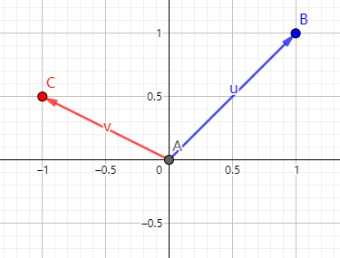
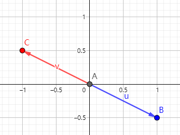

author: cesonic, Enter-tainer, Great-designer, Ir1d, ksyx, lychees, MegaOwIer, RUIN-RISE, wjy-yy, rsdbkhusky, ouuan, Menci, Tiphereth-A

回想高中数学立体几何中基向量的概念，我们可以在三维欧氏空间中找到一组基向量 $\boldsymbol{i}$，$\boldsymbol{j}$，$\boldsymbol{k}$，之后空间中任意一个向量都可以由这组基向量表示。换句话说，我们可以 **通过有限的基向量来描述无限的三维空间**，这足以体现基向量的重要性。

三维欧氏空间是特殊的 [线性空间](./vector-space.md)，三维欧氏空间的基向量在线性空间中就被推广为了线性基。

OI 中有关线性基的应用一般只涉及两类线性空间：$n$ 维实线性空间 $\mathbf{R}^n$ 和 $n$ 维 [布尔域](https://en.wikipedia.org/wiki/Boolean_domain) 线性空间 $\mathbf{Z}_2^n$，我们会在 [应用](#应用) 一节中详细介绍。若您不熟悉线性代数，则推荐从应用部分开始阅读。

以下会从一般的线性空间出发来介绍线性基，并给出线性基的常见性质。

前置知识：[线性空间](./vector-space.md)。

线性基是线性空间的一组基，是研究线性空间的重要工具。

## 定义

称线性空间 $V$ 的一个极大线性无关组为 $V$ 的一组 **Hamel 基** 或 **线性基**，简称 **基**。

规定线性空间 $\{\theta\}$ 的基为空集。

可以证明任意线性空间均存在线性基[^existence_basis]，我们定义线性空间 $V$ 的 **维数** 为线性基的元素个数（或势），记作 $\dim V$。

## 性质

1.  对于有限维线性空间 $V$, 设其维数为 $n$, 则：

    1.  $V$ 中的任意 $n+1$ 个向量线性相关。

    2.  $V$ 中的任意 $n$ 个线性无关的向量均为 $V$ 的基。

    3.  若 $V$ 中的任意向量均可被向量组 $a_1,a_2,\dots,a_n$ 线性表出，则其是 $V$ 的一个基。

        ???+ note "证明"
            任取 $V$ 中的一组基 $b_1,b_2,\dots,b_n$, 由已知条件，向量组 $b_1,b_2,\dots,b_n$ 可被 $a_1,a_2,\dots,a_n$ 线性表出，故
            
            $$
            n=\operatorname{rank}\{b_1,b_2,\dots,b_n\}\leq\operatorname{rank}\{a_1,a_2,\dots,a_n\}\leq n
            $$
            
            因此 $\operatorname{rank}\{a_1,a_2,\dots,a_n\}=n$

    4.  $V$ 中任意线性无关向量组 $a_1,a_2,\dots,a_m$ 均可通过插入一些向量使得其变为 $V$ 的一个基。

2.  （子空间维数公式）令 $V_1,V_2$ 是关于 $\Bbb{P}$ 的有限维线性空间，且 $V_1+V_2$ 和 $V_1\cap V_2$ 也是有限维的，则 $\dim V_1+\dim V_2=\dim(V_1+V_2)+\dim(V_1\cap V_2)$

    ???+ note "证明"
        设 $\dim V_1=n_1$,$\dim V_2=n_2$,$\dim(V_1\cap V_2)=m$.
        
        取 $V_1\cap V_2$ 的一组基 $a_1,a_2,\dots,a_m$, 将其分别扩充为 $V_1$ 和 $V_2$ 中的基：$a_1,a_2,\dots,a_m,b_1,b_2,\dots,b_{n_1-m}$ 和 $a_1,a_2,\dots,a_m,c_1,c_2,\dots,c_{n_2-m}$.
        
        接下来只需证明向量组 $a_1,a_2,\dots,a_m,b_1,b_2,\dots,b_{n_1-m},c_1,c_2,\dots,c_{n_2-m}$ 线性无关即可。
        
        设 $\sum_{i=1}^m r_ia_i+\sum_{i=1}^{n_1-m} s_ib_i+\sum_{i=1}^{n_2-m} t_ic_i=\theta$.
        
        则 $\sum_{i=1}^{n_2-m} t_ic_i=-\sum_{i=1}^m r_ia_i-\sum_{i=1}^{n_1-m} s_ib_i$.
        
        注意到上式左边在 $V_2$ 中，右边在 $V_1$ 中，故两边均在 $V_1\cap V_2$ 中，因此 $\sum_{i=1}^{n_2-m} t_ic_i=\sum_{i=1}^m k_ia_i$
        
        故 $t_1=t_2=\dots=t_{n_2-m}=k_1=k_2=\dots=k_m=0$, 进而 $r_1=r_2=\dots=r_m=s_1=s_2=\dots=s_{n_1-m}=t_1=t_2=\dots=t_{n_2-m}=0$

3.  令 $V_1,V_2$ 是关于 $\Bbb{P}$ 的有限维线性空间，且 $V_1+V_2$ 和 $V_1\cap V_2$ 也是有限维的，则下列诸款等价：

    1.  $V_1+V_2=V_1\oplus V_2$.
    2.  $\dim V_1+\dim V_2=\dim(V_1+V_2)$.
    3.  若 $a_1,a_2,\dots,a_n$ 是 $V_1$ 的一组基，$b_1,b_2,\dots,b_m$ 是 $V_2$ 的一组基，则 $a_1,a_2,\dots,a_n,b_1,b_2,\dots,b_m$ 是 $V_1+V_2$ 的一组基。

    ???+ note
        1,3 两条可推广到无限维线性空间中

## 例子

考虑 $\Bbb{R}^2$ 的基。

1.  如图

    

    $u,v$ 是一组基。

2.  如图

    

    $u,v$ 是一组基。

3.  如图

    

    $u,v$ 不是一组基，因为 $u=-v$.

4.  如图

    

    $u,v,w$ 不是一组基，因为 $u+4v+6w=\theta$.

## 正交基与单位正交基

若线性空间 $V$ 的一组基 $B$ 满足 $\forall b,b'\in B,~(b,b')\ne 0\iff b=b'$（即两两正交），则称这组基是 **正交基**。

若线性空间 $V$ 的一组正交基 $B$ 还满足 $\forall b\in B,~|b|=\sqrt{(b,b)}=1$，则称这组基是 **单位正交基**。

任意有限维线性空间 $V$ 的基都可以通过 [Schmidt 正交化](https://en.wikipedia.org/wiki/Gram%E2%80%93Schmidt_process) 变换为正交基。

## 应用

根据前文内容，我们可以利用线性基实现：

1.  求给定向量组的秩；
2.  对给定的向量组，找到一组极大线性无关组（或其张成的线性空间的一组基）；
3.  向给定的向量组插入某些向量，在插入操作后的向量组中找到一组极大线性无关组（或其张成的线性空间的一组基）；
4.  对找到的一组极大线性无关组（或基），判断某向量能否被其线性表出；
5.  对找到的一组极大线性无关组（或基），求其张成的线性空间中的特殊元素（如最大元、最小元等）。

在 OI 中，我们一般将 $n$ 维实线性空间 $\mathbf{R}^n$ 下的线性基称为 **实数线性基**，$n$ 维布尔域线性空间 $\mathbf{Z}_2^n$ 下的线性基称为 **异或线性基**。

???+ tip
    $\mathbf{Z}_2$ 中的加法为异或，乘法为与，可以证明 $\mathbf{Z}_2$ 是域。
    
    可以证明代数系统 $(\mathbf{Z}_2^n,+,\cdot,\mathbf{Z}_2)$ 是线性空间，其中：
    
    $$
    (a_1,\dots,a_n)+(b_1,\dots,b_n):=(a_1+b_1,\dots,a_n+b_n),
    $$
    
    $$
    k\cdot(a_1,\dots,a_n):=(ka_1,\dots,ka_n).
    $$
    
    即加法是异或，数乘是与。

以异或线性基为例，我们可以根据给定的一组布尔序列 $\{x_1,\dots,x_m\}$ 构造出一组异或线性基 $B=\{b_1,\dots,b_n\}$，这组基有如下性质：

1.  $B$ 中任意非空子集的异或和不为 $0$；
2.  对 $X$ 中的任意元素 $x$，都可在 $B$ 中取出若干元素使其异或和为 $x$；
3.  对任意满足上两条的集合 $B'$，其元素个数不会小于 $B$ 的元素个数。

我们可以利用异或线性基实现：

1.  判断一个数能否表示成某数集子集的异或和；
2.  求一个数表示成某数集子集异或和的方案数；
3.  求某数集子集的最大/最小/第 $k$ 大/第 $k$ 小异或和；
4.  求一个数在某数集子集异或和中的排名。

### 构造方法

因为异或线性基与实数线性基没有本质差别，所以接下来以异或线性基为例，实数线性基版本的代码只需做一点简单修改即可。

#### 贪心法

对原集合的每个数 $p$ 转为二进制，从高位向低位扫，对于第 $x$ 位是 $1$ 的，如果 $a_x$ 不存在，那么令 $a_x \leftarrow p$ 并结束扫描，如果存在，令 $p\leftarrow p~\text{xor}~a_x$。

查询原集合内任意几个元素 $\text{xor}$ 的最大值，只需将线性基从高位向低位扫，若 $\text{xor}$ 上当前扫到的 $a_x$ 答案变大，就把答案异或上 $a_x$。

为什么能行呢？因为从高往低位扫，若当前扫到第 $i$ 位，意味着可以保证答案的第 $i$ 位为 $1$，且后面没有机会改变第 $i$ 位。

查询原集合内任意几个元素 $\text{xor}$ 的最小值，就是线性基集合所有元素中最小的那个。

查询某个数是否能被异或出来，类似于插入，如果最后插入的数 $p$ 被异或成了 $0$，则能被异或出来。

???+ note " 代码（洛谷 P3812 [【模板】线性基](https://www.luogu.com.cn/problem/P3812)）"
    ```cpp
    --8<-- "docs/math/code/basis/basis_1.cpp"
    ```

#### 高斯消元法

高斯消元法相当于从线性方程组的角度去构造线性基，正确性显然。

???+ note " 代码（洛谷 P3812 [【模板】线性基](https://www.luogu.com.cn/problem/P3812)）"
    ```cpp
    --8<-- "docs/math/code/basis/basis_2.cpp"
    ```

### 性质

贪心法构造的线性基具有如下性质：

-   线性基没有异或和为 $0$ 的子集。
-   线性基中各数二进制最高位不同。

高斯消元法构造出的线性基满足如下性质：

-   高斯消元后的矩阵是一个行简化阶梯形矩阵。

    > 该性质包含了贪心法构造的线性基满足的两条性质

    如果不理解这条性质的正确性，可以跳转 [高斯消元](../numerical/gauss.md)。

提供一组样例：

```text
5
633 211 169 841 1008
```

二进制表示：

```text
1001111001
0011010011
0010101001
1101001001
1111110000
```

贪心法生成的线性基：

```text
1001111001
0100110000
0011010011
0001111010
0000000000
0000010000
0000000000
0000000000
0000000000
0000000000
```

高斯消元法生成的线性基：

```text
1000000011
0100100000
0010101001
0001101010
0000010000
0000000000
0000000000
0000000000
0000000000
0000000000
```

这是一条非常好的性质，能帮我们更方便的解决很多问题。比如：给定一些数，选其中一些异或起来，求异或最大值，如果用贪心法构造线性基，需要再做一遍贪心，如果 `ans` 的当前位是 `0`，那么异或一定会更优，否则当前位如果为 `1`，则一定不会更优；而使用高斯消元法构造线性基后直接将线性基中所有元素都异或起来输出即可。

对于其他比较经典的问题（查询一个数能否被异或得到，查询能被异或得到的第 $k$ 大数等），高斯消元法得到的线性基也能更加方便地解决。

### 时间复杂度

设向量长度为 $n$, 总数为 $m$, 则时间复杂度为 $O(nm)$. 其中高斯消元法的常数略大。

若是实数线性基，则时间复杂度为 $O(n^2m)$.

### 练习题

-   [Luogu P3812【模板】线性基](https://www.luogu.com.cn/problem/P3812)
-   [Acwing 3164. 线性基](https://www.acwing.com/problem/content/description/3167)
-   [SGU 275 to xor or not xor](https://codeforces.com/problemsets/acmsguru/problem/99999/275)
-   [HDU 3949 XOR](https://acm.hdu.edu.cn/showproblem.php?pid=3949)
-   [HDU 6579 Operation](https://acm.hdu.edu.cn/showproblem.php?pid=6579)
-   [Luogu P4151\[WC2011\] 最大 XOR 和路径](https://www.luogu.com.cn/problem/P4151)

## 参考资料与注释

1.  丘维声，高等代数（下）。清华大学出版社。
2.  [Basis (linear algebra) - Wikipedia](https://en.wikipedia.org/wiki/Basis_%28linear_algebra%29)
3.  [Vector Basis -- from Wolfram MathWorld](https://mathworld.wolfram.com/VectorBasis.html)

[^existence_basis]: [Proof that every vector space has a basis](https://en.wikipedia.org/wiki/Basis_%28linear_algebra%29#Proof_that_every_vector_space_has_a_basis)
