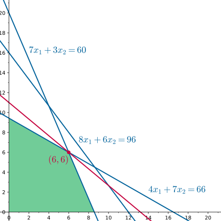
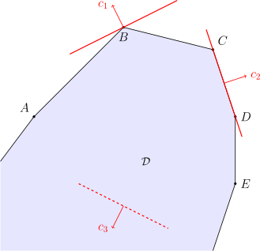

author: Ir1d, YZircon, huhaoo, QAQAutoMaton, Enter-tainer, Marcythm, sshwy, partychicken, Konano, H-J-Granger, baker221, isdanni, ksyx

## 引入

线性规划（linear programming, LP）是研究线性约束条件下线性目标函数最值问题的方法总称，是运筹学的一个分支，在多方面均有应用。线性规划的某些特殊情况，如网络流、多商品流量等问题都有可能在算法竞赛题目中出现。算法竞赛很少会出现只能用线性规划算法解决的问题，绝大多数这类问题可以通过网络流建模等方法更高效地解决。

### 一个简单的例子

一个问题能够写成线性规划的形式，既要有若干个线性约束条件，又要有线性的目标函数。

考虑下面的例子：

???+ example "例子"
    早点师傅每天可以制作一定数量的包子和油条，这两种早餐深受顾客喜爱。为了最大化利润，师傅希望尽可能多地制作早点，但在实际操作中受到食材、时间等多种资源的限制。为此，师傅统计了制作每份早点所需的食材用量、制作时间及其对应的利润，具体如下表所示：
    
    |  早点 | 植物油 |  面粉 |  时间 |  利润 |
    | :-: | :-: | :-: | :-: | :-: |
    |  包子 | $4$ | $7$ | $8$ | $5$ |
    |  油条 | $7$ | $3$ | $6$ | $6$ |
    
    假设师傅每天最多可以购入 $66$ 单位的植物油和 $60$ 单位的面粉，并且最多可以投入 $96$ 单位的制作时间。那么，师傅应如何合理安排包子和油条的生产数量，才能使每天的利润最大化？

用数学语言描述，可以设 $x_1$ 和 $x_2$ 分别是师傅制作包子和油条的数量。那么，「总共需要的植物油不超过 $66$ 单位」就可以表示为

$$
4x_1 + 7x_2 \le 66.
$$

类似地，「总共需要的面粉不超过 $60$ 单位」和「总共需要的时间不超过 $96$ 单位」可以表示为

$$
\begin{aligned}
7x_1 + 3x_2 &\le 60,\\
8x_1 + 6x_2 &\le 96.
\end{aligned}
$$

另外，师傅不可能生产出负数单位的早点，所以，还有条件

$$
x_1,x_2\ge 0.
$$

师傅就是要在这些限制下，最大化利润：

$$
z = 5x_1 + 6x_2.
$$

这就是一个典型的线性规划问题。它的目标函数是关于决策变量的线性函数，约束条件则由决策变量构成的线性等式或不等式组成。

### 图解法

对于只有两个决策变量的线性规划问题，可以通过图解法直观地解决问题。

考虑本节的问题

$$
\begin{aligned}
\max_{x_1,x_2}\;& z = 5x_1 + 6x_2 \\
\text{subject to } & 4x_1 + 7x_2 \le 66,\\
& 7x_1 + 3x_2 \le 60,\\
& 8x_1 + 6x_2 \le 96,\\
& x_1,x_2\ge 0
\end{aligned}
$$

对应的几何图像。最后一行约束表示可选的点 $(x_1,x_2)$ 都出现在第一象限，另外的三个约束则表示可选的点一定在直线 $4x_1 + 7x_2 = 66$、直线 $7x_1 + 3x_2 = 60$ 和直线 $8x_1 + 6x_2 = 96$ 的下方。这些区域的交集（如下图绿色区域所示）就是所有可供选择的点的集合：

接下来要最大化 $z=5x_1+6x_2$ 的取值。如果将该等式视作直线 $5x_1+6x_2=z$ 的方程，则随着 $z$ 的变化，将得到一族平行直线，且 $z$ 越大，直线就越靠近右上方。因此，只需要不断移动直线直至达到某一临界位置，使得再向右上移动一点点，直线就不再和图中所示区域相交，此时直线对应的 $z$ 就是所求的最大值。

如图所示，这样的情形发生在红点所示位置。它是直线 $4x_1 + 7x_2 = 66$ 和直线 $7x_1 + 3x_2 = 60$ 的交点。联立两直线方程可知，它的坐标是 $(6,6)$。这是本问题唯一的最优解。早点师傅的最大利润是 $z=66$。

当问题涉及多于两个决策变量时，图解法不再适用。但是，本节的例子中的一些观察仍然有效。线性规划问题中的每个不等式约束都描述了一个「半平面」，所有可行的解的集合就是这些「半平面」的交集，因此，总是一个「凸多边形」。规划问题的最优解总是可以在该「凸多边形」的某个「顶点」处取得。这些「顶点」的左边可以通过联立这些「半平面」的「边界」的方程求得。将这些观察拓展到高维空间，就发展出了一个高效的求解线性规划问题的方法——单纯形法。这也是算法竞赛中最常应用的方法。

另外一个值得注意的问题是，原则上，早点师傅制作的包子和油条都不是无限可分的，应当是某个整数。虽然本题求解过程中没有明确地限制这一点，但是由于最终的最优解的确是整数，所以，即使加上整数限制，本题的答案仍然是可行的。但是对于很多规划问题，最优解可能无法取得在整点处，这些问题实际上是一类整数规划问题，而非简单的线性规划问题。本文的结尾简单地讨论了这一类问题。

## 基本概念

本节介绍线性规划问题的基本概念。

### 线性规划问题

一个线性规划问题 $P$ 通常由如下两部分组成：

-   线性目标函数，即形如

    $$
    f(x_1,x_2,\cdots,x_n)=c_1x_1+c_2x_2+\cdots+c_nx_n
    $$

    的函数，其中，$c_i\in\mathbf R$ 是常数；

-   线性约束，即形如

    $$
    g_j(x_1,x_2,\cdots,x_n)=a_{j1}x_1+a_{j2}x_2+\cdots+a_{jn}x_n \le (=,\ge) b_j
    $$

    的不等式或等式约束，其中，$a_{ji},b_j\in\mathbf R$ 都是常数。

线性规划问题，就是要在满足所给约束的前提下，最大化或者最小化目标函数。满足所给约束的解 $(x_1,x_2,\cdots,x_n)\in\mathbf R^n$ 称为 **可行解**（feasible solution）；在所有可行解中，使得目标函数取得最值的解称为 **最优解**（optimal solution）。

### 标准形式

为了方便描述和进一步处理，通常需要指定一个线性规划问题的标准形式。不同文献可能有不同的规定方式，本文规定线性规划的标准形式如下：

$$
\begin{aligned}
\min_{\{x_i\}}\;& \sum_{i=1}^n c_ix_i \\
\text{subject to }& \sum_{i=1}^n a_{ji}x_i = b_i \ge 0,~j=1,\cdots,m,\\
& x_i \ge 0,~i = 1,\cdots,n.
\end{aligned}
$$

也就是说，线性规划问题是最小化问题，所有决策变量都有非负约束，且除此之外只包含若干右侧常量非负的等式约束。利用 [矩阵](./linear-algebra/matrix.md) 可以更为简洁地表达这一问题：

$$
\max\{c^Tx : Ax = b \ge 0,~ x\ge 0\}.
$$

其中，$x=(x_i)\in\mathbf R^n$ 是决策变量，$b=(b_j)\in\mathbf R^m$ 和 $A=(a_{ji})\in\mathbf R^{m\times n}$ 是约束中涉及的常量。线性规划问题的规模就是指它的决策变量的数目和它的约束的个数。

???+ tip "向量不等式"
    本文中会多次出现像 $b \ge 0$ 这样的向量不等式。一般地，对于向量 $x,y\in\mathbf R^n$，不等式 $x\le y$ 表示 $\forall i(x_i\le y_i)$，即逐维地进行实数意义上的比较。这一关系是向量空间上的 [偏序关系](./order-theory.md#二元关系)，也就是说，存在两个向量无法比较的情形。

标准形式的选取只是为了行文方便，而并没有任何特别之处，因为任何线性规划问题都可以等价地写成下面的六种形式：

$$
\begin{aligned}
&\min\{c^Tx : Ax = b,~ x\ge 0\},\\
&\min\{c^Tx : Ax \ge b\},\\
&\min\{c^Tx : Ax \ge b,~ x\ge 0\},\\
&\max\{c^Tx : Ax = b,~ x\ge 0\}, \\
&\max\{c^Tx : Ax \le b\},\\
&\max\{c^Tx : Ax \le b,~ x\ge 0\}.\\
\end{aligned}
$$

下列操作可以将所有线性规划问题都等价地转化为这六种形式之一：

1.  通过添加负号，即将 $c$ 变为 $-c$，就可以完成最大化问题和最小化问题的相互转化。
2.  通过添加负号，即将 $a_j^Tx \lesseqqgtr b_j$ 替换成 $-a_j^Tx \gtreqqless -b_j$，就可以完成不等式约束的两种方向的相互转化，或将等式约束的右侧常量变为非负数。
3.  所有的等式约束 $a_j^Tx = b_j$ 都可以替换成两个相反方向的不等式约束 $a_j^Tx \ge b_j$ 和 $a_j^Tx \le b_j$。
4.  所有的不等式约束 $a_j^Tx \le(\ge) b_j$ 都可以通过添加非负松弛变量 $s_j$ 的方式，转化为等式约束 $a_j^Tx +(-) s_j = b_j$ 以及相应的非负约束 $s_j\ge 0$。
5.  如果某个决策变量 $x_i$ 没有非负约束，那么，可以将它替换成两个非负变量的差值，即 $x_j = x^+_j - x^-_j$ 且 $x^+_j,x^-_j \ge 0$。

通过这些操作转化得到的线性规划问题的规模不超过原问题的规模的二倍，而且这些问题的可行解和最优解都很容易相互转化。因此，对于一般形式的线性规划问题，总是可以首先将它转化为标准形式（或上述六种形式之一）再进行求解。

??? example "例子"
    考虑线性规划问题
    
    $$
    \begin{aligned}
    \max\;& 3x_1 - 2x_2 + x_3 \\
    \text{subject to }& 2x_1 + 3x_2 + 4x_3 \ge 1,\\
    & 3x_1 + 4x_2 \le 5,\\
    & 5x_2 - x_3 = -1, \\
    & x_1, x_2 \ge 0.
    \end{aligned}
    $$
    
    通过操作 1、2 和 3 可以将它转化为形式 $\min\{c^Tx : Ax \ge b\}$，即
    
    $$
    \begin{aligned}
    \min\;& -3x_1 + 2x_2 - x_3 \\
    \text{subject to }& 2x_1 + 3x_2 + 4x_3 \ge 1,\\
    & -3x_1 - 4x_2 \ge -5,\\
    & 5x_2 - x_3 \ge -1, \\
    & -5x_2 + x_3 \ge 1, \\
    & x_1 \ge 0,\\
    & x_2 \ge 0.
    \end{aligned}
    $$
    
    通过操作 4 和 5 可以将它转化为形式 $\max\{c^Tx : Ax = b,~ x\ge 0\}$，即
    
    $$
    \begin{aligned}
    \max\;& 3x_1 - 2x_2 + x^+_3 - x^-_3 \\
    \text{subject to }& 2x_1 + 3x_2 + 4x^+_3 - 4x^-_3 - x_4 = 1,\\
    & 3x_1 + 4x_2 + x_5 = 5,\\
    & 5x_2 - x^+_3 + x^-_3 = -1, \\
    & x_1, x_2, x^+_3, x^-_3, x_4, x_5 \ge 0.
    \end{aligned}
    $$

### 可行域与问题的解

所有可行解的集合 $\mathcal D\subseteq\mathbf R^n$ 称为线性规划问题 $P$ 的 **可行域**（feasible region）。从几何角度看，每个不等式约束 $a_j^T x \le b_j$ 都描述了一个半空间 $\{x\in\mathbf R^n:a_j^T x \le b_j\}$，每个等式约束 $a^T_jx = b_j$ 都描述了一个超平面 $\{x\in\mathbf R^n:a_j^Tx=b_j\}$，所以，可行域一定是有限多个半空间和超平面的交集。在优化领域[^poly-names]，这样的几何体通常称为 $\mathbf R^n$ 中的 **多面体**（polyhedron）。多面体一定是闭凸集，但未必是有界的。有界的多面体也称为 **多胞形**（polytope）。多胞形可以看作是平面上的多边形在高维空间的推广，而多面体将它进一步推广到可能无界的情形。

???+ example "多面体的例子"
    此处列举了一些常见的多面体：
    
    1.  空集 $\varnothing$，又称为 **零胞形**（nullitope），维度规定为 $-1$。
    2.  **仿射子空间**（affine subspace），即若干超平面的交集 $\{x\in\mathbf R^n:Ax = b\}$。它相当于线性方程组 $Ax = b$ 的解集：当方程组无解时，它就是空集；否则，它总是可以写成 $x_0+V$ 的形式，其中，$x_0\in\mathbf R^n$ 且 $V\subseteq\mathbf R^n$ 是 $n-\operatorname{rank}(A)$ 维线性子空间。特别地，超平面也是仿射子空间。
    3.  **多面体锥**（polyhedral cone），即空间中有限多个点 $\{x_i\}$ 的全体非负线性组合 $\{\sum_i\alpha_ix_i:\alpha_i\ge 0\}$。它是顶点位于原点的凸锥体。等价地，它可以看作是由若干个经过原点的超平面围成的多面体，即 $\{x\in\mathbf R^n : Ax\le 0\}$。特别地，半空间也是多面体锥。
    4.  多胞形，即有界的多面体。特别地，$-1$、$0$、$1$、$2$、$3$ 维的多胞形就是常见的空集、点、线段、多边形和（通常意义下的）多面体。一个集合是多胞形，当且仅当它是有限多个点 $\{x_i\}$ 的凸包 $\{\sum_i\alpha_ix_i:\alpha_i\ge 0,~\sum_i\alpha_i=1\}$。一个 $k$ 维的多胞形至少是由 $k+1$ 个点生成的凸包。
    5.  **单纯形**（simplex），即恰由 $k+1$ 个点生成的 $k$ 维多胞形。它是最简单的 $k$ 维多胞形。特别地，$-1$、$0$、$1$、$2$、$3$ 维的多胞形分别是空集、点、线段、三角形和四面体。最简单的 $k$ 维单纯形的例子，就是 $\{x\in\mathbf R^k:x_i\ge 0,~\sum_ix_i=1\}$。实际上，任何 $k$ 维单纯形都可以通过仿射变换（即平移和伸缩）变为这样一种特殊情形。值得注意的是，单纯形法并不是真的在单纯形上进行的。
    
    任何多面体，都可以看作是一个多面体锥和一个多胞形的 [Minkowski 和](../geometry/convex-hull.md#闵可夫斯基和)：前者描述了多面体无界的部分，后者描述了多面体有界部分的形状。这个多面体锥是唯一的：多面体 $\{x\in\mathbf R^n:Ax\le b\}$ 分解得到的多面体锥一定是 $\{x\in\mathcal R^n:Ax\le 0\}$。

线性规划的解与多面体的结构紧密相关。对于多面体 $\mathcal D\in\mathbf R^n$ 和向量 $c\in\mathbf R^n\setminus\{0\}$，考虑如下的线性规划问题 $P$：（对最小化的情形也可以类似地讨论）

$$
\max\{c^Tx:x\in\mathcal D\}.
$$

从几何角度看，这相当于在超平面 $H:c^Tx = z$ 与可行域 $\mathcal{D}$ 至少有一个交点的前提下，沿着向量 $c$ 的方向移动超平面 $H$，使得 $z$ 尽可能大。这就存在三种可能性：

-   可行域 $\mathcal D$ 是空集。这说明问题 $P$ 没有可行解，它的某些约束是相互矛盾的。此时，称问题 $P$ 是 **不可行的**（infeasible），它的最优价值规定为 $-\infty$。

-   可行域 $\mathcal D$ 非空，但是它包含一条方向向量为 $c$ 的射线，即存在 $x_0\in\mathbf R^n$ 使得 $x_0+tc\in\mathcal D$ 对于所有 $t\ge 0$ 都成立。因为沿着向量 $c$ 的方向可以不断地移动超平面 $H$，而且移动过程中，集合 $H\cap\mathcal D$ 至少含有这条射线中的某个点，一定是非空的，所以，目标函数 $c^Tx = c^Tx_0 + tc^Tc$ 可以取得任意大的值。此时，称问题 $P$ 是 **无界的**（unbounded），它的最优价值规定为 $+\infty$。

-   可行域 $\mathcal D$ 非空，且不含有任何方向向量为 $c$ 的射线。此时，问题 $P$ 称为 **有界的**（bounded）。记 $z^*\in\mathbf R$ 为问题 $P$ 的最优价值。超平面 $H^*:c^Tx = z^*$ 处于一种临界位置：它与多面体 $\mathcal D$ 相交，且 $\mathcal D$ 包含于半空间 $\{x:c^Tx\le z^*\}$ 中。这样的超平面称为多面体 $\mathcal D$ 的一个 **支撑超平面**（supporting hyperlane）。问题 $P$ 的最优解集就是 $H^*\cap\mathcal D$。作为支撑超平面和多面体的交集，集合 $H^*\cap\mathcal D$ 一定是多面体，且包含在 $\mathcal D$ 的边界中。它称为多面体 $\mathcal D$ 的一个 **面**（face）。形象地说，多面体就是由这些面围成的。除了这些由支撑超平面和多面体相交形成的面之外，一般来说，多面体还有两个面：空集和多面体本身。多面体的所有面在集合的包含关系下，形成了 [格](../math/order-theory.md#有向集与格) 的结构。

    一个 $d$ 维的多面体的面的维度一定是 $0$ 和 $d$ 之间的整数。维度为 $0$ 的面（即一个点）称为多面体 $\mathcal D$ 的 **顶点**（vertex）或 **角点**（corner point），维度为 $1$ 的面称为多面体 $\mathcal D$ 的 **边**（edge），维度为 $d-1$ 的面则称为多面体 $\mathcal D$ 的 **维面**（facet）。但是，并非所有多面体都有顶点。因为多面体的面的面仍然是多面体的面，而只有仿射子空间才没有严格更小的非空面，所以，多面体 $\mathcal D$ 的所有极小面都是仿射子空间。而且，同一个多面体的极小面的维度是相同的；特别地，多面体 $\mathcal D=\{x\in\mathbf R^n:Ax\le b\}$ 的极小面的维度是 $n-\operatorname{rank}A$。

    因为多面体的面就是有界线性规划问题的解集，所以，需要搞清楚如何确定多面体的面的方程。设多面体 $\mathcal D$ 由若干个约束 $a_j^Tx \lesseqqgtr b_j$ 描述，且 $F$ 是 $\mathcal D$ 的一个面。如果某个约束在所有 $x\in F$ 处都取得等号，就称该约束在面 $F$ 上是 **紧的**（tight）。面 $F$ 上的点显然满足这些紧约束取等号得到的方程组，而这个方程组确定的仿射子空间和多面体 $\mathcal D$ 的交集，就是面 $F$。反过来，任意选取多面体 $\mathcal D$ 的约束的一个子集，将这些约束取等、联立、求解得到的仿射子空间和多面体的交集，就是 $\mathcal D$ 的一个面。而且，选取的紧约束越多，得到的面（在包含意义下）就越小。

    特别地，标准形式的线性规划的可行域 $\mathcal D=\{x\in\mathbf R^n:Ax=b,~x\ge 0\}$ 的系数矩阵 $\begin{pmatrix}A\\ I\end{pmatrix}$ 的秩是 $n$，因此，它的极小面就是它的顶点。也就是说，如果问题有界，那么它的最优解一定可以选取为某个顶点。而且，这个顶点可以通过选取 $n$ 个线性独立的紧约束联立得到。这正是线性规划的标准形式的方便之处。

???+ example "例子"
    下图中，$\mathcal D$ 为可行域。目标函数中的系数是 $c_1,c_2,c_3$ 时，分别对应着唯一最优解、多组最优解和无界三种情形。对于前两种情形，相应的红色粗实线就是解集对应的支撑超平面（之一），最优解集分别是多面体 $\mathcal D$ 的顶点 $B$ 和边 $\overline{CD}$。对于第三种情形，因为可行域 $\mathcal D$ 中包含方向为 $c_3$ 的射线，所以，以 $c_3$ 为法向量的超平面可以不断沿着 $c_3$ 方向移动，进而问题是无界的。
    
    

这些讨论忽略了 $c=0$ 的情形。此时，线性规划问题显然不能是无界的，所以要么问题本身是不可行的，要么最优价值等于 $0$，且最优解集就是 $\mathcal D$ 本身。这类特殊的线性规划也称为 **可行性线性规划**（feasibility linear programming）。

值得指出的是，判定线性规划问题是否可行、是否有界，以及求出不等式组的可行解等问题，都和解线性规划问题本身同样困难[^reducible]。比如说，下文中强对偶定理的证明就说明，解一个有界的线性规划问题，就相当于寻找一组不等式的可行解。因此，对于判断不等式组是否有解和判断方程组是否有非负解等任务，最有效的方式就是求解相应的可行性线性规划[^other-methods]。

另外，如果线性规划问题的一个约束，在可行域的所有面上都不是紧的，那么这个约束就是 **冗余的**（redundant）。本文开头早点师傅的例子中，工作时间的约束就是一个冗余约束。在给定的不等式组中判定某个不等式 $a_j^Tx\le b_j$ 是否冗余这一问题，可以通过求解线性规划问题 $\max\{a_j^Tx:x\in\mathcal D\}$，并将它与 $b_j$ 相比较来解决。

## 常见算法

算法竞赛中，很少有问题只能通过线性规划的算法解决。大多数可以用线性规划方法求解的题目，通常也可以通过网络流等更为专门也更为高效的算法来解决。

解决线性规划问题的常见算法如下：

-   [单纯形法](./simplex.md)
-   椭球法
-   内点法

尽管单纯形法的最差情形复杂度是指数级的，而内点法的复杂度是多项式的，但这两类算法在大多数实际问题中的表现都非常出色。相比之下，虽然椭球法的理论复杂度是多项式级别的，但是通常运行缓慢，并不实用。

目前尚不清楚线性规划问题是否存在强多项式复杂度的算法。

## 对偶问题

每个线性规划问题都对应着一个对偶问题。原问题和对偶问题的解有着紧密的联系。通过对偶问题，不仅有助于更深入地理解问题的结构，还常常可以提升原问题的求解效率。

对于线性规划问题 $P$（所涉小写字母变量均为向量）

$$
\begin{aligned}
\min_{x_1,x_2,x_3}\;& c_1^Tx_1 + c_2^Tx_2 + c_3^Tx_3 \\
\text{subject to }& A_{11}x_1 + A_{12}x_2 + A_{13}x_3 \ge b_1,\\
& A_{21}x_1 + A_{22}x_2 + A_{23}x_3 = b_2,\\
& A_{31}x_1 + A_{32}x_2 + A_{33}x_3 \le b_3,\\
& x_1\ge 0,~ x_3\le 0,
\end{aligned}
$$

它的对偶问题 $D$ 是指线性规划问题

$$
\begin{aligned}
\max_{y_1,y_2,y_3}\;&b_1^Ty_1+b_2^Ty_2+b_3^Ty_3 \\
\text{subject to }&A_{11}^Ty_1 + A_{21}^Ty_2 + A_{31}^Ty_3\le c_1,\\
&A_{12}^Ty_1 + A_{22}^Ty_2 + A_{32}^Ty_3 = c_2,\\
&A_{13}^Ty_1 + A_{23}^Ty_2 + A_{33}^Ty_3 \ge c_3,\\
&y_1\ge 0,~ y_3\le 0.
\end{aligned}
$$

其中，对偶问题的决策变量 $y_1,y_2,y_3$ 分别是原问题的三类约束的 Lagrange 乘子；反过来，原问题的决策变量 $x_1,x_2,x_3$ 也分别是对偶问题的三类约束的 Lagrange 乘子。容易验证，对偶问题的对偶问题就是原问题。

原问题 $P$ 和对偶问题 $D$ 的对应关系如下：

|  最小化问题 |  最大化问题 |
| :----: | :----: |
| 大于等于约束 |  非负变量  |
| 小于等于约束 |  非正变量  |
|  等式约束  |  无约束变量 |
|  非负变量  | 小于等于约束 |
|  非正变量  | 大于等于约束 |
|  无约束变量 |  等式约束  |
| 目标函数系数 | 约束右侧常量 |
| 约束右侧常量 | 目标函数系数 |

特别地，标准形式的线性规划问题

$$
\min\{c^Tx:Ax=b,~x\ge 0\}
$$

的对偶问题是

$$
\max\{b^Ty:A^Ty\le c\}.
$$

### 对偶原理

原问题和对偶问题不仅在形式上互为镜像，而且两者的解也紧密相关。这称为 **对偶原理**（duality principal）。为表述方便，本节在叙述和证明定理时，将采用标准形式的原问题。

首先，**弱对偶定理**（weak duality theorem）说明，对偶问题的最大值不超过原问题的最小值。

???+ note "弱对偶定理"
    对于所有 $A\in\mathbf R^{m\times n}$，$b\in\mathbf R^m$ 和 $c\in\mathbf R^n$，总有
    
    $$
    \max\{b^Ty:A^Ty\le c\} \le \min\{c^Tx:Ax=b,~x\ge 0\}.
    $$

??? note "证明"
    如果原问题和对偶问题中的任何一个不可行，那么该不等式就是平凡的。假设两个问题都是可行的。那么，对于所有可行的 $x$ 和 $y$，都有
    
    $$
    b^Ty = x^TA^Ty \le x^Tc.
    $$
    
    因此，将两侧取最值，就得到弱对偶定理成立。

基于弱对偶定理，原问题和对偶问题的解的情况只能有下面四种情形：

1.  原问题和对偶问题均不可行，即 $-\infty\le+\infty$；
2.  原问题不可行，对偶问题无界，即 $+\infty\le+\infty$；
3.  原问题无界，对偶问题不可行，即 $-\infty\le-\infty$；
4.  原问题和对偶问题均有界。

弱对偶定理有很多推论。例如，它实际上给出了利用原问题和对偶问题的可行性判定原问题无界的方法。

???+ note "推论"
    线性规划问题无界，当且仅当它可行，且它的对偶问题不可行。

将弱对偶定理应用于可行性线性规划问题，就得到 Farkas 引理（和它的各种变体）。

???+ note "Farkas 引理"
    对于 $A\in\mathbf R^{m\times n}$ 和 $b\in\mathbf R^n$，下列情形中恰有一种成立：
    
    1.  存在 $x\in\mathbf R^n$，使得 $Ax=b$ 且 $x\ge 0$；
    2.  存在 $y\in\mathbf R^m$，使得 $A^T y\ge 0$ 且 $b^Ty<0$。

??? note "证明"
    考虑线性规划问题 $\max\{0:Ax=b,~x\ge 0\}$，它的对偶问题是 $\min\{b^Ty:A^Ty\ge 0\}$。对偶问题显然是可行的，因为至少 $0\in\mathbf R^m$ 是一组可行解。因此，根据弱对偶定理，要么原问题可行，要么对偶问题无界，二者必择其一。原问题可行就是 Farkas 引理中的情形 1，而对偶问题无界就等价于 Farkas 引理中的情形 2。这就证明了 Farkas 引理。

Farkas 实际上是一种 [超平面分离定理](https://en.wikipedia.org/wiki/Hyperplane_separation_theorem)。情形 1 是在说，点 $b$ 位于 $A$ 的列向量生成的多面体锥 $C$ 里；因此，Farkas 引理说明，当且仅当点 $b$ 不在这一凸锥 $C$ 中时，存在经过原点且法向量为 $y$ 的超平面 $H:y^Tx = 0$ 强分离了点 $b$ 和多面体锥 $C$。

事实上，对于弱对偶定理允许的第四种情形，有更强的结论成立：原问题和对偶问题的最优值是相等的。将后三种情形合在一起，就得到 **强对偶定理**（strong duality theorem）：只要原问题或对偶问题之一是可行的，它们的最优值就必然相等。

???+ note "强对偶定理"
    对于所有 $A\in\mathbf R^{m\times n}$，$b\in\mathbf R^m$ 和 $c\in\mathbf R^n$，都有
    
    $$
    \max\{b^Ty:A^Ty\le c\} = \min\{c^Tx:Ax=b,~x\ge 0\}.
    $$
    
    只要两个集合之一非空。

??? note "证明"
    弱对偶定理唯一没有包含的情形，就是原问题和对偶问题都可行的情形。此时，考虑如下可行性线性规划问题 $Q$：
    
    $$
    \max\{0:c^Tx \le b^Ty,~Ax=b,~x\ge 0,~A^Ty\le c\}.
    $$
    
    如果问题 $Q$ 有可行解 $(x^*,y^*)\in\mathbf R^n\times\mathbf R^m$，那么，由弱对偶定理和最优性可知
    
    $$
    b^Ty^* \le \max\{b^Ty:A^Ty\le c\} \le \min\{c^Tx:Ax=b,~x\ge 0\} \le c^Tx^*,
    $$
    
    但是 $c^Tx^*\le b^Ty^*$，故而所有这些不等式都可以取得等号，也就是说，不仅强对偶成立，而且 $x^*$ 和 $y^*$ 分别是原问题和对偶问题的最优解。
    
    因此，只需要证明问题 $Q$ 是可行的。假设不然。仿照 Farkas 引理的证明，可以考虑问题 $Q$ 的对偶问题 $DQ$：
    
    $$
    \min\{c^T\mu - b^T\lambda : ct - A^T\lambda \ge 0,~ -bt + A\mu = 0,~t\ge 0,~\mu\ge 0\}.
    $$
    
    因为 $(t,\lambda,\mu)=(0,0,0)$ 是对偶问题 $DQ$ 的一组可行解，所以由弱对偶定理可知，问题 $Q$ 不可行，就意味着对偶问题 $DQ$ 无界，即存在一组 $(t^*,\lambda^*,\mu^*)$ 使得
    
    $$
    c^T\mu^* - b^T\lambda^* <0,~ ct^* - A^T\lambda^* \ge 0,~ -bt^* + A\mu^* = 0,~t^*\ge 0,~\mu^*\ge 0.
    $$
    
    此时，如果 $t^*>0$，那么这些不等式实际说明 $(x,y)=(\mu^*/t^*,\lambda^*/t^*)$ 是前述问题的一组可行解，与假设矛盾。所以，只能有 $t^*=0$。这说明
    
    $$
    c^T\mu^* < b^T\lambda^*,~ A^T\lambda^*\le 0,~ A\mu^*=0,~\mu^*\ge 0.
    $$
    
    但是，因为已经假设定理中的原问题和对偶问题都可行，也就是说，存在 $(x_0,y_0)$ 使得
    
    $$
    Ax_0 = b,~ x_0\ge 0,~ A^Ty_0\le c
    $$
    
    成立，所以，有
    
    $$
    0 = (A\mu^*)^Ty_0 = (A^Ty_0)^T\mu^* \le c^T\mu^* < b^T\lambda^* = x_0^TA^T\lambda^* \le 0.
    $$
    
    这显然矛盾。这一矛盾说明问题 $Q$ 是可行的，进而说明强对偶成立。

从强对偶定理的证明过程还能得到如下推论：

???+ note "推论"
    设原问题和对偶问题的一组可行解 $x^*$ 和 $y^*$ 满足强对偶性，即 $c^Tx^* = b^Ty^*$。那么，它们同样分别是原问题和对偶问题的最优解。

强对偶定理说明，对于可行的线性规划问题，只需要求解它的对偶问题，就能够得到原问题的最优价值。

### 互补松弛条件

和其它的优化问题一样，互补松弛条件是线性规划问题的最优性条件的一部分。而且，因为目标函数是线性的，所以对于线性规划问题来说，互补松弛条件是可行解成为最优解的充分必要条件。

所谓 **互补松弛**（complementary slackness）条件，就是指只有在原问题（对偶问题）中的约束取得等号（即约束是紧的）的时候，对偶问题（原问题）中与之对应的变量才能取非零值。如果将变量取非零值也当成一条松弛的约束，那么这就相当于说，原问题和对偶问题中相对应的变量和约束不能同时是松弛的。因此，这一条件称为互补松弛条件。

以标准形式的线性规划问题为例，如下结论成立：

???+ note "定理"
    假设 $x^*$ 和 $y^*$ 分别是原问题 $\min\{c^Tx:Ax=b,~x\ge 0\}$ 和对偶问题 $\max\{b^Ty:A^Ty\le c\}$ 的可行解。那么，当且仅当互补松弛条件成立，即
    
    $$
    x^T(A^Ty-c) = 0
    $$
    
    时，$x^*$ 和 $y^*$ 也分别是原问题和对偶问题的最优解。

??? note "证明"
    因为 $x^*$ 和 $y^*$ 都是可行解，所以，有
    
    $$
    b^Ty^* - c^Tx^* = (x^*)^T(A^T y^* - c).
    $$
    
    因此，互补松弛条件成立，当且仅当 $b^Ty^* = c^Tx^*$。根据强对偶定理的推论，这一条件成立，当且仅当 $x^*$ 和 $y^*$ 分别是原问题的最优解。

标准形式可能太过特殊。该定理的稍微一般的形式如下：

???+ note "定理"
    假设 $x^*$ 和 $y^*$ 分别是原问题 $\min\{c^Tx:Ax\ge b,~x\ge 0\}$ 和对偶问题 $\max\{b^Ty:A^Ty\le c,~y\ge 0\}$ 的可行解。那么，当且仅当互补松弛条件成立，即
    
    $$
    x^T(A^Ty-c) = y^T(Ax-b) = 0
    $$
    
    时，$x^*$ 和 $y^*$ 也分别是原问题和对偶问题的最优解。

??? note "证明"
    证明基本同上，只是这次要将差值写成
    
    $$
    b^Ty^* - c^Tx^* = (x^*)^T(A^T y^* - c) - (y^*)^T(Ax^*-b).
    $$

互补松弛条件提供了判断线性规划问题的可行解的最优性的简单条件。

### 原始‑对偶方法

对偶问题可以辅助原问题的求解。在解决线性规划问题时，常常会用到的一种方法是 **原始‑对偶方法**（primal-dual method）。它通过求解一系列相对简单的辅助问题，逐步改进对偶问题的解，进而获得原始问题的最优解。

对于标准形式的原问题

$$
(P)\qquad\min\{c^Tx : Ax=b\ge 0,~ x\ge 0\}
$$

和它的对偶问题

$$
(D)\qquad\max\{b^Ty : A^Ty\le c\},
$$

上一节已经说明，要找到它们的最优解，只需要找到问题 $(P)$ 和 $(D)$ 的一组可行解，使得它们满足互补松弛条件 $x^T(A^Ty-c)=0$。那不妨考虑如下流程：

1.  从对偶问题 $(D)$ 的一个可行解 $y$ 出发，计算对偶问题的紧约束的集合

    $$
    I = \{i : (A^Ty - c)_i = 0\}.
    $$

2.  根据互补松弛条件，如果存在问题 $(P)$ 的可行解 $x$ 使得 $x_i>0$ 仅在 $i\in I$ 上成立，就意味着已经找到一组最优解。因此，考虑线性规划问题

    $$
    (RP)\qquad
    \begin{aligned}
    \min_{x,s}\;& \mathbf 1^Ts \\
    \text{subject to } & Ax + s = b, \\
    & x_i \ge 0,~\forall i \in I,\\
    & x_i = 0,~\forall i \notin I,\\
    & s \ge 0.
    \end{aligned}
    $$

3.  如果问题 $(RP)$ 的最小值是 $0$，那么最优解 $(x^*,0)$ 中的 $x^*$ 就是原问题 $(P)$ 的最优解。否则，可以求出它的对偶问题 $(DRP)$ 的解 $\bar y$：

    $$
    (DRP)\qquad
    \begin{aligned}
    \max_{y}\;& b^Ty \\
    \text{subject to }& \sum_{j}a_{ji}y_j \le 0,~\forall i\in I,\\
    & y \le 1.
    \end{aligned}
    $$

    根据强对偶定理可知，$b^T\bar y = 1^Ts^*>0$。

4.  根据问题 $(DRP)$ 的解改进对偶问题 $(D)$ 的可行解。设 $y' = y + \varepsilon \bar y$，其中，$\varepsilon>0$，则一定有 $b^Ty' = b^Ty + \varepsilon b^T\bar y > b^Ty$。因此，只要保证 $y'$ 仍然是对偶问题的可行解 $(D)$，就要尽可能大地选取 $\varepsilon$ 的值。

    对于 $i\in I$，有

    $$
    \sum_ja_{ji}y'_j = \sum_ja_{ji}y_j + \varepsilon \sum_ja_{ji}\bar y_j \le c_i,
    $$

    所以，问题 $(D)$ 的这些约束总是可以满足的。

    对于剩下的约束，即 $i\notin I$ 时，只需要取

    $$
    \varepsilon = \min\left\{\dfrac{c_i - \sum_{j}a_{ji}y_j}{\sum_{j}a_{ji}\bar y_j}:i\notin I,~\textstyle\sum_{j}a_{ji}\bar y_j>0\right\}
    $$

    就可以在保证可行性的前提下，尽可能大地改进对偶问题的解，然后回到步骤 1 继续迭代。特别地，如果上式中的集合为空集，即 $\varepsilon=+\infty$，那么，对偶问题 $(D)$ 无界，原问题 $(P)$ 不可行。

这个过程中其实只有问题 $(DRP)$ 是确实需要求解的，它与问题 $(RP)$ 通过强对偶定理相互联系。问题 $(DRP)$ 提供了一个改进对偶问题解的方向，而且相对于对偶问题 $(D)$ 本身，问题 $(DRP)$ 的形式更加简单。问题 $(DRP)$ 的可行性由 Farkas 引理保证，而约束 $y\le 1$ 只是一组规范化条件，保证了问题 $(DRP)$ 有界。

算法竞赛中，原始‑对偶方法广泛地应用于各类组合优化问题。例如二分图最大权匹配的 [匈牙利算法](../graph/graph-matching/bigraph-weight-match.md#hungarian-algorithmkuhnmunkres-algorithm)、最小费用流的 [消圈算法](../graph/flow/min-cost.md) 和 [SSP 算法（原始‑对偶算法）](../graph/flow/min-cost.md#ssp-算法)、最短路的 [Dijkstra 算法](../graph/shortest-path.md#dijkstra-算法)、最大流的 [Ford–Fulkerson 增广算法](../graph/flow/max-flow.md#fordfulkerson-增广) 等，都可以看作是原始‑对偶方法的直接应用。

## 整数规划

**整数规划**（integer programming）通常指 **整数线性规划**（integer linear programming, ILP）。标准形式的整数线性规划如下：

$$
\begin{aligned}
\min_{x}\; & c^Tx \\
\text{subject to } & Ax = b \ge 0,\\
& x \ge 0,\\
& x \in \mathbf Z^n,
\end{aligned}
$$

其中，$A\in\mathbf R^{m\times n}$，$b\in\mathbf R^m$，$c\in\mathbf R^n$。也就是说，整数线性规划是在线性规划问题上添加决策变量必须为整数这一约束条件所得到的问题。

整数约束显著增加了整数规划问题的复杂性。许多组合优化问题，例如背包问题、适定性问题以及众多图论中的优化问题，都可以表示为整数规划模型，而这些问题中的多数被证明是 NP 困难的。

### 全幺模矩阵

正因如此，对于很多大规模的整数优化问题，有时候会考虑将它的整数约束松弛掉，转而求解一个线性规划问题。通常来说，松弛后的线性规划问题的最优价值只是原来的整数规划问题的一个下界估计（假设问题是最小化问题）。但是，如果松弛后的线性规划问题的最优解恰好是整数解，那么，它也一定是原来的整数规划问题的最优解。

一个自然的问题是，是否存在条件，能够保证线性规划问题的最优解都是整数解？全幺模矩阵的概念就提供了这样的一个条件。

???+ abstract "全幺模矩阵"
    如果矩阵 $A\in\mathbf R^{m\times n}$ 的所有子方阵的行列式都是 $0$ 或 $\pm 1$，那么，矩阵 $A$ 就称为一个 **全幺模矩阵**（totally unimodular matrix）。

特别地，全幺模矩阵的所有元素都是 $0$ 或 $\pm 1$。利用全幺模矩阵的概念，可以叙述如下结论：

???+ note "定理"
    对于全幺模矩阵 $A\in\mathbf Z^{m\times n}$，$b\in\mathbf Z^{m}$ 且 $c\in\mathbf Z^n$，线性规划问题及其对偶问题
    
    $$
    \min\{c^Tx : Ax=b,x\ge 0\} = \max\{b^Ty: A^Ty\le c\}
    $$
    
    都有整数最优解，只要它们都有界。

??? note "证明"
    前文已经说明，线性规划问题的最优解集可以取作它的一个极小面，而后者是由若干线性独立的紧约束作为等式联立得到的方程组的解：
    
    $$
    \{x\in\mathbf R^n : a_j^Tx = b_j,~\forall j\in J\}.
    $$
    
    记这个方程组为 $A_Jx=b_J$，且 $A_J=(A_1,A_2)$，其中，$A_1$ 是满秩的方阵，行列式为 $\pm 1$。那么，由 Cramer 法则，解
    
    $$
    x = \begin{pmatrix}A_1^{-1}b_J \\ 0\end{pmatrix}
    $$
    
    就是极小面上的一个整数解。

常见的图论模型中，网络流、最短路、二分图等对应的线性规划问题的系数矩阵都是全幺模矩阵。因此，只需要这些问题仅涉及整数参数，它们的最优解就可以取作整数，而不用担心线性规划问题的解对应着分数流、分数匹配等情形。所以，[最大流](../graph/flow/max-flow.md)、[最小割](../graph/flow/min-cut.md)、[最小费用流](../graph/flow/min-cost.md)、[最短路](../graph/shortest-path.md)、[差分约束](../graph/diff-constraints.md)、[二分图最大（权）匹配和最小点覆盖](../graph/graph-matching/bigraph-match.md#线性规划形式) 等问题，都可以转化为线性规划问题求解。而且，最大流与最小割、最短路与差分约束、二分图最大匹配和最小点覆盖，两两互为对偶问题。

除此之外，还有一些常见的图论模型，它所有的可行解恰巧是某个顶点均为整点的多胞形的全体顶点。因此，可以通过巧妙地选取约束，使得相应的组合优化问题的解，恰为某个线性规划问题的最优解。例如，一般图匹配和生成树等图论模型都属于这种情况，因此 [一般图最大（权）匹配](../graph/graph-matching/general-weight-match.md) 和 [最小生成树](../graph/mst.md) 等问题同样可以转化为线性规划问题。

## 参考文献与注释

-   Schrijver, Alexander. Theory of linear and integer programming. John Wiley & Sons, 1998.
-   Papadimitriou, Christos H., and Kenneth Steiglitz. Combinatorial optimization: algorithms and complexity. Courier Corporation, 1998.
-   [Duality in linear programming. Part 1—definition and construction. by adamant - Codeforces blog](https://codeforces.com/blog/entry/105049)
-   [Duality in linear programming. Part 2—in competitive programming. by adamant - Codeforces blog](https://codeforces.com/blog/entry/105789)

[^poly-names]: 不同文献可能对这两个名词的定义有着不同的定义：有些文献会将有界的情形称作「多面体」，而将无界的情形称作「多胞形」；有些文献不会假定它们一定是凸集；有些文献会用「多面体」称呼三维空间中的多胞形。本文采取了与 Schrijver (1998) 和 Boyd and Vandenberghe (2004) 等文献一致的定义。

[^reducible]: 更严格的表述是，它们之间可以在多项式时间内相互归约。

[^other-methods]: 其它用于解决不等式组的方法还包括 Fourier–Motzkin 消元法和 Agmon–Motzkin–Schoenberg 松弛法等。它们更为直接，但是效率往往不高。
