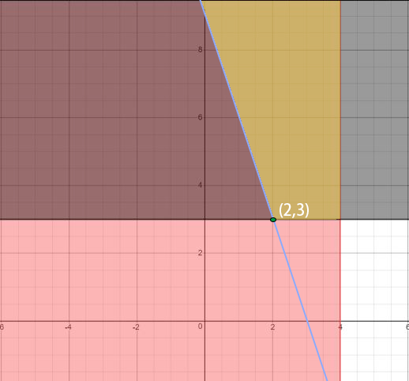

## 定义

研究线性约束条件下线性目标函数极值问题的方法总称，是运筹学的一个分支，在多方面均有应用。线性规划的某些特殊情况，如网络流、多商品流量等问题都有可能在 OI 题目中出现

## 线性规划问题的描述

一个问题要能转化为线性规划问题，首先要有若干个线性约束条件，并且所求的目标函数也应该是线性的。那么，最容易也最常用的描述方法就是标准型。

我们以 [《算法导论》](https://mitpress.ublish.com/ereader/1/?preview#page/Cover) 中线性规划一节提出的问题为例：

> 假如你是一位政治家，试图赢得一场选举，你的选区有三种：市区，郊区和乡村，这些选区分别有 100000、200000 和 50000 个选民，尽管并不是所有人都有足够的社会责任感去投票，你还是希望每个选区至少有半数选民投票以确保你可以当选
>
> 显而易见的，你是一个正直、可敬的人，然而你意识到，在某些选区，某些议题可以更有效的赢取选票。你的首要议题是修筑更多的道路、枪支管制、农场补贴以及调整汽油税。你的竞选班子可以为你估测每花费 $1000 做广告，在每个选区可以赢取或者失去的选票的数量（千人），如下表所示：

| 政策   | 市区  | 郊区  | 乡村  |
| ---- | --- | --- | --- |
| 修路   | -2  | 5   | 3   |
| 枪支管制 | 8   | 2   | -5  |
| 农场补贴 | 0   | 0   | 10  |
| 汽油税  | 10  | 0   | -2  |

你的目标是计算出要在市区，郊区和乡村分别获得至少 50000，100000 和 25000 张选票所花费的最少钱数。

我们可以使用数学语言来描述它：

$x_1$ 为花费在修路广告上的钱（千美元）

设 $x_2$ 为花费在枪支管制广告上的钱（千美元）

设 $x_3$ 为花费在农场补贴广告上的钱（千美元）

设 $x_4$ 为花费在汽油税广告上的钱（千美元）

那么我们可以将“在市区获得至少 50000 张市区选票”表述为

$-2x_1+8x_2+0x_3+10x_4 \geq 50$

同样的，“在郊区获得至少 100000 张选票和在乡村获得至少 25000 张选票”可以表示为

$5x_1+2x_2+0x_3+0x_4 \geq 100$

$3x_1-5x_2+10x_3-2x_4 \geq 25$

显而易见的，广告服务提供商不会倒贴钱给你然后做反向广告，由此可得

$x_1,x_2,x_3,x_4 \geq 0$

又因为我们的目标是使总费用最小，综上所述，原问题可以表述为：

最小化 $x_1+x_2+x_3+x_4$,

满足

$-2x_1+8x_2+0x_3+10x_4\geq50$

$5x_1+2x_2+0x_3+0x_4\geq100$

$3x_1-5x_2+10x_3-2x_4\geq25$

$x_1,x_2,x_3,x_4\geq0$

这个线性规划的解就是这个问题的最优策略

用更具有普遍性的语言说：

已知一组实数 $[a_1..a_n]$ 和一组变量 $[x_1..x_n]$, 在定义上有函数 $f(x_1..x_n)=\sum_{i=1}^na_ix_i$

显而易见的，这个函数是线性的。如果 b 是一个实数而满足 $f(x_1..x_n)=b$, 则这个等式被称为线性等式，同样的，满足 $f(x_1..x_n)\leq b$ 或者 $f(x_1..x_n)\geq b$ 则称之为线性不等式

在线性规划问题中，线性等式和线性不等式统称为线性约束。

一个线性规划问题是一个线性函数的极值问题，而这个线性函数应该服从于一个或者多个线性约束。

## 图解法

上面那个问题中变量较多，不便于使用图解法，所以用下面的问题来介绍图解法：

最小化 $x,y$

满足

$x+2y\leq8$

$x\leq4$

$y\geq3$

$x,y\in N$

知道这些约束条件以后，我们需要将它们在平面直角坐标系中画出来

$x\leq4$（红色区域）

$y\geq3$（黑色区域）

$x+2y\leq8$（深红色区域以及包含于 $\geq4$ 区域的浅红色区域）

显而易见的，打了蓝色斜线的区域为三块区域的交集，这就是这个线性规划的所有可行解。因为题目中说明，需要最小化 $x$ 和 $y$，观察图像可知，点 $(2,3)$ 为可行解中 $x$ 和 $y$ 最小的一个。因此，$x_{\min}=2,y_{\min}=3$。

把求解线性规划的图解法总结起来，就是先在坐标系中作出所有的约束条件，然后作出需要求极值的线性函数的定义域。定义域与约束条件的交集就是这个线性规划的解集，而所需求的极值由观察可以轻易得出。
