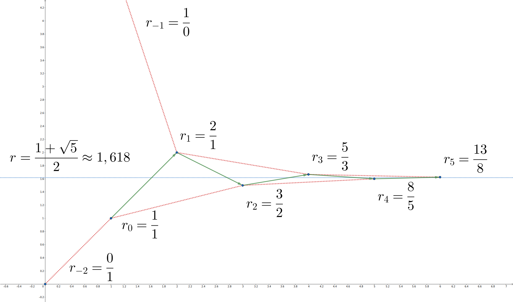
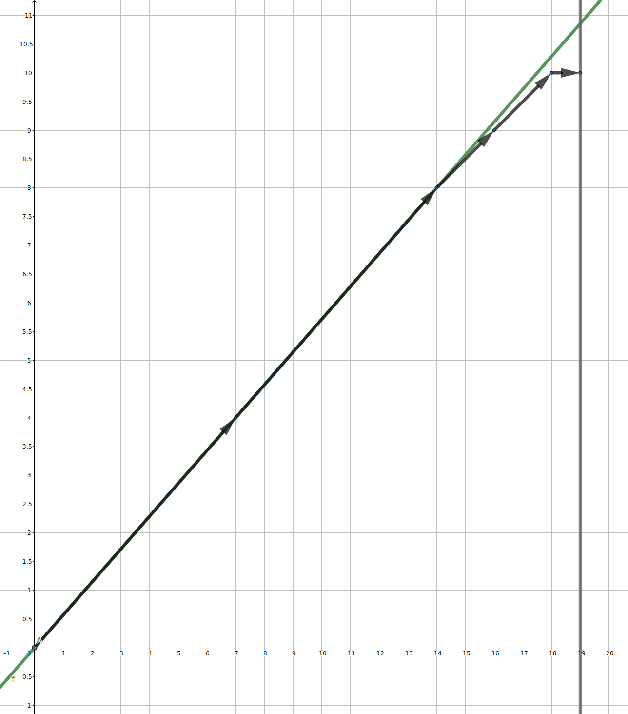

## 连分数

**连分数** 是实数作为有理数的特定收敛序列的表示。它们在算法竞赛（competitive programming）中很有用，因为它们易于计算，并且可以有效地用于在分母不超过给定值的所有数字中，找到基础实数（underlying real number）的最佳可能有理近似（best possible rational approximation）。

除此之外，连分数与欧几里得算法密切相关，这使得它们在一系列数论问题中非常有用。

## 定义

连分数是一种记号。例如，长为 $4$ 的连分数：

$$
[a_0,a_1,a_2,a_3]=a_0+\frac{1}{a_1+\frac{1}{a_2+\frac{1}{a_3}}}
$$

只是为了形式上简洁，才记成等号左边的样子。这里的四个变元可以任意取值。

连分数各变元的下标从 $0$ 开始。

### 简单连分数

可以证明，任何有理数都可以精确地以两种方式表示为连分数：

$$
r = [a_0;a_1,\dots,a_k,1] = [a_0;a_1,\dots,a_k+1]
$$

此外，对于 $r=\frac{p}{q}$，这种连分数的长度 $k$ 估计为 $k = O(\log \min(p, q))$。

一旦深入研究了连分数构造的细节，这背后的原因就会很清楚。

#### 定义

设 $a_0, a_1, \dots, a_k \in \mathbb Z$ 和 $a_1, a_2, \dots, a_k \geq 1$。然后表达式

$$
r=a_0 + \frac{1}{a_1 + \frac{1}{\dots + \frac{1}{a_k}}}
$$

称为有理数 $r$ 的 **连分数表示**，并简短地表示为 $r=[a_0;a_1,a_2,\dots,a_k]$。

??? 示例
    设 $r = \frac{5}{3}$。有两种方法可以将其表示为连分数：
    
    $$
    \begin{align}
    r = [1;1,1,1] &= 1+\frac{1}{1+\frac{1}{1+\frac{1}{1}}},\\
    r = [1;1,2] &= 1+\frac{1}{1+\frac{1}{2}}.
    \end{align}
    $$

对于有限连分数，全体结尾为 $1$ 的有限连分数和全体结尾不为 $1$ 的有限连分数一一对应，即同一个连分数有两种表示：

$[a_0,a_1,a_2,a_3]=[a_0,a_1,a_2,a_3-1,1]$

简单连分数：连分数从第 $1$ 项开始全都是正整数。如果有限，要求最后一项不为 $1$。（第 $0$ 项可以任意）

简单连分数的值，一定大于偶数的渐进分数，一定小于奇数的渐进分数。无限简单连分数一定收敛。

仿照一般分数的概念，第 $0$ 项是 $0$ 的连分数称为「真分数」。显然如果这之后的所有变元都大于等于 $1$，那么得到的真分数一定落在 $0$ 到 $1$ 之间。

### 无限连分数

如果分式无限地写下去，有无限个变元，就得到无限连分数。无限连分数收敛等价于渐进分数收敛。

有定理：

**无限连分数，如果各变元均大于等于 $1$，那么一定收敛。**

因为只要各变元为正，无限连分数的偶渐进分数单调递增（都比它小），奇渐进分数单调递减（都比它大）。而在均大于等于 $1$ 时，相邻（奇偶间）两个渐进分数之间距离可以给出估计式，趋于 $0$，因此收敛。

显然可以看到，连分数关于下标为偶数的变元单调递增，关于下标为奇数的变元单调递减。这无论它有限或无限都成立。

#### 定义

设 $a_0,a_1,a_2, \dots$ 为整数序列，使得 $a_1, a_2, \dots \geq 1$。设 $r_k = [a_0; a_1, \dots, a_k]$。然后表达式

$$
r = a_0 + \frac{1}{a_1 + \frac{1}{a_2+\dots}} = \lim\limits_{k \to \infty} r_k
$$

称为无理数 $r$ 的 **连分数表示**，并简短地表示为 $r = [a_0;a_1,a_2,\dots]$。

注意，对于 $r=[a_0;a_1,\dots]$ 和整数 $k$，有 $r+k = [a_0+k; a_1, \dots]$。

另一个重要的观察结果是，当 $a_0>0$ 时，$\frac{1}{r}=[0;a_0, a_1, \dots]$；当 $a_1＝0$ 时，$\frac{1}{r} = [a_1; a_2, \dots]$。

## 渐进分数

### 定义

在上面的定义中，有理数 $r_0, r_1, r_2, \dots$ 称为 $r$ 的 **渐进分数**（convergents，意为「收敛」）。

相应地，单个 $r_k = [a_0; a_1, \dots, a_k] = \frac{p_k}{q_k}$ 称为 $r$ 的第 $k$ 个渐进分数。

??? 示例
    考虑 $r = [1; 1, 1, 1, \dots]$。可以通过归纳法证明 $r_k = \frac{F_{k+2}}{F_{k+1}}$，其中 $F_k$ 是斐波那契序列，定义为 $F_0 = 0$、$F_1 = 1$ 和 $F_{k} = F_{k-1} + F_{k-2}$。从 Binet 公式可知
    
    $$
    r_k = \frac{\phi^{k+2} - \psi^{k+2}}{\phi^{k+1} - \psi^{k+1}}
    $$
    
    其中 $\phi = \frac{1+\sqrt{5}}{2} \approx 1.618$ 是黄金比率，$\psi = \frac{1-\sqrt{5}}{2} = -\frac{1}{\phi} \approx -0.618$。因此
    
    $$
    r = 1+\frac{1}{1+\frac{1}{1+\dots}}=\lim\limits_{k \to \infty} r_k = \phi = \frac{1+\sqrt{5}}{2}.
    $$
    
    请注意，在这种特定情况下，找到 $r$ 的另一种方法是求解方程
    
    $$
    r = 1+\frac{1}{r} \implies r^2 = r + 1
    $$

### 定义

设 $r_k = [a_0; a_1, \dots, a_{k-1}, a_k]$。对于 $1 \leq t \leq a_k$，$[a_0; a_1, \dots, a_{k-1}, t]$ 称为 **中间分数**（semiconvergents，「semi」意为「半」）。

通常将大于 $r$ 的分数称为 **上**（upper）渐进分数或中间分数，将小于 $r$ 者称为 **下**（lower）渐进分数或中间分数。

### 余项和部分商

#### 定义

作为渐进分数的补充，定义 **余项**（完全商，complete quotients）为 $s_k = [a_k; a_{k+1}, a_{k+2}, \dots]$。

相应地，将单个 $s_k$ 称为 $r$ 的第 $k$ 个完全商。

相应地，取整得到的 $a_k$ 称为部分商。

对于各项均为正数的连分数，所有的余项也都是正数。

根据以上定义，可以得出 $s_k \geq 1$ 代表 $k \geq 1$ 的结论。

将 $[a_0; a_1, \dots, a_k]$ 视为一个形式代数表达式，并允许任意实数代替 $a_i$，得到

$$
r = [a_0; a_1, \dots, a_{k-1}, s_k]
$$

特别地，$r = [s_0] = s_0$。另一方面，可以将 $s_k$ 表示为

$$
s_k = [a_k; s_{k+1}] = a_k + \frac{1}{s_{k+1}}
$$

这意味着可以从 $s_k$ 计算 $a_k = \lfloor s_k \rfloor$ 和 $s_{k+1} = (s_k - a_k)^{-1}$。

序列 $a_0, a_1, \dots$ 定义良好，除非 $s_k=a_k$，这仅在 $r$ 为有理数时发生。

因此，对于任何无理数 $r$，连分数表示都是唯一的。

### 求解简单连分数表示

在代码片段中主要假设有限的连分数。

如果要求 $(0,1)$ 区间内某个数的简单连分数表示（第 $0$ 项为 $0$），只需：

-   取倒数，得到的余项大于 $1$。
-   取整得到整数部分为部分商，小数部分在 $0$ 到 $1$ 之间。
-   对小数部分重复上述操作。

这样就得到了相应的表示。

从 $s_k$ 到 $s_{k+1}$ 的转换如下

$$
s_k =\left\lfloor s_k \right\rfloor + \frac{1}{s_{k+1}}
$$

从这个表达式中，下一个完全商 $s_{k+1}$ 如下

$$
s_{k+1} = \left(s_k-\left\lfloor s_k\right\rfloor\right)^{-1}
$$

对于 $s_k=\frac{p}{q}$，这意味着

$$
s_{k+1} = \left(\frac{p}{q}-\left\lfloor \frac{p}{q} \right\rfloor\right)^{-1} = \frac{q}{p-q\cdot \lfloor \frac{p}{q} \rfloor} = \frac{q}{p \bmod q}.
$$

因此，$r=\frac{p}{q}$ 的连分数表示的计算遵循 $p$ 和 $q$ 的欧几里得算法的步骤。

由此，$\frac{p_k}{q_k} = [a_0; a_1, \dots, a_k]$ 的 $\gcd(p_k, q_k) = 1$。因此，渐进分数总是不可约的。

=== "C++"
    ```cpp
    auto fraction(int p, int q) {
      vector<int> a;
      while (q) {
        a.push_back(p / q);
        tie(p, q) = make_pair(q, p % q);
      }
      return a;
    }
    ```

=== "Python"
    ```py
    def fraction(p, q):
        a = []
        while q:
            a.append(p // q)
            p, q = q, p % q
        return a
    ```

如果规定第 $0$ 项是该数的取整，那么全体实数都有「唯一的简单连分数表示」。其中：

如果两个无限简单连分数的值相等，必然逐项相等。

如果两个有限简单连分数的值相等，不仅要逐项相等，而且必然项数也相同。

无限简单连分数不能与有限简单连分数值相等。有理数与有限简单连分数具有一一对应关系，因此无限简单连分数全都是无理数。

## 性质

为了给连分数的进一步研究提供一些动力，现在给出一些性质。

### 递推

??? "递推"
    对于渐进分数 $r_k = \frac{p_k}{q_k}$，以下递推公式适用于它们的快速计算：
    
    $$
    \frac{p_k}{q_k}=\frac{a_k p_{k-1} + p_{k-2}}{a_k q_{k-1} + q_{k-2}}
    $$
    
    其中 $\frac{p_{-1}}{q_{-1}}=\frac{1}{0}$ 并且 $\frac{p_{-2}}{q_{-2}}=\frac{0}{1}$。

渐进分数分子和分母具有完全相同的递推关系：

$$
p_k=a_kp_{k-1}+p_{k-2}
$$

$$
q_k=a_kq_{k-1}+q_{k-2}
$$

这里和 Farey 数列的递推关系很像。

形式上记初项：

$$
p_{-1}=1 \quad p_0=a_0
$$

$$
q_{-1}=0 \quad q_0=1
$$

只是形式上成立。第 $-1$ 项渐进分数是 1/0，没有实际意义。

???+ note "证明"
    可以注意到，$p_k$ 与 $q_k$ 对于 $a_k$ 和 $b_k$ 都是线性函数。这是因为，$a_k$ 和 $b_k$ 都只出现了一次，无论如何通分也不会有另一个 $a_k$ 或 $b_k$ 乘上去。于是通过待定系数，即可解得这个递推关系。

### 反序定理

$$
\frac{q_k}{q_{k-1}}=[a_k,a_{k-1},\ldots,a_1]
$$

如果 $a_0\neq 0$：

$$
\frac{p_k}{p_{k-1}}=[a_k,a_{k-1},\ldots,a_0]
$$

如果 $a_0=0$：

$$
\frac{p_k}{p_{k-1}}=[a_k,a_{k-1},\ldots,a_2]
$$

???+ note "证明"
    对递推关系稍加改造，有：
    
    $$
    \frac{p_k}{p_{k-1}}=a_k+\frac{1}{\frac{p_{k-1}}{p_{k-2}}}
    $$
    
    $$
    \frac{q_k}{q_{k-1}}=a_k+\frac{1}{\frac{q_{k-1}}{q_{k-2}}}
    $$
    
    又利用初值，即可证明反序定理。

### 渐进分数的差分

计算相邻两项渐进分数的差，需要通分。通分后的分子代入递推关系：

$$
p_{k+1}q_k-q_{k+1}p_k=\left(a_{k+1}p_k+p_{k-1}\right)q_k-\left(a_{k+1}q_k+q_{k-1}\right)p_k=-\left(p_kq_{k-1}-q_kp_{k-1}\right)
$$

代入初值就有渐进分数的差分：

$$
p_{k+1}q_k-q_{k+1}p_k=(-1)^k
$$

$$
\frac{p_{k+1}}{q_{k+1}}-\frac{p_k}{q_k}=\frac{(-1)^k}{q_{k+1}q_k}
$$

???+ note "注"
    可以观察到，式 $p_{k+1}q_k-q_{k+1}p_k$ 特别像一个行列式，完全可以按「行列式」理解。
    
    渐进分数的递推关系很像行列式的列变换。行列式一列加到另一列上不改变它的值，两列交换则反号。

根据递推式，如果连分数各项均为整数，则渐进分数分子分母总是互素。

对于有理数的简单连分数展开，常用渐进分数差分的等式，求解一次线性不定方程（参见 [扩展欧几里得算法](./gcd.md)）：

$$
p_{k+1}q_k-q_{k+1}p_k=(-1)^k
$$

$$
ax-by=1
$$

因为 a 与 b 互素，$\frac{a}{b}$ 就是最简的有理数，也就是它本身的最后一个渐进分数。那么，它的前一个渐进分数就是所求的解。

### 倒数定理

由于实数与简单连分数一一对应，称实数的简单连分数的渐进分数，就是实数的渐进分数。于是就有倒数定理：

对于大于 1 的实数 x，x 的渐进分数的倒数恰好是 $\frac{1}{x}$ 的渐进分数。显然，该定理也应该对于 0 到 1 之间的实数 x 成立。

???+ note "证明"
    $$
    x=[a_0,a_1,a_2,\ldots]
    $$
    
    $$
    \frac{1}{x}=\frac{1}{[a_0,a_1,a_2,\ldots]}=[0,a_0,a_1,a_2,\ldots]
    $$
    
    于是根据新的初值与递推就能发现倒数关系成立。

### 最佳逼近

??? "最佳逼近"
    让 $\frac{p}{q}$ 是最小化 $\left|r-\frac{p}{q}\right|$ 的分数，对于某些 $x$，该分数服从 $q \leq x$。
    
    那么 $\frac{p}{q}$ 是 $r$ 的中间分数。

因此允许通过检查 $r$ 是否中间分数来找到其最佳有理逼近。

下面会对这些性质建立一些直觉并做出进一步解释。

## 连行列式

继续看前面定义的渐近分数。对于 $r=[a_0, a_1, a_2, \dots]$，其渐近分数为

$$
\begin{gathered}
r_0=[a_0] \\ r_1=[a_0, a_1] \\ \dots \\ r_k=[a_0, a_1, \dots, a_k]
\end{gathered}
$$

渐近分数是连分数的核心概念，因此研究它们的性质很重要。

对于数字 $r$，其第 $k$ 个渐近分数 $r_k = \frac{p_k}{q_k}$ 可以计算为

$$
r_k = \frac{P_k(a_0,a_1,\dots,a_k)}{P_{k-1}(a_1,\dots,a_k)} = \frac{a_k p_{k-1} + p_{k-2}}{a_k q_{k-1} + q_{k-2}}
$$

其中 $P_k(a_0,\dots,a_k)$ 是连行列式（continuant），定义为

$$
P_k(x_0,x_1,\dots,x_k) = \det \begin{bmatrix}
x_k & 1 & 0 & \dots & 0 \\
-1 & x_{k-1} & 1 & \dots & 0 \\
0 & -1 & x_2 & . & \vdots \\
\vdots & \vdots & . & \ddots & 1 \\
0 & 0 & \dots & -1 & x_0
\end{bmatrix}_{\textstyle .}
$$

因此，$r_k$ 是 $r_{k-1}$ 和 $r_{k-2}$ 的加权中间值（mediant）。

为了一致性，定义了两个额外的渐近分数 $r_{-1} = \frac{1}{0}$ 和 $r_{-2} = \frac{0}{1}$。

??? "详细说明"
    渐进分数 $r_k$ 的分子和分母可以看作 $a_0, a_1, \dots, a_k$ 的多元多项式：
    
    $$
    r_k = \frac{P_k(a_0, a_1, \dots, a_k)}{Q_k(a_0,a_1, \dots, a_k)}
    $$
    
    根据渐进分数的定义，
    
    $$
    r_k = a_0 + \frac{1}{[a_1;a_2,\dots, a_k]}= a_0 + \frac{Q_{k-1}(a_1, \dots, a_k)}{P_{k-1}(a_1, \dots, a_k)} = \frac{a_0 P_{k-1}(a_1, \dots, a_k) + Q_{k-1}(a_1, \dots, a_k)}{P_{k-1}(a_1, \dots, a_k)}
    $$
    
    由此得出 $Q_k(a_0, \dots, a_k) = P_{k-1}(a_1, \dots, a_k)$。这产生了关系
    
    $$
    P_k(a_0, \dots, a_k) = a_0 P_{k-1}(a_1, \dots, a_k) + P_{k-2}(a_2, \dots, a_k)
    $$
    
    最初，$r_0 = \frac{a_0}{1}$ 和 $r_1 = \frac{a_0 a_1 + 1}{a_1}$，因此
    
    $$
    \begin{align}P_0(a_0)&=a_0,\\ P_1(a_0, a_1) &= a_0 a_1 + 1.\end{align}
    $$
    
    为了保持一致性，可以方便地定义 $P_{-1} = 1$ 和 $P_{-2}=0$，并正式表示 $r_{-1} = \frac{1}{0}$ 和 $r_{-2}=\frac{0}{1}$。
    
    从数值分析可知，任意三对角矩阵的行列式
    
    $$
    T_k = \det \begin{bmatrix}
    a_0 & b_0 & 0 & \dots & 0 \\
    c_0 & a_1 & b_1 & \dots & 0 \\
    0 & c_1 & a_2 & . & \vdots \\
    \vdots & \vdots & . & \ddots & c_{k-1} \\
    0 & 0 & \dots & b_{k-1} & a_k
    \end{bmatrix}
    $$
    
    可以递归地计算为 $T_k = a_k T_{k-1} - b_{k-1} c_{k-1} T_{k-2}$。将其与 $P_k$ 进行比较，得到一个直接表达式
    
    $$
    P_k = \det \begin{bmatrix}
    x_k & 1 & 0 & \dots & 0 \\
    -1 & x_{k-1} & 1 & \dots & 0 \\
    0 & -1 & x_2 & . & \vdots \\
    \vdots & \vdots & . & \ddots & 1 \\
    0 & 0 & \dots & -1 & x_0
    \end{bmatrix}_{\textstyle .}
    $$
    
    这个多项式也被称为连行列式（continuant），由于其与连分数的密切关系。如果主对角线上的顺序颠倒，则连行列式不会改变。这产生了一个计算公式：
    
    $$
    P_k(a_0, \dots, a_k) = a_k P_{k-1}(a_0, \dots, a_{k-1}) + P_{k-2}(a_0, \dots, a_{k-2})
    $$

### 实现

把渐进分数计算为一对序列 $p_{-2}, p_{-1}, p_0, p_1, \dots, p_k$ 和 $q_{-2}, q_{-1}, q_0, q_1, \dots, q_k$：

=== "C++"
    ```cpp
    auto convergents(vector<int> a) {
      vector<int> p = {0, 1};
      vector<int> q = {1, 0};
      for (auto it : a) {
        p.push_back(p[p.size() - 1] * it + p[p.size() - 2]);
        q.push_back(q[q.size() - 1] * it + q[q.size() - 2]);
      }
      return make_pair(p, q);
    }
    ```

=== "Python"
    ```py
    def convergents(a):
        p = [0, 1]
        q = [1, 0]
        for it in a:
            p.append(p[-1] * it + p[-2])
            q.append(q[-1] * it + q[-2])
        return p, q
    ```

## 误差和余项的估计

??? "误差"
    渐进分数 $r_k = \frac{p_k}{q_k}$ 与 $r$ 的误差（deviation）通常可以估计为
    
    $$
    \left|\frac{p_k}{q_k}-r\right| \leq \frac{1}{q_k q_{k+1}} \leq \frac{1}{q_k^2}
    $$
    
    将两边乘以 $q_k$，得到另一个估计：
    
    $$
    |p_k - q_k r| \leq \frac{1}{q_{k+1}}
    $$
    
    从上面的循环可以看出，$q_k$ 的增长速度至少与斐波那契数一样快。
    
    在下图中可以看到收敛 $r_k$ 渐进分数 $r=\frac{1+\sqrt 5}{2}$ 的可视化：
    
    
    
    无理数 $r=\frac{1+\sqrt 5}{2}$ 由蓝色虚线表示。奇数渐进分数从上面接近它，偶数渐进分数从下面接近它。

实数 x 也可以写成：

$$
x=[a_0,a_1,\ldots,a_k,r_{k+1}]
$$

最后一项渐近分数就是 x 本身。于是根据渐进分数的递推式，就有：

$$
x=\frac{r_{k+1}p_k+p_{k-1}}{r_{k+1}q_k+q_{k-1}}
$$

于是可以估计渐进分数的误差：

$$
x-\frac{p_k}{q_k}=\frac{(-1)^k}{q_k\left(r_{k+1}q_k+q_{k-1}\right)}
$$

分别对 k 取奇数偶数就得到，x 总小于其奇数阶渐近分数，大于其偶数阶渐近分数。

对于数字 $r$ 及其第 $k$ 个渐进分数 $r_k=\frac{p_k}{q_k}$，以下公式成立：

$$
r_k = a_0 + \sum\limits_{i=1}^k \frac{(-1)^{i-1}}{q_i q_{i-1}}
$$

特别地，这意味着

$$
r_k - r_{k-1} = \frac{(-1)^{k-1}}{q_k q_{k-1}}
$$

并且

$$
p_k q_{k-1} - p_{k-1} q_k = (-1)^{k-1}
$$

由此可以得出结论

$$
\left| r-\frac{p_k}{q_k} \right| \leq \frac{1}{q_{k+1}q_k} \leq \frac{1}{q_k^2}
$$

后一种不等式是由于 $r_k$ 和 $r_{k+1}$ 通常位于 $r$ 的不同侧面，因此

$$
|r-r_k| = |r_k-r_{k+1}|-|r-r_{k+1}| \leq |r_k - r_{k+1}|
$$

??? "详细说明"
    为了估计 $|r-r_k|$，首先估计相邻渐进分数之间的差异。根据定义，
    
    $$
    \frac{p_k}{q_k} - \frac{p_{k-1}}{q_{k-1}} = \frac{p_k q_{k-1} - p_{k-1} q_k}{q_k q_{k-1}}
    $$
    
    将分子中的 $p_k$ 和 $q_k$ 替换为它们的循环，得到
    
    $$
    \begin{align} p_k q_{k-1} - p_{k-1} q_k &= (a_k p_{k-1} + p_{k-2}) q_{k-1} - p_{k-1} (a_k q_{k-1} + q_{k-2})
    \\&= p_{k-2} q_{k-1} - p_{k-1} q_{k-2},\end{align}
    $$
    
    因此，$r_k - r_{k-1}$ 的分子总是与 $r_{k-1} - r_{k-2}$ 相反。反过来，它等于
    
    $$
    r_1 - r_0=\left(a_0+\frac{1}{a_1}\right)-a_0=\frac{1}{a_1}
    $$
    
    因此
    
    $$
    r_k - r_{k-1} = \frac{(-1)^{k-1}}{q_k q_{k-1}}
    $$
    
    这产生了 $r_k$ 作为无限级数的部分和的替代表示：
    
    $$
    r_k = (r_k - r_{k-1}) + \dots + (r_1 - r_0) + r_0
    = a_0 + \sum\limits_{i=1}^k \frac{(-1)^{i-1}}{q_i q_{i-1}}
    $$
    
    根据递归关系，$q_k$ 单调增加的速度至少与斐波那契数一样快，因此
    
    $$
    r = \lim\limits_{k \to \infty} r_k = a_0 + \sum\limits_{i=1}^\infty \frac{(-1)^{i-1}}{q_i q_{i-1}}
    $$
    
    总是定义明确的，因为基础系列总是收敛的。值得注意的是，剩余系列
    
    $$
    r-r_k = \sum\limits_{i=k+1}^\infty \frac{(-1)^{i-1}}{q_i q_{i-1}}
    $$
    
    由于 $q_i q_{i-1}$ 下降的速度，与 $(-1)^k$ 具有相同的符号。因此，偶数索引的 $r_k$ 从下面接近 $r$，而奇数索引的 $r_k$ 从上面接近：
    
    
    
    从这张图中可以看到
    
    $$
    |r-r_k| = |r_k - r_{k+1}| - |r-r_{k+1}| \leq |r_k - r_{k+1}|
    $$
    
    因此，$r$ 和 $r_k$ 之间的距离永远不会大于 $r_k$ 和 $r_{k+1}$ 之间的间距：
    
    $$
    \left|r-\frac{p_k}{q_k}\right| \leq \frac{1}{q_k q_{k+1}} \leq \frac{1}{q_k^2}
    $$

### 例题 扩展欧几里得

您将获得 $A, B, C \in \mathbb Z$。查找 $x, y \in \mathbb Z$，使 $Ax + By = C$.

??? "解答"
    虽然这个问题通常是用扩展欧几里得算法解决的，但有一个简单而直接的连分数的解决方案。
    
    设 $\frac{A}{B}=[a_0; a_1, \dots, a_k]$。上面证明了 $p_k q_{k-1} - p_{k-1} q_k = (-1)^{k-1}$。将 $p_k$ 和 $q_k$ 替换为 $A$ 和 $B$，得到
    
    $$
    Aq_{k-1} - Bp_{k-1} = (-1)^{k-1} g
    $$
    
    其中 $g = \gcd(A, B)$。如果 $C$ 可被 $g$ 整除，则解为 $x = (-1)^{k-1}\frac{C}{g} q_{k-1}$ 和 $y = (-1)^{k}\frac{C}{g} p_{k-1}$。
    
    === "Python"
        ```py
        # return (x, y) such that Ax+By=C
        # assumes that such (x, y) exists
        def dio(A, B, C):
            p, q = convergents(fraction(A, B))
            C //= A // p[-1]  # divide by gcd(A, B)
            t = (-1) if len(p) % 2 else 1
            return t * C * q[-2], -t * C * p[-2]
        ```

## 几何解释

??? "格点"
    考虑线 $y=rx$ 上方和下方的点的凸包。
    
    奇数渐进分数 $(q_k;p_k)$ 是上壳的顶点，而偶数渐进分数 $(q_k;p_k)$ 则是下壳的顶点。
    
    外壳上的所有整数顶点都作为 $(q;p)$ 获得，这样
    
    $$
    \frac{p}{q} = \frac{tp_{k-1} + p_{k-2}}{tq_{k-1} + q_{k-2}}
    $$
    
    对于整数 $0 \leq t \leq a_k$。换句话说，外壳上的格点集对应于中间分数。
    
    在下图中可以看到 $r=\frac{9}{7}$ 的渐进分数和中间分数（灰点）。
    
    

对于渐进分数 $r_k = \frac{p_k}{q_k}$，设 $\vec r_k = (q_k;p_k)$。然后，以下重复出现：

$$
\vec r_k = a_k \vec r_{k-1} + \vec r_{k-2}
$$

设 $\vec r = (1;r)$。然后，每个向量 $(x;y)$ 对应于等于其斜率系数 $\frac{y}{x}$ 的数字。

利用外积 $(x_1;y_1) \times (x_2;y_2) = x_1 y_2 - x_2 y_1$ 的概念，可以看出（参见下面的解释）

$$
s_k = -\frac{\vec r_{k-2} \times \vec r}{\vec r_{k-1} \times \vec r} = \left|\frac{\vec r_{k-2} \times \vec r}{\vec r_{k-1} \times \vec r}\right|
$$

最后一个等式是由于 $r_{k-1}$ 和 $r_{k-2}$ 位于 $r$ 的不同侧，因此 $\vec r_{k-1}$ 和 $\vec r_{k-2}$ 与 $\vec r$ 的外积具有不同的符号。考虑到 $a_k = \lfloor s_k \rfloor$，$\vec r_k$ 的公式如下

$$
\vec r_k = \vec r_{k-2} + \left\lfloor \left| \frac{\vec r \times \vec r_{k-2}}{\vec r \times \vec r_{k-1}}\right|\right\rfloor \vec r_{k-1}
$$

注意到 $\vec r_k \times r = (q;p) \times (1;r) = qr - p$，因此

$$
a_k = \left\lfloor \left| \frac{q_{k-1}r-p_{k-1}}{q_{k-2}r-p_{k-2}} \right| \right\rfloor
$$

??? "解释"
    正如已经注意到的，$a_k = \lfloor s_k \rfloor$，其中 $s_k = [a_k; a_{k+1}, a_{k+2}, \dots]$。另一方面，从渐进分数的递推，可以得出
    
    $$
    r = [a_0; a_1, \dots, a_{k-1}, s_k] = \frac{s_k p_{k-1} + p_{k-2}}{s_k q_{k-1} + q_{k-2}}
    $$
    
    在向量形式中，它重写为
    
    $$
    \vec r \parallel s_k \vec r_{k-1} + \vec r_{k-2}
    $$
    
    这意味着 $\vec r$ 和 $s_k \vec r_{k-1} + \vec r_{k-2}$ 共线（即具有相同的斜率系数）。用 $\vec r$ 计算两个部分的外积，可以得到
    
    $$
    0 = s_k (\vec r_{k-1} \times \vec r) + (\vec r_{k-2} \times \vec r)
    $$
    
    得出最终公式
    
    $$
    s_k = -\frac{\vec r_{k-2} \times \vec r}{\vec r_{k-1} \times \vec r}
    $$

### 例题 鼻子拉伸算法

每次将 $\vec r_{k-1}$ 添加到向量 $\vec p$ 时，$\vec p \times \vec r$ 的值都会增加 $\vec r_{k-1} \times \vec r$。

因此，$a_k=\lfloor s_k \rfloor$ 是 $\vec r_{k-1}$ 向量的最大整数，可以将其添加到 $\vec r_{k-2}$，而无需更改与 $\vec r$ 的外积的符号。

换句话说，$a_k$ 是您可以将 $\vec r_{k-1}$ 添加到 $\vec r_{k-2}$ 的最大整数次数，而无需跨越 $\vec r$ 定义的线：


在上面的图片中，$\vec r_2 = (4;3)$ 是通过将 $\vec r_1 = (1;1)$ 重复添加到 $\vec r_0 = (1;0)$ 而获得的。

当不可能在不跨越 $y=rx$ 线的情况下将 $\vec r_1$ 进一步添加到 $\vec r_0$ 时，转到另一侧，重复将 $\vec r_2$ 添加到 $\vec r_1$ 以获得 $\vec r_3 = (9;7)$。

此过程生成接近直线的指数较长的向量。

对于这一特性，Boris Delaunay 将生成结果收敛向量的过程称为 **鼻子拉伸算法**（Nose stretching algorithm）。

如果观察在点 $\vec r_{k-2}$、$\vec r_{k}$ 和 $\vec 0$ 上绘制的三角形，会注意到它的加倍面积是

$$
|\vec r_{k-2} \times \vec r_k| = |\vec r_{k-2} \times (\vec r_{k-2} + a_k \vec r_{k-1})| = a_k |\vec r_{k-2} \times \vec r_{k-1}| = a_k
$$

结合 Pick 定理，这意味着三角形内部没有严格的格点，其边界上的唯一格点是 $\vec 0$ 和 $\vec r_{k-2} + t \cdot \vec r_{k-1}$，对于所有整数 $t$，使得 $0 \leq t \leq a_k$。当连接所有可能的 $k$ 时，这意味着在由偶数索引和奇数索引收敛向量形成的多边形之间的空间中没有整数点。

这反过来意味着，具有奇数系数的 $\vec r_k$ 形成了线 $y=rx$ 上方 $x \geq 0$ 的格点凸包，而具有偶数系数的 $\vec r_k$ 形成线 $y=rx$ 下方 $x > 0$ 的格点凸包。

### 定义

这些多边形也被称为 **克莱因多边形**（Klein polygons），以费利克斯·克莱因（Felix Klein）的名字命名，他首次提出了对连续分数的几何解释。

## 例题

既然已经介绍了最重要的事实和概念，那么是时候深入研究具体的例题了。

### 线下凸包

找到格点 $(x;y)$ 的凸包，使得 $r=[a_0;a_1,\dots,a_k]=\frac{p_k}{q_k}$ 的 $0 \leq x \leq N$ 和 $0 \leq y \leq rx$。

??? "解答"
    如果我们考虑无界集合 $0 \leq x$，则上凸包将由线 $y=rx$ 本身给出。
    
    然而，在附加约束 $x \leq N$ 的情况下，最终需要偏离直线以保持适当的凸包。
    
    设 $t = \lfloor \frac{N}{q_k}\rfloor$，则对于整数 $1 \leq \alpha \leq t$，在 $(0;0)$ 之后的外壳上的第一个 $t$ 格点是 $\alpha \cdot (q_k; p_k)$。
    
    然而，$(t+1)(q_k; p_k)$ 不能是下一个格点，因为 $(t+1)q_k$ 大于 $N$。
    
    为了到达外壳中的下一个格点，应该到达点 $(x;y)$，该点与 $y=rx$ 相差最小，同时保持 $x \leq N$。
    
    
    
    设 $(x; y)$ 为凸包中的最后一个当前点。然后，下一点 $(x'; y')$ 是这样的：$x' \leq N$ 和 $(x'; y') - (x; y) = (\Delta x; \Delta y)$ 尽可能接近线 $y=rx$。换句话说，$(\Delta x; \Delta y)$ 根据 $\Delta x \leq N - x$ 和 $\Delta y \leq r \Delta x$ 最大化 $r \Delta x - \Delta y$。
    
    这样的点位于 $y=rx$ 以下的格点的凸包上。换句话说，$(\Delta x; \Delta y)$ 必须是 $r$ 的下中间分数。
    
    也就是说，对于某些奇数 $i$ 和 $0 \leq t < a_i$，$(\Delta x; \Delta y)$ 的形式为 $(q_{i-1}; p_{i-1}) + t \cdot (q_i; p_i)$。
    
    要找到这样的 $i$，可以遍历所有可能的 $i$，从最大的一个开始，并对 $i$ 使用 $t = \lfloor \frac{N-x-q_{i-1}}{q_i} \rfloor$，这样 $N-x-q_{i-1} \geq 0$。
    
    当 $(\Delta x; \Delta y) = (q_{i-1}; p_{i-1}) + t \cdot (q_i; p_i)$ 时，条件 $\Delta y \leq r \Delta x$ 由中间分数的性质保持。
    
    并且 $t < a_i$ 成立，因为已经耗尽了从 $i+2$ 获得的半收敛，因此 $x + q_{i-1} + a_i q_i = x+q_{i+1}$ 大于 $N$。
    
    现在，可以将 $(\Delta x; \Delta y)$ 添加到 $(x;y)$ 中 $k = \lfloor \frac{N-x}{\Delta x} \rfloor$ 次，然后再超过 $N$，之后将尝试下一个中间分数。
    
    === "C++"
        ```cpp
        // returns [ah, ph, qh] such that points r[i]=(ph[i], qh[i]) constitute upper
        // convex hull of lattice points on 0 <= x <= N and 0 <= y <= r * x, where r =
        // [a0; a1, a2, ...] and there are ah[i]-1 integer points on the segment between
        // r[i] and r[i+1]
        auto hull(auto a, int N) {
          auto [p, q] = convergents(a);
          int t = N / q.back();
          vector ah = {t};
          vector ph = {0, t * p.back()};
          vector qh = {0, t * q.back()};
        
          for (int i = q.size() - 1; i >= 0; i--) {
            if (i % 2) {
              while (qh.back() + q[i - 1] <= N) {
                t = (N - qh.back() - q[i - 1]) / q[i];
                int dp = p[i - 1] + t * p[i];
                int dq = q[i - 1] + t * q[i];
                int k = (N - qh.back()) / dq;
                ah.push_back(k);
                ph.push_back(ph.back() + k * dp);
                qh.push_back(qh.back() + k * dq);
              }
            }
          }
          return make_tuple(ah, ph, qh);
        }
        ```
    
    === "Python"
        ```py
        # returns [ah, ph, qh] such that points r[i]=(ph[i], qh[i]) constitute upper convex hull
        # of lattice points on 0 <= x <= N and 0 <= y <= r * x, where r = [a0; a1, a2, ...]
        # and there are ah[i]-1 integer points on the segment between r[i] and r[i+1]
        def hull(a, N):
            p, q = convergents(a)
            t = N // q[-1]
            ah = [t]
            ph = [0, t * p[-1]]
            qh = [0, t * q[-1]]
            for i in reversed(range(len(q))):
                if i % 2 == 1:
                    while qh[-1] + q[i - 1] <= N:
                        t = (N - qh[-1] - q[i - 1]) // q[i]
                        dp = p[i - 1] + t * p[i]
                        dq = q[i - 1] + t * q[i]
                        k = (N - qh[-1]) // dq
                        ah.append(k)
                        ph.append(ph[-1] + k * dp)
                        qh.append(qh[-1] + k * dq)
            return ah, ph, qh
        ```

### [Timus - Crime and Punishment](https://timus.online/problem.aspx?space=1&num=1430)

您将得到整数 $A$、$B$ 和 $N$。查找 $x \geq 0$ 和 $y \geq 0$，使 $Ax + By \leq N$ 和 $Ax + By$ 达到最大值。

??? "解答"
    在这个问题中有 $1 \leq A, B, N \leq 2 \cdot 10^9$，因此可以用 $O(\sqrt N)$ 来解决。但是，有一个 $O(\log N)$ 解决方案包含连分数。
    
    为了方便起见，通过替换 $x \mapsto \lfloor \frac{N}{A}\rfloor - x$ 来反转 $x$ 的方向，因此需要找到点 $(x; y)$，使得 $0 \leq x \leq \lfloor \frac{N}{A} \rfloor$、$By - Ax \leq N \;\bmod\; A$ 和 $By - Ax$ 是可能的最大值。每个 $x$ 的最佳 $y$ 值为 $\lfloor \frac{Ax + (N \bmod A)}{B} \rfloor$。
    
    为了更一般地对待它，编写一个函数，该函数在 $0 \leq x \leq N$ 和 $y = \lfloor \frac{Ax+B}{C} \rfloor$ 上找到最佳点。
    
    这个问题的核心解决方案思想基本上重复了前面的问题，但不是使用下中间分数来偏离直线，而是使用上中间分数来接近直线，而不跨越直线，也不违反 $x \leq N$。不幸的是，与前一个问题不同，您需要确保在靠近 $y=\frac{Ax+B}{C}$ 线时不会越过该线，因此在计算中间分数的系数 $t$ 时应牢记这一点。
    
    === "Python"
        ```py
        # (x, y) such that y = (A*x+B) // C,
        # Cy - Ax is max and 0 <= x <= N.
        def closest(A, B, C, N):
            # y <= (A*x + B)/C <=> diff(x, y) <= B
            def diff(x, y):
                return C * y - A * x
        
            a = fraction(A, C)
            p, q = convergents(a)
            ph = [B // C]
            qh = [0]
            for i in range(2, len(q) - 1):
                if i % 2 == 0:
                    while diff(qh[-1] + q[i + 1], ph[-1] + p[i + 1]) <= B:
                        t = 1 + (diff(qh[-1] + q[i - 1], ph[-1] + p[i - 1]) - B - 1) // abs(
                            diff(q[i], p[i])
                        )
                        dp = p[i - 1] + t * p[i]
                        dq = q[i - 1] + t * q[i]
                        k = (N - qh[-1]) // dq
                        if k == 0:
                            return qh[-1], ph[-1]
                        if diff(dq, dp) != 0:
                            k = min(k, (B - diff(qh[-1], ph[-1])) // diff(dq, dp))
                        qh.append(qh[-1] + k * dq)
                        ph.append(ph[-1] + k * dp)
            return qh[-1], ph[-1]
        
        
        def solve(A, B, N):
            x, y = closest(A, N % A, B, N // A)
            return N // A - x, y
        ```

### [June Challenge 2017 - Euler Sum](https://www.codechef.com/problems/ES)

计算 $\sum\limits_{x=1}^N \lfloor \mathrm{e}x \rfloor$，其中 $\mathrm{e} = [2; 1, 2, 1, 1, 4, 1, 1, 6, 1, \dots, 1, 2n, 1, \dots]$ 是自然对数的底，$N \leq 10^{4000}$。

??? "解答"
    此和等于格点 $(x;y)$ 的数量，使得 $1 \leq x \leq N$ 和 $1 \leq y \leq \mathrm{e}x$。
    
    在构造了 $y=\mathrm{e}x$ 以下的点的凸包之后，可以使用 Pick 定理计算这个数：
    
    === "C++"
        ```cpp
        // sum floor(k * x) for k in [1, N] and x = [a0; a1, a2, ...]
        int sum_floor(auto a, int N) {
          N++;
          auto [ah, ph, qh] = hull(a, N);
        
          // The number of lattice points within a vertical right trapezoid
          // on points (0; 0) - (0; y1) - (dx; y2) - (dx; 0) that has
          // a+1 integer points on the segment (0; y1) - (dx; y2).
          auto picks = [](int y1, int y2, int dx, int a) {
            int b = y1 + y2 + a + dx;
            int A = (y1 + y2) * dx;
            return (A - b + 2) / 2 + b - (y2 + 1);
          };
        
          int ans = 0;
          for (size_t i = 1; i < qh.size(); i++) {
            ans += picks(ph[i - 1], ph[i], qh[i] - qh[i - 1], ah[i - 1]);
          }
          return ans - N;
        }
        ```
    
    === "Python"
        ```py
        # sum floor(k * x) for k in [1, N] and x = [a0; a1, a2, ...]
        def sum_floor(a, N):
            N += 1
            ah, ph, qh = hull(a, N)
        
            # The number of lattice points within a vertical right trapezoid
            # on points (0; 0) - (0; y1) - (dx; y2) - (dx; 0) that has
            # a+1 integer points on the segment (0; y1) - (dx; y2).
            def picks(y1, y2, dx, a):
                b = y1 + y2 + a + dx
                A = (y1 + y2) * dx
                return (A - b + 2) // 2 + b - (y2 + 1)
        
            ans = 0
            for i in range(1, len(qh)):
                ans += picks(ph[i - 1], ph[i], qh[i] - qh[i - 1], ah[i - 1])
            return ans - N
        ```

### [NAIPC 2019 - It's a Mod, Mod, Mod, Mod World](https://open.kattis.com/problems/itsamodmodmodmodworld)

给定 $p$、$q$ 和 $n$，计算 $\sum\limits_{i=1}^n [p \cdot i \bmod q]$。

??? "解答"
    如果您注意到 $a \bmod b = a - \lfloor \frac{a}{b} \rfloor b$，则此问题会减少到上一个问题。有了这个事实，总数减少到
    
    $$
    \sum\limits_{i=1}^n \left(p \cdot i - \left\lfloor \frac{p \cdot i}{q} \right\rfloor q\right) = \frac{pn(n+1)}{2}-q\sum\limits_{i=1}^n \left\lfloor \frac{p \cdot i}{q}\right\rfloor
    $$
    
    然而，将 $x$ 从 $1$ 到 $N$ 的 $\lfloor rx \rfloor$ 相加，是我们能够从上一个问题中得出的结果。
    
    === "C++"
        ```cpp
        void solve(int p, int q, int N) {
          cout << p * N * (N + 1) / 2 - q * sum_floor(fraction(p, q), N) << "\n";
        }
        ```
    
    === "Python"
        ```py
        def solve(p, q, N):
            return p * N * (N + 1) // 2 - q * sum_floor(fraction(p, q), N)
        ```

### [Library Checker - Sum of Floor of Linear](https://judge.yosupo.jp/problem/sum_of_floor_of_linear)

给定 $N$、$M$、$A$ 和 $B$，计算 $\sum\limits_{i=0}^{N-1} \lfloor \frac{A \cdot i + B}{M} \rfloor$。

??? "解答"
    这是迄今为止技术上最麻烦的问题。
    
    可以使用相同的方法来构造线 $y = \frac{Ax+B}{M}$ 以下的点的全凸包。
    
    已经知道如何解决 $B = 0$ 的问题。此外，已经知道如何构造这个凸包，直到 $[0, N-1]$ 段上的这条线的最近格点（这在上面的「罪与罚」问题中完成）。
    
    现在应该注意到，一旦到达了离直线最近的点，就可以假设直线实际上通过了最近的点。因为在实际直线和稍微向下移动以通过最近点的直线之间，$[0, N-1]$ 上没有其他格点。
    
    也就是说，要在 $[0, N-1]$ 上的线 $y=\frac{Ax+B}{M}$ 下方构造全凸包，可以将其构造到与 $[0, N-1]$ 的线最近的点，然后继续，就像该线通过该点一样，重用用于构造 $B=0$ 的凸包的算法：
    
    === "Python"
        ```py
        # hull of lattice (x, y) such that C*y <= A*x+B
        def hull(A, B, C, N):
            def diff(x, y):
                return C * y - A * x
        
            a = fraction(A, C)
            p, q = convergents(a)
            ah = []
            ph = [B // C]
            qh = [0]
        
            def insert(dq, dp):
                k = (N - qh[-1]) // dq
                if diff(dq, dp) > 0:
                    k = min(k, (B - diff(qh[-1], ph[-1])) // diff(dq, dp))
                ah.append(k)
                qh.append(qh[-1] + k * dq)
                ph.append(ph[-1] + k * dp)
        
            for i in range(1, len(q) - 1):
                if i % 2 == 0:
                    while diff(qh[-1] + q[i + 1], ph[-1] + p[i + 1]) <= B:
                        t = (B - diff(qh[-1] + q[i + 1], ph[-1] + p[i + 1])) // abs(
                            diff(q[i], p[i])
                        )
                        dp = p[i + 1] - t * p[i]
                        dq = q[i + 1] - t * q[i]
                        if dq < 0 or qh[-1] + dq > N:
                            break
                        insert(dq, dp)
        
            insert(q[-1], p[-1])
        
            for i in reversed(range(len(q))):
                if i % 2 == 1:
                    while qh[-1] + q[i - 1] <= N:
                        t = (N - qh[-1] - q[i - 1]) // q[i]
                        dp = p[i - 1] + t * p[i]
                        dq = q[i - 1] + t * q[i]
                        insert(dq, dp)
            return ah, ph, qh
        ```

### [OKC 2 - From Modular to Rational](https://codeforces.com/gym/102354/problem/I)

有一个有理数 $\frac{p}{q}$，即 $1 \leq p, q \leq 10^9$。您可以询问几个素数 $m$ 的 $p q^{-1}$ 模 $m \sim 10^9$ 的值。恢复 $\frac{p}{q}$。

这个问题等价于：查找 $1 \leq x \leq N$ 中，使 $Ax \bmod M$ 最小的 $x$。

??? "解答"
    根据中国剩余定理，要求结果模化几个素数与要求其模化其乘积是相同的。因此，在不丧失一般性的情况下，假设知道余数模足够大的数 $m$。
    
    对于给定的余数 $r$，可能有几种可能的解决方案 $(p, q)$ 到 $p \equiv qr \pmod m$。然而，如果 $(p_1, q_1)$ 和 $(p_2, q_2)$ 都是解，那么它也认为 $p_1 q_2 \equiv p_2 q_1 \pmod m$。假设 $\frac{p_1}{q_1} \neq \frac{p_2}{q_2}$，则意味着 $|p_1 q_2 - p_2 q_1|$ 至少为 $m$。
    
    题面有 $1 \leq p, q \leq 10^9$，因此，如果 $p_1, q_1$ 和 $p_2, q_2$ 最多都是 $10^9$ 的话，那么差额最多为 $10^{18}$。对于 $m > 10^{18}$，这意味着具有 $\frac{p}{q}$ 的解 $1 \leq p, q \leq 10^9$ 作为有理数是唯一的。
    
    因此，问题归结为，给定 $r$ 模 $m$，找到任何 $q$，使得 $1 \leq q \leq 10^9$ 和 $qr \;\bmod\; m \leq 10^9$。
    
    这实际上与找到 $1 \leq q \leq 10^9$ 的 $q$ 是相同的，该 $q$ 提供了可能的最小 $qr \bmod m$。
    
    对于 $qr = km + b$，这意味着需要找到一对 $(q, m)$，使得 $1 \leq q \leq 10^9$ 和 $qr - km \geq 0$ 是可能的最小值。
    
    由于 $m$ 是常量，可以除以它，并进一步将其重新表述为求解 $q$，这样 $1 \leq q \leq 10^9$ 和 $\frac{r}{m} q - k \geq 0$ 是可能的最小值。
    
    就连分数而言，这意味着 $\frac{k}{q}$ 是 $\frac{r}{m}$ 的最佳丢番图近似值，并且仅检查 $\frac{r}{m}$ 的下中间分数就足够了。
    
    === "Python"
        ```py
        # find Q that minimizes Q*r mod m for 1 <= k <= n < m
        def mod_min(r, n, m):
            a = fraction(r, m)
            p, q = convergents(a)
            for i in range(2, len(q)):
                if i % 2 == 1 and (i + 1 == len(q) or q[i + 1] > n):
                    t = (n - q[i - 1]) // q[i]
                    return q[i - 1] + t * q[i]
        ```

## 习题

-   [UVa OJ - Continued Fractions](https://onlinejudge.org/index.php?option=com_onlinejudge&Itemid=8&page=show_problem&problem=775)
-   [ProjectEuler+ #64: Odd period square roots](https://www.hackerrank.com/contests/projecteuler/challenges/euler064/problem)
-   [Codeforces Round #184 (Div. 2) - Continued Fractions](https://codeforces.com/contest/305/problem/B)
-   [Codeforces Round #201 (Div. 1) - Doodle Jump](https://codeforces.com/contest/346/problem/E)
-   [Codeforces Round #325 (Div. 1) - Alice, Bob, Oranges and Apples](https://codeforces.com/contest/585/problem/C)
-   [POJ Founder Monthly Contest 2008.03.16 - A Modular Arithmetic Challenge](http://poj.org/problem?id=3530)
-   [2019 Multi-University Training Contest 5 - fraction](http://acm.hdu.edu.cn/showproblem.php?pid=6624)
-   [SnackDown 2019 Elimination Round - Election Bait](https://www.codechef.com/SNCKEL19/problems/EBAIT)

**本页面主要译自博文 [Continued fractions](https://cp-algorithms.com/algebra/continued-fractions.html)，版权协议为 CC-BY-SA 4.0。**
