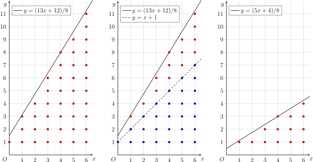

author: sshwy, FFjet

## 引入

类欧几里德算法是洪华敦在 2016 年冬令营营员交流中提出的内容。它常用于解决形如

$$
\left\lfloor\dfrac{ai+b}{c}\right\rfloor
$$

结构的数列（下标为 $i$）的求和问题。它的主要想法是，利用分数自身的递归结构，将问题转化为更小规模的问题，递归求解。因为分数的递归结构和 [欧几里得算法](./gcd.md#欧几里得算法) 存在直接的 [联系](./continued-fraction.md#连分数表示的求法)，因此，这一求和方法也称为类欧几里得算法。

因为 [连分数](./continued-fraction.md) 和 [Stern–Brocot 树](./stern-brocot.md) 等方法同样刻画了分数的递归结构，所以利用类欧几里得算法可以解决的问题，通常也可以用这些方法解决。与这些方法相比，类欧几里得算法通常更容易理解，它的实现也更为简明。

## 类欧几里得算法

最简单的例子，就是求和问题：

$$
f(a,b,c,n)=\sum_{i=0}^n\left\lfloor \frac{ai+b}{c} \right\rfloor,
$$

其中，$a,b,c,n$ 都是正整数。

### 代数解法

首先，将 $a,b$ 对 $c$ 取模，可以简化问题，将问题转化为 $0\leqslant a,b<c$ 的情形：

$$
\begin{aligned}
f(a,b,c,n)&=\sum_{i=0}^n\left\lfloor \frac{ai+b}{c} \right\rfloor\\
&=\sum_{i=0}^n\left\lfloor
\frac{\left(\left\lfloor\frac{a}{c}\right\rfloor c+(a\bmod c)\right)i+\left(\left\lfloor\frac{b}{c}\right\rfloor c+(b\bmod c)\right)}{c}\right\rfloor\\
&=\sum_{i=0}^n\left(\left\lfloor\frac{a}{c}\right\rfloor i+\left\lfloor\frac{b}{c}\right\rfloor+\left\lfloor\frac{\left(a\bmod c\right)i+\left(b\bmod c\right)}{c}
\right\rfloor\right)\\
&=\frac{n(n+1)}{2}\left\lfloor\frac{a}{c}\right\rfloor
+(n+1)\left\lfloor\frac{b}{c}\right\rfloor+f(a\bmod c,b\bmod c,c,n).
\end{aligned}
$$

现在，考虑转化后的问题。令

$$
m = \left\lfloor \frac{an+b}{c} \right\rfloor.
$$

那么，原问题可以写作二次求和式：

$$
\sum_{i=0}^n\left\lfloor \frac{ai+b}{c} \right\rfloor
=\sum_{i=0}^n\sum_{j=0}^{m-1}\left[j<\left\lfloor \frac{ai+b}{c} \right\rfloor\right].
$$

交换求和次序，这需要对于每个 $j$ 计算满足条件的 $i$ 的范围。为此，将条件变形：

$$
\begin{aligned}
&j<\left\lfloor \frac{ai+b}{c} \right\rfloor = \left\lceil \frac{ai+b+1}{c} \right\rceil-1\\
&\iff j + 1 < \left\lceil \frac{ai+b+1}{c} \right\rceil
\iff j+1< \frac{ai+b+1}{c} \\
&\iff \dfrac{cj+c-b-1}{a} < i
\iff \left\lfloor\dfrac{cj+c-b-1}{a}\right\rfloor < i.
\end{aligned}
$$

变形过程中多次利用了取整函数的性质。代入变形后的条件，原式可以写作：

$$
\begin{aligned}
f(a,b,c,n)&=\sum_{j=0}^{m-1}
\sum_{i=0}^n\left[i>\left\lfloor\frac{cj+c-b-1}{a}\right\rfloor \right]\\
&=\sum_{j=0}^{m-1}\left(n-\left\lfloor\frac{cj+c-b-1}{a}\right\rfloor\right)\\
&=nm-f\left(c,c-b-1,a,m-1\right).
\end{aligned}
$$

令 $(a',b',c',n')=(c,c-b-1,a,m-1)$，这就又回到了前面讨论过的 $a'>c'$ 的情形。

将这两步转化结合在一起，可以发现在过程中，$(a,c)$ 不断地取模后交换位置，直到 $a=0$。这就类似于对 $(a,c)$ 进行辗转相除，这也是类欧几里德算法的得名。它的时间复杂度是 $O(\log\min\{a,c\})$ 的。

在计算过程中，可能会出现 $m=0$ 的情形，此时内层递归会出现 $n=-1$。这并不影响最终的结果。但是，如果要求出现 $m=0$ 时，直接终止算法，那么算法的时间复杂度可以改良为 $O(\log\min\{a,c,n\})$ 的。

??? note "对复杂度的解释"
    利用该算法和欧几里得算法的相似性，很容易说明它的时间复杂度是 $O(\log\min\{a,c\})$ 的。因此，只需要说明，如果在 $m=0$ 时终止算法，那么它的时间复杂度也是 $O(\log n)$ 的。
    
    令 $m=\lfloor(an+b)/c\rfloor$，并记 $S=mn$，$k=m/n$，它们分别相当于几何直观（见下一节）中点阵图的面积和直线的斜率。对于充分大的 $n$，近似有 $k\doteq a/c$。
    
    考察 $S$ 和 $k$ 在算法过程中的变化。第一步取模时，$n$ 保持不变，$k$ 近似由 $a/c$ 变为 $(a\bmod c)/c$，相当于斜率由 $k$ 变为 $k-\lfloor k\rfloor$，而 $S$ 也近似变为原来的 $(k-\lfloor k\rfloor)$ 倍。第二步交换横纵坐标时，$S$ 近似保持不变，$k$ 则变为它的倒数。因此，若设两步操作后，二元组 $(k,S)$ 变为 $(k',S')$，则有 $k'=(k-\lfloor k\rfloor)^{-1}$ 且 $S'=(k-\lfloor k\rfloor)S$。
    
    因为 $1\leqslant\lfloor k'\rfloor\leqslant k'<\lfloor k'\rfloor+1$，所以，递归计算两轮后，乘积缩小的倍数最少为
    
    $$
    (k'-\lfloor k'\rfloor)(k-\lfloor k\rfloor) = 1-\dfrac{\lfloor k'\rfloor}{k'} < 1-\dfrac{\lfloor k'\rfloor}{\lfloor k'\rfloor+1} = \dfrac{1}{\lfloor k'\rfloor+1}\leqslant \dfrac{1}{2}.
    $$
    
    因此，至多 $O(\log S)$ 轮，算法必然终止。因为从第二轮开始，每轮开始时的 $S$ 总是不超过上一轮取模结束后的 $S$，而后者大致为 $kn^2$ 且 $k<1$，因而 $O(\log S)\subseteq O(\log n)$。这就得到了上述结论。

模板题的参考实现如下：

??? example " 模板题实现（[Library Checker - Sum of Floor of Linear](https://judge.yosupo.jp/problem/sum_of_floor_of_linear)）"
    ```cpp
    --8<-- "docs/math/code/euclidean/euclidean-0.cpp:full-text"
    ```

### 几何直观

这个算法还可以从几何的角度理解。类欧几里得算法可以解决的问题主要是直线下整点计数问题。

如下图最左部分所示，该求和式相当于求直线

$$
y = \dfrac{ax+b}{c}
$$

下方，$x$ 轴上方（不包括 $x$ 轴），且横坐标位于 $[0,n]$ 之间的格点数目。



首先，移除斜率和截距中的整数部分。这一步相当于将上图中间部分的蓝点数量单独计算出来。当斜率和截距都是整数时，蓝点一定构成一个梯形阵列，也就是说，不同纵列的格点形成等差数列，因而这些点的数量是容易计算的。将这些点移除后，剩余的格点和上图最右部分的红点数量一致。问题就转化成了斜率和截距都小于一的情形。因为梯形的高为 $n+1$ 且两个底边长度分别为 $\lfloor b/c\rfloor$ 和 $(\lfloor a/c\rfloor n+\lfloor b/c\rfloor)$，所以，利用梯形面积公式，这一步骤可以归纳为算式

$$
f(a,b,c,n) = f(a\bmod c,b\bmod c,c,n) + \dfrac{1}{2}(n+1)\left(\left\lfloor\dfrac{b}{c}\right\rfloor+\left(\left\lfloor\dfrac{a}{c}\right\rfloor n+\left\lfloor\dfrac{b}{c}\right\rfloor\right)\right).
$$

然后，翻转横纵坐标轴。如下图最左部分所示，图中的红点和蓝点构成了一个横向长度为 $n$、纵向长度为 $m=\lfloor(an+b)/c\rfloor$ 的矩形点阵。要计算红点的数量，只需要计算蓝点的数量，再用矩形点阵的数量减去蓝点的数量即可。翻转后，上图左半部分中的蓝点点阵就变成了某条直线下的红色点阵。而且，翻转后，斜率大于一，就又回到了上文已经处理过的情形。


关键在于如何计算新的红色点阵上方的直线的方程。将上图最左部分的横纵坐标轴翻转，就得到上图中间部分。翻转后的红色点阵上方的直线（中间部分的实线），并非对应翻转前的直线（最左部分的实线），而是翻转前的直线向左上平移一点点的结果（最左部分的虚线）。这是因为，如果直接将直线（最左部分的实线）翻转，将得到中间部分的虚线，但是按照定义，它下方的格点包括恰好落在直线上的格点，这就会导致直线上的格点重复计数。为了避免这一点，需要将翻转直线 $y=(ax+b)/c$ 后得到的直线 $y=(cx-b)/a$ 向下平移一点点，得到直线 $y=(cx-b-1)/a$，这样它下方的点阵才恰为翻转前的蓝色点阵。

还有另一处细节需要处理。上图中间部分的直线的截距是负数，这意味着还没有回到之前的初始情形。要让截距恢复为非负数，只需要将直线（中间部分的实线）向左平移一个单位。这样做不会漏掉任何格点，因为翻转前的蓝色点阵中没有纵坐标为零的点，翻转后也就不存在横坐标为零的点。最后，直线方程就变为 $y=(cx+c-b-1)/a$；同时，点阵的横坐标的上界也从 $m$ 变成了 $m-1$。这一步骤可以归纳为算式

$$
f(a,b,c,n) = mn - f(c,c-b-1,a,m-1).
$$

这种递归的算法行得通，主要有两个原因：

-   第一，直线的斜率不断地先取小数部分再取倒数，这等价于计算直线斜率 $k=a/c$ 的 [连分数展开](./continued-fraction.md#连分数表示的求法)。因为有理分数的连分数展开的长度是 $O(\log\min\{a,c\})$ 的，所以这一过程一定在 $O(\log\min\{a,c\})$ 步后终止；
-   第二，因为每次翻转坐标轴的时候，直线斜率都是小于一的，因此，直觉上应该有 $m<n$，也就是说，经过这样一轮迭代后，横坐标的范围一直是在缩小的。前文的复杂度计算中通过严格的分析说明，每两轮迭代后，$n$ 至多为原来的一半，故而这一过程一定在 $O(\log n)$ 步后终止。

这也是斜率为有理数时的类欧几里得算法的复杂度是 $O(\log\min\{a,c,n\})$ 的原因。

利用类似的几何直观，可以将类欧几里得算法推广到斜率为无理数的情形，具体分析请参考后文的例题。

### 例题

???+ example "[【模板】类欧几里得算法](https://www.luogu.com.cn/problem/P5170)"
    多组询问。给定正整数 $a,b,c,n$，求
    
    $$
    \begin{aligned}
    f(a,b,c,n) &= \sum_{i=0}^n\left\lfloor \frac{ai+b}{c} \right\rfloor,\\
    g(a,b,c,n) &= \sum_{i=0}^ni\left\lfloor \frac{ai+b}{c} \right\rfloor,\\
    h(a,b,c,n) &= \sum_{i=0}^n\left\lfloor \frac{ai+b}{c} \right\rfloor^2.
    \end{aligned}
    $$

??? note "解答一"
    类似于 $f$ 的推导，可以得到 $g,h$ 的递归表达式。
    
    首先，利用取模，将问题转化为 $0\leqslant a,b<c$ 的情形：
    
    $$
    \begin{aligned}
    g(a,b,c,n)
    &=g(a\bmod c,b\bmod c,c,n)+\left\lfloor\frac{a}{c}\right\rfloor\frac{n(n+1)(2n+1)}{6}+\left\lfloor\frac{b}{c}\right\rfloor\frac{n(n+1)}{2}, \\
    h(a,b,c,n)&=h(a\bmod c,b\bmod c,c,n)\\
    &\quad+2\left\lfloor\frac{b}{c}\right\rfloor f(a\bmod c,b\bmod c,c,n)
    +2\left\lfloor\frac{a}{c}\right\rfloor g(a\bmod c,b\bmod c,c,n)\\
    &\quad+\left\lfloor\frac{a}{c}\right\rfloor^2\frac{n(n+1)(2n+1)}{6}+\left\lfloor\frac{b}{c}\right\rfloor^2(n+1)
    +\left\lfloor\frac{a}{c}\right\rfloor\left\lfloor\frac{b}{c}\right\rfloor n(n+1).
    \end{aligned}
    $$
    
    然后，利用交换求和次序，可以进一步转化。同样地，令
    
    $$
    m = \left\lfloor \frac{an+b}{c} \right\rfloor.
    $$
    
    那么，对于和式 $g$，有
    
    $$
    \begin{aligned}
    g(a,b,c,n)&=\sum_{i=0}^ni\left\lfloor \frac{ai+b}{c} \right\rfloor\\
    &=\sum_{i=0}^n \sum_{j=0}^{m-1}i
    \left[j<\left\lfloor\frac{ai+b}{c}\right\rfloor\right] \\
    &=\sum_{j=0}^{m-1}\sum_{i=0}^n i\left[i>\left\lfloor\frac{cj+c-b-1}{a}\right\rfloor \right]\\
    &=\sum_{j=0}^{m-1}\dfrac{1}{2}\left(\left\lfloor\frac{cj+c-b-1}{a}\right\rfloor+n+1\right)\left(n-\left\lfloor\frac{cj+c-b-1}{a}\right\rfloor\right)\\
    &=\dfrac{1}{2}mn(n+1) - \dfrac{1}{2}\sum_{j=0}^{m-1}\left\lfloor\frac{cj+c-b-1}{a}\right\rfloor - \dfrac{1}{2}\sum_{j=0}^{m-1}\left\lfloor\frac{cj+c-b-1}{a}\right\rfloor^2\\
    &=\dfrac{1}{2}mn(n+1) - \dfrac{1}{2}f(c,c-b-1,a,m-1) - \dfrac{1}{2}h(c,c-b-1,a,m-1).
    \end{aligned}
    $$
    
    对于和式 $h$，有
    
    $$
    \begin{aligned}
    h(a,b,c,n)&=\sum_{i=0}^n\left\lfloor \frac{ai+b}{c} \right\rfloor^2\\
    &=\sum_{i=0}^n\sum_{j=0}^{m-1}(2j+1)\left[j<\left\lfloor\frac{ai+b}{c}\right\rfloor\right]\\
    &=\sum_{j=0}^{m-1}\sum_{i=0}^n(2j+1)\left[i>\left\lfloor\frac{cj+c-b-1}{a}\right\rfloor \right]\\
    &=\sum_{j=0}^{m-1}(2j+1)\left(n-\left\lfloor\frac{cj+c-b-1}{a}\right\rfloor\right)\\
    &=nm^2 - \sum_{j=0}^{m-1}\left\lfloor\frac{cj+c-b-1}{a}\right\rfloor - 2\sum_{j=0}^{m-1}j\left\lfloor\frac{cj+c-b-1}{a}\right\rfloor\\
    &=nm^2 - f(c,c-b-1,a,m-1) - 2g(c,c-b-1,a,m-1).
    \end{aligned}
    $$
    
    从几何直观的角度看，这些非线性的求和式相当于给区域中的每个点 $(i,j)$ 都赋予了相应的权重 $w(i,j)$。除了这些权重之外，其余部分的计算过程是完全一致的。对于权重的选择，一般地，有
    
    $$
    \sum_{i=0}^ni^r\left\lfloor \frac{ai+b}{c} \right\rfloor^s = \sum_{i=0}^n\sum_{j=0}^{m-1} i^r\left((j+1)^s-j^s\right)\left[j<\left\lfloor\frac{ai+b}{c}\right\rfloor\right].
    $$
    
    本题的另一个特点是，$g$ 和 $h$ 在递归计算时，会相互交错。因此，需要将 $(f,g,h)$ 作为三元组同时递归。
    
    ```cpp
    --8<-- "docs/math/code/euclidean/euclidean-1.cpp"
    ```

???+ example "[\[清华集训 2014\] Sum](https://www.luogu.com.cn/problem/P5172)"
    多组询问。给定正整数 $n$ 和 $r$，求
    
    $$
    \sum_{d=1}^n(-1)^{\lfloor d\sqrt{r}\rfloor}.
    $$

??? note "解答一"
    如果 $r$ 是完全平方数，那么当 $\sqrt{r}$ 为偶数时，和式为 $n$；否则，和式依据 $n$ 奇偶性不同，在 $0$ 和 $-1$ 之间交替变化。下面考虑 $r$ 不是完全平方数的情形。
    
    为了应用类欧几里得算法，首先将求和式转化为熟悉的形式：
    
    $$
    \begin{aligned}
    \sum_{d=1}^n(-1)^{\lfloor d\sqrt{r}\rfloor} &= \sum_{d=1}^n\left(1 - 2(\lfloor d\sqrt{r}\rfloor\bmod 2)\right)\\
    &= n - 2\sum_{d=1}^n\left(\lfloor d\sqrt{r}\rfloor - 2\left\lfloor\dfrac{\lfloor d\sqrt{r}\rfloor}{2}\right\rfloor\right) \\
    &= n - 2\sum_{d=1}^n\lfloor d\sqrt{r}\rfloor + 4 \sum_{d=1}^n\left\lfloor\dfrac{d\sqrt{r}}{2}\right\rfloor\\
    &= n - 2f(n,1,0,1) + 4f(n,1,0,2)
    \end{aligned}
    $$
    
    其中的函数 $f$ 具有形式
    
    $$
    f(a,b,c,n) = \sum_{i=1}^n\left\lfloor\dfrac{a\sqrt{r}+b}{c}i\right\rfloor.
    $$
    
    与正文中的算法不同的是，此处的斜率不再是有理数。设斜率
    
    $$
    k = \dfrac{a\sqrt{r}+b}{c}.
    $$
    
    同样分为两种情形讨论。如果 $k\geqslant 1$，那么
    
    $$
    \begin{aligned}
    f(a,b,c,n) &= \sum_{i=1}^n \lfloor ki\rfloor = \sum_{i=1}^n \lfloor(k-\lfloor k\rfloor)i\rfloor + \lfloor k\rfloor \sum_{i=1}^ni\\
    &= \lfloor k\rfloor\dfrac{n(n+1)}{2} + f(a,b-c\lfloor k\rfloor,c,n).
    \end{aligned}
    $$
    
    问题转化为斜率小于一的情形。如果 $k<1$，那么设 $m=\lfloor nk\rfloor$，有
    
    $$
    \begin{aligned}
    f(a,b,c,n) &= \sum_{i=1}^n \lfloor ki\rfloor = \sum_{i=1}^n\sum_{j=1}^m[j\leqslant\lfloor ki\rfloor]\\
    &= \sum_{j=1}^m\sum_{i=1}^n[i>\lfloor k^{-1}j\rfloor] = nm - \sum_{j=1}^m\sum_{i=1}^n[i\leqslant\lfloor k^{-1}j\rfloor].
    \end{aligned}
    $$
    
    此处的推导中，交换 $i$ 和 $j$ 的条件比正文中的情形更为简单，是因为直线 $y=kx$ 上没有除了原点之外的格点。关键在于交换后的求和式写成 $f(a,b,c,n)$ 的形式，这相当于要求 $a',b',c'$ 满足
    
    $$
    k^{-1} = \dfrac{a'\sqrt{r}+b'}{c'}.
    $$
    
    这并不困难，只需要将分母有理化，就能得到
    
    $$
    k^{-1} = \dfrac{c}{a\sqrt{r}+b} = \dfrac{ca\sqrt{r}-cb}{a^2r-b^2}.
    $$
    
    因此，有
    
    $$
    a'=ca,~b'=-cb,~c'=a^2r-b^2.
    $$
    
    这说明
    
    $$
    f(a,b,c,n) = nm - f(ca,-cb,a^2r-b^2,m).
    $$
    
    为了避免整数溢出，需要每次都将 $a,b,c$ 同除以它们的最大公约数。因为这个计算过程和计算 $k$ 的连分数的过程完全一致，所以根据 [连分数理论](./continued-fraction.md#二次无理数)，只要保证 $\gcd(a,b,c)=1$，它们在计算过程中必然在整型范围内。另外，尽管 $(a,b,c,n)$ 不会溢出，但是在该题数据范围下，$f(a,b,c,n)$ 可能会超过 $64$ 位整数的范围，自然溢出即可，无需额外处理，最后结果一定在 $[-n,n]$ 之间。
    
    尽管斜率不会变为零，算法的复杂度仍然是 $O(\log n)$ 的，这一点从前文关于算法复杂度的论证容易看出。
    
    ```cpp
    --8<-- "docs/math/code/euclidean/euclidean-2.cpp"
    ```

???+ example "[Fraction](https://www.luogu.com.cn/problem/P5179)"
    给定正整数 $a,b,c,d$，求所有满足 $a/b<p/q<c/d$ 的最简分数 $p/q$ 中 $(q,p)$ 的字典序最小的那个。

??? note "解答"
    这道题目也是 [Stern–Brocot 树](./stern-brocot.md) 的经典应用，相关题解可以在 [此处](./continued-fraction.md#连分数的树) 找到。因为它只依赖于分数的递归结构，所以它同样可以利用类似欧几里得算法的方法求解，故而也可以视作类欧几里得算法的一个应用。
    
    如果 $a/b$ 和 $c/d$ 之间（不含端点）存在至少一个自然数，可以直接取 $(q,p)=(1,\lfloor a/b\rfloor+1)$。否则，必然有
    
    $$
    \left\lfloor\dfrac{a}{b}\right\rfloor \leqslant \dfrac{a}{b} <\dfrac{p}{q} <\dfrac{c}{d}\leqslant\left\lfloor\dfrac{a}{b}\right\rfloor+1.
    $$
    
    从这个不等式中可以看出，$p/q$ 的整数部分可以确定为 $\lfloor a/b\rfloor$，直接消去该整数部分，然后整体取倒数，用于确定它的小数部分。这正是确定 $p/q$ 的连分数的 [基本方法](./continued-fraction.md#连分数表示的求法)。若最终的答案是 $p/q$，那么算法的时间复杂度为 $O(\log\min\{p,q\})$。
    
    此处，有一个细节问题，即取倒数之后得到的字典序最小的分数，是否是取倒数之前的字典序最小的分数。换句话说，满足 $a/b<p/q<c/d$ 的分数 $p/q$ 中，字典序 $(q,p)$ 最小的，是否也是字典序 $(p,q)$ 最小的。假设不然，设 $p/q$ 是字典序 $(q,p)$ 最小的，但是 $r/s\neq p/q$ 是字典序 $(r,s)$ 最小的。这必然有 $r<p$ 且 $q<s$。但是，这说明
    
    $$
    \dfrac{a}{b} < \dfrac{r}{s} < \dfrac{r}{q} < \dfrac{p}{q} < \dfrac{c}{d}.
    $$
    
    因此，$r/q$ 无论按照哪个字典序怎样都是严格更小于当前解的。这与所设条件矛盾。因此，上述算法是正确的。
    
    ```cpp
    --8<-- "docs/math/code/euclidean/euclidean-3.cpp"
    ```

## 万能欧几里得算法

上一节讨论的类欧几里得算法推导通常较为繁琐，而且能够解决的和式主要是可以转化为直线下（带权）整点计数问题的和式。本节讨论一种更为一般的方法，它进一步抽象了上述过程，从而可以解决更多的问题。因此，这一方法也称为万能欧几里得算法。它同样利用了分数的递归结构求解问题，但是与类欧几里得算法约化问题的思路稍有不同。

仍然考虑最经典的求和问题：

$$
f(a,b,c,n)=\sum_{i=1}^n\left\lfloor \frac{ai+b}{c} \right\rfloor,
$$

其中，$a,b,c,n$ 都是正整数。

### 问题转化

设参数为 $(a,b,c,n)$ 的线段为

$$
y = \frac{ax+b}{c},~0< x\leqslant n.
$$

对于这条线段，可以按照如下方法定义一个由 $U$ 和 $R$ 组成的字符串 $S$，也称为 **操作序列**：

-   字符串恰有 $n$ 个 $R$ 和 $m=\lfloor(an+b)/c\rfloor$ 个 $U$ 组成；
-   第 $i$ 个 $R$ 前方的 $U$ 的数量恰等于 $\lfloor(ai+b)/c\rfloor$，其中，$i=1,\cdots,n$。

从几何直观上看，这大致相当于从原点开始，每向右穿过一次竖向的网格线，就写下一个 $R$，每向上穿过一次横向的网格线，就写下一个 $U$。如下图所示：


当然，这样的定义还需要考量一系列特殊情形：

-   经过整点（即同时上穿和右穿）时，需要先写 $U$ 再写 $R$；
-   字符串开始时，除了在 $(0,1]$ 区间内上穿网格线的次数外，还需要格外补充 $\lfloor b/c\rfloor$ 个 $U$；
-   字符串结束时，不能有格外的 $U$。

如果对于几何直观的描述有任何不明晰的地方，可以参考上述代数方法的定义辅助理解。几何直观的描述，有助于理解下文的算法过程。

万能欧几里得算法的基本思路，就是将操作序列中的 $U$ 和 $R$ 都视作某个 [幺半群](../algebra/basic.md#群) 内的元素，将整个操作序列视为幺半群内元素的乘积，而问题最终的答案与这个乘积有关。

比如，本题中，可以定义状态向量 $v = (1,y,\sum y)$，表示自原点开始，经历了若干次上穿和右穿网格线后，当前的状态。其中，第一个分量是常数，第二个分量是纵坐标 $y$，第三个分量是要求的和式。起始时，有 $v=(1,0,0)$。每向上穿过一次网格线，纵坐标就累加一，即相当于将状态向量右乘以矩阵

$$
U = \begin{pmatrix}1 & 1 & 0 \\ 0 & 1 & 0 \\ 0 & 0 & 1\end{pmatrix}.
$$

每向右穿过一次网格线，和式就累加一次纵坐标，即相当于将状态向量右乘以矩阵

$$
R = \begin{pmatrix}1 & 0 & 0 \\ 0 & 1 & 1 \\ 0 & 0 & 1\end{pmatrix}.
$$

因此，最终的状态就是乘积 $(1,0,0)S$，其中，$S$ 理解为上述矩阵的乘积。所求的答案，就是最终状态的第三个分量。

除了将幺半群中的元素定义为矩阵以外，还可以将它们定义为一段操作序列对于最终结果的贡献，然后将操作的乘积定义为两段操作序列的贡献的合并。

本题中，可以定义每段操作序列的贡献为 $(x,y,\sum y)$。为了严谨地解释这些记号，可以将这些分量都看作是操作序列的函数，也就是说，对于操作序列 $S$，它的贡献可以写作 $(x(S),y(S),(\sum y)(S))$。其中，$x(S)$ 和 $y(S)$ 分别对应着操作序列 $S$ 中 $R$ 和 $U$ 的数量，也就是该线段右穿和上穿网格线的次数。最后一项中的求和符号，一般地，有如下定义：对于操作序列上的函数 $f(S)$，可以定义 $(\sum f)(S)$，或记作 $\sum_S f$，为下面的表达式：

$$
\sum_S f := \sum\{f(S_{[1,r]}):S_r=R\}.
$$

其中，$S_r$ 是 $S$ 中的第 $r$ 个字符，$S_{[1,r]}$ 是 $S$ 中前 $r$ 个字符组成的前缀。也就是说，这个求和记号，可以看作是对于操作序列 $S$ 中所有以 $R$ 结尾的前缀进行的求和。比如说，有

$$
\sum_S 1 = x,~ \sum_S x = \dfrac{1}{2}x(x+1).
$$

再比如说，$\sum y$ 就是操作序列中，每次右穿网格线时，之前上穿网格线的次数的累加。对于整段操作序列来说，$y$ 在所有以 $R$ 结尾的前缀处的值，就是在 $i=1,\cdots,n$ 处的所有 $\lfloor(ai+b)/c\rfloor$ 的值。因此，对于整段操作序列计算的 $\sum y$，就是本题最终要求的量。

初始时，有 $U=(0,1,0)$，$R=(1,0,0)$。进一步，可以将两个元素 $(x_1,y_1,s_1)$ 和 $(x_2,y_2,s_2)$ 的乘积定义为

$$
(x_1,y_1,s_1)\cdot (x_2,y_2,s_2) = (x_1+x_2,y_1+y_2,s_1+s_2+x_2y_1).
$$

其中，最后一项贡献合并的结果可以通过如下计算得到：

$$
\sum_{S_1+S_2}y = \sum_{S_1}y + \sum_{S_2}(y+y_1) = \sum_{S_1}y + \sum_{S_2}y + y_1\sum_{S_2}1 = s_1+s_2+x_2y_1.
$$

容易验证，这个乘法运算满足结合律，且幺元为 $(0,0,0)$，所以这些元素在该乘法运算下构成幺半群。所求的答案，就是乘积的第三个分量。

这两种方法都可以得到正确的结果。但是，因为保留了较多的冗余信息，矩阵运算的常数较大，所以第二种方法在处理实际问题时更为实用。

### 算法过程

与类欧几里得算法整体约化不同，万能欧几里得算法约化问题的手段是将这些操作分批次地合并。记字符串对应的操作的乘积为

$$
F(a,b,c,n,U,R).
$$

约化过程具体如下：

-   当 $b\geqslant c$ 时，操作序列的开始有 $\lfloor b/c\rfloor$ 个 $U$，直接计算它们的乘积，并将这些 $U$ 从操作序列中移除。此时，第 $i$ 个 $R$ 前方的 $U$ 的数量等于

    $$
    \left\lfloor\dfrac{ai+b}{c}\right\rfloor - \left\lfloor\dfrac{b}{c}\right\rfloor = \left\lfloor\dfrac{ai+(b\bmod c)}{c}\right\rfloor.
    $$

    因此，这相当于将线段参数由 $(a,b,c,n)$ 变为 $(a,b\bmod c,c,n)$。所以，对于这种情形，有

    $$
    F(a,b,c,n,U,R) = U^{\lfloor b/c\rfloor}F(a,b\bmod c,c,n,U,R).
    $$

-   当 $a\geqslant c$ 时，操作序列中每个 $R$ 的前方都至少有 $\lfloor a/c\rfloor$ 个 $U$，可以将它们合并到 $R$ 上。也就是说，可以用 $U^{\lfloor a/c\rfloor}R$ 替代 $R$。合并后的字符串中，第 $i$ 个 $R$ 前方的 $U$ 的数量等于

    $$
    \left\lfloor\dfrac{ai+b}{c}\right\rfloor - \left\lfloor\dfrac{a}{c}\right\rfloor i = \left\lfloor\dfrac{(a\bmod c)i+b}{c}\right\rfloor.
    $$

    因此，这相当于将线段参数由 $(a,b,c,n)$ 变为 $(a\bmod c,b,c,n)$。所以，对于这种情形，有

    $$
    F(a,b,c,n,U,R) = F(a\bmod c,b,c,n,U,U^{\lfloor a/c\rfloor}R).
    $$

-   对于剩下的情形，需要翻转横纵坐标，这基本是在交换 $U$ 和 $R$，只是翻转后线段的参数需要仔细计算。结合操作序列的定义可知，需要确定系数 $(a',b',c',n')$ 使得变换前的操作序列中，第 $j$ 个 $U$ 前方的 $R$ 的数量恰为 $\lfloor(a'j+b')/c'\rfloor$ 且总共有 $n'$ 个 $U$。根据定义可知，

    $$
    n'=\left\lfloor\dfrac{an+b}{c}\right\rfloor = m,
    $$

    而第 $j$ 个 $U$ 前方的 $R$ 的数量，就等于最大的 $i$ 使得

    $$
    \begin{aligned}
    \left\lfloor\dfrac{ai+b}{c}\right\rfloor < j 
    &\iff \dfrac{ai+b}{c} < j \iff i < \dfrac{cj-b}{a} \\
    &\iff i < \left\lceil\dfrac{cj-b}{a}\right\rceil = \left\lfloor\dfrac{cj-b - 1}{a}\right\rfloor + 1.
    \end{aligned}
    $$

    因此，$i = \lfloor(cj-b-1)/a\rfloor$。这一推导过程与前文类欧几里得算法的推导类似，同样利用了上下取整函数的性质。

    有两处细节需要处理：

    -   截距项 $-(b+1)/a$ 为负数。注意到，如果将线段向左平移一个单位，就可以让截距项恢复为非负数，因为总有 $(c-b-1)/a\geqslant 0$。因此，可以将交换前的第一段 $R^{\lfloor(c-b-1)/a\rfloor}U$ 提取出来，只交换剩余操作序列中的 $U$ 和 $R$；
    -   交换 $U$ 和 $R$ 后，结尾存在多余的 $U$。因此，交换 $U$ 和 $R$ 之前，需要首先将最后一段 $R$ 提取出来，只交换剩余操作序列中的 $U$ 和 $R$。这一段 $R$ 的数量为 $n-\lfloor(cm-b-1)/a\rfloor$。

    去掉头尾若干个字符后，第 $j$ 个 $U$ 前方的 $R$ 的数量变为：

    $$
    \left\lfloor\dfrac{c(j+1)-b-1}{a}\right\rfloor - \left\lfloor\dfrac{c-b-1}{a}\right\rfloor = \left\lfloor\dfrac{cj+(c-b-1)\bmod a}{a}\right\rfloor.
    $$

    回忆起，交换前的序列中 $U$ 的数量为 $m = \lfloor(an+b)/c\rfloor$。而上述左移一个单位的操作，要求保证交换前至少存在一个 $U$，也就是 $m>0$。利用这一条件，可以分为两种情形：

    -   对于 $m>0$ 的情形，处理了上面的两点后，交换完 $U$ 和 $R$ 的操作序列就是对应着参数为 $(c,(c-b-1)\bmod a,a,m-1)$ 的线段的合法序列。所以，有

        $$
        F(a,b,c,n,U,R) = R^{\lfloor(c-b-1)/a\rfloor}UF(c,(c-b-1)\bmod a,a,m-1,R,U)R^{n-\lfloor(cm-b-1)/a\rfloor}.
        $$

    -   特别地，对于 $m=0$ 的情形，交换前的操作序列中只包含 $n$ 个 $R$，无需交换，可以直接返回：

        $$
        F(a,b,c,n,U,R) = R^n.
        $$

        与类欧几里得算法不同，万能欧几里得算法的这一特殊情形需要单独处理，否则会因涉及负幂次而无法正确计算。

利用这些讨论，就可以将问题递归地解决。

假设幺半群内元素单次相乘的时间复杂度是 $O(1)$ 的。那么，如果计算过程中这些元素的幂次计算都使用 [快速幂](../binary-exponentiation.md) 进行，最终的算法复杂度就是 $O(\log\max\{a,c\}+\log(b/c))$ 的[^complexity]。

??? note "对复杂度的解释"
    对比（类）欧几里得算法，万能欧几里得算法只是多了求快速幂的步骤。其余的计算过程的复杂度和类欧几里得算法相仿，已经说明是 $O(\log\min\{a,c,n\})$ 的。现在，需要计算这些快速幂的总复杂度。
    
    除了第一轮迭代，都有 $b<c$，因此这些迭代每轮都涉及三次快速幂的计算，总的复杂度是：
    
    $$
    O\left(\log\left\lfloor\dfrac{a}{c}\right\rfloor+\log\left\lfloor\dfrac{c-b_1-1}{a_1}\right\rfloor+\log\left(n-\left\lfloor\dfrac{cm-b_1-1}{a_1}\right\rfloor\right)\right),
    $$
    
    其中，$a_1=a\bmod c$，$b_1=b\bmod c$ 且 $m=\lfloor(a_1n+b_1)/c\rfloor$。后面两项，分别有估计：
    
    $$
    \begin{aligned}
    \dfrac{c-b_1-1}{a_1} &\leqslant \dfrac{c}{a_1},\\
    n-\left\lfloor\dfrac{cm-b_1-1}{a_1}\right\rfloor &\leqslant n - \dfrac{cm-b_1-1}{a_1} + 1 \\
    &\leqslant n - \dfrac{c((a_1n+b_1)/c-1)-b_1-1}{a_1} +1 \\
    &= \dfrac{c+1}{a_1}+1.
    \end{aligned}
    $$
    
    因此，这两项的复杂度都是 $O(\log(c/a_1))$ 的。
    
    每一轮迭代中，线段的参数都由 $(a,\cdot,c,\cdot)$ 变换为 $(c,\cdot,a\bmod c,\cdot)$，且该轮总的时间复杂度为
    
    $$
    O\left(\log\dfrac{a}{c}+\log\dfrac{c}{a\bmod c}\right).
    $$
    
    对于全部递归的轮次，这些项可以裂项相消，因此，最后总和复杂度就是 $O(\log a+\log c)=O(\log\max\{a,c\})$ 的。
    
    最后，再加上第一轮迭代中快速幂 $U^{\lfloor b/c\rfloor}$ 的复杂度 $O(\log(b/c))$，就得到总的复杂度为 $O(\log\max\{a,c\}+\log(b/c))$。

万能欧几里得算法的流程可以写成统一的模板，处理具体问题时只需要更改模板类型 `T` 的实现即可。

???+ example "参考实现"
    ```cpp
    --8<-- "docs/math/code/euclidean/euclidean-4.cpp:euclidean"
    ```

利用万能欧几里得算法可以得到模板题的实现如下：

??? example " 模板题实现（[Library Checker - Sum of Floor of Linear](https://judge.yosupo.jp/problem/sum_of_floor_of_linear)）"
    ```cpp
    --8<-- "docs/math/code/euclidean/euclidean-4.cpp:full-text"
    ```

### 例题

???+ example "[【模板】类欧几里得算法](https://www.luogu.com.cn/problem/P5170)"
    多组询问。给定正整数 $a,b,c,n$，求
    
    $$
    \begin{aligned}
    f(a,b,c,n) &= \sum_{i=0}^n\left\lfloor \frac{ai+b}{c} \right\rfloor,\\
    g(a,b,c,n) &= \sum_{i=0}^ni\left\lfloor \frac{ai+b}{c} \right\rfloor,\\
    h(a,b,c,n) &= \sum_{i=0}^n\left\lfloor \frac{ai+b}{c} \right\rfloor^2.
    \end{aligned}
    $$

??? note "解答二"
    为了应用万能欧几里得算法的模板，首先将 $i=0$ 的项提出来，单独考虑。对于剩下的部分，可以看作是对参数为 $(a,b,c,n)$ 的线段分别计算 $\sum y,\sum xy,\sum y^2$。如正文所言，有两种将操作序列转换为幺半群元素的方式。
    
    **矩阵运算**：状态向量定义为 $(1,x,y,xy,y^2,\sum y,\sum xy,\sum y^2)$。初始状态为 $(1,0,0,0,0,0,0,0)$，两个操作分别为
    
    $$
    U =
    \begin{pmatrix}
    1 & 0 & 1 & 0 & 1 & 0 & 0 & 0 \\
    0 & 1 & 0 & 1 & 0 & 0 & 0 & 0 \\
    0 & 0 & 1 & 0 & 2 & 0 & 0 & 0 \\
    0 & 0 & 0 & 1 & 0 & 0 & 0 & 0 \\
    0 & 0 & 0 & 0 & 1 & 0 & 0 & 0 \\
    0 & 0 & 0 & 0 & 0 & 1 & 0 & 0 \\
    0 & 0 & 0 & 0 & 0 & 0 & 1 & 0 \\
    0 & 0 & 0 & 0 & 0 & 0 & 0 & 1 
    \end{pmatrix},~
    R = 
    \begin{pmatrix}
    1 & 1 & 0 & 0 & 0 & 0 & 0 & 0 \\
    0 & 1 & 0 & 0 & 0 & 0 & 0 & 0 \\
    0 & 0 & 1 & 1 & 0 & 1 & 1 & 0 \\
    0 & 0 & 0 & 1 & 0 & 0 & 1 & 0 \\
    0 & 0 & 0 & 0 & 1 & 0 & 0 & 1 \\
    0 & 0 & 0 & 0 & 0 & 1 & 0 & 0 \\
    0 & 0 & 0 & 0 & 0 & 0 & 1 & 0 \\
    0 & 0 & 0 & 0 & 0 & 0 & 0 & 1 
    \end{pmatrix}.
    $$
    
    最终答案为初始状态右乘这些操作矩阵的乘积得到的向量末尾三个分量。
    
    这个做法的常数巨大，并不能通过本题，这里给出细节仅仅是为了辅助理解。
    
    **贡献合并**：一段操作序列的贡献定义为 $(x,y,\sum y,\sum xy,\sum y^2)$。两个操作分别为
    
    $$
    U = (1,0,0,0,0),~ R = (0,1,0,0,0).
    $$
    
    贡献合并时，有
    
    $$
    \begin{aligned}
    \sum_{S_1+S_2} y 
    &= \sum_{S_1}y + \sum_{S_2}(y+y_1) = \sum_{S_1}y + \sum_{S_2}y + x_2y_1,\\
    \sum_{S_1+S_2} xy
    &= \sum_{S_1}xy + \sum_{S_2}(x+x_1)(y+y_1) \\
    &= \sum_{S_1}xy + \sum_{S_2}xy + x_1\sum_{S_2}y + y_1\sum_{S_2}x + x_1y_1\sum_{S_2}1\\
    &= \sum_{S_1}xy + \sum_{S_2}xy + x_1\sum_{S_2}y + \dfrac{1}{2}x_2(x_2+1)y_1 + x_1x_2y_1,\\
    \sum_{S_1+S_2}y^2
    &= \sum_{S_1}y^2 + \sum_{S_2}(y+y_1)^2 \\
    &= \sum_{S_1}y^2 + \sum_{S_2}y^2 + 2y_1\sum_{S_2}y + y_1^2\sum_{S_2}1  \\
    &= \sum_{S_1}y^2 + \sum_{S_2}y^2 + 2y_1\sum_{S_2}y + x_2y_1^2.
    \end{aligned}
    $$
    
    这说明，应该将操作的乘法定义为
    
    $$
    \begin{aligned}
    &(x_1,y_1,s_1,t_1,u_1)\cdot(x_2,y_2,s_2,t_2,u_2)\\
    &= (x_1+x_2,y_1+y_2,s_1+s_2+x_2y_1,\\
    &\qquad t_1+t_2+x_1s_2+(1/2)x_2(x_2+1)y_1+x_1x_2y_1,\\
    &\qquad u_1+u_2+2y_1s_2+x_2y_1^2).
    \end{aligned}
    $$
    
    虽然直接验证较为繁琐，但是上述定义的贡献向量在该乘法下的确构成幺半群，单位元为 $(0,0,0,0,0)$。
    
    对于一般的情形，有
    
    $$
    \begin{aligned}
    \sum_{S_1+S_2}x^ry^s &= \sum_{S_1}x^ry^s + \sum_{S_2}(x+x_1)^r(y+y_1)^s \\
    &= \sum_{S_1}x^ry^s + \sum_{i=0}^r\sum_{j=0}^s\binom{r}{i}\binom{s}{j}x_1^{r-i}y_1^{s-j}\sum_{S_2}x^iy^j.
    \end{aligned}
    $$
    
    只要维护好所有更低幂次的贡献，就可以计算一般情形的和式。
    
    ```cpp
    --8<-- "docs/math/code/euclidean/euclidean-5.cpp"
    ```

???+ example "[\[清华集训 2014\] Sum](https://www.luogu.com.cn/problem/P5172)"
    多组询问。给定正整数 $n$ 和 $r$，求
    
    $$
    \sum_{d=1}^n(-1)^{\lfloor d\sqrt{r}\rfloor}.
    $$

??? note "解答二"
    首先，单独处理 $r$ 为完全平方数的情形，与前文完全一致，从略。此处，仅考虑 $r$ 不是完全平方数的情形。
    
    本题应用万能欧几里得算法的方式有很多。比如说，可以为每个操作定义一个线性变换：
    
    $$
    U(x) = -x,~ R(x) = x + 1.
    $$
    
    操作的乘法定义为线性变换的复合。那么，最终的答案就是操作序列对应的变换的复合得到的函数在 $x=0$ 处的值。
    
    还可以为每段操作序列定义它的贡献。贡献可以定义为 $((-1)^y,\sum(-1)^y)$。那么，两个操作分别取
    
    $$
    U = (0,-1),~ R = (1,1).
    $$
    
    贡献的合并定义为
    
    $$
    (u_1,v_1)\cdot(u_2,v_2) = (u_1u_2,v_1+u_1v_2).
    $$
    
    容易验证，在该乘法下，所有操作构成了幺半群，且单位元为 $(0,1)$。最终的答案就是所有元素乘积的第二个分量。
    
    这两种方法是一致的，因为如果将线性变换写作 $f(x)=u+vx$，那么线性变换的复合对应的系数的变化，恰恰就是上述操作的乘法。也就是说，这两个幺半群是同构的。
    
    本题中，线段的参数为 $(k,n)$，其中，$k\in\mathbf R$ 为直线的斜率。设操作序列对应的乘积为 $F(k,n,U,R)$。那么，有如下递归算法：
    
    -   如果 $k\geqslant 1$，那么操作序列中每个 $R$ 前方都有至少 $\lfloor k\rfloor$ 个 $U$，所以，有
    
        $$
        F(k,n,U,R) = F(k-\lfloor k\rfloor,n,U,U^{\lfloor k\rfloor} R).
        $$
    -   如果 $k<1$，那么交换操作序列中的 $U$ 和 $R$，并舍去末尾的 $U$（即交换前的 $R$），所以，有
    
        $$
        F(k,n,U,R) = F(k^{-1},m,R,U)R^{n-\lfloor k^{-1}m\rfloor}.
        $$
    
    算法中，$k$ 的迭代过程其实就是在求 $\sqrt{r}$ 的连分数展开。为此，可以应用 [PQa 算法](./pell-equation.md#pqa-算法)。求连分数的过程和万能欧几里得算法迭代的过程可以同时进行。
    
    和类欧几里得算法的情形一致，算法的复杂度仍然是 $O(\log n)$ 的。
    
    ```cpp
    --8<-- "docs/math/code/euclidean/euclidean-6.cpp"
    ```

## 习题

模板题：

-   [Library Checker - Sum of Floor of Linear](https://judge.yosupo.jp/problem/sum_of_floor_of_linear)
-   [Luogu P5170【模板】类欧几里得算法](https://www.luogu.com.cn/problem/P5170)
-   [Luogu P5171 Earthquake](https://www.luogu.com.cn/problem/P5171)
-   [Luogu P5172 \[清华集训 2014\] Sum](https://www.luogu.com.cn/problem/P5172)
-   [Luogu P4132 \[BJOI2012\] 算不出的等式](https://www.luogu.com.cn/problem/P4132)
-   [LOJ 138. 类欧几里得算法](https://loj.ac/p/138)
-   [LOJ 6440. 万能欧几里得](https://loj.ac/p/6440)
-   [Luogu P5179 Fraction](https://www.luogu.com.cn/problem/P5179)
-   [Codeforces 1182 F. Maximum Sine](https://codeforces.com/problemset/problem/1182/F)

应用题：

-   [Luogu P4433 \[COCI 2009/2010 #1\] ALADIN](https://www.luogu.com.cn/problem/P4433)
-   [AtCoder Beginner Contest 372 G - Ax + By < C](https://atcoder.jp/contests/abc372/tasks/abc372_g)
-   [AtCoder Beginner Contest 313 G - Redistribution of Piles](https://atcoder.jp/contests/abc313/tasks/abc313_g)
-   [AtCoder Beginner Contest 283 Ex - Popcount Sum](https://atcoder.jp/contests/abc283/tasks/abc283_h)
-   [Codeforces 1098 E. Fedya the Potter](https://codeforces.com/problemset/problem/1098/E)
-   [Codeforces 868 G. El Toll Caves](https://codeforces.com/problemset/problem/868/G)

## 参考资料与注释

[^complexity]: 通常考虑的问题中，$b$ 都与 $a$ 同阶，$O(\log(b/c))$ 这一项可以忽略。而且，如果在调用万能欧几里得算法前，首先进行了一轮类欧几里得算法的取模，消除 $b$ 的影响，这一项的快速幂的复杂度是可以规避的。这其实是因为通常的问题中，$U$ 的初始形式较为特殊，它的幂次有着更简单的形式，不需要通过快速幂计算。比如正文的例子中，$U^{\lfloor b/a\rfloor}$ 的结果，就是将 $U$ 中不在对角线上的那个 $1$ 替换成 $\lfloor b/a\rfloor$，而无需用快速幂计算。
