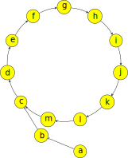

author: PeterlitsZo, Tiphereth-A

本文讨论费马小定理、欧拉定理及其扩展。这些定理解决了任意模数下任意大指数的幂的计算问题。

## 费马小定理

**费马小定理**（Fermat's little theorem）是数论中最基础的定理之一。它也是 [Fermat 素性测试](./prime.md#fermat-素性测试) 的理论基础。

???+ note "费马小定理"
    设 $p$ 是素数。对于任意整数 $a$ 且 $p\nmid a$，都成立 $a^{p-1}\equiv 1\pmod p$.

???+ note "定理"
    设 $p$ 是素数。对于任意整数 $a$，都成立 $a^{p}\equiv a\pmod p$.

这两个同余关系在 $p\nmid a$ 时是等价的；而在 $p\mid a$ 时，$a^p\equiv 0\equiv a\pmod p$ 平凡地成立。因此，这两个命题是等价的。这两个命题常常都称作费马小定理。

??? note "证明一"
    设 $p$ 是素数，且 $p\nmid a$。首先证明：对于 $i=1,2,\cdots,p-1$，余数 $ia \bmod p$ 各不相同。反证法。如果有 $1\le i < j < p$ 使得
    
    $$
    ia \bmod p = ja \bmod p. \iff (j-i)a\equiv 0.\pmod p
    $$
    
    但是，$(j-i)$ 和 $a$ 都不是 $p$ 的倍数，这显然矛盾。
    
    换句话说，这些余数是 $\{1,2,\cdots,p-1\}$ 的一个排列。因此，有
    
    $$
    \prod_{i=1}^{p-1}i = \prod_{i=1}^{p-1}(ia\bmod p) \equiv \prod_{i=1}^{p-1}ia = a^{p-1}\prod_{i=1}^{p-1}i.\pmod p
    $$
    
    这说明
    
    $$
    (a^{p-1}-1)\prod_{i=1}^{p-1}i \equiv 0. \pmod{p}
    $$
    
    也就是说，等式左侧是 $p$ 的倍数，但是 $i=1,2,\cdots, p-1$ 都不是 $p$ 的倍数，所以，只能有 $p\mid (a^{p-1}-1)$，亦即费马小定理成立。

??? note "证明二"
    注意到费马小定理的第二种表述对于所有 $a\in\mathbf N$ 都成立，因此，可以考虑使用数学归纳法。负整数的情形容易转化为非负整数的情形。
    
    归纳起点为 $0^p\equiv 0\pmod p$，显然成立。假设它对于 $a\in\mathbf N$ 成立，需要证明的是，它对于 $a+1$ 也成立。由二项式定理可知
    
    $$
    (a+1)^p=a^p+\binom{p}{1}a^{p-1}+\binom{p}{2}a^{p-2}+\cdots +\binom{p}{p-1}a+1.
    $$
    
    除了首尾两项，组合数的表达式 $\dbinom{p}{k} = \dfrac{p!}{k!(p-k)!}$ 中，$p$ 都能整除分子，而不能整除分母，因此，这些系数对于 $k\neq 0,p$ 都是 $p$ 的倍数。因此，有
    
    $$
    (a+1)^p \equiv a^p + 1\equiv a + 1. \pmod{p}
    $$
    
    其中，第二步应用了归纳假设。因此，利用数学归纳法可知，费马小定理成立。

费马小定理的逆命题并不成立。即使对于所有与 $n$ 互素的 $a$，都有 $a^{n-1}\equiv 1\pmod n$，那么，$n$ 也未必是素数。相关讨论详见 [Fermat 素性测试](./prime.md#fermat-素性测试) 一节。

## 欧拉定理

**欧拉定理**（Euler's theorem）将费马小定理推广到了一般模数的情形，但仍然要求底数与指数互素。

???+ note "欧拉定理"
    对于整数 $m>0$ 和整数 $a$，且 $\gcd(a,m)=1$，有 $a^{\varphi(m)}\equiv 1\pmod{m}$，其中，$\varphi(\cdot)$ 为 [欧拉函数](./euler-totient.md)。

??? note "证明"
    与费马小定理的证明一类似，仍然是取一个与 $m$ 互质的数列，再进行操作。考虑集合
    
    $$
    R = \{r\in\mathbf N : 0 < r < m,~\gcd(r,m)=1\}.
    $$
    
    这是模 $m$ 的 [既约剩余系](./basic.md#同余类与剩余系)。根据欧拉函数的定义可知，$|R|=\varphi(m)$。类似上文，将它们乘以 $a$ 相当于对该集合重新排列：
    
    $$
    R = \{ar\bmod m: r\in R\}.
    $$
    
    这是因为，容易验证 $\gcd(ar,m)=1$ 且不同的 $r_1,r_2\in R$ 对应的 $ar_1\bmod m$ 和 $ar_2\bmod m$ 也一定不同。因此，有
    
    $$
    \prod_{r\in R}r \equiv \prod_{r\in R}ar = a^{\varphi(m)}\prod_{r\in R}r. \pmod{m}
    $$
    
    再次重复之前的论证，消去 $\prod_{r\in R}r$，就得到 $a^{\varphi(m)}\equiv 1\pmod m$。

对于素数 $p$，有 $\varphi(p)=p-1$，因此，费马小定理是欧拉定理的一个特例。另外，欧拉定理中的指数 $\varphi(m)$ 在一般情形下并非使得该式成立的最小指数。它可以改进到 $\lambda(m)$，其中，$\lambda(\cdot)$ 是 [Carmichael 函数](./primitive-root.md#carmichael-函数)。关于相关结论的代数背景，可以参考 [整数同余类的乘法群](../algebra/ring-theory.md#应用整数同余类的乘法群) 一节。

## 扩展欧拉定理

扩展欧拉定理[^ex-euler]进一步将结论推广到了底数与指数不互素的情形。由此，它彻底解决了任意模数下任意底数的幂次计算问题，将它们转化为指数小于 $2\varphi(m)$ 的情形，从而可以通过 [快速幂](../binary-exponentiation.md) 在 $O(\log\varphi(m))$ 时间内计算。

???+ note "扩展欧拉定理"
    对于任意正整数 $m$、整数 $a$ 和非负整数 $k$，有
    
    $$
    a^k \equiv \begin{cases}
    a^{k \bmod \varphi(m)},                &\gcd(a,m) =  1,                   \\
    a^k,                                   &\gcd(a,m)\ne 1, k <   \varphi(m), \\
    a^{(k \bmod \varphi(m)) + \varphi(m)}, &\gcd(a,m)\ne 1, k \ge \varphi(m).
    \end{cases} \pmod m
    $$

第二种情形是在说，如果 $k < \varphi(m)$，那么，就无需继续降幂，直接应用快速幂即可；而第三种和第一种情形的最大区别是，通过取余降幂之后，是否需要加上一项 $\varphi(m)$。当然，将第一种情形合并进入第二、三种情形也是正确的。

### 直观理解

在严格证明定理之前，可以首先直观理解定理的含义。



考虑余数 $a^k\bmod m$ 随着 $b$ 增大而变化的情况。由于余数的取值一定在区间 $[0,m)$ 内，而 $k$ 有无限多个。将 $a^k\bmod m \mapsto a^{k+1}\bmod m$ 看作这些余数结点之间的有向边。那么，一定可以构成如图所示的循环。

扩展欧拉定理说明，这些循环可能是纯循环（第一种情形）或者混循环（第二、三种情形）。纯循环中，没有结点存在两个前驱，而混循环中就会出现这样的情形。因此，对于一般的情况，只需要能够求出循环节的长度和进入循环节之前的长度，就可以利用这个性质进行降幂。

### 严格证明

本节给出扩展欧拉定理的严格证明。

??? note "证明"
    首先说明，存在 $k_0\in\mathbf N$，使得整数 $a$ 和 $m':=\dfrac{m}{\gcd(a^{k_0},m)}$ 互素。为此，设 $\nu_p(n)$ 是整数 $n$ 的质因数分解中素数 $p$ 的幂次，那么，不妨取
    
    $$
    k_0 = \max\left\{\left\lceil\dfrac{\nu_p(m)}{\nu_p(a)}\right\rceil : \nu_p(a)>0\right\}.
    $$
    
    因为 $m$ 中所有和 $a$ 的公共素因子的幂次都已经包含在 $a^{k_0}$ 中，所以，$a$ 就与 $m$ 中剩下的因子 $m'=\dfrac{m}{\gcd(a^{k_0},m)}$ 互素。
    
    进而，对 $k\ge k_0$ 考察同余关系
    
    $$
    b\equiv a^k. \pmod m
    $$
    
    由于 $\gcd(a^{k_0},m)=\gcd(a^k,m)\mid b$，所以，将等式两侧（包括模数）同时除以 $\gcd(a^{k_0},m)$，就有
    
    $$
    \dfrac{b}{\gcd(a^{k_0},m)} = \dfrac{a^{k_0}}{\gcd(a^{k_0},m)}\cdot a^{k-k_0}. \pmod{m'}
    $$
    
    此时，因为 $a$ 与模数 $m'$ 互素，可以直接应用欧拉定理，得到
    
    $$
    \dfrac{b}{\gcd(a^{k_0},m)} \equiv \dfrac{a^{k_0}}{\gcd(a^{k_0},m)}\cdot a^{(k-k_0)\bmod\varphi(m')}. \pmod{m'}
    $$
    
    因此，再将因子 $\gcd(a^{k_0},m)$ 乘回去，就得到
    
    $$
    b \equiv a^{k_0}\cdot a^{(k-k_0)\bmod\varphi(m')} = a^{k_0 + (k-k_0)\bmod\varphi(m')}. \pmod{m}
    $$
    
    这就得到了扩展欧拉定理的形式。式子说明，循环节的长度是 $\varphi(m')$，而进入循环节之前的长度为 $k_0$。
    
    此处得到的参数比扩展欧拉定理中的更紧，但是相对来说，这些参数的计算并不容易。可以说明，这些参数可以放宽到扩展欧拉定理中的情形。首先，利用 [欧拉函数的表达式](./euler-totient.md) 可知，因为 $m'\mid m$，所以 $\varphi(m')\mid\varphi(m)$。也就是说，$\varphi(m)$ 也是它的循环节。其次，$k_0$ 也可以放宽到 $\varphi(m)$。这是因为对于所有 $m\in\mathbf N_+$ 和任意 $p\mid m$，都有
    
    $$
    \begin{aligned}
    \varphi(m) &\ge \varphi(p^{\nu_p(m)}) = (p-1)p^{\nu_p(m)-1} \ge p^{\nu_p(m)-1} \\
    &= (1+(p-1))^{\nu_p(m)-1} \ge 1 + (p-1)(\nu_p(m)-1) \\
    &\ge 1 + (\nu_p(m)-1) = \nu_p(m).
    \end{aligned}
    $$
    
    其中，第二行的不等式利用了二项式展开，并只保留常数项和一次项。因此，有
    
    $$
    k_0 \le \max\{\nu_p(m):p\in\mathbf P\}\le \varphi(m).
    $$
    
    这就完全证明了所述结论。

## 例题

本节通过一道例题展示扩展欧拉定理的一个经典应用——计算任意模数下的幂塔。**幂塔**（power tower）指形如 $A\uparrow(B\uparrow(C\uparrow(D\uparrow\cdots)))$ 的式子，其中，$\uparrow$ 是 Knuth 箭头记号，而 $A,B,C,D,\cdots$ 是一系列非负整数。

???+ example "[Library Checker - Tetration Mod](https://judge.yosupo.jp/problem/tetration_mod)"
    $T$ 组测试。每组测试中，给定 $A,B,M$，求 $(A\uparrow\uparrow B)\bmod M$。其中，$A\uparrow\uparrow B$ 表示由 $B$ 个 $A$ 组成的幂塔。或者，形式化地，定义
    
    $$
    A \uparrow\uparrow B =
    \begin{cases}
    1 , & B = 0,\\
    A\uparrow(A\uparrow\uparrow(B-1)), & B > 0.
    \end{cases}
    $$
    
    规定 $0^0=1$。

??? note "解答"
    利用 $A\uparrow\uparrow B$ 的定义，递归计算即可。要计算 $(A\uparrow\uparrow B)\bmod M$，只需要应用扩展欧拉定理，计算 $(A\uparrow\uparrow(B-1))\bmod\varphi(M)$。由于 $\varphi(\varphi(n)) \le n/2$ 对所有 $n\ge 2$ 都成立，所以，递归过程一定在 $O(\log M)$ 步内完成。由于需要应用扩展欧拉定理，所以需要区分当前的计算结果是否严格小于当前模数。为此，只需要在取余的时候多判断一步即可。另外，需要注意边界情况的处理。

??? note "参考代码"
    ```cpp
    --8<-- "docs/math/code/fermat/tetration.cpp"
    ```

## 习题

-   [Luogu P5091【模板】扩展欧拉定理](https://www.luogu.com.cn/problem/P5091)
-   [Codeforces 906 D. Power Tower](https://codeforces.com/problemset/problem/906/D)
-   [Luogu P3747 \[六省联考 2017\] 相逢是问候](https://www.luogu.com.cn/problem/P3747)
-   [Luogu P4139 上帝与集合的正确用法](https://www.luogu.com.cn/problem/P4139)
-   [Luogu P3934 \[Ynoi Easy Round 2016\] 炸脖龙 I](https://www.luogu.com.cn/problem/P3934)
-   [Luogu P6736「Wdsr-2」白泽教育](https://www.luogu.com.cn/problem/P6736)

## 参考资料与注释

-   [Fermat's little theorem - Wikipedia](https://en.wikipedia.org/wiki/Fermat%27s_little_theorem)
-   [Euler's theorem - Wikipedia](https://en.wikipedia.org/wiki/Euler%27s_theorem)
-   Hardy, Godfrey Harold, and Edward Maitland Wright. An introduction to the theory of numbers. Oxford university press, 1979.

[^ex-euler]: 这一名字主要出现在算法竞赛圈中，而并非该结论的通用名称。
