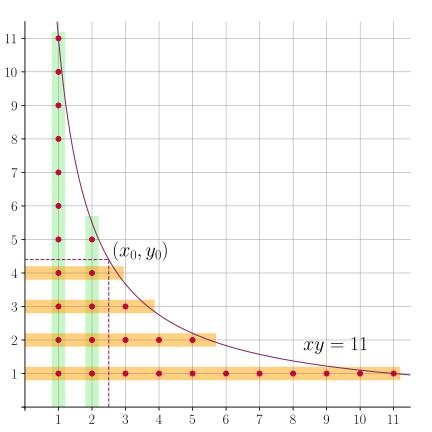

author: Backl1ght, c-forrest, Enter-tainer, Great-designer, Henry-ZHR, huayucaiji, hsfzLZH1, Ir1d, kenlig, ksyx, Marcythm, MegaOwIer, Menci, Nanarikom, nanmenyangde, ouuan, purple-vine, shawlleyw, sshwy, StudyingFather, Tiphereth-A, Xeonacid

前置知识：[Dirichlet 卷积](./dirichlet.md)、[数论分块](./sqrt-decomposition.md)

本文介绍 Dirichlet 双曲线法，它可用于在亚线性时间复杂度内计算两个数论函数的 Dirichlet 卷积的前缀和．通过对该算法的分析，可以引申出块筛的概念；据此，本文将进一步介绍块筛卷积的快速计算方法．最后，本文将介绍杜教筛，它可以用于计算两个数论函数在 Dirichlet 卷积意义下的商的前缀和．

## Dirichlet 双曲线法

Dirichlet 双曲线法可以用于计算两个数论函数的 Dirichlet 卷积的前缀和．

设 $f,g,h$ 是数论函数，且 $h = f\ast g$．那么，利用 Dirichlet 卷积的定义，$h$ 的前缀和

$$
H(n) = \sum_{k=1}^nh(k) = \sum_{k=1}^n\sum_{xy=k}f(x)g(y).
$$

求和式遍历的点集恰为第一象限（不含坐标轴）中双曲线 $xy=n$ 下方的整点集合．设整点 $(x,y)$ 的权值为 $f(x)g(y)$，那么 $H(n)$ 就是这一权值的和．



如图所示，这一权值和可以通过容斥原理计算：

$$
H(n) = \sum_{x=1}^{\lfloor x_0\rfloor}f(x)G\left(\left\lfloor\dfrac{n}{x}\right\rfloor\right) + \sum_{y=1}^{\lfloor y_0\rfloor}F\left(\left\lfloor\dfrac{n}{y}\right\rfloor\right)g(y) - F(\lfloor x_0\rfloor)G(\lfloor y_0\rfloor).
$$

其中，$F,G$ 分别是 $f,g$ 的前缀和函数，$(x_0,y_0)$ 是双曲线 $xy=n$ 上任意一个点．表达式中，第一项表示图中绿色区域的权值和，第二项表示图中橙色区域的权值和，第三项则表示两个区域重叠部分的权值和．这个表达式仅含有 $\lfloor x_0\rfloor + \lfloor y_0\rfloor + 1$ 项．对于合理选择的 $(x_0,y_0)$，它的计算复杂度显著优于暴力计算 $h(n)$ 的前缀和．这就是 **Dirichlet 双曲线法**（Dirichlet hyperbola method）．

### 卷积前缀和点值的计算

Dirichlet 双曲线法最基本的应用就是计算前缀和函数的点值 $H(n)$．

如果 $F,G$ 的点值已知（或可以在 $O(1)$ 时间内计算），进而 $f,g$ 的点值也已知，那么 Dirichlet 双曲线法的表达式中每一项都可以在 $O(1)$ 时间内计算，总时间复杂度就等于 $O(x_0+y_0)$．因为 $x_0y_0=n$，所以由均值不等式可知，当 $x_0=y_0=\sqrt{n}$ 时，就得到最低时间复杂度 $O(\sqrt{n})$．

这并非新的结果．在 Dirichlet 双曲线法的表达式中，令 $x_0 > n$，就得到

$$
H(n) = \sum_{x=1}^nf(x)G\left(\left\lfloor\dfrac{n}{x}\right\rfloor\right).
$$

利用 [数论分块](./sqrt-decomposition.md) 的技巧，当 $F,G$ 的点值已知时，该式可以在 $O(\sqrt{n})$ 时间内计算．这实际上和本节得到的算法是几乎等价的：这两种方法需要的已知信息基本类似，计算的表达式也大致相同．

??? note "等价性的说明"
    细究数论分块的计算过程可以发现，实际计算的表达式为
    
    $$
    H(n) = \sum_{y\in D(n)}\left(F\left(\left\lfloor\dfrac{n}{y}\right\rfloor\right)-F\left(\left\lfloor\dfrac{n}{y+1}\right\rfloor\right)\right)G(y).
    $$
    
    其中，$D(n) = \left\{\left\lfloor\dfrac{n}{x}\right\rfloor : 1 \le x \le n,~x\in\mathbf N_+\right\}$ 是数论分块中的关键点集合．
    
    根据数论分块的性质可知，对于 $x\le\sqrt{n}$，对应分块的高度 $y = \lfloor n/x\rfloor$ 各不相同，于是这些分块的长度都是 $1$，亦即
    
    $$
    \left\lfloor\dfrac{n}{y+1}\right\rfloor + 1 = x = \left\lfloor\dfrac{n}{y}\right\rfloor.
    $$
    
    因此，这些分块对应的求和为
    
    $$
    I_1 = \sum_{x=1}^{\lfloor\sqrt{n}\rfloor}\left(F(x)-F(x-1)\right)G\left(\left\lfloor\dfrac{n}{x}\right\rfloor\right) = \sum_{x=1}^{\lfloor\sqrt{n}\rfloor}f(x)G\left(\left\lfloor\dfrac{n}{x}\right\rfloor\right).
    $$
    
    剩下的分块，高度 $y$ 遍历 $1,2,\cdots,y^*= \left\lfloor\dfrac{n}{\lfloor\sqrt{n}\rfloor + 1}\right\rfloor$．对剩余的和式应用 [Abel 变换](https://en.wikipedia.org/wiki/Summation_by_parts)（即分部积分法的求和形式），就得到
    
    $$
    \begin{aligned}
    I_2 &= \sum_{y=1}^{y^*}\left(F\left(\left\lfloor\dfrac{n}{y}\right\rfloor\right)-F\left(\left\lfloor\dfrac{n}{y+1}\right\rfloor\right)\right)G(y) \\
    &= \sum_{y=1}^{y^*}F\left(\left\lfloor\dfrac{n}{y}\right\rfloor\right)g(y) - F\left(\left\lfloor\dfrac{n}{y^*+1}\right\rfloor\right)G(y^*).
    \end{aligned}
    $$
    
    数论分块的性质说明，$\lfloor n/\lfloor \sqrt{n}\rfloor\rfloor \ge \lfloor \sqrt{n}\rfloor$．由此，分两种情形：
    
    -   当 $\lfloor n/\lfloor \sqrt{n}\rfloor\rfloor = \lfloor \sqrt{n}\rfloor$ 时，必然有 $y^* < \lfloor \sqrt{n}\rfloor$．由于它与 $x = \lfloor \sqrt{n}\rfloor$ 所在块相邻，块高只能恰好相差一，即 $y^* = \lfloor \sqrt{n}\rfloor - 1$．此时，有
    
        $$
        \begin{aligned}
        I_2 &= \sum_{y=1}^{\lfloor\sqrt{n}\rfloor-1}F\left(\left\lfloor\dfrac{n}{y}\right\rfloor\right)g(y) - F(\lfloor\sqrt{n}\rfloor)G(\lfloor\sqrt{n}\rfloor-1)\\
        &= \sum_{y=1}^{\lfloor\sqrt{n}\rfloor-1}F\left(\left\lfloor\dfrac{n}{y}\right\rfloor\right)g(y) -  F(\lfloor\sqrt{n}\rfloor)\left(G(\lfloor\sqrt{n}\rfloor) - g(\lfloor\sqrt{n}\rfloor)\right) \\
        &= \sum_{y=1}^{\lfloor\sqrt{n}\rfloor}F\left(\left\lfloor\dfrac{n}{y}\right\rfloor\right)g(y) - F(\lfloor\sqrt{n}\rfloor)G(\lfloor\sqrt{n}\rfloor).
        \end{aligned}
        $$
    
    -   当 $\lfloor n/\lfloor \sqrt{n}\rfloor\rfloor > \lfloor \sqrt{n}\rfloor$ 时，必然有 $y^* = \lfloor \sqrt{n}\rfloor$．直接代入求和式，就得到
    
        $$
        I_2 = \sum_{y=1}^{\lfloor\sqrt{n}\rfloor}F\left(\left\lfloor\dfrac{n}{y}\right\rfloor\right)g(y) - F(\lfloor\sqrt{n}\rfloor)G(\lfloor\sqrt{n}\rfloor).
        $$
    
    综上，除了一个 Abel 变换，数论分块的计算过程实际上就是在计算如下算式：
    
    $$
    H(n) = \sum_{x=1}^{\lfloor\sqrt{n}\rfloor}f(x)G\left(\left\lfloor\dfrac{n}{x}\right\rfloor\right) + \sum_{y=1}^{\lfloor\sqrt{n}\rfloor}F\left(\left\lfloor\dfrac{n}{y}\right\rfloor\right)g(y) - F(\lfloor\sqrt{n}\rfloor)G(\lfloor\sqrt{n}\rfloor).
    $$
    
    这就是 $(x_0,y_0)=(\sqrt{n},\sqrt{n})$ 时 Dirichlet 双曲线法的表达式．因此可以说，两种算法的计算过程几乎等价．而且，由于 Dirichlet 双曲线法利用了更多数论分块的性质，避免了朴素数论分块中的不必要计算，常数更小一些．

在处理实际问题时，已知 $F,G$ 点值这一条件可能过强．但是，Dirichlet 双曲线法（或对应的数论分块）其实并不需要 $F,G$ 的全部点值信息．观察求和表达式可知，其实只需要 $F$ 和 $G$ 在数论分块关键点集合

$$
D(n) = \left\{\left\lfloor\dfrac{n}{x}\right\rfloor : 1 \le x \le n,~x\in\mathbf N_+\right\}
$$

处的取值．它既是全体块高的集合，也是全体块的右端点集合．注意，根据数论分块的 [性质](./sqrt-decomposition.md#性质) 可知，这一集合包含所有 $1\le x\le\sqrt{n}$ 的整数值，因此，已知 $F,G$ 在 $D(n)$ 处的取值就相当于已知 $f,g$ 在所有 $1\le x\le\sqrt{n}$ 处的取值．这一集合的大小是 $\Theta(\sqrt{n})$ 的，所以，计算 $H(n)$ 时，只需要知道 $F,G$ 在一个稀疏集合处的点值信息．这个观察是优化数论函数前缀和计算的关键．

## 块筛及其卷积

有些时候，$h=f\ast g$ 并非最终需要计算前缀和的函数，而只是中间步骤之一．根据前文分析，为了后续计算，需要求出前缀和函数 $H$ 在集合 $D(n)$ 处的取值．这就称为数论函数 $h$ 的 **块筛**：

$$
\mathcal S_h(n) = \left\{H(x) : x \in D(n)\right\}.
$$

本节讨论 **块筛卷积** 问题的计算方法：已知 $f,g$ 的块筛时，求它们的 Dirichlet 卷积 $h = f\ast g$ 的块筛．

### 朴素算法

朴素算法就是将块筛的计算看作是 $|D(n)|$ 次前缀和点值的计算．这样做的总时间复杂度为

$$
\begin{aligned}
O\left(\sum_{d\in D(n)}\sqrt{d}\right) &= O\left(\sum_{x=1}^{\lfloor\sqrt{n}\rfloor}\sqrt{x} + \sum_{x=1}^{\lfloor\sqrt{n}\rfloor}\sqrt{\dfrac{n}{x}}\right) \\
&= O\left(\int_1^{\sqrt{n}}\sqrt{x}\mathrm{d}x + \int_1^{\sqrt{n}}\sqrt{\dfrac{n}{x}}\mathrm{d}x\right)\\
&= O(n^{3/4}).
\end{aligned}
$$

正是因为块筛是稀疏的，所以整个块筛可以在亚线性时间内求出．

但是，这一算法显然过于暴力．集合 $D(n)$ 中较小的那些元素取值相对稠密，所以块筛中相邻两个前缀和相差并不大，完全可以直接计算卷积 $h$ 的点值，再求它的前缀和．这比起对每个点都单独求一遍前缀和点值要更快．例如，对 $x = 1,2,\cdots,\lfloor\sqrt{n}\rfloor$ 分别计算前缀和点值需要

$$
O\left(\sum_{x=1}^{\lfloor\sqrt{n}\rfloor}\sqrt{x}\right) = O(n^{3/4})
$$

的时间；但是，直接计算 $h$ 在这些点处的点值再累和，却只需要 $O(n^{1/2}\log n)$ 的时间．尽管如此，如果只知道 $f,g$ 的块筛而不知道更多信息，那么这一思路是无法继续优化该算法复杂度的．这是因为块筛中只包含 $x \le \sqrt{n}$ 处的点值信息，至多只能计算 $h$ 在 $1\le x\le\sqrt{n}$ 处的点值，而剩余前缀和点值的计算仍然需要 $O(n^{3/4})$ 的时间．

### 利用点值信息优化

如果已知信息除了 $f,g$ 的块筛外，还包含它们的更多点值，那么，确实可以改进这一算法的复杂度．实践中，这一算法通常应用于 $f,g$ 的点值可以快速预处理时．

选择 $z \ge \sqrt{n}$．卷积 $h$ 的块筛分为两部分：

-   计算 $f\ast g$ 的卷积 $h$ 在 $1\le x \le z$ 处的点值，再直接累加求和得到 $H$ 在 $1\le x\le z$ 处的点值．
-   对于 $x\in D(n)$ 且 $x > z$，通过 Dirichlet 双曲线法计算 $H$ 在 $x$ 处的点值．

对于一般情形，这样做的时间复杂度为

$$
\begin{aligned}
O\left(z\log z + \sum_{d\in D(n),~d\ge z}\sqrt{d}\right) &= O\left(z\log z + \sum_{x=1}^{n/z}\sqrt{\dfrac{n}{x}}\right)\\
&= O\left(z\log z + \int_1^{n/z}\sqrt{\dfrac{n}{x}}\mathrm{d}x\right)\\
&= O\left(z\log z + \dfrac{n}{\sqrt{z}}\right).
\end{aligned}
$$

当 $z=\left(\dfrac{n}{\log n}\right)^{2/3}$ 时，总时间复杂度最小为 $O\left(n^{2/3}(\log n)^{1/3}\right)$．

当然，Dirichlet 卷积 [点值计算](./dirichlet.md#dirichlet-卷积的计算) 的复杂度与 $f,g,h$ 的性质有关．对于 $f,g,h$ 有特殊性质的情形，最优分点和复杂度均略有不同：

-   如果 $f$ 或 $g$ 是积性的，那么当 $z=\left(\dfrac{n}{\log\log n}\right)^{2/3}$ 时，总时间复杂度最小为 $O\left(n^{2/3}(\log\log n)^{1/3}\right)$．
-   如果 $h$ 是积性的，那么当 $z=n^{2/3}$ 时，总时间复杂度最小为 $O(n^{2/3})$．

应用这一优化并不需要 $f,g$ 的全部点值，而只需要它们在 $1\le x\le z$ 处的点值．因为这一算法也得到了 $h$ 在 $1\le x\le z$ 处的点值，所以当 $h$ 作为中间变量时，同样可以利用 $h$ 的点值优化后续计算过程．数论函数的块筛，再加上它这些点值，就构成了一个增强版的块筛：它们是在 $O(n^{2/3+\varepsilon})$ 时间内计算卷积前缀和的全部必要信息．

### 快速块筛卷积

## 杜教筛

前文讨论了如何计算数论函数 Dirichlet 卷积的前缀和．本节考虑它的逆过程：设 $f \ast g = h$，且 $f,h$ 已知，计算 $g$ 的前缀和

$$
G(n) = \sum_{x=1}^ng(x).
$$

换句话说，本节考虑两个数论函数 Dirichlet 卷积意义的商的前缀和计算．本节总是假设 $f(1)\neq 0$，以保证 $f$ 可逆．

为此，在 Dirichlet 双曲线法表达式中令 $x_0 > n$，就得到

$$
H(n) = \sum_{x=1}^{n}f(x)G\left(\left\lfloor\dfrac{n}{x}\right\rfloor\right).
$$

直接解出 $G(n)$，就得到

$$
G(n) = \dfrac{1}{f(1)}\left(H(n)-\sum_{x=2}^nf(x)G\left(\left\lfloor\dfrac{n}{x}\right\rfloor\right)\right).
$$

这就是杜教筛的表达式．实际上对于 $x_0 \ge 1$，总有

$$
G(n) = \dfrac{1}{f(1)}\left(H(n)-\sum_{x=2}^{\lfloor x_0\rfloor}f(x)G\left(\left\lfloor\dfrac{n}{x}\right\rfloor\right) - \sum_{y=1}^{\lfloor y_0\rfloor}F\left(\left\lfloor\dfrac{n}{y}\right\rfloor\right)g(y) + F(\lfloor x_0\rfloor)G(\lfloor y_0\rfloor)\right).
$$

无论是哪种形式，它都是一个关于 $G(n)$ 的递推关系式．为计算 $G(n)$ 的取值，需要计算 $G$ 在 $D(n)\setminus\{n\}$ 处的取值．因为 $D(n)$ 具有 [递归结构](./sqrt-decomposition.md#性质)，即对于 $m\in D(n)$，总是有 $D(m)\subseteq D(n)$，所以在整个递归计算过程中，只需要计算 $G$ 在 $D(n)$ 中元素处的取值各一次．换句话说，计算 $G(n)$ 时，实际上得到了 $g$ 的块筛 $\mathcal S_g(n)$．

具体实现时，可以采用递归的方法，并采用记忆化避免重复计算．当然，也可以采用迭代的方法，从小到大依次计算 $D(n)$ 中每个点处 $G$ 的取值．此时，表达式中的求和式既可以采用数论分块计算，也可以采用 Dirichlet 双曲线法计算．

这些实现的复杂度是相同的．由于杜教筛总是得到块筛，所以杜教筛的复杂度其实相当于计算块筛的复杂度．如果已知信息只有 $F,H$ 的块筛，那么杜教筛的复杂度就是 $O(n^{3/4})$；如果对于某个 $z\ge\sqrt{n}$，可以在 $T_0(z)$ 时间内预处理出 $g$ 在 $1\le x \le z$ 处的点值，那么杜教筛的复杂度就是

$$
O\left(T_0(z) + \dfrac{n}{\sqrt{z}}\right).
$$

当 $g$ 是积性函数时，可以应用线性筛，即 $T_0(z)=\Theta(z)$，所以最优需要预处理到 $z = n^{2/3}$ 处，总时间复杂度为 $O(n^{2/3})$；对于更一般的情形，总时间复杂度则为 $O(n^{2/3}(\log n)^{1/3})$．这些都和块筛部分的分析完全一致．

??? warning "递归实现时，不使用记忆化将导致复杂度错误"
    杜教筛的表达式中，计算 $G(n)$ 的值，需要依赖于 $D(n)\setminus\{n\}$ 中 $G$ 的取值．此处保证复杂度的关键在于注意到集合 $D(n)$ 的递归结构：当 $m\in D(n)$ 时，$D(m)\subseteq D(n)$．利用这一性质，可以通过记忆化加速计算．利用记忆化后，如前文所示，算法的复杂度是 $O(n^{3/4})$ 的．此处要说明的是，如果不使用记忆化，算法复杂度是错误的．
    
    设不使用记忆化时，应用递归方法计算 $G(n)$ 的复杂度是 $T(n)$．那么，有
    
    $$
    \begin{aligned}
    T(n) &= \Theta(\sqrt{n}) + \sum_{d\in D(n),~d\neq 1}T(d)\\
    &= \Theta(\sqrt{n}) + \sum_{x=1}^{\lfloor n/\lfloor\sqrt{n}\rfloor\rfloor - 1} T(x) + \sum_{x = 1}^{\lfloor\sqrt{n}\rfloor}T\left(\left\lfloor\dfrac{n}{x}\right\rfloor\right).
    \end{aligned}
    $$
    
    利用类似 [主定理](../../basic/complexity.md#主定理-master-theorem) 的证明思路，可以说明，最后一项主导了该式的增长，且 $T(n)\in\Theta(n^\alpha)$，其中，$\alpha\approx 1.73$ 是 $\zeta(\alpha)=2$ 的根．

应用杜教筛计算数论函数 $g$ 前缀和时，关键在于找到合适的 $f,h$ 使得 $h=f\ast g$ 且 $f,h$ 的块筛都容易计算．在有些时候，这样的 $f,h$ 是显然的；在另一些时候，需要利用 Dirichlet 卷积的性质或通过计算相应的 Dirichlet 生成函数来找到相应的分解．后文的例题展示了这些情形．

## 例题

本节介绍几道计算数论函数前缀和的题目．

???+ example "[AtCoder Regular Contest 116 C - Multiple Sequences](https://atcoder.jp/contests/arc116/tasks/arc116_c)"
    给定正整数 $N$ 和 $M$．需要计算有多少长度为 $N$ 的序列 $A$ 满足 $1 \le A_i \le M$ 且 $A_i$ 整除 $A_{i+1}$．答案对 $998244353$ 取模．数据范围：$1 \le N, M \le 2\times 10^5$．

??? note "解答"
    设长度为 $n$ 且 $A_n=m$ 的序列数目为 $f_n(m)$．那么，最终的答案就是 $\sum_{m=1}^M f_N(m)$．要计算 $f_n(m)$，考虑应用动态规划的方法．动态转移方程为：
    
    $$
    f_n(m) = \sum_{k\mid m}f_{n-1}(k).
    $$
    
    利用 Dirichlet 卷积的记号，它可以记作 $f_n = f_{n-1}\ast 1$，其中，$1$ 是常值数论函数．注意到 $f_1 = 1$，归纳可知，$f_n = 1 ^{\ast n}$．也就是说，$f_n$ 是 $n$ 个常值函数的卷积．最后的答案就是 $f_N$ 的前缀和．由于过程中只涉及积性函数，利用前文介绍的 Dirichlet 卷积前缀和的计算方法，单次卷积前缀和的计算只需要 $O(M^{2/3})$ 的时间；再利用 [快速幂](../binary-exponentiation.md) 的方法，只需要计算 $O(\log N)$ 次卷积前缀和即可得到 $f_N$ 的卷积前缀和的值．整体时间复杂度为 $O(M^{2/3}\log N)$．

???+ example "[P4213【模板】杜教筛（Sum）](https://www.luogu.com.cn/problem/P4213)"
    设 $\mu$ 和 $\varphi$ 分别是莫比乌斯函数和欧拉函数．求 $S_1(n)= \sum_{i=1}^{n} \mu(i)$ 和 $S_2(n)= \sum_{i=1}^{n} \varphi(i)$ 的值．数据范围：$1\leq n<2^{31}$.

??? note "解答"
    注意到 Dirichlet 卷积关系式：
    
    $$
    \varepsilon = \mu \ast 1,~ \operatorname{id} = \varphi \ast 1.
    $$
    
    其中，$\varepsilon(n) = [n=1]$ 是 Dirichlet 卷积的单位元函数，$\operatorname{id}(n) = n$ 是恒等函数，$1(n) = 1$ 是常值函数．因为这三个函数的前缀和都可以在 $O(1)$ 时间内计算且都是积性函数，所以，利用前文介绍的杜教筛方法就可以在 $O(n^{2/3})$ 时间内计算．
    
    对于欧拉函数的前缀和的计算，另一种方法是利用 [莫比乌斯反演](./mobius.md)．注意到
    
    $$
    \begin{aligned}
    S_2(n) &= \sum_{i=1}^n\varphi(i) = \sum_{i=1}^n\sum_{j=1}^i[i\perp j] \\
    &= \sum_{i=1}^n\sum_{j=1}^i\sum_d\mu(d)[d\mid i][d\mid j] \\
    &= \sum_d\mu(d)\dfrac{1}{2}\left\lfloor\dfrac{n}{d}\right\rfloor\left(\left\lfloor\dfrac{n}{d}\right\rfloor+1\right).
    \end{aligned}
    $$
    
    在数论分块的过程中，需要 $\mu(d)$ 的前缀和，而这可以通过杜教筛预处理出来．时间复杂度仍然是 $O(n^{2/3})$．

??? note "参考实现"
    ```cpp
    --8<-- "docs/math/code/du/du_1.cpp"
    ```

???+ example "[「LuoguP3768」简单的数学题](https://www.luogu.com.cn/problem/P3768)"
    给定 $p,n$，计算
    
    $$
    \sum_{i=1}^n\sum_{j=1}^nij\cdot\gcd(i,j)\pmod p.
    $$
    
    数据范围：$n\leq 10^{10}$，$5\times 10^8\leq p\leq 1.1\times 10^9$ 且 $p$ 是质数．

??? note "解答"
    利用 [欧拉函数](./euler-totient.md) 的性质，做如下反演：
    
    $$
    \begin{aligned}
    T(n) &= \sum_{i=1}^n\sum_{j=1}^nij\cdot\gcd(i,j)\\
    &= \sum_{i=1}^n\sum_{j=1}^nij\sum_d\varphi(d)[d\mid i][d\mid j]\\
    &= \sum_d\varphi(d)\left(\sum_{i=1}^{\lfloor n/d\rfloor}id\right)\left(\sum_{j=1}^{\lfloor n/d\rfloor}jd\right)\\
    &= \sum_d d^2\varphi(d) F\left(\left\lfloor\dfrac{n}{d}\right\rfloor\right)^2.
    \end{aligned}
    $$
    
    其中，$F(n) = \dfrac{1}{2}n(n+1)$．该式可以通过数论分块计算，但需要预处理出 $d^2\varphi(d)$ 的前缀和．
    
    为此，可以利用杜教筛．记 $f(n)=(\operatorname{id}^2\varphi)(n)$ 和 $S(n)=\sum_{i=1}^n f(i)$．应用杜教筛的关键是构造出函数 $g$，使得 $f\ast g$ 和 $g$ 都可以快速求和．前文已经讨论了用杜教筛预处理 $\varphi$ 前缀和的方法，这只需要利用关系：$\operatorname{id} = \varphi\ast 1$．相较于 $\varphi$，这里的 $f$ 多了一个 $\operatorname{id}^2$．由于 $\operatorname{id}$ 是完全积性函数，利用 Dirichlet 卷积的 [性质](./dirichlet.md#性质)，只需要类似地将每一项都乘以 $\operatorname{id}^2$，就得到
    
    $$
    \operatorname{id}^3 = f \ast \operatorname{id}^2.
    $$
    
    因为 $\operatorname{id}^2(n)=n^2$ 和 $\operatorname{id}^3(n)=n^3$ 的前缀和都可以在 $O(1)$ 时间内计算，$f$ 的前缀和就可以在 $O(n^{2/3})$ 时间内预处理得到．再加上数论分块，整体时间复杂度仍然是 $O(n^{2/3})$．
    
    另一种将类似积性函数表示为两函数之（在 Dirichlet 卷积意义下的）商的方法是利用 [Dirichlet 生成函数](./dirichlet.md#dirichlet-生成函数)．

??? note "参考实现"
    ```cpp
    --8<-- "docs/math/code/du/du_2.cpp"
    ```

## 习题

-   [AtCoder Xmas Contest 2019 D - Sum of (-1)^f(n)](https://atcoder.jp/contests/xmascon19/tasks/xmascon19_d)

## 参考资料

-   任之洲．2016．《积性函数求和的几种方法》．2016 年信息学奥林匹克中国国家队候选队员论文．
-   周康阳．2024．《关于积性函数求和问题的一些进展》．2024 年信息学奥林匹克中国国家队候选队员论文．
-   [Dirichlet hyperbola method - Wikipedia](https://en.wikipedia.org/wiki/Dirichlet_hyperbola_method)
-   [杜教筛的时空复杂度分析 - riteme.site](https://riteme.site/blog/2018-9-11/time-space-complexity-dyh-algo.html)
-   [OI 中常用数论函数求和法的简化陈述 by negiizhao - UOJ](https://negiizhao.blog.uoj.ac/blog/7165)
-   [Dirichlet 積と、数論関数の累積和 by maspy](https://maspypy.com/dirichlet-%e7%a9%8d%e3%81%a8%e3%80%81%e6%95%b0%e8%ab%96%e9%96%a2%e6%95%b0%e3%81%ae%e7%b4%af%e7%a9%8d%e5%92%8c)
-   [Dirichlet convolution. Part 1: Fast prefix sum computations by adamant - Codeforces](https://codeforces.com/blog/entry/117635)
