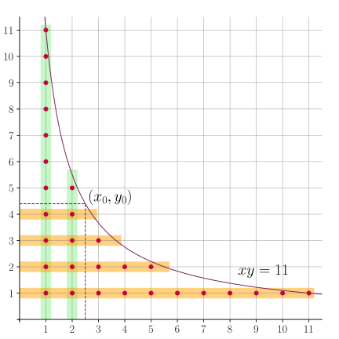

author: Backl1ght, c-forrest, Enter-tainer, Great-designer, Henry-ZHR, huayucaiji, hsfzLZH1, Ir1d, kenlig, ksyx, Marcythm, MegaOwIer, Menci, Nanarikom, nanmenyangde, ouuan, purple-vine, shawlleyw, sshwy, StudyingFather, Tiphereth-A, Xeonacid

前置知识：[Dirichlet 卷积](./dirichlet.md)

本文介绍 Dirichlet 双曲线法，并以此为基础探讨数论函数前缀和的通用计算方法。Dirichlet 双曲线法可用于在亚线性时间复杂度内计算两个数论函数的 Dirichlet 卷积的前缀和。通过对该算法的分析，可以引申出块筛的概念；据此，本文将进一步介绍块筛卷积的快速计算方法。最后，本文将介绍杜教筛，它可以用于计算两个数论函数在 Dirichlet 卷积意义下的商的前缀和。

## Dirichlet 双曲线法

Dirichlet 双曲线法可以用于计算两个数论函数的 Dirichlet 卷积的前缀和。

设 $f,g,h$ 是数论函数，且 $h = f\ast g$。那么，利用 Dirichlet 卷积的定义，$h$ 的前缀和

$$
H(n) = \sum_{k=1}^nh(k) = \sum_{k=1}^n\sum_{xy=k}f(x)g(y).
$$

求和式遍历的点集恰为第一象限（不含坐标轴）中双曲线 $xy=n$ 下方的整点集合。设整点 $(x,y)$ 的权值为 $f(x)g(y)$，那么 $H(n)$ 就是这一权值的和。



如图所示，这一权值和可以通过容斥原理计算：

$$
H(n) = \sum_{x=1}^{\lfloor x_0\rfloor}f(x)G\left(\left\lfloor\dfrac{n}{x}\right\rfloor\right) + \sum_{y=1}^{\lfloor y_0\rfloor}F\left(\left\lfloor\dfrac{n}{y}\right\rfloor\right)g(y) - F(\lfloor x_0\rfloor)G(\lfloor y_0\rfloor).
$$

其中，$F,G$ 分别是 $f,g$ 的前缀和函数，$(x_0,y_0)$ 是双曲线 $xy=n$ 上任意一个点。表达式中，第一项表示图中绿色区域的权值和，第二项表示图中橙色区域的权值和，第三项则表示两个区域重叠部分的权值和。这个表达式仅含有 $\lfloor x_0\rfloor + \lfloor y_0\rfloor + 1$ 项。对于合理选择的 $(x_0,y_0)$，它的计算复杂度显著优于暴力计算 $h(n)$ 的前缀和。这就是 **Dirichlet 双曲线法**（Dirichlet hyperbola method）。

### 前缀和点值的计算

Dirichlet 双曲线法最基本的应用就是计算前缀和函数的点值 $H(n)$。

如果 $F,G$ 的点值已知（或可以在 $O(1)$ 时间内计算），进而 $f,g$ 的点值也已知，那么 Dirichlet 双曲线法的表达式中每一项都可以在 $O(1)$ 时间内计算，总时间复杂度就等于 $O(x_0+y_0)$。因为 $x_0y_0=n$，所以由均值不等式可知，当 $x_0=y_0=\sqrt{n}$ 时，就得到最低时间复杂度 $O(\sqrt{n})$。

这并非新的结果。在 Dirichlet 双曲线法的表达式中，令 $x_0 > n$，就得到

$$
H(n) = \sum_{x=1}^nf(x)G\left(\left\lfloor\dfrac{n}{x}\right\rfloor\right).
$$

利用 [数论分块](./sqrt-decomposition.md) 的技巧，当 $F,G$ 的点值已知时，该式可以在 $O(\sqrt{n})$ 时间内计算。这实际上和本节得到的算法是几乎等价的：它们需要的已知信息基本类似，计算的表达式也大致相同。

??? note "等价性的说明"
    细究数论分块的计算过程可以发现，实际计算的表达式为
    
    $$
    H(n) = \sum_{y\in D_n}\left(F\left(\left\lfloor\dfrac{n}{y}\right\rfloor\right)-F\left(\left\lfloor\dfrac{n}{y+1}\right\rfloor\right)\right)G(y).
    $$
    
    其中，$D_n = \left\{\left\lfloor\dfrac{n}{x}\right\rfloor : 1 \le x \le n,~x\in\mathbf N_+\right\}$ 是数论分块中的关键点集合。对于 $y > \sqrt{n}$，有
    
    $$
    \dfrac{n}{y} - \dfrac{n}{y+1} = \dfrac{n}{y(y+1)} < 1.
    $$
    
    对于 $a > b > 0$，总有 $\lfloor a\rfloor - \lfloor b\rfloor \le \lceil a-b\rceil$，所以
    
    $$
    \left\lfloor\dfrac{n}{y}\right\rfloor - \left\lfloor\dfrac{n}{y + 1}\right\rfloor \le \left\lceil\dfrac{n}{y(y+1)}\right\rceil = 1.
    $$
    
    根据数论分块的 [性质](./sqrt-decomposition.md#性质) 可知，只要 $y\in D_n$，即存在 $x$ 使得 $\lfloor n/x\rfloor = y$ 成立，就有
    
    $$
    \left\lfloor\dfrac{n}{y + 1}\right\rfloor +1 \le x \le\left\lfloor\dfrac{n}{y}\right\rfloor.
    $$
    
    因此，对于 $y\in D_n$ 且 $y \ge \sqrt{n}$，总有
    
    $$
    \left\lfloor\dfrac{n}{y + 1}\right\rfloor +1 = x = \left\lfloor\dfrac{n}{y}\right\rfloor.
    $$
    
    而且，这里满足 $\lfloor n/x\rfloor = y$ 的 $x$ 是唯一的。也就是说，不同的 $x \ge \sqrt{n}$ 一定对应不同的 $y \in D_n$。只要 $x$ 遍历 $1,2,\cdots,\lfloor \sqrt{n}\rfloor$，相应的 $y = \lfloor n/x\rfloor$ 就遍历 $D_n$ 中所有大于等于 $\sqrt{n}$ 的元素。对称地，$D_n$ 中的剩余元素就是 $1,2,\cdots,\lceil \sqrt{n}\rceil-1$。利用这一结论，数论分块的求和过程可以分成两部分：
    
    $$
    H(n) = \sum_{x=1}^{\lfloor\sqrt{n}\rfloor}f(x)G\left(\left\lfloor\dfrac{n}{x}\right\rfloor\right) + \sum_{y=1}^{\lceil \sqrt{n}\rceil-1}\left(F\left(\left\lfloor\dfrac{n}{y}\right\rfloor\right)-F\left(\left\lfloor\dfrac{n}{y+1}\right\rfloor\right)\right)G(y)
    $$
    
    其中，第一项的变形用到了 $F(x)-F(x-1)=f(x)$。设第二项为 $I_2$，对它进行 [Abel 变换](https://en.wikipedia.org/wiki/Summation_by_parts)（即分部积分法的求和形式），就得到
    
    $$
    I_2=\sum_{y=1}^{\lceil\sqrt{n}\rceil -1}F\left(\left\lfloor\dfrac{n}{y}\right\rfloor\right)(G(y)-G(y-1)) - F\left(\left\lfloor\dfrac{n}{\lceil\sqrt{n}\rceil}\right\rfloor\right)G(\lceil\sqrt{n}\rceil-1).
    $$
    
    当 $n$ 不是完全平方数时，$\lceil\sqrt{n}\rceil -1 = \lfloor\sqrt{n}\rfloor$ 且 $\lfloor n/\lceil\sqrt{n}\rceil\rfloor = \lfloor \sqrt{n}\rfloor$，有
    
    $$
    I_2=\sum_{y=1}^{\lfloor\sqrt{n}\rfloor}F\left(\left\lfloor\dfrac{n}{y}\right\rfloor\right)g(y) - F(\lfloor\sqrt{n}\rfloor)G(\lfloor\sqrt{n}\rfloor).
    $$
    
    而当 $n$ 是完全平方数时，$\lceil\sqrt{n}\rceil = \lfloor\sqrt{n}\rfloor = \lfloor n/\lceil\sqrt{n}\rceil\rfloor$，同样有
    
    $$
    \begin{aligned}
    I_2 &= \sum_{y=1}^{\lfloor\sqrt{n}\rfloor-1}F\left(\left\lfloor\dfrac{n}{y}\right\rfloor\right)g(y) - F(\lfloor\sqrt{n}\rfloor)G(\lfloor\sqrt{n}\rfloor-1)\\
    &= \sum_{y=1}^{\lfloor\sqrt{n}\rfloor-1}F\left(\left\lfloor\dfrac{n}{y}\right\rfloor\right)g(y) -  F(\lfloor\sqrt{n}\rfloor)\left(G(\lfloor\sqrt{n}\rfloor) - g(\lfloor\sqrt{n}\rfloor)\right) \\
    &= \sum_{y=1}^{\lfloor\sqrt{n}\rfloor}F\left(\left\lfloor\dfrac{n}{y}\right\rfloor\right)g(y) - F(\lfloor\sqrt{n}\rfloor)G(\lfloor\sqrt{n}\rfloor).
    \end{aligned}
    $$
    
    综上，除了一个 Abel 变换，数论分块的计算过程实际上就是在计算如下算式：
    
    $$
    H(n) = \sum_{x=1}^{\lfloor\sqrt{n}\rfloor}f(x)G\left(\left\lfloor\dfrac{n}{x}\right\rfloor\right) + \sum_{y=1}^{\lfloor\sqrt{n}\rfloor}F\left(\left\lfloor\dfrac{n}{y}\right\rfloor\right)g(y) - F(\lfloor\sqrt{n}\rfloor)G(\lfloor\sqrt{n}\rfloor).
    $$
    
    这就是 $(x_0,y_0)=(\sqrt{n},\sqrt{n})$ 时 Dirichlet 双曲线法的表达式。因此可以说，两种算法的计算过程几乎等价。

在处理实际问题时，已知 $F,G$ 点值这一条件可能过强。但是，Dirichlet 双曲线法（或对应的数论分块）其实并不需要 $F,G$ 的全部点值信息。

## Dirichlet 卷积前缀和

## 杜教筛

## 块筛卷积

## 例题

杜教筛被用于处理一类数论函数的前缀和问题。对于数论函数 $f$，杜教筛可以在低于线性时间的复杂度内计算 $S(n)=\sum_{i=1}^{n}f(i)$。

## 算法思想

我们想办法构造一个 $S(n)$ 关于 $S\left(\left\lfloor\frac{n}{i}\right\rfloor\right)$ 的递推式。

对于任意一个数论函数 $g$，必满足：

$$
\begin{aligned}
    \sum_{i=1}^{n}(f * g)(i) & =\sum_{i=1}^{n}\sum_{d \mid i}g(d)f\left(\frac{i}{d}\right)           \\
                             & =\sum_{i=1}^{n}g(i)S\left(\left\lfloor\frac{n}{i}\right\rfloor\right)
\end{aligned}
$$

其中 $f*g$ 为数论函数 $f$ 和 $g$ 的 [狄利克雷卷积](./dirichlet.md#dirichlet-卷积)。

???+ note "略证"
    $g(d)f\left(\frac{i}{d}\right)$ 就是对所有 $i\leq n$ 的做贡献，因此变换枚举顺序，枚举 $d$,$\frac{i}{d}$（分别对应新的 $i,j$）
    
    $$
    \begin{aligned}
        \sum_{i=1}^n\sum_{d \mid i}g(d)f\left(\frac{i}{d}\right) & =\sum_{i=1}^n\sum_{j=1}^{\left\lfloor n/i \right\rfloor}g(i)f(j) \\
                                                                 & =\sum_{i=1}^ng(i)\sum_{j=1}^{\left\lfloor n/i \right\rfloor}f(j) \\
                                                                 & =\sum_{i=1}^ng(i)S\left(\left\lfloor\frac{n}{i}\right\rfloor\right)
    \end{aligned}
    $$

那么可以得到递推式：

$$
\begin{aligned}
    g(1)S(n) & = \sum_{i=1}^n g(i)S\left(\left\lfloor\frac{n}{i}\right\rfloor\right) - \sum_{i=2}^n g(i)S\left(\left\lfloor\frac{n}{i}\right\rfloor\right) \\
             & = \sum_{i=1}^n (f * g)(i) - \sum_{i=2}^n g(i)S\left(\left\lfloor\frac{n}{i}\right\rfloor\right)
\end{aligned}
$$

假如我们可以构造恰当的数论函数 $g$ 使得：

1.  可以快速计算 $\sum_{i=1}^n(f * g)(i)$；
2.  可以快速计算 $g$ 的前缀和，以用数论分块求解 $\sum_{i=2}^ng(i)S\left(\left\lfloor\dfrac{n}{i}\right\rfloor\right)$。

则我们可以在较短时间内求得 $g(1)S(n)$。

???+ warning "注意"
    无论数论函数 $f$ 是否为积性函数，只要可以构造出恰当的数论函数 $g$, 便都可以考虑用杜教筛求 $f$ 的前缀和。
    
    如考虑 $f(n)=\mathrm{i}\varphi(n)$, 显然 $f$ 不是积性函数，但可取 $g(n)=1$, 从而：
    
    $$
    \sum_{k=1}^n (f*g)(k)=\mathrm{i}\frac{n(n+1)}{2}
    $$
    
    计算 $\sum_{k\leq m} (f*g)(k)$ 和 $\sum_{k \leq m} g(k)$ 的时间复杂度均为 $O(1)$, 故可以考虑使用杜教筛。

## 时间复杂度

令 $R(n)=\left\{\left\lfloor \dfrac{n}{k} \right\rfloor: k=2,3,\dots,n\right\}$。利用数论分块的 [性质](./sqrt-decomposition.md#性质) 可知，对任意的 $m\in R(n)$，都有 $R(m)\subseteq R(n)$。也就是说，使用记忆化之后，只需要对所有 $k\in R(n)$ 计算一次 $S(k)$ 就可以得到 $R(n)$ 的值。而这些点的数目 $|R(n)|=O(\sqrt{n})$。

设计算 $\sum_{i=1}^n(f * g)(i)$ 和 $\sum_{i=1}^n g(i)$ 的时间复杂度均为 $O(1)$. 设计算 $S(n)$ 的时间复杂度为 $T(n)$, 则：

$$
\begin{aligned}
    T(n) & = \sum_{k\in R(n)} T(k)\\
         & = \Theta(\sqrt n)+\sum_{k=1}^{\lfloor\sqrt n\rfloor} O(\sqrt k)+\sum_{k=2}^{\lfloor\sqrt n\rfloor} O\left(\sqrt{\dfrac{n}{k}}\right)\\
         & = O\left(\int_{0}^{\sqrt n} \left(\sqrt{x} + \sqrt{\dfrac{n}{x}}\right) \mathrm{d}x\right)\\
         & = O\left(n^{3/4}\right).
\end{aligned}
$$

若我们可以预处理出一部分 $S(k)$, 其中 $k=1,2,\dots,m$，$m\geq \lfloor\sqrt n\rfloor$。设预处理的时间复杂度为 $T_0(m)$，则此时的 $T(n)$ 为：

$$
\begin{aligned}
    T(n) & = T_0(m)+\sum_{k\in R(n);k>m} T(k)\\
         & = T_0(m)+\sum_{k=1}^{\lfloor n/m \rfloor} O\left(\sqrt{\dfrac{n}{k}}\right)\\
         & = O\left(T_0(m)+\int_{0}^{n/m} \sqrt{\dfrac{n}{x}} \mathrm{d}x\right)\\
         & = O\left(T_0(m)+\dfrac{n}{\sqrt m}\right).
\end{aligned}
$$

若 $T_0(m)=O(m)$（如线性筛），由均值不等式可知：当 $m=\Theta\left(n^{2/3}\right)$ 时，$T(n)$ 取得最小值 $O\left(n^{2/3}\right)$.

??? failure "伪证一例"
    设计算 $S(n)$ 的复杂度为 $T(n)$, 则有：
    
    $$
    T(n)=\Theta\left(\sqrt{n}\right)+O\left(\sum_{i=2}^{\lfloor\sqrt{n}\rfloor} T\left(\left\lfloor\frac{n}{i}\right\rfloor\right)\right)
    $$
    
    $$
    \begin{aligned}
        T\left(\left\lfloor\frac{n}{i}\right\rfloor\right) & = \Theta\left(\sqrt{\frac{n}{i}}\right)+O\left(\sum_{j=2}^{\lfloor\sqrt{n/i}\rfloor} T\left(\left\lfloor\frac{n}{ij}\right\rfloor\right)\right) \\
                                                           & = O\left(\sqrt{\frac{n}{i}}\right)
    \end{aligned}
    $$
    
    其中，$O\left(\sum_{j=2}^{\lfloor\sqrt{n/i}\rfloor} T\left(\left\lfloor\dfrac{n}{ij}\right\rfloor\right)\right)$ 视作高阶无穷小，从而可以舍去。故：
    
    $$
    \begin{aligned}
        T(n) & = \Theta\left(\sqrt{n}\right)+O\left(\sum_{i=2}^{\lfloor\sqrt{n}\rfloor} \sqrt{\frac{n}{i}}\right) \\
             & = O\left(\sum_{i=1}^{\lfloor\sqrt{n}\rfloor} \sqrt{\frac{n}{i}}\right) \\
             & = O\left(\int_{0}^{\sqrt{n}}\sqrt{\frac{n}{x}}\mathrm{d}x\right) \\
             & = O\left(n^{3/4}\right)
    \end{aligned}
    $$
    
    ??? bug "Bug"
        问题在于「视作高阶无穷小，从而可以舍去」这一处。我们将 $T\left(\left\lfloor\dfrac{n}{i}\right\rfloor\right)$ 代入 $T(n)$ 的式子里，有：
        
        $$
        \begin{aligned}
            T(n) & = \Theta\left(\sqrt{n}\right)+O\left(\sum_{i=2}^{\lfloor\sqrt{n}\rfloor} \sqrt{\frac{n}{i}}\right)+O\left(\sum_{i=2}^{\lfloor\sqrt{n}\rfloor}\sum_{j=2}^{\lfloor\sqrt{n/i}\rfloor} T\left(\left\lfloor\frac{n}{ij}\right\rfloor\right)\right)\\
                 & = O\left(\sqrt{n}+\int_{0}^{\sqrt{n}}\sqrt{\frac{n}{x}}\mathrm{d}x\right)+O\left(\sum_{i=2}^{\lfloor\sqrt{n}\rfloor}\sum_{j=2}^{\lfloor\sqrt{n/i}\rfloor} T\left(\left\lfloor\frac{n}{ij}\right\rfloor\right)\right)\\
                 & = O\left(n^{3/4}\right)+O\left(\sum_{i=2}^{\lfloor\sqrt{n}\rfloor}\sum_{j=2}^{\lfloor\sqrt{n/i}\rfloor} T\left(\left\lfloor\frac{n}{ij}\right\rfloor\right)\right)\\
        \end{aligned}
        $$
        
        我们考虑 $\displaystyle\sum_{i=2}^{\lfloor\sqrt{n}\rfloor}\sum_{j=2}^{\lfloor\sqrt{n/i}\rfloor} T\left(\left\lfloor\frac{n}{ij}\right\rfloor\right)$ 这部分，不难发现：
        
        $$
        \begin{aligned}
            \sum_{i=2}^{\lfloor\sqrt{n}\rfloor}\sum_{j=2}^{\lfloor\sqrt{n/i}\rfloor} T\left(\left\lfloor\frac{n}{ij}\right\rfloor\right) & = \Omega\left(\sum_{i=2}^{\lfloor\sqrt{n}\rfloor} T\left(\left\lfloor\frac{n}{i}\cdot\left\lfloor\sqrt\frac{n}{i}\right\rfloor^{-1}\right\rfloor\right)\right) \\
                                                                                                                                         & = \Omega\left(\sum_{i=2}^{\lfloor\sqrt{n}\rfloor} T\left(\left\lfloor\sqrt\frac{n}{i}\right\rfloor\right)\right)
        \end{aligned}
        $$
        
        由于没有引入记忆化，因此上式中的 $T\left(\left\lfloor\sqrt{\dfrac{n}{i}}\right\rfloor\right)$ 仍然是 $\Omega\left(\left(\dfrac{n}{i}\right)^{1/4}\right)$ 的，进而所谓的「高阶无穷小」部分是不可以舍去的。
        
        实际上杜教筛的亚线性时间复杂度是由记忆化保证的。只有使用了记忆化之后才能保证不会出现那个多重求和的项。

## 例题

### 问题一

???+ note "[P4213【模板】杜教筛（Sum）](https://www.luogu.com.cn/problem/P4213)"
    求 $S_1(n)= \sum_{i=1}^{n} \mu(i)$ 和 $S_2(n)= \sum_{i=1}^{n} \varphi(i)$ 的值，$1\leq n<2^{31}$.

=== "莫比乌斯函数前缀和"
    我们知道：
    
    $$
    \epsilon = [n=1] = \mu * 1 = \sum_{d \mid n} \mu(d)
    $$
    
    $$
    \begin{aligned}
        S_1(n) & =\sum_{i=1}^n \epsilon (i)-\sum_{i=2}^n S_1 \left(\left\lfloor \frac n i \right\rfloor\right) \\
               & = 1-\sum_{i=2}^n S_1\left(\left\lfloor \frac n i \right\rfloor\right)
    \end{aligned}
    $$
    
    时间复杂度的推导见 [时间复杂度](#时间复杂度) 一节。
    
    对于较大的值，需要用 `map`/`unordered_map` 存下其对应的值，方便以后使用时直接使用之前计算的结果。

=== "欧拉函数前缀和"
    当然也可以用杜教筛求出 $\varphi (x)$ 的前缀和，但是更好的方法是应用莫比乌斯反演。
    
    === "莫比乌斯反演"
        $$
        \begin{aligned}
            \sum_{i=1}^n \sum_{j=1}^n [\gcd(i,j)=1] & =\sum_{i=1}^n \sum_{j=1}^n \sum_{d \mid i,d \mid j} \mu(d)    \\
                                                    & =\sum_{d=1}^n \mu(d) {\left\lfloor \frac n d \right\rfloor}^2
        \end{aligned}
        $$
        
        由于题目所求的是 $\sum_{i=1}^n \sum_{j=1}^i [\gcd(i,j)=1]$, 所以我们排除掉 $i=1,j=1$ 的情况，并将结果除以 $2$ 即可。
        
        观察到，只需求出莫比乌斯函数的前缀和，就可以快速计算出欧拉函数的前缀和了。时间复杂度 $O\left(n^{\frac 2 3}\right)$.
    
    === "杜教筛"
        求 $S(n)=\sum_{i=1}^n\varphi(i)$.
        
        同样的，$\varphi * 1=\operatorname{id}$, 从而：
        
        $$
            \begin{aligned}
                S(n) & =\sum_{i=1}^n i - \sum_{i=2}^n S\left(\left\lfloor\frac{n}{i}\right\rfloor\right)    \\
                     & =\frac{1}{2}n(n+1) - \sum_{i=2}^n S\left(\left\lfloor\frac{n}{i}\right\rfloor\right)
            \end{aligned}
        $$

??? note "代码实现"
    ```cpp
    --8<-- "docs/math/code/du/du_1.cpp"
    ```

### 问题二

???+ note "[「LuoguP3768」简单的数学题](https://www.luogu.com.cn/problem/P3768)"
    大意：求
    
    $$
    \sum_{i=1}^n\sum_{j=1}^ni\cdot j\cdot\gcd(i,j)\pmod p
    $$
    
    其中 $n\leq 10^{10},5\times 10^8\leq p\leq 1.1\times 10^9$,$p$ 是质数。

利用 $\varphi * 1=\operatorname{id}$ 做莫比乌斯反演化为：

$$
\sum_{d=1}^nF^2\left(\left\lfloor\frac{n}{d}\right\rfloor\right)\cdot d^2\varphi(d)
$$

其中 $F(n)=\dfrac{1}{2}n(n+1)$

对 $\sum_{d=1}^nF\left(\left\lfloor\dfrac{n}{d}\right\rfloor\right)^2$ 做数论分块，$d^2\varphi(d)$ 的前缀和用杜教筛处理：

$$
f(n)=n^2\varphi(n)=(\operatorname{id}^2\varphi)(n)
$$

$$
S(n)=\sum_{i=1}^nf(i)=\sum_{i=1}^n(\operatorname{id}^2\varphi)(i)
$$

需要构造积性函数 $g$，使得 $f\times g$ 和 $g$ 能快速求和。

单纯的 $\varphi$ 的前缀和可以用 $\varphi * 1$ 的杜教筛处理，但是这里的 $f$ 多了一个 $\operatorname{id}^2$，那么我们就卷一个 $\operatorname{id}^2$ 上去，让它变成常数：

$$
S(n)=\sum_{i=1}^n\left(\left(\operatorname{id}^2\varphi\right) * \operatorname{id}^2\right)(i)-\sum_{i=2}^n\operatorname{id}^2(i)S\left(\left\lfloor\frac{n}{i}\right\rfloor\right)
$$

化一下卷积：

$$
\begin{aligned}
    ((\operatorname{id}^2\varphi)* \operatorname{id}^2)(i) & =\sum_{d \mid i}\left(\operatorname{id}^2\varphi\right)(d)\operatorname{id}^2\left(\frac{i}{d}\right) \\
                                                           & =\sum_{d \mid i}d^2\varphi(d)\left(\frac{i}{d}\right)^2                                               \\
                                                           & =\sum_{d \mid i}i^2\varphi(d)=i^2\sum_{d \mid i}\varphi(d)                                            \\
                                                           & =i^2(\varphi*1)(i)=i^3
\end{aligned}
$$

再化一下 $S(n)$:

$$
\begin{aligned}
    S(n) & =\sum_{i=1}^n\left((\operatorname{id}^2\varphi)* \operatorname{id}^2\right)(i)-\sum_{i=2}^n\operatorname{id}^2(i)S\left(\left\lfloor\frac{n}{i}\right\rfloor\right) \\
         & =\sum_{i=1}^ni^3-\sum_{i=2}^ni^2S\left(\left\lfloor\frac{n}{i}\right\rfloor\right)                                                                                  \\
         & =\left(\frac{1}{2}n(n+1)\right)^2-\sum_{i=2}^ni^2S\left(\left\lfloor\frac{n}{i}\right\rfloor\right)                                                                 \\
\end{aligned}
$$

分块求解即可。

??? note "代码实现"
    ```cpp
    --8<-- "docs/math/code/du/du_2.cpp"
    ```

### 参考资料

1.  任之洲，2016，《积性函数求和的几种方法》，2016 年信息学奥林匹克中国国家队候选队员论文
2.  [杜教筛的时空复杂度分析 - riteme.site](https://riteme.site/blog/2018-9-11/time-space-complexity-dyh-algo.html)
