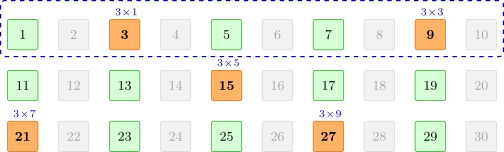
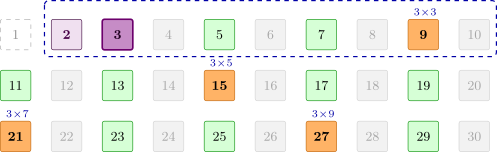

author: Peanut-Tang, Early0v0, Vxlimo, GHLinZhengyu, 1196131597, c-forrest

本文介绍素数计数问题的亚线性算法．素数计数问题即计算不超过 $n$ 的素数个数 $\pi(n)$．对于 $n\sim 10^8$，可以通过 [筛法](./sieve.md) 在 $\tilde O(n)$ 时间内计算．然而，当 $n \sim 10^{10}$ 乃至更大时，筛法等基于枚举思想的算法将难以适用．针对这一情形，本文介绍了一系列较易实现的算法，其时间复杂度大多介于 $\tilde O(n^{2/3})$ 和 $\tilde O(n^{3/4})$ 之间．

素数计数问题是素数幂前缀和问题的一个特例．本文介绍的 Lucy 算法可以直接推广到素数幂前缀和，而这一推广构成了 [Min\_25 筛](./min-25.md) 等积性函数求和算法的一部分．

???+ tip "Tip"
    本文提供了许多素数计数算法．为保证可读性，都没有进行太多常数优化．这些算法在时间空间表现和实现难度上各有差异，读者可以根据自身需求选取合适算法．对于 $10^{11}\sim 10^{13}$ 范围数据，[Lehmer 截断法则](#lehmer-截断法则) 一节算法效率往往已经足够且实现较简单，[优化后的 Lucy 算法](#进一步优化) 实现略复杂但是有着极优秀的时空表现．对于更小数据范围，[原始 Lucy 算法](#lucy-算法) 实现最简单，且在积性函数求和中有着更广阔的用途．

## 基本概念与记号

本文将使用如下记号：

-   $\mathbf P$ 是（正）素数的集合，且 $p_a$ 是第 $a$ 小的素数（下标自 $1$ 开始）．为叙述方便，另设 $p_0=1$．本文中，字母 $p$ 和 $q$ 总是表示素数．
-   $\operatorname{lpf}(n)$ 表示 $n$ 的最小素因子．另设 $\operatorname{lpf}(1)=+\infty$．
-   $D(x) = \{\lfloor x/i\rfloor : i = 1,2,\dots,\lfloor x\rfloor\}$．它的性质详见 [数论分块的性质](./sqrt-decomposition.md#性质) 一节．
-   $\pi(x)$ 是不超过 $x$ 的素数个数．
-   $\varphi(x,a)=\#\{n \in\mathbf N_+ : n \le x,~ (p\mid n \implies p > p_a)\}$ 是所有不超过 $x$ 的正整数中，所有素因数都大于 $p_a$ 的数的个数．
-   $P_k(x,a)=\#\{n\in\mathbf N_+ : n \le x,~ n = q_1q_2\cdots q_k,~ \forall i(q_i > p_a)\}$ 是所有不超过 $x$ 的正整数中，素因数个数（计重数）恰好等于 $k$，且所有素因数都大于 $p_a$ 的数的个数．
-   $S(x,a)$ 是 Eratosthenes 筛法中，利用前 $a$ 个素数筛完后，剩下的大于 $1$ 且不超过 $x$ 的整数个数．

这些函数有着如下简单的性质：

-   $\varphi(x,0) = \lfloor x\rfloor$．
-   $S(x,a) = \varphi(x,a) + \min\{\pi(x),a\} - 1$．
-   $\varphi(x,a) = \sum_{k=0}^{\infty} P_k(x,a)$．
-   $P_0(x,a) = 1$．
-   $P_1(x,a) = \pi(x) - a$．
-   对于 $x < p_{a+1}^k$，有 $P_k(x,a) = 0$．

这些性质都很容易从它们的定义得出．

## Meissel–Lehmer 算法

将 $P_0$ 和 $P_1$ 的表达式代入 $\varphi$ 的展开式，简单整理就得到

$$
\pi(x) = \varphi(x,a) + a - 1 - P_2(x,a) - P_3(x,a) - \cdots.
$$

这意味着 $\pi(x)$ 可以通过计算 $\varphi(x,a)$ 的取值而得到，且误差由一系列 $P_k$ 项给出．随着 $a$ 取值的上升，误差项的数目也逐渐减少．特别地，对于 $a = \pi(\sqrt{x})$，有 $P_2(x,a)=P_3(x,a)=\cdots=0$，亦即

$$
\pi(x) = \varphi(x,\pi(\sqrt{x})) + \pi(\sqrt{x}) - 1.
$$

对于 $\pi(x^{1/3}) \le a < \pi(\sqrt{x})$，项 $P_2(x,a)$ 不为零，但后续项仍然是零，即

$$
\pi(x) = \varphi(x,a) + a - 1 - P_2(x,a).
$$

类似地，对于 $\pi(x^{1/4}) \le a < \pi(x^{1/3})$，项 $P_2(x,a)$ 和 $P_3(x,a)$ 均不为零，如此类推．总之，利用这些关系式，可以将 $\pi(x)$ 的计算转化为 $\varphi(x,a)$ 的计算和 $P_k(x,a)$ 项的计算．所有依赖于这些转化关系的算法，都可以称为 Meissel–Lehmer 算法．

对于 $\varphi(x,a)$，有如下递推关系：

$$
\varphi(x,a) = \varphi(x,a - 1) - \varphi\left(\dfrac{x}{p_a},a-1\right).
$$

自然地，边界条件由 $\varphi(x,0) = \lfloor x\rfloor$ 给出．

???+ example "示例"
    以 $x=30,a=2$ 为例（$p_a=3$），递推的一步如下图所示：
    
    
    
    图中绿色格子表示所有素因数都大于 $p_a=3$ 的整数（$1$ 没有素因数，也计入其中），绿色与橙色合起来则表示所有素因数都大于 $2$ 的整数．前者的个数是 $\varphi(x,a)=\varphi(30,2)=10$，后者的个数是 $\varphi(x,a-1)=\varphi(30,1)=15$．
    
    两者之差恰是橙色部分：能被 $3$ 整除，且不含有比 $3$ 小的素因子．于是橙色的数都具有 $n=3k$ 的形式．由于 $k$ 的每个素因数也是 $n$ 的素因数，$k$ 同样不含比 $3$ 小的素因子，即 $k$ 自身也落在绿色或橙色之中；再由 $3k\le 30$ 得 $k\le\lfloor x/p_a\rfloor=10$．反过来也一样：$n=3k$ 的素因数无非是 $3$ 与 $k$ 的素因数，所以只要 $k\le 10$ 且不含比 $3$ 小的素因子，$n$ 就落在橙色部分．二者因此一一对应．
    
    表格特意排成 $30/3=10$ 列，所以第一行恰好就是 $1,\dots,10$．这样的 $k$ 正是虚线框内的绿色和橙色格子，共 $\varphi(x/p_a,a-1)=\varphi(30/3,1)=5$ 个；每个橙色格子右上角的 $3\times k$ 标出了它所对应的 $k$．因此
    
    $$
    \varphi(x,a) = \varphi(x,a-1) - \varphi\left(\left\lfloor\dfrac{x}{p_a}\right\rfloor,a-1\right).
    $$
    
    此即，$\varphi(30,2)=\varphi(30,1)-\varphi(30/3,1)=15-5=10$．

利用该关系进行递归计算，所得到的递归树是一棵二叉树．完全展开，就得到

$$
\varphi(x,a) = \sum_{n\mid p_1p_2\cdots p_a} \mu(n)\left\lfloor\dfrac{x}{n}\right\rfloor.
$$

由此，这棵二叉树的叶子结点数目就等于所有不超过 $x$ 的无平方因子的 $p_a$‑光滑数（即不含有超过 $p_a$ 素因子的整数）的数目，这一数目是 $\Theta(x)$ 的[^smooth]．这意味着，直接递归计算，复杂度仍然是 $\Omega(x)$ 的．为了快速计算，需要对这棵二叉树适当地进行剪枝．不同 Meissel–Lehmer 算法的主要区别，就在于剪枝方法．文献中将它们称为 **截断法则**（truncation rule）．随后，本节将重点介绍几种简单的截断法则．

最后是处理 $P_k(x,a)$．以 $P_2(x,a)$ 为例，有

$$
\begin{aligned}
P_2(x,a) &= \sum_{i,j:~p_a < p_i\le p_j\le x/p_i} 1 = \sum_{i = a+1}^{\pi(\sqrt{x})}\sum_{j=i}^{\pi(x/p_i)} 1 \\
&= \sum_{i = a+1}^{\pi(\sqrt{x})}\left(\pi\left(\dfrac{x}{p_i}\right) - i + 1\right)\\
&= \sum_{i = a+1}^{\pi(\sqrt{x})}\pi\left(\dfrac{x}{p_i}\right)-\dfrac{1}{2}\left(\pi(\sqrt{x})+a-1\right)\left(\pi(\sqrt{x}) - a\right).
\end{aligned}
$$

这意味着 $P_2(x,a)$ 的计算可以转化为若干个 $\pi(x/p)$ 的计算．对于 $k>2$，仍然存在类似的求和式，但是求和的层数会变多，所以逐渐不再实用．常见算法大多会取 $a\ge\pi(x^{1/3})$，以避免计算更多的 $P_k$ 项．实际计算时，通常会考虑利用筛法预处理这一部分的 $\pi(x/p)$ 的值．

数学家很早就思考了不依赖枚举直接计算 $\pi(x)$ 的问题．Legendre 给出 $a=\pi(\sqrt{x})$ 时的上述表达式，但将 $\varphi(x,a)$ 完全展开得到的项数过多，无法实际用于计算．在 1870 年，Meissel 提出，可以在 $a=\pi(x^{1/3})$ 处计算，减少 $\varphi(x,a)$ 展开的项数，且误差仍然容易计算．在 1959 年，Lehmer 进一步改进和简化了该过程．在 1985 年，Lagarias、Miller 和 Odlyzko 提出的截断规则，首次将该思路改进到了亚线性复杂度，得到了 $\tilde O(x^{2/3})$ 的时间复杂度和 $\tilde O(x^{1/3})$ 的空间复杂度．之后，Deléglise and Rivat (1996)，Gourdon (2001) 和 Staple (2015) 等沿着该方向做出更多的优化，进一步减少了复杂度中 $\log x$ 的次数．需要说明的是，这些算法为了保持良好的空间复杂度，以处理类似 $x\sim 10^{26}$ 规模的问题，通常较为繁复．本节将大幅简化其中细节，只介绍一些简单的优化思路．这样会牺牲一定的时空复杂度，但代码较容易实现．对于原文处理感兴趣的读者，可以参考文末的文献自行学习．

另外，除了枚举方法和本文介绍的组合方法外，计算 $\pi(x)$ 还可以利用解析方法，做到 $\tilde O(\sqrt{x})$ 的时间复杂度．但它们无法应用于算法竞赛，本文不做介绍．

### Lehmer 截断法则

Lehmer (1959) 提出了一种截断法则．对于如下两种情形，不再展开 $\varphi(u,b)$：

1.  当 $u < p_b$ 时；
2.  当 $b = c$ 时，其中，$c$ 是提前选取的小正整数．

对于第一种情形，依前文讨论，必然有 $\varphi(u,b)=1$，无需计算．对于第二种情形，则需要额外计算出 $\varphi(u,c)$ 的值．根据定义，有

$$
\varphi(u,c) = \sum_{n=1}^{u} \prod_{b=1}^{c} [p_b \nmid n].
$$

由于对 $p_b$ 的整除关系具有 $p_b$ 的周期，求和项 $\prod_{b=1}^{c} [p_b \nmid n]$ 就具有周期 $p_c\# = \prod_{b=1}^{c}p_b$．利用周期性，就有

$$
\varphi(u,c) = \left\lfloor\dfrac{u}{p_c\#}\right\rfloor \varphi(p_c\#, c) + \varphi(u \bmod p_c\#, c).
$$

因此，只要对 $n=0,1,2,\dots,p_c\#$ 利用递推关系预处理出所有 $\varphi(n,c)$ 的取值，就能迅速查询第二种情形中 $\varphi(u,c)$ 的取值．

需要说明的是，尽管这两条截断法则确实提高了计算效率，但是算法的渐近复杂度没有显著改善．Lagarias, Miller, and Odlyzko (1985) 证明，Lehmer 算法中，递归树叶子结点数目是 $\Omega\left(\dfrac{x}{\log^4 x}\right)$ 的，因此时间复杂度仍然是 $\tilde\Theta(x)$ 的．

当然，Lehmer 提出的第一条截断法则可以适当改良：

$$
\varphi(u,b) = \begin{cases}
1,  & u \le p_b,\\
\pi(u) - b + 1, & p_b < u \le p_b^2,\\
\pi(u) -\dfrac{1}{2}\left(\pi(\sqrt{u})+b-2\right)\left(\pi(\sqrt{u}) - b+1\right) + \sum\limits_{i = b+1}^{\pi(\sqrt{u})}\pi\left(\dfrac{u}{p_i}\right), & p_b^2 < u \le p_b^3.
\end{cases}
$$

后面两种情形利用了前文导出的关系式．这一改良进一步削减了递归树的规模，但是引入了更多的 $\pi(u/p)$ 项需要计算．由于 $u/p$ 最高可以达到 $x/p_{c+1}$，为了减少无效剪枝，可以设定一个可以触发该法则的 $u$ 的上限 $V$，先预处理出 $[1,V]$ 的 $\pi(u)$ 值；而当 $u > V$ 时，仍然采取正常的递归．

下面给出改良后的 Lehmer 截断法则的实现：

??? example "参考实现"
    ```cpp
    --8<-- "docs/math/code/prime-counting/lehmer.cpp:core"
    ```

尽管该实现的理论复杂度难以证明[^sgtlaugh]，但是优势在于常数很小且实现简单，代码实际运行效率很高．代码中的 $c,V,N$ 等常数的取值可以根据实际需求进行调整．

### LMO 截断法则

Lagarias, Miller, and Odlyzko (1985) 提出了另一种截断法则．选取 $y$ 满足 $x^{1/3} \le y \le x^{2/5}$，取 $a=\pi(y)$．那么，对于如下两种情形，不再展开 $\varphi(x/n,b)$：

1.  当 $b=c$ 且 $n\le y$ 时，其中，$c$ 是提前选取的小自然数；
2.  当 $n > y$ 时．

LMO 将第一种情形称为普通叶子结点，将第二种情形称为特殊叶子结点．

这一截断法则的优势在于，容易对叶子结点数目进行计数．注意到，不同的叶子结点，必然有着不同的 $n$．普通叶子结点总是满足 $n \le y$，所以数目是 $O(y)$ 的．特殊叶子结点总是满足 $n > y$ 且 $\dfrac{n}{\operatorname{lpf}(n)} \le y$．由此，可以将特殊叶子结点分为 $\operatorname{lpf}(n) < \sqrt{y}$ 和 $\operatorname{lpf}(n) \ge \sqrt{y}$ 两类．第一类结点中，必然有 $\operatorname{lpf}(n) < \sqrt{y}$，所以 $\operatorname{lpf}(n)$ 的数目不超过 $\pi(\sqrt{y})$，而 $\dfrac{n}{\operatorname{lpf}(n)} \le y$ 至多也只有 $y$ 种选择，所以 $n$ 可能的数目——亦即这类结点总数——也不超过 $y\pi(\sqrt{y})$．第二类结点中，必然有 $n=pq$ 且 $\sqrt{y} \le p < q \le y$，故而这样的结点数目至多是 $\dfrac{1}{2}\pi(y)^2$．综合两种情形，特殊叶子结点总数为 $O\left(\dfrac{y^2}{\log^2x}\right)$．

对于普通叶子结点，可以利用和前文所述一致的预处理方法．对于特殊叶子结点，要计算 $\varphi(x/n,b)$ 的取值，可以按照定义将其理解为「不超过 $x/n$ 的正整数中，最小素因子严格大于 $p_b$ 的数的个数」．（注意前文已设 $\operatorname{lpf}(1) = +\infty$．）做这样的转化后，可以将所有特殊叶子结点处的查询离线，预处理出 $[1,x/y]$ 中整数 $\operatorname{lpf}$ 的取值并排序，再利用树状数组更新并查询．考虑排序离线查询和树状数组操作，这样做的时间复杂度为

$$
O\left(\dfrac{y^2}{\log^2x}\log \dfrac{y^2}{\log^2x} + \left(\dfrac{x}{y} + \dfrac{y^2}{\log^2x}\right)\log\pi\left(\dfrac{x}{y}\right)\right) = O\left(\dfrac{x}{y}\log x + \dfrac{y^2}{\log x}\right).
$$

除了 $\varphi(x,a)$ 的计算比较特殊外，其余部分的计算与前一节类似．只需要预处理出 $[1,x/y]$ 中的 $\pi(u)$ 值，然后利用前文关系式计算 $P_2(x,a)$ 即可；对于 $c > 0$ 的情形，还需要预处理出 $\varphi(u,c)$ 的取值．注意，为了满足离线查询的需要，递归搜索叶子结点过程中，还需要记录每个叶子结点前面的符号，即 $\mu(n)$ 的取值，用于统计贡献．由此，就得到完整的算法．

这一算法的时空复杂度均是 $\tilde O(x^{2/3})$ 的．如果取 $c = 0$，那么其他部分的复杂度可以忽略不计，这一算法总复杂度就在 $y = x^{1/3}\log^{2/3}x$ 处得到最小值 $O(x^{2/3}\log^{1/3}x)$．此时，该算法的空间复杂度是 $O(x^{2/3}\log^{-2/3}x)$ 的．如果 $c$ 取一个小正整数，那么需要平衡预处理的时空成本和后续查询的常数改良，但整体复杂度不会变化．

下面给出 $c=0$ 时该算法的参考实现：

??? example "参考实现"
    ```cpp
    --8<-- "docs/math/code/prime-counting/lmo_offline.cpp:core"
    ```

这种离线做法的空间复杂度较高，难以处理 $10^{13}$ 规模的问题．瓶颈在于，预处理时需要存储 $[1,x/y]$ 中的 $\operatorname{lpf}$ 信息．实际上该信息仅用于后续离线查询，只需要单次顺序访问，完全可以使用 [分块筛法](./sieve.md#分块筛选) 在查询时计算．

实际上，原论文提供了一种完全基于分块筛法的实现方式．将 $P_2(x,a)$ 和 $\varphi(x,a)$ 的计算都在分块筛法中完成，从而得到了时间复杂度为 $\tilde O(x^{2/3})$ 且空间复杂度为 $\tilde O(x^{1/3})$ 的算法．这需要以某种方式直接枚举所有叶子结点，并将离线算法改造为在线算法．接下来，介绍一种简单的实现方式．

实现的核心是分块筛法：预处理完 $[1,y]$ 内的素数后，将 $[1,x/y]$ 分成长度为 $y$ 的若干块，并对每块分别应用筛法．在处理每一块时，都需要记录该块内元素处 $\pi(u)$ 和 $\varphi(u,b)$ 的取值．由于这些数值都是计数，很容易在分块的过程中维护．然后，需要找到哪些查询落入该块的处理范围．在本节之前描述的算法中，设 $y=\tilde O(x^{1/3})$ 且 $c=0$．此时，素数个数 $\pi(x)$ 有如下表达式：

$$
\begin{aligned}
\pi(x) &= \dfrac{1}{2}\left(\pi(\sqrt{x})+a-2\right)\left(\pi(\sqrt{x}) - a + 1\right) - \sum_{y < p\le\sqrt{x}}\pi\left(\dfrac{x}{p}\right) \\
&\quad +\sum_{n\le y}\mu(n)\varphi\left(\dfrac{x}{n},0\right) + \sum_{n > y,~{n}/{\operatorname{lpf}(n)}\le y,~\operatorname{lpf}(n)\le y}\mu(n)\varphi\left(\dfrac{x}{n},\pi(\operatorname{lpf}(n))-1\right).
\end{aligned}
$$

第一项只需要 $\pi(\sqrt{x})$ 的取值，可以在分块处理到该元素时计算．第二项需要枚举素数 $p$ 使得 $x/p$ 位于当前处理的块内，解出 $p$ 所在的区间后，可以通过分块筛法得到对应素数序列．由于 $p$ 所在的区间不包含大于 $\sqrt{x}$ 的元素，这个内层分块筛法只需要使用 $[1,x^{1/4}]$ 以内的素数．第三项只要枚举 $[1,y]$ 内元素即可．第四项需要枚举 $[1,y]$ 内的素数作为 $\operatorname{lpf}(n)$，进而确定 $\dfrac{n}{\operatorname{lpf}(n)}$ 的取值范围，再枚举其中满足素因子不小于 $\operatorname{lpf}(n)$ 的元素[^lmo-segsieve]，就可以计算得到这一部分叶子结点的值．在计算当前块部分的贡献时，可以使用树状数组维护．这样就在保证了空间复杂度为 $\tilde O(x^{1/3})$ 的前提下，仍然取得了 $\tilde O(x^{2/3})$ 的时间复杂度．当然，它的实现相较于离线算法会繁琐一些．

??? example "参考实现"
    ```cpp
    --8<-- "docs/math/code/prime-counting/lmo_online.cpp:core"
    ```

原论文和后续论文对于特殊叶子结点做了更多分类和讨论，进一步优化了时空复杂度．但是，本节给出的实现足以满足竞赛需求，故不再讨论 Meissel–Lehmer 算法那些更复杂的优化思路．

## Lucy 算法

应用 Meissel–Lehmer 算法，要解决的核心问题之一就在于 $\varphi(x,a)$ 的递归树规模过大．这是因为 $\varphi(x,a)$ 递推关系的终止条件只会出现在 $a=0$ 处．考虑用 $S(x,a)$ 替换 $\varphi(x,a)$．它的好处在于，如果 $p_a^2 > x$，那么 Eratosthenes 筛法中用素数 $p_a$ 去筛时，不会筛掉任何合数（因为它们必然有更小的素因子），即 $S(x,a)=S(x,a-1)$．这就为递归树的提前终止提供了可能．对于 $p_a^2\le x$ 的情形，有 $a\le\pi(x)$，所以有 $S(x,a) = \varphi(x,a)+a-1$．又由 $a-1\le\pi(x/p_a)$，可以将 $\varphi(x,a)$ 递推关系中的所有项都相应替换为 $S(\cdot,\cdot)$，就可以得到 $S(x,a)$ 的递推关系．综合两种情形，$S(x,a)$ 的递推关系可以写作

$$
S(x,a) = S(x,a-1) - [p_a^2 \le x]\left(S\left(\dfrac{x}{p_a},a-1\right)-(a-1)\right).
$$

边界条件为 $S(x,0)=\lfloor x\rfloor -1$．最后，由关系式

$$
\pi(x) = S(x,\pi(\sqrt{x})),
$$

就可以直接得到素数计数函数 $\pi(x)$ 的取值．

???+ example "示例"
    同样是 $x=30,a=2$ 的情形，$S(x,a)$ 的递推关系如下图所示：
    
    
    
    Eratosthenes 筛法的初始区间为 $[2,x] = [2,30]$，故格子 $1$ 画成白色，不参与计数．灰色格子是之前已经筛去的合数，橙色格子是这一轮用素数 $p_a=3$ 筛去的合数；剩下的格子中，浅紫色表示之前的素数，深紫色表示当前的素数 $3$，绿色则表示尚未被筛去的整数（可能是素数，也可能是合数，如 $25$）．于是 $S(x,a-1)=S(30,1)=15$ 是橙、紫、绿三色格子之和，$S(x,a)=S(30,2)=11$ 是紫、绿格子之和，两者的差值正是那 $4$ 个橙色格子．
    
    与 $\varphi(x,a)$ 的情形类似，这些数仍具有 $3k$ 的形式，且由 $3k\le 30$ 知 $k$ 落在虚线框内的 $[2,\lfloor x/p_a\rfloor] = [2,10]$ 中（$k=1$ 不在其中，这正是 $3$ 自身得以留下、没有变成橙色的原因）．区别在于 $k$ 现在只遍历 $3,5,7,9$（已标在各橙色格子的右上角）：$k$ 必须是上一轮筛后的幸存者（否则 $3k$ 早已随 $k$ 一同被筛去），即框内的 $2,3,5,7,9$，共 $S(x/p_a,a-1)=S(10,1)=5$ 个；其中还须去掉比 $p_a$ 小的素数——它们恰是前 $a-1$ 个素数，此处即 $k=2$ 一个——因为 $3\times 2=6$ 早已被 $2$ 筛去．于是
    
    $$
    S(x,a) = S(x,a-1) - \left(S\left(\left\lfloor\dfrac{x}{p_a}\right\rfloor, a-1\right) - (a-1)\right).
    $$
    
    此即 $S(30,2)=S(30,1)-\bigl(S(10,1)-(2-1)\bigr)=15-(5-1)=11$．

这一递推关系很容易通过动态规划进行计算．因为 $S(x,a)=S(\lfloor x\rfloor,a)$，所以递推关系中的除式都可以看作是整除．根据 [数论分块的性质](./sqrt-decomposition.md#性质) 可知，动态规划中第一维的取值必然在集合 $D(x)$ 内，只有 $\Theta(\sqrt{x})$ 种．而且，由于递推关系较为特殊，可以通过一个长度为 $|D(x)|$ 的数组存储 $S(\cdot,a)$ 的取值；对于每个 $a$，从大到小遍历 $D(x)$ 中的元素，利用递推关系更新数组，直到元素严格小于 $p_a^2$．只需要 $\pi(\sqrt{x})$ 更新就可以得到最终结果．

算法的空间复杂度明显是 $O(x^{1/2})$ 的．至于时间复杂度，预处理部分的复杂度是 $O(x^{1/2})$ 的，动态规划部分的复杂度则由

$$
I = \sum_{a=1}^{\pi(\sqrt{x})}|\{u\in D(x) : u \ge p_a^2\}|
$$

给出．它可以分为两部分进行估计．对于 $a\in[1,\pi(x^{1/4})]$，由于求和项不会超过 $|D(x)|$，所以这一部分的和不会超过 $\pi(x^{1/4})|D(x)|$，这是 $O(x^{3/4}\log^{-1}x)$ 的．对于 $a\in(\pi(x^{1/4}),\pi(\sqrt{x})]$，有 $p_a^2 > \sqrt{x}$；由集合 $D(x)$ 结构可知，这些元素数目恰为 $\lfloor x/p_a^2\rfloor$．由此，再结合素数定理 $p_a\sim a\log a$，就得到

$$
\sum_{a=\pi(x^{1/4})+1}^{\pi(\sqrt{x})}\dfrac{x}{p_a^2} \in O\left(\int_{\pi(x^{1/4})}^{+\infty}\dfrac{x}{a^2\log^2a}da\right) = O\left(\dfrac{x^{3/4}}{\log x}\right).
$$

将两部分相加可知，算法整体时间复杂度是 $O(x^{3/4}\log^{-1}x)$ 的．

在具体实现时，可以将预处理不超过 $\sqrt{x}$ 的素数的步骤合并到动态规划过程中．只需要从小到大枚举区间 $[2,\sqrt{x}]$ 内所有整数 $u$，并检查条件 $S(u,\pi(u-1)) \neq S(u-1,\pi(u-1))$ 就可以找到区间内所有素数；条件成立时，需要进行动态转移．原因是，枚举到 $u$ 时，已经转移到 $S(\cdot,\pi(u-1))$，于是 $\pi(u) = S(u,\pi(u-1))$ 且 $\pi(u-1) = S(u-1,\pi(u-1))$，前述条件不成立必然意味着 $u$ 是素数．另外，动态转移方程中 $a-1$ 的取值也可以由 $S(u-1,\pi(u-1))$ 给出，无需额外维护．由此，就得到如下实现：

??? example "参考实现"
    ```cpp
    --8<-- "docs/math/code/prime-counting/lucy.cpp:core"
    ```

这一算法实现简单，虽然时间复杂度略差，但由于常数很小，对于较小数据规模表现优秀．更为重要的是，因为 $\pi(x)=S(x,a)$ 对于所有 $a\ge \pi(\sqrt{x})$ 都成立，所以作为副产品，算法实际上得到了集合 $D(x)$ 内所有元素处 $\pi(\cdot)$ 的取值．这一特性在积性函数求和问题中尤为重要，后续将讨论它的推广及应用．

### 树状数组优化

利用树状数组，很容易将 Lucy 算法的时间复杂度从 $\tilde O(x^{3/4})$ 降低到 $\tilde O(x^{2/3})$．

为此，取实数 $y\in (\sqrt{x},x]$．当前状态 $S(\cdot,a)$ 分成两部分维护：大于 $y$ 的那一部分仍按照前述递推关系递归计算；不大于 $y$ 的那一部分则利用 Eratosthenes 筛法维护，利用树状数组更新和查询当前 $S(\cdot,a)$ 的值．

算法的空间复杂度显然是 $O(y)$ 的．为计算算法的时间复杂度，需要考虑如下三部分：Eratosthenes 筛法部分，每筛到一个合数就需要更新一次树状数组，共计 $O(y)$ 个合数，总时间成本为 $O(y\log y)$ 的；对于 $p_a^2 \le y$，对应轮的状态转移需要进行 $O(x/y)$ 次，每次转移时查询操作是 $O(\log y)$ 的，共计 $O(\pi(\sqrt{y}))$ 次，总时间成本是

$$
O\left(\pi(\sqrt{y})\dfrac{x}{y}\log y\right) = O\left(\dfrac{x}{\sqrt{y}}\right)
$$

的；最后，对于 $p_a^2 > y$，对应轮的状态转移需要进行 $O(x/p_a^2)$ 次，利用上一小节的方法可知，总时间成本为

$$
O\left(\sum_{a=\pi(\sqrt{y})+1}^{\pi(\sqrt{x})}\dfrac{x}{p_a^2}\log y\right) = O\left(\dfrac{x}{\sqrt{y}}\right)
$$

的．将三部分相加，令 $y = x^{2/3}\log^{-2/3}x$，就得到整体时间复杂度 $O(x^{2/3}\log^{1/3}x)$．此时，空间复杂度也是 $\tilde O(x^{2/3})$ 的．

??? example "参考实现"
    ```cpp
    --8<-- "docs/math/code/prime-counting/lucy_fenwick.cpp:core"
    ```

需要说明的是，尽管理论时间复杂度确实降低，但是引入树状数组后带来的常数损失使得算法运行效率在较小数据规模时反而降低，而在较大数据规模时显著恶化的空间占用又限制了算法使用．所以，这一优化的实用性不高．

### 进一步优化

虽然树状数组成功地将 Lucy 算法优化至 $\tilde O(x^{2/3})$，但实际运行效率仍然不高．为了得到高效的算法，可以进一步对 Lucy 算法做出如下优化：（设 $z < w < y < x$，且都是 $x$ 的幂次）

1.  树状数组优化的 Lucy 算法中，Eratosthenes 筛法部分的时间成本是 $O(y\log y)$ 的．实际上，最开始若干轮状态转移中，筛去的合数数量庞大，没有必要使用树状数组维护．因此，可以选取 $z < y$．当 $p_a \le z$ 时，只使用状态转移方程；当 $p_a > z$ 时，再引入树状数组维护 $S(\cdot,a)$ 中不超过 $y$ 的部分．由于引入树状数组时，已经筛去了所有含有不大于 $z$ 的素因子的整数，剩下的数——常称作 $z$‑粗糙数——中不超过 $y$ 的数只有 $O\left(\dfrac{y}{\log z}\right)$ 个[^rough]．由此，就可以将筛法部分时间成本降低到 $O(y)$ 的．最开始这些轮状态转移引入的时间成本是 $O(x^{1/2}z/\log x)$ 的．

2.  前文描述的 Lucy 算法最终得到的都是 $D(x)$ 中所有元素处 $\pi(\cdot)$ 的值．如果只想得到 $\pi(x)$ 的值，很多状态转移是没有必要的．例如，如果要计算 $S(x,a)$ 的取值，只需要知道 $S(x,a-1)$ 和 $S\left(\dfrac{x}{p_a},a-1\right)$ 的取值；而要计算这两项的取值，又只需要知道

    $$
    S(x,a-2),~ S\left(\dfrac{x}{p_a},a-2\right),~ S\left(\dfrac{x}{p_{a-1}},a-2\right),~ S\left(\dfrac{x}{p_ap_{a-1}},a-2\right)
    $$

    的取值．由此归纳可知，在进行到第 $i$ 轮状态转移时，需要知道取值的状态 $S\left(\dfrac{x}{n},i\right)$ 中的 $n$ 必然是 $p_i$‑粗糙数．由于 $p_i$‑粗糙数对于乘法是封闭的，所以只需要在每次状态转移时，都能处理到所有 $p_i$‑粗糙数（作为除数的结点），就能保证状态转移终止时，所有 $p_i$‑粗糙数处结点值都是正确的．

    当然，$p_i$‑粗糙数的集合可以在筛法过程中动态维护[^lucy-rough]；又或者，可以复用前文 $z$‑粗糙数的集合，用它代替所有 $p_i$‑粗糙数．看似第二种做法多做了一些无用功，但是它们都使得动态转移部分的复杂度减少了一个 $\log x$，只是在常数上存在差异．

3.  和筛法部分类似，状态转移部分同样存在树状数组引入额外 $\log x$ 的问题．为了减少树状数组查询，可以将树状数组中不再更新的部分存储到静态数组中．具体地，当动态转移进行到第 $i$ 轮时，不会改变 $u < p_i^2$ 处 $S(u,i)$ 的取值，就可以将它们查询出来并存储．

    下面计算这样做带来的复杂度改进．为了引入其他优化的影响，此处设带树状数组筛法的状态转移只用于处理 $z < p_i \le w$ 的部分，并假定 $y \ge w^2$，以保证下文计数是紧的．由于需要进行状态转移的 $u$ 必然具有 $\lfloor x/j\rfloor$ 的形式，只要对相应的 $j$ 计数就可以了．为方便计算，忽略不等式边界处的讨论．由于 $u > y$，必然有 $j < x / y$．如果 $jp_i < x / y$，那么不会涉及树状数组；如果 $x / y < jp_i < \min\{x/p_i^2,p_ix/y\}$，只能在树状数组上查询；如果 $\min\{x/p_i^3,x/y\} < j < x/y$，可以在静态数组或树状数组中查询．第一部分的总计数为

    $$
    \sum_{z < p_i < w}\dfrac{x}{yp_i} = \dfrac{x}{y}\log\dfrac{\log w}{\log z} \in O\left(\dfrac{x}{y}\right).
    $$

    第二部分的总计数为

    $$
    \sum_{z < p_i < y^{1/3}}\dfrac{x}{y}\left(1-\dfrac{1}{p_i}\right) + \sum_{y^{1/3} < p_i < w}\left(\dfrac{x}{p_i^3} - \dfrac{x}{yp_i}\right) \le \dfrac{x}{y}\pi(y^{1/3}) + \dfrac{x}{y^{2/3}\log y} \in O\left(\dfrac{x}{y^{2/3}\log y}\right).
    $$

    第三部分的总计数为

    $$
    \sum_{y^{1/3} < p_i < w}\left(\dfrac{x}{y}-\dfrac{x}{p_i^3}\right) \le \pi(w)\dfrac{x}{y} \in O\left(\dfrac{xw}{y\log w}\right).
    $$

    第一部分计数远小于另外两部分，可以忽略不计．当 $w^2 \le y \ll w^3$ 时，第三部分总计数远大于第二部分．只有此时，利用静态数组存储这一部分值才会将状态转移部分的总时间复杂度减小一个 $\log x$；否则，第二部分的查询操作会成为瓶颈．综上，引入该优化后，动态转移部分的总时间复杂度为

    $$
    O\left(\max\left\{\dfrac{x}{y^{2/3}},\dfrac{xw}{y\log x}\right\}\right).
    $$

    注意到，因为粗糙数的分布大致是均匀的，第二条优化（即状态转移部分的粗糙数优化）的效果和这一条是独立的．如果同时应用粗糙数优化，此处得到的复杂度可以再少一个 $\log x$．

4.  状态转移可以提前终止，只更新到 $p_a\le w$ 的部分，对于剩余的部分利用 Meissel–Lehmer 算法的思想解决．与依赖于 $\varphi(x,a)$ 的 Meissel–Lehmer 算法不同，$S(x,a)$ 中保存着直到 $x \le p_a^2$ 为止所需要的 $\pi(x)$ 的取值，无需额外预处理．但是和前文优化方法结合使用时，需要注意动态规划部分粗糙数优化（即优化 2）的影响，不要用到未正确更新的值．这样做对于算法的时空复杂度都有改进，但具体改进幅度高度依赖于其余部分实现，在此不做一般分析．下文会对参考实现中的这一部分做具体分析．

将这四种小优化结合到一起．任选 $w \le x^{1/3}$，对于 $z < w$ 和 $w^2 \le y < w^3$，筛法部分和状态转移部分的总时间复杂度为

$$
O\left(y + \dfrac{z\sqrt{x}}{\log x} + \dfrac{xw}{y\log x}\right).
$$

于是，在 $y=x^{5/8}\log^{-1}x$ 且 $z=w^{1/2}$ 时，总时间复杂度达到 $O\left(\dfrac{\sqrt{xw}}{\log x}\right)$．其中，$z$ 在不增加总体复杂度的前提下，尽可能取得大，是为了减少 $z$‑粗糙数的密度，降低算法常数．

如果算法提前终止在 $w=x^{1/3}$ 处，算法时空复杂度就都至少[^complex-third]是 $O(x^{2/3}\log^{-1}x)$ 的．下面说明，如果将算法在 $w=x^{1/4}$ 处终止，将得到更低的时空复杂度．

设 $w=x^{1/4}$．由于提前终止在 $a=\pi(x^{1/4})$ 处，要得到 $\pi(x)$，需要利用关系：

$$
\pi(x) = S(x,a) - P_2(x,a) - P_3(x,a).
$$

由前文分析可知

$$
P_2(x,a) = \sum_{i=a+1}^{\pi(\sqrt{x})}\pi\left(\dfrac{x}{p_i}\right) - \dfrac{1}{2}(\pi(\sqrt{x})+a-1)(\pi(\sqrt{x})-a).
$$

由于已经筛到了 $p_a$，所以 $\pi(\sqrt{x})$ 可以从 $S(\cdot,a)$ 中获得．但是，因为 $x/p_i\in[\sqrt{x},x^{3/4})$，求和式中的 $\pi(\cdot)$ 仍然和 $S(\cdot,a)$ 不一致．于是，进一步展开，有

$$
\sum_{i=a+1}^{\pi(\sqrt{x})}\pi\left(\dfrac{x}{p_i}\right) = \sum_{i=a+1}^{\pi(\sqrt{x})}S\left(\dfrac{x}{p_i},a\right) - \sum_{i=a+1}^{\pi(\sqrt{x})}P_2\left(\dfrac{x}{p_i},a\right).
$$

代回前式，就得到

$$
\begin{aligned}
\pi(x) &= S(x,a) + \dfrac{1}{2}(\pi(\sqrt{x})+a-1)(\pi(\sqrt{x})-a) \\
&\quad - \sum_{i=a+1}^{\pi(\sqrt{x})}S\left(\dfrac{x}{p_i},a\right) + \underbrace{ \sum_{i=a+1}^{\pi(\sqrt{x})}P_2\left(\dfrac{x}{p_i},a\right) - P_3(x,a) }_{\Delta(x)}.
\end{aligned}
$$

为了计算 $\Delta(x)$，考虑其组合意义．由 $P_2(x,a)$ 和 $P_3(x,a)$ 定义可知

$$
\begin{aligned}
\sum_{i=a+1}^{\pi(\sqrt{x})}P_2\left(\dfrac{x}{p_i},a\right) &= \#\{p_ip_jp_k \le x : a < i,~ a < j \le k\},\\
P_3(x,a) &= \#\{p_ip_jp_k \le x : a < i \le j \le k\}.
\end{aligned}
$$

将两集合作差，就得到

$$
\Delta(x) = \#\{p_ip_jp_k \le x : a < j,~ j < i,~ j \le k\}.
$$

为了计数，仍然考虑枚举最小素因子 $p_j$（因为它的枚举上限最小）；对于固定的 $j$，其余下标必须满足 $i > j$ 且 $k \ge j$；于是，拆分 $k=j$ 的特殊情形，剩下情形就有 $i,k > j$，利用对称性可以进一步简化，就有如下表达式：

$$
\Delta(x) = \underbrace{\sum_{j=a+1}^{\pi(x^{1/3})}\left(\pi\left(\dfrac{x}{p_j^2}\right) - j\right)}_{i > j = k} + \underbrace{2\sum_{j=a+1}^{\pi(x^{1/3})}\left(\sum_{i=j+1}^{\pi(\sqrt{x/p_j})}\left(\pi\left(\dfrac{x}{p_ip_j}\right) - i\right) \right)}_{i > k > j \text{ or }k > i > j } + \underbrace{\sum_{j=a+1}^{\pi(x^{1/3})}\left(\pi\left(\sqrt{\dfrac{x}{p_j}}\right) - j\right)}_{i=k > j}.
$$

整理一下求和式，就得到

$$
\Delta(x) = \sum_{j=a+1}^{\pi(x^{1/3})}\left(\pi\left(\dfrac{x}{p_j^2}\right) - j + 2 \sum_{i=j+1}^{\pi(\sqrt{x/p_j})}\pi\left(\dfrac{x}{p_ip_j}\right) - \left( \pi\left(\sqrt{\dfrac{x}{p_j}}\right) ^ 2 - j^2 \right) \right).
$$

利用这一表达式，计算 $\Delta(x)$ 的复杂度为（估算方法参考前文 Lucy 算法复杂度部分）

$$
O\left(\sum_{x^{1/4} < p \le x^{1/3}}\pi\left(\sqrt{\dfrac{x}{p}}\right)\right) = O\left(\dfrac{x^{2/3}}{\log^2 x}\right).
$$

这也正是最后一部分计算的复杂度．简单检查可以发现，计算 $\Delta(x)$ 时涉及到的所有 $\pi(x/n)$ 项都具有 $x/n\le\sqrt{x} < y$，所以它们都可以从树状数组存储的 $S(\cdot,a)$ 中直接获得（需提前存到静态数组中，以避免引入额外的 $O(\log x)$ 查询）．

再结合前文分析可知，当 $z=x^{1/8},~w=x^{1/4},~y=x^{5/8}\log^{-1}x$ 时，筛法和动态规划部分的总时间复杂度是 $O(x^{5/8}\log^{-1}x)$，所以算法整体时间复杂度是 $O(x^{2/3}\log^{-2}x)$．空间复杂度就是树状数组的长度 $O(y)=O(x^{5/8}\log^{-1}x)$．

??? example "参考实现"
    ```cpp
    --8<-- "docs/math/code/prime-counting/lucy_opt.cpp:core"
    ```

在算法竞赛常见数据范围（$10^{10}\sim 10^{14}$）内，这一实现的时空成本都相当优秀．需要说明的是，尽管理论复杂度分析中，最后一部分是时复杂度瓶颈，但是由于其复杂度中对数因子更小、常数更优，在上述数据范围内，算法表现的实际瓶颈仍然是筛法和动态规划部分．这也正是对它们复杂度优化必不可少的原因．

## 推广：素数幂前缀和

更一般地，考虑如下问题：

$$
F_{\text{prime}}(x) = \sum_{p\in\mathbf P,~p\le x}f(p).
$$

也就是说，计算数论函数 $f(\cdot)$ 在不超过 $x$ 的素数处取值的和．素数计数函数 $\pi(x)$ 是 $f\equiv 1$ 时的特例．

假定数论函数 $f$ 满足如下条件：

1.  $f$ 是完全积性函数，即 $f(mn)=f(m)f(n)$ 对于所有正整数 $m,n$ 都成立；
2.  前缀和 $F(x)=\sum_{n \le x}f(n)$ 容易计算．

满足这些条件的常见数论函数包括幂函数和 [Dirichlet 特征](https://en.wikipedia.org/wiki/Dirichlet_character)（例如 [Legendre 符号](./quad-residue.md#legendre-符号)）．当然，如果某个函数可以表示为若干满足这些条件的函数线性组合，它在素数处的前缀和也可以求得．所以，本节的方法可以处理 $f$ 是多项式或者 $f$ 是周期函数[^periodic]的情形．另一种更为简洁的处理周期函数的方法详见后文例题．

在这些条件下，可以推广前文的递推关系．定义 $S(x,a)$ 为筛去前 $a$ 个素数后，区间 $[2,x]$ 内剩下整数处 $f(\cdot)$ 取值之和，即

$$
S(x,a) = \sum_{1 < n \le x,~ (n\in\mathbf P) \lor (\operatorname{lpf}(n) > p_a)} f(n).
$$

此时，可以将前文关于 $S(x,a)$ 的递推关系改写如下：

$$
S(x,a) = S(x,a-1) - [p_a^2 \le x]f(p_a)\left(S\left(\dfrac{x}{p_a},a-1\right)-S(p_{a}-1,a-1)\right).
$$

边界条件为 $S(x,0) = F(x) - 1$．该公式表达的内容和前文类似：Eratosthenes 筛法中，利用 $p_a$ 筛去的合数一定是 $p_a$ 和某个尚未被前 $a-1$ 个素数筛去的整数的乘积．但是，全体尚未被前 $a-1$ 个素数筛去的整数中，还包括前 $a-1$ 个素数，它们需要额外剔除．所以，为了得到这些合数处函数值的和，利用 **完全积性**，可以提取系数 $f(p_a)$，而剩下的和就是 $S(x/p_a,a-1)$ 减去前 $(a-1)$ 个素数的贡献 $S(p_a-1,a-1)$．注意，减去的这一项也可以写作 $S(p_{a-1},a-1)$，它们是相等的．

利用这一递推关系，可以通过 Lucy 算法在 $O(x^{3/4}\log^{-1}x)$ 时间内计算 $F_{\text{prime}}(x)$ 的取值，空间复杂度仅为 $O(x^{1/2})$．利用树状数组可以将时间复杂度降低为 $\tilde O(x^{2/3})$，但并不十分实用．

??? example "模板题 [Luogu P5493 质数前缀统计](https://www.luogu.com.cn/problem/P5493) 参考实现"
    ```cpp
    --8<-- "docs/math/code/prime-counting/prime_power_sum.cpp"
    ```

原则上，对于推广后的 Lucy 算法建议预处理素数，而不是合并到动态规划中．这是因为判据 $S(u,\pi(u-1))\neq S(u-1,\pi(u-1))$ 对于一般的 $f$ 未必成立．另外，尽管本节仅讨论了 Lucy 算法的推广，其他算法也可以做类似推广；但是 Lucy 算法可以处理出 $D(x)$ 内所有值处的 $F_\text{prime}$ 值，对于后续积性函数求和更为有用，所以本节只介绍了它的推广．

## 例题

???+ example "[Codeforces 665 F. Four Divisors](https://codeforces.com/problemset/problem/665/F)"
    给定 $n$，求 $[1,n]$ 中恰有 $4$ 个因数的整数个数．

??? note "解答"
    恰有 $4$ 个因数的整数必然具有形式 $p^3$ 或 $pq$，其中，$p,q$ 都是素数且 $p < q$．区间 $[1,n]$ 中，具有形式 $p^3$ 的整数总计 $\pi(n^{1/3})$ 个；具有 $pq$ 形式的整数共计
    
    $$
    \sum_{p < \sqrt{n}}\left(\pi\left(\dfrac{n}{p}\right)-\pi(p)\right)
    $$
    
    个．由于上述表达式中所涉及的素数计数函数均可通过集合 $D(n)$ 中的值计算，只需要执行一次 Lucy 算法，就可以完成求解．时间复杂度是 $O(n^{3/4}\log^{-1}n)$ 的，空间复杂度是 $O(n^{1/2})$ 的．

??? note "参考实现"
    ```cpp
    --8<-- "docs/math/code/prime-counting/prime_count_1.cpp"
    ```

???+ example "[LOJ 6028.「from CommonAnts」质数计数 II](https://loj.ac/p/6028)"
    给定 $n,m$，求 $[1,n]$ 中模 $m$ 等于 $0,1,2,\dots,m-1$ 的素数分别有多少个．

??? note "解答"
    对于任意余数 $r=0,1,2,\dots,m-1$，函数 $[n\bmod m = r]$ 显然是周期函数．前文说明，这类问题可以借助对 Dirichlet 特征求和进行处理，但过于繁琐且涉及复数计算．因此，本题采用另一种方法解决．
    
    考虑在 Lucy 算法的状态转移方程中增加一维．令 $S(n,r,a)$ 表示 $[2,n]$ 的整数中，利用前 $a$ 个素数筛完后，剩下的模 $m$ 余 $r$ 的整数个数．和正文类似，可以得到递推关系如下：
    
    $$
    S(n,rp_a\bmod m,a) = S(n,rp_a\bmod m,a-1) - [p_a^2 \le n]\left(S\left(\dfrac{n}{p_a},r,a-1\right)-S(p_{a}-1,r,a-1)\right).
    $$
    
    递推公式中，函数第二个参数采用了乘法而非除法，是考虑到存在 $p_a\mid m$ 的可能．边界条件为 $S(n,r,0) = \left\lfloor\dfrac{n-r}{m}\right\rfloor + [r> 1]$．据此，通过动态规划即可解决．时间复杂度是 $O(mn^{3/4}\log^{-1}n)$ 的，空间复杂度是 $O(mn^{1/2})$ 的．

??? note "参考实现"
    ```cpp
    --8<-- "docs/math/code/prime-counting/prime_count_2.cpp"
    ```

## 习题

-   [Counting Primes - Library Checker](https://judge.yosupo.jp/problem/counting_primes)
-   [P7884【模板】Meissel-Lehmer](https://www.luogu.com.cn/problem/P7884)
-   [SPOJ NTHPRIME - Nth Prime](https://www.spoj.com/problems/NTHPRIME/)
-   [SPOJ SUMPRIM1 - Sum of primes](https://www.spoj.com/problems/SUMPRIM1/)
-   [SPOJ BBAD - Breaking Math](https://www.spoj.com/problems/BBAD/)
-   [SPOJ APS2 - Amazing Prime Sequence (hard)](https://www.spoj.com/problems/APS2/)
-   [SPOJ DIVFACT4 - Divisors of factorial (extreme)](https://www.spoj.com/problems/DIVFACT4/)

## 参考文献与注释

-   [Meissel–Lehmer algorithm - Wikipedia](https://en.wikipedia.org/wiki/Meissel%E2%80%93Lehmer_algorithm)
-   [Lucy's Algorithm + Fenwick Trees - griff's math blog!](https://gbroxey.github.io/blog/2023/04/09/lucy-fenwick.html)
-   [Counting primes in $\tilde O(n^{2/3})$ by Maksim1744 - Codeforces](https://codeforces.com/blog/entry/91632)
-   [题解 P7884【模板】Meissel–Lehmer 算法 by 渐变色 - 洛谷](https://www.luogu.com.cn/article/q4d4jl20)
-   Lehmer, Derrick H. "On the exact number of primes less than a given limit." Illinois Journal of Mathematics 3, no. 3 (1959): 381-388.
-   Lagarias, Jeffrey C., Victor S. Miller, and Andrew M. Odlyzko. "Computing $\pi(x)$: the Meissel-Lehmer method." Mathematics of Computation 44.170 (1985): 537-560.
-   [Deléglise, Marc, and Joël Rivat. "Computing 𝜋 (𝑥): the Meissel, Lehmer, Lagarias, Miller, Odlyzko method." Mathematics of Computation 65.213 (1996): 235-245.](https://dl.acm.org/doi/abs/10.1090/s0025-5718-96-00674-6)
-   [Staple, Douglas B. "The combinatorial algorithm for computing $\pi(x)$." arXiv preprint arXiv:1503.01839 (2015).](https://arxiv.org/pdf/1503.01839)

[^lucy-rough]: 动态维护的实现可以参考 [griff 博文的优化技巧一节](https://gbroxey.github.io/blog/2023/04/09/lucy-fenwick.html#trick-for-further-optimization)．

[^periodic]: 所有周期为 $m$，且仅在与 $m$ 互素的整数处取非零值的数论函数，都可以表示为若干个模 $m$ 的 Dirichlet 特征的线性组合．由于计算素数处的前缀和时，只涉及有限个与 $m$ 不互素的整数，因此总可以对原周期函数进行适当调整，使其在这些整数处取零，从而将其表示为模 $m$ 的 Dirichlet 特征的线性组合．

[^rough]: 参见 [Buchstab function - Wikipedia](https://en.wikipedia.org/wiki/Buchstab_function#Applications)．

[^complex-third]: 经过简单分析可知，算法时空复杂度其实恰好是 $O(x^{2/3}\log^{-1}x)$．

[^sgtlaugh]: 尽管原作者在代码中标注复杂度大致为 $O(x^{2/3})$，但经过实际测量，对于恒定的 $V$，复杂度大致为 $\Theta(x)$．即使根据问题规模适当调整 $V$ 的大小，复杂度也至少有 $\Omega(x^{0.8})$．

[^smooth]: 参见 [Smooth number - Wikipedia](https://en.wikipedia.org/wiki/Smooth_number#Distribution)．

[^lmo-segsieve]: 这一步枚举的 $n$ 的总数实际上多于特殊叶子结点数目，但是对总复杂度没有影响．具体证明参见原论文．
