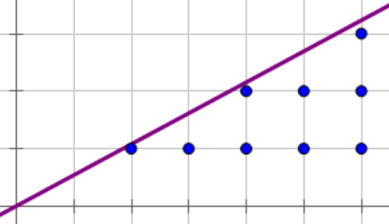

一个数 $a$，如果不是 $p$ 的倍数且模 $p$ 同余于某个数的平方，则称 $a$ 为模 $p$ 的 **二次剩余**。而一个不是 $p$ 的倍数的数 $b$，不同余于任何数的平方，则称 $b$ 为模 $p$ 的 **非二次剩余**。

对二次剩余求解，也就是对常数 $a$ 解下面的这个方程：

$$
x^2 \equiv a \pmod p
$$

通俗一些，可以认为是求模意义下的开方。这里只讨论 $\boldsymbol{p}$ **为奇素数** 的求解方法，将会使用 Cipolla 算法。

## 解的数量

对于 $x^2 \equiv n \pmod p$，能满足＂$n$ 是模 $p$ 的二次剩余＂的 $n$ 一共有 $\frac{p-1}{2}$ 个（0 不包括在内），非二次剩余有 $\frac{p-1}{2}$ 个。

### 证明

$x=0$ 对应了 $n=0$ 的特殊情况，因此我们只用考虑 $x \in [1,\frac{p-1}{2}]$ 的情况。

一个显然的性质是 $(p-x)^2 \equiv x^2 \pmod p$，那么当 $x \in [1,\frac{p-1}{2}]$ 我们可以取到所有解。

接下来我们只需要证明当 $x\in[1,\frac{p-1}{2}]$ 时 $x^2 \bmod p$ 两两不同。

运用反证法，假设存在不同的两个整数 $x,y \in [1,\frac{p-1}{2}]$ 且 $x^2 \equiv y^2 \pmod p$，

则有 $(x+y)(x-y) \equiv 0 \pmod p$

显然 $-p<x+y<p,-p<x-y<p,x+y \neq 0,x-y \neq 0$，故假设不成立，原命题成立。

## 勒让德符号

$$
\left(\frac{n}{p}\right)=\begin{cases}
1,\,&p\nmid n \text{且}n\text{是}p\text{的二次剩余}\\
-1,\,&p\nmid n \text{且}n\text{不是}p\text{的二次剩余}\\
0,\,&p\mid n
\end{cases}
$$

通过勒让德符号可以判断一个数 $n$ 是否为二次剩余，具体判断 $n$ 是否为 $p$ 的二次剩余，需要通过欧拉判别准则来实现。

下表为部分勒让德符号的值

## 欧拉判别准则

$$
\left(\frac{n}{p}\right)\equiv n^{\frac{p-1}{2}}\pmod p
$$

若 $n$ 是二次剩余，当且仅当 $n^{\frac{p-1}{2}}\equiv 1\pmod p$。

若 $n$ 是非二次剩余，当且仅当 $n^{\frac{p-1}{2}}\equiv -1\pmod p$。

### 证明

由于 $p$ 为奇素数，那么 $p-1$ 是一个偶数，根据 [费马小定理](./fermat.md)  $n^{p - 1} \equiv 1 \pmod{p}$，那么就有

$$
(n^{\frac{p-1}{2}}-1)\cdot(n^{\frac{p-1}{2}}+1)\equiv 0 \pmod p
$$

其中 $p$ 是一个素数，所以 $n^{\frac{p-1}{2}}-1$ 和 $n^{\frac{p-1}{2}}+1$ 中必有一个是 $p$ 的倍数，

因此 $n^{\frac{p-1}{2}}$ 模 $p$ 的余数必然是 1 或者 - 1。

$p$ 是一个奇素数，所以关于 $p$ 的 [原根](./primitive-root.md) 存在。

设 $a$ 是 $p$ 的一个 [原根](./primitive-root.md)，则存在 $1 \leqslant j \leqslant p-1$ 使得 $n=a^j$。于是就有

$$
a^{j\frac{p-1}{2}}\equiv1\pmod p
$$

$a$ 是 $p$ 的一个 [原根](./primitive-root.md)，因此 $a$ 模 $p$ 的指数是 $p-1$，于是 $p-1$ 整除 $\frac{j(p-1)}{2}$。这说明 $j$ 是一个偶数。

令 $i=\frac{j}{2}$，就有 $(a^i)^2=a^{2i}=n$。$n$ 是模 $p$ 的二次剩余。

## Cipolla 算法

找到一个数 $a$ 满足 $a^2-n$ 是 **非二次剩余**，至于为什么要找满足非二次剩余的数，在下文会给出解释。
这里通过生成随机数再检验的方法来实现，由于非二次剩余的数量为 $\frac{p-1}{2}$，接近 $\frac{p}{2}$，所以期望约 2 次就可以找到这个数。

建立一个＂复数域＂，并不是实际意义上的复数域，而是根据复数域的概念建立的一个类似的域。
在复数中 $i^2=-1$，这里定义 $i^2=a^2-n$，于是就可以将所有的数表达为 $A+Bi$ 的形式，这里的 $A$ 和 $B$ 都是模意义下的数，类似复数中的实部和虚部。

在有了 $i$ 和 $a$ 后可以直接得到答案，$x^2\equiv n\pmod p$ 的解为 $(a+i)^{\frac{p+1}{2}}$。

### 证明

- 定理 1：$(a+b)^p\equiv a^p+b^p\pmod p$

$$
\begin{aligned}
(a+b)^p &\equiv \sum_{i=0}^{p}\mathrm C_p^i a^{p-i}b^i \\
&\equiv \sum_{i=0}^{p}\frac{p!}{(p-i)!i!}a^{p-i}b^i \\
&\equiv a^p+b^p\pmod p
\end{aligned}
$$

可以发现只有当 $i=0$ 和 $i=p$ 时由于没有因子 $p$ 不会因为模 $p$ 被消去，其他的项都因为有 $p$ 因子被消去了。

- 定理 2：$i^p\equiv -i\pmod p$

$$
\begin{aligned}
i^p &\equiv i^{p-1} \cdot i \\
&\equiv (i^2)^{\frac{p-1}{2}}\cdot i \\
&\equiv (a^2-n)^{\frac{p-1}{2}}\cdot i \\
&\equiv -i \pmod p
\end{aligned}
$$

- 定理 3：$a^p\equiv a \pmod p$ 这是 [费马小定理](./fermat.md) 的另一种表达形式

有了这三条定理之后可以开始推导

$$
\begin{aligned}
x &\equiv (a+i)^{\frac{p+1}{2}} \\
&\equiv ((a+i)^{p+1})^{\frac{1}{2}} \\
&\equiv ((a+i)^p\cdot (a+i))^{\frac{1}{2}} \\
&\equiv ((a^p+i^p)\cdot(a+i))^{\frac{1}{2}} \\
&\equiv ((a-i)\cdot(a+i))^{\frac{1}{2}} \\
&\equiv (a^2-i^2)^{\frac{1}{2}} \\
&\equiv (a^2-(a^2-n))^{\frac{1}{2}} \\
&\equiv n^{\frac{1}{2}}\pmod p
\end{aligned}
$$

$\therefore x\equiv (a+i)^{\frac{p+1}{2}} \equiv n^{\frac{1}{2}}\pmod p$

??? note "参考实现"
    ```c++
    #include <bits/stdc++.h>
    using namespace std;
    
    typedef long long ll;
    int t;
    ll n, p;
    ll w;
    
    struct num {  //建立一个复数域
      ll x, y;
    };
    
    num mul(num a, num b, ll p) {  //复数乘法
      num ans = {0, 0};
      ans.x = ((a.x * b.x % p + a.y * b.y % p * w % p) % p + p) % p;
      ans.y = ((a.x * b.y % p + a.y * b.x % p) % p + p) % p;
      return ans;
    }
    
    ll binpow_real(ll a, ll b, ll p) {  //实部快速幂
      ll ans = 1;
      while (b) {
        if (b & 1) ans = ans * a % p;
        a = a * a % p;
        b >>= 1;
      }
      return ans % p;
    }
    
    ll binpow_imag(num a, ll b, ll p) {  //虚部快速幂
      num ans = {1, 0};
      while (b) {
        if (b & 1) ans = mul(ans, a, p);
        a = mul(a, a, p);
        b >>= 1;
      }
      return ans.x % p;
    }
    
    ll cipolla(ll n, ll p) {
      n %= p;
      if (p == 2) return n;
      if (binpow_real(n, (p - 1) / 2, p) == p - 1) return -1;
      ll a;
      while (1) {  //生成随机数再检验找到满足非二次剩余的a
        a = rand() % p;
        w = ((a * a % p - n) % p + p) % p;
        if (binpow_real(w, (p - 1) / 2, p) == p - 1) break;
      }
      num x = {a, 1};
      return binpow_imag(x, (p + 1) / 2, p);
    }
    ```

## Tonelli-Shanks 算法

大致思路如下：

先令 $p-1 = 2^s \times t$, 则 $t$ 为奇数。

针对 $s$ 的值分两种情况 $s = 1$ 和 $s > 1$ 进行讨论。

如果 $s = 1$：

1. 因为 $a$ 是 $p$ 的二次剩余，所以 $a^{\frac{p-1}{2}} \equiv 1 \pmod p$，即 $\sqrt{a^{\frac{p-1}{2}}} \equiv 1 \pmod p$；
2. 由 1 可知，$x \equiv \sqrt{a^{\frac{p-1}{2}} \times a} \pmod p$；
3. 注意到 $s = 1$，可以得出 $x \equiv \sqrt{a^{t} \times a} \pmod p$，进一步得到 $x \equiv a^{\frac{t+1}{2}} \pmod p$。

因此 $s = 1$ 时，$x$ 的值容易求出。

对于 $s > 1$ 的情况，设 $x_{s-1} \equiv a^{\frac{t+1}{2}} \pmod p$。

1. 由欧拉判别准则可知 $a^{\frac{p-1}{2}} \equiv 1 \pmod p$，进一步有 $a^{2^{(s-1)} \times t} \equiv 1 \pmod p$；
2. 稍作变形得到 $\left(a^{-1} \times \left(a^{\frac{t+1}{2}}\right)^{2}\right)^{2^{s-1}} \equiv 1 \pmod p)$，即 $\left(a^{-1} \times x_{s-1}^{2}\right)^{2^{s-1}} \equiv 1 \pmod p$。

所以 $a^{-1} \times x_{s-1}^{2}$ 是模 $p$ 意义下的 1 的 $2^{s-1}$ 次根。

接下来设 $e_k$ 为模 $p$ 意义下的 $2^k$ 次单位根。容易发现 $e_{s-1} = a^{-1} \times x^{2}_{s-1}$。

假设我们已经知道 $e_{s-k}, x_{s-k}$：因为 $e_{s-k}^{2^{s-k}} \equiv 1 \pmod p$，所以有 $\sqrt{(e_{s-k}^{2^{s-k}})} \equiv \pm 1 \pmod p$，即 $e_{s-k}^{2^{s-k-1}} \equiv \pm 1 \pmod p$；

现在的任务变成了计算 $e_{s-k}^{2^{s-k-1}} \pmod p$。这时候又可以分为两种情况：$e_{s-k}^{2^{s-k-1}} \equiv 1 \pmod p$ 和 $e_{s-k}^{2^{s-k-1}} \equiv -1 \pmod p$。

对于第一种情况，容易得到：$e_{s-k-1} \equiv e_{s-k}  \pmod p$，$x_{s-k-1} \equiv x_{s-k}  \pmod p$。

对于第二种情况，则有：$\left(a^{-1} \times x_{s-k}^{2}\right)^{2^{s-k-1}} \equiv -1 \pmod p$。我们此时需要找到一个 $q$，使得 $\left(a^{-1} \times (qx_{s-k})^{2}\right)^{2^{s-k-1}} \equiv 1 \pmod p$。

寻找 $q$ 的思路如下：因为 $\left(a^{-1} \times (qx_{s-k})^{2}\right)^{2^{s-k-1}} \equiv 1 \pmod p$，所以 $q^{2^{s-k}} \equiv -1 \pmod p$。

接下来寻找一个非二次剩余 $b$：

- 因为 $b$ 是非二次剩余，所以 $b^{\frac{p-1}{2}} \equiv -1 \pmod p$，即 $b^{t2^{s-1}} \equiv -1 \pmod p$；
- 稍微变个形得到 $b^{t \times 2^{s-k} \times 2^{k-1}} \equiv -1 \pmod p$，即 $(b^{t \times 2^{k-1}})^{2^{s-k}} \equiv -1 \pmod p$；
- $q \equiv b^{t \times 2^{k-1}} \pmod p$。

最后得到 $x_{s-k-1} \equiv x_{s-k} \times q \pmod p$。

不断迭代即可得到答案。该做法的时间复杂度约为 $O(\log p)$。

??? note "参考实现"
    ```python3
    import random
    # example a, p
    a = 8479994658316772151941616510097127087554541274812435112009425778595495359700244470400642403747058566807127814165396640215844192327900454116257979487432016769329970767046735091249898678088061634796559556704959846424131820416048436501387617211770124292793308079214153179977624440438616958575058361193975686620046439877308339989295604537867493683872778843921771307305602776398786978353866231661453376056771972069776398999013769588936194859344941268223184197231368887060609212875507518936172060702209557124430477137421847130682601666968691651447236917018634902407704797328509461854842432015009878011354022108661461024768
    p = 30531851861994333252675935111487950694414332763909083514133769861350960895076504687261369815735742549428789138300843082086550059082835141454526618160634109969195486322015775943030060449557090064811940139431735209185996454739163555910726493597222646855506445602953689527405362207926990442391705014604777038685880527537489845359101552442292804398472642356609304810680731556542002301547846635101455995732584071355903010856718680732337369128498655255277003643669031694516851390505923416710601212618443109844041514942401969629158975457079026906304328749039997262960301209158175920051890620947063936347307238412281568760161
    
    b = random.randint(1, p)
    while (pow(b, (p-1)//2, p) == 1):
        b = random.randint(1, p)
    
    t = p - 1
    s = 0
    while (t % 2 == 0):
        s += 1
        t = t // 2
    x = pow(a, (t + 1) // 2, p)
    e = pow(a, t, p)
    k = 1
    while (k < s):
        if (pow(e, 1 << (s - k - 1), p) != 1):
            x = x * pow(b, (1 << (k - 1)) * t, p) % p
        e = pow(a, p-2, p) * x % p * x % p
        k += 1
    print(x)
    ```

## 习题

[【模板】二次剩余](https://www.luogu.com.cn/problem/P5491)

[「Timus 1132」Square Root](https://acm.timus.ru/problem.aspx?space=1&num=1132)

## 参考文献

<https://en.wikipedia.org/wiki/Quadratic_residue>

<https://en.wikipedia.org/wiki/Euler%27s_criterion>

<https://blog.csdn.net/doyouseeman/article/details/52033204>

[二次剩余 Tonelli-Shanks 算法](https://yutong.site/?p=1192)
