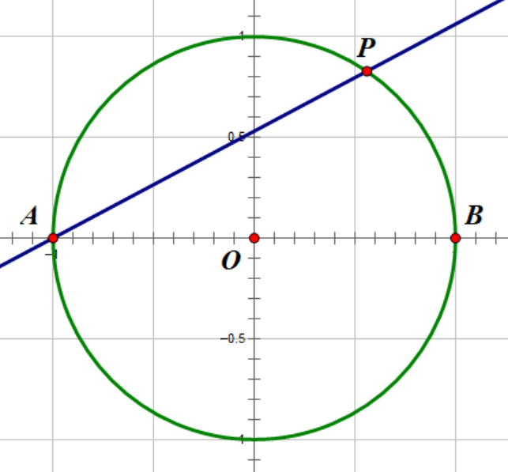

## 二次有理数

二次有理数：整系数一元二次方程的解。

???+note "用词说明"
    在初等数论书上，“二次有理数”写为“二次无理数”。这是因为，**二次有理数不是有理数，而是无理数**。在近世代数书上，写为“二次有理数”或者“二次代数数”，表明它与有理数拥有相似的性质。
    
    同样地，还有“二次整数”。二次整数不是整数。“二次有理数”一词与“二次整数”相对应，与有理数和整数的关系完全一致，有理数是整数的比值。

二次有理数有以下的表示法，一定可以写成：

$$
a+b\sqrt{d}
$$

其中，$a$ 与 $b$ 为有理数，$d$ 为整数。任意这种形式的数都是二次有理数，两者为一一对应。

若 d 为正，集合中所有数均为实数，称为实二次整环或者实二次域。若 d 为负，集合中除了一般的有理数以外全部不是实数，称为虚二次整环或虚二次域。

### 范数

对于同一个整系数二次方程，有两个根。如果它们不是一般的有理数，那么它们在形式上只在二次根号前相差一个正负号。

如果两个二次有理数只在二次根号之前相差正负号，称它们互为 **共轭** 关系。因为一般的有理数在二次根号前面的系数是 0，因此一般的有理数与它自身为共轭关系。

显然，在虚二次域中，某数的共轭的概念，与复数共轭的概念一致。但是在实二次域中这两个概念不一致。

在二次域中，由加减乘除（非 0）四则运算产生的等式，无法区分共轭关系。也就是说，在等式中将每一个数换成它的共轭数，即将每一个二次根号的符号改变，等式仍然成立。

二次有理数与它的共轭的和称为 **迹**。某数的迹就是它的有理数部分的 2 倍，形式简单，因此很少研究迹。

二次有理数与它的共轭的积称为 **范数**：

$$
N(a+b\sqrt{d})=a^2-db^2
$$

显然，在虚二次域中，范数的概念，与复数的模的平方的概念一致。但是在实二次域中这两个概念不一致。由于 d 不含平方因子，不可能是平方数，因此只有 0 的范数是 0。

范数具有保持乘法和除法（非 0）的良好性质。

$$
N(a_1+b_1\sqrt{d})N(a_2+b_2\sqrt{d})=N((a_1+b_1\sqrt{d})(a_2+b_2\sqrt{d}))
$$

$$
\frac{N(a_1+b_1\sqrt{d})}{N(a_2+b_2\sqrt{d})}=N\left(\frac{a_1+b_1\sqrt{d}}{a_2+b_2\sqrt{d}}\right)
$$

一个二次有理数与它的共轭相乘为这个数的范数，因此它的倒数就是它的共轭与范数之比。

$$
a+b\sqrt{d}=\frac{a-b\sqrt{d}}{N(a+b\sqrt{d})}
$$

### 二次整数

首项系数为 1 的整系数二次多项式 $x^2+px+q=0$ 的零点是：

$$
\frac{-p±\sqrt{p^2-4q}}{2}
$$

称为“含有根号 d 的二次整数”，全体记作二次整环 $Z(\sqrt{d})$，对于加减乘封闭。不同的 d 对应于不同的整环。普通的整数环是每一个二次整环的理想。

第一种情况：对于所有的 d，$a+b\sqrt{d}$ 一定是二次整数。

第二种情况：当 d 模 4 余 1，a 与 b 是奇数的时候，$\frac{a+b\sqrt{d}}{2}$ 也是二次整数。因为这种情况也是首系数为 1 的整系数多项式的零点：

$$
x^2-ax+\frac{a^2-db^2}{4}=0
$$

奇数的一半称半整数。两个半整数配上除以 4 余 1 的 d 开二次根号，也是二次整数。

以上的 d 全部可正可负。当 d 为正时就是普通意义的二次根号，当 d 为负的时候可以理解成对绝对值开根号，并乘以虚数单位 i。

二次整数有两个线性无关的分量，因此二次整数是二维的。

同类二次整数的比是二次有理数。

### 单位数

如果一个二次整数的倒数还是二次整数，称这个二次整数为 **单位数**。二次整数是单位数的充要条件是它的范数为 1 或 - 1。

单位数对于乘法封闭，构成单位群。有一个核心位置的定理（证明极难）：

**狄利克雷单位定理：数域的单位群是有限生成阿贝尔群。**

狄利克雷单位定理表明：单位群维数有限，存在一组基。所有的单位数可以由基的乘积表示。这组基（不含 1 和 - 1）称为 **基本单位数**。

### 三种整环

有三种整环的概念：

**Euclid 整环**：满足 **辗转相除法** 的整环。

**主理想整环**：每一个理想都是主理想的整环。一个重要的性质是，它满足 **Bezout 定理**。

**唯一分解整环**：每个元素的非相伴分解都唯一的整环，满足 **唯一分解定理**。

三个概念是层层嵌套包含的关系，唯一分解整环在最外面，欧几里得整环在最里面。欧几里得整环一定是主理想整环，主理想整环一定是唯一分解整环，而反之则不然。因此三个定理也有层层递推的关系。

虽然唯一分解整环不一定是主理想整环，例如在取模多项式整环中可以找到反例，但是在二次域中，这两个概念是重合的，即二次域的主理想整环与唯一分解整环范畴重合。因此，二次域只分为辗转相除和唯一分解两种特殊情形。

在虚二次域中，只有 - 1、-2、-3、-7 和 - 11 对应的虚二次整环是 Euclid 整环，其余均不满足辗转相除法。

在实二次域中，只有 2、3、5、6、7、11、13、17、19、21、29、33、37、41、57 和 73，共 16 个整环是 Euclid 整环。

对于二次域，有很重要的概念叫类数。理想的全体除以理想构成的群，得到商群的大小就称为类数。类数为 1，说明相应的整环是主理想整环。

Gauss 猜想有无穷个类数为 1 的实二次域，这个问题至今没有得到解决——关于实二次域的大多数此类研究进展都很慢。

已经得到解决的是，虚二次域中，加上上面的 5 个，只有 - 19、-43、-67 和 - 163 也是主理想整环。

好在之前的嵌套关系成立。我们只需知道高斯整环（-1）和艾森斯坦整环（-3）都是 Euclid 整环，满足辗转相除法和唯一分解定理就够了。

参见 OEIS：

\[[http://oeis.org/A048981|A048981 Squarefree values of n for which the quadratic field Q(sqrt(n)) is norm-Euclidean]]

\[[http://oeis.org/A003172|A003172 Q(sqrt(n)) is a unique factorization domain (or simple quadratic field)]]

### 相伴与唯一分解

如果一个二次整数乘一个单位数得到另一个二次整数，那么这两个二次整数是 **相伴** 关系。

唯一分解定理一定要考虑相伴关系才有可能成立。例如，若不考虑相伴关系，由于 - 1 是单位数，整数不满足唯一分解：

$$
10=2*5=(-2)*(-5)
$$

我们必须在相伴这个等价关系构成的诸多等价类中，为每个类指定一个数作为这个类的代表，即定义 **本原数**，才可能有唯一分解。

例如在上面的例子中，如果指定 2 和 5 为本原数，那么 - 2 和 - 5 就不是本原数，此时 10 的分解才变得唯一了。

本原数的规定是人为的，即如果定义 - 2 和 5、2 和 - 5 或者 - 2 和 - 5 为本原数，在唯一分解的角度不会引起矛盾。一般会根据实际问题的研究方便定义本原数。例如，如果我们习惯于在正整数范畴研究问题，那么将正整数定义为本原数即可。

我们看到，事实上只需为所有的素数（在唯一分解前提下与不可约数等价）定义本原数就够了，其他的非素数的本原数定义必然由素数的本原数定义合成。

## 狄利克雷特征

讲述虚二次域的相关内容，需要先讲讲有关特征的概念。

定义：对于正整数 $k$，$\chi(n)$ 是定义在全体整数集合上不恒为 $0$ 的数论函数。如果满足条件：

不互素时取值为 $0$：$\chi(n)=0$，当 $\gcd(n,k)>1$。

周期为 $k$：$\chi(n+k)=\chi(n)$。

完全积性：对于任意整数 $m$ 和 $n$，有 $\chi(mn)=\chi(m)\chi(n)$。

那么，$\chi(n)$ 称为模 $k$ 的狄利克雷特征，简称模 $k$ 的特征，可以记作 $\chi(n, k)$。

根据上述定义，可以直接推出：

在 $1$ 处取值为 $1$：$\chi(1)=1$。

在 $-1$ 处取值为 $\pm 1$：$\chi(-1)=\pm 1$。

互素时取值：当 $\gcd(n,k)=1$ 时，$(\chi(n))^{\varphi(k)}=\chi(n^{\varphi(k)})=\chi(1)=1$。

即，当自变量 $n$ 与模数 $k$ 互素时，模 $k$ 的特征只能取 $1$ 的 $\varphi(k)$ 次单位根，值域有限，因此模 $k$ 的特征的个数也有限。

显然，当 $\gcd(n,k)=1$ 时，$\chi(n)$ 恒取值为 $1$ 的数论函数一定是模 $k$ 的特征，称为模 $k$ 的主特征，记作 $\chi^0 (n, k)$。模 $1$ 和模 $2$ 只有主特征。

一个特征，如果只取实数值（即取值为 $\pm 1$），称为实特征。模 $3$ 和模 $4$ 的特征都是实特征。

能取到非实数值得特征称为复特征。两个模 $k$ 的特征，如果取值在复数域上共轭，称为共轭特征。实特征的共轭特征为本身。共轭特征的乘积为主特征。模 $k$ 的全体特征的共轭仍旧为模 $k$ 的全体特征。

关于特征，有如下一些定理：

定理：设 $\gcd(k_1, k_2)=1$，那么一定存在唯一的模 $k_1$ 的特征 $\chi(n, k_1)$，使得当 $n\equiv 1\pmod k_2$ 时，

$$
\chi(n, k_1k_2)=\chi(n, k_1)
$$

定理：设 $\gcd(k_1, k_2)=1$，那么一定存在唯一的模 $k_1$ 的特征 $\chi(n, k_1)$ 以及模 $k_2$ 的特征 $\chi(n, k_2)$，使得对于任意整数 $n$，有：

$$
\chi(n, k_1k_2)=\chi(n, k_1)\chi(n, k_2)
$$

根据这个定理，特征可以随着模数的分解而分解，因此只需研究模为素数幂的特征即可。

对于奇素数的幂 $p^a$，存在原根 $g$，特征完全由它在原根 $g$ 上的取值唯一确定。特征在原根 $g$ 上可能的取值有：

$$
\chi(g, p^a)=e^{\frac{2\pi il}{\varphi(p^a)}}
$$

因此在模 $p^a$ 情形下至多有 $\varphi(p^a)$ 个不同的特征。根据原根对数的性质，上述特征在 $l$ 不同时不同。因此，模 $p^a$ 的特征恰好有 $\phi(p^a)$ 个。

标记顺序以作为区分：当 $\gcd(n,p)=1$ 时，取定模 $p^a$ 的原根 $g$，则有

$$
\chi(g, p^a, l)=e^{\frac{2\pi il}{\varphi(p^a)}}
$$

该式唯一确定一个模 $p^a$ 的特征。并且，当且仅当 $l=0$ 时为主特征，当且仅当 $l=0$ 或 $l=\frac{\varphi(p^a)}{2}$ 时为实特征。

同样，根据模 $2^a$ 的性质可以证明，模 $2^a$ 的特征恰好有 $\varphi(2^a)$ 个。综上就有模 $k$ 的特征恰好有 $\varphi(k)$ 个。

可以证明，模 $k$ 的特征的乘法群，与模 $k$ 的缩剩余系的乘法群同构。

定理：设 $k$ 是不为 $1$ 的正整数，$\gcd(a,k)=1$，$a$ 与 $1$ 模 $k$ 不同余，那么一定存在模 $k$ 的一个非主特征 $\chi$，使得 $\chi(a)$ 不为 $1$。

类似于本原单位根，也有原特征的概念。模 $k$ 的原特征的取值的最小正周期为 $k$，否则为非原特征。非原特征的最小正周期整除 $k$。

二次剩余符号 $\left(\frac{p}{q}\right)$ 是模 $q$ 的实特征。

模 $3$ 的非主特征只有 $\left(\frac{n}{3}\right)$，模 $4$ 的非主特征只有 $\left(\frac{-1}{n}\right)=\left(\frac{-4}{n}\right)$。

## 二次域

具有同样 $\sqrt{d}$ 的二次有理数的全体，构成一个集合，记作 $Q(\sqrt{d})$。

容易证明，集合 $Q(\sqrt{d})$ 对于加、减、乘、除封闭，即任意取出两个元素，都可以进行四种运算（保证除数非 0），并且结果也在集合中。因此，它是一个域，称为 $\sqrt{d}$ 的二次域。

$1$ 和 $\sqrt{d}$ 在有理数域上线性无关，所以在同一个二次域中，二次有理数的表示法具有唯一性。如果有：

$$
a+b\sqrt{d}=e+f\sqrt{d}
$$

那么有：

$$
a=e \quad b=f
$$

共轭定理：在同一个二次域中，如果一个等式仅经过有限次合法四则运算构成，那么对等式两边所有数同时取共轭，等式仍然成立。

证明：取共轭后的新的等式左右两边，结果一定仍然在该二次域中。只需证明它们对应的有理系数和无理系数相等。

无论如何，系数都与根号 d 的整体无关，取共轭只是将根号 d 换成了负根号 d，从头到尾只用到“平方等于 d”一个性质，因此，对应系数相等。

???+note "拓展"
    二次域 $Q(\sqrt{d})$ 中的四则运算与一类特殊形式的二阶方阵同构：
    
    $$
    \begin{pmatrix}
        a & b\\
        db & a
    \end{pmatrix}
    $$
    
    比如，乘法的行为模式完全一致：
    
    $$
    \begin{pmatrix}
        a_1 & b_1 \\
        db_1 & a_1
    \end{pmatrix}
    \begin{pmatrix}
        a_2 & b_2 \\
        db_2 & a_2
    \end{pmatrix}
    =
    \begin{pmatrix}
        a_1a_2 + db_1b_2 & a_1b_2 + b_1a_2 \\
        d(a_1b_2 + b_1a_2) & a_1a_2 + db_1b_2
    \end{pmatrix}
    $$
    
    因此二次有理数的一些性质可以由二阶方阵来解释。比如，范数恰好就是它的行列式：
    
    $$
    N(a+b\sqrt{d})=
    \begin{vmatrix}
        a & b \\
        db & a
    \end{vmatrix}
    $$
    
    求倒数也就与伴随方阵求逆法一致。伴随方阵恰好就是它的共轭：
    
    $$
    \begin{pmatrix}
        a & b\\
        db & a
    \end{pmatrix}^\ast
    =
    \begin{pmatrix}
        a & -b\\
        -db & a
    \end{pmatrix}
    $$
    
    这种二阶方阵的记法参考了二维坐标系的旋转矩阵：
    
    $$
    \begin{pmatrix}
    \cos\theta &\sin\theta\\
    -\sin\theta&\cos\theta\\ 
    \end{pmatrix}
    $$
    
    二维坐标系的旋转矩阵的行为模式就像 $d$ 为 $-1$ 的特殊数域一样。

关于实二次域的相关研究，可以参见连分数和佩尔方程的部分。

### 虚二次域

在虚二次域中，仅当 d 为 - 1 和 - 3 的时候，存在除了 1 和 - 1 以外的单位数。当 d 为负数且不为 - 1 或 - 3 的时候，单位数只有 1 和 - 1。

当 d 为 - 1 的时候，单位数有 4 个：1，-1，i，-i。当 d 为 - 3 的时候，单位数有 6 个：1，-1，$\frac{1+\sqrt{3}i}{2}$，$\frac{1-\sqrt{3}i}{2}$，$\frac{-1+\sqrt{3}i}{2}$，$\frac{-1-\sqrt{3}i}{2}$。

在虚二次域中，仅当 d 为 - 1 和 - 3 时，存在基本单位数 i 和 $\frac{1+\sqrt{3}i}{2}$。其他情况不存在 1 和 - 1 以外的其他单位数，也就不存在基本单位数。

因此，两个整环 $Z(i)$ 和 $Z(\sqrt{3}i)$ 是特殊的整环，称为高斯整环和艾森斯坦整环。它们直观上分别构成复平面上正方形点阵和正六边形点阵（正三角形格点），研究虚二次域的时候最经常用到这两个整环。

虚二次域中对范数的研究可以转化为 **椭圆上整点问题**，有名的“圆上整点问题”可以转化为对 d 为 - 1 的虚二次域的研究。

### Gauss 整数

一般将 $Q(i)$ 称为高斯域，相应的 $Z(i)$ 为高斯整环，高斯整环中的每个元素为高斯整数，即复平面上正方形格点。

高斯域恰好是四次分圆域，因此常用来解决 **四次互反律** 问题。

高斯整数中，一个数有四个相伴数（含本身）。

高斯整数中的全体素数分为三类：

**分歧** 数：1+i，为原来的 2 的因子。分歧数的共轭是它的相伴数，因此可以指定任一分歧数为本原数代表。

**惯性** 数：所有正整数中 4k+3 形式的素数，在高斯整数中仍旧为素数。在整环扩张中保持了素数的特性，因此称为“惯性”。

**分裂** 数：所有正整数中 4k+1 形式的素数，在高斯整数中可以拆成一对共轭的两个素数，这两个素数不相伴。这样的新素数是分裂的。

当然，这两个共轭的素数是不同的，即共轭的两个分裂数是互素的。

对于素数中的分裂数和惯性数，本原数的指定往往有着严格的规定，这是为了解决四次剩余问题的方便。

规定：高斯整数中的本原素数 $\pi$ 有：

$\pi\equiv 1 \mod 2(1+i)$

在 2(1+i）的缩系中有 4 个剩余类，除了 1+i 的每个素数的每个相伴数恰好落入其中一类。

对于 1+i 与它的相伴数，一般指定 1+i 是本原素数。

#### 勾股方程

高斯整数最简单的应用是解决勾股方程的解。勾股方程是满足下面形式的方程：

$$
x^2+y^2=z^2
$$

左边恰好构成高斯整数的范数，即：

$$
N(x+yi)=z^2
$$

通过模 4 的分析，我们知道右边模 4 必然余 1，即如果含模 4 余 3 的惯性数因子，必然含偶数个。

由于分歧数和分裂数的范数都是一般整数中的素数，将左边唯一分解后必然也只能成对出现（在共轭与相伴的意义下）。即：

$$
{(u+vi)}^2=x+yi
$$

$$
N(u+vi)=z
$$

用一般的整数写出来就是：

$$
u^2-v^2=x
$$

$$
2uv=y
$$

$$
u^2+v^2=z
$$

勾股方程的几何意义是单位圆上的圆周角定理，或者半正切的外能代换公式。如下图：

单位圆周上的点 $P$ 是有理点，等价于直线 $AP$ 的斜率是有理数。

还证明相应的四次形式无解。即：

$$
x^4+y^4=z^4
$$

事实上，可以用无穷递降法证明，

$$
x^4+y^4=z^2
$$

没有整数解。

#### 圆上整点问题

利用高斯整数的唯一分解，可以解决圆上整点问题。即给定范数为 n 的条件下，有多少个高斯整数满足这个范数 n：

$$
N(x+yi)=n
$$

仍旧将左边和右边唯一分解。左边在高斯整数意义下唯一分解，右边在正整数范畴唯一分解。

$$
N({(1+i)}^a)N(u_1+v_1i)N(u_2+v_2i)=2^apq
$$

对于分歧和分裂的素数，范数是原整数中的素数，而 4k+3 形式惯性的素数，范数是原素数的平方。因此 n 中 4k+3 形式的素数必须成对出现，否则无解。

然后利用简单的计数法就知道，在 n 中 4k+3 形式的素数成对出现前提下，整点个数与含多少个 2（或 1+i）无关，只与 4k+1 形式的素数个数有关，每一个 4k+1 形式的素数提供 2 中选择方法，在计数中扩大 2 倍。最后由对称性，整点个数乘 4 即可。

有解数的公式：

$$
f(n)=4\sum_{d|n} \chi(n,4,1)
$$

式中 $\chi$ 为上文提到的狄利克雷特征，$\chi(n,4,1)=\left(\frac{-1}{n}\right)=\left(\frac{-4}{n}\right)$。

### Eisenstein 整数

注：Eisenstein（艾森斯坦）是 Gauss 的得意门生。

一般将 $Q(\sqrt{3}i)$ 称为艾森斯坦域，相应的 $Z(\sqrt{3}i)$ 为艾森斯坦整环，艾森斯坦整环中的每个元素为艾森斯坦整数，即复平面上正六边形格点。

艾森斯坦域恰好是三次分圆域，也是六次分圆域，因此常用来解决 **三次互反律** 问题。结合已经解决的二次互反律，就能给出六次剩余的手动计算。同样，如果结合高斯域中的四次互反律，就能解决十二次剩余的手动计算。

艾森斯坦整数中，一个数有六个相伴数（含本身）。

同样，艾森斯坦整数中的全体素数分为三类：

**分歧** 数：$\frac{3+\sqrt{3}i}{2}$，为原来的 3 的因子。

**惯性** 数：所有正整数中 3k+2 形式（2 和 6k+5 形式）的素数，在艾森斯坦整数中仍旧为素数。

**分裂** 数：所有正整数中 3k+1 形式（6k+1 形式）的素数，在高斯整数中可以拆成一对共轭的两个素数，这两个素数不相伴。这样的新素数是分裂的。同样，这两个共轭的素数是不同的，即共轭的两个分裂数是互素的。

对于素数中的分裂数和惯性数，本原数的指定也有着严格的规定，这是为了解决三次剩余问题的方便。

规定：艾森斯坦整数中的本原素数 $\pi$ 有：

$\pi\equiv 1 \mod 3$

在 3 的缩系中有 6 个剩余类，除了 $\frac{3+\sqrt{3}i}{2}$ 的每个素数的每个相伴数恰好落入其中一类。注意，这与通常的 3 的剩余类不同。艾森斯坦整数中 3 的全部剩余类有 9 个，而缩系中有 6 个。

对于 $\frac{3+\sqrt{3}i}{2}$ 与它的相伴数，可以指定 $\frac{3+\sqrt{3}i}{2}$ 是本原素数。

艾森斯坦整数可以解决下面形式的方程的解：

$x^2+3y^2=z^2$

或者：

$x^2-xy+y^2=z^2$

或者：

$x^2+xy+y^2=z^2$

后两个在整数范畴是等价的。这里的求解完全仿照勾股方程即可，不再赘述。

#### 类勾股方程

定理：设 $z$ 为奇数，则当 $\gcd(x,y)=1$ 时

$$
x^2+3y^2=z^3
$$

成立，等价于存在 $u$ 和 $v$，$\gcd(u,3v)=1$，使得

$$
u^2+3v^2=z
$$

$$
x=u^3-9uv^2
$$

$$
y=3u^2v-3v^3
$$

利用艾森斯坦整环的唯一分解性，该定理是显然的。

利用上述结论与无穷递降法，同样能证明三次的某种形式无解，即：

$x^3+y^3=z^3$

#### 椭圆上整点问题

利用艾森斯坦整数的唯一分解，可以解决一种椭圆上整点问题。即给定范数为 n 的条件下，有多少个艾森斯坦整数满足这个范数 n。三种形式为：

$$
x^2+3y^2=n
$$

或者：

$$
x^2-xy+y^2=n
$$

或者：

$$
x^2+xy+y^2=n
$$

方法仍旧完全一样，不再赘述。它们的结论是：

方程

$$
x^2-xy+y^2=n
$$

解的个数为

$$
f(n)=6\sum_{d|n} \chi(n,3,1)
$$

式中 $\chi$ 为上文提到的狄利克雷特征，$\chi(n,3,1)=\left(\frac{n}{3}\right)$。

记 $n=2^l m$，$m$ 为正奇数。对于方程

$$
x^2+3y^2=n
$$

的结论，当 $l$ 为奇数时无解，当 $l=0$ 时，解数为

$$
12\sum_{d|n} \chi(n,3,1)
$$

当 $l$ 为正偶数时，解数为

$$
36\sum_{d|n} \chi(n,3,1)
$$
