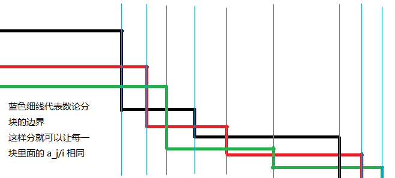

数论分块可以快速计算一些含有除法向下取整的和式（即形如 $\sum_{i=1}^nf(i)g(\left\lfloor\dfrac ni\right\rfloor)$ 的和式）。当可以在 $O(1)$ 内计算 $f(r)-f(l)$ 或已经预处理出 $f$ 的前缀和时，数论分块就可以在 $O(\sqrt n)$ 的时间内计算上述和式的值。

它主要利用了富比尼定理（Fubini's theorem），将 $\left\lfloor\dfrac ni\right\rfloor$ 相同的数打包同时计算。

???+ note "富比尼定理"
    又称「算两次」，以意大利数学家圭多·富比尼（Guido Fubini）命名。
    富比尼定理的积分形式：只要二重积分 $\int\int |f(x,y)|dxdy$ 有界，则可以逐次计算二重积分，并且可以交换逐次积分的顺序。
    积分号也是特殊的求和号，因此在一般求和中，富比尼定理往往呈现为更换计数顺序，即交换两个求和号。
    组合数学中的富比尼定理表现为，用两种不同的方法计算同一个量，从而建立相等关系。

例如这里的双曲线下整点的图片：


图中共分为了 $5$ 块，这 $5$ 块整点的最大纵坐标都相同。如果统计整点的个数，可以从纵向计数改为横向计数，直接计算 $5$ 个矩形即可。

## 引理 1

$$
\forall a,b,c\in\mathbb{Z},\left\lfloor\frac{a}{bc}\right\rfloor=\left\lfloor\frac{\left\lfloor\frac{a}{b}\right\rfloor}{c}\right\rfloor
$$

略证：

$$
\begin{aligned}
&\frac{a}{b}=\left\lfloor\frac{a}{b}\right\rfloor+r(0\leq r<1)\\
\implies
&\left\lfloor\frac{a}{bc}\right\rfloor
=\left\lfloor\frac{a}{b}\cdot\frac{1}{c}\right\rfloor
=\left\lfloor \frac{1}{c}\left(\left\lfloor\frac{a}{b}\right\rfloor+r\right)\right\rfloor
=\left\lfloor \frac{\left\lfloor\frac{a}{b}\right\rfloor}{c} +\frac{r}{c}\right\rfloor
=\left\lfloor \frac{\left\lfloor\frac{a}{b}\right\rfloor}{c}\right\rfloor\\
&&\square
\end{aligned}
$$

??? note "关于证明最后的小方块"
    QED 是拉丁词组「Quod Erat Demonstrandum」（这就是所要证明的）的缩写，代表证明完毕。现在的 QED 符号通常是 $\blacksquare$ 或者 $\square$。（[维基百科](https://en.wikipedia.org/wiki/Q.E.D.)）

## 引理 2

$$
\forall n \in \mathbb{N}_{+},  \left|\left\{ \lfloor \frac{n}{d} \rfloor \mid d \in \mathbb{N}_{+},d\leq n \right\}\right| \leq \lfloor 2\sqrt{n} \rfloor
$$

$|V|$ 表示集合 $V$ 的元素个数

略证：

对于 $d\leq \left\lfloor\sqrt{n}\right\rfloor$，$\left\lfloor\frac{n}{d}\right\rfloor$ 有 $\left\lfloor\sqrt{n}\right\rfloor$ 种取值

对于 $d> \left\lfloor\sqrt{n}\right\rfloor$，有 $\left\lfloor\frac{n}{d}\right\rfloor\leq\left\lfloor\sqrt{n}\right\rfloor$，也只有 $\left\lfloor\sqrt{n}\right\rfloor$ 种取值

综上，得证

## 数论分块结论

对于常数 $n$，使得式子

$$
\left\lfloor\dfrac ni\right\rfloor=\left\lfloor\dfrac nj\right\rfloor
$$

成立的最大的满足 $i\leq j\leq n$ 的 $j$ 的值为 $\left\lfloor\dfrac n{\lfloor\frac ni\rfloor}\right\rfloor$。即值 $\left\lfloor\dfrac ni\right\rfloor$ 所在的块的右端点为 $\left\lfloor\dfrac n{\lfloor\frac ni\rfloor}\right\rfloor$。

??? note "证明"
    令 $k=\left\lfloor\dfrac ni\right\rfloor$，可以知道 $k\leq\dfrac ni$。
    
    $$
    \begin{aligned}
    &\therefore \left\lfloor\dfrac nk\right\rfloor\geq\left\lfloor\dfrac n{\frac ni}\right\rfloor=\lfloor i\rfloor=i\\
    &\therefore j=\max{\text{满足条件的所有 }i}=i_{\max}=\left\lfloor\dfrac nk\right\rfloor=\left\lfloor\dfrac n{\left\lfloor\dfrac ni\right\rfloor}\right\rfloor \square
    \end{aligned}
    $$

## 过程

数论分块的过程大概如下：考虑和式

$\sum_{i=1}^nf(i)\left\lfloor\dfrac ni\right\rfloor$

那么由于我们可以知道 $\left\lfloor\dfrac ni\right\rfloor$ 的值成一个块状分布（就是同样的值都聚集在连续的块中），那么就可以用数论分块加速计算，降低时间复杂度。

利用上述结论，我们先求出 $f(i)$ 的 **前缀和**（记作 $s(i)=\sum_{j=1}^i f(j)$），然后每次以 $[l,r]=[l,\left\lfloor\dfrac n{\lfloor\frac ni\rfloor}\right\rfloor]$ 为一块，分块求出贡献累加到结果中即可。

伪代码如下：

$$
\begin{array}{ll}
1 & \text{获取 $f(i)$ 函数的前缀和，记为 $s(i)$.} \\
2 & l \gets 1\\
3 & r \gets 0\\
4 & \textit{result} \gets 0 \\
5 & \textbf{while } l \leq n \textbf{ do} : \\
6 & \qquad r \gets \left\lfloor \dfrac{n}{\lfloor n/l \rfloor} \right\rfloor\\
7 & \qquad \textit{result} \gets \textit{result} + [s(r)-s(l-1)] \times\left\lfloor \dfrac{n}{l} \right\rfloor\\
8 & \qquad l \gets r+1\\
9 & \textbf{end while }\\
\end{array}
$$

最终得到的 $result$ 即为所求的和式。

???+ note " 例题：[UVa11526 H(n)](https://onlinejudge.org/index.php?option=com_onlinejudge&Itemid=8&category=27&page=show_problem&problem=2521)"
    题意：$T$ 组数据，每组一个整数 $n$。对于每组数据，输出 $\sum_{i=1}^n\left\lfloor\dfrac ni\right\rfloor$。
    
    思路：如上推导，对于每一块相同的 $\left\lfloor\dfrac ni\right\rfloor$ 一起计算。时间复杂度为 $O(T\sqrt n)$。

??? note "参考实现"
    ```cpp
    long long H(int n) {
      long long res = 0;  // 储存结果
      int l = 1, r;       // 块左端点与右端点
      while (l <= n) {
        r = n / (n / l);  // 计算当前块的右端点
        res += (r - l + 1) * 1LL *
               (n / l);  // 累加这一块的贡献到结果中。乘上 1LL 防止溢出
        l = r + 1;  // 左端点移到下一块
      }
      return res;
    }
    ```

???+ note "N 维数论分块"
    求含有 $\left\lfloor\dfrac {a_1}i\right\rfloor$、$\left\lfloor\dfrac {a_2}i\right\rfloor\cdots\left\lfloor\dfrac {a_n}i\right\rfloor$ 的和式时，数论分块右端点的表达式从一维的 $\left\lfloor\dfrac ni\right\rfloor$ 变为 $\min\limits_{j=1}^n\{\left\lfloor\dfrac {a_j}i\right\rfloor\}$，即对于每一个块的右端点取最小（最接近左端点）的那个作为整体的右端点。可以借助下图理解：
    
    
    
    一般我们用的较多的是二维形式，此时可将代码中 `r = n / (n / i)` 替换成 `r = min(n / (n / i), m / (m / i))`。

## 习题

1.  [CQOI2007 余数求和](https://www.luogu.com.cn/problem/P2261)（需要一点转化和特判）

2.  [UVa11526 H(n)](https://onlinejudge.org/index.php?option=com_onlinejudge&Itemid=8&category=27&page=show_problem&problem=2521)（几乎可以当做模板题）

3.  [POI2007 ZAP-Queries](https://www.luogu.com.cn/problem/P3455)（数论分块一般配合 [莫比乌斯反演](./mobius.md) 用以进一步降低复杂度；本题需要用到 $[n=1]=\sum_{d|n}\mu(n)$ 这一条莫反结论）
