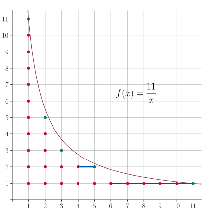
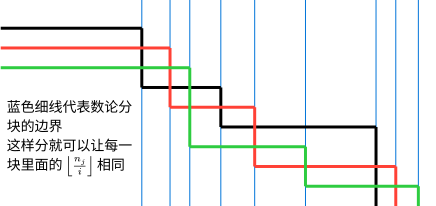

数论分块可以快速计算一些形如

$$
\sum_{i=1}^nf(i)g\left(\left\lfloor\dfrac ni\right\rfloor\right)
$$

的和式．如果可以在 $O(1)$ 时间内计算出 $\sum_{i=l}^{r}f(i)$ 或已经预处理出 $f$ 的前缀和时，数论分块就可以在 $O(\sqrt{n})$ 时间内计算出上述和式的值．

数论分块常与 [莫比乌斯反演](./mobius.md) 等技巧结合使用．

## 思路

首先，本文通过一个简单的例子来说明数论分块的思路．假设要计算如图所示的双曲线下的整点个数：



这相当于在计算和式：

$$
\sum_{i=1}^{11}\left\lfloor\dfrac{11}{i}\right\rfloor.
$$

这是前文所示和式在 $f(k)=1,~g(k)=k$ 时的特殊情况．

最简单的做法当然是逐列计算然后求和，但是这样需要计算第 $i=1,2,\cdots,11$ 列中每列整点的个数．观察图示可以发现，这些整点列的可以分成 $5$ 块，每块内点列的高度是一致的，形成一个矩形点阵．所以，只要能够知道这些块的宽度，就能够通过计算这些矩形块的大小快速完成统计．

这就是整除分块的基本思路．

## 性质

本节讨论关于双曲线 $y = \dfrac{n}{x}$ 下整点分块的若干结论．具体地，需要将 $1\sim n$ 之间的整数按照 $\left\lfloor\dfrac{n}{i}\right\rfloor$ 的取值分为若干块．设

$$
D_n = \left\{\left\lfloor\dfrac{n}{i}\right\rfloor : 1 \le i \le n,~i\in\mathbf N_+\right\}.
$$

这就是 $\left\lfloor\dfrac{n}{i}\right\rfloor$ 所有可能的取值集合．

首先，这样的不同取值只有 $O(\sqrt{n})$ 个．所以，数论分块得到的块的数目只有 $O(\sqrt{n})$ 个．

???+ note "性质 1"
    $|D_n|\le 2\sqrt{n}$．

??? note "证明"
    分两种情况讨论：
    
    -   当 $i\le\sqrt{n}$ 时，$i$ 的取值至多 $\sqrt{n}$ 个，所以 $\left\lfloor\dfrac{n}{i}\right\rfloor$ 的取值也至多只有 $\sqrt{n}$ 个．
    -   当 $i>\sqrt{n}$ 时，$\left\lfloor\dfrac{n}{i}\right\rfloor \le\dfrac{n}{i} < \sqrt{n}$ 也至多只有 $\sqrt{n}$ 个取值．
    
    因此，所有可能取值的总数 $|D_n|\le 2\sqrt{n}$．

然后，单个块的左右端点都很容易确定．

???+ note "性质 2"
    对于 $d\in D_n$，所有满足 $\left\lfloor\dfrac{n}{i}\right\rfloor=d$ 的整数 $i$ 的取值范围为
    
    $$
    \left\lfloor\dfrac{n}{d+1}\right\rfloor + 1\le i \le \left\lfloor\dfrac{n}{d}\right\rfloor.
    $$

??? note "证明"
    因为 $\left\lfloor\dfrac{n}{i}\right\rfloor=d$ 相当于不等式
    
    $$
    d\le \dfrac{n}{i} < d+1.
    $$
    
    这进一步等价于
    
    $$
    \dfrac{n}{d+1} < i\le \dfrac{n}{d}.
    $$
    
    利用 $i\in\mathbf N_+$ 这一点，可以对该不等式取整，它就等价于
    
    $$
    \left\lfloor\dfrac{n}{d+1}\right\rfloor + 1 \le i\le \left\lfloor\dfrac{n}{d}\right\rfloor.
    $$

这一性质还体现了图像的对称性：每个块的右端点（前文图中的绿点）的集合恰为 $D_n$．这很容易理解，因为整个图像关于直线 $y=x$ 是对称的．

除了这两条性质外，集合 $D_n$ 还具有良好的递归性质．这基于如下引理：

???+ note "引理"
    对于 $a,b,c\in\mathbf N_+$，有
    
    $$
    \left\lfloor\dfrac{\lfloor a/b\rfloor}{c}\right\rfloor = \left\lfloor\dfrac{a}{bc}\right\rfloor.
    $$

??? note "证明"
    令 $a$ 对于 $b$ 做带余除法有 $a=qb+r$，其中 $q,r\in\mathbf N$ 且 $r < b$．需要证明的是
    
    $$
    \left\lfloor\dfrac{q}{c}\right\rfloor = \left\lfloor\dfrac{q}{c}+\dfrac{r}{bc}\right\rfloor.
    $$
    
    这等价于
    
    $$
    \left\lfloor\dfrac{q}{c}\right\rfloor \le \dfrac{q}{c}+\dfrac{r}{bc} < \left\lfloor\dfrac{q}{c}\right\rfloor + 1.
    $$
    
    左侧不等式是显然的．关键是要证明右侧不等式．为此，令 $q$ 对 $c$ 做带余除法，就有
    
    $$
    q = \left\lfloor\dfrac{q}{c}\right\rfloor c + r',
    $$
    
    其中，$0\le r' \le c - 1$．所以，有
    
    $$
    q \le \left\lfloor\dfrac{q}{c}\right\rfloor c + c - 1 \iff \dfrac{q + 1}{c} \le \left\lfloor\dfrac{q}{c}\right\rfloor + 1.
    $$
    
    进而，利用 $r < b$，就有
    
    $$
    \dfrac{q}{c}+\dfrac{r}{bc} < \dfrac{q+1}{c}  \le \left\lfloor\dfrac{q}{c}\right\rfloor + 1.
    $$
    
    这就证明右侧不等式，进而完成本命题的证明．

这一引理经常出现在数论分块的各种应用中．利用该引理可以得到如下性质：

???+ note "性质 3"
    对于 $m\in D(n)$，有 $D(m)\subseteq D(n)$．

??? note "证明"
    设 $m = \left\lfloor\dfrac{n}{k}\right\rfloor$，那么，因为对于所有 $i\in\mathbf N_+$，都有
    
    $$
    \left\lfloor\dfrac{m}{i}\right\rfloor = \left\lfloor\dfrac{\lfloor n/k\rfloor}{i}\right\rfloor = \left\lfloor\dfrac{n}{ki}\right\rfloor \in D(n),
    $$
    
    所以，$D(m)\subseteq D(n)$．

前文已经提到，$D(n)$ 既是每块中 $\left\lfloor\dfrac{n}{i}\right\rfloor$ 的取值集合，也是每块的右端点集合．这意味着，如果要递归地应用数论分块（即函数在 $n$ 处的值依赖于它在 $m\in D(n)\setminus\{n\}$ 处的值），那么在整个计算过程中所涉及的取值集合和右端点集合，其实都是 $D(n)$．一个典型的例子是 [杜教筛](./du.md)．

## 过程

利用上一节叙述的结论，就得到数论分块的具体过程．

为计算和式

$$
\sum_{i=1}^nf(i)g\left(\left\lfloor\dfrac ni\right\rfloor\right)
$$

的取值，可以依据 $\left\lfloor\dfrac ni\right\rfloor$ 的取值将标号 $i=1,2,\cdots,n$ 分块．因为 $\left\lfloor\dfrac ni\right\rfloor$ 取值相同的标号是一段连续整数 $[l,r]$，所以该块中和式的取值为

$$
\left(\sum_{i=l}^rf(i)\right)\cdot g\left(\left\lfloor\dfrac nl\right\rfloor\right).
$$

为了快速计算该和式，通常需要能够快速计算左侧关于 $f$ 的和式．有些时候，该和式的表达式是已知的，可以在 $O(1)$ 时间内完成单次计算；有些时候，可以预处理出它的前缀和，仍然可以在 $O(1)$ 时间内完成单次查询．

在顺次计算每块左右端点时，当前块的左端点 $l$ 就等于前一块的右端点再加 $1$，而当前块的右端点就等于 $\left\lfloor\dfrac n{\lfloor n/l\rfloor}\right\rfloor$．由此，可以得到如下伪代码：

$$
\begin{array}{l}
\textbf{Algorithm }\text{Sum}(f,g,n):\\
\textbf{Input. }n,~s(k)=\sum_{i=1}^kf(k),~g(k).\\
\textbf{Output. }S(n) = \sum_{i=1}^nf(i)g(\lfloor n/i\rfloor).\\
\textbf{Method.}\\
\begin{array}{ll}
1 & l \gets 1\\
2 & \textit{result} \gets 0 \\
3 & \textbf{while } l \leq n \textbf{ do}\\
4 & \qquad r \gets \left\lfloor \dfrac{n}{\lfloor n/l \rfloor} \right\rfloor\\
5 & \qquad \textit{result} \gets \textit{result} + (s(r)-s(l-1))\cdot g\left(\left\lfloor \dfrac{n}{l} \right\rfloor\right)\\
6 & \qquad l \gets r+1\\
7 & \textbf{end while}\\
8 & \textbf{return }\textit{result}
\end{array}
\end{array}
$$

假设单次计算 $s(\cdot)$ 的时间复杂度为 $O(1)$，则整个过程的时间复杂度为 $O(\sqrt{n})$．

## 扩展

前文讨论的是数论分块的最常见也最基本的形式．本节进一步讨论数论分块的扩展形式．

### 向上取整的数论分块

数论分块可以用于计算含有向上取整的和式：

$$
\sum_{i=1}^nf(i)g\left(\left\lceil\dfrac ni\right\rceil\right).
$$

因为 $\left\lceil\dfrac ni\right\rceil = \left\lfloor\dfrac {n-1}i\right\rfloor + 1$，该和式可以转化为向下取整的情形：

$$
f(n)g(1) + \sum_{i=1}^{n-1}f(i)g\left(\left\lfloor\dfrac {n-1}i\right\rfloor + 1\right).
$$

注意到求和的上限发生了变化，以及 $i=n$ 时单独的一项．

### 多维数论分块

数论分块还可以用于处理包含不只有一个取整式的和式：

$$
\sum_{i=1}^{n}f(i)g\left(\left\lfloor\dfrac {n_1}i\right\rfloor,\left\lfloor\dfrac {n_2}i\right\rfloor,\cdots,\left\lfloor\dfrac {n_m}i\right\rfloor\right).
$$

为了应用数论分块的思想，需要保证每块中所有取整式 $\left\lfloor\dfrac {n_1}i\right\rfloor,\left\lfloor\dfrac {n_2}i\right\rfloor,\cdots,\left\lfloor\dfrac {n_m}i\right\rfloor$ 的取值都不发生变化，也就是说，多维的块应当是所有一维的块的交集．为此，对于已知的左端点 $l$，相应的右端点为

$$
\min\left\{\left\lfloor\dfrac {n_1}{\lfloor n_1/l\rfloor}\right\rfloor,\left\lfloor\dfrac {n_2}{\lfloor n_2/l\rfloor}\right\rfloor,\cdots,\left\lfloor\dfrac {n_m}{\lfloor n_m/l\rfloor}\right\rfloor\right\}.
$$

也就是说，对于所有一维分块的右端点取最小值，作为多维分块的右端点．可以借助下图理解：



较为常见的是二维形式，此时可将前述伪代码中 $r \gets \left\lfloor \dfrac{n}{\lfloor n/l \rfloor}\right\rfloor$ 替换成

$$
r \gets \min\left\{\left\lfloor \dfrac{n_1}{\lfloor n_1/l \rfloor}\right\rfloor,\left\lfloor \dfrac{n_2}{\lfloor n_2/l \rfloor}\right\rfloor\right\}.
$$

### 任意指数数论分块

数论分块可以用于含有任意指数的取整式的和式计算：

$$
\sum_{i=1}^{\lfloor n^{\alpha/\beta}\rfloor}f(i)g\left(\left\lfloor\dfrac {n^\alpha}{i^\beta}\right\rfloor\right).
$$

其中，$\alpha,\beta$ 为正实数．本文讨论的基本形式中，$\alpha=\beta=1$．

???+ note "性质"
    对于正整数 $n$ 和正实数 $\alpha, \beta$，设
    
    $$
    D_{n,\alpha,\beta} = \left\{\left\lfloor\dfrac{n^\alpha}{i^\beta}\right\rfloor: i=1,2,\cdots,\lfloor n^{\alpha/\beta}\rfloor\right\}.
    $$
    
    那么，有
    
    1.  $|D_{n,\alpha,\beta}|\le 2n^{\alpha/(1+\beta)}$．
    2.  对于 $d\in D_{n,\alpha,\beta}$，使得 $\left\lfloor\dfrac{n^\alpha}{i^\beta}\right\rfloor=d$ 成立的 $i$ 的取值范围为
    
        $$
        \left\lfloor\dfrac{n^{\alpha/\beta}}{(d+1)^{1/\beta}}\right\rfloor + 1\le i \le \left\lfloor\dfrac{n^{\alpha/\beta}}{d^{1/\beta}}\right\rfloor.
        $$

??? note "证明"
    对于第一点，分两种情况：
    
    -   当 $i\le \dfrac{n^\alpha}{i^\beta}$ 时，有 $i\le n^{\alpha/(1+\beta)}$，所以 $\left\lfloor\dfrac{n^\alpha}{i^\beta}\right\rfloor$ 至多有 $n^{\alpha/(1+\beta)}$ 种取值．
    -   当 $i > \dfrac{n^\alpha}{i^\beta}$ 时，有 $i> n^{\alpha/(1+\beta)}$，进而有 $\dfrac{n^\alpha}{i^\beta} < n^{\alpha/(1+\beta)}$，所以 $\left\lfloor\dfrac{n^\alpha}{i^\beta}\right\rfloor$ 也至多只有 $n^{\alpha/(1+\beta)}$ 种取值．
    
    综合两种情形，就有 $|D_{n,\alpha,\beta}|\le 2n^{\alpha/(1+\beta)}$．
    
    对于第二点，$\left\lfloor\dfrac{n^\alpha}{i^\beta}\right\rfloor=d$ 就等价于
    
    $$
    d \le \dfrac{n^\alpha}{i^\beta} < d+1 \iff \dfrac{n^{\alpha/\beta}}{(d+1)^{1/\beta}} < i \le \dfrac{n^{\alpha/\beta}}{d^{1/\beta}}.
    $$
    
    对该不等式取整，就得到第二个命题．

利用这些性质，就可以在 $O(n^{\alpha/(1+\beta)})$ 的时间复杂度下实现对任意指数的数论分块．

???+ example "例子"
    例如，对于 $\alpha=\beta=1/2$ 时的如下和式
    
    $$
    \sum_{i=1}^nf(i)g\left(\left\lfloor\sqrt{\dfrac {n}{i}}\right\rfloor\right),
    $$
    
    可以通过数论分块在 $O(n^{1/3})$ 时间内解决．已知块的左端点为 $l$ 时，可以计算右端点为 $r=\left\lfloor\dfrac{n}{\lfloor\sqrt{n/l}\rfloor^2}\right\rfloor$．

## 例题

???+ example "[UVa11526 H(n)](https://onlinejudge.org/index.php?option=com_onlinejudge&Itemid=8&category=27&page=show_problem&problem=2521)"
    $T$ 组数据，每组一个整数 $n$．对于每组数据，输出 $\sum_{i=1}^n\left\lfloor\dfrac ni\right\rfloor$．

??? note "解答"
    根据前文分析，可以对于每一块相同的 $\left\lfloor\dfrac ni\right\rfloor$ 一起计算．时间复杂度为 $O(T\sqrt n)$．

??? note "实现"
    ```cpp
    --8<-- "docs/math/code/sqrt-decomposition/sqrt-decomposition_1.cpp"
    ```

???+ example "[Codeforces 1954E Chain Reaction](https://codeforces.com/contest/1954/problem/E)"
    有一排 $n$ 只怪兽，每只怪兽初始血量为 $a_i$．一次攻击会使一段连续的存活的怪兽血量减 $k$，血量不大于 $0$ 视作死亡．对于所有 $k$ 求出击杀所有怪兽所需攻击次数．其中，$n,a_i\leq 10^5$．

??? note "解答"
    令 $a_0=0$．假设击杀所有前 $(i-1)$ 只怪兽需要 $T(k,i-1)$ 次攻击，第 $i$ 只怪兽的血量为 $a_i$．由于击杀第 $(i-1)$ 只怪兽时，需要攻击它 $\lceil a_{i-1}/k\rceil$ 次，这些攻击都可以延伸到第 $i$ 只怪兽．因此，要击杀第 $i$ 只怪兽，只需要再攻击 $\max\{0,\lceil a_i/k\rceil-\lceil a_{i-1}/k\rceil\}$ 次．由此，总的攻击次数为
    
    $$
    T(k,n)=\sum_{i=1}^n\max\left(0,\left\lceil\dfrac{a_i}{k}\right\rceil-\left\lceil\dfrac{a_{i-1}}{k}\right\rceil\right).
    $$
    
    由于题目涉及的 $n,k$ 都比较大，对每个 $k$ 分别计算该和式并不可行．可以考虑对每个 $i=1,2,\cdots,n$，都维护数列 $\{T(k,i)\}_k$．初始时，设 $T(k,0)\equiv 0$．假设数列 $\{T(k,i-1)\}_k$ 已知，考虑如何对它进行修改才能得到数列 $\{T(k,i)\}_k$．根据前文分析，只需要对数列的第 $k$ 项增加 $\max\left(0,\left\lceil\dfrac{a_i}{k}\right\rceil-\left\lceil\dfrac{a_{i-1}}{k}\right\rceil\right)$ 即可．利用二维数论分块，可以将这一修改操作拆分成 $O(\sqrt{a_{i-1}}+\sqrt{a_i})$ 段区间修改操作，且每段区间上增加的值是固定的．最后得到的数列 $\{T(k,n)\}_k$ 就是答案．
    
    由于题目涉及一系列区间加操作，且查询只发生所有修改完成后．所以，可以通过维护差分序列进行区间加修改，最后通过求前缀和得到所求数列．总的时间复杂度为 $O(\sum\sqrt{a_i})$．本题也存在其他解法．

??? note "实现"
    ```cpp
    --8<-- "docs/math/code/sqrt-decomposition/sqrt-decomposition_2.cpp"
    ```

## 习题

-   [UVa11526 H(n)](https://onlinejudge.org/index.php?option=com_onlinejudge&Itemid=8&category=27&page=show_problem&problem=2521)
-   [Luogu P2261 CQOI2007 余数求和](https://www.luogu.com.cn/problem/P2261)
-   [Luogu P3455 POI2007 ZAP-Queries](https://www.luogu.com.cn/problem/P3455)

## 参考资料与注释

-   [杜教筛的时空复杂度分析 by riteme](https://riteme.site/blog/2018-9-11/time-space-complexity-dyh-algo.html)
