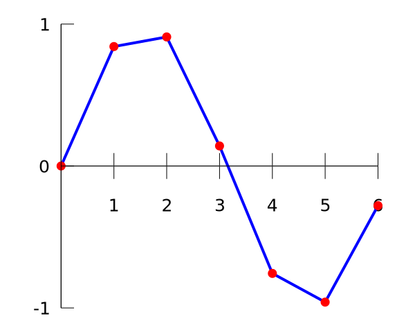

author: AtomAlpaca, billchenchina, Chrogeek, Early0v0, EndlessCheng, Enter-tainer, Henry-ZHR, hly1204, hsfzLZH1, Ir1d, Ghastlcon, kenlig, Marcythm, megakite, Peanut-Tang, qwqAutomaton, qz-cqy, StudyingFather, swift-zym, swiftqwq, Tiphereth-A, TrisolarisHD, x4Cx58x54, Xeonacid, xiaopangfeiyu, YanWQ-monad

## 引入

插值是一种通过已知的、离散的数据点推算一定范围内的新数据点的方法。插值法常用于函数拟合中。

例如对数据点：

| $x$    | $0$ | $1$      | $2$      | $3$      | $4$       | $5$       | $6$       |
| ------ | --- | -------- | -------- | -------- | --------- | --------- | --------- |
| $f(x)$ | $0$ | $0.8415$ | $0.9093$ | $0.1411$ | $-0.7568$ | $-0.9589$ | $-0.2794$ |


其中 $f(x)$ 未知，插值法可以通过按一定形式拟合 $f(x)$ 的方式估算未知的数据点。

例如，我们可以用分段线性函数拟合 $f(x)$：



这种插值方式叫做 [线性插值](https://en.wikipedia.org/wiki/Linear_interpolation)。

我们也可以用多项式拟合 $f(x)$：


这种插值方式叫做 [多项式插值](https://en.wikipedia.org/wiki/Polynomial_interpolation)。

多项式插值的一般形式如下：

???+ note "多项式插值"
    对已知的 $n+1$ 的点 $(x_0,y_0),(x_1,y_1),\dots,(x_n,y_n)$，求 $n$ 阶多项式 $f(x)$ 满足
    
    $$
    f(x_i)=y_i,\qquad\forall i=0,1,\dots,n
    $$

下面介绍多项式插值中的两种方式：Lagrange 插值法与 Newton 插值法。不难证明这两种方法得到的结果是相等的。

## Lagrange 插值法

由于要求构造一个函数 $f(x)$ 过点 $P_1(x_1, y_1), P_2(x_2,y_2),\cdots,P_n(x_n,y_n)$. 首先设第 $i$ 个点在 $x$ 轴上的投影为 $P_i^{\prime}(x_i,0)$.

考虑构造 $n$ 个函数 $f_1(x), f_2(x), \cdots, f_n(x)$，使得对于第 $i$ 个函数 $f_i(x)$，其图像过 $\begin{cases}P_j^{\prime}(x_j,0),(j\neq i)\\P_i(x_i,y_i)\end{cases}$，则可知题目所求的函数 $f(x)=\sum\limits_{i=1}^nf_i(x)$.

那么可以设 $f_i(x)=a\cdot\prod_{j\neq i}(x-x_j)$，将点 $P_i(x_i,y_i)$ 代入可以知道 $a=\dfrac{y_i}{\prod_{j\neq i} (x_i-x_j)}$，所以

$$
f_i(x)=y_i\cdot\dfrac{\prod_{j\neq i} (x-x_j)}{\prod_{j\neq i} (x_i-x_j)}=y_i\cdot\prod_{j\neq i}\dfrac{x-x_j}{x_i-x_j}
$$

那么我们就可以得出 Lagrange 插值的形式为：

$$
f(x)=\sum_{i=1}^ny_i\cdot\prod_{j\neq i}\dfrac{x-x_j}{x_i-x_j}
$$

朴素实现的时间复杂度为 $O(n^2)$，可以优化到 $O(n\log^2 n)$，参见 [多项式快速插值](../poly/multipoint-eval-interpolation.md#多项式的快速插值)。

???+ note "[Luogu P4781【模板】拉格朗日插值](https://www.luogu.com.cn/problem/P4781)"
    给出 $n$ 个点对 $(x_i,y_i)$ 和 $k$，且 $\forall i,j$ 有 $i\neq j \iff x_i\neq x_j$ 且 $f(x_i)\equiv y_i\pmod{998244353}$ 和 $\deg(f(x))<n$（定义 $\deg(0)=-\infty$），求 $f(k)\bmod{998244353}$.
    
    ??? note "题解"
        本题中只用求出 $f(k)$ 的值，所以在计算上式的过程中直接将 $k$ 代入即可。
        
        $$
        f(k)=\sum_{i=1}^{n}y_i\prod_{j\neq i }\frac{k-x_j}{x_i-x_j}
        $$
        
        本题中，还需要求解逆元。如果先分别计算出分子和分母，再将分子乘进分母的逆元，累加进最后的答案，时间复杂度的瓶颈就不会在求逆元上，时间复杂度为 $O(n^2)$.
        
        因为在固定模 $998244353$ 意义下运算，计算乘法逆元的时间复杂度我们在这里暂且认为是常数时间。
    
    ??? note "代码实现"
        ```cpp
        --8<-- "docs/math/code/numerical/interp/interp_1.cpp"
        ```

### 横坐标是连续整数的 Lagrange 插值

如果已知点的横坐标是连续整数，我们可以做到 $O(n)$ 插值。

设要求 $n$ 次多项式为 $f(x)$，我们已知 $f(1),\cdots,f(n+1)$（$1\le i\le n+1$），考虑代入上面的插值公式：

$$
\begin{aligned}
f(x)&=\sum\limits_{i=1}^{n+1}y_i\prod\limits_{j\ne i}\frac{x-x_j}{x_i-x_j}\\
&=\sum\limits_{i=1}^{n+1}y_i\prod\limits_{j\ne i}\frac{x-j}{i-j}
\end{aligned}
$$

后面的累乘可以分子分母分别考虑，不难得到分子为：

$$
\dfrac{\prod\limits_{j=1}^{n+1}(x-j)}{x-i}
$$

分母的 $i-j$ 累乘可以拆成两段阶乘来算：

$$
(-1)^{n+1-i}\cdot(i-1)!\cdot(n+1-i)!
$$

于是横坐标为 $1,\cdots,n+1$ 的插值公式：

$$
f(x)=\sum\limits_{i=1}^{n+1}(-1)^{n+1-i}y_i\cdot\frac{\prod\limits_{j=1}^{n+1}(x-j)}{(i-1)!(n+1-i)!(x-i)}
$$

预处理 $(x-i)$ 前后缀积、阶乘阶乘逆，然后代入这个式子，复杂度为 $O(n)$.

???+ note " 例题 [CF622F The Sum of the k-th Powers](https://codeforces.com/contest/622/problem/F)"
    给出 $n,k$，求 $\sum\limits_{i=1}^ni^k$ 对 $10^9+7$ 取模的值。

    ??? note "题解"
        本题中，答案是一个 $k+1$ 次多项式，因此我们可以线性筛出 $1^i,\cdots,(k+2)^i$ 的值然后进行 $O(n)$ 插值。
        
        也可以通过组合数学相关知识由差分法的公式推得下式：
        
        $$
        f(x)=\sum_{i=1}^{n+1}\binom{x-1}{i-1}\sum_{j=1}^{i}(-1)^{i+j}\binom{i-1}{j-1}y_{j}=\sum\limits_{i=1}^{n+1}y_i\cdot\frac{\prod\limits_{j=1}^{n+1}(x-j)}{(x-i)\cdot(-1)^{n+1-i}\cdot(i-1)!\cdot(n+1-i)!}
        $$

    ??? note "代码实现"
        ```cpp
        --8<-- "docs/math/code/numerical/interp/interp_2.cpp"
        ```

## Newton 插值法

Newton 插值法是基于高阶差分来插值的方法，优点是支持 $O(n)$ 插入新数据点。

为了实现 $O(n)$ 插入新数据点，我们令：

$$
f(x)=\sum_{j=0}^n a_jn_j(x)
$$

其中 $n_j(x):=\prod_{i=0}^{j-1}(x-x_i)$ 称为 **Newton 基**（Newton basis）。

若解出 $a_j$，则可得到 $f(x)$ 的插值多项式。我们按如下方式定义 **前向差商**（forward divided differences）：

$$
\begin{aligned}
    \lbrack y_k\rbrack  & := y_k,                                                                & k=0,\dots,n, \\
    [y_k,\dots,y_{k+j}] & := \dfrac{[y_{k+1},\dots,y_{k+j}]-[y_k,\dots,y_{k+j-1}]}{x_{k+j}-x_k}, & k=0,\dots,n-j,~j=1,\dots,n.
\end{aligned}
$$

则：

$$
\begin{aligned}
    f(x)&=[y_0]+[y_0,y_1](x-x_0)+\dots+[y_0,\dots,y_n](x-x_0)\dots(x-x_{n-1})\\
    &=\sum_{j=0}^n [y_0,\dots,y_j]n_j(x)
\end{aligned}
$$

此即 Newton 插值的形式。朴素实现的时间复杂度为 $O(n^2)$.

若样本点是等距的（即 $x_i=x_0+ih$，$i=1,\dots,n$），令 $x=x_0+sh$，Newton 插值的公式可化为：

$$
f(x)=\sum_{j=0}^n \binom{s}{j}j!h^j[y_0,\dots,y_j]
$$

上式称为 **Newton 前向差分公式**（Newton forward divided difference formula）。

???+ note
    若样本点是等距的，我们还可以推出：
    
    $$
    [y_k,\dots,y_{k+j}]=\frac{1}{j!h^j}\Delta^{(j)}y_k
    $$
    
    其中 $\Delta^{(j)}y_k$ 为 **前向差分**（forward differences），定义如下：
    
    $$
    \begin{aligned}
        \Delta^{(0)}y_k & := y_k,                                       & k=0,\dots,n, \\
        \Delta^{(j)}y_k & := \Delta^{(j-1)} y_{k+1}-\Delta^{(j-1)} y_k, & k=0,\dots,n-j,~j=1,\dots,n.
    \end{aligned}
    $$

??? note " 代码实现（[Luogu P4781【模板】拉格朗日插值](https://www.luogu.com.cn/problem/P4781)）"
    ```cpp
    --8<-- "docs/math/code/numerical/interp/interp_3.cpp"
    ```

### 横坐标是连续整数的 Newton 插值

例如：求某三次多项式 $f(x)=\sum_{i=0}^{3} a_ix^i$ 的多项式系数，已知 $f(1)$ 至 $f(6)$ 的值分别为 $1, 5, 14, 30, 55, 91$。

$$
\begin{array}{cccccccccccc}
1 &    &  5 &    & 14 &    & 30 &    & 55 &    & 91 & \\
&  4 &    &  9 &    & 16 &    & 25  &    & 36 & \\
&    &  5 &    &  7 &    &  9 &    &  11 & \\
&    &    &  2 &    &  2 &    &  2 & \\
\end{array}
$$

第一行为 $f(x)$ 的连续的前 $n$ 项；之后的每一行为之前一行中对应的相邻两项之差。观察到，如果这样操作的次数足够多（前提是 $f(x)$ 为多项式），最终总会返回一个定值。

计算出第 $i-1$ 阶差分的首项为 $\sum_{j=1}^{i}(-1)^{i+j}\binom{i-1}{j-1}f(j)$，第 $i-1$ 阶差分的首项对 $f(k)$ 的贡献为 $\binom{k-1}{i-1}$ 次。

$$
f(k)=\sum_{i=1}^n\binom{k-1}{i-1}\sum_{j=1}^{i}(-1)^{i+j}\binom{i-1}{j-1}f(j)
$$

时间复杂度为 $O(n^2)$.

## C++ 中的实现

自 C++ 20 起，标准库添加了 [`std::midpoint`](https://en.cppreference.com/w/cpp/numeric/midpoint) 和 [`std::lerp`](https://en.cppreference.com/w/cpp/numeric/lerp) 函数，分别用于求中点和线性插值。

## 参考资料

1.  [Interpolation - Wikipedia](https://en.wikipedia.org/wiki/Interpolation)
2.  [Newton polynomial - Wikipedia](https://en.wikipedia.org/wiki/Newton_polynomial)
