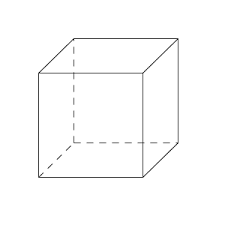

author: Wajov

置换群通常用来解决一些涉及“本质不同”的计数问题，例如用 3 种颜色给一个立方体染色，求本质不同的方案数（经过翻转后相同的两种方案视为同一种）。

## 群

### 群的定义

若集合 $S\neq\emptyset$ 和 $S$ 上的运算 $\cdot$ 构成的代数结构 $(S,\cdot)$ 满足以下性质：

-   封闭性： $\forall a,b\in S,a\cdot b\in S$ 

-   结合律： $\forall a,b,c\in S,(a\cdot b)\cdot c=a\cdot(b\cdot c)$ 

-   单位元： $\exists e\in S,\forall a\in S,e\cdot a=a\cdot e=a$ 

-   逆元： $\forall a\in S,\exists b\in S,a\cdot b=e$ ，称 $b$ 为 $a$ 的逆元，记为 $a^{-1}$ 

则称 $(S,\cdot)$ 为一个 **群** 。例如，整数集和整数间的加法 $(\mathbb{R},+)$ 构成一个群，单位元是 0，一个整数的逆元是它的相反数。

### 子群的定义

若 $(S,\cdot)$ 是群， $T$ 是 $S$ 的非空子集，且 $(T,\cdot)$ 也是群，则称 $(T,\cdot)$ 是 $(S,\cdot)$ 的 **子群** 。

## 置换

### 置换的定义

有限集合到自身的双射（即一一对应）称为置换。集合 $S=\{a_1,a_2,\dots,a_n\}$ 上的置换可以表示为

$$
f=\pmatrix{a_1,a_2,\dots,a_n\\
a_{p_1},a_{p_2},\dots,a_{p_n}}
$$

意为将 $a_i$ 映射为 $a_{p_i}$ ，其中 $p_1,p_2,\dots,p_n$ 是 $1,2,\dots,n$ 的一个排列。显然 $S$ 上所有置换的数量为 $n!$ 。

### 置换的乘法

对于两个置换 $f=\pmatrix{a_1,a_2,\dots,a_n\\
a_{p_1},a_{p_2},\dots,a_{p_n}}$ 和 $g=\pmatrix{a_{p_1},a_{p_2},\dots,a_{p_n}\\
a_{q_1},a_{q_2},\dots,a_{q_n}}$ ， $f$ 和 $g$ 的乘积记为 $f\circ g$ ，其值为

$$
f\circ g=\pmatrix{a_1,a_2,\dots,a_n\\
a_{q_1},a_{q_2},\dots,a_{q_n}}
$$

简单来说就是先后经过 $f$ 的映射，再经过 $g$ 的映射。

### 置换群

易证，集合 $S$ 上的所有置换关于置换的乘法满足封闭性、结合律、有单位元（恒等置换，即每个元素映射成它自己）、有逆元（交换置换表示中的上下两行），因此构成一个群。这个群的任意一个 **子群** 即称为 **置换群** 。

### 循环置换

循环置换是一类特殊的置换，可表示为

$$
(a_1,a_2,\dots,a_m)=\pmatrix{a_1,a_2,\dots,a_{m-1},a_m\\
a_2,a_3,\dots,a_m,a_1}
$$

若两个循环置换不含有相同的元素，则称它们是 **不相交** 的。有如下定理：

任意一个置换都可以分解为若干不相交的循环置换的乘积，例如

$$
\pmatrix{a_1,a_2,a_3,a_4,a_5\\
a_3,a_1,a_2,a_5,a_4}=(a_1,a_3,a_2)\circ(a_4,a_5)
$$

该定理的证明也非常简单。如果把元素视为图的节点，映射关系视为有向边，则每个节点的入度和出度都为 1，因此形成的图形必定是若干个环的集合，而一个环即可用一个循环置换表示。

## Burnside 引理

前面的都算是铺垫，接下来我们进入正题。

### 描述

设 $A$ 和 $B$ 为有限集合， $X=B^A$ 表示所有从 $A$ 到 $B$ 的映射。 $G$ 是 $A$ 上的置换群， $X/G$ 表示 $G$ 作用在 $X$ 上产生的所有等价类的集合（若 $X$ 中的两个映射经过 $G$ 中的置换作用后相等，则它们在同一等价类中），则

$$
|X/G|=\frac{1}{|G|}\sum_{g\in G}|X^g|
$$

其中 $|S|$ 表示集合 $S$ 中元素的个数，且

$$
X^g=\{x|x\in X,g(x)=x\}
$$

是不是觉得很难懂？别急，请看下面的例子。

### 举例

我们还是以给立方体染色为例子，则上面式子中一些符号的解释如下：

-    $A$ ：立方体 6 个面的集合
-    $B$ ：3 种颜色的集合
-    $X$ ：直接给每个面染色，不考虑本质不同的方案的集合，共有 $3^6$ 种
-    $G$ ：各种翻转操作构成的置换群
-    $X/G$ ：本质不同的染色方案的集合
-    $X^g$ ：对于某一种翻转操作 $g$ ，所有直接染色方案中，经过 $g$ 这种翻转后保持不变的染色方案的集合

接下来我们需要对 $G$ 中的所有置换进行分析，它们可以分为以下几类（方便起见，将立方体的 6 个面分别称为前、后、上、下、左、右）：

-   不动：即恒等变换，因为所有直接染色方案经过恒等变换都不变，因此它对应的 $|X^g|=3^6$ 
-   以两个相对面的中心连线为轴的 $90^\circ$ 旋转：相对面有 3 种选择，旋转的方向有两种选择，因此这类共有 6 个置换。假设选择了前、后两个面中心的连线为轴，则必须要满足上、下、左、右 4 个面的颜色一样，才能使旋转后不变，因此它对应的 $|X^g|=3^3$ 
-   以两个相对面的中心连线为轴的 $180^\circ$ 旋转：相对面有 3 种选择，旋转方向的选择对置换不再有影响，因此这类共有 3 个置换。假设选择了前、后两个面中心的连线为轴，则必须要满足上、下两个面的颜色一样，左、右两个面的颜色一样，才能使旋转后不变，因此它对应的 $|X^g|=3^4$ 
-   以两条相对棱的中点连线为轴的 $180^\circ$ 旋转：相对棱有 6 种选择，旋转方向对置换依然没有影响，因此这类共有 6 个置换。假设选择了前、上两个面的边界和下、后两个面的边界作为相对棱，则必须要满足前、上两个面的颜色一样，下、后两个面的颜色一样，左、右两个面的颜色一样，才能使旋转后不变，因此它对应的 $|X^g|=3^3$ 
-   以两个相对顶点的连线为轴的 $120^\circ$ 旋转：相对顶点有 4 种选择，旋转的方向有两种选择，因此这类共有 8 个置换。假设选择了前面的右上角和后面的左下角作为相对顶点，则必须满足前、上、右三个面的颜色一样，后、下、左三个面的颜色一样，才能使旋转后不变，因此它对应的 $|X^g|=3^2$ 

因此，所有本质不同的方案数为

$$
\frac{1}{1+6+3+6+8}(3^6+6\times3^3+3\times3^4+6\times3^3+8\times3^2)=57
$$

### 证明

看懂本部分需要群论的相关知识，如果你没有学习过群论或者对证明过程没有兴趣，建议直接跳过本部分。

为了证明 Burnside 引理，需要先引入轨道稳定子定理（Orbit-Stabilizer Theorem，也称轨道 - 稳定集定理）。

 **轨道稳定子定理**  $G$ 和 $X$ 的定义同上， $\forall x\in X,G^x=\{g|g(x)=x,g\in G\},G(x)=\{g(x)|g\in G\}$ ，其中 $G^x$ 称为 $x$ 的 **稳定子** ， $G(x)$ 称为 $x$ 的 **轨道** ，则有

$$
|G|=|G^x||G(x)|
$$

 **轨道稳定子定理的证明** 首先可以证明 $G^x$ 是 $G$ 的子群，因为

-   封闭性：若 $f,g\in G$ ，则 $f\circ g(x)=f(g(x))=f(x)=x$ ，所以 $f\circ g\in G^x$ 
-   结合律：显然置换的乘法满足结合律
-   单位元：因为 $I(x)=x$ ，所以 $I\in G^x$ （ $I$ 为恒等置换）
-   逆元：若 $g\in G^x$ ，则 $g^{-1}(x)=g^{-1}(g(x))=g^{-1}\circ g(x)=I(x)=x$ ，所以 $g^{-1}\in G^x$ 

则由群论中的拉格朗日定理，可得

$$
|G|=|G^x|[G:G^x]
$$

其中 $[G:G^x]$ 为 $G^x$ 不同的左陪集个数。接下来只需证明 $|G(x)|=[G:G^x]$ ，我们将其转化为证明存在一个从 $G(x)$ 到 $G^x$ 所有不同左陪集的双射。令 $\varphi(g(x))=gG^x$ ，下证 $\varphi$ 为双射

-   若 $g(x)=f(x)$ ，两边同时左乘 $f^{-1}$ ，可得 $f^{-1}\circ g(x)=I(x)=x$ ，所以 $f^{-1}\circ g\in G^x$ ，由陪集的性质可得 $(f^{-1}\circ g)G^x=G^x$ ，即 $gG^x=fG^x$ 
-   反过来可证，若 $gG^x=fG^x$ ，则有 $g(x)=f(x)$ 
-   以上两点说明对于一个 $g(x)$ ，只有一个左陪集与其对应，即 $\varphi$ 是一个从 $G(x)$ 到左陪集的映射
-   又显然 $\varphi$ 有逆映射，因此 $\varphi$ 是一个双射

 **Burnside 引理的证明** 

$$
\begin{align}
\sum_{g\in G}|X^g|&=|\{(g,x)|(g,x)\in G\times X,g(x)=x\}|\\
&=\sum_{x\in X}|G^x|\\
&=\sum_{x\in X}\frac{|G|}{|G(x)|}\quad\quad\quad（轨道稳定子定理）\\
&=|G|\sum_{x\in X}\frac{1}{|G(x)|}\\
&=|G|\sum_{Y\in X/G}\sum_{x\in Y}\frac{1}{|G(x)|}\\
&=|G|\sum_{Y\in X/G}\sum_{x\in Y}\frac{1}{|Y|}\\
&=|G|\sum_{Y\in X/G}1\\
&=|G||X/G|
\end{align}
$$

所以有

$$
|X/G|=\frac{1}{|G|}\sum_{g\in G}|X^g|
$$

## Pólya 定理

### 描述

前置条件与 Burnside 引理相同，内容修改为

$$
|X/G|=\frac{1}{|G|}\sum_{g\in G}|B|^{c(g)}
$$

其中 $c(g)$ 表示置换 $g$ 能拆分成的不相交的循环置换的数量。

### 举例

依然考虑立方体染色问题。分析刚才提到的以相对棱的中点连线为轴的 $180^\circ$ 旋转，如果将前、后、上、下、左、右 6 个面依次编号为 1 到 6，则该置换可以表示为（翻转后原来编号为 1 的面的位置变为了编号为 3 的面，以此类推）

$$
\pmatrix{1,3,2,4,5,6\\
3,1,4,2,6,5}=(1,3)\circ(2,4)\circ(5,6)
$$

因此 $c(g)=3,|B|^{c(g)}=3^3$ ，与刚才在 Burnside 引理中分析的结果相同。

### 证明

在 Burnside 引理中，显然 $g(x)=x$ 的充要条件是 $x$ 将 $g$ 中每个循环置换的元素都映射到了 $B$ 中的同一元素，所以 $|X^g|=|B|^{c(g)}$ ，即可得 Pólya 定理。
