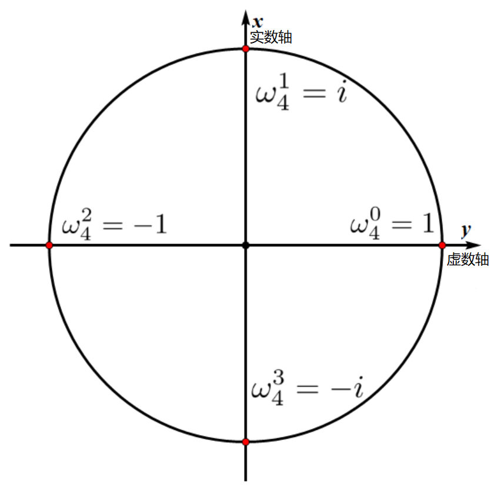

author: AndrewWayne, GavinZhengOI, ChungZH, henryrabbit, Xeonacid, sshwy, Yukimaikoriya, PeterlitsZo

前置知识：[复数](../complex.md)。

本文将介绍一种算法，它支持在 $O(n\log n)$ 的时间内计算两个 $n$ 度的多项式的乘法，比朴素的 $O(n^2)$ 算法更高效。由于两个整数的乘法也可以被当作多项式乘法，因此这个算法也可以用来加速大整数的乘法计算。

## 引入

我们现在引入两个多项式 $A$ 和 $B$：

$$
\begin{aligned}
A ={}& 5x^2 + 3x + 7 \\
B ={}& 7x^2 + 2x + 1 \\
\end{aligned}
$$

两个多项式相乘的积 $C = A \times B$，我们可以在 $O(n^2)$ 的时间复杂度中解得（这里 $n$ 为 $A$ 或者 $B$ 多项式的度，这里它们的最高项的次数都为 $3$，那么 $n = 3$）：

$$
\begin{aligned}
C ={}& A \times B \\
  ={}& (5x^2 + 3x + 7)(7x^2 + 2x + 1) \\
  ={}& 35x^4 + (10 + 21)x^3 + (5 + 6 + 49)x^2 + (3 + 14)x + 7 \\
  ={}& 35x^4 + 31x^3 + 60x^2 + 17x + 7
\end{aligned}
$$

很明显，$C$ 多项式的每一个项 $c_i x^i$ 的系数满足 $c_i = \sum_{j = 0}^i a_j b_{i - j}$。而对于这种朴素算法而言，计算每一个项的时间复杂度都为 $O(n)$，一共约有 $2n$ 项，那么时间复杂度约为 $O(n^2)$。

真不错，但是我们能否加速使得它的时间复杂度降低到 $O(n \log n)$ 呢？

## 概述

离散傅里叶变换（Discrete Fourier Transform，缩写为 DFT），是傅里叶变换在时域和频域上都呈离散的形式，将信号的时域采样变换为其 DTFT 的频域采样。

FFT 是一种高效实现 DFT 的算法，称为快速傅立叶变换（Fast Fourier Transform，FFT）。它对傅里叶变换的理论并没有新的发现，但是对于在计算机系统或者说数字系统中应用离散傅立叶变换，可以说是进了一大步。快速数论变换 (NTT) 是快速傅里叶变换（FFT）在数论基础上的实现。

在 1965 年，Cooley 和 Tukey 发表了快速傅里叶变换算法。事实上 FFT 早在这之前就被发现过了，但是在当时现代计算机并未问世，人们没有意识到 FFT 的重要性。一些调查者认为 FFT 是由 Runge 和 König 在 1924 年发现的。但事实上高斯早在 1805 年就发明了这个算法，但一直没有发表。

## 多项式的表示

为了快速解得多项式的积，我们需要借助多项式的点值表示法。一般而言，多项式都是使用系数表示法来进行求值的，但是点值表示法对于多项式相乘有着特殊的意义。这里先介绍它的这两种表示方法。

### 系数表示法

系数表示法就是用一个多项式的各个项系数来表达这个多项式，即使用一个系数序列来表示多项式：

$$
f(x) = a_0+a_1x+a_2x^2+\cdots +a_{n}x^{n} \Leftrightarrow f(x) = \{a_0, a_1, \cdots,a_{n}\}
$$

### 点值表示法

点值表示法是把这个多项式看成一个函数，从上面选取 $n+1$ 个点，从而利用这 $n+1$ 个点来唯一地表示这个函数。

???+note "为什么用 $n+1$ 个点就能唯一地表示这个函数"
    想一下高斯消元法，两点确定一条直线。再来一个点，能确定这个直线中的另一个参数，那么也就是说 $n+1$ 个点能确定 $n$ 个参数（不考虑倍数点之类的没用点）。

设

$$
\begin{array}{c}
f(x_0) = y_0 = a_0 + a_1x_0+a_2x_0^2+a_3x_0^3+ \cdots + a_nx_0^n\\
f(x_1) = y_1 = a_0 + a_1x_1+a_2x_1^2+a_3x_1^3+ \cdots + a_nx_1^n\\
f(x_2) = y_2 = a_0 + a_1x_2+a_2x_2^2+a_3x_2^3+ \cdots + a_nx_2^n\\
\vdots\\
f(x_{n}) = y_{n} = a_0 + a_1x_{n}+a_2x_{n}^2+a_3x_{n}^3+ \cdots + a_nx_{n}^n
\end{array}
$$

那么用点值表示法表示 $f(x)$ 如下

$$
\begin{aligned}
                &{} f(x) = a_0+a_1x+a_2x^2+\cdots +a_{n}x^{n} \\ 
\iff &{} f(x) = \{(x_0,y_0),(x_1,y_1), \cdots,(x_n,y_{n})\}
\end{aligned}
$$

看得出来，我们在里面带入不同的、共 $n + 1$ 或以上的值，就能表示度为 $n$ 的多项式。

真不错，但是我们为什么需要搞出来这个点值表示法呢？因为如果我们使用点值表示法来表示多项式的话，多项式相乘就能够在 $O(n)$ 能完成。

比如说，对于取值 $x = x_0$ 而言，我们能立马知道多项式 $A$ 和 $B$ 对应的 $y$ 坐标（谢天谢地，我们可以假设点值表示法给出了 $A = \{\ldots, (x_0, A(x_0)), \ldots\}$ 和 $B =\{\ldots, (x_0, B(x_0)),\ldots\}$，这样我们可以断言，如果 $x = x_0$，那么我们可以在 $O(1)$ $A$ 多项式和 $B$ 多项式对应的 $y$ 分别是 $A(x_0)$ 和 $B(x_0)$。而现在我们需要求 $C(x_0) = (A\times B)(x_0)$，它自然满足 $C(x_0) = A(x_0)\times B(x_0)$。

太好了，我们知道了如果我们对 $A$ 转换为 $2n + 1$ 个点，把 $B$ 转换为 $2n + 1$ 个点，我们就能在 $O(n)$ 的时间复杂度内求出它们的乘积 $C$ 的点值表示法来表示的多项式。

那么此时我们需要解决的问题就转换成了如何将一个 **系数表示法转换为点值表示法**，和如何再将一个 **点值表示法转换为系数表示法**。注意，这些过程还需要复杂度小于或等于 $O(n \log n)$。

通俗地说，多项式由系数表示法转为点值表示法的过程，就是 DFT 的过程。相对地，把一个多项式的点值表示法转化为系数表示法的过程，就是 IDFT。而 FFT 就是通过取某些特殊的 $x$ 的点值来加速 DFT 和 IDFT 的过程。那么我们要找什么点呢？我们或许需要将目光投向复平面了（为什么）。

## 单位复根的引入

我们不妨引入一个度为 $2$ 的简单多项式：

$$
f(x) = x^2
$$

我们看起来需要 $n + 1 = 3$ 个点才能唯一确定一个点，所以我们转换的点值表示法必须包含大于等于 $3$ 个点。我们如果想偷懒的话，那么我们可以利用它的偶函数的性质，即 $f(x) = f(-x)$。那么如果有 $(1, 1)$ 的话，那么我们就知道有 $(-1, 1)$，对于任意的 $x_0$ 都是成立的，如 $(114, 12996)$，那么我们就能得到 $(-114, 12996)$。

太好了，但是值得遗憾的是，并不是所有的函数都是偶函数。在多项式中，我们知道形如 $a_0 + a_2 x^2 + a_4 x^4 + \ldots$ 的多项式也一定是一个偶函数。所以我们……能把任意一个多项式转换为两个比较容易解的的 **偶函数** 吗？可以的！对于多项式 $A = \sum_{i = 0}^{n} a_i x^i$，我们有（为了避免复杂的情况，我们不妨先假设 $n$ 是一个奇数），我们可以引入两个中间多项式 $G$ 和 $H$：

$$
\begin{aligned}
A(x) ={}& (a_0 + a_2 x^2 + \ldots + a_{n-1} x^{n-1}) + (a_1 x + a_3 x^3 + \ldots a_n x^n) \\
     ={}& G(x^2) + x H(x^2)
\end{aligned}
$$

太好了，$G(x^2) = (a_0 + a_2 x^2 + \ldots + a_{n-1} x^{n-1})$ 是一个偶函数，而 $H(x^2) = (a_1 + a_3 x^2 + \ldots a_n x^{n-1})$ 也是一个偶函数。所以我们只用求一半的数就可以了，剩下的一半我们能用偶函数的性质给出：如果 $A(x) = G(x^2) + xH(x^2)$，那么 $A(-x) = G((-x)^2) + (-x) H((-x)^2) = G(x^2) - xH(x^2)$。

这样，如果我们能在 $O(n \log n)$ 的时间复杂度内求取 $G$ 和 $H$ 多项式的点值表示法，那么我们就能通过遍历一边求出 $A$ 多项式的点值表示法了。好耶，我们将一个大问题转换为两个规格相同，且相似的子问题了！

可是……如何在给定的时间范围内求取 $G$ 多项式和同理的 $H$ 多项式的点值表示法呢？

举例来说，如果我们需要得到 $A(1)$ 和 $A(-1)$ 的值，那么我们只需要知道 $G(1)$ 和 $H(1)$ 即可！不错的进展，但是我们可能不止需要 $2$ 个点，我们或许需要更多的点！用相同的方法递归下去，我们可以使用相同的方法，求取 $G$ 多项式和 $H$ 多项式自己的子问题，简单地得到 $G(-1)$ 和 $H(-1)$，但是这个有什么用呢？难不成 $x^2 = -1$ 不成……等等！$i$。在继续介绍下去之前，我们不妨先讨论一下单位复根。

在引入这个单位复根的之前，我们先复习一下：

DFT 是把多项式从系数表示转到了点值表示，那么我们把点值相乘之后，再还原成系数表示，就解决了我们的问题。上述过程如下：

假设我们 DFT 过程对于两个多项式选取的 $x$ 序列相同，那么可以得到

$$
\begin{aligned}
f(x)&=\{(x_0, f(x_0)), (x_1, f(x_1)), \cdots, (x_n, f(x_n))\} \\
g(x)&=\{(x_0, g(x_0)), (x_1, g(x_1)), \cdots, (x_n, g(x_n))\}
\end{aligned}
$$

如果我们设 $F(x) = f(x) \cdot g(x)$，那么容易得到 $F(x)$ 的点值表达式：

$$
F(x) = \{(x_0, f(x_0)g(x_0)), (x_1, f(x_1)g(x_1)), \cdots, (x_n, f(x_n)g(x_n))\}
$$

之后再使用 IDFT 来求取它的系数表示法。

## 单位复根

回到上一章节中。有时候为了算出 $\pm 1$ 对应的值，因为偶函数的性质，那么我们只需要求出子问题中 $(\pm 1)^2 = 1$ 对应的值。反过来想想：

- 如果我们知道了子问题的 $1$ 对应的值，那么我们可以得到问题中 $\sqrt 1 = \pm 1$ 对应的值。
- 如果我们知道了子子问题 $1$ 对应的值，那么我们的子问题就能很容易算出来 $1$ 和 $-1$ 的值，然后问题中很容易就能求出来 $1, i, -1, -i$ 的值。

这些都是 $1$ 的开方的开方的开方……这么一直开方下去得到的值，我们称为单位复根，如果我们用 $\omega$ 来表示它，那么它满足 $\exists k, \omega^k = 1$。

回到问题中，我们至少需要 $n+1$ 个这种单位复根。我们发现这些复数不管怎么乘长度都是 $1$。而对于我们需要的 $\omega^k=1$ 中的 $\omega$，容易想到 $1$，$-1$，$i$ 和 $-i$ 是符合的。除此以外这些点也都满足（不太理解？看看：[复数](../complex.md)）：


观察上图，容易发现这是一个单位圆（圆心为原点，半径为 $1$），单位圆上的向量模长均为 $1$，根据复数的运算法则，两个复数相乘，在复平面上表示为两个向量模长相乘，辐角相加。因此两个模长为 $1$ 的向量相乘，得到的仍是模长为 $1$ 的向量，辐角为两个向量辐角的和。因此我们可以将 $\omega^k=1$ 中的 $\omega$ 理解为复平面上的一个 **单位向量**，而它的辐角的 $k$ 倍恰好等于 $360^\circ$——即把圆周 $k$ 等分的角。我们把符合以上条件的复数（复平面上的向量）称为复根，用 $\omega$ 表示。

### 定义

严谨地，我们称 $x^n=1$ 在复数意义下的解是 $n$ 次复根。显然，这样的解有 $n$ 个，设 $\omega_n=e^{\frac{2\pi i}{n}}$（即幅角为 $2\pi \over n$ 的单位复数），则 $x^n=1$ 的解集表示为 $\{\omega_n^k\mid k=0,1\cdots,n-1\}$。我们称 $\omega_n$ 是 $n$ 次单位复根（the $n$-th root of unity）。根据复平面的知识，$n$ 次单位复根是复平面把单位圆 $n$ 等分的第一个角所对应的向量。其它复根均可以用单位复根的幂表示。

另一方面，根据欧拉公式，还可以得到 $\omega_n=e^{\frac{2\pi i}{n}}=\cos\left(\dfrac{2\pi}{n}\right)+i\cdot \sin\left(\dfrac{2\pi}{n}\right)$。

举个例子，当 $n=4$ 时，$\omega_n=i$，即 $i$ 就是 $4$ 次单位复根：



当 $n = 4$ 的时候，相当于把单位圆等分 $n=4$ 份。将每一份按照极角编号，那么我们只要知道 $\omega_4^1$（因为它的角度是相当于单位角度），就能知道 $\omega_4^0, \omega_4^1, \omega_4^2, \omega_4^3$。

$\omega_4^0$ 恒等于 $1$，$\omega_4^2$ 的角度是 $\omega_4^1$ 的两倍，所以 $\omega_4^2 = (\omega_4^1)^2 = i^2=-1$，依次以此类推。

### 性质

单位复根有三个重要的性质。对于任意正整数 $n$ 和整数 $k$：

$$
\begin{aligned}
\omega_n^n&=1\\
\omega_n^k&=\omega_{2n}^{2k}\\
\omega_{2n}^{k+n}&=-\omega_{2n}^k\\
\end{aligned}
$$

推导留给读者自证。因为单位复根的优良性质，所以点值表示法中我们选取的点恰为单位复根 $\omega^k_n$。

## 快速傅里叶变换

FFT 算法的基本思想是分治。就 DFT 来说，它分治地来求当 $x=\omega_n^k$ 的时候 $f(x)$ 的值。它的分治思想体现在将多项式分为奇次项和偶次项处理。

举个例子，对于一共 $8$ 项的多项式

$$
f(x) = a_0 + a_1x + a_2x^2+a_3x^3+a_4x^4+a_5x^5+a_6x^6+a_7x^7
$$

按照次数的奇偶来分成两组，然后右边提出来一个 $x$

$$
\begin{aligned}
f(x) &= (a_0+a_2x^2+a_4x^4+a_6x^6) + (a_1x+a_3x^3+a_5x^5+a_7x^7)\\
     &= (a_0+a_2x^2+a_4x^4+a_6x^6) + x(a_1+a_3x^2+a_5x^4+a_7x^6)
\end{aligned}
$$

分别用奇偶次次项数建立新的函数

$$
\begin{aligned}
G(x) &= a_0+a_2x+a_4x^2+a_6x^3\\
H(x) &= a_1+a_3x+a_5x^2+a_7x^3
\end{aligned}
$$

那么原来的 $f(x)$ 用新函数表示为

$$
f(x)=G\left(x^2\right) + x  \times  H\left(x^2\right)
$$

利用单位复根的性质，和 $G\left(x^2\right)$ 和 $H\left(x^2\right)$ 是偶函数，我们知道在复平面上 $\omega^i_n$ 和 $\omega^{i+n/2}_n$ 的 $G(x^2)$ 的 $H(x^2)$ 对应的值相同（因为 $\omega^i_n = -\omega^{i + n/2}_n$）。得到

$$
\begin{aligned}
f(\omega_n^k) &= G((\omega_n^k)^2) + \omega_n^k  \times H((\omega_n^k)^2) \\
              &= G(\omega_n^{2k}) + \omega_n^k  \times H(\omega_n^{2k}) \\
              &= G(\omega_{n/2}^k) + \omega_n^k  \times H(\omega_{n/2}^k)
\end{aligned}
$$

和

$$
\begin{aligned}
f(\omega_n^{k+n/2}) &= G(\omega_n^{2k+n}) + \omega_n^{k+n/2}  \times H(\omega_n^{2k+n}) \\
                    &= G(\omega_n^{2k}) - \omega_n^k  \times H(\omega_n^{2k}) \\
                    &= G(\omega_{n/2}^k) - \omega_n^k  \times H(\omega_{n/2}^k)
\end{aligned}
$$

因此我们求出了 $G(\omega_{n/2}^k)$ 和 $H(\omega_{n/2}^k)$ 后，就可以同时求出 $f(\omega_n^k)$ 和 $f(\omega_n^{k+n/2})$。于是对 $G$ 和 $H$ 分别递归 DFT 即可。

考虑到分治 DFT 能处理的多项式长度只能是 $2^m(m \in N^ \ast )$，否则在分治的时候左右不一样长，右边就取不到系数了。所以要在第一次 DFT 之前就把序列向上补成长度为 $2^m(m \in N^\ast )$（高次系数补 $0$）、最高项次数为 $2^m-1$ 的多项式。

在代入值的时候，因为要代入 $n$ 个不同值，所以我们代入 $\omega_n^0,\omega_n^1,\omega_n^2,\cdots, \omega_n^{n-1} (n=2^m(m \in N^ \ast ))$ 一共 $2^m$ 个不同值。

代码实现方面，STL 提供了复数的模板，当然也可以手动实现。两者区别在于，使用 STL 的 `complex` 可以调用 `exp` 函数求出 $\omega_n$。但事实上使用欧拉公式得到的虚数来求 $\omega_n$ 也是等价的。

以上就是 FFT 算法中 DFT 的介绍，它将一个多项式从系数表示法变成了点值表示法。

值的注意的是，因为是单位复根，所以说我们需要令 $n$ 项式的高位补为零，使得 $n = 2 ^ k, k \in \mathbf{Z}$。

???+ note "递归版 FFT"
    ```cpp
    #include <cmath>
    #include <complex>
    
    typedef std::complex<double> Comp;  // STL complex
    
    const Comp I(0, 1);  // i
    const int MAX_N = 1 << 20;
    
    Comp tmp[MAX_N];
    ```
    
    //rev=1,DFT; rev=-1,IDFT
    void DFT(Comp*f, int n, int rev) {if (n == 1) return;
      for (int i = 0; i &lt; n; ++i) tmp[i]= f[i];
    //偶数放左边，奇数放右边
      for (int i = 0; i &lt; n; ++i) {
        if (i & 1)
          f[n/2 + i/2]= tmp[i];
        else
          f[i/2]= tmp[i];
      }
      Comp*g = f,*h = f + n/2;
    //递归 DFT
      DFT(g, n/2, rev), DFT(h, n/2, rev);
    //cur 是当前单位复根，对于 k = 0 而言，它对应的单位复根 omega^0_n = 1。
    //step 是两个单位复根的差，即满足 omega^k_n = step*omega^{k-1}*n，
    //定义等价于 exp(I*(2*M_PI/n*rev))
      Comp cur(1, 0), step(cos(2*M_PI/n), sin(2*M_PI*rev/n));
      for (int k = 0; k &lt; n/2; ++k) {
    //F(omega^k_n) = G(omega^k*{n/2}) + omega^k*n\*H(omega^k*{n/2})
        tmp[k]= g[k]+ cur*h[k];
    //F(omega^{k+n/2}*n) = G(omega^k*{n/2}) - omega^k_n*H(omega^k\_{n/2})
        tmp[k + n/2]= g[k]- cur*h[k];
        cur*= step;
      }
      for (int i = 0; i &lt; n; ++i) f[i]= tmp[i];
    }
    
    ```
    
    ```

时间复杂度 $O(n\log n)$。

### 位逆序置换

这个算法还可以从“分治”的角度继续优化。我们每一次都会把整个多项式的奇数次项和偶数次项系数分开，一直分到只剩下一个系数。但是，这个递归的过程需要更多的内存。因此，我们可以先“模仿递归”把这些系数在原数组中“拆分”，然后再“倍增”地去合并这些算出来的值。

以 $8$ 项多项式为例，模拟拆分的过程：

- 初始序列为 $\{x_0, x_1, x_2, x_3, x_4, x_5, x_6, x_7\}$
- 一次二分之后 $\{x_0, x_2, x_4, x_6\},\{x_1, x_3, x_5, x_7 \}$
- 两次二分之后 $\{x_0,x_4\} \{x_2, x_6\},\{x_1, x_5\},\{x_3, x_7 \}$
- 三次二分之后 $\{x_0\}\{x_4\}\{x_2\}\{x_6\}\{x_1\}\{x_5\}\{x_3\}\{x_7 \}$

规律：其实就是原来的那个序列，每个数用二进制表示，然后把二进制翻转对称一下，就是最终那个位置的下标。比如 $x_1$ 是 001，翻转是 100，也就是 4，而且最后那个位置确实是 4。我们称这个变换为位逆序置换（bit-reversal permutation，国内也称蝴蝶变换），证明留给读者自证。

根据它的定义，我们可以在 $O(n\log n)$ 的时间内求出每个数变换后的结果：

???+ note "位逆序变换实现（$O(n\log n)$）"
    ```cpp
    /*
     * 进行 FFT 和 IFFT 前的反置变换
     * 位置 i 和 i 的二进制反转后的位置互换
     * len 必须为 2 的幂
     */
    void change(Complex y[], int len) {
      // 一开始 i 是 0...01，而 j 是 10...0，在二进制下相反对称。
      // 之后 i 逐渐加一，而 j 依然维持着和 i 相反对称，一直到 i = 1...11。
      for (int i = 1, j = len / 2, k; i < len - 1; i++) {
        // 交换互为小标反转的元素，i < j 保证交换一次
        if (i < j) swap(y[i], y[j]);
        // i 做正常的 + 1，j 做反转类型的 + 1，始终保持 i 和 j 是反转的。
        // 这里 k 代表了 0 出现的最高位。j 先减去高位的全为 1 的数字，知道遇到了
        // 0，之后再加上即可。
        k = len / 2;
        while (j >= k) {
          j = j - k;
          k = k / 2;
        }
        if (j < k) j += k;
      }
    }
    ```

实际上，位逆序变换可以 $O(n)$ 从小到大递推实现，设 $len=2^k$，其中 $k$ 表示二进制数的长度，设 $R(x)$ 表示长度为 $k$ 的二进制数 $x$ 翻转后的数（高位补 $0$）。我们要求的是 $R(0),R(1),\cdots,R(n-1)$。

首先 $R(0)=0$。

我们从小到大求 $R(x)$。因此在求 $R(x)$ 时，$R\left(\left\lfloor \dfrac{x}{2} \right\rfloor\right)$ 的值是已知的。因此我们把 $x$ 右移一位（除以 $2$），然后取反，再右移一位，就得到了 $x$  **除了（二进制）个位** 之外其它位的翻转结果。

考虑个位的翻转结果：如果个位是 $0$，翻转之后最高位就是 $0$。如果个位是 $1$，则翻转后最高位是 $1$，因此还要加上 $\dfrac{len}{2}=2^{k-1}$。综上

$$
R(x)=\left\lfloor \frac{R\left(\left\lfloor \frac{x}{2} \right\rfloor\right)}{2} \right\rfloor + (x\bmod 2)\times \frac{len}{2}
$$

举个例子：设 $k=5$，$len=(100000)_2$。为了翻转 $(11001)_2$：

1. 考虑 $(1100)_2$，我们知道 $R((1100)_2)=R((01100)_2)=(00110)_2$，再右移一位就得到了 $(00011)_2$。
2. 考虑个位，如果是 $1$，它就要翻转到数的最高位，即翻转数加上 $(10000)_2=2^{k-1}$，如果是 $0$ 则不用更改。

???+ note "位逆序变换实现（$O(n)$）"
    ```cpp
    // 同样需要保证 len 是 2 的幂
    // 记 rev[i] 为 i 翻转后的值
    void change(Complex y[], int len) {
      for (int i = 0; i < len; ++i) {
        rev[i] = rev[i >> 1] >> 1;
        if (i & 1) {  // 如果最后一位是 1，则翻转成 len/2
          rev[i] |= len >> 1;
        }
      }
      for (int i = 0; i < len; ++i) {
        if (i < rev[i]) {  // 保证每对数只翻转一次
          swap(y[i], y[rev[i]]);
        }
      }
      return;
    }
    ```

## 快速傅里叶逆变换

傅里叶逆变换可以用傅里叶变换表示。对此我们有两种理解方式。

### 线性代数角度

IDFT（傅里叶反变换）的作用，是把目标多项式的点值形式转换成系数形式。而 DFT 本身是个线性变换，可以理解为将目标多项式当作向量，左乘一个矩阵得到变换后的向量，以模拟把单位复根代入多项式的过程：

$$
\begin{bmatrix}y_0 \\ y_1 \\ y_2 \\ y_3 \\ \vdots \\ y_{n-1} \end{bmatrix}
=
\begin{bmatrix}1 & 1 & 1 & 1 & \cdots & 1 \\
1 & \omega_n^1 & \omega_n^2 & \omega_n^3 & \cdots & \omega_n^{n-1} \\
1 & \omega_n^2 & \omega_n^4 & \omega_n^6 & \cdots & \omega_n^{2(n-1)} \\
1 & \omega_n^3 & \omega_n^6 & \omega_n^9 & \cdots & \omega_n^{3(n-1)} \\
\vdots & \vdots & \vdots & \vdots & \ddots & \vdots \\
1 & \omega_n^{n-1} & \omega_n^{2(n-1)} & \omega_n^{3(n-1)} & \cdots & \omega_n^{(n-1)^2} \end{bmatrix}
\begin{bmatrix} a_0 \\ a_1 \\ a_2 \\ a_3 \\ \vdots \\ a_{n-1} \end{bmatrix}
$$

现在我们已经得到最左边的结果了，中间的 $x$ 值在目标多项式的点值表示中也是一一对应的，所以，根据矩阵的基础知识，我们只要在式子两边左乘中间那个大矩阵的逆矩阵就行了。由于这个矩阵的元素非常特殊，它的逆矩阵也有特殊的性质，就是每一项 **取倒数**，再 **除以多项式的长度 $n$**，就能得到它的逆矩阵。

为了使计算的结果为原来的倒数，根据单位复根的性质并结合欧拉公式，可以得到

$$
\frac{1}{\omega_k}=\omega_k^{-1}=e^{-\frac{2\pi i}{k}}=\cos\left(\frac{2\pi}{k}\right)+i\cdot \sin\left(-\frac{2\pi}{k}\right)
$$

因此我们可以尝试着把单位根 $\omega_k$ 取成 $e^{-\frac{2\pi i}{k}}$，这样我们的计算结果就会变成原来的倒数，之后唯一多的操作就只有再 **除以它的长度 $n$**，而其它的操作过程与 DFT 是完全相同的。我们可以定义一个函数，在里面加一个参数 $1$ 或者是 $-1$，然后把它乘到 $\pi$ 上。传入 $1$ 就是 DFT，传入 $-1$ 就是 IDFT。

### 单位复根周期性

利用单位复根的周期性同样可以理解 IDFT 与 DFT 之间的关系。

考虑原本的多项式是 $f(x)=a_0+a_1x+a_2x^2+\cdots+a_{n-1}x^{n-1}=\sum_{i=0}^{n-1}a_ix^i$。而 IDFT 就是把你的点值表示还原为系数表示。

考虑 **构造法**。我们已知 $y_i=f\left( \omega_n^i \right),i\in\{0,1,\cdots,n-1\}$，求 $\{a_0,a_1,\cdots,a_{n-1}\}$。构造多项式如下

$$
A(x)=\sum_{i=0}^{n-1}y_ix^i
$$

相当于把 $\{y_0,y_1,y_2,\cdots,y_{n-1}\}$ 当做多项式 $A$ 的系数表示法。

这时我们有两种推导方式，这对应了两种实现方法。

#### 方法一

设 $b_i=\omega_n^{-i}$，则多项式 $A$ 在 $x=b_0,b_1,\cdots,b_{n-1}$ 处的点值表示法为 $\left\{ A(b_0),A(b_1),\cdots,A(b_{n-1}) \right\}$。

对 $A(x)$ 的定义式做一下变换，可以将 $A(b_k)$ 表示为

$$
\begin{aligned}
A(b_k)&=\sum_{i=0}^{n-1}f(\omega_n^i)\omega_n^{-ik}=\sum_{i=0}^{n-1}\omega_n^{-ik}\sum_{j=0}^{n-1}a_j(\omega_n^i)^{j}\\
&=\sum_{i=0}^{n-1}\sum_{j=0}^{n-1}a_j\omega_n^{i(j-k)}=\sum_{j=0}^{n-1}a_j\sum_{i=0}^{n-1}\left(\omega_n^{j-k}\right)^i\\
\end{aligned}
$$

记 $S\left(\omega_n^a\right)=\sum_{i=0}^{n-1}\left(\omega_n^a\right)^i$。

当 $a=0 \pmod{n}$ 时，$S\left(\omega_n^a\right)=n$。

当 $a\neq 0 \pmod{n}$ 时，我们错位相减

$$
\begin{aligned}
S\left(\omega_n^a\right)&=\sum_{i=0}^{n-1}\left(\omega_n^a\right)^i\\
\omega_n^a S\left(\omega_n^a\right)&=\sum_{i=1}^{n}\left(\omega_n^a\right)^i\\
S\left(\omega_n^a\right)&=\frac{\left(\omega_n^a\right)^n-\left(\omega_n^a\right)^0}{\omega_n^a-1}=0\\
\end{aligned}
$$

也就是说

$$
S\left(\omega_n^a\right)=
\left\{\begin{aligned}
n,a=0\\
0,a\neq 0
\end{aligned}\right.
$$

那么代回原式

$$
A(b_k)=\sum_{j=0}^{n-1}a_jS\left(\omega_n^{j-k}\right)=a_k\cdot n
$$

也就是说给定点 $b_i=\omega_n^{-i}$，则 $A$ 的点值表示法为

$$
\begin{aligned}
&\left\{ (b_0,A(b_0)),(b_1,A(b_1)),\cdots,(b_{n-1},A(b_{n-1})) \right\}\\
=&\left\{ (b_0,a_0\cdot n),(b_1,a_1\cdot n),\cdots,(b_{n-1},a_{n-1}\cdot n) \right\}
\end{aligned}
$$

综上所述，我们取单位根为其倒数，对 $\{y_0,y_1,y_2,\cdots,y_{n-1}\}$ 跑一遍 FFT，然后除以 $n$ 即可得到 $f(x)$ 的系数表示。

#### 方法二

我们直接将 $\omega_n^i$ 代入 $A(x)$。

推导的过程与方法一大同小异，最终我们得到 $A(\omega_n^k) = \sum_{j=0}^{n-1}a_jS\left(\omega_n^{j+k}\right)$。

当且仅当 $j+k=0 \pmod{n}$ 时有 $S\left(\omega_n^{j+k}\right) = n$，否则为 $0$。因此 $A(\omega_n^k) = a_{n-k}\cdot n$。

这意味着我们将 $\{y_0,y_1,y_2,\cdots,y_{n-1}\}$ 做 DFT 变换后，反转再除以 $n$，同样可以还原 $f(x)$ 的系数表示。

### 代码实现

所以我们 FFT 函数可以集 DFT 和 IDFT 于一身。代码实现如下：

???+ note "非递归版 FFT（对应方法一）"
    ```cpp
    /*
     * 做 FFT
     * len 必须是 2^k 形式
     * on == 1 时是 DFT，on == -1 时是 IDFT
     */
    void fft(Complex y[], int len, int on) {
      // 位逆序置换
      change(y, len);
      // 模拟合并过程，一开始，从长度为一合并到长度为二，一直合并到长度为 len。
      for (int h = 2; h <= len; h <<= 1) {
        // wn：当前单位复根的间隔：w^1_h
        Complex wn(cos(2 * PI / h), sin(on * 2 * PI / h));
        // 合并，共 len / h 次。
        for (int j = 0; j < len; j += h) {
          // 计算当前单位复根，一开始是 1 = w^0_n，之后是以 wn 为间隔递增： w^1_n
          // ...
          Complex w(1, 0);
          for (int k = j; k < j + h / 2; k++) {
            // 左侧部分和右侧是子问题的解
            Complex u = y[k];
            Complex t = w * y[k + h / 2];
            // 这就是把两部分分治的结果加起来
            y[k] = u + t;
            y[k + h / 2] = u - t;
            // 后半个 “step” 中的ω一定和 “前半个” 中的成相反数
            // “红圈”上的点转一整圈“转回来”，转半圈正好转成相反数
            // 一个数相反数的平方与这个数自身的平方相等
            w = w * wn;
          }
        }
      }
      // 如果是 IDFT，它的逆矩阵的每一个元素不只是原元素取倒数，还要除以长度 len。
      if (on == -1) {
        for (int i = 0; i < len; i++) {
          y[i].x /= len;
        }
      }
    }
    ```

???+ note "非递归版 FFT（对应方法二）"
    ```cpp
    /*
     * 做 FFT
     * len 必须是 2^k 形式
     * on == 1 时是 DFT，on == -1 时是 IDFT
     */
    void fft(Complex y[], int len, int on) {
      change(y, len);
      for (int h = 2; h <= len; h <<= 1) {             // 模拟合并过程
        Complex wn(cos(2 * PI / h), sin(2 * PI / h));  // 计算当前单位复根
        for (int j = 0; j < len; j += h) {
          Complex w(1, 0);  // 计算当前单位复根
          for (int k = j; k < j + h / 2; k++) {
            Complex u = y[k];
            Complex t = w * y[k + h / 2];
            y[k] = u + t;  // 这就是把两部分分治的结果加起来
            y[k + h / 2] = u - t;
            // 后半个 “step” 中的ω一定和 “前半个” 中的成相反数
            // “红圈”上的点转一整圈“转回来”，转半圈正好转成相反数
            // 一个数相反数的平方与这个数自身的平方相等
            w = w * wn;
          }
        }
      }
      if (on == -1) {
        reverse(y, y + len);
        for (int i = 0; i < len; i++) {
          y[i].x /= len;
        }
      }
    }
    ```

??? "FFT 模板（ [HDU 1402 -	A * B Problem Plus](http://acm.hdu.edu.cn/showproblem.php?pid=1402) ）"
    ```cpp
    #include <cmath>
    #include <cstdio>
    #include <cstring>
    #include <iostream>
    
    const double PI = acos(-1.0);
    struct Complex {
      double x, y;
      Complex(double _x = 0.0, double _y = 0.0) {
        x = _x;
        y = _y;
      }
      Complex operator-(const Complex &b) const {
        return Complex(x - b.x, y - b.y);
      }
      Complex operator+(const Complex &b) const {
        return Complex(x + b.x, y + b.y);
      }
      Complex operator*(const Complex &b) const {
        return Complex(x * b.x - y * b.y, x * b.y + y * b.x);
      }
    };
    /*
     * 进行 FFT 和 IFFT 前的反置变换
     * 位置 i 和 i 的二进制反转后的位置互换
     *len 必须为 2 的幂
     */
    void change(Complex y[], int len) {
      int i, j, k;
      for (int i = 1, j = len / 2; i < len - 1; i++) {
        if (i < j) swap(y[i], y[j]);
        // 交换互为小标反转的元素，i<j 保证交换一次
        // i 做正常的 + 1，j 做反转类型的 + 1，始终保持 i 和 j 是反转的
        k = len / 2;
        while (j >= k) {
          j = j - k;
          k = k / 2;
        }
        if (j < k) j += k;
      }
    }
    /*
     * 做 FFT
     *len 必须是 2^k 形式
     *on == 1 时是 DFT，on == -1 时是 IDFT
     */
    void fft(Complex y[], int len, int on) {
      change(y, len);
      for (int h = 2; h <= len; h <<= 1) {
        Complex wn(cos(2 * PI / h), sin(on * 2 * PI / h));
        for (int j = 0; j < len; j += h) {
          Complex w(1, 0);
          for (int k = j; k < j + h / 2; k++) {
            Complex u = y[k];
            Complex t = w * y[k + h / 2];
            y[k] = u + t;
            y[k + h / 2] = u - t;
            w = w * wn;
          }
        }
      }
      if (on == -1) {
        for (int i = 0; i < len; i++) {
          y[i].x /= len;
        }
      }
    }
    
    const int MAXN = 200020;
    Complex x1[MAXN], x2[MAXN];
    char str1[MAXN / 2], str2[MAXN / 2];
    int sum[MAXN];
    
    int main() {
      while (scanf("%s%s", str1, str2) == 2) {
        int len1 = strlen(str1);
        int len2 = strlen(str2);
        int len = 1;
        while (len < len1 * 2 || len < len2 * 2) len <<= 1;
        for (int i = 0; i < len1; i++) x1[i] = Complex(str1[len1 - 1 - i] - '0', 0);
        for (int i = len1; i < len; i++) x1[i] = Complex(0, 0);
        for (int i = 0; i < len2; i++) x2[i] = Complex(str2[len2 - 1 - i] - '0', 0);
        for (int i = len2; i < len; i++) x2[i] = Complex(0, 0);
        fft(x1, len, 1);
        fft(x2, len, 1);
        for (int i = 0; i < len; i++) x1[i] = x1[i] * x2[i];
        fft(x1, len, -1);
        for (int i = 0; i < len; i++) sum[i] = int(x1[i].x + 0.5);
        for (int i = 0; i < len; i++) {
          sum[i + 1] += sum[i] / 10;
          sum[i] %= 10;
        }
        len = len1 + len2 - 1;
        while (sum[len] == 0 && len > 0) len--;
        for (int i = len; i >= 0; i--) printf("%c", sum[i] + '0');
        printf("\n");
      }
      return 0;
    }
    ```

## 快速数论变换

若要计算的多项式系数是别的具有特殊意义的整数，那么 FFT 全部用浮点数运算，从时间上比整数运算慢，且只能用 long double 类型。

要应用数论变化从而避开浮点运算精度问题，参见 [快速数论变换](/math/poly/ntt)。

## 参考文献

1. [桃酱的算法笔记](https://zhuanlan.zhihu.com/p/41867199).
