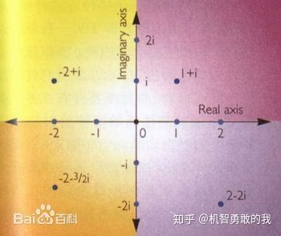
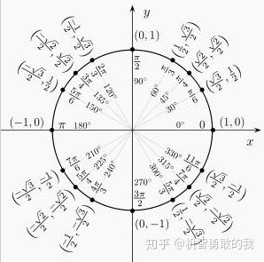
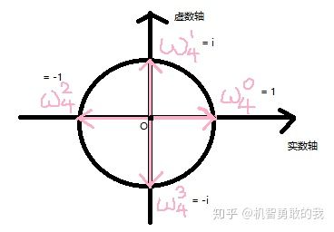

author: AndrewWayne, GavinZhengOI. ChungZH, henryrabbit, Xeonacid, sshwy, Yukimaikoriya

（本页面部分内容转载自 [桃酱的算法笔记](https://zhuanlan.zhihu.com/c_1005817911142838272) ，原文戳 [链接](https://zhuanlan.zhihu.com/p/41867199) ，已获得作者授权）

一直想学 FFT，之前牛客的多校有一道组合数学就用 FFT 写的，而且当时还傻乎乎的用唯一分解定理，但是自己好久没静下心学什么了，而且自己的数学功底又不好，导致一直学不会。看了很多人的博客也没看明白，尤其是原根。在我看了几十篇博客之后终于看懂了……所以想写一篇能够让大多数人都看得懂的教程。花费时间 3 天终于写完啦~~~~\~~

另外，本文 FFT 部分的代码实现全部参考 kuangbin 的模板（2018.7 更新）资源地址如下

 <https://download.csdn.net/download/qq_37136305/10562410> 

NTT 部分代码参考 CSDN 上的模板代码附网址，感谢博主！

你搜索这个关键词就已经知道这一是个数学的东西了。只想学会用很简单，但是这远远不够。所以在看这个博客之前应该先学一下 [复数](/math/complex) 的基本知识。

好了下面进入正文。

## DFT IDFT FFT 官方定义？

> 离散傅里叶变换（Discrete Fourier Transform，缩写为 DFT），是傅里叶变换在时域和频域上都呈离散的形式，将信号的时域采样变换为其 DTFT 的频域采样。
>
> FFT 是一种 DFT 的高效算法，称为快速傅立叶变换（Fast Fourier transform）。——百度百科

在百度百科上能找到 DFT 和 FFT 这两个定义。正如定义，FFT 和 DFT 实际上按照结果来看的话是一样的，但是 FFT 比较快的计算 DFT 和 IDFT（离散反傅里叶变换）。

快速数论变换 (NTT) 是快速傅里叶变换（FFT）在数论基础上的实现。

是不是有点迷？既然是官方定义那肯定不能让你看懂才对嘛～下面我们一一解释～

## 为什么要使用 FFT？

我们在这里引入一个例子：求多项式乘积的朴素算法。

大家平时求 $f(x)=a_1x^2+b_1x+c_1$ 与 $g(x) = a_2x^2+b_2x+c_2$ 的乘积时候，是怎么进行的呢？

我们令

$$
K(x) = f(x)  \times  g(x) = a_1x^2 \times a_2x^2+a_1x^2 \times b_2x+a_1x^2 \times c_2+b_1x \times b_2x^2+b_1x \times b_2x+b_1x \times c_2+c_1 \times a_2x^2+c_1 \times b_2x+c_1 \times c_2
$$

那么很显然我们进行了 9 次运算，复杂度是 $O(n^2)$ （具体代码实现不再展开）

但是如果数字足够大呢？比如 100000？那朴素算法可太慢啦！

## 什么是 FFT

FFT，即为快速傅氏变换，是离散傅氏变换的快速算法，它是根据离散傅氏变换的奇、偶、虚、实等特性，对离散傅立叶变换的算法进行改进获得的。它对傅氏变换的理论并没有新的发现，但是对于在计算机系统或者说数字系统中应用离散傅立叶变换，可以说是进了一大步。——360 百科

如果上一个例子用朴素算法太慢啦！所以我们要用 FFT 进行优化，复杂度会降为 $O(nlogn)$ 

### 多项式的系数表示法与点值表示法

一个多项式，我们可以怎样来表示呢？

系数表示法就是用一个多项式的各个项系数来表达这个多项式。比如：

$$
f(x) = a_1x^2+b_1x+c_1 \Leftrightarrow f(x) = \{a_1, b_1, c_1\}
$$

点值表示法是把这个多项式看成一个函数，从上面选取 $n+1$ 个点，从而利用这 $n+1$ 个点来唯一的表示这个函数。为什么用 $n+1$ 个点就能唯一的表示这个函数了呢？想一下高斯消元法，两点确定一条直线。再来一个点，能确定这个直线中的另一个参数，那么也就是说 $n+1$ 个点能确定 $n$ 个参数（不考虑倍数点之类的没用点）。如下：

$$
f_1(x) = y_1 = a_0 + a_1x_1+a_2x_1^2+a_3x_1^3+ \cdots + a_nx_1^n
$$

$$
f_2(x) = y_2 = a_0 + a_1x_2+a_2x_2^2+a_3x_2^3+ \cdots + a_nx_2^n
$$

$$
f_3(x) = y_3 = a_0 + a_1x_3+a_2x_3^2+a_3x_3^3+ \cdots + a_nx_3^n
$$

$$
f_4(x) = y_4 = a_0 + a_1x_4+a_2x_4^2+a_3x_4^3+ \cdots + a_nx_4^n
$$

$$
f_5(x) = y_5 = a_0 + a_1x_5+a_2x_5^2+a_3x_5^3+ \cdots + a_nx_5^n
$$

$$
\cdots
$$

$$
f_n(x) = y_n = a_0 + a_1x_m+a_2x_m^2+a_3x_m^3+ \cdots + a_nx_m^n
$$

一个非常通俗易懂的解释：

多项式由系数表示法转为点值表示法的过程，就成为 DFT；

相对地，把一个多项式的点值表示法转化为系数表示法的过程，就是 IDFT。

而 FFT 就是通过取某些特殊的 $x$ 的点值来加速 DFT 和 FFT 的过程。

### 复数的引入

复数分为实数和虚数。实数就是我们日常最常用的有理数和无理数。大家记得我们在开始学平方的时候，老师会说所有数的平方大于等于 $0$ 对不对，那么虚数就引入了。虚数一般用 $i$ 表示，对于虚数 $i$ ，有 $i=\sqrt{-1}$ 

。另外， $i$ 对于虚数的意义，与 $1$ 对于实数的意义是一样的。如果我说得不够明确，你可以看下面我引用的百科说明。

> 在数学中，虚数就是形如 $a+b \times i$ 的数，其中 $a,b$ 是实数，且 $b \neq 0$ ， $i^2 = - 1$ 。虚数这个名词是 17 世纪著名数学家笛卡尔创立，因为当时的观念认为这是真实不存在的数字。后来发现虚数 $a+b \times i$ 的实部 $a$ 可对应平面上的横轴，虚部 $b$ 与对应平面上的纵轴，这样虚数 $a+b \times i$ 可与平面内的点 $(a,b)$ 对应。
>
> 可以将虚数 $bi$ 添加到实数 $a$ 以形成形式 $a + bi$ 的复数，其中实数 $a$ 和 $b$ 分别被称为复数的实部和虚部。一些作者使用术语纯虚数来表示所谓的虚数，虚数表示具有非零虚部的任何复数。——百度百科

我们用一幅图来表示复数与复平面的关系（图源百度百科）



其中横坐标是实数轴，纵坐标是虚数轴，这样就可以把每个虚数看为一个向量了，对应的，虚数可以用普通坐标和极坐标 $(r,\theta)$ （其中 $r$ 为虚数长度， $\theta$ 为虚数和实数轴正半轴夹角）来表示。

接下来思考两个复数相乘是什么意义：

1.   $(a+bi) \times (c+di) = (ac-bd) + (ad+bc)i$ 

2.  长度相乘，角度相加： $(r_1, \theta_1)  \times  (r_2, \theta_2) = (r_1 \times r_2, \theta_1+\theta_2)$ 

这么一看的话，我们很容易想到如果两个长度为 $1$ 的不同方向向量相乘，结果向量是不是一个长度依然为 $1$ 的新向量呢？

### 单位复根的引入

我们回到之前的问题：多项式（点值表示法）的乘积。

考虑这样一个问题：

刚刚说到了 DFT 是把多项式从系数表示转到了点值表示（复杂度为 $O(n)$ ），那么我们把点值相乘之后（选取相应位置，并且复杂度为 $O(n)$ ），如果能够快速还原成系数表示，是不是就完美解决我们的问题了呢？上述过程如下：

假设我们 DFT 过程对于两个多项式选取的 $x$ 序列相同，那么可以得到

$$
f(x)={(x_0, f(x_0), (x_1, f(x_1)), (x_2, f(x_2), \cdots, (x_n, f(x_n)))}
$$

$$
g(x)={(x_0, g(x_0), (x_1, g(x_1)), (x_2, g(x_2), \cdots, (x_n, g(x_n)))}
$$

如果我们设 $F(x) = f(x) \times g(x)$ 

那么很容易得到 $F(x)$ 的点值表达式：

$$
F(x) = {(x_0, f(x_0)  \times  g(x_0), (x_1, f(x_1)  \times  g(x_1)), (x_2, f(x_2)  \times  g(x_2), \cdots, (x_n, f(x_n)  \times  g(x_n)))}
$$

但是我们要的是系数表达式，接下来问题变成了从点值回到系数。如果我们带入到高斯消元法的方程组中去，会把复杂度变得非常高。光是计算 $x^i(0 \leq i \leq n)$ 就是 $n$ 项，这就已经 $O(n^2)$ 了，更别说还要把 $n+1$ 个方程进行消元……

这里会不会觉得我们不去计算 $x^i$ 比较好呢？ $1$ 和 $-1$ 的幂都很好算，但是也仅仅有两个不够啊，我们至少需要 $n+1$ 个 那怎么办呢！想到我们刚刚学的长度为 $1$ 的虚数了吗？不管怎么乘长度都是 $1$ ！对就是它！我们需要的是 $\omega^k=1$ 中的 $\omega$ ，很容易想到 $-i$ 和 $1$ 是符合的。那其他的呢？



现在我们看上图的圆圈。容易发现这是一个单位圆（圆心为原点，半径为 $1$ ），所有在圆上的复数的长度均为 $1$ ，也就是说它不管做多少次方 $r$ 永远为 $1$ ，结果也仅仅角度的变化而已。但是！进过旋转总会让角度 $\bmod 360 = 0$ 成立的，也就是结果为 $1$ 。我们把符合以上条件的复数成为复根，用 $\omega$ 表示。如果 $\omega^k=1$ 那么我们把 $\omega$ 称为 $1$ 的 $k$ 次复根，记作 $\omega_k^n$ （因为符合这个 $k$ 次之后等于 $1$ 的复数有很多，比如 $i$ 的 $4k$ 次幂永远为 $1$ ，所以，这个 $n$ 是一个编号，表示这是角度从小到大的第几个（从 $x$ 的正半轴开始逆时针）)

是不是有点雾啊，没事没事接下来我们举个栗子：



那么很容易发现当 $K = 4$ 的时候，相当于把单位圆等分 $K= 4$ 份。然后每一份按照极角编号。那么是不是（在 $K = 4$ 的时候）我们只要知道 $\omega_4^1$ 

（因为他的角度是相当于单位角度），就能知道 $\omega_4^0, \omega_4^1, \omega_4^2, \omega_4^3$ 了呢？当然是这样的……

 $\omega_4^0$ 恒等于 $1$ ， $\omega_4^2$ 的角度是 $\omega_4^0$ 的两倍，所以 $\omega_4^2 = (\omega_4^1)^2 = i^2=-1$ ，依次以此类推。

因此，我们只要知道 $\omega_k^1$ ，就能求出 $\omega_k^n$ 。所以我们把 $\omega_k^1$ 称为单位复根，简写为 $\omega_k$ 

## FFT 的流程

终于写到核心部分了，也就是，FFT 到底怎么来写呢？

### FFT 流程第一步之 DFT（共两步）

FFT 之所以快，是因为他采用了分治的思想。

就 DFT（将系数表达转换成点值表达）来说，它分治的来求当当前的 $x=\omega_n^k$ 

的时候整个式子的值。他的分治思想体现在将多项式分为奇次项和偶次项处理。

对于一共 $8$ 项的多项式

$$
f(x0) = y_1 = a_0 + a_1x + a_2x^2+a_3x^3+a_4x^4+a_5x^5+a_6x^6+a_7x^7
$$

按照次数的奇偶来分成两组，然后右边提出来一个 $x$ 

$$
f(x) = (a_0+a_2x^2+a_4x^4+a_6x^6) + (a_1x+a_3x^3+a_5x^5+a_7x^7)
$$

$$
f(x) = (a_0+a_2x^2+a_4x^4+a_6x^6) + x(a_1+a_3x^2+a_5x^4+a_7x^6)
$$

分别用奇偶次次项数建立新的方程

$$
G(x) = a_0+a_2x+a_4x^2+a_6x^3
$$

$$
H(x)=a_1+a_3x+a_5x^2+a_7x^3
$$

那么原来的 $f(x)$ 由新函数来表示（是不是我们二分了一个多项式呢~)

$$
F(x)=G(x^2) + x  \times  H(x^2)
$$

给函数带个帽子表示此时在进行的是 DFT 过程，把 x 代进去，即有

$$
DFT(f(\omega_n^k))=DFT(G((\omega_n^k)^2)) + \omega_n^k  \times  DFT(H((\omega_n^k)^2))
$$

！前方高能：

这个函数能处理的多项式长度只能是 $2^m(m \in N^ \times )$ ，否则在分治的时候左右不一样长，右边取不到系数了，程序没法进行。所以要在第一次 DFT 之前就把序列向上补成长度为 $2^m(m \in N^ \times )$ （高次系数补 $0$ ）、最高项次数为 $n-1$ 的多项式。一定要预处理哦

然后我在代入值的时候，因为要代入 $n$ 个不同值，所以我们就代入 $\omega_n^0,\omega_n^1,\omega_n^2,\cdots, \omega_n^{n-1} (n=2^m(m \in N^ \times ))$ 

一共 $2^m$ 个不同值。

```cpp
/*
 * 做 FFT
 *len 必须是 2^k 形式
 *on == 1 时是 DFT，on == -1 时是 IDFT
 */
void fft(Complex y[], int len, int on) {
  change(y, len);
  for (int h = 2; h <= len; h <<= 1) {
    Complex wn(cos(2 * PI / h), sin(on * 2 * PI / h));
    for (int j = 0; j < len; j += h) {
      Complex w(1, 0);
      for (int k = j; k < j + h / 2; k++) {
        Complex u = y[k];
        Complex t = w * y[k + h / 2];
        y[k] = u + t;
        y[k + h / 2] = u - t;
        w = w * wn;
      }
    }
  }
}
```

但是这个算法还需要从“分治”的角度继续优化。我们每一次都会把整个多项式的奇数次项和偶数次项系数分开，一只分到只剩下一个系数。但是，这个递归的过程需要更多的内存。因此，我们可以先“模仿递归”把这些系数在原数组中“拆分”，然后再“倍增”地去合并这些算出来的值。然而我们又要如何去拆分这些数呢？

设初始序列为 $\{x_0, x_1, x_2, x_3, x_4, x_5, x_6, x_7\}$ 

一次二分之后 $\{x_0, x_2, x_4, x_6\},\{x_1, x_3,x_5, x_7 \}$ 

两次二分之后 $\{x_0,x_4\} \{x_2, x_6\},\{x_1, x_3\},\{x_5, x_7 \}$ 

三次二分之后 $\{x_0\}\{x_4\}\{x_2\}\{x_6\}\{x_1\}\{x_5\}\{x_3\}\{x_7 \}$ 

有啥规律呢？其实就是原来的那个序列，每个数用二进制表示，然后把二进制翻转对称一下，就是最终那个位置的下标。比如 $x_1$ 是 001，翻转是 100，也就是 4，而且最后那个位置确实是 4，是不是很神奇啊\~\~~

这里附上代码

```cpp
/*
 * 进行 FFT 和 IFFT 前的反置变换
 * 位置 i 和 i 的二进制反转后的位置互换
 *len 必须为 2 的幂
 */
void change(Complex y[], int len) {
  int i, j, k;
  for (int i = 1, j = len / 2; i < len - 1; i++) {
    if (i < j) swap(y[i], y[j]);
    // 交换互为小标反转的元素，i<j 保证交换一次
    // i 做正常的 + 1，j 做反转类型的 + 1，始终保持 i 和 j 是反转的
    k = len / 2;
    while (j >= k) {
      j = j - k;
      k = k / 2;
    }
    if (j < k) j += k;
  }
}
```

### FFT 流程第二步之 IDFT（共两步）

这一步 IDFT（傅里叶反变换）的作用我说的已经很清楚啦，就是把上一步获得的目标多项式的点值形式转换成系数形式。但是似乎并不简单呢……但是，我们把单位复根代入多项式之后，就是下面这个样子（矩阵表示方程组）

$$
 \begin{bmatrix}y[0] \\ y[1] \\ y[2] \\ y[3] \\ \dots \\ y[n-1] \end{bmatrix}
\begin{matrix}= \\ = \\ = \\ = \\ \\ = \end{matrix}
\begin{bmatrix}1 & 1 & 1 & 1 & \dots & 1 \\
1 & \omega_n^1 & \omega_n^2 & \omega_n^3 & \dots & \omega_n^{n-1} \\
1 & \omega_n^2 & \omega_n^4 & \omega_n^6 & \dots & \omega_n^{2(n-1)} \\
1 & \omega_n^3 & \omega_n^6 & \omega_n^9 & \dots & \omega_n^{3(n-1)} \\
\dots & \dots & \dots & \dots & \dots & \dots \\
1 & \omega_n^{n-1} & \omega_n^{2(n-1)} & \omega_n^{3(n-1)} & \dots & \omega_n^{(n-1)^2} \end{bmatrix}
\begin{bmatrix} a[0] \\ a[1] \\ a[2] \\ a[3] \\ \dots \\ a[n-1] \end{bmatrix}
$$

而且现在我们已经得到最左边的结果了，中间的 $x$ 值在目标多项式的点值表示中也是一一对应的，所以，根据矩阵的基础知识，我们只要在式子两边左乘中间那个大矩阵的逆矩阵就行了。由于这个矩阵的元素非常特殊，他的逆矩阵也有特殊的性质，就是每一项取倒数，再除以 $n$ ，就能得到他的逆矩阵（这边根据的是单位原根的两个特殊性质推出来的，具体比较麻烦。如果想知道的话私我吧。）

如何改变我们的操作才能使计算的结果文原来的倒数呢？我们当然可以重新写一遍，但是这里有更简单的实现。这就要看我们求“单位复根的过程了”：根据“欧拉函数” $e^{i\pi}=-1$ ，我么可以得到 $e^{2\pi i}=1$ 。如果我要找到一个数，它的 $k$ 次方 $= 1$ ，那么这个数 $\omega[k]=e^{2\pi \frac{i}{k}}$ （因为 $(e^{2\pi \frac{i}{k}})^k=e^{2\pi i}=1$ ）。而如果我要使这个数值变成 $\frac{1}{\omega[k]}$ 也就是 $(\omega[k])^-1$ ，我们可以尝试着把 $π$ 取成 - 3.14159…，这样我们的计算结果就会变成原来的倒数，而其它的操作过程与 DFT 是完全相同的（这真是极好的）。我们可以定义一个函数，向里面掺一个参数 $1$ 或者是 $-1$ ，然后把它乘到 $π$ 的身上。传入 $1$ 就是 DFT，传入 $-1$ 就是 IDFT，十分的智能。

#### 对 IDFT 操作的证明

原本的多项式是 $f(x)=a_0+a_1x+a_2x^2+\cdots+a_{n-1}x^{n-1}=\sum_{i=0}^{n-1}a_ix^i$ 

而 IDFT 就是把你变换完成的单位根点值表示还原为系数表示

这东西怎么做呢？我们考虑 **构造法** 。我们已知 $y[i]=f\left( \omega_n^i \right),i\in\{0,1,\cdots,n-1\}$ ，求 $\{a_0,a_1,\cdots,a_{n-1}\}$ 。

那么构造多项式如下

$$
A(x)=\sum_{i=0}^{n-1}y[i]x^{i}
$$

相当于把 $\{y[0],y[1],y[2],\cdots,y[n-1]\}$ 当做多项式 $A$ 的系数表示法。那么给定点 $b_i=\omega_n^{-i}$ ，则多项式 $A$ 的点值表示法为

$$
\left\{ A(b_0),A(b_1),\cdots,A(b_{n-1}) \right\}
$$

计算 $A(b_k)$ 的值

$$
\begin{split}
A(b_k)&=\sum_{i=0}^{n-1}f(\omega_n^i)\omega_n^{-ik}=\sum_{i=0}^{n-1}\omega_n^{-ik}\sum_{j=0}^{n-1}a_j(\omega_n^i)^{j}\\
&=\sum_{i=0}^{n-1}\sum_{j=0}^{n-1}a_j\omega_n^{i(j-k)}=\sum_{j=0}^{n-1}a_j\sum_{i=0}^{n-1}\left(\omega_n^{j-k}\right)^i\\
\end{split}
$$

记 $S\left(\omega_n^a\right)=\sum_{i=0}^{n-1}\left(\omega_n^a\right)^i$ 。

当 $a=0$ 时， $S\left(\omega_n^a\right)=n$ 。

当 $a\neq 0$ 时，我们错位相减一下

$$
\begin{split}
S\left(\omega_n^a\right)&=\sum_{i=0}^{n-1}\left(\omega_n^a\right)^i\\
\omega_n^a S\left(\omega_n^a\right)&=\sum_{i=1}^{n}\left(\omega_n^a\right)^i\\
S\left(\omega_n^a\right)&=\frac{\left(\omega_n^a\right)^n-\left(\omega_n^a\right)^0}{\omega_n^a-1}=0\\
\end{split}
$$

也就是说

$$
S\left(\omega_n^a\right)=
\left\{\begin{split}
n,a=0\\
0,a\neq 0
\end{split}\right.
$$

那么代回原式

$$
A(b_k)=\sum_{j=0}^{n-1}a_jS\left(\omega_n^{j-k}\right)=a_k\cdot n
$$

也就是说给定点 $b_i=\omega_n^{-i}$ ，则 $A$ 的点值表示法为

$$
\left\{ A(b_0),A(b_1),\cdots,A(b_{n-1}) \right\}＝\left\{ a_0\cdot n,a_1\cdot n,\cdots,a_{n-1}\cdot n \right\}=n\left\{ a_0,a_1,\cdots,a_{n-1}\right\}
$$

那么事情就很好办啦，我们把取单位根为其倒数，对 $\{y[0],y[1],y[2],\cdots,y[n-1]\}$ 跑一遍 FFT，然后除以 n 即可得到系数序列啦

所以我们 fft 函数可以集 DFT 和 IDFT 于一身。见下

```cpp
/*
 * 做 FFT
 *len 必须是 2^k 形式
 *on == 1 时是 DFT，on == -1 时是 IDFT
 */
void fft(Complex y[], int len, int on) {
  change(y, len);
  for (int h = 2; h <= len; h <<= 1) {                  // 模拟合并过程
    Complex wn(cos(2 * PI / h), sin(on * 2 * PI / h));  // 计算当前单位复根
    for (int j = 0; j < len; j += h) {
      Complex w(1, 0);  // 计算当前单位复根
      for (int k = j; k < j + h / 2; k++) {
        Complex u = y[k];
        Complex t = w * y[k + h / 2];
        y[k] = u + t;  // 这就是吧两部分分治的结果加起来
        y[k + h / 2] = u - t;
        // 后半个 “step” 中的ω一定和 “前半个” 中的成相反数
        //“红圈”上的点转一整圈“转回来”，转半圈正好转成相反数
        // 一个数相反数的平方与这个数自身的平方相等
        w = w * wn;
      }
    }
  }
  if (on == -1) {
    for (int i = 0; i < len; i++) {
      y[i].x /= len;
    }
  }
}
```

好了现在附上全部代码（ [HDU 1402](http://acm.hdu.edu.cn/showproblem.php?pid=1402) ），序言说过代码来自 kuangbin 的模板~~~~~

??? "FFT"
    ```cpp
    #include <cmath>
    #include <cstdio>
    #include <cstring>
    #include <iostream>
    
    const double PI = acos(-1.0);
    struct Complex {
      double x, y;
      Complex(double _x = 0.0, double _y = 0.0) {
        x = _x;
        y = _y;
      }
      Complex operator-(const Complex &b) const {
        return Complex(x - b.x, y - b.y);
      }
      Complex operator+(const Complex &b) const {
        return Complex(x + b.x, y + b.y);
      }
      Complex operator*(const Complex &b) const {
        return Complex(x * b.x - y * b.y, x * b.y + y * b.x);
      }
    };
    /*
     * 进行 FFT 和 IFFT 前的反置变换
     * 位置 i 和 i 的二进制反转后的位置互换
     *len 必须为 2 的幂
     */
    void change(Complex y[], int len) {
      int i, j, k;
      for (int i = 1, j = len / 2; i < len - 1; i++) {
        if (i < j) swap(y[i], y[j]);
        // 交换互为小标反转的元素，i<j 保证交换一次
        // i 做正常的 + 1，j 做反转类型的 + 1，始终保持 i 和 j 是反转的
        k = len / 2;
        while (j >= k) {
          j = j - k;
          k = k / 2;
        }
        if (j < k) j += k;
      }
    }
    /*
     * 做 FFT
     *len 必须是 2^k 形式
     *on == 1 时是 DFT，on == -1 时是 IDFT
     */
    void fft(Complex y[], int len, int on) {
      change(y, len);
      for (int h = 2; h <= len; h <<= 1) {
        Complex wn(cos(2 * PI / h), sin(on * 2 * PI / h));
        for (int j = 0; j < len; j += h) {
          Complex w(1, 0);
          for (int k = j; k < j + h / 2; k++) {
            Complex u = y[k];
            Complex t = w * y[k + h / 2];
            y[k] = u + t;
            y[k + h / 2] = u - t;
            w = w * wn;
          }
        }
      }
      if (on == -1) {
        for (int i = 0; i < len; i++) {
          y[i].x /= len;
        }
      }
    }
    
    const int MAXN = 200020;
    Complex x1[MAXN], x2[MAXN];
    char str1[MAXN / 2], str2[MAXN / 2];
    int sum[MAXN];
    
    int main() {
      while (scanf("%s%s", str1, str2) == 2) {
        int len1 = strlen(str1);
        int len2 = strlen(str2);
        int len = 1;
        while (len < len1 * 2 || len < len2 * 2) len <<= 1;
        for (int i = 0; i < len1; i++) x1[i] = Complex(str1[len1 - 1 - i] - '0', 0);
        for (int i = len1; i < len; i++) x1[i] = Complex(0, 0);
        for (int i = 0; i < len2; i++) x2[i] = Complex(str2[len2 - 1 - i] - '0', 0);
        for (int i = len2; i < len; i++) x2[i] = Complex(0, 0);
        fft(x1, len, 1);
        fft(x2, len, 1);
        for (int i = 0; i < len; i++) x1[i] = x1[i] * x2[i];
        fft(x1, len, -1);
        for (int i = 0; i < len; i++) sum[i] = int(x1[i].x + 0.5);
        for (int i = 0; i < len; i++) {
          sum[i + 1] += sum[i] / 10;
          sum[i] %= 10;
        }
        len = len1 + len2 - 1;
        while (sum[len] == 0 && len > 0) len--;
        for (int i = len; i >= 0; i--) printf("%c", sum[i] + '0');
        printf("\n");
      }
      return 0;
    }
    ```

至此，FFT 算是告一段落了。

但是，算竞选手可能像我一样有下面的疑问：

假如我要计算的多项式系数是别的具有特殊意义的整数，那么我通篇都在用浮点数运算，首先从时间上就会比整数运算慢，另外我最多只能用 long double 不能用 long long 类型，我能不能应用数论的变化从而避开浮点运算，达到“更高更快更强”呢？

## 算竞选手看过来~ NTT（数论优化的快速傅里叶变换）

戳～ [NTT](/math/poly/ntt) 
