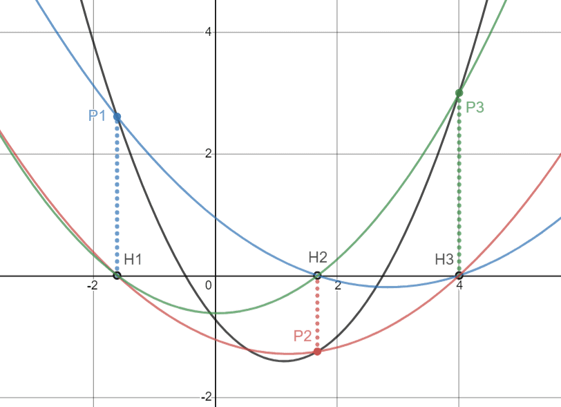

author: Ir1d, TrisolarisHD, YanWQ-monad, x4Cx58x54

!!! note "例题 [Luogu P4781【模板】拉格朗日插值](https://www.luogu.com.cn/problem/P4781)"

### 题目大意

给出 $n$ 个点 $P_i(x_i,y_i)$ ，将过这 $n$ 个点的最多 $n-1$ 次的多项式记为 $f(x)$ ，求 $f(k)$ 的值。

### 方法 1：差分法

差分法适用于 $x_i=i$ 的情况。

如，用差分法求某三次多项式 $f(x)=\sum_{i=0}^{3} a_ix^i$ 的多项式形式，已知 $f(1)$ 至 $f(6)$ 的值分别为 $1, 5, 14, 30, 55, 91$ 。

$$
\begin{array}{cccccccccccc}
1 &    &  5 &    & 14 &    & 30 &    & 55 &    & 91 & \\
  &  4 &    &  9 &    & 16 &    & 25  &    & 36 & \\
  &    &  5 &    &  7 &    &  9 &    &  11 & \\
  &    &    &  2 &    &  2 &    &  2 & \\
\end{array}
$$

第一行为 $f(x)$ 的连续的前 $n$ 项；之后的每一行为之前一行中对应的相邻两项之差。观察到，如果这样操作的次数足够多（前提是 $f(x)$ 为多项式），最终总会返回一个定值，可以利用这个定值求出 $f(x)$ 的每一项的系数，然后即可将 $k$ 代入多项式中求解。上例中可求出 $f(x)=\frac 1 3 x^3+\frac 1 2 x^2+\frac 1 6 x$ 。时间复杂度为 $O(n^2)$ 。这种方法对给出的点的限制性较强。

### 方法 2：待定系数法

设 $f(x)=\sum_{i=0}^{n-1} a_ix^i$ 将每个 $x_i$ 代入 $f(x)$ ，有 $f(x_i)=y_i$ ，这样就可以得到一个由 $n$ 条 $n$ 元一次方程所组成的方程组，然后使用 **高斯消元** 解该方程组求出每一项 $a_i$ ，即确定了 $f(x)$ 的表达式。

如果您不知道什么是高斯消元，请看 [高斯消元](../gauss.md) 。

时间复杂度 $O(n^3)$ ，对给出点的坐标无要求。

### 方法 3：拉格朗日插值法

如图所示，将每一个点 $(x_i, y_i)$ 在 $x$ 轴上的投影 $(x_i, 0)$ 记为 $H_i$ 。对每一个 $i$ ，我们选择一个点集 $\lbrace P_i\rbrace \cup \lbrace H_j \vert 1 \le i\le n, j \neq i\rbrace$ ，作过这 $n$ 个点的至多 $n-1$ 次的线 $g_i(x)$ 。图中 $f(x)$ 用黑线表示， $g_i(x)$ 用彩色线表示。



这样，我们得到了 $n$ 个 $g_i(x)\;(1 \le i \le n)$ ，它们都在各自对应的 $x_i$ 处的值为 $y_i$ ，并且在其它 $x_j\ (j \neq i)$ 处值为 $0$ 。所以很容易构造出 $g_i(x)$ 的表达式：

$$
g_i(x) = y_i\prod_{j\neq i }\frac{x-x_j}{x_i-x_j}.
$$

很容易通过将每一个 $x_i$ 代入上式以验证此其正确性。最后，我们所求的 $f(x)=\sum_{i=1}^{n}g_i(x)$ ，即各 $g_i(x)$ 之和。因为对于每一个 $i$ ，都只有一条 $g_i$ 经过 $P_i$ ，其余 $g_j$ 都经过 $H_i$ ，故它们相加后在 $x_i$ 的取值仍为 $y_i$ ，即最后的和函数总是过所有 $P_i$ 的。

公式整理得：

$$
f(x)=\sum_{i=1}^{n} y_i\prod_{j\neq i }\frac{x-x_j}{x_i-x_j}
$$

如果要将每一项的系数都算出来，时间复杂度仍为 $O(n^2)$ ，但是本题中只用求出 $f(k)$ 的值，所以在计算上式的过程中直接将 $k$ 代入即可。

$$
f(k)=\sum_{i=1}^{n} y_i\prod_{j\neq i }\frac{k-x_j}{x_i-x_j}
$$

本题中，还需要求解逆元。如果先分别计算出分子和分母，再将分子乘进分母的逆元，累加进最后的答案，时间复杂度的瓶颈就不会在求逆元上，时间复杂度为 $O(n^2)$ 。

### 代码实现

```cpp
#include <algorithm>
#include <cstdio>
#include <cstring>
const int maxn = 2010;
using ll = long long;
ll mod = 998244353;
ll n, k, x[maxn], y[maxn], ans, s1, s2;
ll powmod(ll a, ll x) {
  ll ret = 1ll, nww = a;
  while (x) {
    if (x & 1) ret = ret * nww % mod;
    nww = nww * nww % mod;
    x >>= 1;
  }
  return ret;
}
ll inv(ll x) { return powmod(x, mod - 2); }
int main() {
  scanf("%lld%lld", &n, &k);
  for (int i = 1; i <= n; i++) scanf("%lld%lld", x + i, y + i);
  for (int i = 1; i <= n; i++) {
    s1 = y[i] % mod;
    s2 = 1ll;
    for (int j = 1; j <= n; j++)
      if (i != j)
        s1 = s1 * (k - x[j]) % mod, s2 = s2 * ((x[i] - x[j] % mod) % mod) % mod;
    ans += s1 * inv(s2) % mod;
    ans = (ans + mod) % mod;
  }
  printf("%lld\n", ans);
  return 0;
}
```
