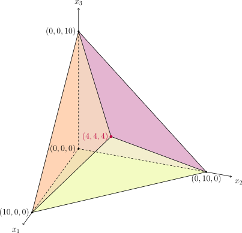

前置知识：[线性规划基础](./linear-programming.md)

## 引入

算法竞赛中，经常使用单纯形法解决线性规划问题。但是，由于算法竞赛中遇到的线性规划问题大多有着更特殊的结构，常常可以转化为网络流问题，因此，单纯形法并不常用，效率也不如专门为网络流问题设计的算法。

## 基本概念

假设要求解如下一个有 $n$ 个决策变量和 $m+n$ 个约束的 [标准形式](./linear-programming.md#标准形式) 线性规划问题：

$$
\begin{aligned}
\min_{x}\; & z = c^Tx \\
\text{subject to }& Ax = b, \\
& x \ge 0.
\end{aligned}
$$

不妨假设这 $m$ 个等式约束确定的线性方程组有解，且 $A$ 满秩，则 $\operatorname{rank}A = m \le n$。

### 一个例子

在严格叙述单纯形法的步骤之前，本节首先考察一个具体的例子，以方便理解。

???+ example "例子"
    考虑线性规划问题
    
    $$
    \begin{aligned}
    \max\; & 10 x_1 + 12 x_2 + 12 x_3 \\
    \text{subject to } & x_1 + 2 x_2 + 2x_3 \le 20, \\
    & 2x_1 + x_2 + 2x_3 \le 20, \\
    & 2x_1 + 2x_2 + x_3 \le 20,\\
    & x_1,x_2,x_3 \ge 0.
    \end{aligned}
    $$
    
    通过添加松弛变量，就得到它的标准形式：
    
    $$
    \begin{aligned}
    \min\; & -10 x_1 - 12 x_2 - 12 x_3 \\
    \text{subject to } & x_1 + 2 x_2 + 2x_3 + x_4 = 20, \\
    & 2x_1 + x_2 + 2x_3 + x_5 = 20, \\
    & 2x_1 + 2x_2 + x_3 + x_6 = 20,\\
    & x_1,x_2,x_3,x_4,x_5,x_6 \ge 0.
    \end{aligned}
    $$
    
    观察该问题的等式约束，它们其实相当于将变量 $x_4,x_5,x_6$ 由变量 $x_1,x_2,x_3$ 表示。将原问题稍微整理一下，就有
    
    $$
    \begin{array}{rrrrrr}
    \min_{x_i\ge 0}  &  z  = &  0 &  -10x_1 &  -12x_2 &  -12x_3\;\\
    \text{subject to}& x_4 = & 20 &    -x_1 &   -2x_2 &   -2x_3, \\
                & x_5 = & 20 &   -2x_1 &    -x_2 &   -2x_3, \\
                & x_6 = & 20 &   -2x_1 &   -2x_2 &    -x_3. \\
    \end{array}
    $$
    
    从这个形式中，可以清楚地看到，如果令 $x_1=x_2=x_3=0$，就可以得到原问题的一组可行解
    
    $$
    x = (0,0,0,20,20,20)^T.
    $$
    
    且它对应的价值为 $z=0$。为方便叙述，称那些设为零的变量 $x_1,x_2,x_3$ 为非基变量，剩下的变量 $x_4,x_5,x_6$ 为基变量。
    
    这组可行解显然不是最优解。只要适当地增加 $x_1,x_2,x_3$ 的值，使得 $x_4,x_5,x_6$ 仍然是非负数，就可以保持解仍然可行。而且，因为目标函数中，$x_1,x_2,x_3$ 的系数都是严格的负数，所以，增加它们的值一定会降低目标函数的值。比如说，可以选择增加 $x_1$ 的值。为了尽可能多地降低目标函数的值，需要尽可能多地增加 $x_1$ 的值。但是，为了保证解仍然是可行的，就需要保证 $x_4,x_5,x_6\ge 0$。因此，$x_1$ 最多可以增加到
    
    $$
    \min\left\{\dfrac{20}{1},\dfrac{20}{2},\dfrac{20}{2}\right\} = 10.
    $$
    
    此时，可行解变为
    
    $$
    x = (10,0,0,10,0,0)^T.
    $$
    
    因为 $x_1$ 成为了基变量，为了回到最初的情形（即三个基变量由三个非基变量表示），需要选择一个新的非基变量。因为 $x_5,x_6$ 都是零，所以，可以选择它们其中的任何一个作为非基变量，设为零。不妨选择 $x_5$ 作为非基变量。而且，将
    
    $$
    x_1 = 10 - 0.5x_5 - 0.5x_2 - x_3
    $$
    
    代入到原来的问题中，就可以将原问题改写作
    
    $$
    \begin{array}{rrrrrr}
    \min_{x_i\ge 0}  &   z = &-100&   +5x_5 &   -7x_2 &   -2x_3\;\\
    \text{subject to}& x_4 = & 10 & +0.5x_5 & -1.5x_2 &    -x_3, \\
                & x_1 = & 10 & -0.5x_5 & -0.5x_2 &    -x_3, \\
                & x_6 = &  0 &    +x_5 &    -x_2 &    +x_3. \\
    \end{array}
    $$
    
    这就回到了初始的情形。
    
    继续观察当前的目标函数。非基变量 $x_3$ 的系数仍然是负数。可以考虑增加 $x_3$ 的值。为了保证 $x_4,x_1,x_6\ge 0$，变量 $x_3$ 最多只能增加到
    
    $$
    \min\left\{\dfrac{10}{1},\dfrac{10}{1}\right\} = 10.
    $$
    
    注意到，因为 $x_6$ 的表达式中，$x_3$ 的系数是正数，所以，无论怎么增加 $x_3$ 的值，都不会使得 $x_6$ 变为负数。这就是这次大括号中只有两项的原因。因为 $x_3$ 增加到 $10$ 的时候，$x_1,x_4$ 都变为零，所以，可以任选其中一个作为新的非基变量。不妨选择 $x_4$。就可以将
    
    $$
    x_3 = 10 + 0.5x_5 - 1.5x_2 - x_4
    $$
    
    代入上述问题中，问题变形为
    
    $$
    \begin{array}{rrrrrr}
    \min_{x_i\ge 0}  &   z = &-120&   +4x_5 &   -4x_2 &   +2x_4\;\\
    \text{subject to}& x_3 = & 10 & +0.5x_5 & -1.5x_2 &    -x_4, \\
                & x_1 = &  0 &    -x_5 &    +x_2 &    +x_4, \\
                & x_6 = & 10 & +1.5x_5 & -2.5x_2 &    -x_4. \\
    \end{array}
    $$
    
    只需要代入 $x_5=x_2=x_4=0$，就能从这个形式中读出当前的可行解是
    
    $$
    x = (0,0,10,0,0,10)^T,
    $$
    
    以及它对应的价值为 $z=-120$。
    
    重复之前的操作。因为 $x_2$ 的系数是负数，可以增加它的值；但为了保持 $x_3,x_6$ 仍然是非负数，只能增加到
    
    $$
    \min\left\{\dfrac{10}{1.5},\dfrac{10}{2.5}\right\} = 4.
    $$
    
    因为大括号中的最小值出现在变量 $x_6$ 的表达式中，所以，它将在 $x_2=4$ 时变为零。将表达式
    
    $$
    x_2 = 4 + 0.6x_5 - 0.4x_6 - 0.4x_4
    $$
    
    代入上述问题，就可以将原问题改写为
    
    $$
    \begin{array}{rrrrrr}
    \min_{x_i\ge 0}  &   z = &-136& +1.6x_5 & +1.6x_6 & +3.6x_4\;\\
    \text{subject to}& x_3 = &  4 & -0.4x_5 & +0.6x_6 & -0.4x_4, \\
                & x_1 = &  4 & -0.4x_5 & -0.4x_6 & +0.6x_4, \\
                & x_2 = &  4 & +1.5x_5 & -2.5x_6 &    -x_4. \\
    \end{array}
    $$
    
    仍然令非基变量 $x_5,x_6,x_4$ 为零，就可以得到当前的可行解为
    
    $$
    x = (4,4,4,0,0,0)^T.
    $$
    
    对应的价值为 $z=-136$。
    
    因为目标函数中所有非基变量的系数都是正数，无法继续前文所述过程以改进目标函数，所以，当前的可行解就是最优解。算法终止。

这个例子中，算法从一组可行解出发，不断地改进目标函数，直到无法继续改进。这就是单纯形法的基本思想。

### 基本可行解

由于 $A$ 是满秩的，所以，总是可以选取大小为 $m$ 的子集 $B\subseteq\{1,2,\cdots,n\}$ 使得 $A_B$ 是可逆方阵。由此，可以将 $x_B$ 由剩下的变量 $x_N$ 表示：

$$
x_B = A_B^{-1}b - A_B^{-1}A_Nx_N.
$$

其中，$N=\{1,2,\cdots,n\}\setminus B$，矩阵 $A_B,A_N$ 分别为矩阵 $A$ 中标号 $i\in B$ 和标号 $i\in N$ 的列组成的子矩阵，向量 $x_B,x_N$ 分别为向量 $x$ 中标号 $i\in B$ 和标号 $i\in N$ 的分量组成的子向量。如果 $i\in B$，那么，称 $x_i$ 为 **基变量**（basic variable）；否则，称 $x_i$ 为 **非基变量**（non-basic variable）。基变量的全体称为一组 **基**（basis），本文用对应的标号集合 $B$ 表示一组基。

???+ tip "「基」"
    「基」这个名称，可以从线性代数的角度理解。设 $A$ 的全体列向量张成的线性空间为 $V$。那么，基 $B$ 对应的列向量就是空间 $V$ 的一组基。

在基变量 $x_B$ 的表达式中，令 $x_N=0$，就得到全体等式约束的一组解[^notation]

$$
x = (x_B,x_N) = (A_B^{-1}b,0).
$$

这样得到的解称为线性规划问题的一个 **基本解**（basic solution）。如果它还满足所有非负约束，即 $x\ge 0$，那么，它也是原问题的一个可行解，也称为 **基本可行解**（basic feasible solution, BFS）。在单纯形法的迭代过程中，需要始终保持当前的解为一组基本可行解。

### 转轴

单纯形法的每次迭代就称为一次 **转轴**（pivoting）。从结果上看，每次转轴总是移除一个旧的基变量，再添加一个新的基变量，进而改进目标函数的值。

???+ tip "「转轴」"
    「转轴」这个名称，同样可以从线性代数的角度理解。如上文所述，基 $B$ 对应的列向量是空间 $V$ 的一组基，它们也就对应着对应基的表示下空间 $V$ 的一组坐标轴。因此，转轴的过程，就是将某条坐标轴旋转到新的位置的过程。

为了确定需要添加的基变量，可以将目标函数利用非基变量表示为

$$
\begin{aligned}
c^Tx &= c^T_Bx_B + c^T_Nx_N \\
&= c_B^TA_B^{-1}b + (c_N^T - c_B^TA_B^{-1}A_N)x_N.
\end{aligned}
$$

令 $x_N=0$，就得到目标函数在当前基本可行解处的价值 $z=c_B^TA_B^{-1}b$。表达式中的第二项的系数则表示 $x_N$ 改变时，目标函数的改变为

$$
\tilde c_N = \dfrac{\partial z}{\partial x_N} = c_N - A_N^T(A_B^{-1})^Tc_B.
$$

注意到 $c_B - A_B^T(A_B^{-1})^Tc_B = 0$，所以，可以记向量

$$
\tilde c = (\tilde c_B^T,\tilde c_N^T)^T = c - A^T(A_B^{-1})^Tc_B
$$

为线性规划问题在可行基本解 $x$ 处的 **约化成本**（reduced cost）。分量 $\tilde c_i<0$ 说明增加变量 $x_i$ 的值可以改进原问题的目标函数。这样的变量只能是一个非基变量，它称为本次转轴的 **入基变量**（entering variable）。因为在转轴后，$x_i$ 将变为基变量，不再恒设为零（但依然有可能等于零）。

选择完入基变量后，还需要选择需要移除的旧的基变量。为此，只需要确定，在增加 $x_i$ 的过程中，哪个现有的基变量最先变为零。将 $x_N=(x_i,x_{N\setminus\{i\}})=(x_i,0)$ 代入 $x_B$ 的表达式，就有

$$
x_B = A_B^{-1}b - A_B^{-1}A_ix_i.
$$

因此，$x_i$ 可以增加的最大量就等于

$$
\theta = \min\left\{\dfrac{(A_B^{-1}b)_j}{(A_B^{-1}A_i)_j}:(A_B^{-1}A_i)_j>0\right\}.
$$

最先变为零的变量就是使得该表达式取得最小值的下标 $j$ 对应的基变量 $x_{B_j}$。它也是增加 $x_i$ 的过程中的「瓶颈」——继续增加 $x_i$ 将使得 $x_{B_j}$ 成为负值。这一变量就是本次转轴的 **出基变量**（leaving variable）。确定出基变量的方法称为 **最小比值检验**（minimum ratio test）。

设入基变量为 $x_i$，出基变量为 $x_{i'}$。转轴之后，基变量就是 $x_{B\setminus\{i\}\cup\{i'\}}$，非基变量就是 $x_{N\setminus\{i'\}\cup\{i\}}$。

### 终止条件

单纯形法，就是从一组基本可行解出发，不断进行转轴的过程。上一节对转轴的讨论并不是完整的，它忽略了一些特殊的情形。有些特殊情形对应着算法的终止，有些则需要额外的处理。

首先，入基变量未必存在，即 $\tilde c\ge 0$。此时，没有进一步改进最优价值的方法，这说明当前基本可行解就是最优解，算法终止。要严格地证明这一点，需要用到 [互补松弛条件](./linear-programming.md#互补松弛条件)。令 $y=(A_B^{-1})^Tc_B$。注意到，在算法的整个过程中，始终保持 $x$ 是可行解，且互补松弛条件成立，即

$$
x^T(c-A^Ty) = \tilde c^Tx = \tilde c_B^Tx_B + \tilde c_N^Tx_N = 0.
$$

因此，只需要 $y$ 是对偶问题的可行解，即 $A^Ty\le c$，就能得到 $x$ 和 $y$ 分别是原问题和对偶问题的最优解这一结论。这个条件就是 $\tilde c\ge 0$，即不存在入基变量。

???+ tip "「影子价格」"
    向量 $y=(A_B^{-1})^Tc_B$ 常称为 **对偶向量**（dual vector）。当 $B$ 对应的基本可行解是原问题的最优解时，向量 $y$ 是对偶问题的最优解。因此，利用单纯形法求解原问题的最优解时，也会获得对偶问题的最优解。因为向量 $y$ 是当前价值关于约束常量的偏导数，即
    
    $$
    \dfrac{\partial(c^Tx)}{\partial b} = (A_B^{-1})^Tc_B = y,
    $$
    
    它也称为 **影子价格**（shadow price）。

其次，出基变量未必存在，即 $A_B^{-1}A_i\le 0$。此时，转轴的过程不存在任何「瓶颈」，也就是说，可以不断地通过增加 $x_i$ 的值来改进目标函数，直到它等于 $-\infty$。这说明给定的线性规划问题是无界的，算法终止。

最后，入基变量和出基变量的选择可能并非是唯一的。不恰当的选择方式可能会导致过多地转轴，甚至使得算法陷入循环，无法正常终止。这类情形的处理稍微复杂，需要应用一些 [转轴规则](#转轴规则) 以防止陷入循环并减少转轴次数。

### 单纯形表

具体实现转轴过程时，只需要维护每次转轴之后，线性规划问题的系数矩阵：

$$
\tilde T_B = 
\begin{pmatrix}
-z_B & \tilde c^T_N \\
x & A_B^{-1}A_N
\end{pmatrix}
=
\begin{pmatrix}
-c_B^TA_B^{-1}b & c^T - c_B^TA_B^{-1}A_N \\
A_B^{-1}b & A_B^{-1}A_N 
\end{pmatrix}.
$$

它对应着线性规划问题：

$$
\begin{array}{rrrr}
\min_{x\ge 0}    &       & c_B^TA_B^{-1}b & + \tilde c_N^Tx_N\; \\
\text{subject to}& x_B = & A_B^{-1}b      & - A_B^{-1}A_Nx_N.
\end{array}
$$

矩阵 $\tilde T_B$ 称为该线性规划问题相对于基 $B$ 的 **压缩单纯形表**（condensed simplex tableau）。表的左上角 $(\tilde T_B)_{00}$ 为当前解的价值（的相反数），第 $0$ 行、第 $i$ 列的量 $(\tilde T_B)_{0i}$ 为第 $i$ 个非基变量 $x_{N_i}$ 的约化成本，第 $j$ 行、第 $i$ 列的量 $(\tilde T_B)_{j0}$ 为第 $j$ 个基变量 $x_{B_j}$ 的值，而 $A_B^{-1}A_N$ 就是用非基变量 $x_N$ 表示基变量 $x_B$ 得到的表达式中的系数。

容易看出，转轴需要的所有信息都可以从压缩单纯形表中直接获得。具体地，利用压缩单纯形表，单次转轴包括如下操作：

1.  选取列 $i=1,\cdots,n-m$，使得 $(\tilde T_B)_{0i}<0$。如果不存在这样的 $i$，那么当前解就是最优解，量 $-(\tilde T_B)_{00}$ 就是最优价值。
2.  选取行 $j=1,\cdots,m$，使得 $(\tilde T_B)_{ji}>0$ 且 $(\tilde T_B)_{j0}/(\tilde T_B)_{ji}$ 最小。如果不存在这样的 $j$，那么原问题无界。
3.  令变量 $x_{N_i}$ 入基，变量 $x_{B_j}$ 出基，并更新单纯形表。

现在，具体地讨论一下如何更新单纯形表。在更新单纯形表之前，第 $j$ 行表示等式

$$
x_{B_j} = (\tilde T_B)_{j0} - \sum_{i=1}^{n-m}(\tilde T_B)_{ji}x_{N_i}.
$$

为了更新单纯形表，需要用 $x_{N\setminus\{N_i\}\cup\{B_j\}}$ 表示 $x_{N_i}$，也就是：

$$
x_{N_i} = \dfrac{(\tilde T_B)_{j0}}{(\tilde T_B)_{ji}} - \dfrac{1}{(\tilde T_B)_{ji}}x_{B_j} - \sum_{i'\neq i}\dfrac{(\tilde T_B)_{ji'}}{(\tilde T_B)_{ji}}x_{N_{i'}}.
$$

将它代入其余的式子中，就得到

$$
x_{B_{j'}} = \left((\tilde T_B)_{j'0} - (\tilde T_B)_{j'i}\dfrac{(\tilde T_B)_{j0}}{(\tilde T_B)_{ji}}\right) + \dfrac{(\tilde T_B)_{j'i}}{(\tilde T_B)_{ji}}x_{B_j} - \sum_{i'\neq i}\left((\tilde T_B)_{j'i'}-(\tilde T_B)_{j'i}\dfrac{(\tilde T_B)_{ji'}}{(\tilde T_B)_{ji}}\right)x_{N_i}.
$$

第 $0$ 行类似，只是等式左侧变为 $-z$。虽然式子看起来复杂，但是实现时，只需要分两步：

1.  更新第 $j$ 行，即令 $\alpha=(\tilde T_B)_{ji}$，再令第 $i$ 列数字为 $1$，然后将整行所有数字同除以 $\alpha$；
2.  更新第 $j'\neq j$ 行，即令 $\beta=(\tilde T_B)_{j'i}$，再令第 $j$ 列数字为 $0$，然后将整行数字同时减去 $\beta$ 倍的第 $j$ 行数字。

???+ tip "「单纯形表」"
    **单纯形表**（simplex tableau）指矩阵
    
    $$
    T_B = 
    \begin{pmatrix}
    -z & \tilde c^T \\
    x & A_B^{-1}A 
    \end{pmatrix}
    =
    \begin{pmatrix}
    -c_B^TA_B^{-1}b & c^T - c_B^TA_B^{-1}A \\
    A_B^{-1}b & A_B^{-1}A 
    \end{pmatrix}.
    $$
    
    相较于压缩单纯形表，它多了 $m$ 列，分别对应 $m$ 个基变量；而且，对应着第 $j$ 个基变量的列一定是 $e_j$，即该向量只在第 $j$ 行处取值为 $1$，其余行均为 $0$。因为这些列并没有提供多余的信息，所以在实现单纯形法时，常常省略这些列，这就得到了压缩单纯形表。
    
    利用单纯形表可以更方便地理解更新单纯形表的步骤。因为所有的单纯形表 $T_B$ 都可以由同一个矩阵 $T_0$ 左乘一个与基有关的可逆矩阵 $L_B$ 得到，即
    
    $$
    T_B=
    \begin{pmatrix}
    -c_B^TA_B^{-1}b & c^T - c_B^TA_B^{-1}A \\
    A_B^{-1}b & A_B^{-1}A 
    \end{pmatrix}
    =
    \begin{pmatrix}
    1 & -c_B^TA_B^{-1} \\
    O & A_B^{-1}
    \end{pmatrix}
    \begin{pmatrix}
    0 & c^T \\
    b & A 
    \end{pmatrix}=L_BT_0,
    $$
    
    所以，这些单纯形表和 $T_0$ 之间可以通过若干次 [初等行变换](./linear-algebra/elementary-operations.md) 相互转化。因此，在更新单纯形表时，只需要施行初等行变换，使得入基变量对应列变为 $e_j$ 即可。由此，所需要的操作迁移到压缩单纯形表上，就是上文给出的步骤。

更新压缩单纯形表的参考实现如下：

???+ example "参考实现"
    ```cpp
    --8<-- "docs/math/code/simplex/simplex_0.cpp:pivot"
    ```

由该实现可知，单次更新单纯形表的时间复杂度为 $O(mn)$ 的。稍后讨论 [转轴规则](#转轴规则) 时会说明，确定出基变量和入基变量的复杂度同样不会超过 $O(mn)$，因此，单次转轴的时间复杂度就是 $O(mn)$ 的。

为方便理解，此处列出前文所示例子中，利用压缩单纯形表计算的详细步骤。

???+ example "例子（续）"
    初始时，压缩单纯形表如下所示：
    
    $$
    \begin{array}{|l|c|ccc|}
    \hline
        &    & x_1 & x_2 & x_3 \\
    \hline
        & 0  & -10 & -12 & -12 \\
    \hline
    x_4= & 20 &   1 & 2   &   2 \\
    x_5= & 20 &   2 & 1   &   2 \\
    x_6= & 20 &   2 & 2   &   1 \\
    \hline
    \end{array}
    $$
    
    根据第 $0$ 行的约化成本，可以选择 $x_1,x_2,x_3$ 入基。令 $x_1$ 入基。再根据根据最小比值检验，可以选择 $x_5,x_6$ 出基。令 $x_5$ 出基。相应地，更新压缩单纯形表如下：
    
    $$
    \begin{array}{|l|c|ccc|}
    \hline
        &    & x_5 & x_2 & x_3 \\
    \hline
        &100 & 5   & -7  & -2  \\
    \hline
    x_4= & 10 &-0.5 & 1.5 &   1 \\
    x_1= & 10 & 0.5 & 0.5 &   1 \\
    x_6= &  0 & -1  & 1   &  -1 \\
    \hline
    \end{array}
    $$
    
    根据第 $0$ 行的约化成本，可以选择 $x_2,x_3$ 入基。令 $x_3$ 入基。再根据根据最小比值检验，可以选择 $x_4,x_1$ 出基。令 $x_4$ 出基。相应地，更新压缩单纯形表如下：
    
    $$
    \begin{array}{|l|c|ccc|}
    \hline
        &    & x_5 & x_2 & x_4 \\
    \hline
        &120 & 4   & -4  & 2   \\
    \hline
    x_3= & 10 &-0.5 & 1.5 &  1  \\
    x_1= &  0 &  1  & -1  & -1  \\
    x_6= & 10 & -1.5& 2.5 &  1  \\
    \hline
    \end{array}
    $$
    
    根据第 $0$ 行的约化成本，只能选择 $x_2$ 入基。令 $x_2$ 入基。再根据根据最小比值检验，只能选择 $x_6$ 出基。令 $x_6$ 出基。利用前述初等行变换更新单纯形表如下：
    
    $$
    \begin{array}{|l|c|ccc|}
    \hline
        &    & x_5 & x_4  & x_6 \\
    \hline
        &136 & 1.6 & 3.6 & 1.6 \\
    \hline
    x_3= & 4  & 0.4 & 0.4 &-0.6 \\
    x_1= &  4 & 0.4 & -0.6& 0.4 \\
    x_2= &  4 & -0.6& 0.4 & 0.4 \\
    \hline
    \end{array}
    $$
    
    根据第 $0$ 行的约化成本，不存在入基变量。因此，当前解
    
    $$
    x=(4,4,4,0,0,0)^T
    $$
    
    就是最优解，（最小化问题的）最优价值为 $-136$。

除了利用单纯形表实现单纯形法之外，还可以使用修正单纯形法（revised simplex method），它进一步改进了算法的时空复杂度，将单次更新的复杂度进一步降低到了 $O(m^2)$，在 $m\ll n$ 或 $A$ 是稀疏矩阵的情形下尤为高效。

## 几何背景

本节介绍单纯形法的几何背景。

对线性规划问题的可行域

$$
\mathcal D = \{x\in\mathbf R^n : Ax = b,~ x\ge 0\}
$$

的 [分析](./linear-programming.md#可行域与问题的解) 指出：

-   线性规划问题的最优解（如果存在）必然可以选取为可行域 $\mathcal D$ 的顶点。求解线性规划问题，就转化于在所有顶点解里找到价值函数最优的那个。
-   每一个顶点的坐标，都可以通过 $n$ 个紧约束联立得到的方程组求解得到。对于标准形式的约束，所有 $m$ 个等式约束一定是紧的，剩下的 $n-m$ 个约束只能从非负约束中选取。选取这些非负约束作为紧约束，就相当于将相应的决策变量 $x_N$ 设为 $0$；相应地，方程组 $Ax = b$ 退化为关于剩余 $m$ 个决策变量 $x_B$ 的线性方程组 $A_Bx_B = b$。只要 $A_B$ 可逆，就可以解得 $x_B = A_B^{-1}b$。这就得到了一个解 $(x_B,x_N)=(A_B^{-1}b,0)$；如果 $x_B\ge 0$，这就是 $\mathcal D$ 的一个顶点坐标。

容易看出，顶点解的概念，和前文定义的基本可行解是一致的。因此，只要在所有基本可行解内找到最优的那个，就能获得原问题的最优解。虽然这大幅简化了问题，但是，可行域的顶点的个数是指数级的，穷举并不现实。

为了解决这一困难，可以考虑沿着可行域的 [边](./linear-programming.md#可行域与问题的解) 移动，从一个顶点移动到与之相邻的顶点。因为相邻的顶点必定位于同一条边上，所以，它们至少满足 $n-1$ 条相同的紧约束。也就是说，相邻的顶点对应的紧约束能且仅能相差一个。因此，对于一个基本可行解 $x$，只要将它的一个基变量换成一个非基变量，就能得到一个 **相邻的**（adjacent）的基本可行解 $x'$。这正是转轴操作。

因此，单纯形法从一个基本可行解出发，不断进行转轴，改进目标函数的过程，其实就是在相应的可行域上，从一个顶点出发，不断向相邻顶点移动，进而改进目标函数的过程。

???+ example "例子（续）"
    本文讨论的例子中，可行域是一个有五个顶点的三维多面体，如下图所示：
    
    
    
    前述求解过程，从几何直观上看，就对应着多面体的顶点间的如下路径：
    
    $$
    (0,0,0) \rightarrow (0,0,10) \rightarrow (10,0,0) \rightarrow (4,4,4).
    $$

## 实现细节

利用单纯形表，已经能够求解许多线性规划问题。然而，对于最一般的情形，单纯形法中仍有许多细节值得深入探讨。

### 松弛形式

将一般形式的线性规划问题转化为标准形式的 [方法](./linear-programming.md#标准形式) 已经讨论过了。但是，为了方便利用单纯形法求解，还需要保证系数矩阵 $A$ 满秩。虽然先转换为标准形式再消去线性相关的约束的方法是可行的，但是为了求解简便，通常采用如下策略：

1.  将线性规划问题转化为 **不等式形式**（inequality form），即 $\min\{c^Tx : Ax \le b,~ x \ge 0\}$ 的形式；
2.  通过添加松弛变量 $s$，将问题转化为标准形式：$\min\{c^Tx : Ax + s = b,~ x\ge 0,~ s \ge 0\}$。

这样做的好处是，最终得到的标准形式的系数矩阵 $(A,I)$ 总是满秩的，且总是存在（未必可行的）基本解 $(x,s)=(0,b)$。这种特殊的标准形式也称为 **松弛形式**（slack form）。

### 初始基本可行解

前文描述的单纯形法总是假定已知一组基本可行解。有些时候，很容易找到一组基本可行解。例如，如果上述松弛形式中 $b\ge 0$，那么，$(x,s)=(0,b)$ 就是一组基本可行解。这就是前文的数值例子里遇到的情形。

对于一般的情形，可以采用 **两阶段法**（two-phase method）。两阶段法中，需要做两次单纯形法。第一阶段求解一个可行性线性规划问题，获得原问题的一个基本可行解。第二阶段从这个基本可行解出发，应用单纯形法求解原问题。

假设有标准形式的问题 $\min\{c^Tx : Ax = b \ge 0,~ x\ge 0\}$。在第一阶段中，需要求解问题

$$
\min\{1^Tx_a : Ax + x_a = b,~ x\ge 0,~ s\ge 0\}.
$$

这本质是可行性线性规划问题，其中，新添加的变量 $x_a$ 也称为 **人工变量**（artificial variable）。它一定有基本可行解 $(x,x_a)=(0,b)$，所以可以直接用单纯形法求解。如果该问题的最优价值严格大于 $0$，那么，就不存在 $x\ge 0$ 使得 $Ax=b$，也就是说，原问题不可行。如果该问题的最优价值等于 $0$，那么，它的最优解中人工变量只能是零。如果仍有一些人工变量是基变量，可以通过若干次转轴将它们出基。最后，当所有人工变量都是非基变量时，第一阶段得到的基本解就可以用作第二阶段的初始基本可行解。

???+ note "不显式引入人工变量的第一阶段实现"
    实现第一阶段时，没有必要显式地引入人工变量。对于任意选取的初始基 $B$，有
    
    $$
    x_B + A_B^{-1}A_Nx_N = A_B^{-1}b.
    $$
    
    如果 $(A_B^{-1}b)_j\ge 0$，那么无需引入人工变量；否则，需要额外引入人工变量 $x^{-}_{B_j}$，即
    
    $$
    x_{B_j} - x^-_{B_j} + (A_B^{-1}A_N)_{(j)}x_N = (A_B^{-1}b)_j.
    $$
    
    记下标集合 $L:=\{j:(A_B^{-1}b)_j<0\}$，那么一阶段的单纯形表都是如下单纯形表经过若干初等行变换得到的：
    
    $$
    \begin{array}{|r|c|cccc|}
    \hline
                    &                       & x_N                      & x_{B_{\sim L}} & x_{B_L}  &x_{B_{L}}^- \\  
    \hline
                    & 0                     & 0^T                      & 0^T            & 0^T      & 1^T        \\
    \hline
    x_{B_{\sim L}}=  & (A_B^{-1}b)_{\sim L}  & (A_B^{-1}A_N)_{(\sim L)} & I              &  O       &  O         \\
    x_{B_{L}}^-=     & (A_B^{-1}b)_L         & (A_B^{-1}A_N)_{(L)}      & O              &  I       & -I         \\
    \hline
    \end{array}
    $$
    
    类似于将单纯形表简化为压缩单纯形表，可以将其适当地简化：（将 $x_{B_{L}}^-$ 行左乘以 $1^T$ 然后加到第 $0$ 行上，然后略去后三列）
    
    $$
    \begin{array}{|r|c|cccc|}
    \hline
                    &                      & x_N                      \\  
    \hline
                    & 1^Tb_L               & 1^T(A_B^{-1}A_N)_L       \\
    \hline
    x_{B_{\sim L}}= & (A_B^{-1}b)_{\sim L} & (A_B^{-1}A_N)_{(\sim L)} \\
    -x_{B_{L}}=     & (A_B^{-1}b)_L        & (A_B^{-1}A_N)_L          \\
    \hline
    \end{array}
    $$
    
    这与正常的压缩单纯形表大体一致，只是最后一行的变量上标记了负号，表示该行仍然含有人工变量，即原来的松弛变量仍然不可行。利用该表，转轴过程如下：
    
    1.  如果 $L=\varnothing$，算法终止。
    2.  否则，根据第 $0$ 行的约化成本为负这一条件选取入基变量 $x_{N_i}$。如果不存在，则原问题不可行，算法终止。
    3.  再根据第 $i$ 列选取出基变量 $x_{B_j}$。仍然利用最小比值检验，但是要求同时保证当前的可行变量可行和当前的不可行变量不可行，即选取
    
        $$
        \arg\min_{j}\left\{\dfrac{(\tilde T_B)_{j0}}{(\tilde T_B)_{ji}}:(j\notin L\land(\tilde T_B)_{ji}>0)\lor(j\in L\land(\tilde T_B)_{ji}<0)\right\}
        $$
    
        作为出基变量所在行。如果存在多个这样的出基变量，优先选取不可行的出基变量。
    4.  令 $x_{N_i}$ 入基，$x_{B_j}$ 出基，并更新单纯形表。
    5.  如果 $j\in L$，那么将 $j$ 移出 $L$（即取消该行的负号标记），并且将 $(\tilde T_B)_{0i}$ 加一。
    
    之所以可以略去人工变量所在列，是因为如果它们仍然是基变量，那么它们对应的列就是 $e_j$，无需记录，而如果它们不再是基变量，那么它们就不会再次入基，也无需记录。人工变量出基时，需要替换成相应的非人工变量，这正是上述过程中最后一步的目的。
    
    参考实现如下：
    
    ??? example "参考实现"
        ```cpp
        --8<-- "docs/math/code/simplex/simplex_0.cpp:initialize"
        ```
    
    在一阶段开始前，额外添加一行用于记录一阶段的目标函数。转轴时，对整个表进行转轴，包括第二阶段的目标函数。这样，在第一阶段完成时，第二阶段的目标函数也一并相应地更新，可以直接开始二阶段的单纯形法。

两阶段法也可以通过一次单纯形法实现。只需要取充分大的正数 $M$，就可以通过直接求解问题

$$
\min\{c^Tx + M1^Tx_a : Ax + x_a = b,~ x\ge 0,~ s\ge 0\}
$$

得到原问题的最优解。实现时，并不会赋予 $M$ 具体的数值，而是将它视为一个未知的充分大的正数进行运算。这种方法称为 **大 $M$ 法**（big $M$ method）。

???+ warning "朴素算法的实际效率是指数级的"
    因为松弛形式总是存在初始基本解，只是未必是可行的，所以，一种简单的寻找初始基本可行解的想法是，从一个不可行的基本解出发，反复利用转轴操作，将不可行的基变量出基，并选择对应行中同样为负的数字对应列的非基变量入基，直到所有基变量都是非负数为止。参考实现如下：
    
    ??? example "参考实现"
        ```cpp
        --8<-- "docs/math/code/simplex/simplex_2.cpp:initialize"
        ```
    
    这样做虽然简单，但是相较于二阶段法，它没有一个描述当前基的不可行程度的目标函数，所以缺乏明确的改进方向。实际测试可以发现，相较于通常只需要 $O(m)$ 的转轴次数的二阶段法或大 $M$ 法，这一朴素算法通常需要 $O(2^m)$ 的转轴次数，且当 $n,m$ 较大时容易陷入循环。虽然朴素算法的转轴次数中的常数很小，但是仅仅适用于 $n,m<50$ 的情形。

### 转轴规则

转轴时，如果出现多个可选的入基变量或出基变量，就需要用到 **转轴规则**（pivot rule）来决定选择哪个变量入基或出基。利用单纯形表，本节讨论的所有规则都能够在 $O(mn)$ 时间内找到入基和出基变量，因此，单次转轴的时间复杂度仍然是 $O(mn)$ 的。

入基变量的选择往往决定了算法终止前转轴的次数。常见的规则如下：

-   选择最先找到的入基变量；
-   选择标号最小的入基变量；（Bland 规则的一部分）
-   选择约化成本绝对值（即 $|c_i|$）最大的入基变量；（Dantzig 规则）
-   选择单次转轴价值函数改进（即 $|c_i|\theta_i$）最大的入基变量；
-   选择对应着最陡的边的入基变量，即沿着边移动单位长度引起的价值函数改进（即 $|c_i|/\|A_B^{-1}A_i\|$）最大；
-   随机选择一个入基变量。

实践中，最陡边规则的效率最高[^steepest-edge]。通常认为，适当的转轴规则可以在大致 $2m$ 次转轴内得到大多数问题的最优解。但是，对于目前所有已知的转轴规则，都存在特殊构造的例子[^klee-minty]，能够将转轴次数卡到指数级。这也正是单纯形法实践中运行效率相当优秀，但是理论最差复杂度是指数级的原因。

出基变量的选择往往决定了算法是否会陷入循环。如果存在多个最优价值相同的基本可行解，那么，算法就有可能一直在这些基本可行解之间循环。这些情形并不常见，因此很多单纯形法的实现并不会指定出基变量的选择规则。常见的避免循环的规则有两种：

-   Bland 规则：总是选择标号最小的入基变量和出基变量。
-   字典序规则：总是选择 $(A_B^{-1}A_i)_j>0$ 且

    $$
    \left(\dfrac{(A_B^{-1}b)_j}{(A_B^{-1}A_i)_j},\dfrac{(A_B^{-1})_{j1}}{(A_B^{-1}A_i)_j},\cdots,\dfrac{(A_B^{-1})_{jm}}{(A_B^{-1}A_i)_j}\right)
    $$

    字典序最小的行号 $j$ 对应的出基变量 $x_{B_j}$。入基变量的选择不重要。

    注意，如果线性规划问题是松弛形式的，那么这些量都可以从前文所述形式的单纯形表 $T_B$ 中直接找到；否则，可以在找到一组初始基本解（未必可行）后，利用这些初始基中的基变量对应列（顺序保持固定）的系数作为 $A_B^{-1}$ 的系数。

Bland 规则效率很低，因为规则本身对入基和出基变量的选择方法是一样的，这很容易造成同一个变量反复入基再出基。相对来说，字典序规则更为实用。字典序规则相当于对线性规划问题中的参数进行微扰[^lexico]，使得不存在最优价值相同的基本可行解，也就不存在循环的可能性。

## 参考实现

本节提供一个基于压缩单纯形表的二阶段单纯形法的参考实现。

??? example "[Luogu P13337【模板】线性规划](https://www.luogu.com.cn/problem/P13337)"
    ```cpp
    --8<-- "docs/math/code/simplex/simplex_0.cpp:full-text"
    ```

## 例题

???+ example "[「NOI2008」志愿者招募](https://www.luogu.com.cn/problem/P3980)"
    总共 $n$ 天活动需要招募志愿者，其中，第 $i$ 天至少需要 $b_i$ 位志愿者。总有 $m$ 类志愿者，其中，第 $j$ 类志愿者可以服务的日期为连续区间 $[l_j,r_j]$，且单位招募成本为 $c_i$。求最优的招募方案，使得招募志愿者的成本最低。

??? note "解答"
    设第 $j$ 类志愿者招募 $x_j$ 位。那么，可以列出线性规划问题为
    
    $$
    \begin{align*}
    \max_{x}\; & \sum_{j=1}^mc_jx_j \\
    \text{subject to }& \sum_{i=1}^n a_{ij}x_j \ge b_i,~i=1,\cdots,n,\\
    & x_j\ge 0,~j=1,\cdots,m.
    \end{align*}
    $$
    
    其中，系数
    
    $$
    a_{ij} = 
    \begin{cases}
    1,& l_j\le i\le r_j,\\
    0,& \text{otherwise.}
    \end{cases}
    $$
    
    原问题没有显然的初始可行解。因此，不妨考虑其 [对偶问题](./linear-programming.md#对偶问题)：
    
    $$
    \begin{align*}
    \min_{y}\; & \sum_{i=1}^n b_iy_i \\
    \text{subject to } & \sum_{j=1}^na_{ij}y_i \le c_j,~j=1,\cdots,m,\\
    & y_i\ge 0,~i=1,\cdots,n.
    \end{align*}
    $$
    
    通过添加松弛变量，容易得到一组初始可行解，可以直接略过一阶段，通过单纯形法求解。根据对偶原理，得到的解就是原问题的解。
    
    ```cpp
    --8<-- "docs/math/code/simplex/simplex_1.cpp"
    ```

## 习题

-   [Luogu P13337【模板】线性规划](https://www.luogu.com.cn/problem/P13337)
-   [UOJ#179. 线性规划](https://uoj.ac/problem/179)
-   [Luogu P4232 无意识之外的捉迷藏](https://www.luogu.com.cn/problem/P4232)
-   [Codeforces 1430 G. Yet Another DAG Problem](https://codeforces.com/problemset/problem/1430/G)
-   [AtCoder Beginner Contest 231 H - Minimum Coloring](https://atcoder.jp/contests/abc231/tasks/abc231_h)

## 参考资料

-   [线性规划之单纯形法【超详解 + 图解】](https://www.cnblogs.com/ECJTUACM-873284962/p/7097864.html)
-   [2016 国家集训队论文](https://github.com/OI-wiki/libs/blob/master/%E9%9B%86%E8%AE%AD%E9%98%9F%E5%8E%86%E5%B9%B4%E8%AE%BA%E6%96%87/%E5%9B%BD%E5%AE%B6%E9%9B%86%E8%AE%AD%E9%98%9F2016%E8%AE%BA%E6%96%87%E9%9B%86.pdf)
-   算法导论
-   Matoušek, Jiří, and Bernd Gärtner. Understanding and using linear programming. Vol. 1. Berlin: Springer, 2007.
-   Inayatullah, Syed, Nasir Touheed, and Muhammad Imtiaz. "A streamlined artificial variable free version of simplex method." PloS one 10, no. 3 (2015): e0116156.
-   Floudas, Christodoulos A., and Panos M. Pardalos, eds. Encyclopedia of optimization. Springer Science & Business Media, 2008.

[^notation]: 原则上，因为所有向量默认为列向量，$(x_B,x_N)$ 应该写作 $(x_B^T,x_N^T)^T$。但是为了简化记号，本文所有类似的情形都直接写作 $(x_B,x_N)$，而省略转置符号。

[^steepest-edge]: 测试结果参见 Forrest, John J., and Donald Goldfarb. "Steepest-edge simplex algorithms for linear programming." Mathematical programming 57, no. 1 (1992): 341-374。

[^klee-minty]: 一个经典的反例可以参见 Klee, Victor, and George J. Minty. "How good is the simplex algorithm." Inequalities 3, no. 3 (1972): 159-175。

[^lexico]: 详细的解释可以看 [这份讲义](https://facultyweb.kennesaw.edu/mlavrov/courses/lp/lecture8.pdf)。
