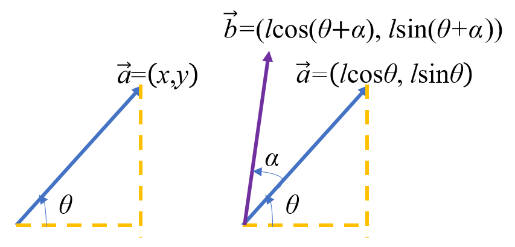

## 向量

（为人教版高中数学必修二内容）（旧教材为必修四）

### 定义及相关概念

**向量**：既有大小又有方向的量称为向量。数学上研究的向量为 **自由向量**，即只要不改变它的大小和方向，起点和终点可以任意平行移动的向量。记作 $\vec a$ 或 $\boldsymbol{a}$。

**有向线段**：带有方向的线段称为有向线段。有向线段有三要素：**起点，方向，长度**，知道了三要素，终点就唯一确定。我们用有向线段表示向量。

**向量的模**：有向线段 $\overrightarrow{AB}$ 的长度称为向量的模，即为这个向量的大小。记为：$|\overrightarrow{AB}|$ 或 $|\boldsymbol{a}|$。

**零向量**：模为 $0$ 的向量。零向量的方向任意。记为：$\vec 0$ 或 $\boldsymbol{0}$。

**单位向量**：模为 $1$ 的向量称为该方向上的单位向量。

**平行向量**：方向相同或相反的两个 **非零** 向量。记作：$\boldsymbol a\parallel \boldsymbol b$。对于多个互相平行的向量，可以任作一条直线与这些向量平行，那么任一组平行向量都可以平移到同一直线上，所以平行向量又叫 **共线向量**。

**相等向量**：模相等且方向相同的向量。

**相反向量**：模相等且方向相反的向量。

**向量的夹角**：已知两个非零向量 $\boldsymbol a,\boldsymbol b$，作 $\overrightarrow{OA}=\boldsymbol a,\overrightarrow{OB}=\boldsymbol b$，那么 $\theta=\angle AOB$ 就是向量 $\boldsymbol a$ 与向量 $\boldsymbol b$ 的夹角。记作：$\langle \boldsymbol a,\boldsymbol b\rangle$。显然当 $\theta=0$ 时两向量同向，$\theta=\pi$ 时两向量反向，$\theta=\frac{\pi}{2}$ 时我们说两向量垂直，记作 $\boldsymbol a\perp \boldsymbol b$。并且，我们规定 $\theta \in [0,\pi]$。

注意到平面向量具有方向性，我们并不能比较两个向量的大小（但可以比较两向量的模长）。但是两个向量可以相等。

### 向量的线性运算

#### 向量的加减法

我们定义了一种量，就希望让它具有运算。向量的运算可以类比数的运算，但是我们从物理学的角度出发研究向量的运算。

类比物理学中的位移概念，假如一个人从 $A$ 经 $B$ 走到 $C$，我们说他经过的位移为 $\overrightarrow{AB}+\overrightarrow{BC}$，这其实等价于这个人直接从 $A$ 走到 $C$，即 $\overrightarrow{AB}+\overrightarrow{BC}=\overrightarrow{AC}$。

注意到力的合成法则——平行四边形法则，同样也可以看做一些向量相加。

所以我们整理一下向量的加法法则：

1. **向量加法的三角形法则**：若要求和的向量首尾顺次相连，那么这些向量的和为第一个向量的起点指向最后一个向量的终点；
2. **向量加法的平行四边形法则**：若要求和的两个向量 **共起点**，那么它们的和向量为以这两个向量为邻边的平行四边形的对角线，起点为两个向量共有的起点，方向沿平行四边形对角线方向。

这样，向量的加法就具有了几何意义。并且可以验证，向量的加法满足 **交换律与结合律**。

因为实数的减法可以写成加上相反数的形式，我们考虑在向量做减法时也这么写。即：$\boldsymbol a-\boldsymbol b=\boldsymbol a+(-\boldsymbol b)$。

这样，我们考虑共起点的向量，按照平行四边形法则做出它们的差，经过平移后可以发现 **「共起点向量的差向量」是由「减向量」指向「被减向量」的有向线段**。

这也是向量减法的几何意义。

我们有时候有两点 $A,B$，想知道 $\overrightarrow{AB}$，可以利用减法运算 $\overrightarrow{AB}=\overrightarrow{OB}-\overrightarrow{OA}$ 获得。

#### 向量的数乘

规定「实数 $\lambda$ 与向量 $\boldsymbol a$ 的积」为一个向量，这种运算就是向量的 **数乘运算**，记作 $\lambda \boldsymbol a$，它的长度与方向规定如下：

1. $|\lambda \boldsymbol a|=|\lambda||\boldsymbol a|$；
2. 当 $\lambda >0$ 时，$\lambda\boldsymbol a$ 与 $\boldsymbol a$ 同向，当 $\lambda =0$ 时，$\lambda \boldsymbol a=\boldsymbol 0$，当 $\lambda<0$ 时，$\lambda \boldsymbol a$ 与 $\boldsymbol a$ 方向相反。

我们根据数乘的定义，可以验证有如下运算律：

$$
\begin{aligned}
\lambda(\mu \boldsymbol a)&=(\lambda \mu)\boldsymbol a\\
(\lambda+\mu)\boldsymbol a&=\lambda \boldsymbol a+\mu \boldsymbol a\\
\lambda(\boldsymbol a+\boldsymbol b)&=\lambda \boldsymbol a+\lambda \boldsymbol b
\end{aligned}
$$

特别地，我们有：

$$
\begin{gathered}
(-\lambda)\boldsymbol a=-(\lambda \boldsymbol a)=-\lambda(\boldsymbol a)\\
\lambda(\boldsymbol a-\boldsymbol b)=\lambda \boldsymbol a-\lambda \boldsymbol b
\end{gathered}
$$

#### 判定两向量共线

两个 **非零** 向量 $\boldsymbol a$ 与 $\boldsymbol b$ 共线 $\iff$ 有唯一实数 $\lambda$，使得 $\boldsymbol b=\lambda \boldsymbol a$。

证明：由数乘的定义可知，对于 **非零** 向量 $\boldsymbol a$，如果存在实数 $\lambda$，使得 $\boldsymbol b=\lambda \boldsymbol a$，那么 $\boldsymbol a \parallel \boldsymbol b$。

反过来，如果 $\boldsymbol a\parallel \boldsymbol b$，$\boldsymbol a \not = \boldsymbol 0$，且 $|\boldsymbol b|=\mu |\boldsymbol a|$，那么当 $\boldsymbol a$ 与 $\boldsymbol b$ 同向时，$\boldsymbol b=\mu \boldsymbol a$，反向时 $\boldsymbol b=-\mu \boldsymbol a$。

最后，向量的加，减，数乘统称为向量的线性运算。

### 平面向量的基本定理及坐标表示

#### 平面向量基本定理

定理内容：如果两个向量 $\boldsymbol{e_1},\boldsymbol{e_2}$ 不共线，那么存在唯一实数对 $(x,y)$，使得与 $\boldsymbol{e_1},\boldsymbol{e_2}$ 共面的任意向量 $\boldsymbol p$ 满足 $\mathbf p=x\boldsymbol{e_1}+y\boldsymbol{e_2}$。

平面向量那么多，我们想用尽可能少的量表示出所有平面向量，怎么办呢？

只用一个向量表示出所有向量显然是不可能的，最多只能表示出某条直线上的向量。

我们再加入一个向量，用两个 **不共线** 向量表示（两个共线向量在此可以看成同一个向量），这样我们可以把任意一个平面向量分解到这两个向量的方向上了。

在同一平面内的两个不共线的向量称为 **基底**。

如果基底相互垂直，那么我们在分解的时候就是对向量 **正交分解**。

#### 平面向量的坐标表示

如果取与横轴与纵轴方向相同的单位向量 $i,j$ 作为一组基底，根据平面向量基本定理，平面上的所有向量与有序实数对 $(x,y)$ 一一对应。

而有序实数对 $(x,y)$ 与平面直角坐标系上的点一一对应，那么我们作 $\overrightarrow{OP}=\boldsymbol p$，那么终点 $P(x,y)$ 也是唯一确定的。由于我们研究的都是自由向量，可以自由平移起点，这样，在平面直角坐标系里，每一个向量都可以用有序实数对唯一表示。

### 平面向量的坐标运算

#### 平面向量线性运算

由平面向量的线性运算，我们可以推导其坐标运算，主要方法是将坐标全部化为用基底表示，然后利用运算律进行合并，之后表示出运算结果的坐标形式。

若两向量 $\boldsymbol a=(m,n)$，$\boldsymbol b=(p,q)$，则：

$$
\begin{aligned}
\boldsymbol a+\boldsymbol b&=(m+p,n+q)\\
\boldsymbol a-\boldsymbol b&=(m-p,n-q)\\
k\boldsymbol a&=(km,kn)
\end{aligned}
$$

#### 求一个向量的坐标表示

已知两点 $A(a,b),B(c,d)$，易证 $\overrightarrow{AB}=(c-a,d-b)$。

#### 平移一点

有时候，我们需要将一个点 $P$ 沿一定方向平移某单位长度，这样我们把要平移的方向和距离组合成一个向量，利用向量加法的三角形法则，将 $\overrightarrow{OP}$ 加上这个向量，得到的向量终点即为平移后的点。

#### 三点共线的判定

若 $A,B,C$ 三点共线，则 $\overrightarrow{OB}=\lambda \overrightarrow{OA}+(1-\lambda)\overrightarrow{OC}$。

### 向量的数量积

已知两个向量 $\boldsymbol a,\boldsymbol b$，它们的夹角为 $\theta$，那么：

$$
\boldsymbol a \cdot \boldsymbol b=|\boldsymbol a||\boldsymbol b|\cos \theta
$$

就是这两个向量的 **数量积**，也叫 **点积** 或 **内积**。其中称 $|\boldsymbol a|\cos \theta$ 为 $\boldsymbol a$ 在 $\boldsymbol b$ 方向上的投影。数量积的几何意义即为：数量积 $\boldsymbol a \cdot \boldsymbol b$ 等于 $\boldsymbol a$ 的模与 $\boldsymbol b$ 在 $\boldsymbol a$ 方向上的投影的乘积。

我们发现，这种运算得到的结果是一个实数，为标量，并不属于向量的线性运算。

数量积运算有以下应用：

#### 判定两向量垂直

$\boldsymbol a \perp \boldsymbol b$ $\iff$ $\boldsymbol a\cdot \boldsymbol b=0$

#### 判定两向量共线

$\boldsymbol a = \lambda \boldsymbol b$ $\iff$ $|\boldsymbol a\cdot \boldsymbol b|=|\boldsymbol a||\boldsymbol b|$

#### 数量积的坐标运算

若 $\boldsymbol a=(m,n),\boldsymbol b=(p,q),$ 则 $\boldsymbol a\cdot \boldsymbol b=mp+nq$

#### 向量的模

$|\boldsymbol a|=\sqrt {m^2+n^2}$

#### 两向量的夹角

$\cos \theta=\cfrac{\boldsymbol a\cdot\boldsymbol b}{|\boldsymbol a||\boldsymbol b|}$

### 扩展

#### 向量与矩阵

（为人教版高中数学 A 版选修 4-2 内容）

我们发现，矩阵运算的相关法则与向量运算相似，于是考虑将向量写成矩阵形式，这样就将向量问题化为矩阵问题了。

详细内容请参考线性代数。

#### 向量积

我们定义向量 $\boldsymbol a,\boldsymbol b$ 的向量积为一个向量，记为 $\boldsymbol a\times \boldsymbol b$，其模与方向定义如下：

1. $|\boldsymbol a\times \boldsymbol b|=|\boldsymbol a||\boldsymbol b|\sin \langle \boldsymbol a,\boldsymbol b\rangle$；
2. $\boldsymbol a\times \boldsymbol b$ 与 $\boldsymbol a,\boldsymbol b$ 都垂直，且 $\boldsymbol a,\boldsymbol b,\boldsymbol a\times \boldsymbol b$ 符合右手法则。

向量积也叫外积。

由于向量积涉及到空间几何与线性代数知识，所以并未在高中课本中出现。然而注意到向量积的模，联想到三角形面积计算公式 $S=\frac{1}{2}ab\sin C$，我们可以发现向量积的几何意义是：**$|\boldsymbol a\times \boldsymbol b|$ 是以 $\boldsymbol a,\boldsymbol b$ 为邻边的平行四边形的面积**。

知道这个，多边形面积就很好算了。

我们有一个不完全的坐标表示：记 $\boldsymbol a=(m,n),\boldsymbol b=(p,q)$，那么两个向量的向量积的竖坐标为 $mq-np$，我们根据右手法则和竖坐标符号可以推断出 $\boldsymbol b$ 相对于 $\boldsymbol a$ 的方向，若在逆时针方向竖坐标为正值，反之为负值，简记为 **顺负逆正**。

#### 向量旋转

设 $\boldsymbol a=(x,y)$，倾角为 $\theta$，长度为 $l=\sqrt{x^2+y^2}$。则 $x=l\cos \theta,y=l\sin\theta$。令其逆时针旋转 $\alpha$ 度角，得到向量 $\boldsymbol b=(l\cos(\theta+\alpha),l\sin(\theta+\alpha))$。

由三角恒等变换得，

$$
\boldsymbol{b}=(l(\cos\theta\cos\alpha-\sin\theta\sin\alpha),l(\sin\theta\cos\alpha+\cos\theta\sin\alpha))
$$

化简，

$$
\boldsymbol b=(l\cos\theta\cos\alpha-l\sin\theta\sin\alpha,l\sin\theta\cos\alpha+l\cos\theta\sin\alpha)
$$

把上面的 $x,y$ 代回来得

$$
\boldsymbol b=(x\cos\alpha-y\sin\alpha,y\cos\alpha+x\sin\alpha)
$$

即使不知道三角恒等变换，这个式子也很容易记下来。

### 向量的更严格定义

#### 线性空间的定义

上文中，向量被定义为了空间中的有向线段。但是严格来说，向量不仅是有向线段。要作出向量的更严格定义，需要先定义线性空间。

线性空间是线性代数的基本概念与重要研究对象。线性空间是由向量集合 $V$、域 $P$、加法运算 $+$ 和标量乘法组成的代数结构。域的定义详见 [群论简介](group-theory/index.md)。

具体来说，对于集合 $V$、域 $P$，定义了以下运算：

- 加法运算：$V+V\mapsto V$，记为 $u+v$，其中 $u,v\in V$
- 标量乘法：$P\times V\mapsto V$，记为 $pv$，其中 $p\in P,v\in V$

且满足以下公理：

1. **加法交换律**：对于 $u,v\in V$，$u+v=v+u$
2. **加法结合律**：对于 $u,v,w\in V$，$u+(v+w)=(u+v)+w$
3. **加法单位元**：在 $V$ 中存在零向量 $\mathbf 0\in V$ 使得对于任意 $v\in V$，$v+\mathbf 0=v$
4. **加法逆元**：对于任意 $u\in V$，有 $v\in V$ 使 $u+v=\mathbf 0$
5. **标量乘法分配于向量加法上**：对于 $u,v\in V,a\in P$，$a(u+v)=au+av$
6. **标量乘法分配于域加法上**：对于 $a,b\in P,u\in V$，$(a+b)u=au+bu$
7. **标量乘法一致于域乘法**：对于 $a,b\in P,u\in V$，$a(bu)=(ab)u$
8. **标量乘法单位元**：令 $1\in P$ 是 $P$ 的乘法单位元，则对于 $u\in V$，$1u=u$

则 $V$ 为 $P$ 上的一个线性空间，$P$ 为线性空间的基域，$V$ 中元素称为 **向量**。因此，不管是一列数还是箭头，或是别的什么东西，只要满足上述公理，都可以认为是向量，也就都可以利用线性代数的理论来研究。

#### 直观理解

不是很严谨地说，标量乘法对应着一种 **「缩放」**，基域 $P$ 中的元素就代表着缩放的 **「比例」**，向量加法对应 **「叠加」**。同时，$P$ 中的元素还代表着向量的 **「坐标」** 的取值范围。

公理 1-4 描述的是向量加法的性质，包括交换律、结合律、单位元、逆元等。这些公理等价于 $(V,+)$ 是一个阿贝尔群。

公理 5-8 描述的是“缩放”与“叠加”的关联。可以结合二维平面上的箭头来理解。

## 极坐标与极坐标系

### 任意角与弧度制

（为人教版高中数学必修一内容）

我们在初中学习过角度值，但是角度不是一个数，这给我们深入研究带来了一定的困难，还有其他的问题无法解释清，所以我们换用弧度制描述角。

首先我们用旋转的思路定义角，角可以看成平面内一条射线绕其端点从一个位置旋转到另一个位置形成的图形。开始的位置称为始边，结束的位置称为终边。

我们规定，按 **逆时针** 方向旋转形成的角叫做 **正角**，按 **顺时针** 方向旋转所形成的角叫做 **负角**，如果这条射线没有做任何旋转，称为 **零角**。这样我们就把角的概念推向了 **任意角**。

然后我们介绍 **弧度制**，把长度等于半径长的弧所对的圆心角称为 $1$ 弧度的角，用符号 $\text{rad}$ 表示，读作：弧度。

一般地，正角的弧度数为正，负角的弧度数为负，零角的弧度数为 $0$，如果半径为 $r$ 的圆的圆心角 $\alpha$ 所对弧长为 $l$，则 $|\alpha|=\frac{l}{r}$。利用这个公式还可以写出弧长和扇形面积公式，在此略过。

那么，我们发现 $360^\circ$ 的角弧度数为 $2\pi$，这样有了对应关系之后，我们可以进行角度值和弧度制的转化了。

我们考虑一个角，将其终边再旋转一周，甚至多周，始边位置不动，那么终边位置永远是相同的，我们称这些角为 **终边位置相同的角**。

与角 $\alpha$ 终边位置相同的角的集合很容易得出，为 $\{\theta\mid \theta=\alpha+2k\pi,k\in \mathbb{Z}\}$。

可以理解为：给这个角的边不停加转一圈，终边位置不变。
