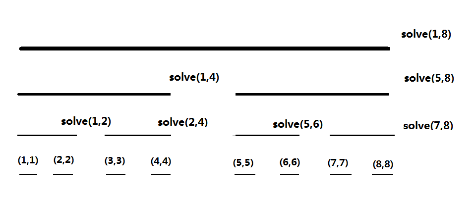

## 引子

什么是 cdq 分治呢？，其实他是一种思想而不是具体的算法（就和 dp 是一样的），因此 cdq 分治涵盖的范围相当的广泛，由于这样的思路最早是被陈丹琪引入国内的，所以就叫 cdq 分治了

现在 oi 界对于 cdq 分治这个思想的拓展十分广泛，但是这些都叫 cdq 的东西其实原理和写法上并不相同不过我们可以大概的将它们分为三类

 **1.cdq 分治解决和点对有关的问题** 

 **2.cdq 分治优化 1D/1D 动态规划的转移** 

 **3. 通过 cdq 分治，将一些动态问题转化为静态问题** 

* * *

## CDQ 分治解决和点对有关的问题

这类问题一般是给你一个长度为 n 的序列，然后让你统计有一些特性的点对 $(i,j)$ 有多少个，又或者说是找到一对点 $(i,j)$ 使得一些函数的值最大之类的问题

那么 cdq 分治基于这样一个算法流程解决这类问题

 **1. 找到这个序列的中点 $mid$ ** 

 **2. 将所有点对 $(i,j)$ 划分为 3 类** 

 **第一种是 $1 \leq i \leq mid,1 \leq j \leq mid$ 的点对** 

 **第二种是 $1  \leq i \leq mid ,mid+1 \leq j \leq n$ 的点对** 

 **第三种是 $mid+1 \leq  i \leq n,mid+1 \leq j \leq n$ 的点对** 

 **3. 将 $(1,n)$ 这个序列拆成两个序列 $(1,mid)$ 和 $(mid+1,n)$ ** 

 **会发现第一类点对和第三类点对都在这两个序列之中，递归的去解决这两类点对** 

 **4. 想方设法处理一下第二类点对的信息** 

_实际应用的时候我们通常都是写一个函数 $solve(l,r)$ 表示我们正在处理 $l \leq i \leq r,l \leq j \leq r$ 的点对_

_所以刚才的算法流程中的递归部分我们就是通过 $solve(l,mid),solve(mid,r)$ 来实现的_

所以说 cdq 分治只是一种十分模糊的思想，可以看到这种思想就是不断的把点对通过递归~~（甩锅）~~的方式分给左右两个区间

至于我们设计出来的算法真正干活的部分就是第 4 部分需要我们想方设法解决的部分了

所以说让我们上几道例题看一下第四部分一般该怎么写

比如说我们来一个 cdq 分治的经典问题——三维偏序

### 三维偏序

给定一个序列，每个点有两个属性 $(a,b)$ ，试求：这个序列里有多少对点对 $(i,j)$ 满足 $i<j,a_{i}<a_{j},b_{i}<b_{j}$ 

统计序列里点对的个数？我们给他套个 cdq 试试。

好了假设我们现在正在 $solve(l,r)$ 并且通过某些奥妙重重的手段搞定了 $solve(l,mid)$ 和 $solve(mid+1,r)$ （其实就是递归）

那么我们现在就是统计满足 $l \leq i \leq mid,mid+1 \leq j \leq r$ 的点对 $(i,j)$ 中，有多个点对还满足 $i<j,a_{i}<a_{j},b_{i}<b_{j}$ 的限制条件咯

然后你会发现那个 $i<j$ 的限制条件没啥用了，既然 $i$ 比 $mid$ 小 $j$ 比 $mid$ 大，那 $i$ 肯定比 $j$ 要小

你又发现现在还剩下两个限制条件 $a_{i}<a_{j},b_{i}<b_{j}$ , 根据这个限制条件我们就可以枚举 $j$ , 求出有多少个满足条件的 $i$ 

为了方便枚举，我们把 $(l,mid)$ 和 $(mid+1,r)$ 中的点全部按照 $a$ 值从小到大排个序

之后我们依次枚举每一个 $j$ , 把所有 $a_{i}<a_{j}$ 的点 $i$ 全部插入到某一个神奇数据结构里，

此时只要对这个神奇数据结构询问一发：这个数据结构里有多少个点的 $b$ 值是小于 $b_{j}$ 的，我们就对于这个点 $j$ 求出了有多少个 $i$ 可以和他合法的匹配了

问题来了那个神奇数据结构叫什么呢？

树状数组啊

当我们插入一个 $b$ 值等于 $x$ 的点时，我们就令树状数组的 $x$ 这个位置单点 + 1，而查询数据结构里有多少个点小于 $x$ 的操作实际上就是在求前缀和，只要我们事先对于所有的 b 值做了离散化我们的复杂度就是对的

问题又来了，对于每一个 $j$ 我们都需要将所有 $a_{i}<a_{j}$ 的点 $i$ 插入树状数组中，这样的话我们总共要对树状数组做 $O(n^2)$ 次操作啊，怎么办呢？

还记得你把所有的 $i$ 和 $j$ 都事先按照 $a$ 值排好序了吗？我们以双指针的方式在树状数组里插入点，这样的话我们就只需要做 $O(n)$ 次插入操作啦~

所以通过这样一个算法流程我们就用 $O(nlogn)$ 的时间处理完了关于第 $2$ 类点对的信息了

这样的话我们的算法复杂度就是 $T(n)=T(\lfloor \frac{n}{2} \rfloor)+T(\lceil \frac{n}{2} \rceil)+O(nlogn)=O(nlog^2n)$ 了

### 例题[CQOI2011]动态逆序对

仔细推一下就是和三维偏序差不多的式子了，基本就是一个三维偏序的板子

```cpp
#include <algorithm>
#include <cstdio>
using namespace std;
typedef long long ll;
int n;
int m;
struct treearray {
  int ta[200010];
  inline void ub(int& x) { x += x & (-x); }
  inline void db(int& x) { x -= x & (-x); }
  inline void c(int x, int t) {
    for (; x <= n + 1; ub(x)) ta[x] += t;
  }
  inline int sum(int x) {
    int r = 0;
    for (; x > 0; db(x)) r += ta[x];
    return r;
  }
} ta;
struct data {
  int val;
  int del;
  int ans;
} a[100010];
int rv[100010];
ll res;
bool cmp1(const data& a, const data& b) { return a.val < b.val; }
bool cmp2(const data& a, const data& b) { return a.del < b.del; }
void solve(int l, int r) {
  if (r - l == 1) {
    return;
  }
  int mid = (l + r) / 2;
  solve(l, mid);
  solve(mid, r);
  int i = l + 1;
  int j = mid + 1;
  while (i <= mid) {
    while (a[i].val > a[j].val && j <= r) {
      ta.c(a[j].del, 1);
      j++;
    }
    a[i].ans += ta.sum(m + 1) - ta.sum(a[i].del);
    i++;
  }
  i = l + 1;
  j = mid + 1;
  while (i <= mid) {
    while (a[i].val > a[j].val && j <= r) {
      ta.c(a[j].del, -1);
      j++;
    }
    i++;
  }
  i = mid;
  j = r;
  while (j > mid) {
    while (a[j].val < a[i].val && i > l) {
      ta.c(a[i].del, 1);
      i--;
    }
    a[j].ans += ta.sum(m + 1) - ta.sum(a[j].del);
    j--;
  }
  i = mid;
  j = r;
  while (j > mid) {
    while (a[j].val < a[i].val && i > l) {
      ta.c(a[i].del, -1);
      i--;
    }
    j--;
  }
  sort(a + l + 1, a + r + 1, cmp1);
  return;
}
int main() {
  scanf("%d%d", &n, &m);
  for (int i = 1; i <= n; i++) {
    scanf("%d", &a[i].val);
    rv[a[i].val] = i;
  }
  for (int i = 1; i <= m; i++) {
    int p;
    scanf("%d", &p);
    a[rv[p]].del = i;
  }
  for (int i = 1; i <= n; i++) {
    if (a[i].del == 0) a[i].del = m + 1;
  }
  for (int i = 1; i <= n; i++) {
    res += ta.sum(n + 1) - ta.sum(a[i].val);
    ta.c(a[i].val, 1);
  }
  for (int i = 1; i <= n; i++) {
    ta.c(a[i].val, -1);
  }
  solve(0, n);
  sort(a + 1, a + n + 1, cmp2);
  for (int i = 1; i <= m; i++) {
    printf("%lld\n", res);
    res -= a[i].ans;
  }
  return 0;
}
```

* * *

## CDQ 分治优化 1D/1D 动态规划的转移

所谓 1D/1D 动态规划就是说我们的 dp 数组是 1 维的，转移是 $O(n)$ 的一类 dp 问题，如果条件良好的话我们有些时候可以通过 cdq 分治来把这类问题的时间复杂度由 $O(n^2)$ 降至 $O(nlog^2n)$ 

那么比如说我们要优化这样的一个 $dp$ 式子给你一个序列每个元素有两个属性 $a,b$ 我们希望计算一个 dp 式子的值，它的转移方程如下：

 $dp_{i}=1+ \max_{j=1}^{i-1}dp_{j}[a_{j}<a_{i}][b_{j}<b_{i}]$ 

_如果你足够熟练的话可以看出这就是一个二维最长上升子序列的 $dp$ 方程_

解释一下上面的式子就是说只有 $i<j,a_{i}<a_{j},b_{i}<b_{j}$ 的点 $j$ 可以去更新点 $i$ 的 dp 值

直接转移显然是 $O(n^2)$ 的，我们如何使用 $cdq$ 分治去优化它的转移过程呢？

这个转移过程相对来讲比较套路，我们先介绍算法流程然后再慢慢证明为什么这样是对的

我们发现 $dp_{j}$ 转移到 $dp_{i}$ 这种转移关系也是一种点对间的关系，所以我们像 $cdq$ 分治处理点对关系一样的来处理它

具体来讲我们这样写 cdq, 假设我们现在正在处理的区间是 $(l,r)$ ,

 **0. 如果 $l=r$ 说明我们的 $dp_{r}$ 值已经被计算好了，我们直接令 $dp_{r}++$ 然后返回即可** 

 **1. 先递归的 $solve(l,mid)$ ** 

 **2. 处理所有 $l \leq j \leq mid,mid+1 \leq i \leq r$ 的转移关系** 

 **3. 然后递归的 $solve(mid+1,r)$ ** 

那么第二步怎么做呢？

其实和 cdq 分治求三维偏序差不多，我们会发现处理 $l \leq j \leq mid,mid+1 \leq i \leq r$ 的转移关系的时候我们已经不用管 $j<i$ 这个限制条件了，因此我们依然是将所有的点 $i$ 和点 $j$ 按 $a$ 值进行排序处理之后用双指针的方式将 $j$ 点插入到树状数组里，然后最后查一发前缀最大值更新一下 $dp_{i}$ 就可以了

你会发现此时的 cdq 写法和上一种处理点对间关系的 cdq 写法最大的不同就是处理 $l \leq j \leq mid,mid+1 \leq i \leq r$ 的点对这一部分，上面的写法中这一部分我们放到哪里都是可以的，但是，在用 cdq 分治优化 dp 的时候这个流程却必须夹在 $solve(l,mid),solve(mid+1,r)$ 的中间，为什么呢？

因为 dp 的转移是 **有序的** ，我们的 dp 的转移必须满足两个条件否则就是不对的

 **1. 用来计算 $dp_{i}$ 的所有 $dp_{j}$ 值都必须是已经计算完毕的，不能存在 "半成品"** 

 **2. 用来计算 $dp_{i}$ 的所有 $dp_{j}$ 值都必须能更新到 $dp_{i}$ 不能存在有的 $dp_{j}$ 值没有更新到** 

上述两个条件可能在 $O(n^2)$ 暴力的时候是相当容易满足的，但是由于我们现在使用了 cdq 分治，很显然转移顺序被我们搞的乱七八糟了，所以我们有必要好好考虑一下我们这样做到底是不是对的

那就让我们看一看 cdq 分治的递归树好了



然后你会发现我们执行刚才的算法流程的话

你会发现比如说 $8$ 这个点的 $dp$ 值是在 $solve(1,8),solve(5,8),solve(7,8)$ 这 3 个函数中被更新完成的，而三次用来更新它的点分别是 $(1,4)(5,6)(7,7)$ 这三个不相交的区间

又比如说 $5$ 这个点它的 dp 值就是在 $solve(1,4)$ 函数中解决的，更新它的区间是 $(1,4)$ 

仔细观察就会发现一个 i 点的 dp 值被更新了 $log$ 次，而且，更新它的区间刚好是 $(1,i)$ 在线段树上被拆分出来的 log 个区间

因此我们的第 2 个条件就满足了，我们的确保证了所有合法的 $j$ 都去更新过点 $i$ 

我们接着分析我们算法的执行流程

第一个结束的函数是 $solve(1,1)$ 此时我们发现 $dp_{1}$ 的值已经计算完毕了

第一个执行转移过程的函数是 $solve(1,2)$ 此时我们发现 $dp_{2}$ 的值已经被转移好了

第二个结束的函数 $solve(2,2)$ 此时我们发现 $dp_{2}$ 的值已经计算完毕了

接下来 $solve(1,2)$ 结束， $(1,2)$ 这段区间的 $dp$ 值均被计算好

下一个执行转移流程的函数是 $solve(1,4)$ 这次转移结束之后我们发现 $dp_{3}$ 的值已经被转移好了

接下来结束的函数是 $solve(3,3)$ 我们会发现 $dp_{3}$ 的 dp 值被计算好了

接下来执行的转移是 $solve(2,4)$ 此时 $dp_{4}$ 在 $solve(1,4)$ 中被 $(1,2)转移了一次,这次又被$ (3,3)$ 转移了

因此 $dp_{4}$ 的值也被转移好了

接下来 $solve(4,4)$ 结束 $dp_{4}$ 的值被计算完毕

接下来 $solve(3,4)$ 结束 $(3,4)$ 的值被计算完毕了

接下来 $solve(1,4)$ 结束 $(1,4)$ 的值被计算完毕了

通过我们刚才手玩了半个函数流程我们会发现一个令人惊讶的事实就是每次 $solve(l,r)$ 结束的时候 $(l,r)$ 区间的 dp 值全部会被计算好，由于我们每一次执行转移函数的时候由于 $solve(l,mid)$ 已经结束，因此我们每一次执行的转移过程都是合法的

在刚才的过程我们发现，如果将 cdq 分治的递归树看成一颗线段树，那么 cdq 分治就是这个线段树的 **中序遍历函数** ，因此我们相当于按顺序处理了所有的 dp 值，只是转移顺序被拆开了而已，所以我们的算法是正确的

* * *

### 例题[SDOI2011]拦截导弹

一道二维最长上升子序列的题，为了确定某一个元素是否在最长上升子序列中可以正反跑两遍 CDQ

```C
#include<cstdio>
#include<algorithm>
using namespace std;
typedef double db;const int N=1e6+10;
struct data{int h;int v;int p;int ma;db ca;}a[2][N];int n;bool tr;
inline bool cmp1(const data& a,const data& b){if(tr)return a.h>b.h;else return a.h<b.h;}
inline bool cmp2(const data& a,const data& b){if(tr)return a.v>b.v;else return a.v<b.v;}
inline bool cmp3(const data& a,const data& b){if(tr)return a.p<b.p;else return a.p>b.p;}
inline bool cmp4(const data& a,const data& b){return a.v==b.v;}
struct treearray
{
    int ma[2*N];db ca[2*N];
    inline void c(int x,int t,db c)
    {for(;x<=n;x+=x&(-x)){if(ma[x]==t){ca[x]+=c;}else if(ma[x]<t){ca[x]=c;ma[x]=t;}}}
    inline void d(int x){for(;x<=n;x+=x&(-x)){ma[x]=0;ca[x]=0;}}
    inline void q(int x,int& m,db& c)
    {for(;x>0;x-=x&(-x)){if(ma[x]==m){c+=ca[x];}else if(m<ma[x]){c=ca[x];m=ma[x];}}}
}ta;int rk[2][N];
inline void solve(int l,int r,int t)
{
    if(r-l==1){return;}int mid=(l+r)/2;
    solve(l,mid,t);sort(a[t]+mid+1,a[t]+r+1,cmp1);int p=l+1;
    for(int i=mid+1;i<=r;i++)
    {
        for(;(cmp1(a[t][p],a[t][i])||a[t][p].h==a[t][i].h)&&p<=mid;p++)
        {ta.c(a[t][p].v,a[t][p].ma,a[t][p].ca);}db c=0;int m=0;ta.q(a[t][i].v,m,c);
        if(a[t][i].ma<m+1){a[t][i].ma=m+1;a[t][i].ca=c;}else if(a[t][i].ma==m+1){a[t][i].ca+=c;}
    }for(int i=l+1;i<=mid;i++){ta.d(a[t][i].v);}
    sort(a[t]+mid,a[t]+r+1,cmp3);solve(mid,r,t);
    sort(a[t]+l+1,a[t]+r+1,cmp1);
}
inline void ih(int t)
{
    sort(a[t]+1,a[t]+n+1,cmp2);rk[t][1]=1;
    for(int i=2;i<=n;i++){rk[t][i]=(cmp4(a[t][i],a[t][i-1]))?rk[t][i-1]:i;}
    for(int i=1;i<=n;i++){a[t][i].v=rk[t][i];}sort(a[t]+1,a[t]+n+1,cmp3);
    for(int i=1;i<=n;i++){a[t][i].ma=1;a[t][i].ca=1;}
}int len;db ans;
int main()
{
    scanf("%d",&n);
    for(int i=1;i<=n;i++)
    {
        scanf("%d%d",&a[0][i].h,&a[0][i].v);a[0][i].p=i;
        a[1][i].h=a[0][i].h;a[1][i].v=a[0][i].v;a[1][i].p=i;
    }ih(0);solve(0,n,0);tr=1;ih(1);solve(0,n,1);tr=1;
    sort(a[0]+1,a[0]+n+1,cmp3);sort(a[1]+1,a[1]+n+1,cmp3);
    for(int i=1;i<=n;i++){len=max(len,a[0][i].ma);}printf("%d\n",len);
    for(int i=1;i<=n;i++){if(a[0][i].ma==len){ans+=a[0][i].ca;}}
    for(int i=1;i<=n;i++)
    {
        if(a[0][i].ma+a[1][i].ma-1==len){printf("%.5lf ",(a[0][i].ca*a[1][i].ca)/ans);}
        else {printf("0.00000 ");}
    }return 0;
}
```

* * *

## 需要 CDQ 将动态问题转化为静态问题的题

我们会发现 CDQ 分治一般是一种处理序列问题的套路，通过将序列折半之后递归处理点对间的关系来获得良好的复杂度

不过在这一部分当中我们分治的却不是一般的序列而是时间序列

什么意思呢？

众所周知的是有些数据结构题需要我们兹次做 xxx 修改然后做 xxx 询问的情况

然后你会发现一个有趣的事实是如果我们把询问进行离线之后，所有操作按照时间自然的排成了一个序列，另一个比较显然的事实是每一个修改会对它之后的询问发生关系，而这样的修改 - 询问关系一共会有 $O(n^2)$ 对

因此我们可以使用 cdq 分治对于这个操作序列进行分治，按照 cdq 分治处理修改和询问之间的关系

还是和处理点对关系的 cdq 分治类似，我们假设我们正在分治的序列是 $(l,r)$ , 我们先递归的处理 $(l,mid)$ 和 $(mid,r)$ 之间的修改 - 询问关系

接下来我们处理所有 $l \leq i \leq mid,mid+1 \leq j \leq r$ 并且 $i$ 是一个修改并且 $j$ 是一个询问的修改 - 询问关系

注意如果我们的各个修改之间是 **独立** 的话我们不需要管处理 $l \leq i \leq mid,mid+1 \leq j \leq r$ 和 $solve(l,mid)$ 以及 $solve(mid+1,r)$ 之间时序关系（比如你的修改就是普通的加法和减法问题之类的）

但是如果你的各个修改之间并不独立，比如说我们的修改是一个赋值操作，这样的话我们做完这个赋值操作之后序列长什么样可能需要依赖于之前的序列长什么样

那这样的话我们处理所有跨越 mid 的修改 - 询问关系的时候就必须把它放在 $solve(l,mid)$ 和 $solve(mid+1,r)$ 之间了，理由和 cdq 分治优化 1D/1D 动态规划的原因是一样的，按照中序遍历序进行分治，然后我们就可以保证每一个修改都是严格按照时间顺序被执行的

这样光说是没办法解决我们的问题的，因此我们还是上道例题吧

### 矩形加矩形求和

这里的矩形加矩形求和就是字面意思上的矩形加矩形求和，让你维护一个二维平面，然后支持在一个矩形区域内加一个数字，每次询问一个矩形区域的和

那么对于这个问题的静态版本，也就是二维平面里有一堆矩形，我们希望询问一个矩形区域的和这个问题，我们是有一个经典做法叫线段树 + 扫描线的

具体来讲就是我们将每个矩形拆成插入和删除两个操作，将每个询问拆成两个前缀和相减的形式然后离线跑一波就可以了

问题来了啊，我们现在的问题是动态的啊，怎么办呢？

不如强行套一个 cdq 分治试试？

我们将所有的询问和修改操作全部离线，这些操作形成了一个序列，并且有 $O(N^2)$ 对修改 - 询问的关系

那么我们依然使用 cdq 分治的一般套路，将所有的关系分成三类，在这一层分治过程当中仅仅处理跨越 $mid$ ，的修改 - 询问关系，而剩下的修改 - 询问关系通过递归的的方式来解决

那么这样的话我们会发现这样的一个事实就是所有的修改都在询问之前被做出了

这个问题就等价于平面上有静态的一堆矩形接下来不停的询问一个矩形区域的和了

那么我们可以套一个扫描线在 $O(nlogn)$ 的时间内处理好所有跨越 $mid$ 的修改 - 询问关系

剩下的事情就是递归的分治左右两侧修改 - 询问关系来解决这个问题了

这样实现的 cdq 分治的话你会发现同一个询问被处理了 $O(logn)$ 次来回答，不过没有关系因为每次贡献这个询问的修改是互不相交的

时间复杂度为 $T(n)=T(\lfloor \frac{n}{2} \rfloor)+T(\lceil \frac{n}{2} \rceil)+ O(nlogn)=O(nlog^2n)$ 

观察上述的算法流程，我们发现一开始我们只能解决静态的矩形加矩形求和问题，但是只是简单的套了一个 cdq 分治上去我们就可以离线的解决一个动态的矩形加矩形求和问题了。

那么我们可以将动态问题转化为静态问题的精髓就在于 cdq 分治每次仅仅处理跨越某一个点的修改和询问关系了，这样的话我们就只需要考虑所有询问都在修改之后这个简单的问题了。

也正是因为这一点 cdq 分治被称为 **动态问题转化为静态问题的工具** 

### [Ynoi2016]镜中的昆虫

一句话题意区间赋值区间数颜色

我们维护一下每个位置左侧第一个同色点的位置，记为 $pre_{i}$ ，此时区间数颜色就被转化为了一个经典的二维数点问题

通过将连续的一段颜色看成一个点的方式我们可以证明 $pre$ 的变化量是 $O(n+m)$ 的，换句话说单次操作仅仅引起 $O(1)$ 的 $pre$ 值变化，那么我们可以用 cdq 分治来解决动态的单点加矩形求和问题

 $pre$ 数组的具体变化可以使用 $std::set$ 来进行处理（这个用 set 维护连续的区间的技巧也被称之为_old driver tree_)

```C
#include<cstdio>
#include<algorithm>
#include<set>
#include<map> 
#define SNI set <nod> :: iterator 
#define SDI set <data> :: iterator 
using namespace std;const int N=1e5+10;int n;int m;int pre[N];int npre[N];int a[N];int tp[N];int lf[N];int rt[N];int co[N];
struct modi{int t;int pos;int pre;int va;friend bool operator <(modi a,modi b){return a.pre<b.pre;}}md[10*N];int tp1;
struct qry{int t;int l;int r;int ans;friend bool operator <(qry a,qry b){return a.l<b.l;}}qr[N];int tp2;int cnt;
inline bool cmp(const qry& a,const qry& b){return a.t<b.t;}
inline void modify(int pos,int co)//修改函数
{
    if(npre[pos]==co)return;md[++tp1]=(modi){++cnt,pos,npre[pos],-1};
    md[++tp1]=(modi){++cnt,pos,npre[pos]=co,1};
}
namespace prew
{
    int lst[2*N];map <int,int> mp;//提前离散化
    inline void prew()
    {
        scanf("%d%d",&n,&m);for(int i=1;i<=n;i++)scanf("%d",&a[i]),mp[a[i]]=1;
        for(int i=1;i<=m;i++){scanf("%d%d%d",&tp[i],&lf[i],&rt[i]);if(tp[i]==1)scanf("%d",&co[i]),mp[co[i]]=1;}
        map <int,int> :: iterator it,it1;
        for(it=mp.begin(),it1=it,++it1;it1!=mp.end();++it,++it1)it1->second+=it->second;
        for(int i=1;i<=n;i++)a[i]=mp[a[i]];for(int i=1;i<=n;i++)if(tp[i]==1)co[i]=mp[co[i]];
        for(int i=1;i<=n;i++)pre[i]=lst[a[i]],lst[a[i]]=i;for(int i=1;i<=n;i++)npre[i]=pre[i];
    }
}
namespace colist
{
    struct data {int l;int r;int x;friend bool operator <(data a,data b){return a.r<b.r;}};set <data> s;
    struct nod {int l;int r;friend bool operator <(nod a,nod b){return a.r<b.r;}};set <nod> c[2*N];set <int> bd;
    inline void split(int mid)//将一个节点拆成两个节点
    {
        SDI it=s.lower_bound((data){0,mid,0});data p=*it;if(mid==p.r)return;
        s.erase(p);s.insert((data){p.l,mid,p.x});s.insert((data){mid+1,p.r,p.x});
        c[p.x].erase((nod){p.l,p.r});c[p.x].insert((nod){p.l,mid});c[p.x].insert((nod){mid+1,p.r});
    }
    inline void del(set <data> :: iterator it)//删除一个迭代器
    {
        bd.insert(it->l);SNI it1,it2;it1=it2=c[it->x].find((nod){it->l,it->r});
        ++it2;if(it2!=c[it->x].end())bd.insert(it2->l);c[it->x].erase(it1);s.erase(it);
    }
    inline void ins(data p)//插入一个节点
    {
        s.insert(p);SNI it=c[p.x].insert((nod){p.l,p.r}).first;++it;
        if(it!=c[p.x].end()){bd.insert(it->l);}
    }
    inline void stv(int l,int r,int x)//区间赋值
    {
        if(l!=1)split(l-1);split(r);int p=l;//split两下之后删掉所有区间
        while(p!=r+1){SDI it=s.lower_bound((data){0,p,0});p=it->r+1;del(it);}
        ins((data){l,r,x});//扫一遍set处理所有变化的pre值
        for(set <int> :: iterator it=bd.begin();it!=bd.end();++it)
        {
            SDI it1=s.lower_bound((data){0,*it,0});
            if(*it!=it1->l)modify(*it,*it-1);
            else
            {
                SNI it2=c[it1->x].lower_bound((nod){0,*it});
                if(it2!=c[it1->x].begin())--it2,modify(*it,it2->r);else modify(*it,0);
            }
        }bd.clear();
    }
    inline void ih()
    {
        int nc=a[1];int ccnt=1;//将连续的一段插入到set中
        for(int i=2;i<=n;i++)
            if(nc!=a[i]){s.insert((data){i-ccnt,i-1,nc}),c[nc].insert((nod){i-ccnt,i-1});nc=a[i];ccnt=1;}
            else {ccnt++;} s.insert((data){n-ccnt+1,n,a[n]}),c[a[n]].insert((nod){n-ccnt+1,n});
    }
}
namespace cdq
{   
    struct treearray//树状数组
    {
        int ta[N];
        inline void c(int x,int t){for(;x<=n;x+=x&(-x))ta[x]+=t;}
        inline void d(int x){for(;x<=n;x+=x&(-x))ta[x]=0;}
        inline int  q(int x){int r=0;for(;x;x-=x&(-x))r+=ta[x];return r;}
        inline void clear(){for(int i=1;i<=n;i++)ta[i]=0;}
    }ta;int srt[N];
    inline bool cmp1(const int& a,const int& b){return pre[a]<pre[b];}
    inline void solve(int l1,int r1,int l2,int r2,int L,int R)//cdq
    {
        if(l1==r1||l2==r2)return;int mid=(L+R)/2;
        int mid1=l1;while(mid1!=r1&&md[mid1+1].t<=mid)mid1++;
        int mid2=l2;while(mid2!=r2&&qr[mid2+1].t<=mid)mid2++;
        solve(l1,mid1,l2,mid2,L,mid);solve(mid1,r1,mid2,r2,mid,R);
        if(l1!=mid1&&mid2!=r2)
        {
            sort(md+l1+1,md+mid1+1);sort(qr+mid2+1,qr+r2+1);
            for(int i=mid2+1,j=l1+1;i<=r2;i++)//考虑左侧对右侧贡献
            {
                while(j<=mid1&&md[j].pre<qr[i].l)ta.c(md[j].pos,md[j].va),j++;
                qr[i].ans+=ta.q(qr[i].r)-ta.q(qr[i].l-1);
            }for(int i=l1+1;i<=mid1;i++)ta.d(md[i].pos);
        }
    }
    inline void mainsolve()
    {
        colist::ih();for(int i=1;i<=m;i++)
            if(tp[i]==1)colist::stv(lf[i],rt[i],co[i]);else qr[++tp2]=(qry){++cnt,lf[i],rt[i],0};
        sort(qr+1,qr+tp2+1);for(int i=1;i<=n;i++)srt[i]=i;sort(srt+1,srt+n+1,cmp1);
        for(int i=1,j=1;i<=tp2;i++)//初始化一下每个询问的值
        {
            while(j<=n&&pre[srt[j]]<qr[i].l)ta.c(srt[j],1),j++;
            qr[i].ans+=ta.q(qr[i].r)-ta.q(qr[i].l-1);
        }ta.clear();sort(qr+1,qr+tp2+1,cmp);solve(0,tp1,0,tp2,0,cnt);sort(qr+1,qr+tp2+1,cmp);
        for(int i=1;i<=tp2;i++)printf("%d\n",qr[i].ans);
    }
}
int main(){prew::prew();cdq::mainsolve();return 0;}//拜拜程序~
```

### [HNOI2010]城市建设

一句话题意：给定一张图支持动态的修改边权，要求在每次修改边权之后输出这张图的最小生成树的最小代价和

事实上有一个线段树分治套 lct 的做法可以解决这个问题，但是这个实现方式常数过大可能需要精妙的卡常技巧才可以通过本题，因此我们不妨考虑 cdq 分治来解决这个问题

和一般的 cdq 分治解决的问题不同，我们此时 cdq 分治的时候并没有修改和询问的关系来让我们进行分治，因为我们是没有办法单独的考虑修改一个边对整张图的最小生成树有什么贡献，因此似乎传统的 cdq 分治思路似乎不是很好使

那么我们通过刚才的例题可以发现一般的 cdq 分治和线段树有着特殊的联系，我们在 cdq 分治的过程中其实隐式的建了一颗线段树出来（因为 cdq 分治的递归树就是一颗线段树）

通常的 cdq 是考虑线段树左右儿子之间的联系

而对于这道题来讲我们需要考虑的是父亲和孩子之间的关系

换句话来讲，我们在 $solve(l,r)$ 这段区间的时候如果我们可以想办法使图的规模变成和区间长度相关的一个变量的话我们就可以解决这个问题了

那么具体来讲如何设计算法呢？

假设我们正在构造 $(l,r)$ 这段区间的最小生成树边集，并且我们已知它父亲最小生成树的边集

我们将在 $(l,r)$ 这段区间中发生变化的边分别将边权赋成 $+ \infty$ 和 $-\infty$ 分别各跑一边 kruskal 求出那些边在最小生成树当中

对于一条边来讲，如果他没有出现在了所有被修改的边权都被赋成了 $+\infty$ 的最小生成树当中证明它不可能出现在 $(l,r)$ 这些询问的最小生成树当中，所以我们仅仅在 $(l,r)$ 的边集中加入最小生成树的树边

对于一条边来讲，如果它出现在了所有被修改的边权都被赋成了 $- \infty$ 的最小生成树当中，就证明它一定会出现 $(l,r)$ 这段的区间的最小生成树当中，这样的话我们就可以使用并查集将这些边对应的点缩起来，并且将答案加上这些边的边权

如此这般我们就将 $(l,r)$ 这段区间的边集构造出来了，用这些边求出来的最小生成树和直接求原图的最小生成树等价

那么为什么我们的复杂度是对的呢？

首先被修改的边一定会加入到我们的边集当中去，这些边的数目是 $O(len)$ 级别的

接下来我们需要证明的是边集当中不会有过多的未被修改的边

注意到我们只会加入所有边权取 $+\infty$ 最小生成树的树边，因此我们加入的边数目是不会超过当前图的点数的

接下来我们只需证明每递归一层图的点数是 $O(len)$ 级别的就可以说明图的边数是 $O(len)$ 级别的了

证明点数是 $O(len)$ 几倍就变的十分简单了，我们每次向下递归的时侯缩掉的边是在 $-\infty$ 生成树中出现的未被修改边，那么反过来想就是我们割掉了出现在 $-\infty$ 生成树当中的所有的被修改边，显然我们最多割掉 $len$ 条边，整张图最多分裂成 $O(len)$ 个连通块，这样的话新图点数就是 $O(len)$ 级别的了

所以我们就证明了每次我们用来跑 kruskal 的图都是 $O(len)$ 级别的了

从而每一层的时间复杂度都是 $(nlogn)$ 了

因此我们的时间复杂度就是 $T(n)=T(\lfloor \frac{n}{2} \rfloor)+T(\lceil \frac{n}{2} \rceil)+ O(nlogn)=O(nlog^2n)$ 了

代码实现上可能会有一些难度，需要注意的是并查集不能使用路径压缩，否则就不支持回退操作了，执行缩点操作的时候也没有必要真的执行，而是每一层的 kruskal 都在上一层的并查集里直接做就可以了

```C
#include<cstdio>
#include<algorithm>
#include<vector>
#include<stack>
using namespace std;
typedef long long ll;
int n;int m;int ask;
struct bcj
{
    int fa[20010];int size[20010];
    struct opt{int u;int v;};stack <opt> st;
    inline void ih(){for(int i=1;i<=n;i++)fa[i]=i,size[i]=1;}
    inline int f(int x){return (fa[x]==x)?x:f(fa[x]);}
    inline void u(int x,int y)//带撤回
    {
        int u=f(x);int v=f(y);if(u==v)return;if(size[u]<size[v])swap(u,v);
        size[u]+=size[v];fa[v]=u;opt o;o.u=u;o.v=v;st.push(o);   
    }
    inline void undo(){opt o=st.top();st.pop();fa[o.v]=o.v;size[o.u]-=size[o.v];}
    inline void clear(int tim){while(st.size()>tim){undo();}}
}s,s1;
struct edge//静态边
{
    int u;int v;ll val;int mrk;
    friend bool operator <(edge a,edge b){return a.val<b.val;}
}e[50010];
struct moved{int u;int v;};//动态边
struct query{int num;ll val;ll ans;}q[50010];bool book[50010];//询问
vector <edge> ve[30];vector <moved> vq;vector <edge> tr;ll res[30];int tim[30];
inline void pushdown(int dep)//缩边
{
    tr.clear();//这里要复制一份，以免无法回撤操作
    for(int i=0;i<ve[dep].size();i++){tr.push_back(ve[dep][i]);}
    sort(tr.begin(),tr.end());
    for(int i=0;i<tr.size();i++)//无用边
    {
        if(s1.f(tr[i].u)==s1.f(tr[i].v)){tr[i].mrk=-1;continue;}s1.u(tr[i].u,tr[i].v);
    }s1.clear(0);res[dep+1]=res[dep];
    for(int i=0;i<vq.size();i++){s1.u(vq[i].u,vq[i].v);}vq.clear();
    for(int i=0;i<tr.size();i++)//必须边
    {
        if(tr[i].mrk==-1||s1.f(tr[i].u)==s1.f(tr[i].v))continue;tr[i].mrk=1;
        s1.u(tr[i].u,tr[i].v);s.u(tr[i].u,tr[i].v);res[dep+1]+=tr[i].val;
    }s1.clear(0);ve[dep+1].clear();
    for(int i=0;i<tr.size();i++)//缩边
    {
        if(tr[i].mrk!=0)continue;
        edge p;p.u=s.f(tr[i].u);p.v=s.f(tr[i].v);if(p.u==p.v)continue;
        p.val=tr[i].val;p.mrk=0;ve[dep+1].push_back(p);
    }return;
}
inline void solve(int l,int r,int dep)
{
    tim[dep]=s.st.size();int mid=(l+r)/2;
    if(r-l==1)//终止条件
    {
        edge p;p.u=s.f(e[q[r].num].u);p.v=s.f(e[q[r].num].v);p.val=q[r].val;
        e[q[r].num].val=q[r].val;p.mrk=0;ve[dep].push_back(p);pushdown(dep);
        q[r].ans=res[dep+1];s.clear(tim[dep-1]);return;
    }
    for(int i=l+1;i<=mid;i++){book[q[i].num]=true;}
    for(int i=mid+1;i<=r;i++)//动转静
    {
        if(book[q[i].num])continue;
        edge p;p.u=s.f(e[q[i].num].u);p.v=s.f(e[q[i].num].v);
        p.val=e[q[i].num].val;p.mrk=0;ve[dep].push_back(p);
    }
    for(int i=l+1;i<=mid;i++)//询问转动态
    {
        moved p;p.u=s.f(e[q[i].num].u);p.v=s.f(e[q[i].num].v);vq.push_back(p);
    }pushdown(dep);//下面的是回撤
    for(int i=mid+1;i<=r;i++){if(book[q[i].num])continue;ve[dep].pop_back();}
    for(int i=l+1;i<=mid;i++){book[q[i].num]=false;}solve(l,mid,dep+1);
    for(int i=0;i<ve[dep].size();i++){ve[dep][i].mrk=0;}
    for(int i=mid+1;i<=r;i++){book[q[i].num]=true;}
    for(int i=l+1;i<=mid;i++)//动转静
    {
        if(book[q[i].num])continue;
        edge p;p.u=s.f(e[q[i].num].u);p.v=s.f(e[q[i].num].v);
        p.val=e[q[i].num].val;p.mrk=0;ve[dep].push_back(p);
    }
    for(int i=mid+1;i<=r;i++)//询问转动
    {
        book[q[i].num]=false;
        moved p;p.u=s.f(e[q[i].num].u);p.v=s.f(e[q[i].num].v);vq.push_back(p);
    }pushdown(dep);solve(mid,r,dep+1);
    s.clear(tim[dep-1]);return;//时间倒流至上一层
}
int main()
{
    scanf("%d%d%d",&n,&m,&ask);s.ih();s1.ih();
    for(int i=1;i<=m;i++){scanf("%d%d%lld",&e[i].u,&e[i].v,&e[i].val);}
    for(int i=1;i<=ask;i++){scanf("%d%lld",&q[i].num,&q[i].val);}
    for(int i=1;i<=ask;i++)//初始动态边
    {
        book[q[i].num]=true;moved p;p.u=e[q[i].num].u;
        p.v=e[q[i].num].v;vq.push_back(p);
    }
    for(int i=1;i<=m;i++){if(book[i])continue;ve[1].push_back(e[i]);}//初始静态
    for(int i=1;i<=ask;i++){book[q[i].num]=false;}solve(0,ask,1);
    for(int i=1;i<=ask;i++){printf("%lld\n",q[i].ans);}return 0;//拜拜程序~
}
```
